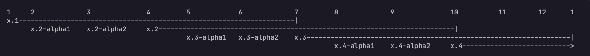

# Zeebe - Workflow Engine for Microservices Orchestration

Zeebe provides visibility into and control over business processes that span multiple microservices. It is the engine that powers [Camunda Platform 8](https://camunda.com/platform/zeebe/).

**Why Zeebe?**

* Define processes visually in [BPMN 2.0](https://www.omg.org/spec/BPMN/2.0.2/)
* Choose your programming language
* Deploy with [Docker](https://www.docker.com/) and [Kubernetes](https://kubernetes.io/)
* Build processes that react to messages from [Kafka](https://kafka.apache.org/) and other message queues
* Scale horizontally to handle very high throughput
* Fault tolerance (no relational database required)
* Export process data for monitoring and analysis
* Engage with an active community

[Learn more at camunda.com](https://camunda.com/platform/zeebe/)

## Release Lifecycle

Our release cadence within major releases is a minor release every three months, with an alpha release on each of the two months between minor releases. Releases happen on the second Tuesday of the month, Berlin time (CET).

Minor releases are supported with patches for six months after their release.

Here is a diagram illustrating the lifecycle of minor releases over a 13-month period:

## Status

To learn more about what we're currently working on, check the [GitHub issues](https://github.com/camunda/zeebe/issues?q=is%3Aissue+is%3Aopen+sort%3Aupdated-desc) and the [latest commits](https://github.com/camunda/zeebe/commits/main).

## Helpful Links

* [Releases](https://github.com/camunda/zeebe/releases)
* [Docker images](https://hub.docker.com/r/camunda/zeebe/tags?page=1&ordering=last_updated)
* [Blog](https://camunda.com/blog/category/process-automation-as-a-service/)
* [Documentation Home](https://docs.camunda.io)
* [Issue Tracker](https://github.com/camunda/zeebe/issues)
* [User Forum](https://forum.camunda.io)
* [Slack Channel](https://zeebe-slack-invite.herokuapp.com/)
* [Contribution Guidelines](/CONTRIBUTING.md)

## Recommended Docs Entries for New Users

* [What is Camunda Platform 8?](https://docs.camunda.io/docs/components/concepts/what-is-camunda-platform-8/)
* [Getting Started Tutorial](https://docs.camunda.io/docs/guides/)
* [Technical Concepts](https://docs.camunda.io/docs/components/zeebe/technical-concepts/)
* [BPMN Processes](https://docs.camunda.io/docs/components/modeler/bpmn/bpmn-primer/)
* [Installation and Configuration](https://docs.camunda.io/docs/self-managed/zeebe-deployment/)
* [Java Client](https://docs.camunda.io/docs/apis-clients/java-client/)
* [Go Client](https://docs.camunda.io/docs/apis-clients/go-client/)
* [Spring Integration](https://github.com/camunda-community-hub/spring-zeebe/)

## Contributing

Read the [Contributions Guide](/CONTRIBUTING.md).

## Code of Conduct

This project adheres to the [Camunda Code of Conduct](https://camunda.com/events/code-conduct/).
By participating, you are expected to uphold this code. Please [report](https://camunda.com/events/code-conduct/reporting-violations/)
unacceptable behavior as soon as possible.

## License

Zeebe source files are made available under the [Zeebe Community License
Version 1.1](/licenses/ZEEBE-COMMUNITY-LICENSE-1.1.txt) except for the parts listed
below, which are made available under the [Apache License, Version
2.0](/licenses/APACHE-2.0.txt).  See individual source files for details.

Available under the [Apache License, Version 2.0](/licenses/APACHE-2.0.txt):
- Java Client ([clients/java](/clients/java))
- Go Client ([clients/go](/clients/go))
- Exporter API ([exporter-api](/exporter-api))
- Protocol ([protocol](/protocol))
- Gateway Protocol Implementation ([gateway-protocol-impl](/gateway-protocol-impl))
- BPMN Model API ([bpmn-model](/bpmn-model))

### Clarification on gRPC Code Generation

The Zeebe Gateway Protocol (API) as published in the
[gateway-protocol](/gateway-protocol/src/main/proto/gateway.proto) is licensed
under the [Zeebe Community License 1.1](/licenses/ZEEBE-COMMUNITY-LICENSE-1.1.txt). Using gRPC tooling to generate stubs for
the protocol does not constitute creating a derivative work under the Zeebe Community License 1.1 and no licensing restrictions are imposed on the
resulting stub code by the Zeebe Community License 1.1.
