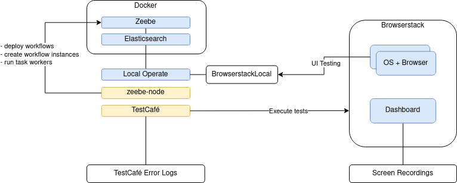

# E2E Tests

## Install TestCafe

Ensure that Node.js and yarn are installed on your computer and run the following command:

```sh
cd client/e2e
yarn install
```

## Run Operate backend

To run E2E dedicated backend (Zeebe on port 26503 + Operate on port 8081):

```sh
make start-e2e
```

To rerun (and clean up data), press Ctrl+C and run the same command again.

## Start Development Server

To start dev server and connect it to E2E related backend:

```sh
cd client
yarn start:e2e
```

## Run Tests

```sh
cd e2e
yarn test
```

## Nightly Tests in Browserstack

Our E2E tests are run every night automatically in Jenkins.

The job `e2e browserstack ALL` triggers child jobs (`e2e browserstack`) for each browser defined in the pipeline [test_e2e_browserstack_all.groovy](/.ci/pipelines/test_e2e_browserstack_all.groovy). Each child job is isolated and runs a fresh set of Zeebe, Elasticsearch docker containers and the latest Operate snapshot with no deployed processes. The tests are executed with TestCafé remotely in the specified environments and browsers in Browserstack. Child jobs are retried up to two times in case of flaky tests or browsers hangs on browserstack side. You can also trigger test runs for `e2e browserstack ALL` and `e2e browserstack` manually in Jenkins or rebuild the nightly job if necessary.


When the nightly e2e tests fail, a notification will be pushed to #operate-ci Slack channel with a link to the parent job. Please refer to the linked child jobs in the console output of the parent job. TestCafé error logs can be found in the Jenkins console output for `e2e browserstack` jobs. Console logs, network logs and a video of the recorded screen are accessible in Browserstack: https://automate.browserstack.com/dashboard/v2/?projectIds=975026. Please refer to `e2e browserstack` jobs' console output to get a link to the related browserstack run.

## Test local Operate remotely using Browserstack

You can also run the tests against a local Operate and still execute them remotely in Browserstack.



Ensure that you have the BrowserStackLocal binary installed on your system. This is needed to establish a connection to Browserstack: https://www.browserstack.com/local-testing/automate#establishing-a-local-testing-connection

Ensure that you have set the following environment variables for the Browserstack credentials. They can be found in the dashboard: https://automate.browserstack.com/dashboard/v2/  
`BROWSERSTACK_USERNAME`  
`BROWSERSTACK_ACCESS_KEY`

### Start BrowserStackLocal

```sh
./BrowserStackLocal --key $BROWSERSTACK_ACCESS_KEY --local-identifier TestCafe --daemon start --parallel-runs 1
```

### Run tests

```sh
yarn run test:browserstack
```

### Stop BrowserStackLocal

```sh
./BrowserStackLocal --key $BROWSERSTACK_ACCESS_KEY --local-identifier TestCafe --daemon stop
```
