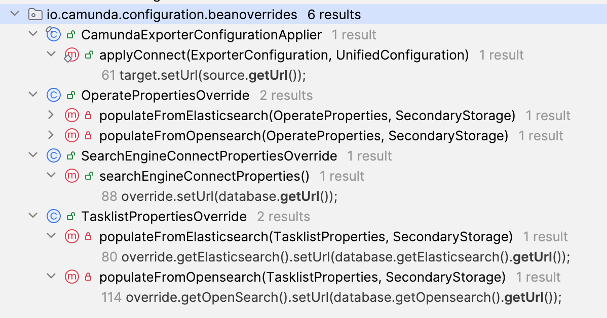

# Unified Configuration System

This Spring module implements the component used by the Camunda Orchestration Cluster to manage and consume the configuration.

## Context

Starting with Camunda 8.8, the webapps that were previously standalone and independent -Operate, Tasklist and Identity - have been merged into a single application, referred to as the Orchestration Cluster.

Despite these apps being part of the single application after the merging together of codebases, they originally still consumed their configurations independently. This was unintuitive and misleading, or in some more critical cases, dangerous.

With the Unified Configuration system, we replaced the previous configuration properties with a new set of properties that do not have redundancy across the webapps and that are consistent in naming and types.

## Features

### Unification

To illustrate the potential for misconfiguration resulting from this, consider the Elasticsearch URL property. It needed to be configured multiple times, once for each component:
* Operate:
```
camunda.operate.elasticsearch.url
```
* Tasklist:
```
camunda.tasklist.elasticsearch.url
```
* Exporter(s):
```
zeebe.broker.exporters.{exporterName}.args.connect.url
```
* Zeebe:
```
camunda.database.url
```
Moreover, repeated configuration was not easy to explain within the context of a single application for contributors and users. A User (or contributor) might understandably assume that by configuring `camunda.database.url` the URL was sufficiently configured. In reality, Tasklist and Operate would still be consuming the _old_ properties, respectively.

### Conventions

While the situation demonstrated above was the main concern of the legacy configuration system, other aspects of the configuration needed to be curated for a better User experience, such as:
* Making property names reference functional aspects of the application, rather than specific webapps/components, to resemble more correctly the single application.
* Formalising kebab-style casing for all application properties, rather than maintaining the previously used lowerCamelCase.
* Improving documentation for contributors and customers
* Discoverability of available properties was difficult when working with the codebase

### Units of measurements

When developing the Unified Configuration System, we also doubled down on coherence and consistency across the various properties:
* when a property expresses time, the Unified Configuration System supports its declaration as Duration (e.g., '10m' or '5s'), as opposed to the several instances, in the previous system, where legacy property names such as `zeebe.broker.exporting.distributionInterval` would not intuitively communicate to the User whether the time should be expressed in minutes, seconds, milliseconds or the likes
* when a property expresses size, the Unified Configuration System supports its declaration as DataSize (e.g., '10MB' or '2GB'), as opposed to the several instances, in the previous system, where legacy properties names such as `zeebe.broker.exporters.camundaexporter.args.bulk.memoryLimit` would not intuitively communicate to the User whether the size should be expressed in MB, GB, or the likes.

### Backwards compatibility

The backwards compatibility feature makes it possible to keep using the legacy properties, when possible. This way, a User is not necessarily required to change their configuration, or at least to change it entirely.

When a legacy property exists, there are 3 possible types of backwards compatibility between it and the unified new property, even though the application is currently using only 2 of them:

* backwards compatibility **SUPPORTED**
* backwards compatibility **SUPPORTED ONLY WITH MATCHING VALUES**
* backwards compatibility **NOT SUPPORTED** (currently not used anywhere)

#### Supported

In the [public documentation](https://docs.camunda.io/docs/next/self-managed/components/orchestration-cluster/core-settings/configuration/configuration-mapping/#about-unified-configuration-property-changes), this is often referred to as "direct mapping", meaning that there is a 1:1 association between the new unified property and the legacy property. This also implies that there only is 1 legacy property.

When backwards compatibility is supported, a legacy property can be used instead of the unified property. The configuration would work as expected and only a warning would be print in the log, suggesting that the legacy property should be replaced by the new unified property. An example would be the following:

The legacy configuration:
```
zeebe.broker.threads.cpuThreadCount=4
```
and the unified configuration:
```
camunda.system.cpu-thread-count=4
```
are functionally equivalent. By using the legacy property, the following warning would be print in the log:
```log
11:45:17.138 [] [io.camunda.application.StandaloneCamunda.main()] [] WARN  io.camunda.configuration.UnifiedConfigurationHelper - The following legacy configuration properties should be removed in favor of 'camunda.system.cpu-thread-count': zeebe.broker.threads.cpuThreadCount
```

#### Supported only with matching values

In the [public documentation](https://docs.camunda.io/docs/next/self-managed/components/orchestration-cluster/core-settings/configuration/configuration-mapping/#about-unified-configuration-property-changes), this is often referred to as "breaking change", as this option does not generally support backwards compatibility.

When backwards compatibility is supported only with matching values, the presence of a legacy property in the configuration set is allowed only if its value is compatible with either the corresponding, defined unified property value, or with the corresponding, default unified property value. If the legacy and the unified values are the same, the application starts normally, and warning is print in the log, similarly to what happens with the SUPPORTED case. Otherwise, the application would not start and an error would be print in the log, saying that the configuration has conflicts. An example of breaking configuration would be the following:

```
camunda.database.url=http://elasticsearch:9200
camunda.data.secondary-storage.elasticsearch.url=http://localhost:9200
```

This would break because "`http://elasticsearch:9200`" is different than "`http://localhost:9200`", creating a conflict at the moment of deciding what the endpoint for the database is.

Instead, the presence of the legacy property `camunda.database.url` would be allowed if the configuration is similar to the following:

```
camunda.database.url=http://elasticsearch:9200
camunda.data.secondary-storage.elasticsearch.url=http://elasticsearch:9200
```

Even though the legacy property is defined, as its value is equal to the one defined by the other property, the application would accept it with a warning in the log.

#### Not supported

This is not used anywhere in the application and it is currently reserved for the future (i.e., for when a property is deprecated and no longer allowed to be used). If a property is not supported, its definition in the config set would cause the application to stop with an error printed in the log.

## How it works and its limitations

To understand how the configuration system works, it is necessary to have context about the architecture it was built upon.

For technical reasons (see sub-sections below), we couldn't remove the whole system and replace it with the new, unified configuration system. The system currently works by taking values from the unified configuration and propagating them into the legacy variables. This way the consumers of the config are still reading the legacy variables. For example, the unified configuration `camunda.data.secondary-storage.elasticsearch.url` will override the following legacy properties:

* `camunda.database.url`
* `camunda.operate.elasticsearch.url`
* `camunda.tasklist.elasticsearch.url`
* `zeebe.broker.exporters.camundaexporter.args.connect.url`

With this propagation system, we can achieve different things:

* implement the unified configuration system incrementally
* handle explicitly backwards compatibility between unified properties and their corresponding legacy properties
* convert data from the unified format, with units of measurements, into the correct format read by the consumers
* log warnings and errors

### Implementation of the propagation system

We can understand how the system works by using the example of the URL mentioned above.

* The unified configuration is `camunda.data.secondary-storage.elasticsearch.url`, and one of the selling points of the new system was that such configuration variable has to be static. This means that, in the `configuration` spring-boot module, we can start by locating the file `Camunda.java`. From there, we can navigate through `Data.java` -> `SecondaryStorage.java` -> `Elasticsearch.java` -> `DocumentBasedSecondaryStorageDatabase.java`, where we finally find the getter `getUrl()`.

* The getter performs the validations that are needed for the specific field (we have some for the ES and OS URL) as well as the backwards compatibility checks (they happen through the method `UnifiedConfigurationHelper.validateLegacyConfiguration(...)`). This completes the declarative part of the new unified property.

* To find where the property is propagated, we can statically look for the usages of the getter, within the subpackage called `beanoverrides`:

<p align="center">
  
</p>

* For example, we can see that the bean `TasklistPropertiesOverride` is using it, and it's doing it as follows:

```java
final TasklistProperties override;
override.getElasticsearch().setUrl(database.getElasticsearch().getUrl());
```

* The object `TasklistProperties` is the bean that the application had **before** the Unified Configuration system was introduced. The UC system is calling `setUrl(x)` against that, where the value `x` is coming from the new, unified property. The entire system works like this, and there is (or there should be, if further development happens) one bean override per legacy bean that we want to rewrite.

* This way, the users can define `camunda.data.secondary-storage.elasticsearch.url`, while the consumer object of the app keeps receiving `camunda.tasklist.elasticsearch.url`.

### Why is it not simpler?

The cleanest and ideal implementation would be to inject the `UnifiedConfiguration` bean into the consumers, and consume the new properties simply by doing the following:

```java
@Autowired UnifiedConfiguration unifiedConfiguration;
...
String url = unifiedConfiguration.getCamunda().getData()
    .getSecondaryStorage().getElasticsearch().getUrl();
```

While this currently remains an objective for the Unified Configuration system to achieve, at the moment of the implementation it was not feasible. To achieve feasibility, the following refactoring work would be needed:

  * the legacy configuration objects and variables are removed from the webapps
  * once this partial refactoring is achieved, the `configuration` module can become independent of the webapps (i.e., it doesn't have to propagate values into `TasklistProperties`, `OperateProperties` and/or the likes)
  * therefore, the webapps can consume the new `configuration` module, without creating circular dependency problems

At the moment of the project realization, such work was evaluated to require too much development time, for the speed we wanted.

It is worth noticing that all of these changes would need to happen not only in the consumers, but also in all of the tests.

An alternative solution would be to declare interfaces to each consuming submodule, so that the `UnifiedConfiguration` bean could be retrieved into such interfaces by the webapps. This might simplify the refactoring work, but it would introduce some extra code, and refactoring would still be needed to go from the legacy objects to the new UC bean.

## Impact

Currently, it is not possible to inject the `UnifiedConfiguration` bean into the webapps. This means that if we want to add a new configuration property, in addition to extending the unified configuration system, we need an equivalent property in the legacy object to write the value into, via overrides. This variable can be consumed by the webapps, from the legacy config objects.
