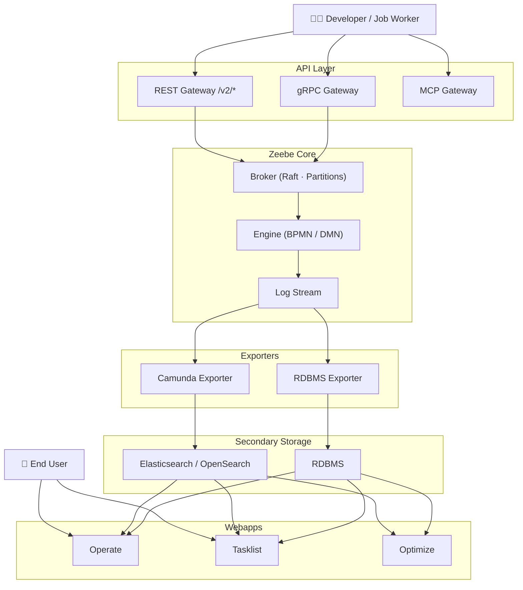

# Camunda 8 — Architecture Documentation

This directory contains living architecture artifacts for the `camunda/camunda` monorepo.
All diagrams use [Mermaid](https://mermaid.js.org/) and render natively in GitHub.

---

## Files

| File | Description |
|------|-------------|
| [modules.md](./modules.md) | Module-by-module reference: purpose, APIs, dependencies, external systems, key data objects |
| [architecture.mmd](./architecture.mmd) | Component diagram — runtime topology of all major components and their communication links |
| [data-flow.mmd](./data-flow.mmd) | Data-flow overview — four key data journeys traced end-to-end as a flowchart |
| [data-flow-sequences/](./data-flow-sequences/) | Detailed step-by-step sequence diagrams for each data journey |
| [plan.md](./plan.md) | The incremental approach used to produce this documentation |

---

## Architecture Diagram

> For the full diagram with all components, styling, and labels, open [`architecture.mmd`](./architecture.mmd).

---

## Data-Flow Sequence Diagrams

| # | File | Journey |
|---|------|---------|
| 1 | [01-deploy-process-definition.mmd](./data-flow-sequences/01-deploy-process-definition.mmd) | Deploy a BPMN process definition end-to-end |
| 2 | [02-process-instance-execution.mmd](./data-flow-sequences/02-process-instance-execution.mmd) | Create and execute a process instance with a job worker |
| 3 | [03-user-task-lifecycle.mmd](./data-flow-sequences/03-user-task-lifecycle.mmd) | User task created, claimed, and completed via Tasklist |
| 4 | [04-export-record-pipeline.mmd](./data-flow-sequences/04-export-record-pipeline.mmd) | Export record pipeline from engine to secondary storage and webapps |

---

## Module Coverage

The following modules are documented in [`modules.md`](./modules.md):

`zeebe/protocol` · `zeebe/exporter-api` · `zeebe/bpmn-model` · `zeebe/engine` ·
`zeebe/broker` · `zeebe/gateway (gRPC)` · `zeebe/exporters/camunda-exporter` ·
`zeebe/exporters/rdbms-exporter` · `search/` · `webapps-schema/` · `db/` ·
`service/` · `security/` · `authentication/` · `identity/` ·
`gateways/gateway-rest` · `gateways/gateway-mcp` · `operate/` · `tasklist/` ·
`optimize/` · `clients/java` · `clients/camunda-spring-boot-starter` ·
`webapps-common/` · `document/` · `configuration/` · `testing/` ·
`c8run/` · `qa/`
