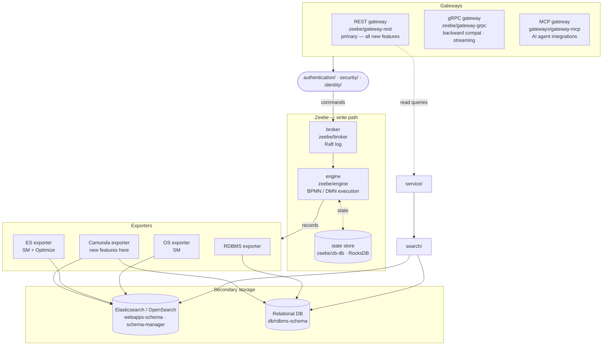

# Architecture Overview

## What this repo is

Camunda 8 is a process automation platform that executes BPMN workflows and evaluates DMN decisions
at scale, for both self-managed and SaaS deployments. The monorepo contains the full platform: Zeebe
(process engine), Operate (process monitoring), Tasklist (human task management),
Identity (authentication and authorization), and Optimize (process analytics), plus shared
libraries, gateways, and supporting infrastructure. Java backend built with Maven; React/Carbon
frontends. `dist/` wires the components into deployable Spring Boot application variants (e.g.
`StandaloneBroker`, `StandaloneCamunda`); components can also be deployed independently.

## Runtime topology

Camunda follows a **CQRS** (Command Query Responsibility Segregation) pattern: writes flow from a
gateway through the Zeebe broker/engine and land in secondary storage via exporters; reads go
directly from a gateway (through `service/` and `search/`) to secondary storage, bypassing the
broker/engine entirely. This keeps reads from affecting process execution performance.

### Write path

Clients submit commands (deploy a process, start an instance, complete a job) through one of three
entry points:

- **REST gateway** (`zeebe/gateway-rest`): exposes the Camunda REST API and is the primary entry
  point for new features. Commands flow through `service/`, which translates them into calls to the
  internal Zeebe gateway. `gateways/gateway-mapping-http` provides HTTP request/response mapping
  utilities used by this layer. All new core features must be exposed here first.
- **gRPC gateway** (`zeebe/gateway`, `zeebe/gateway-grpc`): exposes the Zeebe gRPC API defined in
  `zeebe/gateway-protocol`. Used by the Java client (`clients/java`) and the Spring Boot starter
  (`clients/camunda-spring-boot-starter`). Kept for backward compatibility and performance (gRPC is
  more efficient at scale; job streaming is gRPC-only).
- **MCP gateway** (`gateways/gateway-mcp`): exposes the Camunda API as a Model Context Protocol
  server for AI agent integrations.

All entry points authenticate via `authentication/` (OIDC token processing, Spring Security).
Authorization is enforced by `security/` against rules managed by `identity/`.

The **Zeebe broker** (`zeebe/broker`) receives commands, appends them to a partitioned append-only
log (Raft consensus via `zeebe/atomix`). The **Zeebe engine** (`zeebe/engine`) executes them
against its primary state store (RocksDB via `zeebe/zb-db`).

### Export path

After processing, the broker emits records to configured exporters:

|        Exporter        |                  Module                  |         Target          |
|------------------------|------------------------------------------|-------------------------|
| Elasticsearch exporter | `zeebe/exporters/elasticsearch-exporter` | Elasticsearch indices   |
| OpenSearch exporter    | `zeebe/exporters/opensearch-exporter`    | OpenSearch indices      |
| RDBMS exporter         | `zeebe/exporters/rdbms-exporter`         | Relational DB via `db/` |
| Camunda exporter       | `zeebe/exporters/camunda-exporter`       | All of the above        |

New feature work targets the Camunda Exporter. The dedicated Elasticsearch and OpenSearch exporters
remain supported for self-managed deployments but are no longer extended with new features (Optimize
still requires the Elasticsearch exporter).

For the Camunda Exporter, ES/OS index shapes are defined in `webapps-schema/` and applied at
startup by `schema-manager/`. The dedicated Elasticsearch and OpenSearch exporters manage their own
index templates independently (see `zeebe/exporters/elasticsearch-exporter/src/main/resources` and
`zeebe/exporters/opensearch-exporter/src/main/resources`). For RDBMS, the schema is defined in
`db/rdbms-schema`, which is written to by the RDBMS exporter.

The Camunda Exporter also runs background **archiver jobs** that move completed process data from
active ES/OS indices into dated archive indices (e.g. `operate-list-view-8.3.0_2024-01-01`),
keeping primary indices lean. Archiving is ES/OS-only; RDBMS deployments use TTL-based cleanup
instead. Search queries span both active and archive indices, using aliases.

### Read path

Operate and Tasklist query secondary storage (ES/OS or RDBMS) through the `search/` abstraction
layer. The REST API also serves read queries: `zeebe/gateway-rest` calls `service/`, which
delegates to `search/`.

Optimize manages its own ES/OS schema. It reads data emitted by the ES/OS exporters, transforming
it into data structures more suited for data analysis. Optimize entities (reports/collections) are
also stored in Optimize-managed indices. There is no RDBMS support for Optimize.

## Architectural decisions

Cross-cutting architectural decisions are recorded as ADRs in `docs/adr/`. Before making any
architectural change, check the index there first. If the decision is not covered by an existing
ADR, draft a new one using the `create-architecture-decision` skill before proceeding.

## Architectural boundaries

Contracts that must not be bypassed:

**Zeebe gRPC protocol** (`zeebe/gateway-protocol/src/main/proto/gateway.proto`)\
The interface between external clients and the gRPC gateway. Java stubs are generated at build time
in `zeebe/gateway-protocol-impl/`; never edit them manually. Changing the `.proto` requires
regenerating stubs and updating all consumers in `clients/`.

**Zeebe record/exporter contract** (`zeebe/exporter-api`, `zeebe/protocol`)\
The SBE-encoded record format emitted by the broker and consumed by exporters. Access broker state
only through this contract; never read from RocksDB directly.

**ES/OS index schema** (`webapps-schema/`)\
All templates use `"dynamic": "strict"` — new fields must be explicitly added to the template
definitions before the exporter writes them. Changing a field type is a breaking change that
requires a migration plan. Never query ES/OS indices directly from application code; always go
through `search/`.

**ES/OS exporter index templates** (`zeebe/exporters/elasticsearch-exporter/src/main/resources`,
`zeebe/exporters/opensearch-exporter/src/main/resources`)\
Index templates owned by the dedicated ES/OS exporters. Do not modify them without understanding
the impact on existing index mappings.

**`service/` as the REST-to-engine bridge**\
All REST commands must flow through `service/` before reaching Zeebe. REST controllers in
`zeebe/gateway-rest` must not call the Zeebe gRPC gateway directly.

**RDBMS schema** (`db/rdbms-schema`)\
Schema changes are versioned Liquibase changesets and must be additive-only (new tables or columns).
Never drop or alter existing columns; never modify tables outside a changeset.

## Cross-module blast radius

Changes that propagate farthest:

- **`.proto` change in `zeebe/gateway-protocol`**: regenerates stubs in `gateway-protocol-impl`,
  breaks `clients/java`, `clients/go`, and `clients/camunda-spring-boot-starter`, and affects every
  call in `service/` and
  `gateways/` that maps to the changed RPC.
- **Field type change or removal in `webapps-schema/`**: breaks exporter indexing (strict mapping
  rejects documents with unknown or mistyped fields) and all queries in `operate/`, `tasklist/`, and
  `search/` that reference that field. Requires a versioned template migration.
- **`service/` interface change**: simultaneous breakage in `zeebe/gateway-rest`, `operate/`, and
  `tasklist/`, which all depend on these interfaces.
- **`security/` permission model change**: new or renamed permissions must be added to `security/`
  first; enforcement in `service/`, `gateways/`, and `identity/` must be updated before the
  permission is used.
- **`authentication/` claim mapping change**: affects all webapps and gateways that extract tenant
  ID, user ID, or roles from OIDC tokens.

## Path rules

- `zeebe/gateway-protocol-impl/target/generated-sources/` — gRPC Java stubs generated from
  `gateway.proto`; never edit. Modify the `.proto` source in
  `zeebe/gateway-protocol/src/main/proto/` instead.
- `zeebe/protocol/src/main/resources/` (`protocol.xml`, `common-types.xml`,
  `cluster-management-protocol.xml`) — SBE protocol definitions; generated Java lives in `target/`.
- `target/` everywhere — Maven build output; never edit or commit.
- `optimize/` — independent internal build; excluded by default with `-Dquickly`. Build explicitly
  with `-pl optimize` when needed.
- `webapps-schema/src/main/resources/schema/` — canonical ES/OS template JSON; changes here affect
  exporters, `schema-manager/`, and `search/` directly.
- `bom-deprecated/` — legacy BOM kept for backwards compatibility; do not add new entries.
- `dist/` — distribution assembly only; no application logic lives here.

## Further detail

- Data layer guide (ES/OS and RDBMS best practices): `docs/data-layer/working-with-secondary-storage.md`
- Archiving (active vs archive indices, archiver jobs): `docs/data-layer/archiving.md`
- Cross-cutting ADRs: `docs/adr/`
- Module-specific ADRs: `<module>/docs/adr/`
- Zeebe internals: `docs/zeebe/`
- Module-specific architecture: `<module>/docs/architecture.md` (where present)
- Module-specific behavioral rules: `<module>/AGENTS.md`

