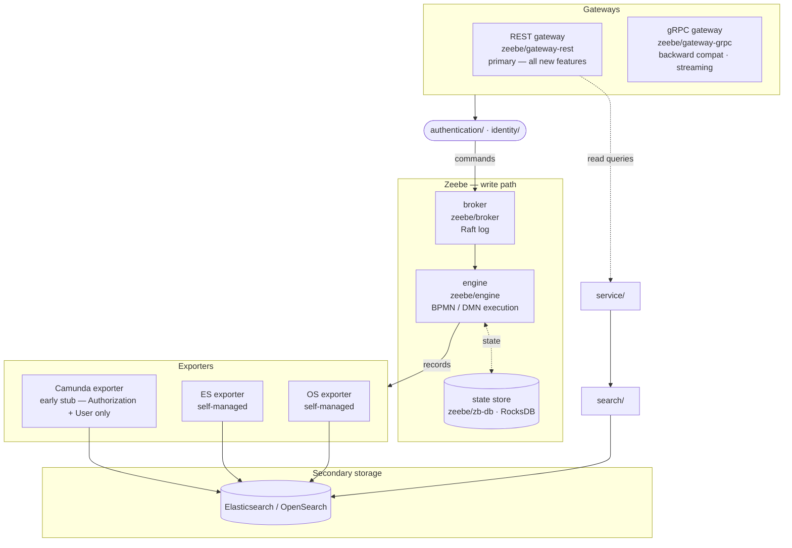

# Architecture Overview

## What this repo is

Camunda 8 is a process automation platform that executes BPMN workflows and evaluates DMN decisions
at scale, for both self-managed and SaaS deployments. The monorepo contains: Zeebe (process engine),
Operate (process monitoring), Tasklist (human task management), Identity (authentication and
authorization), plus shared libraries and supporting infrastructure. Java backend built with Maven;
React/Carbon frontends. `dist/` wires the components into deployable Spring Boot application
variants (e.g. `StandaloneBroker`, `StandaloneCamunda`); components can also be deployed
independently.

## Runtime topology

Camunda follows a **CQRS** (Command Query Responsibility Segregation) pattern: writes flow from a
gateway through the Zeebe broker/engine and land in secondary storage via exporters; reads go
directly from a gateway (through `service/` and `search/`) to secondary storage, bypassing the
broker/engine entirely. This keeps reads from affecting process execution performance.

```mermaid
flowchart TD
  subgraph gw["Gateways"]
    REST["REST gateway\nzeebe/gateway-rest\nprimary — all new features"]
    GRPC["gRPC gateway\nzeebe/gateway-grpc\nbackward compat · streaming"]
  end

  AUTH(["authentication/ · identity/"])

  subgraph write["Zeebe — write path"]
    BROKER["broker\nzeebe/broker\nRaft log"]
    ENGINE["engine\nzeebe/engine\nBPMN / DMN execution"]
    STATE[("state store\nzeebe/zb-db · RocksDB")]
    BROKER --> ENGINE
    ENGINE <-.->|state| STATE
  end

  subgraph exp["Exporters"]
    direction LR
    CE["Camunda exporter\nearly stub — Authorization + User only"]
    ESE["ES exporter\nself-managed"]
    OSE["OS exporter\nself-managed"]
  end

  subgraph storage["Secondary storage"]
    ESOS[("Elasticsearch / OpenSearch")]
  end

  SVC["service/"]
  SEARCH["search/"]

  gw --> AUTH
  AUTH -->|commands| BROKER
  ENGINE -->|records| exp
  CE & ESE & OSE --> ESOS

  REST -.->|read queries| SVC
  SVC --> SEARCH
  SEARCH --> ESOS
```

### Write path

Clients submit commands (deploy a process, start an instance, complete a job) through one of two
entry points:

- **REST gateway** (`zeebe/gateway-rest`): exposes the Camunda REST API and is the primary entry
  point for new features. Commands flow through `service/`, which translates them into calls to the
  internal Zeebe gateway. All new core features must be exposed here first.
- **gRPC gateway** (`zeebe/gateway`, `zeebe/gateway-grpc`): exposes the Zeebe gRPC API defined in
  `zeebe/gateway-protocol`. Used by the Java client (`clients/java`) and the Spring Boot starter
  (`clients/spring-boot-starter-camunda-sdk`). Kept for backward compatibility and performance (gRPC
  is more efficient at scale; job streaming is gRPC-only).

All entry points authenticate via `authentication/` (Spring Security). Authorization is enforced
against the resource/permission model defined directly in `zeebe/protocol`
(`AuthorizationResourceType`, `PermissionType`) and managed by `identity/` — there is no unified
`security/` module on this branch yet.

The **Zeebe broker** (`zeebe/broker`) receives commands, appends them to a partitioned append-only
log (Raft consensus via `zeebe/atomix`). The **Zeebe engine** (`zeebe/engine`) executes them
against its primary state store (RocksDB via `zeebe/zb-db`).

### Export path

After processing, the broker emits records to configured exporters:

|        Exporter        |                  Module                  |               Target                |
|------------------------|------------------------------------------|-------------------------------------|
| Elasticsearch exporter | `zeebe/exporters/elasticsearch-exporter` | Elasticsearch indices               |
| OpenSearch exporter    | `zeebe/exporters/opensearch-exporter`    | OpenSearch indices                  |
| Camunda exporter       | `zeebe/exporters/camunda-exporter`       | Elasticsearch only — see note below |

On this branch, the Camunda Exporter is an early stub: it exports only two record types
(`AuthorizationRecordValueExportHandler`, `UserRecordValueExportHandler`), only against an
Elasticsearch client — there is no OpenSearch support and no archiver code yet. It is not the
target for all new features here; the dedicated Elasticsearch and OpenSearch exporters remain the
primary path for most record types on this branch.

For the dedicated exporters, ES/OS index templates are owned and applied directly by
`zeebe/exporters/elasticsearch-exporter/src/main/resources` and
`zeebe/exporters/opensearch-exporter/src/main/resources` respectively — there is no centralized
`schema-manager/` on this branch.

### Read path

Operate and Tasklist query secondary storage (Elasticsearch/OpenSearch) through the `search/`
abstraction layer. The REST API also serves read queries: `zeebe/gateway-rest` calls `service/`,
which delegates to `search/`.

## Architectural decisions

Cross-cutting architectural decisions are recorded as ADRs in `docs/adr/`. Before making any
architectural change, check the index there first. If the decision is not covered by an existing
ADR, draft a new one using the `create-architecture-decision` skill before proceeding.

## Architectural boundaries

Contracts that must not be bypassed:

**Zeebe gRPC protocol** (`zeebe/gateway-protocol/src/main/proto/gateway.proto`)\
The interface between external clients and the gRPC gateway. Java stubs are generated at build time
in `zeebe/gateway-protocol-impl/`; never edit them manually. Changing the `.proto` requires
regenerating stubs in `gateway-protocol-impl/`, updating every caller in `service/`, and bumping
`clients/java` and the Spring Boot starter — a cascade that touches every layer of the write path.

**Zeebe record/exporter contract** (`zeebe/exporter-api`, `zeebe/protocol`)\
The SBE-encoded record format emitted by the broker and consumed by exporters. Access broker state
only through this contract; never read from RocksDB directly.

**ES/OS index schema**\
All templates use `"dynamic": "strict"` — new fields must be explicitly added to the template
definitions before the exporter writes them (see e.g.
`operate/schema/src/main/resources/schema/elasticsearch/` and
`tasklist/els-schema/src/main/resources/schema/es/`; there is no centralized `webapps-schema/`
template directory on this branch — each webapp owns its own). Fields are additive-only; never
change or remove a field once deployed — strict mapping will reject mistyped documents from the
exporter, and any query in `search/` referencing the field breaks, surfacing in `operate/` and
`tasklist/`. Never query ES/OS indices directly from application code; always go through `search/`.

**ES/OS exporter index templates** (`zeebe/exporters/elasticsearch-exporter/src/main/resources`,
`zeebe/exporters/opensearch-exporter/src/main/resources`)\
Index templates owned by the dedicated ES/OS exporters. Do not modify them without understanding
the impact on existing index mappings.

**`service/` as the REST-to-engine bridge**\
All REST commands must flow through `service/` before reaching Zeebe. REST controllers in
`zeebe/gateway-rest` must not call the Zeebe gRPC gateway directly. An interface change here breaks
`zeebe/gateway-rest` at compile time; `operate/` and `tasklist/` are indirect consumers via the
REST API and will break at runtime.

## Path rules

- `zeebe/gateway-protocol-impl/target/generated-sources/` — gRPC Java stubs generated from
  `gateway.proto`; never edit. Modify the `.proto` source in
  `zeebe/gateway-protocol/src/main/proto/` instead.
- `zeebe/protocol/src/main/resources/` (`protocol.xml`, `common-types.xml`,
  `cluster-management-protocol.xml`) — SBE protocol definitions; generated Java lives in `target/`.
- `target/` everywhere — Maven build output; never edit or commit.
- `dist/` — distribution assembly only; no application logic lives here.

## Further detail

- Cross-cutting ADRs: `docs/adr/`
- Module-specific ADRs: `<module>/docs/adr/`
- Zeebe internals: `zeebe/docs/`
- Module-specific architecture: `<module>/docs/architecture.md` (where present)
- Module-specific behavioral rules: `<module>/AGENTS.md`
