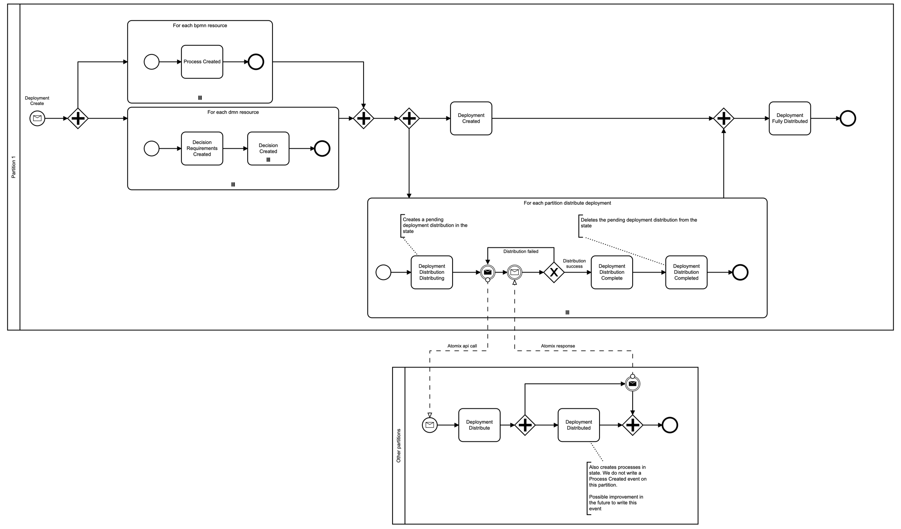

# Engine Questions

This document contains information about the engine in a FAQ format.

## What are tokens and how are they represented in the database?

According to the spec, tokens move through the flow. This is a way that users can think of how the
engine executes the process. But in reality this is not how the engine does it. There is no token
entity moving through the engine. Tokens are also not spawned and consumed for elements.

**A:** Tokens are represented in the engine and in its database state in one of two ways:
* Activated elements
* Taken sequence flows

### Activated Elements

The engine tracks the state of element instances. If they are in the state _Activated_ this is
visualized as a token in Operate.

In case of multi instance elements, each instance is activated individually. Operate aggregates this information
and displays a count of tokens/activated element instances for the multi instance element.

### Taken Sequence Flows

The engine also tracks taken sequence flows - more precisely it tracks taken sequence flows which
were unable to activate the element at the end of the sequence flow. This is mostly relevant for
joining parallel gateways. These have multiple incoming sequence flows.

When the first sequence flow is taken, the engine analyzes all taken sequence flows and determines
that the joining parallel gateway cannot be activated yet. Instead, it stores the taken sequence
flow as part of the event scope of the parent element of the joining parallel gateway. This taken
sequence flow is also visualized as a token in Operate.

Once all incoming sequence flows of a joining parallel gateway are taken, the information of the
taken sequence flows is removed from the event scope and the joining parallel gateway is activated.
In the visualization in Operate this looks as if the tokens were merged/removed on the joining
parallel gateway.

### Background information:

* Camunda Platform 7 also works this way and does not actually know tokens.
* The database has a representation of the current state of a process instance because it stores the
  element instances that are currently active (activating, activated, completing and terminating), as
  well as the number of active sequence flows inside of a flow scope.
* This information is used to determine whether the scope can be completed or terminated. When one
  of the instances completes or terminates, it's possible that other instances are still active and
  the scope cannot be completed/terminated yet.
* The engine used to do reference counting with the number of active tokens. These were not really
  token entities, but rather just a number that was incremented when a token was spawned and
  decremented when the token was consumed. However, this often led to problems where the count was
  not correct anymore.
* Representing the state of a process with tokens also raises interesting questions related to the
  scoping of data, because it might make sense to scope the data then to the token. This leads to
  interesting challenges once the flow splits and additional tokens are spawned, for example with
  parallel gateway. And what happens to the data when the tokens merge at the joining parallel gateway.

## What is the cardinality between a process instance and the element instances of a given element id (1:1 or 1:n)?

In particular, in loops does each entry into an element create a new element instance, or are all
passing through the same element instance?

**A:** The same element can be activated multiple times within the same process instance. So the
cardinality is 1:n between the process instance and its element instances.

Another way to look at it is by looking at the records on the log. We represent instances of process
elements in the log as `ProcessInstance` records. Each instance of an element has its own unique key
and has an elementId that refers to the element that it is an instance of. The element instance also
has a `processInstanceKey` that refers to the process instance that it belongs to. An element
instance belongs to an element and belongs to a process instance. Multiple element instances can
exist for the same element, even within the same process instance.

## When is a joining parallel gateway activated?

This process creates 4 tokens at different times. In the upper branch it creates a token at 10s and
20s, and in the lower branch it creates tokens at 1m and 2m respectively. The process was crafted in
this way to ask when will the joining gateway _Join_ be activated:
1. When two tokens (regardless of edge/sequence flow) are present - then it would activate at 20s and at 2m
2. When a token is present at each incoming edge/sequence flow - then it would activate at 1m and 2m

**A:** The joining parallel gateway _Join_ is activated at 1m and 2m

## Is there an internal cached representation of the process model, or do we parse the process document each time we need to access its structure?

**A:** The engine has an in-memory cache for deployed/recently accessed models in the executable
format we need for executing the process.

_Note:_ The cache is not evicting any entries right now which can in theory lead to out of memory errors.

## How does deployment distribution work?
**A:**

