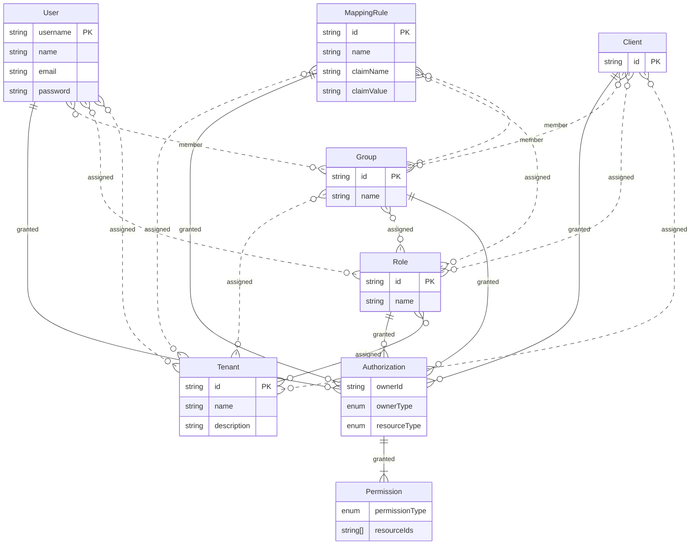

# Identity

## Data model

### Unmanaged entities

Under the "simple mapping rule" feature, users and clients are not managed as their own entities.
All relationships such as group, role and tenant membership, and assigned authorizations, are purely
based on the username or client id.
