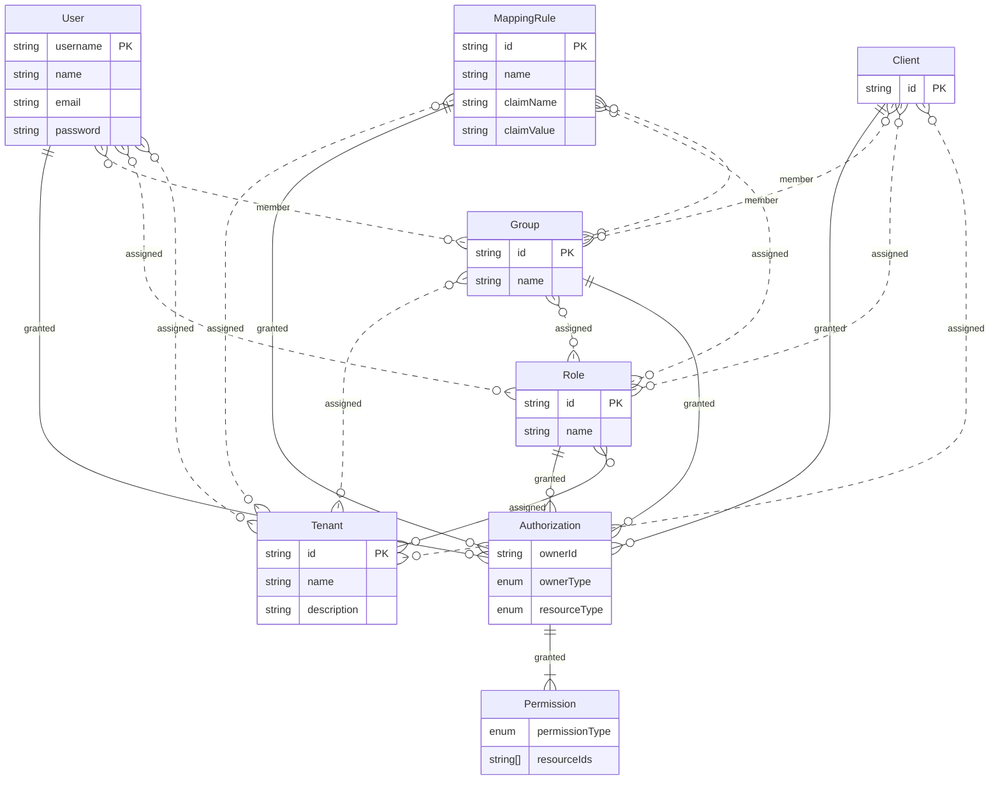

# Identity

## Data model



### Unmanaged entities

Under the "simple mapping rule" feature, users and clients are not managed as their own entities.
All relationships such as group, role and tenant membership, and assigned authorizations, are purely
based on the username or client id.

### How to change default roles?

#### How to add a new default role?

To add a new default role, you have to locate the DefaultRole enum and add your new role there:

```java
public enum DefaultRole {
  ...
  YOUR_NEW_ROLE("your-new-role"); // <- add your new role here
  ....
}
```

Then you have to modify the `PlatformDefaultEntities` class to define the new role and its associated permissions.
The `setupYourNewRole` method should look like this:

```java
private void setupYourNewRole(final IdentitySetupRecord setupRecord) {
  final var newRoleId = DefaultRole.YOUR_NEW_ROLE.getId();

  // Define the new Role
  setupRecord.addRole(
    new RoleRecord()
      .setRoleId(newRoleId)
      .setName("New Role Name")
  );

  // Define Authorizations and Permissions for the new role
  final var permissions = new Set<PermissionType>();
  // Add specific permissions to the set
  setupRecord.addAuthorization(
    new AuthorizationRecord()
      .setOwnerType(AuthorizationOwnerType.ROLE)
      .setOwnerId(readOnlyAdminRoleId)
      .setResourceType(resourceType)
      .setResourceMatcher(WILDCARD.getMatcher())
      .setResourceId(WILDCARD.getResourceId())
      .setPermissionTypes(permissions));

  // Assign the new role to the default tenant
  setupRecord.addTenantMember(
    new TenantRecord()
      .setTenantId(DEFAULT_TENANT_ID)
      .setEntityType(EntityType.ROLE)
      .setEntityId(newRoleId)
  );
}
```

Then, make sure to call the `setupYourNewRole` method within the `setupDefaultRoles` method.
For testing, there are two classes you need to consider: `IdentitySetupInitializeDefaultsTest` and `DefaultRolesIT`.
* In `IdentitySetupInitializeDefaultsTest`, you should add a test case to verify that the new role and its permissions are correctly set up.
* Then you need to add a test case to `DefaultRolesIT` to verify that the new default role has the expected behavior.

#### How to extend the permissions for a default role?

To extend the permissions for a default role, you need to modify the `PlatformDefaultEntities` class.
Locate the `setupYourRole` method and modify existing permissions list or add/remove Authorization for the role.<br>
For testing, you need to consider two classes: `IdentitySetupInitializeDefaultsTest` and `DefaultRolesIT`.
* In `IdentitySetupInitializeDefaultsTest`, you should modify the test case to verify that the permission changes are correctly applied during the setup process.
* You also need to modify or add test case to `DefaultRolesIT` to verify if the expected behavior is implemented.

