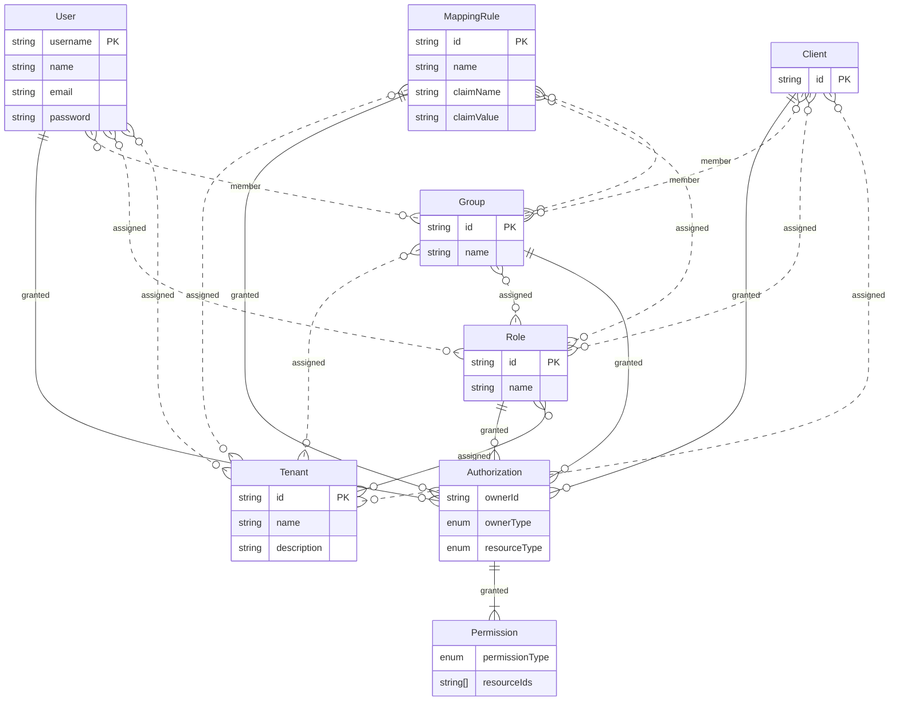

# Identity

## Data model


```mermaid
erDiagram
  User {
    string username PK
    string name
    string email
    string password
  }
  Client {
    string id PK
  }
  Role {
    string id PK
    string name
  }
  Group {
    string id PK
    string name
  }
  Tenant {
    string id PK
    string name
    string description
  }
  MappingRule {
    string id PK
    string name
    string claimName
    string claimValue
  }
  Authorization {
    string ownerId
    enum ownerType
    enum resourceType
  }
  Permission {
    enum permissionType
    string[] resourceIds
  }

  MappingRule }o..o{ Tenant: "assigned"
  User ||--o{ Authorization: "granted"
  Authorization ||--|{ Permission: "granted"
  Group }o..o{ Tenant: "assigned"
  Group }o..o{ Role: "assigned"
  Group ||--o{ Authorization: "granted"
  Role ||--o{ Authorization: "granted"
  User }o..o{ Group: "member"
  User }o..o{ Role: "assigned"
  User }o..o{ Tenant: "assigned"
  MappingRule ||--o{ Authorization: "granted"
  MappingRule }o..o{ Role: "assigned"
  MappingRule }o..o{ Group: "member"
  Role }o--o{ Tenant: "assigned"
  Client ||--o{ Authorization: "granted"
  Client }o..o{ Group: "member"
  Client }o..o{ Role: "assigned"
  Client }o..o{ Tenant: "assigned"
```

### Unmanaged entities

Under the "simple mapping rule" feature, users and clients are not managed as their own entities.
All relationships such as group, role and tenant membership, and assigned authorizations, are purely
based on the username or client id.

### How to change default roles?

#### How to add a new default role?

To add a new default role, you have to locate the DefaultRole enum and add your new role there:

```java
public enum DefaultRole {
  ...
  YOUR_NEW_ROLE("your-new-role"); // <- add your new role here
  ....
}
```

Then you have to modify the `PlatformDefaultEntities` class to define the new role and its associated permissions.
The `setupYourNewRole` method should look like this:

```java
private void setupYourNewRole(final IdentitySetupRecord setupRecord) {
  final var newRoleId = DefaultRole.YOUR_NEW_ROLE.getId();

  // Define the new Role
  setupRecord.addRole(
    new RoleRecord()
      .setRoleId(newRoleId)
      .setName("New Role Name")
  );

  // Define Authorizations and Permissions for the new role
  final var permissions = new Set<PermissionType>();
  // Add specific permissions to the set
  setupRecord.addAuthorization(
    new AuthorizationRecord()
      .setOwnerType(AuthorizationOwnerType.ROLE)
      .setOwnerId(readOnlyAdminRoleId)
      .setResourceType(resourceType)
      .setResourceMatcher(WILDCARD.getMatcher())
      .setResourceId(WILDCARD.getResourceId())
      .setPermissionTypes(permissions));

  // Assign the new role to the default tenant
  setupRecord.addTenantMember(
    new TenantRecord()
      .setTenantId(DEFAULT_TENANT_ID)
      .setEntityType(EntityType.ROLE)
      .setEntityId(newRoleId)
  );
}
```

Then, make sure to call the `setupYourNewRole` method within the `setupDefaultRoles` method.
For testing, there are two classes you need to consider: `IdentitySetupInitializeDefaultsTest` and `DefaultRolesIT`.
* In `IdentitySetupInitializeDefaultsTest`, you should add a test case to verify that the new role and its permissions are correctly set up.
* Then you need to add a test case to `DefaultRolesIT` to verify that the new default role has the expected behavior.

#### How to extend the permissions for a default role?

To extend the permissions for a default role, you need to modify the `PlatformDefaultEntities` class.
Locate the `setupYourRole` method and modify existing permissions list or add/remove Authorization for the role.

For testing, you need to consider two classes: `IdentitySetupInitializeDefaultsTest` and `DefaultRolesIT`.
* In `IdentitySetupInitializeDefaultsTest`, you should modify the test case to verify that the permission changes are correctly applied during the setup process.
* You also need to modify or add test case to `DefaultRolesIT` to verify if the expected behavior is implemented.

### RP (Relying Party)-initiated logout

Starting with 8.9.0, when Identity is running with Keycloak/Entra (or any other IdP), RP‑initiated logout can be enabled using the following flag:

```
CAMUNDA_SECURITY_AUTHENTICATION_OIDC_IDPLOGOUTENABLED=<true|false>
```

Or in `.yaml`:

```yaml
camunda:
  security:
    authentication:
      oidc:
        idp-logout-enabled: true|false
```

When set to `true`, logging out from Identity also signs the user out of Keycloak or Entra. When set to `false`, logging out from Identity clears only the Camunda session and leaves the user’s Keycloak or Entra session active.
If issuer-uri is not set but RP‑initiated logout is required, configure the end-session-endpoint-uri; for example, for Entra:

```
camunda.security:
  authentication:
    oidc:
      authorization-uri: https://login.microsoftonline.com/<YOUR_TENANT_ID>/oauth2/v2.0/authorize
      token-uri: https://login.microsoftonline.com/<YOUR_TENANT_ID>/oauth2/v2.0/token
      jwk-set-uri: https://login.microsoftonline.com/<YOUR_TENANT_ID>/discovery/v2.0/keys
      endsession-endpoint-uri: https://login.microsoftonline.com/<YOUR_TENANT_ID>/oauth2/v2.0/logout
```

Or using environment variable:

```
CAMUNDA_SECURITY_AUTHENTICATION_OIDC_ENDSESSIONENDPOINTURI=https://login.microsoftonline.com/<YOUR_TENANT_ID>/oauth2
```

The behavior of RP‑initiated logout for different browsers is as follows:
* The IdP maintains separate sessions per browser, and these sessions do not affect one another. The same applies to Camunda sessions, so logging out in browser A does not end the session in browser B.
* The logout origin URL is captured after the current Camunda session is terminated. Its value is taken from the Referer request header and stored in a new HTTP session that will later be read by the post-logout controller:
* The `CamundaOidcLogoutSuccessHandler` creates a new HTTP session and returns its `JSESSIONID` to the browser.
* When the browser sends the post-logout request, it includes this `JSESSIONID`.
* Server-side used this `JSESSIONID` to associate HTTP session with current request
* So when you log out of browser A and login in browser B you won't be redirected to the browser A location as these are two separate systems and sessions that don't affect each other
* Incognito mode also acts as a separate browser

#### Configure the post-logout redirect URL in the IdP

In 8.9.0, the new `PostLogoutController` handles post-logout redirection after RP-initiated logout. By default, it redirects to the Identity home page (/). To use a custom URL, configure `/post-logout` in the IdP’s list of allowed post-logout redirect URLs—for example, in Keycloak this is set in the client’s post-logout redirect URIs:

```
http://localhost:8080/post-logout
```

If this is set, the next login opens the same page the user logged out from, rather than the home page.
For troubleshooting, the logout origin URL is stored in the `CamundaOidcLogoutSuccessHandler` class, where it is read from `request.getHeader("referer")`.
Propagation of the `logout_hint` parameter is also handled in this class.

#### RP (Relying Party)-initiated logout troubleshooting

Both `PostLogoutController` and `CamundaOidcLogoutSuccessHandler` emit logs at the `TRACE` level.
For troubleshooting, examine TRACE-level log entries similar to the following example:

```
Unable to determine end-session endpoint for OIDC logout. Falling back to {baseLogoutUrl} without logout hint.
```

