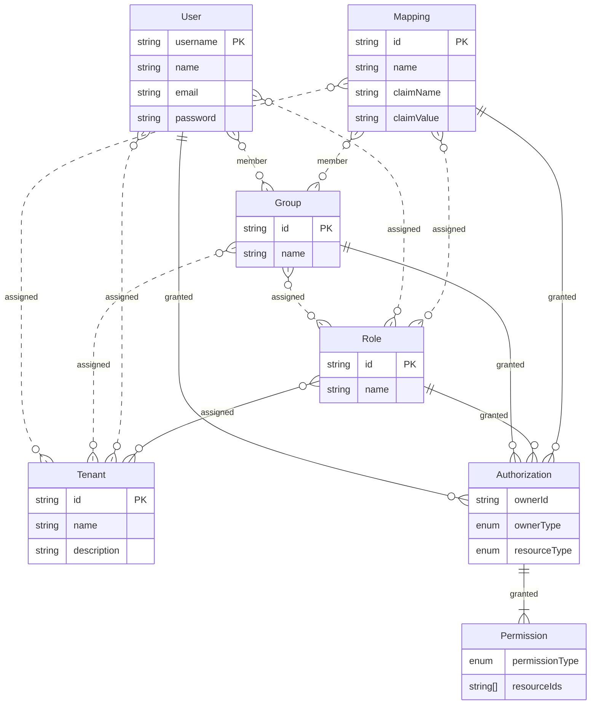

# Identity

## Data model

```mermaid
erDiagram
  User {
    string username PK
    string name
    string email
    string password
  }
  Role {
    string id PK
    string name
  }
  Group {
    string id PK
    string name
  }
  Tenant {
    string id PK
    string name
    string description
  }
  Mapping {
    string id PK
    string name
    string claimName
    string claimValue
  }
  Authorization {
    string ownerId
    enum ownerType
    enum resourceType
  }
  Permission {
    enum permissionType
    string[] resourceIds
  }

  Mapping }o..o{ Tenant: "assigned"
  User ||--o{ Authorization: "granted"
  Authorization ||--|{ Permission: "granted"
  Group }o..o{ Tenant: "assigned"
  Group }o..o{ Role: "assigned"
  Group ||--o{ Authorization: "granted"
  Role ||--o{ Authorization: "granted"
  User }o..o{ Group: "member"
  User }o..o{ Role: "assigned"
  User }o..o{ Tenant: "assigned"
  Mapping ||--o{ Authorization: "granted"
  Mapping }o..o{ Role: "assigned"
  Mapping }o..o{ Group: "member"
  Role }o--o{ Tenant: "assigned"
```

