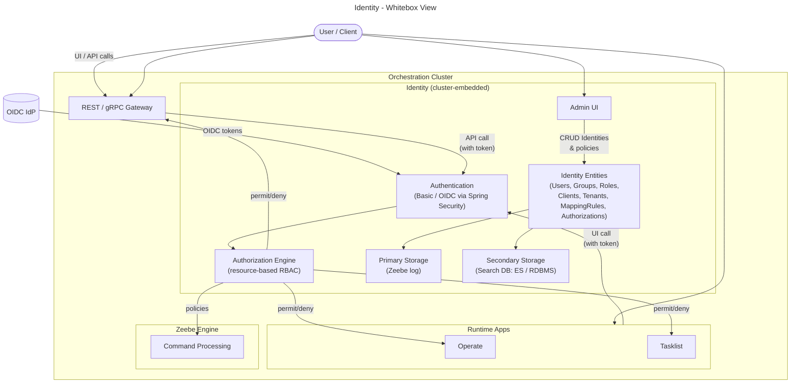

# Orchestration Cluster Identity

> **Status**: Draft
> **Scope**: Cluster‑internal
> **Out of scope**: **Management Identity** (Web Modeler, Console, Optimize) except where explicitly mentioned.

---

## 1. Introduction and Goals

The **Identity module** is the **cluster‑embedded authentication and authorization service** for a Camunda 8 Orchestration Cluster. It provides:

- **Unified access management** for all cluster components (**Zeebe, Operate, Tasklist, Orchestration Cluster REST/gRPC APIs**).
- **Flexible authentication**:
  - **OIDC** with external IdPs (Entra ID, Okta, Keycloak, Auth0, …)
  - **Basic authentication** and **no‑auth** for local/self‑managed scenarios.
- **Fine‑grained, resource‑based authorizations** across runtime resources (e.g. `PROCESS_DEFINITION`, `PROCESS_INSTANCE`, `USER_TASK`, decisions).
- **Cluster‑local multi‑tenancy** (tenants per cluster in Self‑Managed).
- **Embedded storage** using Zeebe’s primary log and secondary search storage (Elasticsearch/RDBMS), avoiding a dedicated identity DB in the common case.

**Goals**

1. Provide a **single, consistent identity surface per Orchestration Cluster**, independent of Management Identity.
2. Enable **least‑privilege, resource‑level authorization** for both UI and API interactions.
3. Support **enterprise IdP integration via OIDC** for both human SSO and M2M/API clients.
4. Work identically (semantics) across **SaaS and Self‑Managed**, with cluster‑level roles and groups in both.

---

## 2. Requirements Overview

High‑level (non‑exhaustive):

- **R1 – Cluster‑scoped access control**
  - Identity must control access to Zeebe, Operate, Tasklist, and Orchestration Cluster APIs per cluster.
- **R2 – External IdP integration**
  - Support OIDC with multiple enterprise IdPs; allow mapping of token claims to users, groups, roles, tenants, authorizations.
- **R3 – Multi‑tenancy (Self‑Managed)**
  - Tenants must be created, assigned and enforced at the Orchestration Cluster level; Management Identity must no longer be SoT for tenants.
- **R4 – Migration from Management Identity**
  - Provide tooling and mappings to migrate users, groups, roles, tenants, mapping rules and resource authorizations from Management Identity.
- **R5 – Fine‑grained Authorizations**
  - Support RBAC and resource‑based permissions that can be evaluated uniformly across UIs and APIs.

---

## 3. Quality Goals

- **Q1 – Security**
  - Strong, auditable AuthN/AuthZ; OIDC‑based SSO recommended for production.
- **Q2 – Consistency**
  - Same authorization semantics for UI and API access; same model across SaaS and Self‑Managed.
- **Q3 – Operability**
  - Minimal extra infrastructure; observability hooks for authentication and authorization flows.
- **Q4 – Extensibility**
  - Other teams can introduce new resource types/permissions without Identity team changes.

---

## 4. Stakeholders

- **Product & Architecture**: Identity PM, Orchestration Cluster architects, Hub team.
- **Implementation Teams**:
  - Orchestration Cluster Engine / Zeebe
  - Operate, Tasklist, REST API teams
  - Identity team (cluster Identity & Management Identity)
- **Ops & SRE**: SaaS operations, Self‑Managed customers’ platform teams.
- **Customers**: Platform owners, security/identity teams, app developers.

---

## 5. Architecture Constraints

- **Embedded in Orchestration Cluster**: Identity is shipped as part of the unified Orchestration Cluster artifact (JAR/Container).
- **Spring Security based**: Authentication logic is built on Spring Security, configured via Camunda‑specific properties (e.g. `CAMUNDA_SECURITY_*`).
- **Multi‑protocol Auth**: Support for **Basic** and **OIDC**, with OIDC being the recommended production mode.
- **Shared RBAC framework**: Authorization checks must use the shared RBAC framework and behaviors (e.g. `AuthorizationCheckBehavior`) owned by Identity team but extensible by feature teams.
- **No Management Identity dependency for runtime**: Engine/UI runtime (cluster) cannot depend on Management Identity; that component is reserved for Web Modeler/Console/Optimize and Self‑Managed only.

---

## 6. Context and Scope

### 6.1 Business Context


**Entities**

| Entity          | Description                                                                                 |
|-----------------|---------------------------------------------------------------------------------------------|
| User            | Human user performing modeling, operations or task work.                                   |
| Camunda 8       | Overall platform (Console, Web Modeler, Orchestration Clusters, Optimize).                 |
| Orchestration Cluster Identity | Cluster‑local access control for runtime components (Zeebe, Operate, Tasklist, APIs). |
| Management Identity | Access control for Web Modeler, Console, Optimize in Self‑Managed only. |
| Enterprise IdP  | Customer’s IdP providing SSO and tokens via OIDC/SAML.                                     |

### 6.2 Technical Context

```mermaid
---
title: Identity - Technical Context
---
flowchart LR
  subgraph USERS["Clients"]
    HU[Human users\n(Browser)]
    SRV[Service accounts /\njob workers / custom services]
  end

  IDP[("OIDC IdP\n(Entra ID, Okta, Keycloak, ...)")]

  subgraph CLUSTER["Orchestration Cluster"]
    subgraph IDENTITY["Orchestration Cluster Identity"]
      AUTH[Authentication\n(Basic / OIDC)]
      AUTHZ[Authorization Engine\n(RBAC + resource-based)]
      ADMINUI[Admin UI\n(Identity / Admin)]
    end

    subgraph RUNTIME["Cluster Components"]
      ZB[Zeebe Engine]
      OP[Operate]
      TL[Tasklist]
      API[REST / gRPC APIs]
    end
  end

  HU -->|"Browser / UI"| OP
  HU -->|"Browser / UI"| TL
  HU -->|"Admin UI"| ADMINUI

  SRV -->|"Client Credentials"| API

  IDP -->|"OIDC tokens\n(users & clients)"| AUTH

  AUTH --> AUTHZ
  ADMINUI -->|"Manage users, groups,\nroles, tenants, authz"| IDENTITY

  OP -->|"AuthZ check"| AUTHZ
  TL -->|"AuthZ check"| AUTHZ
  API -->|"AuthZ check"| AUTHZ
  AUTHZ -->|"permit/deny"| OP
  AUTHZ -->|"permit/deny"| TL
  AUTHZ -->|"permit/deny"| API
  AUTHZ -->|"policies in engine"| ZB
```

**Entities**

| Entity         | Description                                                                                                          |
|----------------|----------------------------------------------------------------------------------------------------------------------|
| Human users    | Log into UIs via browser, obtain OIDC session/token, and operate on processes/tasks. |
| Service accounts / workers | Non‑interactive clients calling REST/gRPC APIs using Client Credentials Flow.                 |
| OIDC IdP       | External IdP for users and clients; source of identity, attributes and group claims.     |
| Orchestration Cluster Identity | AuthN/AuthZ and identity entity store embedded into cluster.           |
| Cluster components | Runtime components enforcing Identity decisions for all user/client operations.                      |

---

## 7. Solution Strategy

- **Cluster‑embedded identity service**
  - Ship Identity inside Orchestration Cluster to reduce operational footprint and latency; Identity is now the **SoT for runtime IAM** instead of Management Identity.

- **Multi‑protocol authentication**
  - Support **Basic** for simple Self‑Managed setups and local development; **OIDC** for production with SSO, MFA, and centralized user lifecycle.

- **Resource‑based authorization**
  - Use fine‑grained authorizations per resource type + action (e.g. `PROCESS_DEFINITION:READ`, `USER_TASK:ASSIGN`) to support complex least‑privilege scenarios across UIs and APIs.

- **Cluster‑local tenant model**
  - Manage tenants directly in Identity per cluster, decoupling runtime tenancy from Management Identity; Management Identity tenants remain only for Optimize in Self‑Managed.

- **Extensible RBAC library**
  - Provide shared helpers and engine behaviors so feature teams can introduce new resource/permission types without Identity team changes in the hot path.

---

## 8. Building Block View

### 8.1 Whitebox Overall System



**Building blocks**

| Entity            | Description                                                                                                           |
|-------------------|-----------------------------------------------------------------------------------------------------------------------|
| REST / gRPC Gateway | Ingress for client APIs; forwards authenticated calls into engine & services.                                      |
| Operate, Tasklist | Web UIs; rely on Identity for both login and resource‑level authorization.            |
| Zeebe Engine      | Processes commands; consults authorization helpers (e.g. when starting instances on behalf of a user/client). |
| Identity Admin UI | Web UI embedded in cluster for managing users, groups, roles, tenants, clients, authorizations. |
| Authentication    | Spring Security configuration for Basic and OIDC, including token validation and session handling. |
| Authorization Engine | RBAC framework and resource‑based checks used by engine and search layer.     |
| Identity Entities | Domain model for all identity data (users, groups, roles, tenants, mapping rules, authorizations, clients). |
| Primary/Secondary Storage | Persistent representation of identity entities in Zeebe log and search DB (ES / RDBMS). |

---

## 9. Component View

### 9.1 Component: Orchestration Cluster Identity

**Responsibilities**

- Act as **single source of truth** for runtime identity & access in an Orchestration Cluster.
- Provide **Admin UI and APIs** to manage identity entities.
- Perform **authentication** for web UIs and machine APIs.
- Execute **authorization checks** for all cluster components via a shared RBAC engine.

**Key sub‑components**

- **Admin UI / Orchestration Cluster Admin (8.9+)**
  - Allows administrators to manage users, groups, roles, tenants, mapping rules, authorizations.
  - In 8.9, UI branding changes from “Identity” to “Admin”, while identity concepts remain the same.

- **Authentication**
  - **Basic**: credentials stored and validated inside Identity; suitable for local and simple Self‑Managed setups.
  - **OIDC**: delegates login to external IdP; mapping rules assign incoming principals to roles, groups, tenants, authorizations.

- **Identity Entities**
  - **Users, Groups, Roles**: core principal/grouping model; roles bundle permissions.
  - **Authorizations**: resource‑based permissions; connect principals (user/group/role/client) to resource types & actions.
  - **Tenants**: isolate data and access within a cluster (Self‑Managed); stored and enforced in cluster Identity.
  - **Clients**: represent technical clients (M2M) mapped from IdP client registrations.
  - **Mapping Rules**: connect IdP claims to groups/roles/tenants/authorizations.

- **Authorization Engine**
  - Shared framework enabling resource & permission type definitions per feature team.
  - Integrated with Zeebe engine, REST gateway and service layer to enforce checks consistently.

### 9.2 Interactions with External IdP

- **User login**
  1. Browser navigates to cluster UI.
  2. Identity redirects to IdP (if OIDC).
  3. IdP authenticates user, returns ID/Access token to cluster.
  4. Identity extracts username, group/attribute claims and applies mapping rules.
  5. Authorization engine evaluates authorizations to decide what UI and data are accessible.

- **Machine‑to‑machine (M2M)**
  1. Worker / service gets JWT via OAuth2 Client Credentials from IdP.
  2. Sends token with REST/gRPC call to Orchestration Cluster.
  3. Identity validates token, maps client to Identity client entity and applicable roles/authorizations.
  4. Authorization engine checks permissions for the requested API operation.

---

## 10. Architecture Decisions (Selection)

### ADR‑ID‑1: **Use Cluster‑Embedded Identity instead of external Identity component**

- **Status**: Accepted
- **Context**: Pre‑8.8, runtime components depended on Management Identity + Keycloak + Postgres, increasing operational overhead and coupling.
- **Decision**: Embed Identity directly in Orchestration Cluster, making it the SoT for runtime IAM.
- **Consequences**:
  - Fewer moving parts for runtime; easier HA and DR.
  - Runtime access no longer broken when Management Identity or Keycloak is down.
  - Migration complexity from Management Identity (handled by migration tooling).

### ADR‑ID‑2: **Recommend OIDC as default production authentication**

- **Status**: Accepted
- **Context**: Basic authentication is simple but lacks MFA, SSO, account lockout and enterprise policy enforcement.
- **Decision**: Position OIDC as the recommended method for production in both SaaS and Self‑Managed.
- **Consequences**:
  - Stronger security and better UX (SSO, MFA).
  - Requires customers to have or adopt an OIDC‑capable IdP.

### ADR‑ID‑3: **Resource‑based Authorization Model**

- **Status**: Accepted
- **Context**: Previous Management Identity model did not provide sufficient granularity across all runtime resources; Tasklist/Operate had separate access controls.
- **Decision**: Introduce flexible, resource‑based authorizations in Identity; migrate Management Identity permissions to new model.
- **Consequences**:
  - Consistent authorization semantics across UIs/APIs and resources.
  - More migration work but better long‑term model.

---

## 11. Glossary

| Term                      | Definition                                                                                         |
|---------------------------|----------------------------------------------------------------------------------------------------|
| **Orchestration Cluster** | Unified Camunda 8 runtime: Zeebe, Operate, Tasklist, Identity, REST/gRPC APIs.   |
| **Orchestration Cluster Identity** | Cluster‑embedded identity service for AuthN/AuthZ and identity entities. |
| **Orchestration Cluster Admin** | UI surface for cluster Identity (new name in 8.9); hosts Identity features. |
| **Management Identity**   | Standalone identity app (Self‑Managed) for Web Modeler, Console, Optimize. |
| **Tenant**                | Logical partition of data and access within a cluster (runtime multi‑tenancy). |
| **Authorization**         | Permission linking principal to resource type and action (e.g. `READ`, `UPDATE`). |
| **Mapping Rule**          | Rule mapping IdP claims (groups, attributes) to Identity entities (groups, roles, tenants, authz). |

---

> **Note**: Management Identity remains in use for Self‑Managed Web Modeler/Console/Optimize only and is **not** part of the Orchestration Cluster in SaaS deployments.


---

## Sources

- [docs: Rename Orchestration Cluster Identity to Admin (8.9)](https://github.com/camunda/camunda-docs/pull/8093)
- [Introduction to Identity | Camunda 8 Docs](https://docs.camunda.io/docs/next/components/identity/identity-introduction/)
- [What's new in Camunda 8.8 | Camunda 8 Docs](https://docs.camunda.io/docs/reference/announcements-release-notes/880/whats-new-in-88/)
- [Identity and access management in Camunda 8 | Camunda 8 Docs](https://docs.camunda.io/docs/next/components/concepts/access-control/access-control-overview/)
- [Orchestration Cluster authentication in Self-Managed | Camunda 8 Docs](https://docs.camunda.io/docs/self-managed/concepts/authentication/authentication-to-orchestration-cluster/)
- [Identity - Ownership](https://confluence.camunda.com/spaces/CAD/pages/307890994/Identity+-+Ownership)
- [8.8 Release notes | Camunda 8 Docs](https://docs.camunda.io/docs/next/reference/announcements-release-notes/880/880-release-notes/)
- [Connect Identity to an identity provider | Camunda 8 Docs](https://docs.camunda.io/docs/next/self-managed/components/orchestration-cluster/identity/connect-external-identity-provider/)
- [8.8 Release notes | Camunda 8 Docs](https://docs.camunda.io/docs/next/reference/announcements-release-notes/880/880-release-notes/)
- [Upgrade Camunda components from 8.7 to 8.8 | Camunda 8 Docs](https://docs.camunda.io/docs/self-managed/upgrade/components/870-to-880/)
- [whats-new-in-88.md](https://github.com/camunda/camunda-docs/blob/main/docs/reference/announcements-release-notes/880/whats-new-in-88.md)
- [Introducing Enhanced Identity Management in Camunda 8.8 | Camunda](https://camunda.com/blog/2025/03/introducing-enhanced-identity-management-in-camunda-88/)
- [Identity - Ownership](https://confluence.camunda.com/spaces/CAD/pages/307890994/Identity+-+Ownership)
- [Hub Team](https://confluence.camunda.com/spaces/HAN/pages/335709191/Hub+Team)
- [Identity](https://confluence.camunda.com/spaces/CAD/pages/277023049/Identity)
- [Dual-region | Camunda 8 Docs](https://docs.camunda.io/docs/self-managed/concepts/multi-region/dual-region/)
- [Camunda 8 reference architectures | Camunda 8 Docs](https://docs.camunda.io/docs/self-managed/reference-architecture/)
