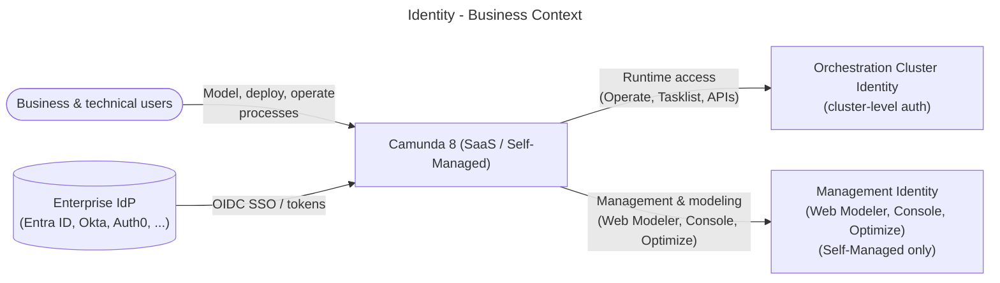
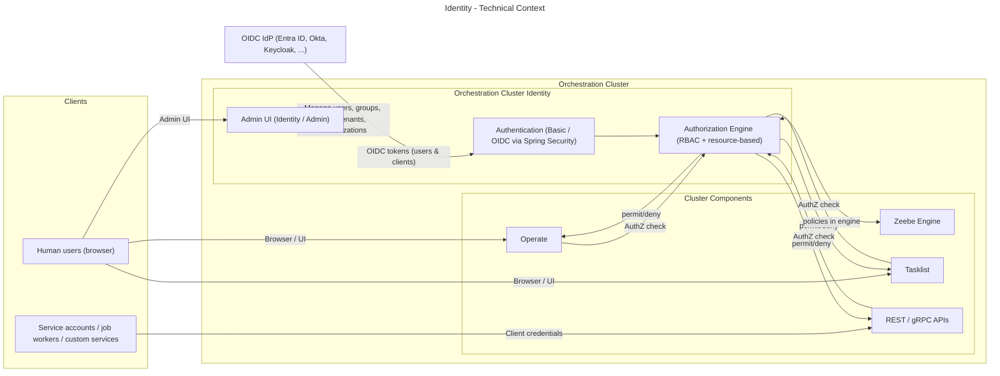

# Identity Module (Orchestration Cluster Identity)

> Status: Draft
> Scope: Cluster‑internal Orchestration Cluster Identity.
> Out of scope: Management Identity (Web Modeler, Console, Optimize) except where explicitly mentioned.

---

## 1. Introduction and goals

The Identity module is the cluster‑embedded authentication and authorization service for a Camunda 8 Orchestration Cluster. It provides:

- Unified access management for all cluster components: Zeebe, Operate, Tasklist, Orchestration Cluster REST/gRPC APIs.
- Flexible authentication:
  - OIDC with external IdPs (Entra ID, Okta, Keycloak, Auth0, …)
  - Basic authentication and no‑auth for local and simple Self‑Managed setups.
- Fine‑grained, resource‑based authorizations across runtime resources (for example, `PROCESS_DEFINITION`, `PROCESS_INSTANCE`, `USER_TASK`).
- Cluster‑local multi‑tenancy in Self‑Managed deployments.
- Embedded storage using Zeebe’s primary log and secondary search storage (Elasticsearch/RDBMS), so there is no dedicated identity database for the common case.

Goals:

1. Provide a single identity surface per Orchestration Cluster that is independent of Management Identity.
2. Enable least‑privilege, resource‑level authorization for both UI and API interactions.
3. Support enterprise IdP integration via OIDC for human SSO and machine‑to‑machine access.
4. Align semantics across SaaS and Self‑Managed, with cluster‑level roles and groups in both.

---

## 2. Requirements overview

Selected high‑level requirements (non‑exhaustive):

- R1 – Cluster‑scoped access control
  Identity controls access to Zeebe, Operate, Tasklist and Orchestration Cluster APIs per cluster.

- R2 – External IdP integration
  OIDC integration with enterprise IdPs; mapping of token claims to users, groups, roles, tenants and authorizations.

- R3 – Multi‑tenancy (Self‑Managed)
  Tenants created, assigned and enforced at Orchestration Cluster level. Management Identity is no longer source of truth for runtime tenants.

- R4 – Migration from Management Identity
  Tooling and mappings to migrate users, groups, roles, tenants, mapping rules and resource authorizations from Management Identity.

- R5 – Fine‑grained authorizations
  Resource‑based permissions evaluated uniformly across UIs and APIs.

---

## 3. Quality goals

- Q1 – Security
  Strong, auditable authentication and authorization; OIDC‑based SSO recommended for production.

- Q2 – Consistency
  Same authorization semantics for UI and API; same conceptual model in SaaS and Self‑Managed.

- Q3 – Operability
  Minimal extra infrastructure; suitable hooks for observing authentication and authorization flows.

- Q4 – Extensibility
  Other teams can introduce new resource or permission types while reusing the shared RBAC framework.

---

## 4. Stakeholders

- Product and architecture: Identity PM, Orchestration Cluster architects, Hub team.
- Implementation teams:
  - Orchestration Cluster engine / Zeebe
  - Operate, Tasklist, REST API teams
  - Identity team (cluster Identity and Management Identity)
- Operations and SRE: SaaS operations, Self‑Managed platform teams.
- Customers: platform owners, security/identity teams, application developers.

---

## 5. Architecture constraints

- Embedded in Orchestration Cluster
  Identity is shipped as part of the Orchestration Cluster artifact (JAR/container).

- Based on Spring Security
  Authentication logic builds on Spring Security, configured via `CAMUNDA_SECURITY_*` and related properties.

- Multi‑protocol authentication
  Support for Basic and OIDC, with OIDC as the recommended method for production.

- Shared RBAC framework
  Authorization checks use the shared framework and behaviors (for example `AuthorizationCheckBehavior`), owned by the Identity team but extensible by feature teams.

- No Management Identity dependency for runtime
  Engine and runtime UIs cannot depend on Management Identity. That component is reserved for Web Modeler, Console and Optimize in Self‑Managed.

---

## 6. Context and scope

### 6.1 Business context

Entities:

| Entity          | Description                                                                                 |
|-----------------|---------------------------------------------------------------------------------------------|
| User            | Human user performing modeling, operations or task work.                                   |
| Camunda 8       | Overall platform (Console, Web Modeler, Orchestration Clusters, Optimize).                 |
| Orchestration Cluster Identity | Cluster‑local access control for runtime components (Zeebe, Operate, Tasklist, APIs). |
| Management Identity | Access control for Web Modeler, Console, Optimize in Self‑Managed only. |
| Enterprise IdP  | Customer’s IdP providing SSO and tokens via OIDC/SAML.                                     |

### 6.2 Technical context

Entities:

| Entity         | Description                                                                                                          |
|----------------|----------------------------------------------------------------------------------------------------------------------|
| Human users    | Log into UIs via browser, obtain OIDC session/token, and operate on processes and tasks. |
| Service accounts / workers | Non‑interactive clients calling REST/gRPC APIs using client credentials.                 |
| OIDC IdP       | External IdP; source of identity, attributes and group claims.                        |
| Orchestration Cluster Identity | AuthN/AuthZ and identity entity store embedded into cluster.           |
| Cluster components | Runtime components enforcing Identity decisions for user and client operations.                      |

---

## 7. Solution strategy

- Cluster‑embedded identity service
  Identity runs inside the Orchestration Cluster and is the source of truth for runtime IAM instead of Management Identity.

- Multi‑protocol authentication
  Basic for simple Self‑Managed setups and development; OIDC for production with SSO, MFA and centralized user lifecycle.

- Resource‑based authorization
  Fine‑grained authorizations per resource type and action (for example `PROCESS_DEFINITION:READ`, `USER_TASK:ASSIGN`) across UIs and APIs.

- Cluster‑local tenant model
  Tenants managed directly in Identity per cluster; Management Identity tenants remain only for Optimize in Self‑Managed.

- Extensible RBAC library
  Shared helpers and engine behaviors so feature teams can introduce new resource/permission types.

---

## 8. Building block view

### 8.1 Whitebox overall system

Building blocks:

| Entity            | Description                                                                                                           |
|-------------------|-----------------------------------------------------------------------------------------------------------------------|
| REST / gRPC gateway | Ingress for client APIs; forwards authenticated calls into engine and services.                                    |
| Operate, Tasklist | Web UIs; rely on Identity for login and resource‑level authorization.                  |
| Zeebe engine      | Processes commands; uses authorization helpers when executing operations on behalf of a user or client. |
| Identity Admin UI | Web UI embedded in cluster for managing users, groups, roles, tenants, clients and authorizations. |
| Authentication    | Spring Security configuration for Basic and OIDC, including token validation and session handling. |
| Authorization engine | RBAC framework and resource‑based checks used by engine and service layer.     |
| Identity entities | Domain model for users, groups, roles, tenants, mapping rules, authorizations, clients. |
| Primary / secondary storage | Persistent representation of identity entities in Zeebe log and search database. |

---

## 9. Component view

### 9.1 Orchestration Cluster Identity

Responsibilities:

- Source of truth for runtime identity and access in an Orchestration Cluster.
- Admin UI and API for managing identity entities.
- Authentication for web UIs and machine APIs.
- Authorization checks for all cluster components via the shared RBAC engine.

Key sub‑components:

- Admin UI / Orchestration Cluster Admin (8.9+)
  Provides management for users, groups, roles, tenants, mapping rules and authorizations.

- Authentication
  Basic: credentials stored and validated inside Identity; suitable for local and simple Self‑Managed setups.
  OIDC: login delegated to external IdP; mapping rules assign principals to roles, groups, tenants and authorizations.

- Identity entities
  Users, groups, roles: core principal and grouping model; roles bundle permissions.
  Authorizations: resource‑based permissions connecting principals to resource types and actions.
  Tenants: data and access isolation within a cluster (Self‑Managed).
  Clients: represent technical clients (M2M) mapped from IdP client registrations.
  Mapping rules: link IdP claims to groups, roles, tenants and authorizations.

- Authorization engine
  Shared framework that allows other teams to define resource and permission types and use them consistently.
  Integrated with Zeebe engine, REST gateway and services.

### 9.2 Interactions with external IdP

User login (OIDC):

1. Browser navigates to cluster UI.
2. Identity redirects to IdP for login.
3. IdP authenticates user and returns ID/access token.
4. Identity extracts username and group/attribute claims and applies mapping rules.
5. Authorization engine evaluates authorizations to decide which UI and data are accessible.

Machine‑to‑machine (M2M):

1. Worker or service acquires JWT via OAuth2 client credentials from IdP.
2. Sends token with REST/gRPC call to Orchestration Cluster.
3. Identity validates token and maps client to Identity client entity and roles/authorizations.
4. Authorization engine checks permissions for the requested operation.

---

## 10. Architecture decisions (selection)

### ADR‑ID‑1: Cluster‑embedded Identity instead of external component

Status: accepted

Context: Before 8.8, runtime components depended on Management Identity + Keycloak + Postgres, which increased operational overhead and coupling.

Decision: Embed Identity directly in Orchestration Cluster and treat it as source of truth for runtime IAM.

Consequences:

- Fewer moving parts for runtime; easier high availability and disaster recovery.
- Runtime access does not depend on Management Identity availability.
- Additional migration complexity, handled by migration tooling.

### ADR‑ID‑2: OIDC as default production authentication

Status: accepted

Context: Basic authentication is simple but does not provide MFA, SSO, account lockout or password policies.

Decision: Recommend OIDC as the default authentication method for production (SaaS and Self‑Managed).

Consequences:

- Better security and user experience through SSO and MFA.
- Requires customers to operate or adopt an OIDC‑capable IdP.

### ADR‑ID‑3: Resource‑based authorization model

Status: accepted

Context: The previous Management Identity model did not provide sufficient granularity for all runtime resources; Tasklist and Operate had separate access controls.

Decision: Introduce flexible, resource‑based authorizations in Identity and migrate Management Identity permissions to this new model.

Consequences:

- Consistent authorization semantics across UIs, APIs and resource types.
- Additional migration work, but a clearer long‑term model.

---

## 11. Glossary

| Term                      | Definition                                                                                         |
|---------------------------|----------------------------------------------------------------------------------------------------|
| Orchestration Cluster     | Unified Camunda 8 runtime: Zeebe, Operate, Tasklist, Identity, REST/gRPC APIs.   |
| Orchestration Cluster Identity | Cluster‑embedded identity service for authentication, authorization and identity entities. |
| Orchestration Cluster Admin | UI surface for cluster Identity (new name in 8.9); hosts identity features. |
| Management Identity       | Standalone identity app (Self‑Managed) for Web Modeler, Console and Optimize. |
| Tenant                    | Logical partition of data and access within a cluster (runtime multi‑tenancy). |
| Authorization             | Permission linking a principal to a resource type and action (for example READ, UPDATE, DELETE). |
| Mapping rule              | Rule mapping IdP claims (groups, attributes) to identity entities such as groups, roles, tenants, authorizations. |

Note: Management Identity remains in use for Self‑Managed Web Modeler, Console and Optimize only and is not part of the Orchestration Cluster in SaaS deployments.

---

## Sources

- [docs: Rename Orchestration Cluster Identity to Admin (8.9)](https://github.com/camunda/camunda-docs/pull/8093)
- [Introduction to Identity | Camunda 8 Docs](https://docs.camunda.io/docs/next/components/identity/identity-introduction/)
- [What's new in Camunda 8.8 | Camunda 8 Docs](https://docs.camunda.io/docs/reference/announcements-release-notes/880/whats-new-in-88/)
- [Identity and access management in Camunda 8 | Camunda 8 Docs](https://docs.camunda.io/docs/next/components/concepts/access-control/access-control-overview/)
- [Orchestration Cluster authentication in Self-Managed | Camunda 8 Docs](https://docs.camunda.io/docs/self-managed/concepts/authentication/authentication-to-orchestration-cluster/)
- [Identity - Ownership](https://confluence.camunda.com/spaces/CAD/pages/307890994/Identity+-+Ownership)
- [8.8 Release notes | Camunda 8 Docs](https://docs.camunda.io/docs/next/reference/announcements-release-notes/880/880-release-notes/)
- [Connect Identity to an identity provider | Camunda 8 Docs](https://docs.camunda.io/docs/next/self-managed/components/orchestration-cluster/identity/connect-external-identity-provider/)
- [8.8 Release notes | Camunda 8 Docs](https://docs.camunda.io/docs/next/reference/announcements-release-notes/880/880-release-notes/)
- [Upgrade Camunda components from 8.7 to 8.8 | Camunda 8 Docs](https://docs.camunda.io/docs/self-managed/upgrade/components/870-to-880/)
- [whats-new-in-88.md](https://github.com/camunda/camunda-docs/blob/main/docs/reference/announcements-release-notes/880/whats-new-in-88.md)
- [Introducing Enhanced Identity Management in Camunda 8.8 | Camunda](https://camunda.com/blog/2025/03/introducing-enhanced-identity-management-in-camunda-88/)
- [Identity - Ownership](https://confluence.camunda.com/spaces/CAD/pages/307890994/Identity+-+Ownership)
- [Hub Team](https://confluence.camunda.com/spaces/HAN/pages/335709191/Hub+Team)
- [Identity](https://confluence.camunda.com/spaces/CAD/pages/277023049/Identity)
- [Dual-region | Camunda 8 Docs](https://docs.camunda.io/docs/self-managed/concepts/multi-region/dual-region/)
- [Camunda 8 reference architectures | Camunda 8 Docs](https://docs.camunda.io/docs/self-managed/reference-architecture/)
