# 1. Introduction and goals

## 1.1 Overview

The Identity module is the cluster‑embedded authentication and authorization service for a Camunda 8 Orchestration Cluster.

It provides:

- Unified access management for cluster components: Zeebe, Operate, Tasklist, Orchestration Cluster REST/gRPC APIs.
- Flexible authentication:
  - OIDC with external IdPs (Keycloak, Okta, Auth0, Microsoft Entra ID, Amazon Cognito and other OIDC providers).
  - Basic authentication.
  - Optional no‑auth for local and simple Self‑Managed setups.
- Fine‑grained, resource‑based authorizations across runtime resources (for example PROCESS_DEFINITION, PROCESS_INSTANCE, USER_TASK).
- Tenant management handled directly in Orchestration Cluster Identity (Self‑Managed), allowing tenants per cluster for runtime data and access isolation.
- No dedicated identity database; Identity entities reuse Zeebe primary and secondary storage.

Goals:

1. Provide a single identity surface per Orchestration Cluster that is independent of Management Identity.
2. Enable least‑privilege, resource‑level authorization for both UI and API interactions.
3. Support enterprise IdP integration via OIDC for human SSO and machine‑to‑machine access.
4. Align semantics across SaaS and Self‑Managed, with cluster‑level roles and groups in both.

## 1.2 Requirements overview (functional)

Selected high‑level requirements:

- R1 – Cluster‑scoped access control
  Identity controls access to Zeebe, Operate, Tasklist and Orchestration Cluster APIs per cluster.

- R2 – External IdP integration
  OIDC integration with enterprise IdPs; mapping of token claims to users, groups, roles, tenants and authorizations.

- R3 – Fine‑grained authorizations
  Resource‑based permissions evaluated uniformly across UIs and APIs.

- R4 – Multi‑tenancy (Self‑Managed)
  Tenants created, assigned and enforced at Orchestration Cluster level. Management Identity is no longer source of truth for runtime tenants.

- R5 – Migration from Management Identity
  Tooling and mappings to migrate users, groups, roles, tenants, mapping rules and resource authorizations from Management Identity.

## 1.3 Quality goals (top level)

- Security
  Strong, auditable authentication and authorization; OIDC‑based SSO recommended for production.

- Consistency
  Same authorization semantics for UI and API; same conceptual model in SaaS and Self‑Managed.

- Operability
  Minimal extra infrastructure; suitable hooks for observing authentication and authorization flows.

- Extensibility
  Other teams can introduce new resource or permission types while reusing the shared RBAC framework.

## 1.4 Stakeholders

TBD

# 2. Constraints

- Embedded in Orchestration Cluster
  Identity is shipped as part of the Orchestration Cluster artifact (JAR/container).

- Based on Spring Security
  Authentication logic builds on Spring Security, configured via CAMUNDA_SECURITY_* and related properties.

- Multi‑protocol authentication
  Support for Basic and OIDC, with OIDC as the recommended method for production; optional no‑auth for simple setups.

- Shared RBAC framework
  Authorization checks use the shared framework and behaviors owned by the Identity team but extensible by feature teams.

- No Management Identity dependency for runtime
  Engine and runtime UIs should not depend on Management Identity. That component is reserved for Web Modeler, Console and Optimize in Self‑Managed.

- Reuse of existing storage
  No separate identity database; Identity entities reuse Zeebe primary and secondary storage.

# 3. System context and scope

## 3.1 Business context

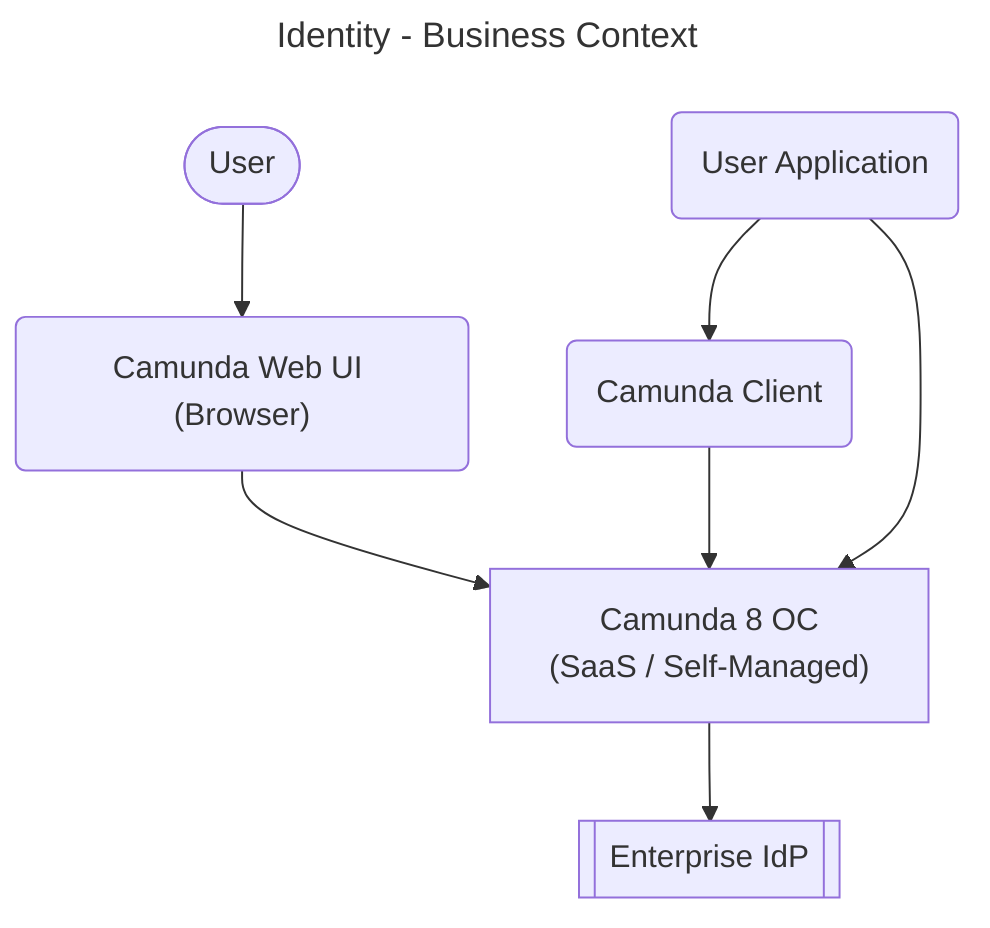

Entities:

- User: A human performing modeling, operations, or task work.
- User Application: A client application interacting with Camunda either with a camunda client or REST/gRPC API.
- Camunda Web UI: Console, Web Modeler, Operate, Tasklist, Identity
- Camunda Client: Official language clients - Java client and Spring Boot Starter
- Orchestration Cluster: runtime deployment containing Zeebe, Operate, Tasklist, Identity, REST/gRPC APIs.
- Enterprise IdP: customer IdP providing SSO and tokens via OIDC/SAML (e.g. Okta, Entra, Keycloak, etc.).

## 3.2 Technical context

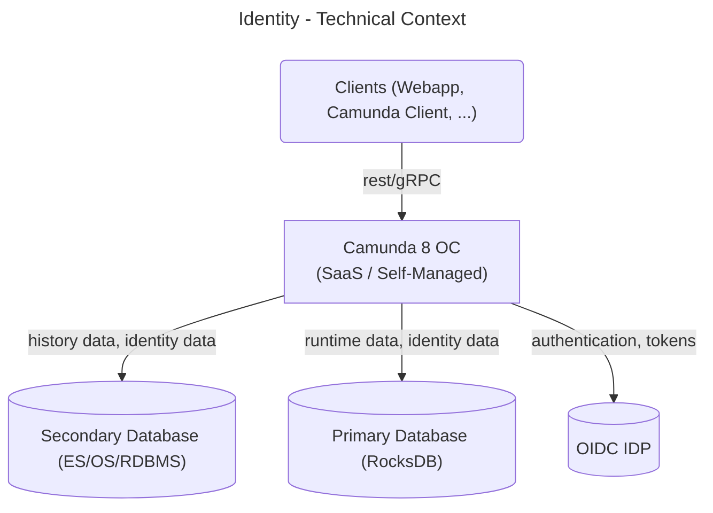

Entities:
- Clients: Web applications, Camunda clients, and other services interacting with the Orchestration Cluster
- Orchestration Cluster: runtime deployment containing Zeebe, Operate, Tasklist, Identity, REST/gRPC APIs.
- Enterprise IdP: customer IdP providing SSO and tokens via OIDC/SAML (e.g. Okta, Entra, Keycloak, etc.).
- Primary Database: RocksDB used for Zeebe Engine state.
- Secondary Database: Elasticsearch, OpenSearch, or RDBMS used for search queries. Contains Runtime, History, and Identity data.

External interfaces (technical):

- Incoming:
  - Browser‑based UIs (Operate, Tasklist, Admin UI) using OIDC or Basic auth.
  - REST/gRPC APIs for workers, service accounts and applications (Bearer tokens from IdP).
- Outgoing:
  - OIDC IdP for login redirects, token introspection, or validation depending on IdP use.
  - Requests against secondary database for search queries.
- Internal:
  - Calls from UIs and APIs to Authentication and Authorization engine.
  - Persistence of identity entities in primary and secondary storage.

# 4. Solution strategy

- Cluster‑embedded identity service
  Identity runs inside the Orchestration Cluster and is the source of truth for runtime IAM instead of Management Identity.

- Multi‑protocol authentication
  Basic for simple Self‑Managed setups and development.
  OIDC for production with SSO, MFA and centralized user lifecycle.
  Optional no‑auth for local or demo scenarios.

- Resource‑based authorization
  Fine‑grained authorizations per resource type and action (for example PROCESS_DEFINITION:READ, USER_TASK:ASSIGN) across UIs and APIs.

- Cluster‑local tenant model
  Tenants are managed directly in Identity per cluster. Management Identity tenants remain only for Optimize in Self‑Managed.

- Extensible RBAC library
  Shared helpers and engine behaviors so feature teams can introduce new resource and permission types without re‑implementing authorization logic.

- Reuse of Zeebe storage
  Identity entities are stored using Zeebe’s existing primary (RocksDB) and secondary (ES/OS/RDBMS) storage instead of a separate identity database.

# 5. Building block view

## 5.1 Whitebox overall system

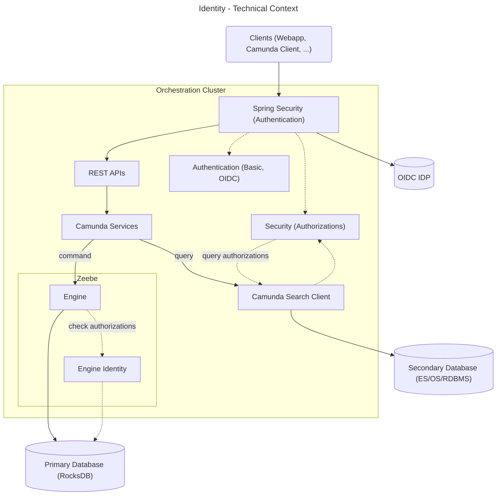

Main building blocks:

- REST APIs: Orchestration Cluster REST API (v2), Administration API, Web Modeler API
- Camunda Services: Enhances the commands and queries with the given authentication and the necessary authorizations.
- Camunda Search Client: Used for querying the secondary database against ES, OS, or RDBMS, depending on the configuration.
- Authentication: Contains authentication-related converters, helpers, utils, and services among others for spring security.
- Security: Authorization checks for queries against a secondary database are done via the shared RBAC framework. TODO: and there is also Authentication related stuff...
- Zeebe: Is responsible for processing commands and storing state.
- Engine: Processes commands and applies state changes. Uses (engine) identity to check permissions for user- or client-initiated operations.
- Engine Identity: Shared RBAC engine used for authorization checks in the engine, lives directly in the engine.
- Primary Database: RocksDB used for Zeebe Engine state.
- Secondary Database: Elasticsearch, OpenSearch, or RDBMS used for search queries. Contains Runtime, History, and Identity data.

## 5.2 Building Blocks

## 5.2.1 Authentication - Level 2

The Authentication building block provides configuration classes, converters, and helpers that extend Spring Security.
Spring Security itself manages the OIDC / OAuth2 filter chain, token exchange, and IdP communication.
Authentication classes enrich the resulting principal with Camunda-specific claims (groups, roles, tenants) and persist sessions.

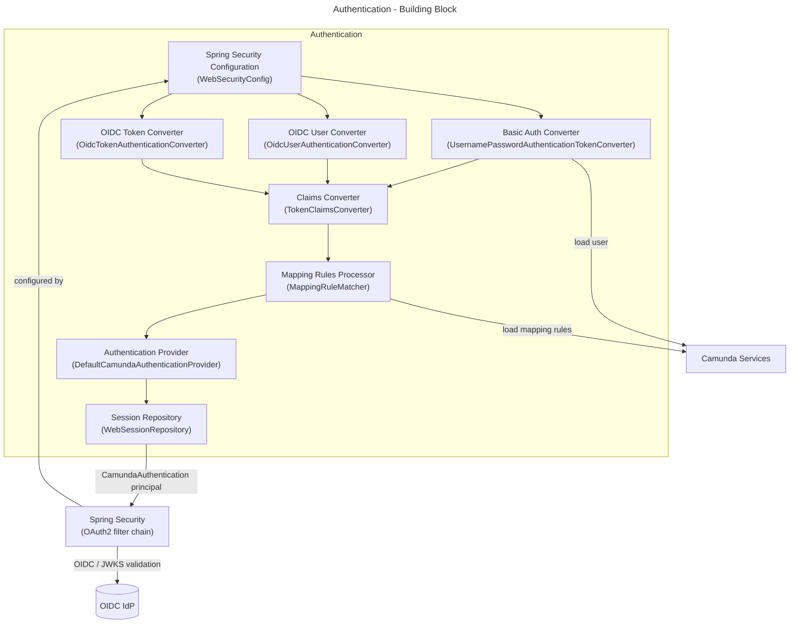

Key responsibilities:

- `WebSecurityConfig`: configures the Spring Security filter chains for Basic auth, OIDC browser login, no auth, and Bearer token validation.
- `UsernamePasswordAuthenticationTokenConverter`: converts Basic auth credentials into a `CamundaAuthentication` by loading user data from secondary storage.
- `OidcUserAuthenticationConverter`: post-processes OIDC browser login tokens to extract Camunda-specific claims.
- `OidcTokenAuthenticationConverter`: converts Bearer JWTs (M2M) into a `CamundaAuthentication`.
- `TokenClaimsConverter`: core converter that extracts username / clientId from token claims and loads group / role / tenant memberships.
- `MappingRuleMatcher`: evaluates JSONPath mapping rules against IdP claims to assign roles, groups, tenants and authorizations.
- `DefaultCamundaAuthenticationProvider`: bridges Spring Security to the Camunda authentication context via `CamundaAuthentication`.
- `WebSessionRepository`: creates and invalidates server‑side sessions backed by secondary storage.

Extern responsibilities:

- Camunda Services: access via Camunda Search Client to secondary storage.

## 5.2.2 Security - Level 2

The Security building block provides authorization checks for REST queries executed via the Camunda Search Client.
It implements the shared RBAC framework for data access control, ensuring that search results are filtered according to the caller's permissions.

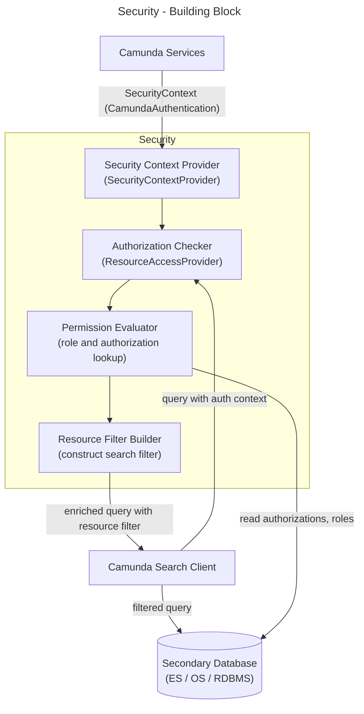

Key responsibilities:

- `SecurityContextProvider`: builds a `SecurityContext` combining the `CamundaAuthentication` with authorization requirements before a query is executed.
- `ResourceAccessProvider`: entry point for checking whether the caller is allowed to perform a given action on a resource type.
- Permission Evaluator: resolves the effective permissions of a principal by combining direct authorizations and role‑based authorizations.
- Resource Filter Builder: translates the effective permissions into a search‑engine filter that restricts query results to authorized resources.

## 5.2.3 Engine Identity - Level 2

Engine Identity is the RBAC authorization engine embedded directly inside the Zeebe Engine.
It intercepts engine commands (such as creating process instances or completing user tasks) and enforces authorization before the command is applied.

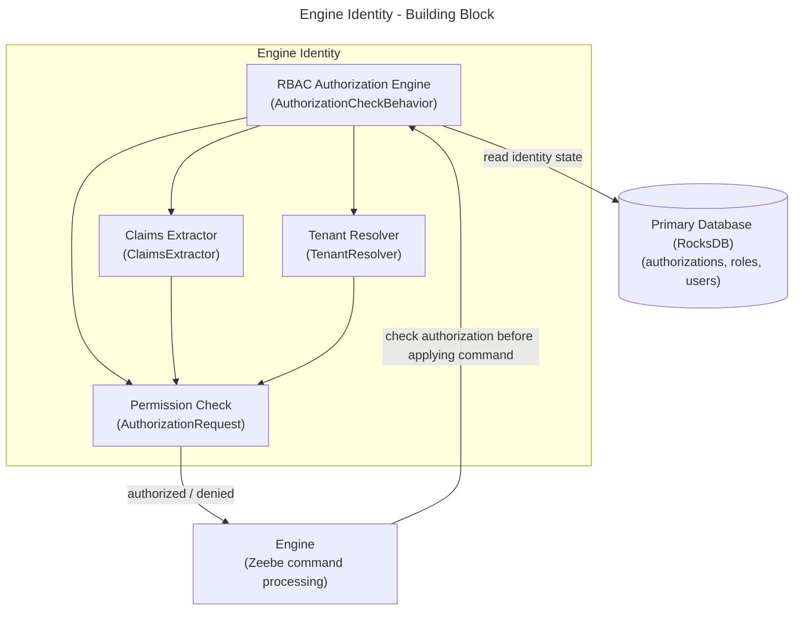

Key responsibilities:

- `AuthorizationCheckBehavior`: main entry point; receives the principal and the requested resource + action and decides whether to allow or deny the command.
- `AuthorizationRequest`: record holding the resource type, required permission, tenant ID and property constraints for a single authorization check.
- `ClaimsExtractor`: extracts username, clientId, and groups from the raw claims in an authorization request.
- `TenantResolver`: resolves the set of tenants the principal is authorized for, using membership state and mapping rules read from primary storage.

# 6. Runtime view

## 6.1 User login (OIDC)

Scenario: human user logs into Operate or Tasklist via OIDC.

1. Browser navigates to a cluster UI (for example Operate).
2. Identity redirects the browser to the external IdP for login.
3. IdP authenticates the user and returns ID/access tokens.
4. Identity validates the token, extracts username and group or attribute claims, and applies mapping rules.
5. Authorization engine evaluates authorizations to decide which UI features and data are accessible.
6. Subsequent UI or API calls include the session or token and are checked by the authorization engine. Logout behavior, including RP‑initiated logout back to the IdP, is described in [RP‑initiated logout](https://github.com/camunda/camunda/blob/main/docs/identity/rp-initiated-logout.md).

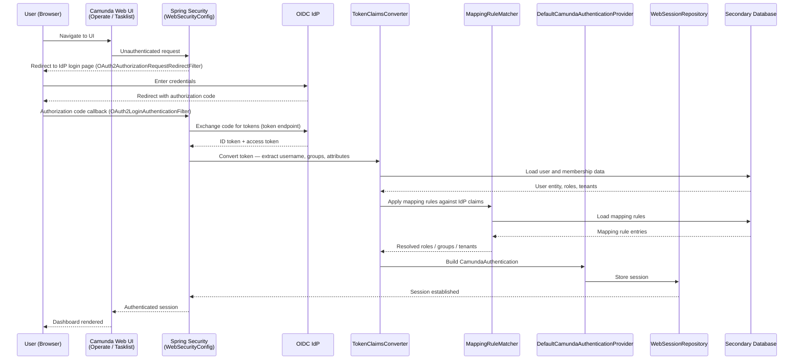

## 6.2 User logout

Scenario: human user logs out of a cluster UI; RP‑initiated logout propagates the logout back to the external IdP.

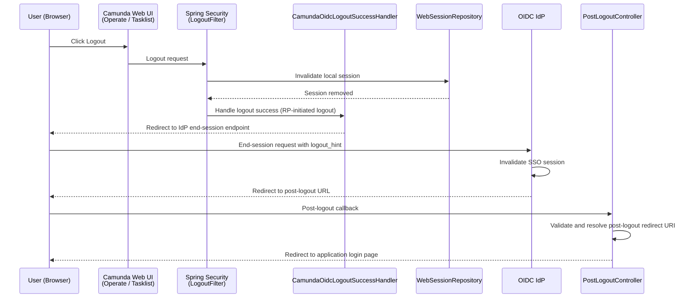

## 6.3 Machine‑to‑machine access (workers and services)

Scenario: worker or backend service calls REST or gRPC APIs.

1. Worker or service acquires a JWT via OAuth2 client credentials from the IdP.
2. It sends the token with REST or gRPC calls to the Orchestration Cluster.
3. Identity validates the token and maps the client to an Identity client entity and associated roles or authorizations.
4. Authorization engine checks permissions for each requested operation (for example deploying processes, completing tasks).
5. Engine and services execute or reject operations based on the authorization decision.

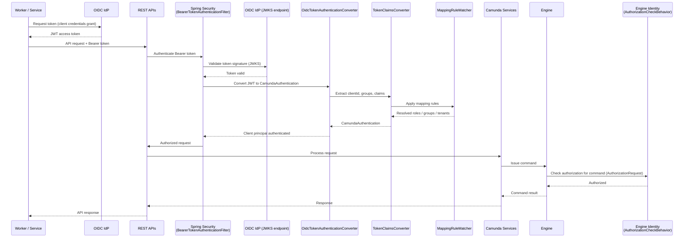

## 6.4 Sending a command via REST

Scenario: a client starts a process instance via the REST API; the Zeebe Engine enforces RBAC via Engine Identity before applying the command.

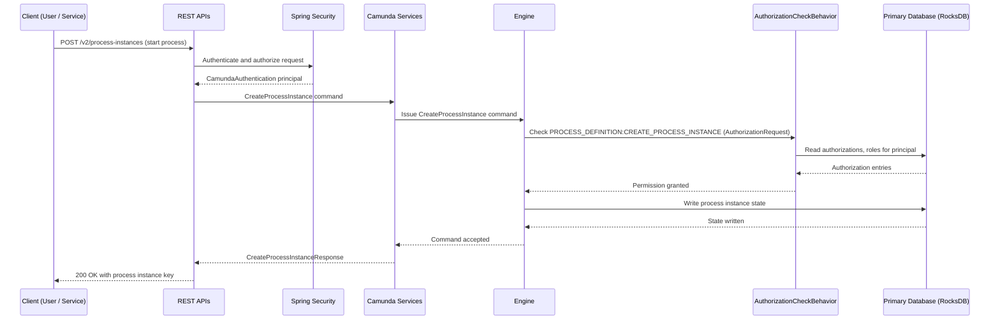

## 6.5 Reading resources via REST

Scenario: a client queries process instances via the REST API; the Camunda Search Client uses Security to filter results to authorized resources only.

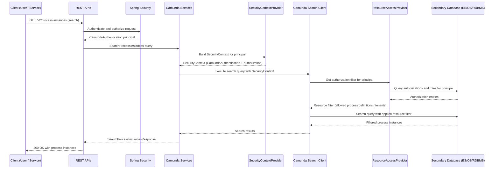

# 7. Deployment view

Identity‑specific aspects:

- Orchestration Cluster packaging
  Identity is part of the Orchestration Cluster deployment artifact (JAR/container) for SaaS and Self‑Managed.

- Storage
  Identity entities are stored using:
  - Primary storage: RocksDB.
  - Secondary storage: the configured search database (ES/OS/RDBMS).

- Self‑Managed deployments
  - Typically deployed on Kubernetes using the Camunda 8 Helm charts.
  - Identity runs within the Orchestration Cluster pods; no separate identity database or service is required for runtime.

- SaaS deployments
  - Orchestration Clusters are hosted by Camunda.
  - Identity is included per cluster and integrated with Camunda's SaaS control plane and IdP setup.

For detailed infrastructure topologies, see the Camunda 8 reference architectures listed in the sources appendix.

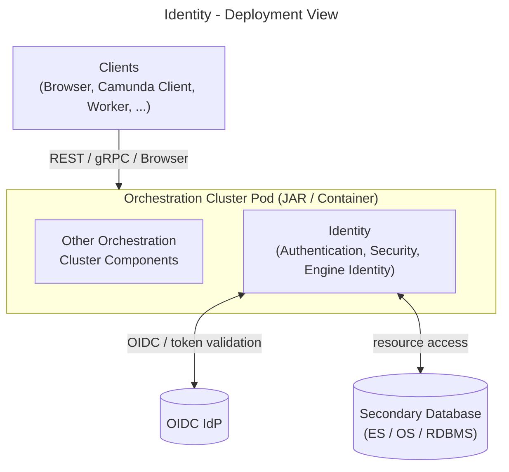

# 8. Crosscutting concepts

- Authentication concept
  Unified Spring Security configuration for Basic and OIDC.
  Pluggable IdP integration through standard OIDC configuration.

- Authorization and RBAC concept
  Central resource‑based authorization model, decoupled from individual UIs and services.
  Shared checks used by engine, Operate, Tasklist and APIs.
  For detailed behavior and examples, see the [Authorization concept](https://github.com/camunda/camunda/blob/main/docs/identity/authorizations/authorization-concept.md), [Engine authorization checks](https://github.com/camunda/camunda/blob/main/docs/identity/authorizations/engine-authorization.md), and [REST authorization checks](https://github.com/camunda/camunda/blob/main/docs/identity/authorizations/rest-authorization.md).

- Tenant concept
  Cluster‑local tenants defined in Identity.
  Tenants applied across runtime resources for data and access isolation (Self‑Managed).

- Mapping rules concept
  Declarative mapping from IdP claims (groups, attributes) to Identity entities such as groups, roles, tenants, authorizations.
  Enables identity‑as‑code and external lifecycle via IdP.

- Migration concept (from Management Identity)
  Identity Migration tooling to move roles, groups, tenants, resource authorizations and mapping rules.
  Designed to be idempotent and re‑runnable.

- Storage and consistency
  Identity state follows Zeebe's durability and snapshot mechanisms via shared storage.
  Secondary storage ensures efficient querying for Admin UI and APIs.

# 9. Architectural decisions

## ADR‑ID‑1: Cluster‑embedded Identity instead of external component

- Status: accepted
- Context: before 8.8, runtime components depended on Management Identity plus Keycloak and Postgres, which increased operational overhead and coupling.
- Decision: embed Identity directly in Orchestration Cluster and treat it as source of truth for runtime IAM.
- Consequences:
  - Fewer moving parts for runtime; easier high availability and disaster recovery.
  - Runtime access does not depend on Management Identity availability.
  - Additional migration complexity, handled by migration tooling.

## ADR‑ID‑2: OIDC as default production authentication

- Status: accepted
- Context: Basic authentication is simple but does not provide MFA, SSO, account lockout or password policies.
- Decision: recommend OIDC as the default authentication method for production (SaaS and Self‑Managed).
- Consequences:
  - Better security and user experience through SSO and MFA.
  - Requires customers to operate or adopt an OIDC‑capable IdP.

## ADR‑ID‑3: Resource‑based authorization model

- Status: accepted
- Context: the previous Management Identity model did not provide sufficient granularity for all runtime resources; Tasklist and Operate had separate access controls.
- Decision: introduce flexible, resource‑based authorizations in Identity and migrate Management Identity permissions to this new model.
- Consequences:
  - Consistent authorization semantics across UIs, APIs and resource types.
  - Additional migration work, but a clearer long‑term model.

# 10. Quality requirements

(See also section 1.3 for top‑level quality goals.)

- Security
  - Support strong authentication (OIDC with enterprise IdPs, MFA).
  - Provide least‑privilege authorization at resource level.
  - Ensure auditable changes to identity entities and authorizations.

- Consistency
  - Apply the same authorization semantics for:
    - Human users and service accounts.
    - UI operations and API calls.
  - Align concepts (users, groups, roles, tenants, authorizations) across SaaS and Self‑Managed.

- Operability
  - Minimize additional infrastructure required for Identity (reuse existing storage, embed into cluster).
  - Provide clear logging and metrics for authentication and authorization flows and migrations.

- Extensibility
  - Allow product teams to:
    - Add new resource types (for example new APIs or UI features).
    - Define new permission types within the shared RBAC framework.
  - Keep Identity and RBAC changes backwards compatible where possible.

# 11. Risks and technical debt

- Migration complexity and failure modes
  Migration from Management Identity introduces complexity and potential misconfiguration (for example mismatched IdP setups, conflicting mapping rules).
  Mitigation: dedicated Identity Migration App, idempotent runs, detailed logs; still requires careful testing in customer environments.

- Dual identity model during transition
  Management Identity remains for Web Modeler, Console and Optimize (Self‑Managed) while Orchestration Cluster Identity serves runtime.
  Risk of confusion about the source of truth and duplicated configuration until long‑term consolidation is complete.

- IdP dependency
  For OIDC, availability and correctness of the external IdP are critical for login and token issuance.
  Misconfigured claims or group mappings can lead to over‑ or under‑provisioned access.

# 12. Glossary

| Term                           | Definition                                                                                                     |
|--------------------------------|----------------------------------------------------------------------------------------------------------------|
| Orchestration Cluster          | Unified Camunda 8 runtime: Zeebe, Operate, Tasklist, Identity, REST/gRPC APIs.                                |
| Orchestration Cluster Identity | Cluster‑embedded identity service for authentication, authorization and identity entities.                    |
| Orchestration Cluster Admin    | UI surface for cluster Identity (new name in 8.9); hosts identity features.                                   |
| Management Identity            | Standalone identity app (Self‑Managed) for Web Modeler, Console and Optimize.                                 |
| Tenant                         | Logical partition of data and access within a cluster (runtime multi‑tenancy).                                |
| Authorization                  | Permission linking a principal to a resource type and action (for example READ, UPDATE, DELETE).              |
| Mapping rule                   | Rule mapping IdP claims (groups, attributes) to identity entities such as groups, roles, tenants, authorizations. |
| User                           | Human user performing modeling, operations or task work.                                                      |
| Service accounts / workers     | Non‑interactive clients calling REST/gRPC APIs using client credentials.                                      |
| OIDC IdP                       | External identity provider; source of identity, attributes and group claims.                                  |
| Cluster components             | Runtime components enforcing Identity decisions for user and client operations.                               |

Appendix A – sources

- docs: Rename Orchestration Cluster Identity to Admin (8.9)
- Introduction to Identity – Camunda 8 Docs
- What's new in Camunda 8.8 – Camunda 8 Docs
- Identity and access management in Camunda 8 – Camunda 8 Docs
- Orchestration Cluster authentication in Self‑Managed – Camunda 8 Docs
- Identity – Ownership (internal)
- 8.8 Release notes – Camunda 8 Docs
- Connect Identity to an identity provider – Camunda 8 Docs
- Upgrade Camunda components from 8.7 to 8.8 – Camunda 8 Docs
- Camunda 8 reference architectures – Camunda 8 Docs
