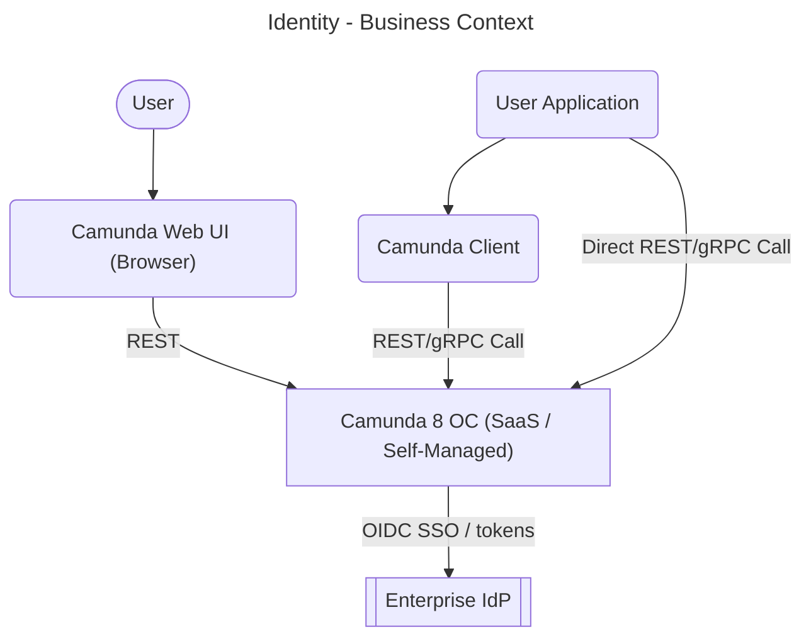
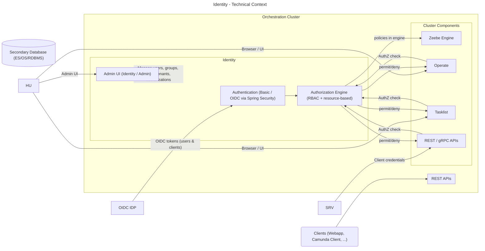
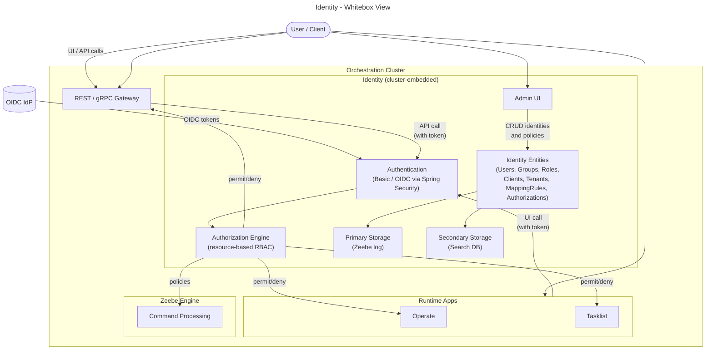

# Identity Module (Orchestration Cluster Identity)

> Status: Draft
>
> Scope: Cluster‑internal Orchestration Cluster Identity.
>
> Out of scope: Management Identity (Web Modeler, Console, Optimize) except where explicitly mentioned.
>
> Camunda Version: 8.9

This documentation is based on [Arc42](https://arc42.org/).

---

# 1. Introduction and goals

## 1.1 Overview

The Identity module is the cluster‑embedded authentication and authorization service for a Camunda 8 Orchestration Cluster.

It provides:

- Unified access management for cluster components: Zeebe, Operate, Tasklist, Orchestration Cluster REST/gRPC APIs.
- Flexible authentication:
  - OIDC with external IdPs (Keycloak, Okta, Auth0, Microsoft Entra ID, Amazon Cognito, and other OIDC providers).
  - Basic authentication.
  - Optional no‑auth for local and simple Self‑Managed setups.
- Fine‑grained, resource‑based authorizations across runtime resources (for example PROCESS_DEFINITION, PROCESS_INSTANCE, USER_TASK).
- Tenant management is handled directly in Orchestration Cluster Identity (Self‑Managed), allowing tenants per cluster for runtime data and access isolation.
- No dedicated identity database; Identity entities reuse Zeebe primary and secondary storage.

### Goals:

1. Provide a single identity surface per Orchestration Cluster that is independent of Management Identity.
2. Enable least‑privilege, resource‑level authorization for both UI and API interactions.
3. Support enterprise IdP integration via OIDC for human SSO and machine‑to‑machine access.
4. Align semantics across SaaS and Self‑Managed, with cluster‑level roles and groups in both.

## 1.2 Requirements overview (functional)

Selected high‑level requirements:

- R1 – Cluster‑scoped access control
  Identity controls access to Zeebe, Operate, Tasklist, and Orchestration Cluster APIs per cluster.

- R2 – External IdP integration
  OIDC integration with enterprise IdPs; mapping of token claims to users, groups, roles, tenants, and authorizations.

- R3 – Fine‑grained authorizations
  Resource‑based permissions evaluated uniformly across UIs and APIs.

- R4 – Multi‑tenancy (Self‑Managed)
  Tenants created, assigned, and enforced at Orchestration Cluster level. Management Identity is no longer a source of truth for runtime tenants.

- R5 – Migration from Management Identity
  Tooling and mappings to migrate users, groups, roles, tenants, mapping rules, and resource authorizations from Management Identity.

## 1.3 Quality goals (top level)

- Security
  Strong, auditable authentication and authorization; OIDC‑based SSO recommended for production.

- Consistency
  Same authorization semantics for UI and API; same conceptual model in SaaS and Self‑Managed.

- Operability
  Minimal extra infrastructure; suitable hooks for observing authentication and authorization flows.

- Extensibility
  Other teams can introduce new resource or permission types while reusing the shared RBAC framework.

## 1.4 Stakeholders

TBD

# 2. Constraints

- Embedded in Orchestration Cluster
  Identity is shipped as part of the Orchestration Cluster artifact (JAR/container).

- Based on Spring Security
  Authentication logic builds on Spring Security, configured via CAMUNDA_SECURITY_* and related properties.

- Multi‑protocol authentication
  Support for Basic and OIDC, with OIDC as the recommended method for production; optional no‑auth for simple setups.

- Shared RBAC framework
  Authorization checks use the shared framework and behaviors owned by the Identity team but extensible by feature teams.

- No Management Identity dependency for runtime
  Engine and runtime UIs should not depend on Management Identity. That component is reserved for Web Modeler, Console, and Optimize in Self‑Managed.

- Reuse of existing storage
  No separate identity database; Identity entities reuse Zeebe primary and secondary storage.

# 3. System context and scope

## 3.1 Business context

Entities:

- User: A human performing modeling, operations, or task work.
- User Application: A client application interacting with Camunda either with a camunda client or REST/gRPC API.
- Camunda Web UI: Console, Web Modeler, Operate, Tasklist, Identity
- Camunda Client: Official language clients - Java client and Spring Boot Starter
- Orchestration Cluster: runtime deployment containing Zeebe, Operate, Tasklist, Identity, REST/gRPC APIs.
- Enterprise IdP: customer IdP providing SSO and tokens via OIDC/SAML (e.g. Okta, Entra, Keycloak, etc.).

## 3.2 Technical context

Entities:
- Clients: Web applications, Camunda clients, and other services interacting with the Orchestration Cluster
- REST APIs: Orchestration Cluster REST API (v2), Administration API, Web Modeler API

- Secondary Database: Elasticsearch, OpenSearch, or RDBMS used for search queries

External interfaces (technical):

- Incoming:
  - Browser‑based UIs (Operate, Tasklist, Admin UI) using OIDC or Basic auth.
  - REST/gRPC APIs for workers, service accounts, and applications (Bearer tokens from IdP).
- Outgoing:
  - OIDC IdP for login redirects, token introspection, or validation depending on IdP use.
- Internal:
  - Calls from UIs and APIs to Authentication and Authorization engine.
  - Persistence of identity entities in primary and secondary storage.

# 4. Solution strategy

- Cluster‑embedded identity service
  Identity runs inside the Orchestration Cluster and is the source of truth for runtime IAM instead of Management Identity.

- Multi‑protocol authentication
  Basic for simple Self‑Managed setups and development.
  OIDC for production with SSO, MFA, and centralized user lifecycle.
  Optional no‑auth for local or demo scenarios.

- Resource‑based authorization
  Fine‑grained authorizations per resource type and action (for example PROCESS_DEFINITION:READ, USER_TASK:ASSIGN) across UIs and APIs.

- Cluster‑local tenant model
  Tenants are managed directly in Identity per cluster. Management Identity tenants remain only for Optimize in Self‑Managed.

- Extensible RBAC library
  Shared helpers and engine behaviors so feature teams can introduce new resource and permission types without re‑implementing authorization logic.

- Reuse of Zeebe storage
  Identity entities are stored using Zeebe’s existing primary (log) and secondary (search) storage instead of a separate identity database.

# 5. Building block view

## 5.1 Whitebox overall system

Main building blocks:

- REST / gRPC gateway: ingress for client APIs; forwards authenticated calls into engine and services.
- Operate, Tasklist: web UIs; rely on Identity for login and resource‑level authorization.
- Zeebe engine: processes commands; uses authorization helpers when executing operations on behalf of a user or client.
- Identity Admin UI: web UI embedded in cluster for managing users, groups, roles, tenants, clients, mapping rules, and authorizations.
- Authentication: Spring Security configuration for Basic and OIDC, including token validation and session handling.
- Authorization engine: RBAC framework and resource‑based checks used by engine and service layer.
- Identity entities: domain model for users, groups, roles, tenants, mapping rules, authorizations, clients.
- Primary / secondary storage: persistent representation of identity entities in Zeebe log and search database.

## 5.2 Internal structure: Orchestration Cluster Identity

Responsibilities:

- Source of truth for runtime identity and access in an Orchestration Cluster.
- Admin UI and APIs for managing identity entities.
- Authentication for web UIs and machine APIs.
- Authorization checks for all cluster components via the shared RBAC engine.

Key sub‑components:

- Admin UI / Orchestration Cluster Admin
  Management for users, groups, roles, tenants, mapping rules, and authorizations.

- Authentication
  - Basic: credentials stored and validated inside Identity; suitable for local and simple Self‑Managed setups.
  - OIDC: login delegated to external IdP; mapping rules assign principals to roles, groups, tenants, and authorizations.

- Identity entities
  - Users, groups, roles: core principal and grouping model; roles bundle permissions.
  - Authorizations: resource‑based permissions connecting principals to resource types and actions.
  - Tenants: data and access isolation within a cluster (Self‑Managed).
  - Clients: technical clients (M2M) mapped from IdP client registrations.
  - Mapping rules: link IdP claims to groups, roles, tenants, and authorizations.

- Authorization engine
  Shared framework that allows other teams to define resource and permission types and use them consistently. Integrated with Zeebe engine, REST gateway, and services.

# 6. Runtime view

## 6.1 User login (OIDC)

Scenario: human user logs into Operate or Tasklist via OIDC.

1. Browser navigates to a cluster UI (for example Operate).
2. Identity redirects the browser to the external IdP for login.
3. IdP authenticates the user and returns ID/access tokens.
4. Identity validates the token, extracts username and group or attribute claims, and applies mapping rules.
5. Authorization engine evaluates authorizations to decide which UI features and data are accessible.
6. Subsequent UI or API calls include the session or token and are checked by the authorization engine.

## 6.2 Machine‑to‑machine access (workers and services)

Scenario: worker or backend service calls REST or gRPC APIs.

1. Worker or service acquires a JWT via OAuth2 client credentials from the IdP.
2. It sends the token with REST or gRPC calls to the Orchestration Cluster.
3. Identity validates the token and maps the client to an Identity client entity and associated roles or authorizations.
4. Authorization engine checks permissions for each requested operation (for example deploying processes, completing tasks).
5. Engine and services execute or reject operations based on the authorization decision.

# 7. Deployment view

Identity‑specific aspects:

- Orchestration Cluster packaging
  Identity is part of the Orchestration Cluster deployment artifact (JAR/container) for SaaS and Self‑Managed.

- Storage
  Identity entities are stored using:
  - Primary storage: the Zeebe log (for durability and replay).
  - Secondary storage: the configured search database (for query and admin UI).

- Self‑Managed deployments
  - Typically deployed on Kubernetes using the Camunda 8 Helm charts.
  - Identity runs within the Orchestration Cluster pods; no separate identity database or service is required for runtime.

- SaaS deployments
  - Orchestration Clusters are hosted by Camunda.
  - Identity is included per cluster and integrated with Camunda’s SaaS control plane and IdP setup.

For detailed infrastructure topologies, see the Camunda 8 reference architectures listed in the sources appendix.

# 8. Crosscutting concepts

- Authentication concept
  Unified Spring Security configuration for Basic and OIDC.
  Pluggable IdP integration through standard OIDC configuration.

- Authorization and RBAC concept
  Central resource‑based authorization model, decoupled from individual UIs and services.
  Shared checks used by engine, Operate, Tasklist, and APIs.

- Tenant concept
  Cluster‑local tenants defined in Identity.
  Tenants applied across runtime resources for data and access isolation (Self‑Managed).

- Mapping rules concept
  Declarative mapping from IdP claims (groups, attributes) to Identity entities such as groups, roles, tenants, authorizations.
  Enables identity‑as‑code and external lifecycle via IdP.

- Migration concept (from Management Identity)
  Identity Migration tooling to move roles, groups, tenants, resource authorizations, and mapping rules.
  Designed to be idempotent and re‑runnable.

- Storage and consistency
  Identity state follows Zeebe’s durability and snapshot mechanisms via shared storage.
  Secondary storage ensures efficient querying for Admin UI and APIs.

# 9. Architectural decisions

## ADR‑ID‑1: Cluster‑embedded Identity instead of external component

- Status: accepted
- Context: before 8.8, runtime components depended on Management Identity plus Keycloak and Postgres, which increased operational overhead and coupling.
- Decision: embed Identity directly in Orchestration Cluster and treat it as source of truth for runtime IAM.
- Consequences:
  - Fewer moving parts for runtime; easier high availability and disaster recovery.
  - Runtime access does not depend on Management Identity availability.
  - Additional migration complexity, handled by migration tooling.

## ADR‑ID‑2: OIDC as default production authentication

- Status: accepted
- Context: Basic authentication is simple but does not provide MFA, SSO, account lockout, or password policies.
- Decision: recommend OIDC as the default authentication method for production (SaaS and Self‑Managed).
- Consequences:
  - Better security and user experience through SSO and MFA.
  - Requires customers to operate or adopt an OIDC‑capable IdP.

## ADR‑ID‑3: Resource‑based authorization model

- Status: accepted
- Context: the previous Management Identity model did not provide sufficient granularity for all runtime resources; Tasklist and Operate had separate access controls.
- Decision: introduce flexible, resource‑based authorizations in Identity and migrate Management Identity permissions to this new model.
- Consequences:
  - Consistent authorization semantics across UIs, APIs, and resource types.
  - Additional migration work, but a clearer long‑term model.

# 10. Quality requirements

(See also section 1.3 for top‑level quality goals.)

- Security
  - Support strong authentication (OIDC with enterprise IdPs, MFA).
  - Provide least‑privilege authorization at resource level.
  - Ensure auditable changes to identity entities and authorizations.

- Consistency
  - Apply the same authorization semantics for:
    - Human users and service accounts.
    - UI operations and API calls.
  - Align concepts (users, groups, roles, tenants, authorizations) across SaaS and Self‑Managed.

- Operability
  - Minimize additional infrastructure required for Identity (reuse existing storage, embed into cluster).
  - Provide clear logging and metrics for authentication and authorization flows and migrations.

- Extensibility
  - Allow product teams to:
    - Add new resource types (for example new APIs or UI features).
    - Define new permission types within the shared RBAC framework.
  - Keep Identity and RBAC changes backwards compatible where possible.

# 11. Risks and technical debt

- Migration complexity and failure modes
  Migration from Management Identity introduces complexity and potential misconfiguration (for example mismatched IdP setups, conflicting mapping rules).
  Mitigation: dedicated Identity Migration App, idempotent runs, detailed logs; still requires careful testing in customer environments.

- Dual identity model during transition
  Management Identity remains for Web Modeler, Console, and Optimize (Self‑Managed) while Orchestration Cluster Identity serves runtime.
  Risk of confusion about the source of truth and duplicated configuration until long‑term consolidation is complete.

- IdP dependency
  For OIDC, availability and correctness of the external IdP are critical for login and token issuance.
  Misconfigured claims or group mappings can lead to over‑ or under‑provisioned access.

# 12. Glossary

| Term                           | Definition                                                                                                     |
|--------------------------------|----------------------------------------------------------------------------------------------------------------|
| Orchestration Cluster          | Unified Camunda 8 runtime: Zeebe, Operate, Tasklist, Identity, REST/gRPC APIs.                                |
| Orchestration Cluster Identity | Cluster‑embedded identity service for authentication, authorization and identity entities.                    |
| Orchestration Cluster Admin    | UI surface for cluster Identity (new name in 8.9); hosts identity features.                                   |
| Management Identity            | Standalone identity app (Self‑Managed) for Web Modeler, Console and Optimize.                                 |
| Tenant                         | Logical partition of data and access within a cluster (runtime multi‑tenancy).                                |
| Authorization                  | Permission linking a principal to a resource type and action (for example READ, UPDATE, DELETE).              |
| Mapping rule                   | Rule mapping IdP claims (groups, attributes) to identity entities such as groups, roles, tenants, authorizations. |
| User                           | Human user performing modeling, operations or task work.                                                      |
| Service accounts / workers     | Non‑interactive clients calling REST/gRPC APIs using client credentials.                                      |
| OIDC IdP                       | External identity provider; source of identity, attributes and group claims.                                  |
| Cluster components             | Runtime components enforcing Identity decisions for user and client operations.                               |

Appendix A – sources

- docs: Rename Orchestration Cluster Identity to Admin (8.9)
- Introduction to Identity – Camunda 8 Docs
- What’s new in Camunda 8.8 – Camunda 8 Docs
- Identity and access management in Camunda 8 – Camunda 8 Docs
- Orchestration Cluster authentication in Self‑Managed – Camunda 8 Docs
- Identity – Ownership (internal)
- 8.8 Release notes – Camunda 8 Docs
- Connect Identity to an identity provider – Camunda 8 Docs
- Upgrade Camunda components from 8.7 to 8.8 – Camunda 8 Docs
- Camunda 8 reference architectures – Camunda 8 Docs
