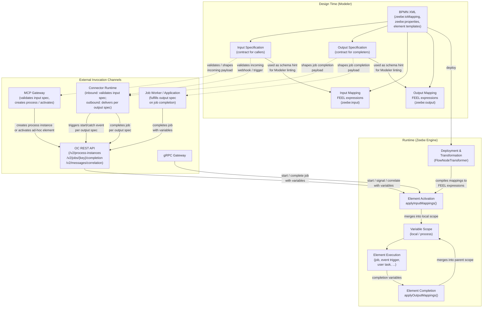
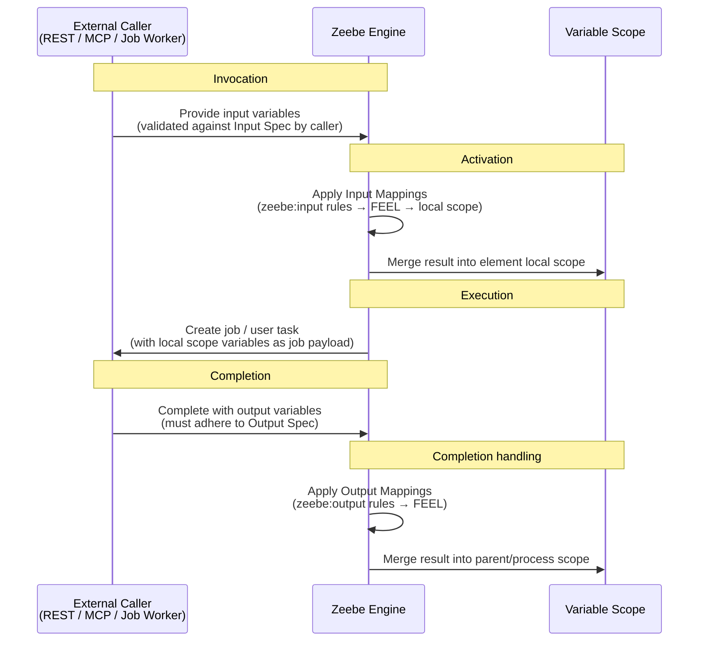
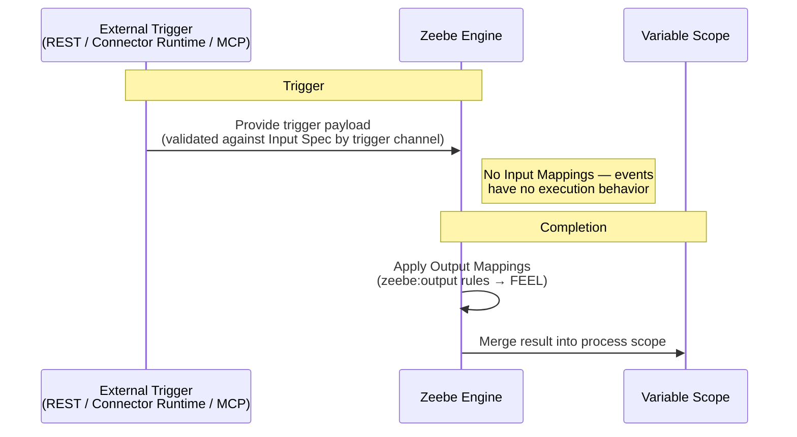
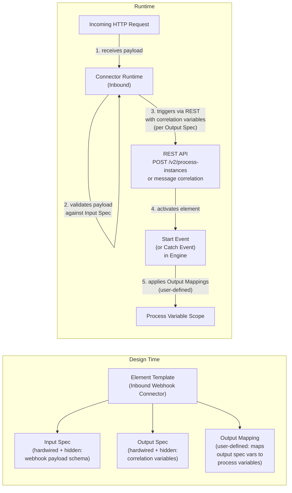
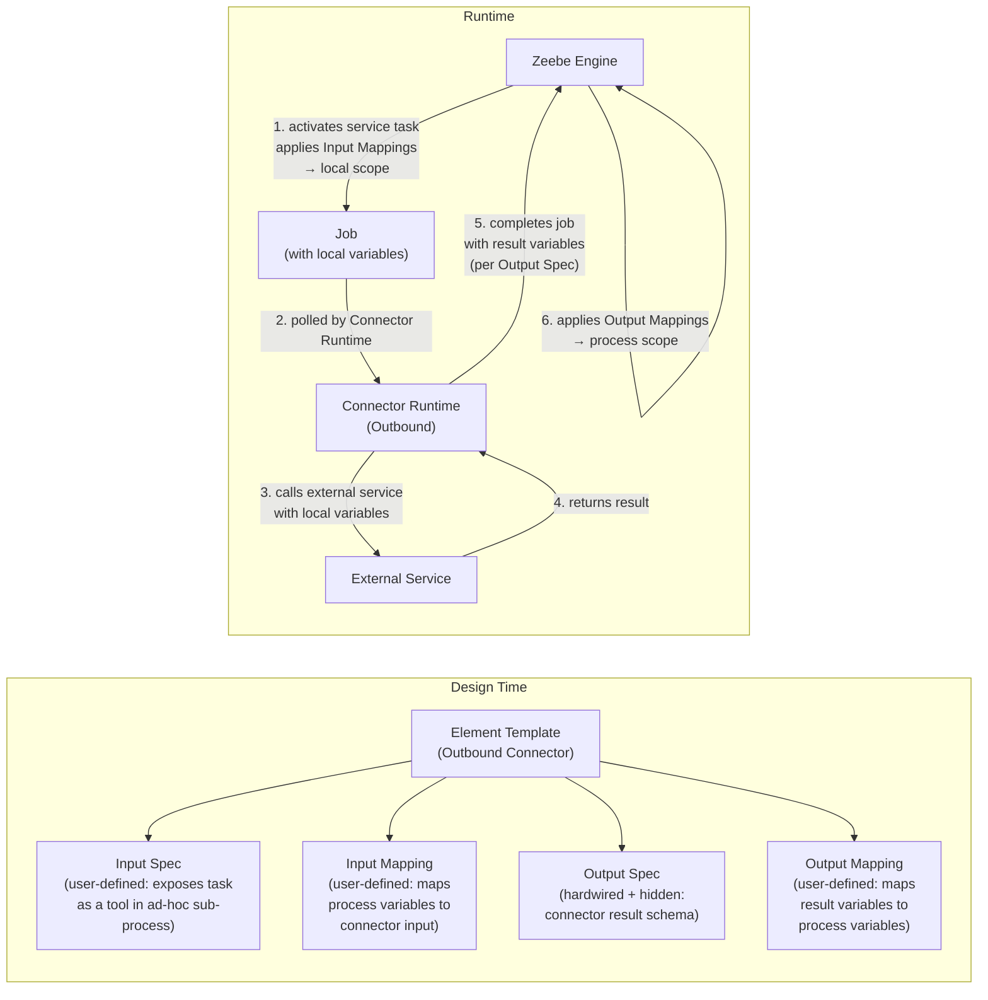
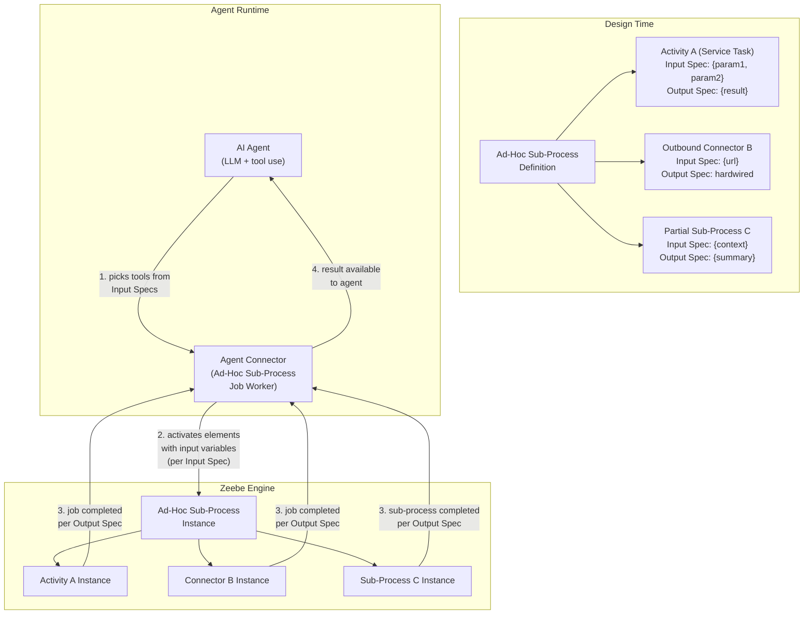
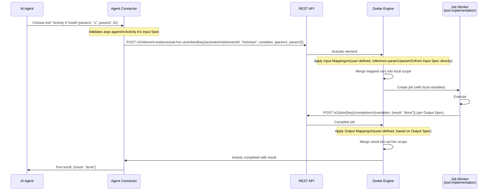
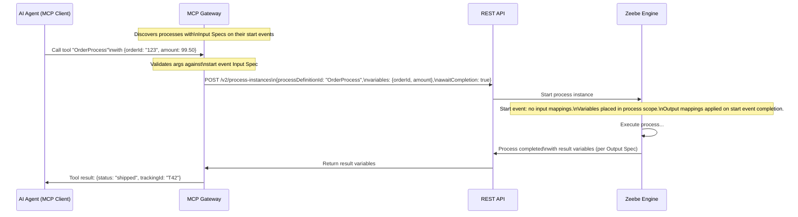
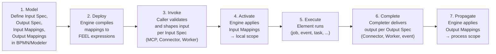

# I/O Specification and Mapping Architecture

This document describes the architectural design for input/output specifications and
input/output mappings across the Camunda 8 platform — from process modeling through execution
to external invocation via the REST API, MCP gateway, and Connector Runtime.

> **Context:** This architecture underpins the extensible I/O contract model introduced to unify
> how process elements expose themselves as tools (MCP, Connectors, ad-hoc sub-process activities)
> while keeping the engine's existing variable-mapping semantics intact.

## Concepts

Four distinct concepts compose the full I/O contract for any process element:

| Concept | Where Defined | Role |
|---|---|---|
| **Input Specification** | BPMN / element template | External contract: what callers **must provide** to invoke the element |
| **Input Mapping** | BPMN `zeebe:ioMapping` (inputs) | Internal transformation: how provided inputs are shaped into local scope variables |
| **Output Specification** | BPMN / element template | External contract: what the element **produces** when it completes |
| **Output Mapping** | BPMN `zeebe:ioMapping` (outputs) | Internal transformation: how completion results are written back into process scope |

### Relationship between spec and mapping

The specification is the **contract**; the mapping is the **implementation**:

- The input specification tells external systems (callers, gateways, connectors) what variables to
  supply. The input mapping then optionally reshapes those variables before they are visible inside
  the element's local scope.
- The output specification tells external systems (job workers, connectors) what variables to
  deliver on completion. The output mapping then optionally reshapes those variables before they
  propagate into the parent process scope.

When no mapping is defined, variables flow through transparently as described by the specification.

### Special case: start events and intermediate catch events

Start events and catch events do not have input mappings because they have no execution behavior —
they simply wait to be triggered. The input specification still describes what the external trigger
must provide. Output mappings work as for any other element: they control how the trigger's payload
propagates into the process scope after the event completes.

---

## Core Architecture

---

## Element Lifecycle: I/O Flow

### Activities (service task, business rule task, user task, …)

### Start Events and Intermediate Catch Events

---

## Invocation Channel Responsibilities

### OC REST API (and gRPC)

The REST API is the canonical invocation layer. It does not enforce input or output specifications
on its own; enforcement is the caller's responsibility. The API accepts variables as an opaque map
and passes them to the engine:

- `POST /v2/process-instances` → starts a process, passes `variables` to the root scope
- `POST /v2/jobs/{jobKey}/completion` → completes a job, passes `variables` as completion payload
- `POST /v2/messages/correlation` → correlates a message, passes `variables` as message payload
- `POST /v2/element-instances/ad-hoc-activities/{key}/activation` → activates ad-hoc elements
  with per-element `variables`

The input specification defines the expected shape of those variable maps.
The output specification defines the expected shape of the completion/trigger payload.

### MCP Gateway

The MCP gateway translates MCP tool calls into REST API calls. It can:

1. **Discover** process elements exposed as tools (processes via start events, ad-hoc sub-process
   activities, etc.) from the process definition and its input specification.
2. **Validate** the AI-provided arguments against the element's input specification before
   forwarding to the REST API.
3. **Reshape** tool arguments into the variable map the REST API expects.

The MCP gateway sits _between_ the AI agent and the REST API and is therefore the right place for
input validation and schema enforcement.

### Connector Runtime

The Connector Runtime manages both inbound and outbound connectors:

- **Inbound connectors** receive an external trigger (e.g. a webhook). The Connector Runtime
  validates the incoming payload against the element's input specification, then correlates or
  starts the process via the REST API, sending the correlated payload as the trigger variables.
  The output specification governs what those variables must look like when they reach the engine.
- **Outbound connectors** execute as job workers. They pick up jobs, perform their action, and
  complete the job with a result. The output specification describes the expected shape of that
  result. The Connector Runtime (or the connector itself) can enforce this before calling the
  completion API.

### Job Worker Applications

A general job worker application fulfills the output specification on job completion. The
specification can be surfaced to the job worker as a schema (e.g. via the element template or a
dedicated API endpoint) so the worker can validate its output before submitting.

---

## Use Cases

### Use Case 1: Inbound Connector (Webhook → Process Start)

An inbound connector exposes an HTTP webhook that starts a process whenever a request arrives.

**Key points:**
- The input specification and output specification are hardwired and hidden by the element template.
  Users cannot change them — the connector itself defines the contract.
- The user defines output mappings to control how the correlation variables (defined by the output
  spec) propagate into named process variables.
- There is no input mapping because start/catch events do not transform inputs — the input
  specification describes what the Connector Runtime itself validates and forwards.

### Use Case 2: Outbound Connector (Service Task)

An outbound connector executes as a job worker and calls an external service.

**Key points:**
- The output specification is hardwired and hidden: the connector always produces the same result
  shape, regardless of how it is used. The Connector Runtime enforces this on job completion.
- The user defines the input specification if the outbound connector should be available as a
  tool in an agentic ad-hoc sub-process. This spec describes what the AI agent must supply.
- The user defines input mappings to shape process variables into the connector's expected input
  (no need to know internal variable names like `toolCall`).
- The user defines output mappings to extract the connector's result into named process variables.

### Use Case 3: Agentic AI Ad-Hoc Sub-Process

An AI agent orchestrates a set of activities inside an ad-hoc sub-process. Each activity is a
"tool" the agent can invoke.

**Detailed element activation flow:**

**Key points:**
- Elements without incoming flow are "tools" the agent can invoke. Their input specification is
  the tool schema — the agent must provide the described parameters.
- Input mappings reference the input specification parameters directly (no hidden `toolCall`
  variable needed). If no mapping is defined, the input spec variables are passed through as-is.
- Elements without outgoing flow produce results. Their output specification describes what they
  return. Output mappings shape those results back into the ad-hoc sub-process scope.
- The agent connector validates the AI-provided arguments against the input specification before
  activating elements via the REST API — analogous to how the MCP gateway validates inputs for
  process-as-tool invocations.

### Use Case 4: Process as a Tool via MCP Gateway

A complete process is exposed as an MCP tool. An AI agent starts it with specific inputs and
waits for it to complete.

**Key points:**
- The start event's input specification defines the tool's input schema as seen by the MCP gateway.
- The start event has no input mappings (by design — catch/start events skip input mappings).
- The process's output specification (on the end event or process level) defines what the MCP
  gateway returns as the tool result.
- The MCP gateway handles `awaitCompletion` semantics transparently.

---

## Where Each Concept Lives in Code

| Concept | BPMN Representation | Engine Model | Runtime Application |
|---|---|---|---|
| Input Mapping | `zeebe:ioMapping / zeebe:input` | `ExecutableFlowNode.inputMappings` (FEEL `Expression`) | `BpmnVariableMappingBehavior.applyInputMappings()` on element ACTIVATING |
| Output Mapping | `zeebe:ioMapping / zeebe:output` | `ExecutableFlowNode.outputMappings` (FEEL `Expression`) | `BpmnVariableMappingBehavior.applyOutputMappings()` on element COMPLETING |
| Input Specification | `zeebe:properties` / element template | (stored in BPMN; future: exposed via process definition API) | Validated by MCP gateway / Connector Runtime / Agent Connector before API call |
| Output Specification | `zeebe:properties` / element template | (stored in BPMN; future: exposed via process definition API) | Validated by Connector Runtime / Job Worker before job completion |

**Key source files:**
- `zeebe/bpmn-model/.../zeebe/ZeebeIoMapping.java` — BPMN model for `zeebe:ioMapping`
- `zeebe/engine/.../transformer/FlowNodeTransformer.java` — compiles mappings to FEEL expressions
- `zeebe/engine/.../transformer/VariableMappingTransformer.java` — FEEL expression builder for mappings
- `zeebe/engine/.../behavior/BpmnVariableMappingBehavior.java` — runtime application of mappings
- `gateways/gateway-mcp/.../tool/process/instance/ProcessInstanceTools.java` — MCP tool: create process instance
- `gateways/gateway-mcp/.../tool/process/definition/ProcessDefinitionTools.java` — MCP tool: discover processes
- `zeebe/gateway-rest/.../controller/AdHocSubProcessActivityController.java` — REST: activate ad-hoc elements

---

## Summary: The I/O Contract Lifecycle

