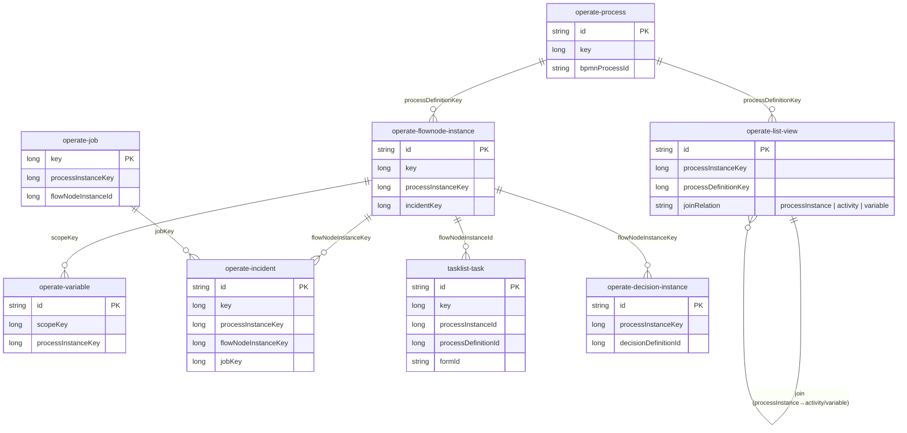

# Elasticsearch / OpenSearch Data Model Reference

This document describes the harmonized indices that make up the Elasticsearch/OpenSearch
secondary-storage schema, how they relate to each other, and how documents flow through the
system — from the Zeebe engine into the search engine and back out through the V2 REST API.

It is the Elasticsearch/OpenSearch counterpart of the
[RDBMS Data Model Reference](../rdbms/data-model.md). The two backends serve the same domain
model through the same `search-client` abstraction; only the storage mechanics differ.

> **Scope.** This describes the **CamundaExporter** indices (`operate-*`, `tasklist-*`,
> `camunda-*`) on the current `main` (8.10-era) codebase. It does **not** cover the raw
> `zeebe-record-*` indices written by the standalone Elasticsearch/OpenSearch exporters, nor the
> independent `optimize-*` schema, which Optimize manages itself.

---

## 1. Index Overview

Unlike the RDBMS backend, the search backend has two physical shapes:

- **Plain indices** — slowly-changing reference and identity data. One index per descriptor,
  created up front. Documents are upserted/deleted in place; there is no time-based rollover.
- **Index templates** — high-volume runtime and historical data. The template governs a *main*
  write index (e.g. `operate-list-view-8.3.0_`) plus any number of dated historical indices
  created by the archiver (e.g. `operate-list-view-8.3.0_2026-06-12`). Both the main and dated
  indices are covered by a read alias (e.g. `operate-list-view-8.3.0_alias`) so queries span the
  whole history transparently.

Every index name follows the pattern
`{prefix-}{component}-{entity}-{schemaVersion}_` with a stable read alias `…_alias`
(`AbstractIndexDescriptor`). The `schemaVersion` is the *index schema* version of that descriptor
(e.g. `8.3.0`), not the product version — see [§4.4](#44-schema-versioning-and-upgrades).

Indices are defined by descriptor classes in
`webapps-schema/src/main/java/io/camunda/webapps/schema/descriptors/` (`…/index/` for plain
indices, `…/template/` for templates), with the backing mapping JSON in
`webapps-schema/src/main/resources/schema/{elasticsearch,opensearch}/create/{index,template}/`.

### Process / Decision Definitions (static model)

Written once at deploy time; a new version of the same definition is a new document with a higher
`version`. Plain indices.

| Index (alias base)              | Descriptor                  | Description                                                                                  |
|---------------------------------|-----------------------------|----------------------------------------------------------------------------------------------|
| `operate-process`               | `ProcessIndex`              | Deployed BPMN process definitions: `bpmnProcessId`, `version`, `versionTag`, BPMN XML, tenant. |
| `operate-decision`              | `DecisionIndex`             | DMN decision definitions; references a decision-requirements group.                          |
| `operate-decision-requirements` | `DecisionRequirementsIndex` | DMN Decision Requirements Graph (DRG), including the XML source.                              |
| `tasklist-form`                 | `FormIndex`                 | Embedded form schemas (JSON), linked from process definitions and user tasks.                |
| `camunda-deployed-resource`     | `DeployedResourceIndex`     | Generic deployed resources (Connector templates, RPA scripts, AI Agent configs).            |

### Process Instance Runtime (templates)

Live and historical execution state. Inserted when execution starts; updated as it progresses;
archived to dated indices and eventually deleted by retention.

| Index (alias base)                        | Descriptor                            | Description                                                                                                            |
|-------------------------------------------|---------------------------------------|----------------------------------------------------------------------------------------------------------------------|
| `operate-list-view`                       | `ListViewTemplate`                    | Denormalized process-instance + flow-node + variable view powering Operate's list view. A `join` field links child docs to their process-instance parent. |
| `operate-flownode-instance`               | `FlowNodeInstanceTemplate`            | One doc per executing BPMN element (activity/gateway/event): `state`, `type`, `treePath`, start/end dates.            |
| `operate-variable`                        | `VariableTemplate`                    | One doc per variable per scope. Large values stored in `fullValue` with a truncated preview in `value` (`isPreview`).  |
| `operate-incident`                        | `IncidentTemplate`                    | Incidents: `errorType`, `errorMessage`, `state`, references to flow-node and job.                                    |
| `operate-job`                             | `JobTemplate`                         | Jobs: `type`, `worker`, `retries`, `state`, `deadline`.                                                              |
| `operate-sequence-flow`                   | `SequenceFlowTemplate`                | Sequence flows (edges) taken within a process instance.                                                              |
| `operate-decision-instance`              | `DecisionInstanceTemplate`            | One doc per DMN evaluation, with inputs/outputs and failure reason.                                                  |
| `operate-message` / `…-correlated-…`      | `MessageTemplate` / `Correlated…`     | Published messages and correlated message subscriptions.                                                             |
| `tasklist-task`                           | `TaskTemplate`                        | User task instances: `assignee`, `candidateGroups`, `state`, `priority`, due/follow-up dates, form linkage.          |
| `tasklist-task-variable`                  | `SnapshotTaskVariableTemplate`        | Task-scoped variable snapshots.                                                                                      |
| `tasklist-draft-task-variable`            | `DraftTaskVariableTemplate`           | Draft (unsaved) task input variables.                                                                                |
| `camunda-wait-state`                      | `WaitStateTemplate`                   | Current wait states of element instances.                                                                            |
| `camunda-agent-instance` / `…-history`    | `AgentInstanceTemplate` / `AgentHistory…` | AI Agent task executions and their iteration history (token usage, model/provider).                              |

### Batch / Async Operations (templates)

| Index (alias base)             | Descriptor                  | Description                                                                       |
|--------------------------------|-----------------------------|-----------------------------------------------------------------------------------|
| `operate-operation`            | `OperationTemplate`         | Single user-initiated operations (cancel, modify, migrate, resolve incident).     |
| `operate-batch-operation`      | `BatchOperationTemplate`    | Batch operations: total/completed/failed counters and overall `state`.            |
| `operate-post-importer-queue`  | `PostImporterQueueTemplate` | Queue of post-import actions needed for eventual consistency (e.g. incidents).    |

### Identity and Access Management (plain indices)

| Index (alias base)       | Descriptor              | Description                                                                                      |
|--------------------------|-------------------------|--------------------------------------------------------------------------------------------------|
| `camunda-user`           | `UserIndex`             | Camunda-managed users (local auth): username, name, email, hashed password.                      |
| `camunda-group`          | `GroupIndex`            | Groups; members modeled via an ES parent/child `join`.                                            |
| `camunda-role`           | `RoleIndex`             | Roles; members modeled via `join`.                                                                |
| `camunda-tenant`         | `TenantIndex`           | Tenants; members (users/groups/roles) modeled via `join`.                                          |
| `camunda-authorization`  | `AuthorizationIndex`    | Permission assignments: `ownerId`/`ownerType` → `permissionTypes` on `resourceType`/`resourceId`. |
| `camunda-mapping-rule`   | `MappingRuleIndex`      | Claim-based mapping rules from an OIDC token claim to a Camunda identity.                          |

### Audit and Metrics

| Index (alias base)            | Descriptor                | Shape    | Description                                                                       |
|-------------------------------|---------------------------|----------|-----------------------------------------------------------------------------------|
| `camunda-audit-log`           | `AuditLogTemplate`        | template | Append-only audit trail: actor, category, entity references, timestamp, result.   |
| `camunda-usage-metric`        | `UsageMetricTemplate`     | template | Aggregated usage counters per time window and tenant (license reporting).         |
| `camunda-usage-metric-tu`     | `UsageMetricTUTemplate`   | template | Task-user metrics: unique assignee hashes per time window.                         |
| `camunda-job-metrics-batch`   | `JobMetricsBatchTemplate` | template | Pre-aggregated job stats per time window / type / worker.                          |
| `camunda-cluster-variable`    | `ClusterVariableIndex`    | index    | Cluster-scoped (non-process) variables.                                            |

### Infrastructure

| Index (alias base)                    | Description                                                                                      |
|---------------------------------------|--------------------------------------------------------------------------------------------------|
| `operate-import-position` / `tasklist-import-position` | Last exported/imported Zeebe record position per partition. The CamundaExporter equivalent of the RDBMS `EXPORTER_POSITION` table. |
| `operate-metadata`                    | Operate internal metadata key/value store.                                                       |
| `camunda-web-session`                 | Persistent HTTP session store for the web applications.                                          |
| `camunda-history-deletion`            | Staging records of resources scheduled for history-cleanup deletion.                             |
| `camunda-audit-log-cleanup`           | Tracking records for audit-log cleanup.                                                          |

> The exact set of indices grows release to release (e.g. `camunda-deployed-resource`,
> `camunda-agent-*` are 8.10-era additions). The authoritative, always-current list is the set of
> descriptor classes under `webapps-schema/.../descriptors/`.

---

## 2. Index Relationships

The search backend is a **read model**. Elasticsearch/OpenSearch have no foreign keys, so
relationships are expressed in one of three ways:

1. **Shared key fields** — documents in different indices carry the same business key
   (`processInstanceKey`, `flowNodeInstanceKey`, `processDefinitionKey`), and the read layer joins
   them at query time. This is the dominant pattern and mirrors the FK-less columns of the RDBMS
   model.
2. **Parent/child `join` within one index** — `operate-list-view` co-locates a process-instance
   document with its flow-node-instance and variable child documents using an ES `join` field and
   `processInstanceKey` routing, so they live on the same shard. Identity indices
   (`camunda-role`, `camunda-group`, `camunda-tenant`) use the same mechanism for membership.
3. **Routing** — runtime child documents are routed by `processInstanceKey` so that all documents
   for one instance are co-located, making the joins above cheap.



> **Note on the list-view join.** `operate-list-view` is intentionally denormalized: a single
> index holds three document kinds (`processInstance`, `activity`, `variable`) linked by a `join` field
> and `processInstanceKey` routing. This is what lets Operate's main screen filter instances by
> variable value or active activity in one query, without a cross-index join.

---

## 3. End-to-End Example: Starting a Process Instance

The write path is asynchronous and batched, just like the RDBMS exporter — only the sink differs.
The general CQRS pattern (REST → service → broker → engine → exporter; reads served from secondary
storage via `search-client`) is shared with the RDBMS backend.

```mermaid
sequenceDiagram
  autonumber
  actor Client
  participant REST as REST Gateway<br/>(ProcessInstanceController)
  participant SVC as ProcessInstanceServices
  participant Broker as Zeebe Broker
  participant Engine as Zeebe Engine
  participant Exporter as CamundaExporter
  participant Writer as ExporterBatchWriter
  participant Handler as ListViewProcessInstance…Handler
  participant ES as Elasticsearch/OpenSearch
  participant Search as ProcessInstanceSearchClient

  Client ->> REST: POST /v2/process-instances
  REST ->> SVC: createProcessInstance(request)
  SVC ->> Broker: BrokerClient.sendRequest(CreateProcessInstance)
  Broker ->> Engine: command PROCESS_INSTANCE:CREATE
  Engine -->> Broker: record PROCESS_INSTANCE:ELEMENT_ACTIVATING (bpmnType=PROCESS)
  Broker ->> Exporter: export(record)
  Exporter ->> Handler: handlesRecord(record) → true
  Exporter ->> Handler: updateEntity(record) → ProcessInstanceForListViewEntity
  Handler ->> Writer: batchRequest.upsert(operate-list-view, id, entity, fields)
  Note over Writer,ES: Buffered; flushed as one bulk request<br/>on the partition thread.
  Writer -->> ES: (batched) bulk upsert
  Engine -->> SVC: BrokerResponse(processInstanceKey)
  SVC -->> REST: ProcessInstanceResult
  REST -->> Client: 200/201 { processInstanceKey }

  Client ->> REST: GET /v2/process-instances/{key}
  REST ->> SVC: getProcessInstance(key)
  SVC ->>+ Search: ProcessInstanceSearchClient.findOne(key)
  Search ->> ES: search on operate-list-view-…_alias (resolved from descriptor)
  ES -->>- Search: hit
  Search -->> SVC: ProcessInstanceEntity
  REST -->> Client: 200 OK { processInstance }
```

The same shape applies to every entity: a handler in
`zeebe/exporters/camunda-exporter/.../handlers/` turns a Zeebe record into an entity and enqueues
an upsert/add/delete on the `ExporterBatchWriter`; the batch is flushed as a single ES/OS bulk
request; reads are served from the alias resolved out of the descriptor by the
`search-client-query-transformer`.

---

## 4. Data Lifecycle

As in the RDBMS model, write patterns differ by entity role. The handler that owns each pattern
lives in `zeebe/exporters/camunda-exporter/src/main/java/io/camunda/exporter/handlers/`.

### 4.1 Append-only / write-once entities

Some entities are written once and never updated — only deleted (via archiving/retention):

| Zeebe record intent                      | Handler                                  | ES/OS operation |
|------------------------------------------|------------------------------------------|-----------------|
| `PROCESS_INSTANCE:SEQUENCE_FLOW_TAKEN`   | `SequenceFlowHandler`                    | `add` (insert)  |
| `PROCESS_INSTANCE:SEQUENCE_FLOW_DELETED` | `SequenceFlowDeletedHandler`             | `delete`        |
| `VARIABLE:CREATED` (non-migrated)        | `VariableHandler`                        | `add` (insert)  |
| `DECISION_EVALUATION:*`                  | `DecisionEvaluationHandler`              | `add` (insert)  |

### 4.2 Mutated-in-place entities (upsert on state change)

Long-lived entities are **upserted**: the same document id is written on each lifecycle event,
and only the changed fields are updated. The id is derived from the Zeebe key, so a later state
change targets the same document rather than creating a new one.

`operate-list-view` / `operate-flownode-instance` process-instance and flow-node docs
(`ListViewProcessInstanceFromProcessInstanceHandler`, `FlowNodeInstanceFromProcessInstanceHandler`):

| Zeebe record intent                                      | ES/OS operation                            |
|----------------------------------------------------------|--------------------------------------------|
| `PROCESS_INSTANCE:ELEMENT_ACTIVATING`                    | `upsert` (state `ACTIVE`, `startDate`)     |
| `PROCESS_INSTANCE:ELEMENT_COMPLETED`                     | `upsert` (state `COMPLETED`, `endDate`)    |
| `PROCESS_INSTANCE:ELEMENT_TERMINATED`                    | `upsert` (state `CANCELED`/`TERMINATED`)   |
| `PROCESS_INSTANCE:ELEMENT_MIGRATED` / `ANCESTOR_MIGRATED`| `upsert` (process definition, `treePath`)  |

`tasklist-task` (`UserTaskCreatingHandler` for the initial insert, `UserTaskHandler` for the rest)
follows the same idea across the user-task lifecycle (`CREATING` → `CREATED` → `ASSIGNING`/
`ASSIGNED` → `COMPLETING` → `COMPLETED`/`CANCELED`). `IncidentHandler` upserts on `CREATED`/
`MIGRATED`; the linked flow-node's `incidentKey` is set/cleared by
`FlowNodeInstanceFromIncidentHandler` on `CREATED`/`RESOLVED`.

Identity entities are upserted on create/update and hard-`delete`d on delete
(`UserCreatedUpdatedHandler` + `UserDeletedHandler`, and the analogous Group/Role/Tenant/
Authorization/MappingRule pairs). Membership changes use add/delete of `join` child documents
(`RoleMemberAddedHandler` / `RoleMemberRemovedHandler`, etc.).

### 4.3 Archiving: main index → dated historical indices

This is the key behavior that has no RDBMS equivalent (RDBMS uses TTL deletion only). Runtime data
is written to the **main** index (`operate-list-view-8.3.0_`). A background **archiver** then moves
*finished* documents into **dated** indices.

- **What moves:** documents whose `endDate`/`endTime` is older than a wait period (default ~1h).
- **Where to:** a sibling index suffixed with the rollover bucket date,
  `operate-list-view-8.3.0_2026-06-12` (suffix computed by `DateOfArchivedDocumentsUtil` from the
  document's end date, rounded to the rollover interval — default `1d`).
- **How:** `ArchiverJob` / `ProcessInstanceArchiverJob` / `BatchOperationArchiverJob` drive it via
  the `ArchiverRepository` (`Elasticsearch`/`OpenSearchArchiverRepository`): a reindex-by-id into
  the dated index, then a delete-by-query from the main index. Process-instance dependents
  (variables, flow nodes, incidents, …) are archived alongside their root instance.
- **Why:** keeps the hot write index small while the read **alias** still spans every dated index,
  so queries see the full history transparently.

Code: `zeebe/exporters/camunda-exporter/src/main/java/io/camunda/exporter/tasks/archiver/`.

### 4.4 Schema versioning and upgrades

Each descriptor carries an **index schema version** baked into its name
(`operate-list-view-8.3.0_`). This is independent of the product version and only changes when the
*shape* of that index changes.

- On startup, `SchemaManager` (in `schema-manager/`) creates missing templates/indices and
  reconciles mappings. `IndexSchemaValidator` compares the descriptor's desired mapping against the
  live mapping (`IndexMappingDifference`):
  - **new fields** → applied in place via `putMapping` (non-breaking, no reindex);
  - **type changes** → rejected with a validation error (would require a manual reindex / a new
    schema version).
- Because additive changes are applied to existing indices, a minor/patch upgrade that only adds
  fields keeps the same versioned index name and aliases. A breaking shape change is what bumps the
  descriptor version and creates a new versioned index family.

### 4.5 Retention (ILM / ISM)

Final deletion of dated historical indices is delegated to the search engine itself:

- **Elasticsearch** — an **ILM** policy with a `delete` phase at `min_age` (default `730d`),
  created via `SearchEngineClient.putIndexLifeCyclePolicy` and attached to the historical indices.
- **OpenSearch** — the equivalent **ISM** policy, attached via the `_plugins/_ism` API by
  `OpenSearchArchiverRepository`.
- `ApplyRolloverPeriodJob` periodically (re)applies the policy to all matching historical indices.

Retention is configured by `RetentionConfiguration` (`enabled`, `minAge`, `policyName`). When
disabled, dated indices are kept indefinitely.

---

## 5. Code-Level Traceability (quick map)

| Concern                | Where                                                                                          |
|------------------------|------------------------------------------------------------------------------------------------|
| Index definitions      | `webapps-schema/.../descriptors/{index,template}/` + mapping JSON under `…/resources/schema/`. |
| Writes (record→index)  | `zeebe/exporters/camunda-exporter/.../handlers/` + `store/ExporterBatchWriter` + bulk requests. |
| Reads (API→index)      | `gateway-rest/.../controller/` → `service/.../*Services` → `search/` (`*SearchClient`, query transformer resolves the alias from the descriptor). |
| Archiving / moves      | `zeebe/exporters/camunda-exporter/.../tasks/archiver/`.                                          |
| Schema mgmt / upgrades | `schema-manager/.../search/schema/` (`SchemaManager`, `IndexSchemaValidator`).                  |

For any "what touches index X" question: find the descriptor in `webapps-schema`, then grep for the
class — usages split cleanly into exporter handlers (writes), search clients (reads), and archiver
jobs (moves/deletes).
