# Identity Architecture Documentation

## 1. Introduction and goals

This documentation is based on [arc42](https://arc42.org/overview) which is a common architecture documentation template for software systems. It is structured into several sections that cover different aspects of the system's architecture, including constraints, system context, solution strategy, building blocks, and runtime view.

### 1.1 Overview

The Identity module is the cluster‑embedded authentication and authorization service for a Camunda 8 Orchestration Cluster.

It provides:

- Unified access management for cluster components: Zeebe, Operate, Tasklist, Orchestration Cluster REST/gRPC APIs.
- Flexible authentication:
  - OIDC with external IdPs (Keycloak, Okta, Auth0, Microsoft Entra ID, Amazon Cognito and other OIDC providers).
  - Basic authentication.
  - Optional no‑auth for local and simple Self‑Managed setups.
- Fine‑grained, resource‑based authorizations across runtime resources (for example PROCESS_DEFINITION, PROCESS_INSTANCE, USER_TASK).
- Tenant management handled directly in Orchestration Cluster Identity (Self‑Managed), allowing tenants per cluster for runtime data and access isolation.
- No dedicated identity database; Identity entities reuse Zeebe primary and secondary storage.

Goals:

1. Provide a single identity surface per Orchestration Cluster that is independent of Management Identity.
2. Enable least‑privilege, resource‑level authorization for both UI and API interactions.
3. Support enterprise IdP integration via OIDC for human SSO and machine‑to‑machine access.
4. Align semantics across SaaS and Self‑Managed, with cluster‑level roles and groups in both.

### 1.2 Requirements overview (functional)

Selected high‑level requirements:

- R1 – Cluster‑scoped access control
  Identity controls access to Zeebe, Operate, Tasklist and Orchestration Cluster APIs per cluster.

- R2 – External IdP integration
  OIDC integration with enterprise IdPs; mapping of token claims to users, groups, roles, tenants and authorizations.

- R3 – Fine‑grained authorizations
  Resource‑based permissions evaluated uniformly across UIs and APIs.

- R4 – Multi‑tenancy (Self‑Managed)
  Tenants created, assigned and enforced at Orchestration Cluster level. Management Identity is no longer source of truth for runtime tenants.

- R5 – Migration from Management Identity
  Tooling and mappings to migrate users, groups, roles, tenants, mapping rules and resource authorizations from Management Identity.

### 1.3 Quality goals (top level)

- Security
  Strong, auditable authentication and authorization; OIDC‑based SSO recommended for production.

- Consistency
  Same authorization semantics for UI and API; same conceptual model in SaaS and Self‑Managed.

- Operability
  Minimal extra infrastructure; suitable hooks for observing authentication and authorization flows.

- Extensibility
  Other teams can introduce new resource or permission types while reusing the shared RBAC framework.

### 1.4 Stakeholders

TBD

## 2. Constraints

- Embedded in Orchestration Cluster
  Identity is shipped as part of the Orchestration Cluster artifact (JAR/container).

- Based on Spring Security
  Authentication logic builds on Spring Security, configured via CAMUNDA_SECURITY_* and related properties.

- Multi‑protocol authentication
  Support for Basic and OIDC, with OIDC as the recommended method for production; optional no‑auth for simple setups.

- Shared RBAC framework
  Authorization checks use the shared framework and behaviors owned by the Identity team but extensible by feature teams.

- No Management Identity dependency for runtime
  Engine and runtime UIs should not depend on Management Identity. That component is reserved for Web Modeler, Console and Optimize in Self‑Managed.

- Reuse of existing storage
  No separate identity database; Identity entities reuse Zeebe primary and secondary storage.

## 3. System context and scope

### 3.1 Business context

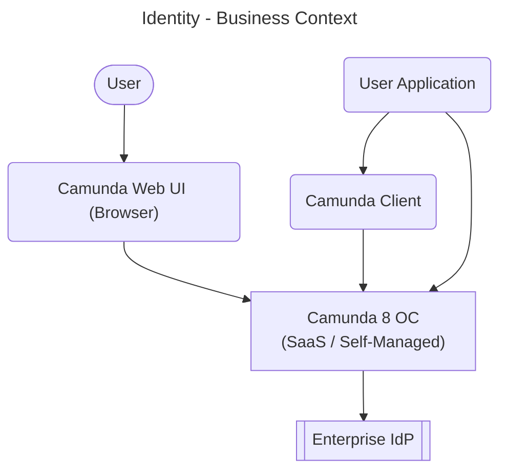
```mermaid
---
title: Identity - Business Context
---
flowchart TB
  USER(["User"])
  WEB_UI("Camunda Web UI (Browser)")
  USER_APP("User Application")
  CAMUNDA_CLIENT("Camunda Client")
  IDP[["Enterprise IdP"]]

  SAAS_OR_SM["Camunda 8 OC\n(SaaS / Self-Managed)"]

  USER --> WEB_UI --> SAAS_OR_SM
  USER_APP --> CAMUNDA_CLIENT --> SAAS_OR_SM
  SAAS_OR_SM --> IDP
  USER_APP --> SAAS_OR_SM
```

Entities:

- User: A human performing modeling, operations, or task work.
- User Application: A client application interacting with Camunda either with a camunda client or REST/gRPC API.
- Camunda Web UI: Console, Web Modeler, Operate, Tasklist, Identity
- Camunda Client: Official language clients - Java client and Spring Boot Starter
- Orchestration Cluster: runtime deployment containing Zeebe, Operate, Tasklist, Identity, REST/gRPC APIs.
- Enterprise IdP: customer IdP providing SSO and tokens via OIDC/SAML (e.g. Okta, Entra, Keycloak, etc.).

### 3.2 Technical context

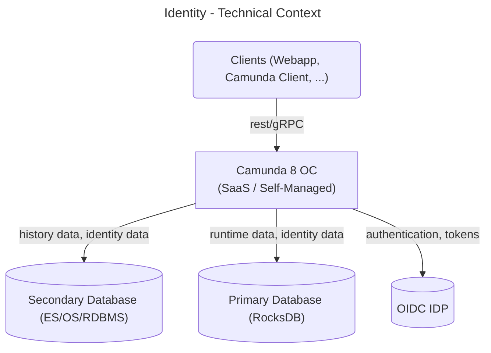
```mermaid
---
title: Identity - Technical Context
---
flowchart TB
  CLIENTS("Clients (Webapp, Camunda Client, ...)")
  IDP[("OIDC IDP")]
  PRIMARY_DB[("Primary Database (RocksDB)")]
  SECONDARY_DB[("Secondary Database (ES/OS/RDBMS)")]

  SAAS_OR_SM["Camunda 8 OC\n(SaaS / Self-Managed)"]


  CLIENTS -->|"rest/gRPC"| SAAS_OR_SM
  SAAS_OR_SM -->|"history data, identity data"| SECONDARY_DB
  SAAS_OR_SM -->|"runtime data, identity data"| PRIMARY_DB
  SAAS_OR_SM -->|"authentication, tokens"| IDP
```

Entities:
- Clients: Web applications, Camunda clients, and other services interacting with the Orchestration Cluster
- Orchestration Cluster: runtime deployment containing Zeebe, Operate, Tasklist, Identity, REST/gRPC APIs.
- Enterprise IdP: customer IdP providing SSO and tokens via OIDC/SAML (e.g. Okta, Entra, Keycloak, etc.).
- Primary Database: RocksDB used for Zeebe Engine state.
- Secondary Database: Elasticsearch, OpenSearch, or RDBMS used for search queries. Contains Runtime, History, and Identity data.

External interfaces (technical):

- Incoming:
  - Browser‑based UIs (Operate, Tasklist, Admin UI) using OIDC or Basic auth.
  - REST/gRPC APIs for workers, service accounts and applications (Bearer tokens from IdP).
- Outgoing:
  - OIDC IdP for login redirects, token introspection, or validation depending on IdP use.
  - Requests against secondary database for search queries.
- Internal:
  - Calls from UIs and APIs to Authentication and Authorization engine.
  - Persistence of identity entities in primary and secondary storage.

## 4. Solution strategy

- Cluster‑embedded identity service
  Identity runs inside the Orchestration Cluster and is the source of truth for runtime IAM instead of Management Identity.

- Multi‑protocol authentication
  Basic for simple Self‑Managed setups and development.
  OIDC for production with SSO, MFA and centralized user lifecycle.
  Optional no‑auth for local or demo scenarios.

- Resource‑based authorization
  Fine‑grained authorizations per resource type and action (for example PROCESS_DEFINITION:READ, USER_TASK:ASSIGN) across UIs and APIs.

- Cluster‑local tenant model
  Tenants are managed directly in Identity per cluster. Management Identity tenants remain only for Optimize in Self‑Managed.

- Extensible RBAC library
  Shared helpers and engine behaviors so feature teams can introduce new resource and permission types without re‑implementing authorization logic.

- Reuse of Zeebe storage
  Identity entities are stored using Zeebe’s existing primary (RocksDB) and secondary (ES/OS/RDBMS) storage instead of a separate identity database.

## 5. Building block view

### 5.1 Whitebox overall system

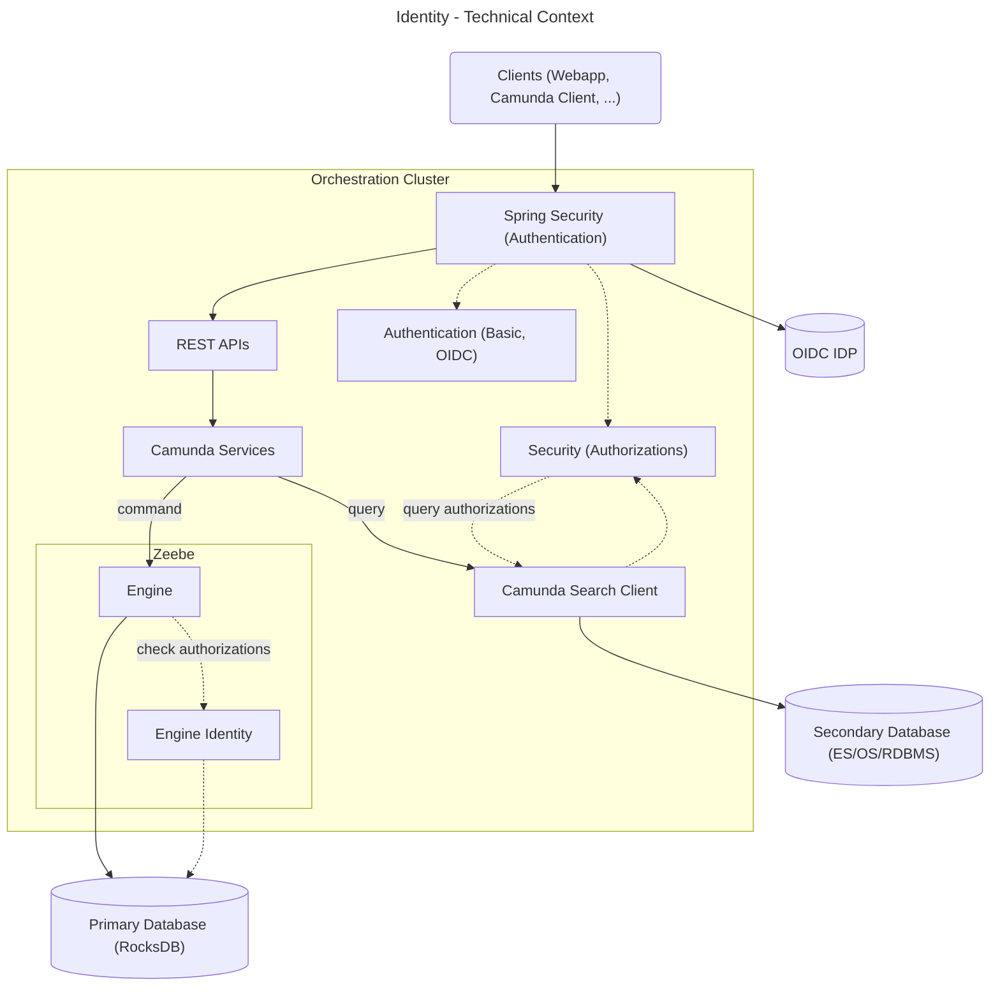
```mermaid
---
title: Identity - Technical Context
---
flowchart TB
  CLIENTS("Clients (Webapp, Camunda Client, ...)")
  IDP[("OIDC IDP")]
  PRIMARY_DB[("Primary Database (RocksDB)")]
  SECONDARY_DB[("Secondary Database (ES/OS/RDBMS)")]

  subgraph CLUSTER["Orchestration Cluster"]
    REST[REST APIs]
    SPRING_SECURITY["Spring Security (Authentication)"]
    CAMUNDA_SERVICES["Camunda Services"]
    CAMUNDA_SEARCH_CLIENT["Camunda Search Client"]
    AUTHENTICATION["Authentication (Basic, OIDC)"]
    SECURITY["Security (Authorizations)"]

    subgraph ZEEBE["Zeebe"]
        ENGINE["Engine"] -.->|"check authorizations"| ENGINE_IDENTITY["Engine Identity"]
    end

    SPRING_SECURITY -.-> AUTHENTICATION
    SPRING_SECURITY -.-> SECURITY
    REST --> CAMUNDA_SERVICES -->|"query"| CAMUNDA_SEARCH_CLIENT -.-> SECURITY -.->|"query authorizations"| CAMUNDA_SEARCH_CLIENT
    CAMUNDA_SERVICES -->|"command"| ENGINE
  end

  CLIENTS --> SPRING_SECURITY --> REST
  CAMUNDA_SEARCH_CLIENT --> SECONDARY_DB
  ENGINE --> PRIMARY_DB
  ENGINE_IDENTITY -.-> PRIMARY_DB
  SPRING_SECURITY --> IDP
```

Main building blocks:

- REST APIs: Orchestration Cluster REST API (v2), Administration API, Web Modeler API
- Camunda Services: Enhances the commands and queries with the given authentication and the necessary authorizations.
- Camunda Search Client: Used for querying the secondary database against ES, OS, or RDBMS, depending on the configuration.
- Authentication: Contains authentication-related converters, helpers, utils, and services among others for spring security.
- Security: Authorization checks for queries against a secondary database are done via the shared RBAC framework. TODO: and there is also Authentication related stuff...
- Zeebe: Is responsible for processing commands and storing state.
- Engine: Processes commands and applies state changes. Uses (engine) identity to check permissions for user- or client-initiated operations.
- Engine Identity: Shared RBAC engine used for authorization checks in the engine, lives directly in the engine.
- Primary Database: RocksDB used for Zeebe Engine state.
- Secondary Database: Elasticsearch, OpenSearch, or RDBMS used for search queries. Contains Runtime, History, and Identity data.

### 5.2 Building Blocks

#### 5.2.1 Authentication - Level 2

The Authentication building block provides configuration classes, converters, and helpers that extend Spring Security.
Spring Security itself manages the filter chains, token exchange, and IdP communication.
Authentication classes enrich the resulting principal with Camunda-specific claims (groups, roles, tenants) and persist sessions.

To keep it simple, we describe the Basic Auth and OIDC flows separately, but they share several components such as `TokenClaimsConverter`, `MappingRuleMatcher`, `DefaultCamundaAuthenticationProvider` and `WebSessionRepository`.

##### Basic Auth flow

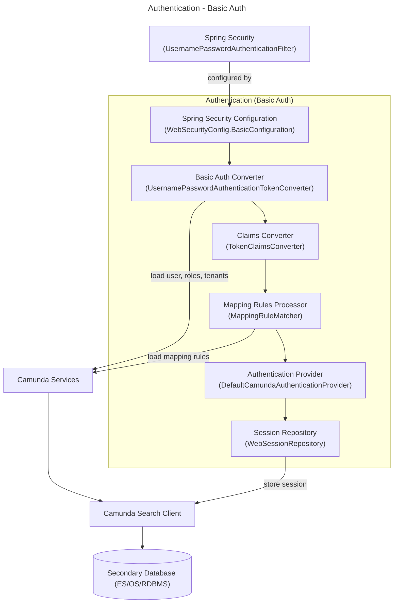
```mermaid
---
title: Authentication - Basic Auth
---
flowchart TB
  SPRING_SECURITY -->|"configured by"| WEB_SEC_CFG

  subgraph AUTHENTICATION_BASIC["Authentication (Basic Auth)"]
    WEB_SEC_CFG["Spring Security Configuration\n(WebSecurityConfig.BasicConfiguration)"]
    BASIC_CONV["Basic Auth Converter\n(UsernamePasswordAuthenticationTokenConverter)"]
    CLAIMS_CONV["Claims Converter\n(TokenClaimsConverter)"]
    MAPPING_RULES_PROC["Mapping Rules Processor\n(MappingRuleMatcher)"]
    AUTH_PROVIDER["Authentication Provider\n(DefaultCamundaAuthenticationProvider)"]
    SESSION_MGR["Session Repository\n(WebSessionRepository)"]

    WEB_SEC_CFG --> BASIC_CONV
    BASIC_CONV --> CLAIMS_CONV
    CLAIMS_CONV --> MAPPING_RULES_PROC
    MAPPING_RULES_PROC --> AUTH_PROVIDER
    AUTH_PROVIDER --> SESSION_MGR
  end

  SPRING_SECURITY["Spring Security\n(UsernamePasswordAuthenticationFilter)"]
  CAMUNDA_SERVICES["Camunda Services"]
  CAMUNDA_SEARCH_CLIENT["Camunda Search Client"]
  SECONDARY_DB[("Secondary Database (ES/OS/RDBMS)")]

  BASIC_CONV -->|"load user, roles, tenants"| CAMUNDA_SERVICES
  MAPPING_RULES_PROC -->|"load mapping rules"| CAMUNDA_SERVICES
  CAMUNDA_SERVICES --> CAMUNDA_SEARCH_CLIENT --> SECONDARY_DB
  SESSION_MGR -->|"store session"| CAMUNDA_SEARCH_CLIENT
```

Key responsibilities:

- Spring Security Configuration (`WebSecurityConfig.BasicConfiguration`): Spring `@Configuration` subclass of `WebSecurityConfig`, activated by `camunda.security.authentication.method=basic`. It is responsible for configuring the Spring Security filter chains for Basic auth and registering the `UsernamePasswordAuthenticationTokenConverter` bean. The `@ConditionalOnProtectedApi` annotation on individual filter chain beans controls whether API endpoints require authentication (based on the `camunda.security.api.unprotected` property).
- Basic Auth Converter (`UsernamePasswordAuthenticationTokenConverter`): converts Basic auth credentials (username/password or clientId/secret) into a `CamundaAuthentication` by loading the user entity and its roles and tenants via Camunda Services.
- Claims Converter (`TokenClaimsConverter`): core converter that extracts username or clientId from token claims and loads group, role, and tenant memberships via `MembershipService`.
- Mapping Rules Processor (`MappingRuleMatcher`): evaluates JSONPath mapping rules against IdP claims to assign roles, groups, tenants and authorizations.
- Authentication Provider (`DefaultCamundaAuthenticationProvider`): bridges Spring Security to the Camunda authentication context via `CamundaAuthentication`.
- Session Repository (`WebSessionRepository`): creates and invalidates server‑side sessions backed by secondary storage.

Extern responsibilities:

- Spring Security (`UsernamePasswordAuthenticationFilter`): performs the actual credential extraction and delegates to the configured converter.
- Camunda Services: provide access to user, role, group, tenant and mapping rule data via the Camunda Search Client (secondary database). Used services include `UserServices`, `RoleServices`, `GroupServices`, `TenantServices`, and `MappingRuleServices`.
- Camunda Search Client: used to query the secondary database for user, role, tenant and mapping rule data during authentication, or in case of the WebSessionRepository to store the session.

##### OIDC flow

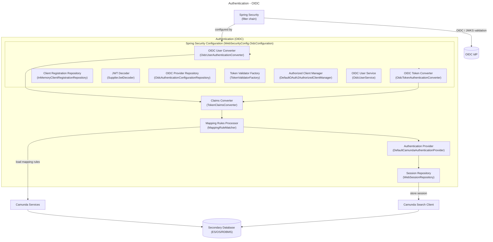
```mermaid
---
title: Authentication - OIDC
---
flowchart TB
  SPRING_SECURITY["Spring Security\n(filter chain)"]

  subgraph AUTHENTICATION_OIDC["Authentication (OIDC)"]
    subgraph WEB_SEC_CFG["Spring Security Configuration (WebSecurityConfig.OidcConfiguration)"]
      OIDC_USER_CONV["OIDC User Converter\n(OidcUserAuthenticationConverter)"]
      OIDC_TOKEN_CONV["OIDC Token Converter\n(OidcTokenAuthenticationConverter)"]
      CLIENT_REG_REPO["Client Registration Repository\n(InMemoryClientRegistrationRepository)"]
      JWT_DECODER["JWT Decoder\n(SupplierJwtDecoder)"]
      OIDC_PROVIDER_REPO["OIDC Provider Repository\n(OidcAuthenticationConfigurationRepository)"]
      TOKEN_VALIDATOR["Token Validator Factory\n(TokenValidatorFactory)"]
      AUTHORIZED_CLIENT_MGR["Authorized Client Manager\n(DefaultOAuth2AuthorizedClientManager)"]
      OICD_USER_SVC["OIDC User Service\n(OidcUserService)"]
    end
    CLAIMS_CONV["Claims Converter\n(TokenClaimsConverter)"]
    MAPPING_RULES_PROC["Mapping Rules Processor\n(MappingRuleMatcher)"]
    AUTH_PROVIDER["Authentication Provider\n(DefaultCamundaAuthenticationProvider)"]
    SESSION_MGR["Session Repository\n(WebSessionRepository)"]

    WEB_SEC_CFG --> OIDC_USER_CONV
    WEB_SEC_CFG --> OIDC_TOKEN_CONV
    OIDC_USER_CONV --> CLAIMS_CONV
    OIDC_TOKEN_CONV --> CLAIMS_CONV
    CLAIMS_CONV --> MAPPING_RULES_PROC
    MAPPING_RULES_PROC --> AUTH_PROVIDER
    AUTH_PROVIDER --> SESSION_MGR
  end

  IDP[("OIDC IdP")]
  CAMUNDA_SERVICES["Camunda Services"]
  CAMUNDA_SEARCH_CLIENT["Camunda Search Client"]
  SECONDARY_DB[("Secondary Database (ES/OS/RDBMS)")]

  SPRING_SECURITY -->|"configured by"| WEB_SEC_CFG
  SPRING_SECURITY -->|"OIDC / JWKS validation"| IDP
  MAPPING_RULES_PROC -->|"load mapping rules"| CAMUNDA_SERVICES
  CAMUNDA_SERVICES --> SECONDARY_DB
  SESSION_MGR -->|"store session"| CAMUNDA_SEARCH_CLIENT --> SECONDARY_DB
```

Key responsibilities:

- Spring Security Configuration (`WebSecurityConfig.OidcConfiguration`): Spring `@Configuration` subclass of `WebSecurityConfig`, activated by `camunda.security.authentication.method=oidc`. It is responsible for configuring all OIDC-related Spring Security filter chains and registering the following beans:
  - Client Registration Repository (`InMemoryClientRegistrationRepository`): holds the OAuth2 client registrations (one per configured OIDC provider), built from `OidcAuthenticationConfigurationRepository`.
  - Jwt Decoder (`SupplierJwtDecoder`): decodes and validates Bearer JWT tokens; uses a single-provider decoder or an issuer-aware multi-provider decoder depending on the number of registered providers.
  - OIDC Provider Repository (`OidcAuthenticationConfigurationRepository`): reads the OIDC provider configuration (issuer URIs, client credentials, additional JWKS URIs) from `SecurityConfiguration`.
  - Authorized Client Manager (`DefaultOAuth2AuthorizedClientManager`): manages OAuth2 authorized client state; supports the authorization code, refresh token, and client credentials flows (including `private_key_jwt` client authentication).
  - OAuth2AuthorizedClientRepository (`HttpSessionOAuth2AuthorizedClientRepository`): stores authorized client state in the HTTP session.
  - OIDC User Service (`OidcUserService`): loads OIDC user details from the IdP's userinfo endpoint during browser login.
  - OIDC Token Converter (`OidcTokenAuthenticationConverter`): converts Bearer JWTs (M2M) into a `CamundaAuthentication` (OIDC M2M only)..
- Claims Converter (`TokenClaimsConverter`): core converter that extracts username or clientId from token claims and loads group, role, and tenant memberships via `MembershipService`.
- Mapping Rules Processor (`MappingRuleMatcher`): evaluates JSONPath mapping rules against IdP claims to assign roles, groups, tenants and authorizations.
- Authentication Provider (`DefaultCamundaAuthenticationProvider`): bridges Spring Security to the Camunda authentication context via `CamundaAuthentication`.
- Session Repository (`WebSessionRepository`): creates and invalidates server‑side sessions backed by secondary storage.

Extern responsibilities:

- Spring Security (`OAuth2LoginAuthenticationFilter`, `BearerTokenAuthenticationFilter`): manages the OIDC authorization code flow and Bearer token validation.
- OIDC IdP: issues ID tokens, access tokens, and JWKS for signature verification.
- Camunda Services: provide access to role, group, tenant, and mapping rule data via the Camunda Search Client (secondary database). Used services include `RoleServices`, `GroupServices`, `TenantServices`, and `MappingRuleServices` (via `DefaultMembershipService`).
- Camunda Search Client: used to query the secondary database for user, role, tenant and mapping rule data during authentication, or in case of the WebSessionRepository to store the session.

#### 5.2.2 Security - Level 2

The Security building block provides authorization checks for REST queries executed via the Camunda Search Client.
It implements the shared RBAC framework for data access control, ensuring that search results are filtered according to the caller's permissions.

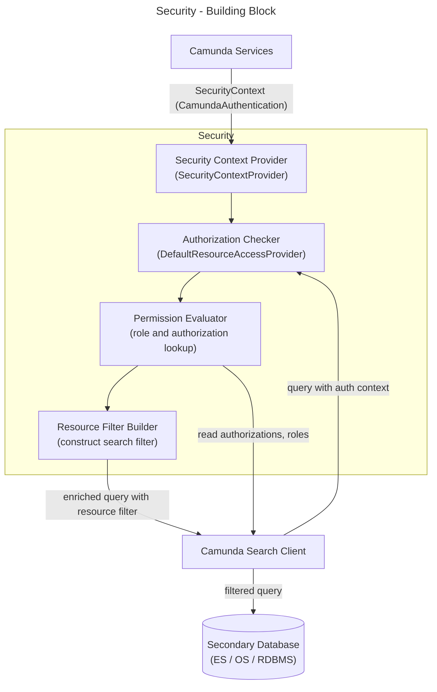
```mermaid
---
title: Security - Building Block
---
flowchart TB
  subgraph SECURITY["Security"]
    SC_PROVIDER["Security Context Provider\n(SecurityContextProvider)"]
    AUTHZ_CHECKER["Authorization Checker\n(DefaultResourceAccessProvider)"]
    RESOURCE_FILTER["Resource Filter Builder\n(construct search filter)"]
    PERMISSION_EVALUATOR["Permission Evaluator\n(role and authorization lookup)"]

    SC_PROVIDER --> AUTHZ_CHECKER
    AUTHZ_CHECKER --> PERMISSION_EVALUATOR
    PERMISSION_EVALUATOR --> RESOURCE_FILTER
  end

  CAMUNDA_SERVICES["Camunda Services"]
  CAMUNDA_SEARCH_CLIENT["Camunda Search Client"]
  SECONDARY_DB[("Secondary Database\n(ES / OS / RDBMS)")]

  CAMUNDA_SERVICES -->|"SecurityContext (CamundaAuthentication)"| SC_PROVIDER
  CAMUNDA_SEARCH_CLIENT -->|"query with auth context"| AUTHZ_CHECKER
  RESOURCE_FILTER -->|"enriched query with resource filter"| CAMUNDA_SEARCH_CLIENT
  CAMUNDA_SEARCH_CLIENT -->|"filtered query"| SECONDARY_DB
  PERMISSION_EVALUATOR -->|"read authorizations, roles"| CAMUNDA_SEARCH_CLIENT
```

Key responsibilities:

- Security Context Provider (`SecurityContextProvider`): builds a `SecurityContext` combining the `CamundaAuthentication` with authorization requirements before a query is executed.
- Authorization Checker (`DefaultResourceAccessProvider`): the concrete implementation of the `ResourceAccessProvider` interface; entry point for checking whether the caller is allowed to perform a given action on a resource type. It uses `AuthorizationChecker` and the `ResourcePropertyMatcherRegistry` to resolve access.
- Permission Evaluator (`AuthorizationChecker`): resolves the effective permissions of a principal by combining direct authorizations and role‑based authorizations. It reads authorization and role data exclusively via the Camunda Search Client — it does not access the secondary database directly.
- Resource Filter Builder: translates the effective permissions into a search‑engine filter that restricts query results to authorized resources only.

#### 5.2.3 Engine Identity - Level 2

Engine Identity is the RBAC authorization engine embedded directly inside the Zeebe Engine.
It intercepts engine commands (such as creating process instances or completing user tasks) and enforces authorization before the command is applied.

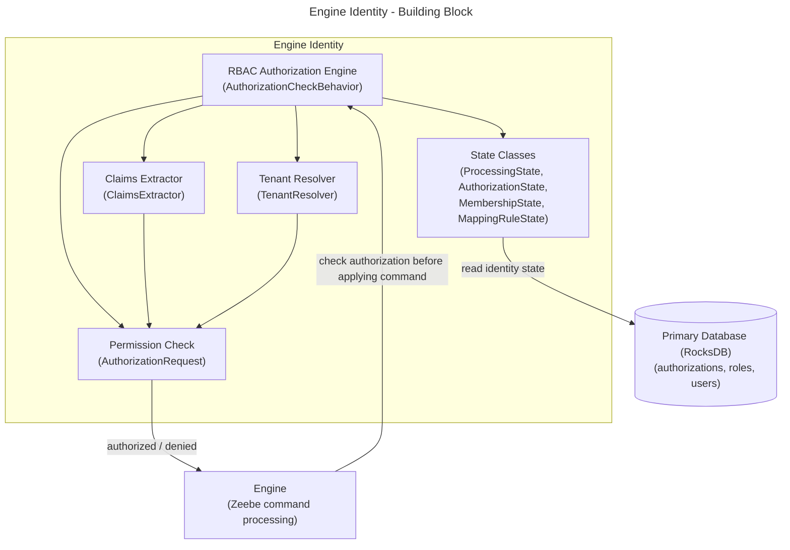
```mermaid
---
title: Engine Identity - Building Block
---
flowchart TB
  subgraph ENGINE_IDENTITY["Engine Identity"]
    AUTHZ_BEHAVIOR["RBAC Authorization Engine\n(AuthorizationCheckBehavior)"]
    AUTHZ_REQUEST["Permission Check\n(AuthorizationRequest)"]
    TENANT_RESOLVER["Tenant Resolver\n(TenantResolver)"]
    CLAIMS_EXTRACTOR["Claims Extractor\n(ClaimsExtractor)"]
    STATE_CLASSES["State Classes\n(ProcessingState, AuthorizationState,\nMembershipState, MappingRuleState)"]

    AUTHZ_BEHAVIOR --> AUTHZ_REQUEST
    AUTHZ_BEHAVIOR --> TENANT_RESOLVER
    AUTHZ_BEHAVIOR --> CLAIMS_EXTRACTOR
    AUTHZ_BEHAVIOR --> STATE_CLASSES
    CLAIMS_EXTRACTOR --> AUTHZ_REQUEST
    TENANT_RESOLVER --> AUTHZ_REQUEST
  end

  ENGINE["Engine\n(Zeebe command processing)"]
  PRIMARY_DB[("Primary Database (RocksDB)\n(authorizations, roles, users)")]

  ENGINE -->|"check authorization before applying command"| AUTHZ_BEHAVIOR
  AUTHZ_REQUEST -->|"authorized / denied"| ENGINE
  STATE_CLASSES -->|"read identity state"| PRIMARY_DB
```

Key responsibilities:

- RBAC Authorization Engine (`AuthorizationCheckBehavior`): main entry point; receives the principal and the requested resource + action and decides whether to allow or deny the command. It does not read directly from RocksDB but instead delegates to the engine's State classes (`ProcessingState`, `AuthorizationState`, `MembershipState`, `MappingRuleState`), which abstract the underlying RocksDB storage.
- Claims Extractor (`ClaimsExtractor`): extracts username, clientId, and groups from the raw claims in an authorization request.
- Tenant Resolver (`TenantResolver`): resolves the set of tenants the principal is authorized for, using membership state and mapping rules read from primary storage via the State classes.
- Permission Check (`AuthorizationRequest`): record holding the resource type, required permission, tenant ID and property constraints for a single authorization check.
- State classes (`ProcessingState`, `AuthorizationState`, `MembershipState`, `MappingRuleState`): abstract the RocksDB state access; `AuthorizationCheckBehavior` reads all identity state (authorizations, roles, memberships, mapping rules) through these classes.

## 6. Runtime view

### 6.1 User login

#### 6.1.1 Basic Auth

Scenario: human user logs into Operate or Tasklist using username and password (Basic Auth).

1. Browser navigates to a cluster UI (for example Operate).
2. Spring Security redirects the browser to the built-in login form.
3. User submits credentials; Spring Security delegates to `UsernamePasswordAuthenticationTokenConverter`.
4. The converter loads the user entity, roles, and tenants via Camunda Services (which queries the Secondary Database through the Camunda Search Client) — no external IdP is involved.
5. `TokenClaimsConverter` and `DefaultCamundaAuthenticationProvider` build a `CamundaAuthentication` and store it in the session.
6. Subsequent requests are authenticated via the session.

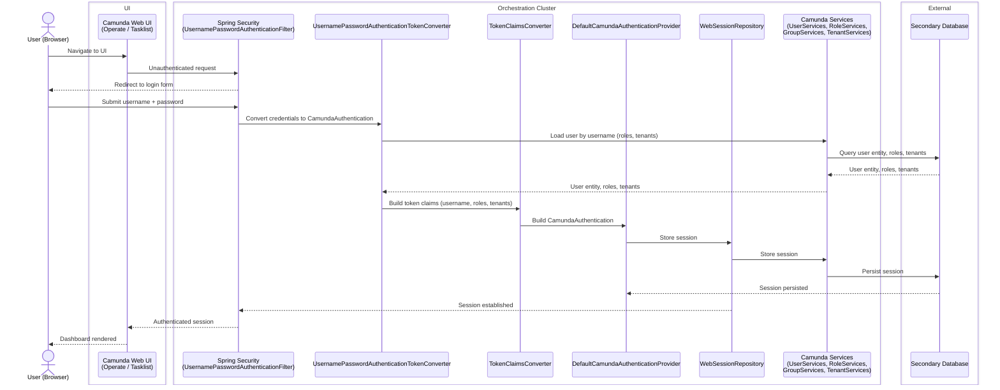
```mermaid
sequenceDiagram
  actor USER as User (Browser)
  box UI
    participant UI as Camunda Web UI<br/>(Operate / Tasklist)
  end
  box Orchestration Cluster
    participant SS as Spring Security<br/>(UsernamePasswordAuthenticationFilter)
    participant BASIC_CONV as UsernamePasswordAuthenticationTokenConverter
    participant CLAIMS as TokenClaimsConverter
    participant AUTHN_PROVIDER as DefaultCamundaAuthenticationProvider
    participant SESSION as WebSessionRepository
    participant CAMUNDA_SERVICES as Camunda Services<br/>(UserServices, RoleServices,<br/>GroupServices, TenantServices)
  end
  box External
    participant SECONDARY_DB as Secondary Database
  end

  USER->>UI: Navigate to UI
  UI->>SS: Unauthenticated request
  SS-->>USER: Redirect to login form
  USER->>SS: Submit username + password
  SS->>BASIC_CONV: Convert credentials to CamundaAuthentication
  BASIC_CONV->>CAMUNDA_SERVICES: Load user by username (roles, tenants)
  CAMUNDA_SERVICES->>SECONDARY_DB: Query user entity, roles, tenants
  SECONDARY_DB-->>CAMUNDA_SERVICES: User entity, roles, tenants
  CAMUNDA_SERVICES-->>BASIC_CONV: User entity, roles, tenants
  BASIC_CONV->>CLAIMS: Build token claims (username, roles, tenants)
  CLAIMS->>AUTHN_PROVIDER: Build CamundaAuthentication
  AUTHN_PROVIDER->>SESSION: Store session
  SESSION->>CAMUNDA_SERVICES: Store session
  CAMUNDA_SERVICES->>SECONDARY_DB: Persist session
  SECONDARY_DB-->>AUTHN_PROVIDER: Session persisted
  SESSION-->>SS: Session established
  SS-->>UI: Authenticated session
  UI-->>USER: Dashboard rendered
```

#### 6.1.2 OIDC

Scenario: human user logs into Operate or Tasklist via OIDC.

1. Browser navigates to a cluster UI (for example Operate).
2. Spring Security redirects the browser to the external IdP for login.
3. IdP authenticates the user and returns ID/access tokens.
4. Identity validates the token, extracts username and group or attribute claims, and applies mapping rules.
5. Subsequent UI or API calls include the session and are authorized. Logout behavior, including RP‑initiated logout back to the IdP, is described in [RP‑initiated logout](misc/rp-initiated-logout.md).

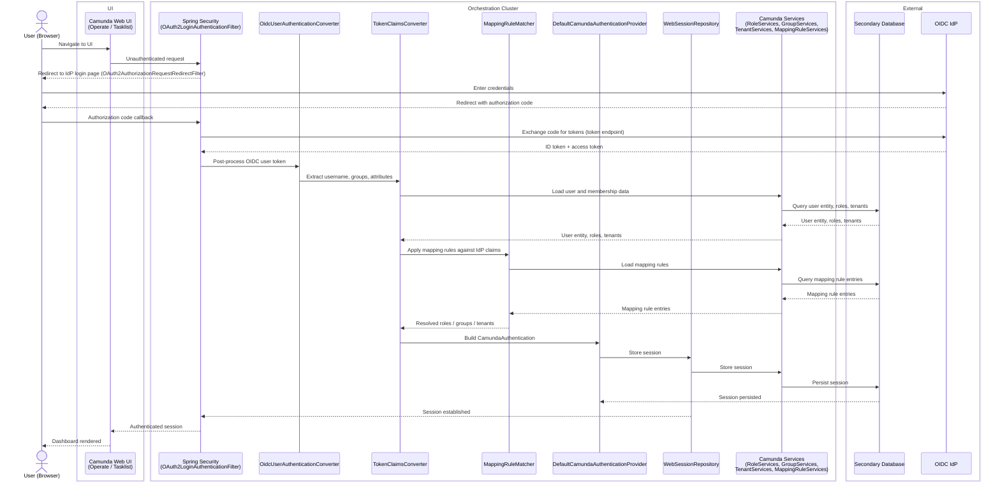
```mermaid
sequenceDiagram
  actor USER as User (Browser)
  box UI
    participant UI as Camunda Web UI<br/>(Operate / Tasklist)
  end
  box Orchestration Cluster
    participant SS as Spring Security<br/>(OAuth2LoginAuthenticationFilter)
    participant OIDC_USER_CONV as OidcUserAuthenticationConverter
    participant CLAIMS as TokenClaimsConverter
    participant MAPPING as MappingRuleMatcher
    participant AUTHN_PROVIDER as DefaultCamundaAuthenticationProvider
    participant SESSION as WebSessionRepository
    participant CAMUNDA_SERVICES as Camunda Services<br/>(RoleServices, GroupServices,<br/>TenantServices, MappingRuleServices)
  end
  box External
    participant SECONDARY_DB as Secondary Database
    participant IDP as OIDC IdP
  end

  USER->>UI: Navigate to UI
  UI->>SS: Unauthenticated request
  SS-->>USER: Redirect to IdP login page (OAuth2AuthorizationRequestRedirectFilter)
  USER->>IDP: Enter credentials
  IDP-->>USER: Redirect with authorization code
  USER->>SS: Authorization code callback
  SS->>IDP: Exchange code for tokens (token endpoint)
  IDP-->>SS: ID token + access token
  SS->>OIDC_USER_CONV: Post-process OIDC user token
  OIDC_USER_CONV->>CLAIMS: Extract username, groups, attributes
  CLAIMS->>CAMUNDA_SERVICES: Load user and membership data
  CAMUNDA_SERVICES->>SECONDARY_DB: Query user entity, roles, tenants
  SECONDARY_DB-->>CAMUNDA_SERVICES: User entity, roles, tenants
  CAMUNDA_SERVICES-->>CLAIMS: User entity, roles, tenants
  CLAIMS->>MAPPING: Apply mapping rules against IdP claims
  MAPPING->>CAMUNDA_SERVICES: Load mapping rules
  CAMUNDA_SERVICES->>SECONDARY_DB: Query mapping rule entries
  SECONDARY_DB-->>CAMUNDA_SERVICES: Mapping rule entries
  CAMUNDA_SERVICES-->>MAPPING: Mapping rule entries
  MAPPING-->>CLAIMS: Resolved roles / groups / tenants
  CLAIMS->>AUTHN_PROVIDER: Build CamundaAuthentication
  AUTHN_PROVIDER->>SESSION: Store session
  SESSION->>CAMUNDA_SERVICES: Store session
  CAMUNDA_SERVICES->>SECONDARY_DB: Persist session
  SECONDARY_DB-->>AUTHN_PROVIDER: Session persisted
  SESSION-->>SS: Session established
  SS-->>UI: Authenticated session
  UI-->>USER: Dashboard rendered
```

### 6.2 User logout

#### 6.2.1 Basic Auth

Scenario: human user logs out of a cluster UI when authenticated with Basic Auth.
Since no external IdP session was established, logout only invalidates the local server‑side session.
No RP‑initiated logout or IdP interaction is performed.

1. User clicks Logout in the UI.
2. The UI sends a logout request to Spring Security (`LogoutFilter`).
3. Spring Security invokes `WebSessionRepository` to invalidate the current session.
4. Spring Security redirects the browser back to the login form.

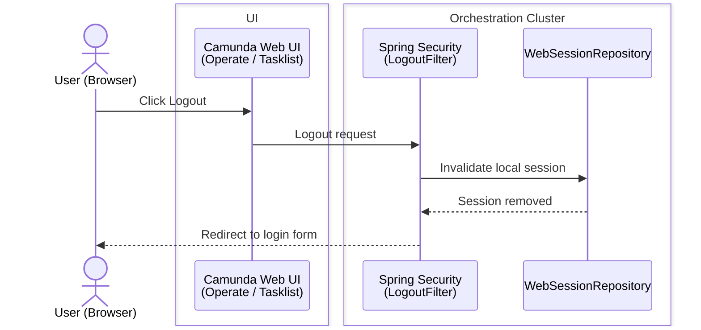
```mermaid
sequenceDiagram
  actor USER as User (Browser)
  box UI
    participant UI as Camunda Web UI<br/>(Operate / Tasklist)
  end
  box Orchestration Cluster
    participant SS as Spring Security<br/>(LogoutFilter)
    participant SESSION as WebSessionRepository
  end

  USER->>UI: Click Logout
  UI->>SS: Logout request
  SS->>SESSION: Invalidate local session
  SESSION-->>SS: Session removed
  SS-->>USER: Redirect to login form
```

#### 6.2.2 OIDC

Scenario: human user logs out of a cluster UI when authenticated via OIDC.
Logout involves both local session invalidation and RP‑initiated logout to propagate the logout back to the external IdP.

1. User clicks Logout in the UI.
2. The UI sends a logout request to Spring Security (`LogoutFilter`).
3. Spring Security invokes `WebSessionRepository` to invalidate the local session.
4. `CamundaOidcLogoutSuccessHandler` redirects the browser to the IdP's end-session endpoint (RP-initiated logout), including a `logout_hint`.
5. The IdP invalidates the SSO session and redirects the browser to the configured post-logout URL.
6. The `PostLogoutController` validates and resolves the post-logout redirect URI, then redirects the browser to the application login page.

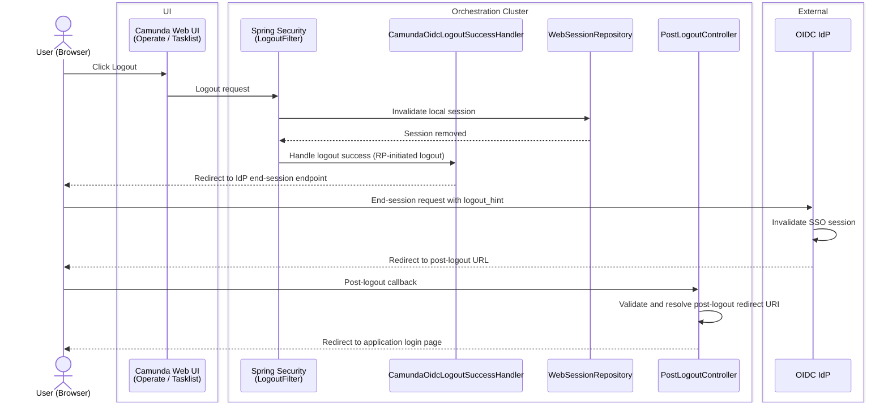
```mermaid
sequenceDiagram
  actor USER as User (Browser)
  box UI
    participant UI as Camunda Web UI<br/>(Operate / Tasklist)
  end
  box Orchestration Cluster
    participant SS as Spring Security<br/>(LogoutFilter)
    participant LOGOUT_HANDLER as CamundaOidcLogoutSuccessHandler
    participant SESSION as WebSessionRepository
    participant POST_LOGOUT as PostLogoutController
  end
  box External
    participant IDP as OIDC IdP
  end

  USER->>UI: Click Logout
  UI->>SS: Logout request
  SS->>SESSION: Invalidate local session
  SESSION-->>SS: Session removed
  SS->>LOGOUT_HANDLER: Handle logout success (RP-initiated logout)
  LOGOUT_HANDLER-->>USER: Redirect to IdP end-session endpoint
  USER->>IDP: End-session request with logout_hint
  IDP->>IDP: Invalidate SSO session
  IDP-->>USER: Redirect to post-logout URL
  USER->>POST_LOGOUT: Post-logout callback
  POST_LOGOUT->>POST_LOGOUT: Validate and resolve post-logout redirect URI
  POST_LOGOUT-->>USER: Redirect to application login page
```

### 6.3. Machine‑to‑machine access

#### 6.3.1 Bearer Token / OIDC

Scenario: worker or backend service calls REST APIs using an OIDC JWT Bearer Token acquired via the OAuth2 client credentials grant.

1. Service acquires a JWT from the external IdP via the client credentials grant.
2. It sends the token as a `Bearer` header on each REST request.
3. Spring Security (`BearerTokenAuthenticationFilter`) validates the token signature via the IdP's JWKS endpoint — no local credential storage needed.
4. `OidcTokenAuthenticationConverter` and `TokenClaimsConverter` extract the client identity and apply mapping rules to resolve roles and tenants via Camunda Services.

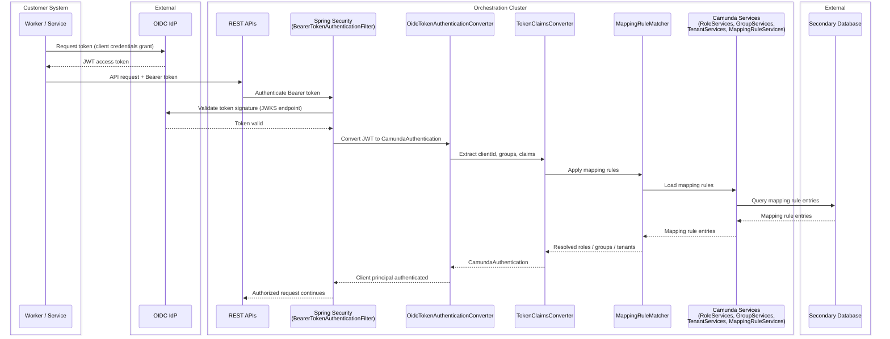
```mermaid
sequenceDiagram
  box Customer System
    participant WORKER as Worker / Service
  end
  box External
    participant IDP as OIDC IdP
  end
  box Orchestration Cluster
    participant REST as REST APIs
    participant SS as Spring Security<br/>(BearerTokenAuthenticationFilter)
    participant TOKEN_CONV as OidcTokenAuthenticationConverter
    participant CLAIMS as TokenClaimsConverter
    participant MAPPING as MappingRuleMatcher
    participant CAMUNDA_SERVICES as Camunda Services<br/>(RoleServices, GroupServices,<br/>TenantServices, MappingRuleServices)
  end
  box External
    participant SECONDARY_DB as Secondary Database
  end

  WORKER->>IDP: Request token (client credentials grant)
  IDP-->>WORKER: JWT access token
  WORKER->>REST: API request + Bearer token
  REST->>SS: Authenticate Bearer token
  SS->>IDP: Validate token signature (JWKS endpoint)
  IDP-->>SS: Token valid
  SS->>TOKEN_CONV: Convert JWT to CamundaAuthentication
  TOKEN_CONV->>CLAIMS: Extract clientId, groups, claims
  CLAIMS->>MAPPING: Apply mapping rules
  MAPPING->>CAMUNDA_SERVICES: Load mapping rules
  CAMUNDA_SERVICES->>SECONDARY_DB: Query mapping rule entries
  SECONDARY_DB-->>CAMUNDA_SERVICES: Mapping rule entries
  CAMUNDA_SERVICES-->>MAPPING: Mapping rule entries
  MAPPING-->>CLAIMS: Resolved roles / groups / tenants
  CLAIMS-->>TOKEN_CONV: CamundaAuthentication
  TOKEN_CONV-->>SS: Client principal authenticated
  SS-->>REST: Authorized request continues
```

#### 6.3.2 Client ID + Secret / Basic Auth

Scenario: worker or backend service calls REST APIs using a Client ID and Secret via HTTP Basic authentication.
No external IdP is involved; credentials are verified directly against Identity entities stored in the Secondary Database.

1. Service sends a `Basic <base64(clientId:secret)>` header on each REST request.
2. Spring Security (`UsernamePasswordAuthenticationFilter`) delegates to `UsernamePasswordAuthenticationTokenConverter`.
3. The converter loads the client entity and its roles and tenants from the Secondary Database via Camunda Services.
4. `TokenClaimsConverter` and `DefaultCamundaAuthenticationProvider` build a `CamundaAuthentication` and the request is authorized.

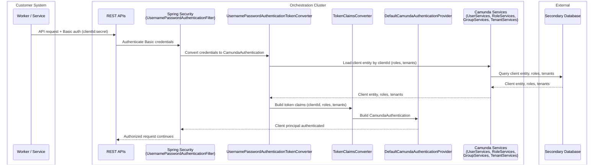
```mermaid
sequenceDiagram
  box Customer System
    participant WORKER as Worker / Service
  end
  box Orchestration Cluster
    participant REST as REST APIs
    participant SS as Spring Security<br/>(UsernamePasswordAuthenticationFilter)
    participant BASIC_CONV as UsernamePasswordAuthenticationTokenConverter
    participant CLAIMS as TokenClaimsConverter
    participant AUTHN_PROVIDER as DefaultCamundaAuthenticationProvider
    participant CAMUNDA_SERVICES as Camunda Services<br/>(UserServices, RoleServices,<br/>GroupServices, TenantServices)
  end
  box External
    participant SECONDARY_DB as Secondary Database
  end

  WORKER->>REST: API request + Basic auth (clientId:secret)
  REST->>SS: Authenticate Basic credentials
  SS->>BASIC_CONV: Convert credentials to CamundaAuthentication
  BASIC_CONV->>CAMUNDA_SERVICES: Load client entity by clientId (roles, tenants)
  CAMUNDA_SERVICES->>SECONDARY_DB: Query client entity, roles, tenants
  SECONDARY_DB-->>CAMUNDA_SERVICES: Client entity, roles, tenants
  CAMUNDA_SERVICES-->>BASIC_CONV: Client entity, roles, tenants
  BASIC_CONV->>CLAIMS: Build token claims (clientId, roles, tenants)
  CLAIMS->>AUTHN_PROVIDER: Build CamundaAuthentication
  AUTHN_PROVIDER-->>SS: Client principal authenticated
  SS-->>REST: Authorized request continues
```

### 6.4 Sending a command via REST

Scenario: a client starts a process instance via the REST API; the Zeebe Engine enforces RBAC via Engine Identity before applying the command.

1. Client sends a `POST /v2/process-instances` request with a valid credential (session cookie, Basic auth header, or JWT bearer token).
2. Spring Security authenticates the request and resolves a `CamundaAuthentication` principal.
3. The REST API delegates to Camunda Services, which issues a `CreateProcessInstance` command to the Zeebe Engine.
4. Before applying the command, the Engine calls `AuthorizationCheckBehavior` with an `AuthorizationRequest` for the `PROCESS_DEFINITION:CREATE_PROCESS_INSTANCE` permission.
5. `AuthorizationCheckBehavior` reads the principal's authorizations and role memberships from the Primary Database (RocksDB) via the State classes (`ProcessingState`, `AuthorizationState`, `MembershipState`, `MappingRuleState`).
6. If the check passes, the Engine writes the new process instance state to the Primary Database and returns the result.
7. Camunda Services returns a `CreateProcessInstanceResponse` and the REST API responds with `200 OK` containing the process instance key.

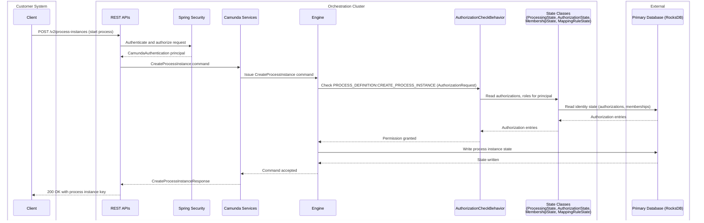
```mermaid
sequenceDiagram
  box Customer System
    participant CLIENT as Client
  end
  box Orchestration Cluster
    participant REST as REST APIs
    participant SS as Spring Security
    participant CAMUNDA_SERVICES as Camunda Services
    participant ENGINE as Engine
    participant AUTHZ_BEHAVIOR as AuthorizationCheckBehavior
    participant STATE as State Classes<br/>(ProcessingState, AuthorizationState,<br/>MembershipState, MappingRuleState)
  end
  box External
    participant PRIMARY_DB as Primary Database (RocksDB)
  end

  CLIENT->>REST: POST /v2/process-instances (start process)
  REST->>SS: Authenticate and authorize request
  SS-->>REST: CamundaAuthentication principal
  REST->>CAMUNDA_SERVICES: CreateProcessInstance command
  CAMUNDA_SERVICES->>ENGINE: Issue CreateProcessInstance command
  ENGINE->>AUTHZ_BEHAVIOR: Check PROCESS_DEFINITION:CREATE_PROCESS_INSTANCE (AuthorizationRequest)
  AUTHZ_BEHAVIOR->>STATE: Read authorizations, roles for principal
  STATE->>PRIMARY_DB: Read identity state (authorizations, memberships)
  PRIMARY_DB-->>STATE: Authorization entries
  STATE-->>AUTHZ_BEHAVIOR: Authorization entries
  AUTHZ_BEHAVIOR-->>ENGINE: Permission granted
  ENGINE->>PRIMARY_DB: Write process instance state
  PRIMARY_DB-->>ENGINE: State written
  ENGINE-->>CAMUNDA_SERVICES: Command accepted
  CAMUNDA_SERVICES-->>REST: CreateProcessInstanceResponse
  REST-->>CLIENT: 200 OK with process instance key
```

### 6.5 Reading resources via REST

Scenario: a client queries process instances via the REST API; the Camunda Search Client uses Security (`DefaultResourceAccessProvider`) to filter results to authorized resources only.

1. Client sends a `GET /v2/process-instances` request with a valid credential.
2. Spring Security authenticates the request and resolves a `CamundaAuthentication` principal.
3. The REST API delegates to Camunda Services, which builds a `SecurityContext` (via `SecurityContextProvider`) combining the principal with the required authorization context.
4. Camunda Services invokes the Camunda Search Client with the `SecurityContext`.
5. Before executing the search query, the Camunda Search Client calls `DefaultResourceAccessProvider` to determine the caller's effective permissions.
6. `DefaultResourceAccessProvider` reads the principal's authorizations and roles from the Secondary Database via the Camunda Search Client itself (no direct DB access).
7. The resolved permissions are translated into a resource filter (e.g. restricting results to specific process definition keys or tenants) and applied to the search query.
8. The Camunda Search Client executes the filtered query against the Secondary Database and returns the results.
9. Camunda Services returns a `SearchProcessInstancesResponse` and the REST API responds with `200 OK` containing the filtered process instances.

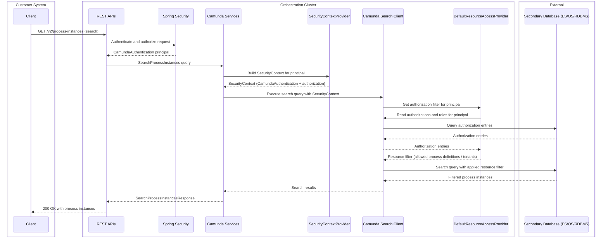
```mermaid
sequenceDiagram
  box Customer System
    participant CLIENT as Client
  end
  box Orchestration Cluster
    participant REST as REST APIs
    participant SS as Spring Security
    participant CAMUNDA_SERVICES as Camunda Services
    participant SC_PROVIDER as SecurityContextProvider
    participant CAMUNDA_SEARCH_CLIENT as Camunda Search Client
    participant RESOURCE_ACCESS as DefaultResourceAccessProvider
  end
  box External
    participant SECONDARY_DB as Secondary Database (ES/OS/RDBMS)
  end

  CLIENT->>REST: GET /v2/process-instances (search)
  REST->>SS: Authenticate and authorize request
  SS-->>REST: CamundaAuthentication principal
  REST->>CAMUNDA_SERVICES: SearchProcessInstances query
  CAMUNDA_SERVICES->>SC_PROVIDER: Build SecurityContext for principal
  SC_PROVIDER-->>CAMUNDA_SERVICES: SecurityContext (CamundaAuthentication + authorization)
  CAMUNDA_SERVICES->>CAMUNDA_SEARCH_CLIENT: Execute search query with SecurityContext
  CAMUNDA_SEARCH_CLIENT->>RESOURCE_ACCESS: Get authorization filter for principal
  RESOURCE_ACCESS->>CAMUNDA_SEARCH_CLIENT: Read authorizations and roles for principal
  CAMUNDA_SEARCH_CLIENT->>SECONDARY_DB: Query authorization entries
  SECONDARY_DB-->>CAMUNDA_SEARCH_CLIENT: Authorization entries
  CAMUNDA_SEARCH_CLIENT-->>RESOURCE_ACCESS: Authorization entries
  RESOURCE_ACCESS-->>CAMUNDA_SEARCH_CLIENT: Resource filter (allowed process definitions / tenants)
  CAMUNDA_SEARCH_CLIENT->>SECONDARY_DB: Search query with applied resource filter
  SECONDARY_DB-->>CAMUNDA_SEARCH_CLIENT: Filtered process instances
  CAMUNDA_SEARCH_CLIENT-->>CAMUNDA_SERVICES: Search results
  CAMUNDA_SERVICES-->>REST: SearchProcessInstancesResponse
  REST-->>CLIENT: 200 OK with process instances
```

### 6.6 Creating a new user

Scenario: an administrator creates a new user via the REST API; the command is applied by the Engine, written to the Primary Database via State classes, and then asynchronously propagated to the Secondary Database by the Exporter.

1. Client sends a `POST /v2/users` request with a valid credential and the new user's details (username, password, name, email).
2. Spring Security authenticates the request and resolves a `CamundaAuthentication` principal.
3. The REST API delegates to `UserServices` (part of Camunda Services), which issues a `CreateUser` command to the Zeebe Engine.
4. Before applying the command, the Engine enforces RBAC via `AuthorizationCheckBehavior`, verifying the principal holds the `USER:CREATE` permission by reading from `AuthorizationState` / `MembershipState` via the Primary Database.
5. The Engine applies the command: `MutableMembershipState` (and related State classes) persist the new user record to the Primary Database (RocksDB).
6. The Engine returns a command acknowledgement and `UserServices` returns the created user to the REST API, which responds with `201 Created` and the new user key.
7. Asynchronously, the Camunda or Rdbms Exporter picks up the `UserCreated` event and writes the user record to the Secondary Database (ES/OS/RDBMS), making it available for searches.

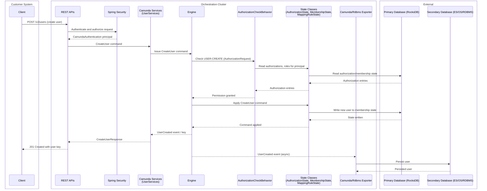
```mermaid
sequenceDiagram
  box Customer System
    participant CLIENT as Client
  end
  box Orchestration Cluster
    participant REST as REST APIs
    participant SS as Spring Security
    participant CAMUNDA_SERVICES as Camunda Services<br/>(UserServices)
    participant ENGINE as Engine
    participant AUTHZ_BEHAVIOR as AuthorizationCheckBehavior
    participant STATE as State Classes<br/>(AuthorizationState, MembershipState,<br/>MappingRuleState)
    participant EXPORTER as Camunda/Rdbms Exporter
  end
  box External
    participant PRIMARY_DB as Primary Database (RocksDB)
    participant SECONDARY_DB as Secondary Database (ES/OS/RDBMS)
  end

  CLIENT->>REST: POST /v2/users (create user)
  REST->>SS: Authenticate and authorize request
  SS-->>REST: CamundaAuthentication principal
  REST->>CAMUNDA_SERVICES: CreateUser command
  CAMUNDA_SERVICES->>ENGINE: Issue CreateUser command
  ENGINE->>AUTHZ_BEHAVIOR: Check USER:CREATE (AuthorizationRequest)
  AUTHZ_BEHAVIOR->>STATE: Read authorizations, roles for principal
  STATE->>PRIMARY_DB: Read authorization/membership state
  PRIMARY_DB-->>STATE: Authorization entries
  STATE-->>AUTHZ_BEHAVIOR: Authorization entries
  AUTHZ_BEHAVIOR-->>ENGINE: Permission granted
  ENGINE->>STATE: Apply CreateUser command
  STATE->>PRIMARY_DB: Write new user to membership state
  PRIMARY_DB-->>STATE: State written
  STATE-->>ENGINE: Command applied
  ENGINE-->>CAMUNDA_SERVICES: UserCreated event / key
  CAMUNDA_SERVICES-->>REST: CreateUserResponse
  REST-->>CLIENT: 201 Created with user key
  ENGINE-->>EXPORTER: UserCreated event (async)
  EXPORTER->>SECONDARY_DB: Persist user
  SECONDARY_DB-->>EXPORTER: Persisted user
```

### 6.7 Creating a new authorization

Scenario: an administrator creates a new authorization (permission grant) via the REST API; the Engine applies and persists it to the Primary Database, and the Exporter propagates it asynchronously to the Secondary Database.

1. Client sends a `POST /v2/authorizations` request with a valid credential and the authorization details (owner, resource type, resource id, permissions).
2. Spring Security authenticates the request and resolves a `CamundaAuthentication` principal.
3. The REST API delegates to `AuthorizationServices` (part of Camunda Services), which issues a `CreateAuthorization` command to the Zeebe Engine.
4. Before applying the command, the Engine enforces RBAC via `AuthorizationCheckBehavior`, verifying the principal holds the `AUTHORIZATION:CREATE` permission by reading from `AuthorizationState` / `MembershipState` via the Primary Database.
5. The Engine applies the command: `MutableAuthorizationState` persists the new authorization record to the Primary Database (RocksDB).
6. The Engine returns a command acknowledgement and `AuthorizationServices` returns the created authorization to the REST API, which responds with `201 Created` and the new authorization key.
7. Asynchronously, the Camunda or RDBMS Exporter picks up the `AuthorizationCreated` event and writes the authorization record to the Secondary Database (ES/OS/RDBMS), making it queryable via the Search API.

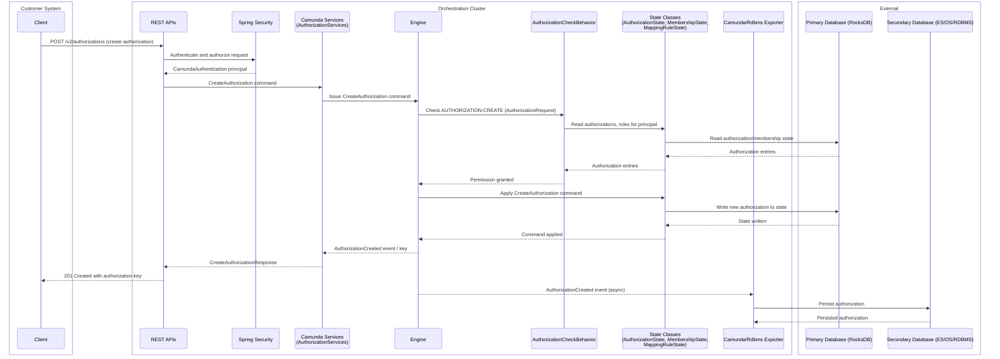
```mermaid
sequenceDiagram
  box Customer System
    participant CLIENT as Client
  end
  box Orchestration Cluster
    participant REST as REST APIs
    participant SS as Spring Security
    participant CAMUNDA_SERVICES as Camunda Services<br/>(AuthorizationServices)
    participant ENGINE as Engine
    participant AUTHZ_BEHAVIOR as AuthorizationCheckBehavior
    participant STATE as State Classes<br/>(AuthorizationState, MembershipState,<br/>MappingRuleState)
    participant EXPORTER as Camunda/Rdbms Exporter
  end
  box External
    participant PRIMARY_DB as Primary Database (RocksDB)
    participant SECONDARY_DB as Secondary Database (ES/OS/RDBMS)
  end

  CLIENT->>REST: POST /v2/authorizations (create authorization)
  REST->>SS: Authenticate and authorize request
  SS-->>REST: CamundaAuthentication principal
  REST->>CAMUNDA_SERVICES: CreateAuthorization command
  CAMUNDA_SERVICES->>ENGINE: Issue CreateAuthorization command
  ENGINE->>AUTHZ_BEHAVIOR: Check AUTHORIZATION:CREATE (AuthorizationRequest)
  AUTHZ_BEHAVIOR->>STATE: Read authorizations, roles for principal
  STATE->>PRIMARY_DB: Read authorization/membership state
  PRIMARY_DB-->>STATE: Authorization entries
  STATE-->>AUTHZ_BEHAVIOR: Authorization entries
  AUTHZ_BEHAVIOR-->>ENGINE: Permission granted
  ENGINE->>STATE: Apply CreateAuthorization command
  STATE->>PRIMARY_DB: Write new authorization to state
  PRIMARY_DB-->>STATE: State written
  STATE-->>ENGINE: Command applied
  ENGINE-->>CAMUNDA_SERVICES: AuthorizationCreated event / key
  CAMUNDA_SERVICES-->>REST: CreateAuthorizationResponse
  REST-->>CLIENT: 201 Created with authorization key
  ENGINE-->>EXPORTER: AuthorizationCreated event (async)
  EXPORTER->>SECONDARY_DB: Persist authorization
  SECONDARY_DB-->>EXPORTER: Persisted authorization
```

## 7. Deployment view

Identity‑specific aspects:

- Orchestration Cluster packaging
  Identity is part of the Orchestration Cluster deployment artifact (JAR/container) for SaaS and Self‑Managed.

- Storage
  Identity entities are stored using:
  - Primary storage: RocksDB.
  - Secondary storage: the configured search database (ES/OS/RDBMS).

- Self‑Managed deployments
  - Typically deployed on Kubernetes using the Camunda 8 Helm charts.
  - Identity runs within the Orchestration Cluster pods; no separate identity database or service is required for runtime.

- SaaS deployments
  - Orchestration Clusters are hosted by Camunda.
  - Identity is included per cluster and integrated with Camunda's SaaS control plane and IdP setup.

For detailed infrastructure topologies, see the Camunda 8 reference architectures listed in the sources appendix.

### 7.1 Basic Auth

In a Basic Auth setup, no external IdP is involved.
All authentication and authorization is handled directly by the Identity components embedded within the Orchestration Cluster.
There is no OIDC component or token exchange with an external system.

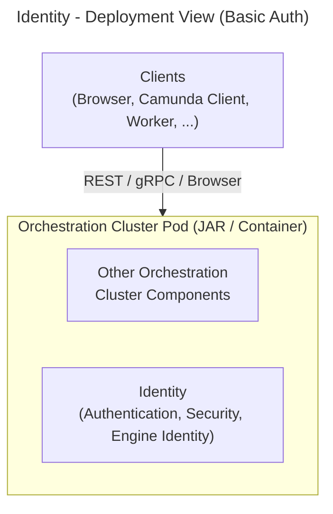
```mermaid
---
title: Identity - Deployment View (Basic Auth)
---
flowchart TB
  subgraph OC_POD["Orchestration Cluster Pod (JAR / Container)"]
    CLUSTER_STUFF["Other Orchestration\nCluster Components"]
    IDENTITY["Identity\n(Authentication, Security, Engine Identity)"]
  end

  CLIENTS["Clients\n(Browser, Camunda Client, Worker, ...)"]

  CLIENTS -->|"REST / gRPC / Browser"| OC_POD
```

### 7.2 OIDC

In an OIDC setup, an external IdP handles SSO and token issuance.
Spring Security communicates directly with the IdP for authorization code exchange and token validation (JWKS).
Identity components within the Orchestration Cluster process the resulting tokens to build a `CamundaAuthentication` and apply mapping rules.

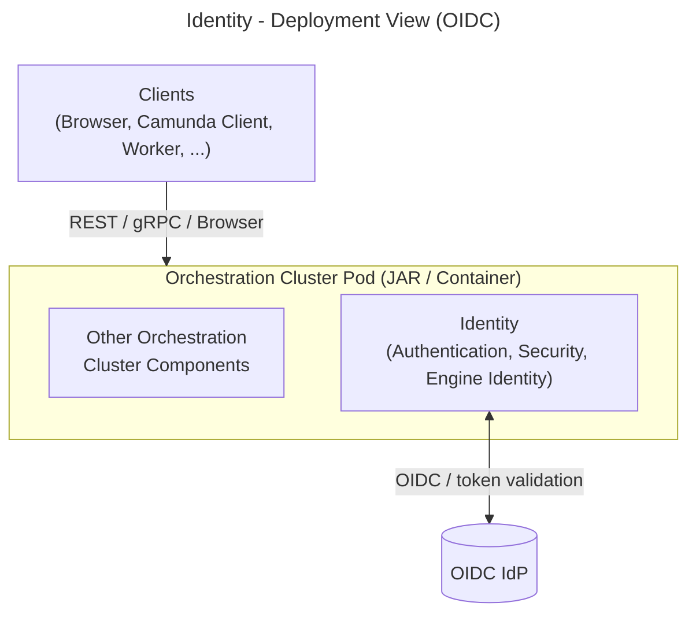
```mermaid
---
title: Identity - Deployment View (OIDC)
---
flowchart TB
  subgraph OC_POD["Orchestration Cluster Pod (JAR / Container)"]
    CLUSTER_STUFF["Other Orchestration\nCluster Components"]
    IDENTITY["Identity\n(Authentication, Security, Engine Identity)"]
  end

  CLIENTS["Clients\n(Browser, Camunda Client, Worker, ...)"]
  IDP[("OIDC IdP")]

  CLIENTS -->|"REST / gRPC / Browser"| OC_POD
  IDENTITY <-->|"OIDC / token validation"| IDP
```

## 8. Crosscutting concepts

- Authentication concept
  Unified Spring Security configuration for Basic and OIDC.
  Pluggable IdP integration through standard OIDC configuration.

- Authorization and RBAC concept
  Central resource‑based authorization model, decoupled from individual UIs and services.
  Shared checks used by engine, Operate, Tasklist and APIs.
  For detailed behavior and examples, see the [Authorization concept](authorizations/authorization-concept.md), [Engine authorization checks](authorizations/engine-authorization.md), and [REST authorization checks](authorizations/rest-authorization.md).

- Tenant concept
  Cluster‑local tenants defined in Identity.
  Tenants applied across runtime resources for data and access isolation (Self‑Managed).

- Mapping rules concept
  Declarative mapping from IdP claims (groups, attributes) to Identity entities such as groups, roles, tenants, authorizations.
  Enables identity‑as‑code and external lifecycle via IdP.

- Migration concept (from Management Identity)
  Identity Migration tooling to move roles, groups, tenants, resource authorizations and mapping rules.
  Designed to be idempotent and re‑runnable.

- Storage and consistency
  Identity state follows Zeebe's durability and snapshot mechanisms via shared storage.
  Secondary storage ensures efficient querying for Admin UI and APIs.

## 9. Architectural decisions

The architectural decisions for Identity are documented as individual ADR files in the
[/adr](docs/monorepo-docs/architecture/components/identity/adr) folder:

- [ADR-0001: Cluster-Embedded Identity Instead of External Component](adr/0001-cluster-embedded-identity.md)
- [ADR-0002: OIDC as Default Production Authentication](adr/0002-oidc-default-production-authentication.md)
- [ADR-0003: Resource-Based Authorization Model](adr/0003-resource-based-authorization-model.md)
- [ADR-0004: Support Multiple JWKS Endpoints per OIDC Issuer](adr/0004-multi-jwks-endpoints-per-issuer.md)

## 10. Risks and technical debt

- Migration complexity and failure modes
  Migration from Management Identity introduces complexity and potential misconfiguration (for example mismatched IdP setups, conflicting mapping rules).
  Mitigation: dedicated Identity Migration App, idempotent runs, detailed logs; still requires careful testing in customer environments.

- Dual identity model during transition
  Management Identity remains for Web Modeler, Console and Optimize (Self‑Managed) while Orchestration Cluster Identity serves runtime.
  Risk of confusion about the source of truth and duplicated configuration until long‑term consolidation is complete.

- IdP dependency
  For OIDC, availability and correctness of the external IdP are critical for login and token issuance.
  Misconfigured claims or group mappings can lead to over‑ or under‑provisioned access.

## 11. Glossary

| Term                           | Definition                                                                                                     |
|--------------------------------|----------------------------------------------------------------------------------------------------------------|
| Orchestration Cluster          | Unified Camunda 8 runtime: Zeebe, Operate, Tasklist, Identity, REST/gRPC APIs.                                |
| Orchestration Cluster Identity | Cluster‑embedded identity service for authentication, authorization and identity entities.                    |
| Orchestration Cluster Admin    | UI surface for cluster Identity (new name in 8.9); hosts identity features.                                   |
| Management Identity            | Standalone identity app (Self‑Managed) for Web Modeler, Console and Optimize.                                 |
| Tenant                         | Logical partition of data and access within a cluster (runtime multi‑tenancy).                                |
| Authorization                  | Permission linking a principal to a resource type and action (for example READ, UPDATE, DELETE).              |
| Mapping rule                   | Rule mapping IdP claims (groups, attributes) to identity entities such as groups, roles, tenants, authorizations. |
| User                           | Human user performing modeling, operations or task work.                                                      |
| Service accounts / workers     | Non‑interactive clients calling REST/gRPC APIs using client credentials.                                      |
| OIDC IdP                       | External identity provider; source of identity, attributes and group claims.                                  |
| Cluster components             | Runtime components enforcing Identity decisions for user and client operations.                               |
