# Architecture Documentation

## 1. Introduction and goals

This documentation is based on [arc42](https://arc42.org/overview), a common architecture documentation template for software systems. It covers constraints, system context, solution strategy, building blocks, runtime view, deployment, crosscutting concepts, and risks.

### 1.1 Overview

The Management Identity component in Camunda 8 Self-Managed manages authentication and authorization for components outside the Orchestration Cluster.

It provides:

- Unified access management for platform applications: Console, Web Modeler, Optimize.
- Flexible authentication via OIDC:
  - With the bundled Keycloak (default Self-Managed setup)
  - With Keycloak acting as a broker to an external enterprise IdP
  - Directly against an external enterprise IdP
- Role-based access control (RBAC) for platform applications.
- Management of users, groups, roles, permissions, OAuth2 clients, Optimize tenants, and mapping rules, depending on the active Spring profile.

Historically, the original Identity service covered both platform and runtime access control.
With the introduction of Orchestration Cluster Identity, runtime IAM moved into the cluster.
By design, Management Identity no longer controls access to the Orchestration Cluster;
that is handled by Orchestration Cluster Identity, described in the Orchestration Cluster Identity architecture.
- [Orchestration Cluster Identity architecture](identity_architecture_docs.md)

Where concepts such as users, groups, roles, mapping rules, tenants, and RBAC overlap between both systems, the Orchestration Cluster Identity document is the primary reference for the shared conceptual model. This document focuses on the specifics of Management Identity.

The user guide for Management Identity is available here:

- [User Guide](https://docs.camunda.io/docs/self-managed/components/management-identity/overview/)

### Goals

1. Provide a dedicated identity and access control layer for Web Modeler, Console, and Optimize in Self-Managed deployments.
2. Integrate with enterprise IdPs via OIDC, including using Keycloak either as a primary IdP or as a broker to external IdPs.
3. Offer a clear, UI-driven experience to manage users, groups, roles, clients (OAuth2 applications), and tenants for Optimize.
4. Keep platform-level identity concerns separate from runtime (cluster) identity.

## 2. Constraints

Separate component
: Management Identity runs as its own service (and supporting services such as Keycloak and Postgres) alongside the Orchestration Cluster in Self-Managed setups.

Default IdP stack
: Management Identity is, by default, wired to a packaged Keycloak and its database but supports using an external existing OIDC provider and using an external database.

Protocols
: Authentication flows are based on OAuth 2.0 and OIDC (authorization code flow for interactive users, client credentials for machine-to-machine).

Responsibility split
: Management Identity must not be a dependency for Orchestration Cluster runtime access. Orchestration Cluster Identity is the source of truth for runtime IAM; Management Identity handles only platform apps.

Data ownership
: Data ownership varies by active profile: `keycloak` stores users/groups/roles/clients in Keycloak while Management Identity stores tenants/authorizations; `oidc` stores groups/roles/permissions/mapping rules/tenants in Management Identity DB.

## 3. System context and scope

### 3.1 Business context

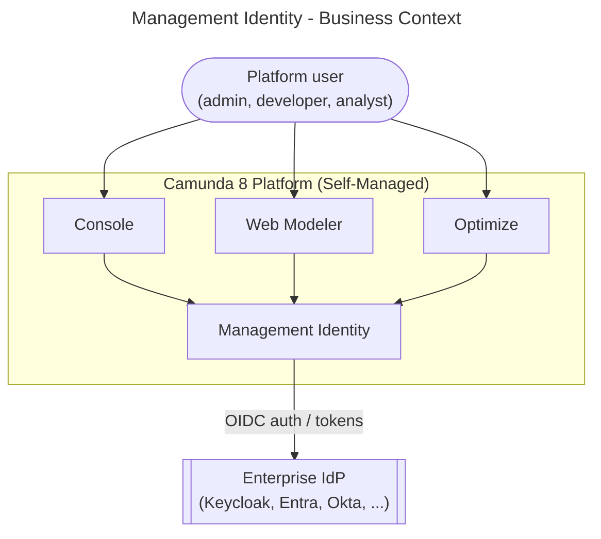

Entities:

- Management Identity: manages platform-level authentication and RBAC for Console, Web Modeler, and Optimize.
- Enterprise IdP: central source of user identities and group claims (via Keycloak or other OIDC providers).

### 3.2 Technical context

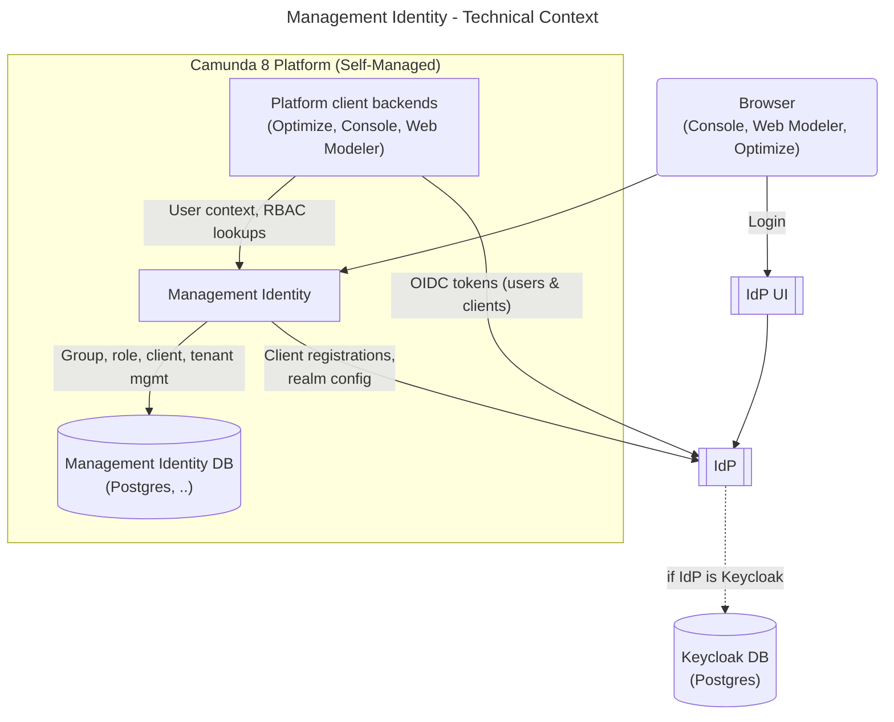

Entities:

- Browser: the user's browser accessing Console, Web Modeler, Optimize, and the Management Identity UI.
- IdP UI: the login UI exposed by the IdP, such as the Keycloak login page or the login page of an external enterprise IdP.
- Platform client backends: backend services for Console, Web Modeler, and Optimize that use OIDC user tokens and client credentials when calling Management Identity or the IdP.
- Management Identity: the standalone service that serves the admin UI and API and manages platform users, groups, roles, clients, tenants, and mapping rules.
- IdP: the OIDC identity provider used for authentication and token issuance. In the default setup this is Keycloak; it can also act as a bridge/broker to external enterprise IdPs, or Management Identity can be connected directly to an external OIDC provider.
- Management Identity DB: PostgreSQL database used by Management Identity for its own persisted identity and authorization data, depending on the active profile.
- Keycloak DB: PostgreSQL database used by Keycloak for users, groups, sessions, and realm configuration when the `keycloak` profile is active.

## 4. Solution strategy

Separate management plane for platform apps
: Management Identity provides an independent authentication and authorization surface for Console, Web Modeler, and Optimize, without coupling platform IAM to Orchestration Cluster runtime availability.

OIDC-based SSO via Keycloak or external IdPs
: Keycloak is provided as a default IdP and broker, with support for external enterprise IdPs via OIDC. Interactive users authenticate via authorization code flow; applications use client credentials.

RBAC for platform resources
: A role-based access model protects Console features, Web Modeler workspaces, and collaboration, and Optimize dashboards, reports, and data access.

Mapping rules and Optimize tenants
: Mapping rules connect IdP claims (for example groups and attributes) to roles and tenants in Management Identity. Optimize uses these tenants for data and access segmentation.

Spring profile-based deployment modes
: The active deployment modes are selected via Spring profiles (`keycloak`, `oidc`). The legacy `saas` profile remains in code for backward compatibility but is deprecated and no longer used in current deployments.

Alignment with Orchestration Cluster Identity concepts
: Where consistent and useful, Management Identity uses concepts aligned with Orchestration Cluster Identity (users, groups, roles, tenants, mapping rules, authorizations). Runtime-specific semantics remain defined by Orchestration Cluster Identity.

## 5. Building block view

### 5.1 Whitebox overall system

Main building blocks:

- Management Identity UI: React single-page application (served by `FrontendController`) for administrators to manage users, groups, roles, clients (OAuth2 applications), and tenants, and to define mapping rules.
- Security Configuration (`WebSecurityConfig`): Spring configuration class that defines the security filter chain. It registers the `JwtFilter` implementation before the `BasicAuthenticationFilter` and explicitly permits unauthenticated access to paths such as `/auth/**`, `/actuator/**`, and public token-resolution endpoints.
- Spring Security: Filter chain responsible for authenticating incoming requests (OIDC token validation via the configured IdP JWKS endpoint) and enforcing RBAC before delegating to controllers.
- REST Controllers: Active controllers depend on the Spring profile (see section 5.2).
- Service Interfaces: The API contract for each resource domain.
- Profile-specific implementations - Concrete service implementations are organized by deployment mode:
  - Keycloak profile implementations (profile `keycloak`): back-end operations against Keycloak Admin REST API for users and clients; stores groups and roles in Keycloak.
  - OIDC profile implementations (profile `oidc`): stores groups, roles, permissions, and mapping rules in the Management Identity PostgreSQL database; no user or client synchronization to an external IdP.
  - Legacy SaaS-specific implementations (profile `saas`) still exist in code for compatibility but are deprecated and not used in current deployments.
- Repositories: Spring Data JPA repositories providing CRUD access to the Management Identity PostgreSQL database. Active repositories depend on profile and feature flags:
  - GroupRepository (profile `oidc`; also wired for deprecated `saas` profile)
  - RoleRepository (profile `oidc`)
  - MappingRuleRepository (profile `oidc`)
  - In the `keycloak` profile, groups, roles, and most role assignments live in Keycloak’s own database and are managed via the Keycloak Admin REST API, so there is no dedicated JPA repository for them in Management Identity. In the active `oidc` profile there is no such admin API, so Management Identity itself becomes the source of truth for groups, roles, and mapping rules. Some repository wiring still includes the deprecated `saas` profile for legacy compatibility.
- IdP: Keycloak instance (default, profile `keycloak`) or external OIDC provider (profile `oidc`).

### 5.2 Building blocks by deployment mode

The internal decomposition of the Management Identity API differs across the active Spring profiles (`keycloak`, `oidc`). The controller and service-interface layers are largely shared; the difference lies in the concrete service implementations and the repositories that are active.

#### 5.2.1 Default Keycloak deployment (profile `keycloak`)

In the default configuration (Spring profile `keycloak`), Management Identity uses Keycloak both for token validation (via the Identity SDK + Keycloak JWKS) and for user and client synchronization via the Keycloak Admin REST API.

Service implementations (`KeycloakUserServiceImpl`, etc.) hold user, client, group, and role state in Keycloak; the Management Identity DB stores tenants, authorizations, and access rules.

Initializers (`KeycloakPresetInitializer`, `KeycloakEnvironmentInitializer`, etc.) configure the Keycloak realm, clients, roles, and groups on startup via the Keycloak Admin REST API.

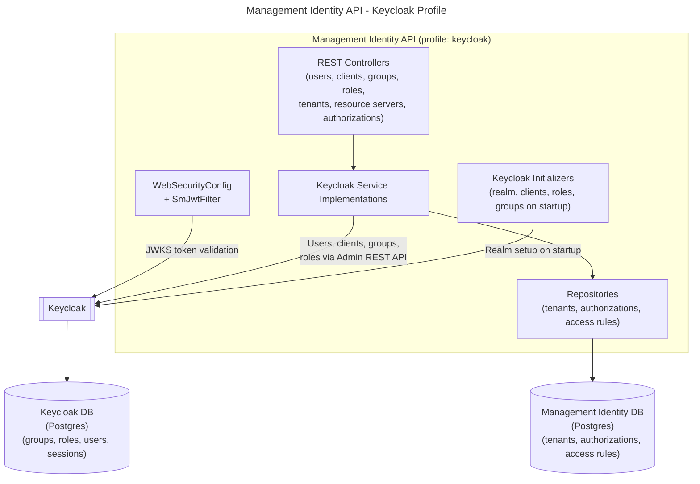

Key responsibilities:

- `WebSecurityConfig`: builds the security filter chain and registers `SmJwtFilter`.
- `SmJwtFilter`: validates JWTs using the Identity SDK against the configured IdP (Keycloak in this profile); handles cookie-based session refresh for browser flows.
- `UserController` (`/api/users`), `ClientController` (`/api/clients`): CRUD REST endpoints for users and OAuth2 clients (keycloak profile only).
- `GroupController` (`/api/groups`), `RoleController` (`/api/roles`): CRUD REST endpoints for groups and roles.
- `TenantController` (`/api/tenants`), `TenantApplicationController`, `TenantUserController`, `TenantGroupController`: tenant management and tenant-membership endpoints.
- Keycloak service implementations: implement domain logic by delegating user, client, group, and role operations to Keycloak via the Keycloak Admin Client (e.g. `KeycloakUserServiceImpl`).
- Repositories: Spring Data JPA repositories for tenants and authorization data stored in the Management Identity database.
- Initializers: configure the Keycloak realm, pre-defined clients, roles, and groups on startup.

#### 5.2.2 External OIDC deployment (profile `oidc`)

When an external OIDC provider is used instead of Keycloak (Spring profile `oidc`), user and client management via an admin API is not available.
Groups, roles, permissions, and mapping rules are stored in the Management Identity PostgreSQL database.
Token validation is handled in the same way as in the `keycloak` profile: `SmJwtFilter` delegates to the Identity SDK, which uses the configured IdP metadata (issuer, JWKS, and token endpoints).

OIDC service implementations (`OidcGroupService`, `OidcRoleServiceImpl`, `OidcPermissionServiceImpl`, `OidcMappingRuleServiceImpl`, `OidcTokenTenantService`, etc.) replace the Keycloak implementations.

Initializers (`OidcPresetInitializer`, `OidcMappingRuleInitializer`, `OidcTenantInitializerService`, etc.) set up default roles, permissions, and mapping rules in the Management Identity DB on startup.

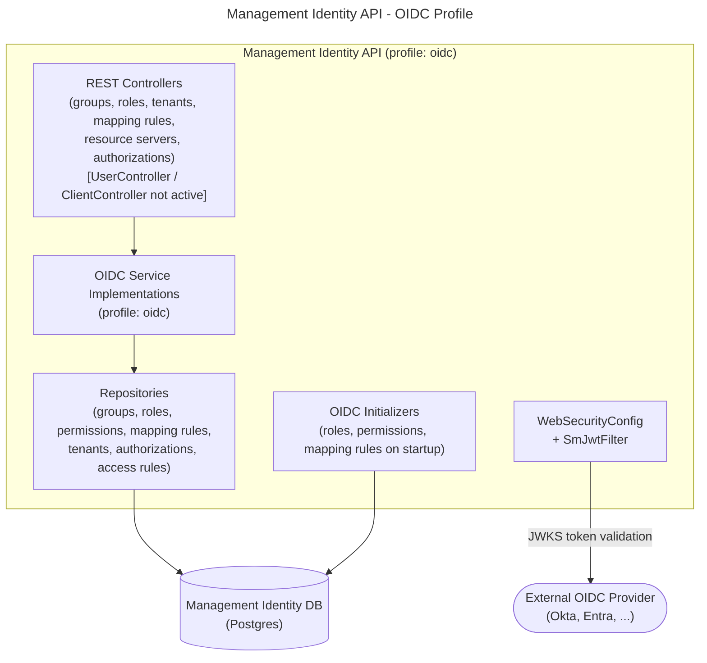

Key differences from the Keycloak variant:

- Token validation is identical to the Keycloak variant: `SmJwtFilter` and the Identity SDK are used in both profiles; only the configured IdP endpoints differ.
- `UserController` and `ClientController` are not active: there is no user or client synchronization to the external OIDC provider via an admin API.
- `MappingRuleController` (`/api/mapping-rules`) is active only in the `oidc` profile, as mapping rules are the primary mechanism for resolving roles from IdP claims.
- Groups, roles, permissions, and mapping rules are stored in the Management Identity database.
- Role assignment from IdP claims relies on mapping rules evaluated against external token claims at login time.

## 6. Runtime view

### 6.1 User login via Keycloak (default)

Scenario: a platform user logs into Console, Web Modeler, or Optimize using the default bundled Keycloak as the IdP.

1. Browser navigates to Console, Web Modeler, or Optimize.
2. The application redirects the browser to Keycloak for login (OIDC authorization code flow).
3. The user authenticates with Keycloak.
4. Keycloak redirects back to the application with an authorization code.
5. The application exchanges the authorization code for tokens and requests user info.
6. The application calls Management Identity’s public token-resolution endpoints (for example /api/authorizations/for-token, /api/tenants/for-token, /api/groups/for-token) with a Bearer access token. After SmJwtFilter validation, the corresponding controllers resolve roles/groups/tenants from Keycloak-backed data and Management Identity assignments.
7. A session is established, and the application renders the requested view.

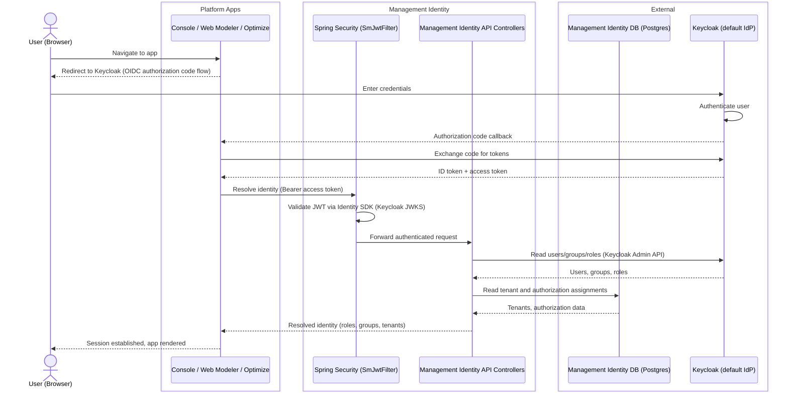

### 6.2 User login via external OIDC IdP (Keycloak as broker)

Scenario: the enterprise uses an external IdP (for example Okta or Microsoft Entra ID). Keycloak is configured as an OIDC broker and forwards authentication to the external IdP.

1. Browser navigates to Console, Web Modeler, or Optimize.
2. The application redirects to Keycloak; Keycloak in turn redirects to the external IdP.
3. The external IdP authenticates the user and redirects back to Keycloak with an authorization code.
4. Keycloak exchanges the code for external tokens, maps the external claims to local users/groups using Keycloak identity-provider mappers, and issues its own tokens.
5. The application receives Keycloak tokens and proceeds as in the default login flow (6.1).
6. Management Identity API validates the Keycloak token and resolves platform roles, groups, and tenants from Keycloak-backed assignments plus Management Identity tenant/authorization data.

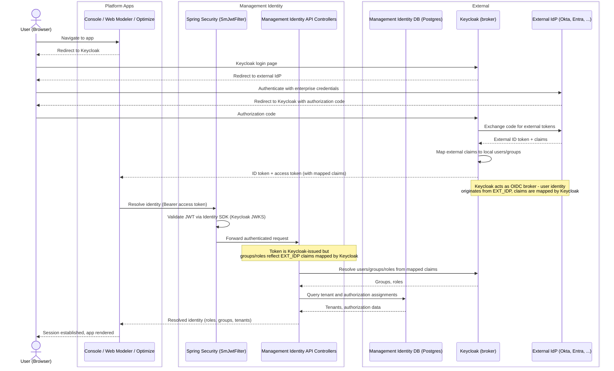

### 6.3 User login via direct external OIDC provider (profile `oidc`)

Scenario: a platform user logs into Console, Web Modeler, or Optimize when Management Identity is configured directly against an external OIDC provider (no Keycloak involved).

1. Browser navigates to Console, Web Modeler, or Optimize.
2. The application redirects the browser directly to the external OIDC provider.
3. The user authenticates with the enterprise IdP.
4. The external OIDC provider issues an authorization code and the application exchanges it for tokens.
5. The application calls the Management Identity API with the resulting token.
6. `SmJwtFilter` validates the token via the Identity SDK against the configured issuer and JWKS endpoint.
7. Management Identity evaluates mapping rules and stored assignments in the Management Identity database to resolve platform roles and Optimize tenants.
8. A session is established and the requested view is rendered.

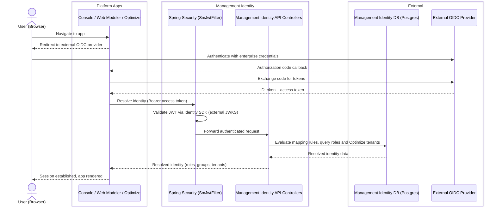

### 6.4 Machine-to-machine access via Keycloak (client credentials)

Scenario: an automated service calls the Management Identity API using client credentials against the default Keycloak IdP.

This is not a typical use case; typical M2M integrations are carried out via orchestration cluster APIs, so OC Identity.

1. The service requests a JWT access token from Keycloak using the OAuth2 client credentials grant.
2. Keycloak validates the client credentials and issues an access token.
3. The service sends the token as a `Bearer` header on each Management Identity API request.
4. `SmJwtFilter` validates the token signature via the Identity SDK (Keycloak JWKS endpoint) and sets a `JwtAuthenticationToken` on the `SecurityContext`.
5. Management Identity API resolves the client's roles and permissions from the database and processes the authorized request.

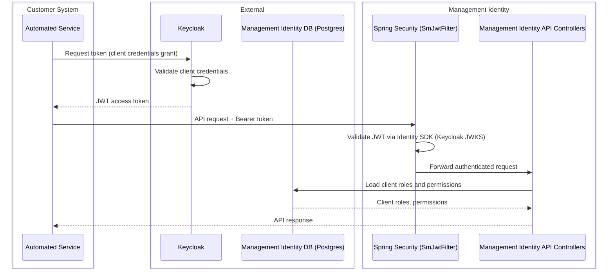

### 6.5 Machine-to-machine access via external OIDC provider (client credentials)

Scenario: an automated service calls the Management Identity API using a token issued directly by an external OIDC provider (no Keycloak involved).

Note: unlike the Orchestration Cluster-side client support introduced in Camunda 8.8, `private_key_jwt` client authentication has not yet been ported to Management Identity. The flow described here therefore assumes standard client-credentials authentication at the external IdP.

1. The service requests a JWT access token directly from the external OIDC provider using the OAuth2 client credentials grant.
2. The external OIDC provider validates the client credentials and issues an access token.
3. The service sends the token as a `Bearer` header on each Management Identity API request.
4. `SmJwtFilter` validates the token signature via the Identity SDK (external OIDC JWKS endpoint) and sets a `JwtAuthenticationToken` on the `SecurityContext`.
5. Management Identity API evaluates `MappingRule` entities to resolve the client's roles from the database and processes the authorized request.

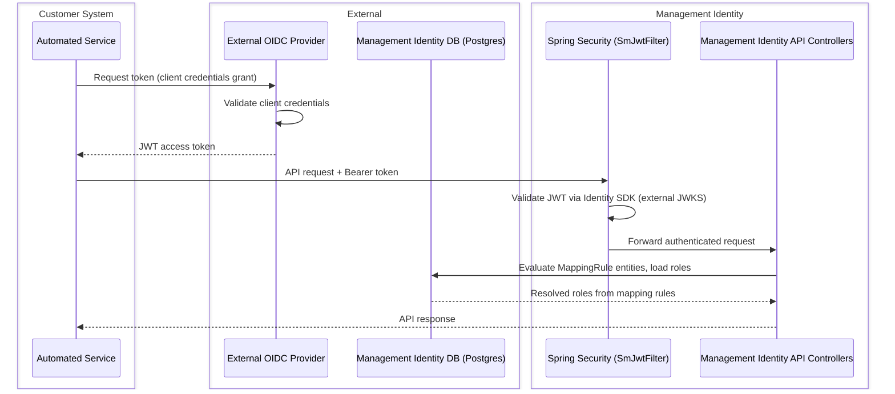

### 6.6 Admin operations: managing users and roles (Keycloak profile)

Scenario: a platform administrator uses the Management Identity UI to create a new user and assign a role to that user (keycloak profile only).

1. Administrator logs into the Management Identity UI via the standard OIDC login flow (see 6.1). The `AuthController` handles the OIDC callback and issues session cookies via `CookieService`.
2. Administrator navigates to Users and creates a new user.
3. Management Identity UI sends a `POST /api/users` request to the Management Identity API.
4. `UserController` delegates to `KeycloakUserServiceImpl`, which creates the user in the Keycloak realm via the Keycloak Admin Client.
5. Administrator assigns a role to the user.
6. Management Identity UI sends a `POST /api/users/{id}/roles` request.
7. `UserController` delegates to `KeycloakUserServiceImpl`, which assigns the Keycloak realm role to the user.

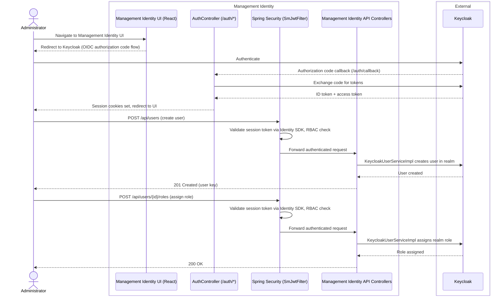

## 7. Deployment view

Management Identity-specific aspects:

- Standalone service
  Management Identity is deployed separately from the Orchestration Cluster in Self-Managed setups.

- Profile-based IdP integration
  Deployment topology depends on the active profile (`keycloak` or `oidc`).

- Storage
  Management Identity uses its own PostgreSQL database. In the `keycloak` profile, Keycloak uses a separate PostgreSQL database for users, sessions, and realm config.

### 7.1 Default Self-Managed deployment

In the default setup (`keycloak` profile), Management Identity runs with bundled Keycloak.
Platform apps authenticate via Keycloak and resolve platform RBAC via Management Identity.

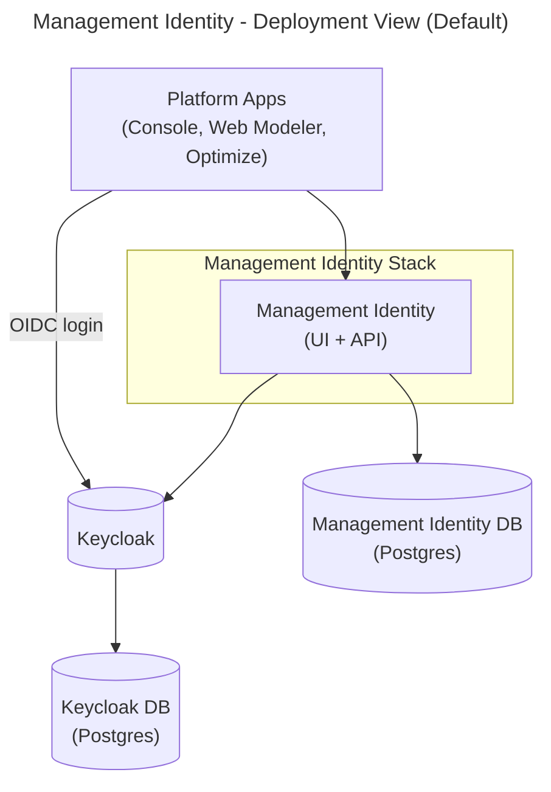

Key points:

- Management Identity and Keycloak are separate services.
- Management Identity stores tenants, authorizations, and access rules in its own DB.
- Keycloak stores users, groups, roles, clients, sessions, and realm configuration in its own DB.

### 7.2 External Keycloak or OIDC provider

For enterprise setups, Management Identity can use:

- External Keycloak (profile `keycloak`), or
- Direct external OIDC provider (profile `oidc`).

The deployment below shows the direct external OIDC mode (`oidc` profile).

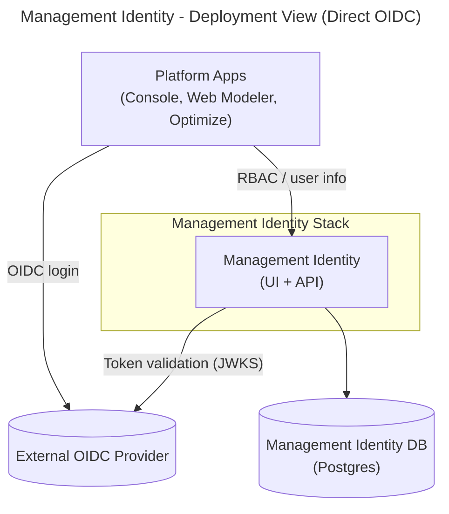

Key points:

- In `oidc` profile, groups, roles, permissions, mapping rules, and tenants are stored in the Management Identity DB.
- There is no Keycloak Admin API synchronization path in direct external OIDC mode.

## 8. Crosscutting concepts

This section only highlights differences or specifics for Management Identity. For shared concepts (RBAC model, mapping rules, tenants, authorization checks), see the [Orchestration Cluster Identity architecture doc](identity_architecture_docs.md).

- Authentication
  - OIDC via Keycloak or external IdP.
  - Authorization code flow for human users; `AuthController` handles the OIDC callback and `CookieService` manages session cookies for browser-based UI access.
  - Client credentials for platform services and external tools.
  - `private_key_jwt` client authentication support introduced for Orchestration Cluster-side clients has not yet been ported to Management Identity.
  - Token validation in active profiles is performed by `SmJwtFilter` (a `JwtFilter` subclass) using the Identity SDK.

- Authorization
  - RBAC model with roles, permissions, users, and groups controlling:
    - Console features and views.
    - Web Modeler access and collaboration features.
    - Optimize data access and actions.
  - Method-level authorization is enforced by `@PreAuthorize` annotations on controller methods (configured via `GlobalMethodSecurityConfig` and `CustomMethodSecurityExpressionHandler`).
  - Runtime resource authorizations for process instances, tasks, etc. are handled by Orchestration Cluster Identity and its RBAC engine, not by Management Identity.

- Spring profile-based feature toggling
  - Active profiles (`keycloak`, `oidc`) select which service implementations, controllers, and repositories are active. This avoids runtime conditionals in business logic and allows each supported deployment mode to be tested in isolation.

- Tenants
  - Management Identity tenants apply to Optimize only (for data isolation in reporting and analytics); they are stored in `TenantRepository` and gated by the `multi-tenancy` feature flag.
  - Runtime tenants for process execution live in Orchestration Cluster Identity.

- Mapping rules
  - In the `oidc` profile, `MappingRule` entities (stored in `MappingRuleRepository`) map IdP token claims (for example group names, attributes) to roles and Optimize tenants.
  - `OidcMappingRuleServiceImpl` (single-tenant) and `MultiTenantOidcMappingRuleServiceImpl` (multi-tenant) evaluate these rules on token validation.
  - The same general pattern is used for Orchestration Cluster Identity; see the [Orchestration Cluster Identity architecture doc](identity_architecture_docs.md) for details.

- Data storage
  - Management Identity uses its own PostgreSQL database. Unlike Orchestration Cluster Identity, it does not reuse Zeebe's primary or secondary storage.
  - In the `keycloak` profile, users, groups, roles, and clients are stored in Keycloak's database; only tenants and authorizations live in the Management Identity DB.
  - In the `oidc` profile, all identity data (groups, roles, permissions, mapping rules, tenants) is stored in the Management Identity DB.
  - Keycloak uses a separate PostgreSQL database for users, sessions, and realm configuration.

- Startup initialization
  - `ApplicationInitializer` validates that exactly one authentication backend profile is active on startup.
  - Profile-specific initializers configure the IdP realm, clients, roles, groups, permissions, and mapping rules in the correct backend on first boot.
  - `EnvironmentInitializer` seeds tenant data from common configuration when multi-tenancy is enabled.

## 9. Architectural decisions

The following decisions are specific to Management Identity. For decisions about Orchestration Cluster Identity (for example the decision to embed identity in the cluster rather than use Management Identity for runtime, or the resource-based authorization model), see the ADRs referenced in the [Orchestration Cluster Identity architecture doc](identity_architecture_docs.md#9-architectural-decisions).

Keycloak as default IdP
: Management Identity ships Keycloak as the default bundled IdP for Self-Managed deployments. This provides an out-of-the-box OIDC-capable IdP with a well-known admin API that Management Identity can configure programmatically. External Keycloak and direct OIDC modes are also supported for enterprise environments.

Separate service (not cluster-embedded)
: Management Identity is deployed as an independent service rather than being embedded in the Orchestration Cluster. This keeps platform-level IAM (Console, Web Modeler, Optimize) decoupled from cluster runtime availability. As Orchestration Cluster Identity is introduced and runtime IAM moves into the cluster, the trade-off is that two identity services must be operated in Self-Managed deployments.

Spring profiles for deployment-mode selection
: Instead of runtime conditional logic, Management Identity uses Spring profiles (`keycloak`, `oidc`) to activate the correct service implementations, controllers, and repositories for each supported deployment mode. This isolates IdP-specific logic and allows each mode to be tested independently.

Service-interface / implementation split
: Service contracts are defined as service interfaces, with profile-specific implementations. This allows the same controllers to operate in all modes without knowing which IdP is backing them.

Clients as the OAuth2 abstraction
: The internal domain model uses the term "client" (aligned with OAuth2 terminology) for OAuth2 client registrations. The REST API is exposed under `/api/clients` and implemented by `ClientController` (keycloak profile only), with `KeycloakClientServiceImpl` managing client registration in Keycloak.

PostgreSQL as persistence layer
: Unlike Orchestration Cluster Identity, which reuses Zeebe's storage, Management Identity uses its own PostgreSQL database. This is consistent with its role as a standalone platform service.

## 10. Risks and technical debt

Dual identity model
: Management Identity (for Console, Web Modeler, Optimize) and Orchestration Cluster Identity (for the runtime cluster) are both operated in Self-Managed environments. This creates a risk of confusion about the source of truth for identity data and duplicated configuration, because some applications use Management Identity while others use Orchestration Cluster Identity. Identity data may therefore need to be managed in two places for different applications. Mitigation: clear documentation of the responsibility boundary; alignment of concepts and naming across both models; and tooling that helps operators understand and audit where particular users, groups, and roles are configured.

Keycloak operational complexity
: Running Keycloak as a dependency adds operational overhead: version management, database maintenance, configuration management, and availability dependencies. Misconfigured realms or client registrations can break login for all platform apps.
Mitigation: Helm chart automation for standard setups; detailed documentation for external Keycloak and direct OIDC configurations.

External IdP dependency
: For OIDC, availability and correctness of the external IdP (Keycloak or third-party) are critical. Misconfigured claims or mapping rules can lead to over- or under-provisioned access.
Mitigation: mapping rule validation; comprehensive integration tests for common IdP configurations.

## 11. Glossary

| Term                      | Definition |
|---------------------------|-----------|
| Management Identity       | Standalone identity service (Self-Managed) for platform-level apps: Console, Web Modeler, and Optimize. |
| Orchestration Cluster Identity | Cluster-embedded identity service for runtime IAM (Zeebe, Operate, Tasklist, Orchestration Cluster APIs). See [identity_architecture_docs.md](identity_architecture_docs.md). |
| Keycloak                  | Open-source IdP bundled with Management Identity by default (Spring profile `keycloak`); also supports external Keycloak or direct OIDC providers. |
| Spring profile            | Mechanism used to select deployment mode. Active profiles are `keycloak` (default) and `oidc` (external OIDC). |
| Platform app              | Applications managed by Management Identity: Console, Web Modeler, Optimize. |
| User                      | Human principal managed in Keycloak (keycloak profile) or referenced by ID from an external IdP (oidc profile). |
| Group                     | Named collection of users; stored in Keycloak (keycloak profile) or in `GroupRepository` (oidc profile). |
| Role                      | Set of permissions controlling what operations a user or service can perform in platform apps; stored in Keycloak (keycloak profile) or in `RoleRepository` (oidc profile). |
| Client                    | OAuth2 client registered in Management Identity representing a platform or external app (for example Optimize backend, Web Modeler backend). |
| Tenant (Optimize)         | Logical partition for reporting and data isolation in Optimize. Stored in `TenantRepository`. Distinct from runtime tenants in Orchestration Cluster Identity. |
| Mapping rule              | Entity mapping IdP token claims (for example group names, attributes) to Management Identity roles or Optimize tenants; evaluated by mapping rule services in the `oidc` profile. |
| OIDC                      | OpenID Connect; the protocol used for authentication and token issuance between platform apps, IdP, and Management Identity. |
| Client credentials grant  | OAuth2 flow for machine-to-machine access; a service authenticates with its client ID and secret to obtain a token. |
| Authorization code flow   | OAuth2/OIDC flow for interactive user login via a browser redirect to the IdP. |
| JWKS                      | JSON Web Key Set; the public key endpoint exposed by Keycloak/IdP, used by JWT filters to validate incoming JWT signatures. |
| WebSecurityConfig         | Spring configuration class that defines the security filter chain for the Management Identity API. |
| SmJwtFilter               | Self-Managed JWT filter; validates tokens and handles session cookie refresh for browser flows. |
| JwtAuthenticationToken    | Spring Security Authentication object set on the `SecurityContext` after JWT validation. |
