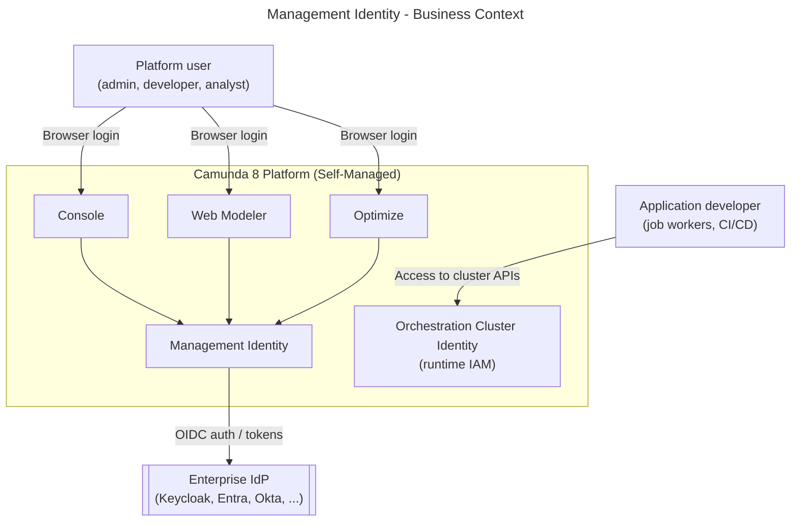
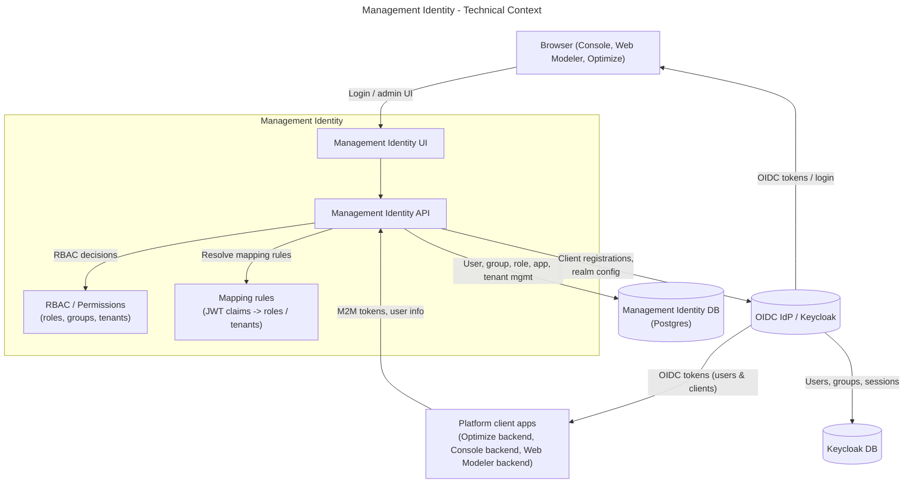
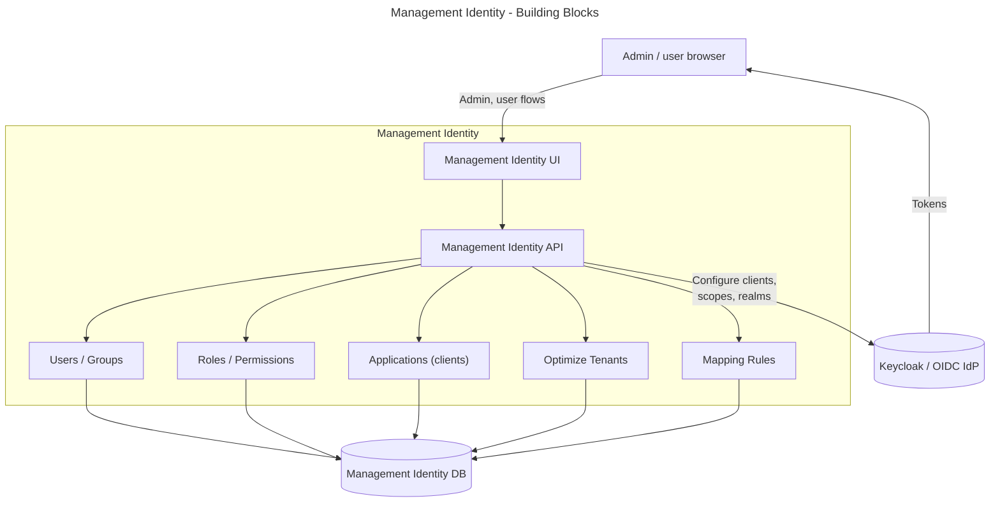

# Management Identity architecture documentation

## 1. Introduction and goals

### 1.1 Overview

Management Identity is the Self‑Managed Camunda 8 component that manages authentication and access control for platform‑level applications that sit outside the Orchestration Cluster:

- Console
- Web Modeler
- Optimize

It is responsible for:

- User and machine authentication via OIDC or the bundled Keycloak.
- Role‑based access control (RBAC) for Console, Web Modeler, and Optimize.
- Managing users, groups, roles, permissions, tenants (Optimize), and mapping rules.

By design, Management Identity does not control access for the Orchestration Cluster (Zeebe, Operate, Tasklist, Orchestration Cluster APIs). That is handled by Orchestration Cluster Identity, described in the Orchestration Cluster Identity architecture documentation:

- Orchestration Cluster Identity architecture:
  https://github.com/camunda/camunda/blob/identity_architecture_documentation/docs/monorepo-docs/architecture/components/identity/identity_architecture_docs.md

Where concepts (users, groups, roles, mapping rules, tenants, RBAC) overlap between Management Identity and Orchestration Cluster Identity, the Orchestration Cluster Identity document is the primary reference. This document describes only the specifics of Management Identity.

### Goals

1. Provide a dedicated identity and access control layer for Web Modeler, Console, and Optimize in Self‑Managed deployments.
2. Integrate with enterprise IdPs via OIDC, including using Keycloak either as primary IdP or as a broker to external IdPs.
3. Offer a clear, UI‑driven experience to manage users, groups, roles, applications (clients), and tenants for Optimize.
4. Keep platform‑level identity concerns separate from runtime (cluster) identity.

### 1.2 Scope

In scope:

- Authentication and authorization for:
  - Console
  - Web Modeler
  - Optimize
- Management Identity UI and APIs
- Integration with Keycloak and external OIDC providers
- Platform‑level tenants for Optimize

Out of scope (covered by Orchestration Cluster Identity):

- Authentication and authorization for Zeebe, Operate, Tasklist, and Orchestration Cluster APIs.
- Cluster‑local tenants and runtime resource authorizations.

For those topics, see the Orchestration Cluster Identity architecture doc linked above.

## 2. Constraints

- Separate component
  Management Identity runs as its own service (and supporting services such as Keycloak and Postgres) alongside the Orchestration Cluster in Self‑Managed setups.

- Default IdP stack
  Management Identity is, by default, wired to a packaged Keycloak and its database, but supports:
  - Using an external existing Keycloak.
  - Using a generic external OIDC provider via Keycloak’s identity brokering and/or a direct OIDC mode.

- Protocols
  Authentication flows are based on OAuth 2.0 and OIDC (authorization code flow for interactive users, client credentials for machine‑to‑machine).

- Responsibility split
  Management Identity must not be a dependency for Orchestration Cluster runtime access. Orchestration Cluster Identity is the source of truth for runtime IAM; Management Identity handles only platform apps.

- Data ownership
  Management Identity is the source of truth for:
  - Platform users, groups, roles, and applications for Web Modeler, Console, and Optimize.
  - Platform‑level tenants and mapping rules relevant to Optimize.
    Runtime tenants and authorizations must not be managed in Management Identity after migration to Orchestration Cluster Identity.

## 3. System context and scope

### 3.1 Business context

Main actors:

- Platform user: administrators, modelers, and analysts using Console, Web Modeler, and Optimize.
- Application developer: developers building job workers or integrations against Orchestration Clusters.
- Management Identity: manages platform‑level authentication and RBAC for Console, Web Modeler, and Optimize.
- Orchestration Cluster Identity: manages runtime authentication and RBAC for cluster components.
- Enterprise IdP: central source of user identities and group claims (via Keycloak or other OIDC providers).

Management Identity and Orchestration Cluster Identity are siblings: they serve different application surfaces but can share common identity concepts (users, groups, roles, mapping rules, tenants) and, over time, converge towards a unified model as described in the Orchestration Cluster Identity architecture doc.

### 3.2 Technical context

Key points:

- Console, Web Modeler, and Optimize UIs use OIDC login against the IdP (Keycloak or external), with Management Identity owning the configuration for:
  - Clients
  - Scopes
  - Redirect URIs
- Management Identity UI and API allow administrators to manage users, groups, roles, applications (clients), Optimize tenants, and mapping rules.
- Application backends (Console, Web Modeler, Optimize) use client credentials and/or user tokens issued by the IdP, and consult Management Identity’s RBAC model when enforcing access.

## 4. Solution strategy

- Separate management plane for platform apps
  Management Identity provides an independent authentication/authorization surface for Console, Web Modeler, and Optimize, without coupling cluster runtime IAM to platform app availability.

- OIDC‑based SSO via Keycloak or external IdPs
  Keycloak is provided as a default IdP and broker, with support for external enterprise IdPs via OIDC. Interactive users authenticate via authorization code flow; applications use client credentials.

- RBAC for platform resources
  A role‑based access model is used to protect:
  - Console features (cluster registration, license, user management, etc.).
  - Web Modeler workspaces, projects, and collaboration features.
  - Optimize dashboards, reports, and data access.

- Mapping rules and tenants for Optimize
  Mapping rules connect IdP claims (for example groups, attributes) to roles and tenants in Management Identity. Optimize uses these tenants to segment data and access for different business units or customers.

- Alignment with Orchestration Cluster Identity model
  Where consistent and feasible, Management Identity uses naming and concepts aligned with Orchestration Cluster Identity (users, groups, roles, tenants, mapping rules, authorizations). Details of the shared model and runtime behavior are defined in the Orchestration Cluster Identity architecture doc.

## 5. Building block view

Responsibilities:

- Management Identity UI
  Console for administrators to:
  - Manage users, groups, roles, applications, and tenants.
  - Define mapping rules.

- Management Identity API
  Backing services that store and retrieve identity data, render it to the UI, and integrate with the IdP.

- Users and groups
  Platform‑level principals and groupings for Console, Web Modeler, and Optimize.

- Roles and permissions
  Define what operations users and applications can perform in the platform apps.

- Applications (clients)
  Represent platform and external applications that consume tokens (for example Optimize backend, Web Modeler backend, custom tools).

- Tenants (Optimize)
  Logical partitions for reporting and data isolation in Optimize only.

- Mapping rules
  Connect IdP token claims to roles, groups, and tenants. The general mapping‑rules concept is shared with Orchestration Cluster Identity; see the mapping rules section in the Orchestration Cluster Identity architecture doc for a more detailed explanation of the pattern.

## 6. Crosscutting concepts

This section only highlights differences or specifics for Management Identity. For shared concepts (RBAC model, mapping rules, tenants, authorization checks), see the Orchestration Cluster Identity architecture doc.

- Authentication
  - OIDC via Keycloak or external IdP.
  - Authorization code flow for human users.
  - Client credentials for platform services and external tools.

- Authorization
  - RBAC model with roles, permissions, users, and groups controlling:
    - Console features and views.
    - Web Modeler access and collaboration features.
    - Optimize data access and actions.
  - Runtime resource authorizations for process instances, tasks, etc. are handled by Orchestration Cluster Identity and its RBAC engine, not by Management Identity.

- Tenants
  - Management Identity tenants apply to Optimize only (for data isolation in reporting and analytics).
  - Runtime tenants for process execution live in Orchestration Cluster Identity.

- Mapping rules
  - Rules in Management Identity map IdP claims (for example group names) to:
    - Roles (e.g. Console Admin, Optimize Analyst)
    - Optimize tenants
  - The same general pattern is used for Orchestration Cluster Identity; see the Orchestration Cluster Identity architecture doc for details.

## 7. Quality goals

- Clear separation of concerns
  Platform‑level identity (Management Identity) and runtime identity (Orchestration Cluster Identity) are separated to avoid cross‑dependencies that affect availability.

- Integratability
  Straightforward integration with customer IdPs via Keycloak and OIDC, including support for common enterprise setups.

- Operability
  Management Identity should be observable and manageable (logging, metrics) as part of the broader Self‑Managed deployment.

- Consistency with Orchestration Cluster Identity
  Where feasible, concepts and naming are kept aligned with Orchestration Cluster Identity to reduce cognitive load and simplify documentation and tooling.
