# Management Identity architecture documentation

## 1. Introduction and goals

This documentation is based on [arc42](https://arc42.org/overview), a common architecture documentation template for software systems. It covers constraints, system context, solution strategy, building blocks, runtime view, deployment, crosscutting concepts, and risks.

### 1.1 Overview

The Management Identity component in Camunda 8 Self-Managed is used to manage authentication, access, and authorization for components outside the Orchestration Cluster:

- Console
- Web Modeler
- Optimize

It is responsible for:

- User and machine authentication via OIDC or the bundled Keycloak.
- Role-based access control (RBAC) for Console, Web Modeler, and Optimize.
- Managing users, groups, roles, permissions, clients (OAuth2 applications), tenants (Optimize), and mapping rules.

The legacy `saas` Spring profile still exists in parts of the codebase, but it is deprecated and no longer used for current Management Identity deployments.

By design, Management Identity does not control access to the Orchestration Cluster. That is handled by Orchestration Cluster Identity, described in the Orchestration Cluster Identity architecture documentation:

- [Orchestration Cluster Identity architecture](identity_architecture_docs.md)

Where concepts (users, groups, roles, mapping rules, tenants, RBAC) overlap between Management Identity and Orchestration Cluster Identity, the Orchestration Cluster Identity document is the primary reference. This document describes only the specifics of Management Identity.

The user guide for Management Identity is available here:

- [User Guide](https://docs.camunda.io/docs/self-managed/components/management-identity/overview/)

### Goals

1. Provide a dedicated identity and access control layer for Web Modeler, Console, and Optimize in Self-Managed deployments.
2. Integrate with enterprise IdPs via OIDC, including using Keycloak either as a primary IdP or as a broker to external IdPs.
3. Offer a clear, UI-driven experience to manage users, groups, roles, clients (OAuth2 applications), and tenants for Optimize.
4. Keep platform-level identity concerns separate from runtime (cluster) identity.

## 2. Constraints

- Separate component
  Management Identity runs as its own service (and supporting services such as Keycloak and Postgres) alongside the Orchestration Cluster in Self-Managed setups.

- Default IdP stack
  Management Identity is, by default, wired to a packaged Keycloak and its database but supports:
  - Using an external existing OIDC provider.
  - Using an external database.

- Protocols
  Authentication flows are based on OAuth 2.0 and OIDC (authorization code flow for interactive users, client credentials for machine-to-machine).

- Responsibility split
  Management Identity must not be a dependency for Orchestration Cluster runtime access. Orchestration Cluster Identity is the source of truth for runtime IAM; Management Identity handles only platform apps.

- Data ownership
  Management Identity is the source of truth for:
  - Platform users, groups, roles, and clients for Web Modeler, Console, and Optimize.
  - Platform-level tenants and mapping rules relevant to Optimize.

## 3. System context and scope

### 3.1 Business context

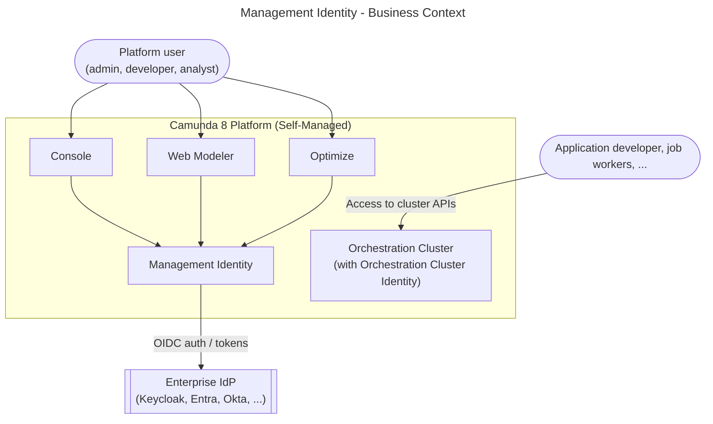

Entities:

- Platform user: administrators, modelers, and analysts using Console, Web Modeler, and Optimize.
- Application developer: developers building job workers or integrations against Orchestration Clusters.
- Management Identity: manages platform-level authentication and RBAC for Console, Web Modeler, and Optimize.
- Orchestration Cluster (with Orchestration Cluster Identity): runtime cluster with its own embedded identity service for process execution and task access control.
- Enterprise IdP: central source of user identities and group claims (via Keycloak or other OIDC providers).

### 3.2 Technical context

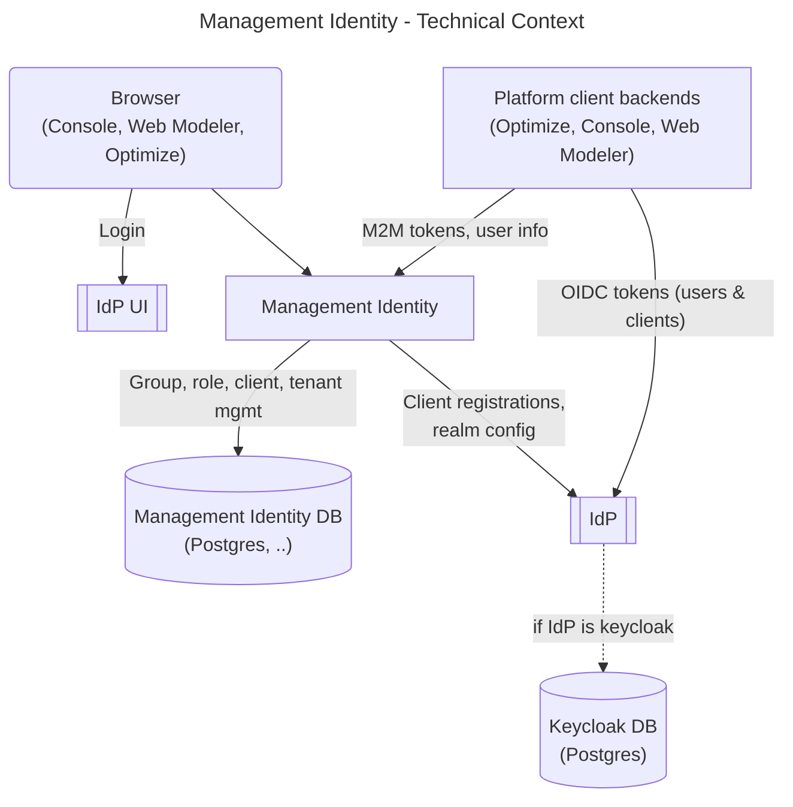

Entities:

- Browser: the user's browser accessing Console, Web Modeler, Optimize, and the Management Identity UI.
- IdP UI: the login UI exposed by the IdP, such as the Keycloak login page or the login page of an external enterprise IdP.
- Platform client backends: backend services for Console, Web Modeler, and Optimize that use OIDC user tokens and client credentials when calling Management Identity or the IdP.
- Management Identity: the standalone service that serves the admin UI and API and manages platform users, groups, roles, clients, tenants, and mapping rules.
- IdP: the OIDC identity provider used for authentication and token issuance. In the default setup this is Keycloak; it can also act as a bridge/broker to external enterprise IdPs, or Management Identity can be connected directly to an external OIDC provider.
- Management Identity DB: PostgreSQL database used by Management Identity for its own persisted identity and authorization data, depending on the active profile.
- Keycloak DB: PostgreSQL database used by Keycloak for users, groups, sessions, and realm configuration when the `keycloak` profile is active.

## 4. Solution strategy

- Separate management plane for platform apps
  Management Identity provides an independent authentication/authorization surface for Console, Web Modeler, and Optimize, without coupling cluster runtime IAM to platform app availability.

- OIDC-based SSO via Keycloak or external IdPs
  Keycloak is provided as a default IdP and broker, with support for external enterprise IdPs via OIDC. Interactive users authenticate via authorization code flow; applications use client credentials.

- RBAC for platform resources
  A role-based access model is used to protect:
  - Console features (cluster registration, license, user management, etc.).
  - Web Modeler workspaces, projects, and collaboration features.
  - Optimize dashboards, reports, and data access.

- Mapping rules and tenants for Optimize
  Mapping rules connect IdP claims (for example groups, attributes) to roles and tenants in Management Identity. Optimize uses these tenants to segment data and access for different business units or customers.

- Spring profile-based deployment modes
  The active Management Identity deployment modes are selected via Spring profiles (`keycloak`, `oidc`). A legacy `saas` profile remains in code for backward compatibility but is deprecated and no longer used.

- Alignment with Orchestration Cluster Identity model
  Where consistent and possible, Management Identity uses naming and concepts aligned with Orchestration Cluster Identity (users, groups, roles, tenants, mapping rules, authorizations). Details of the shared model and runtime behavior are defined in the Orchestration Cluster Identity architecture doc.

## 5. Building block view

### 5.1 Whitebox overall system

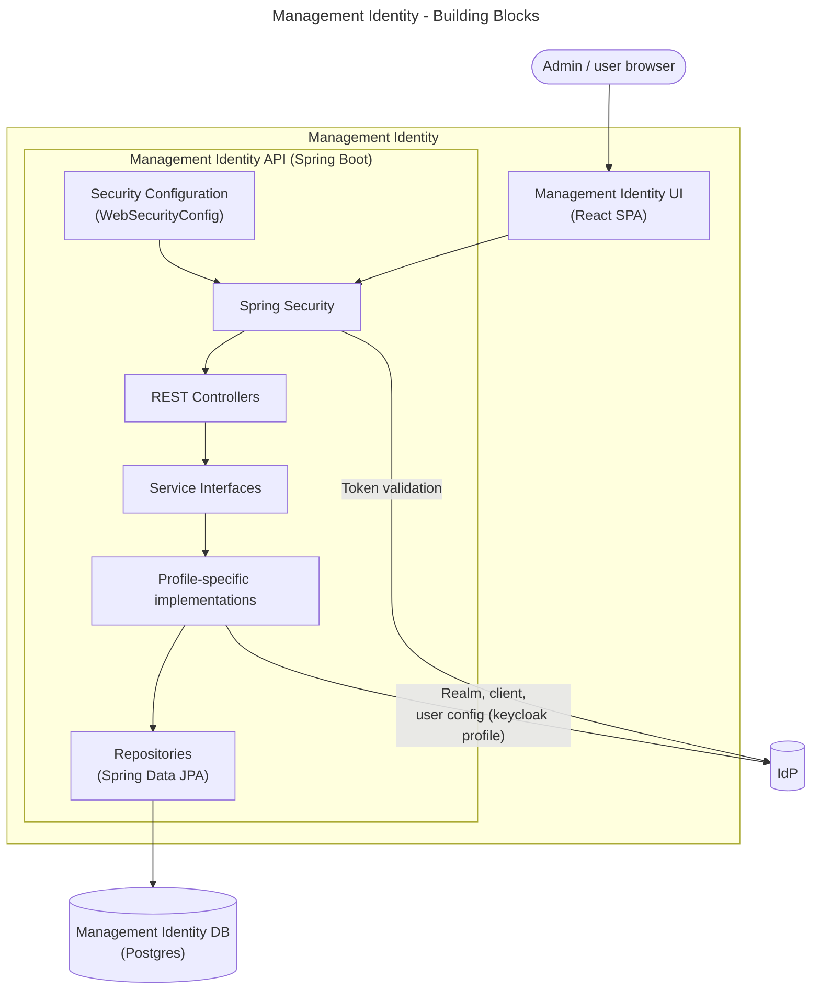

Main building blocks:

- Management Identity UI
  React single-page application (served by `FrontendController`) for administrators to manage users, groups, roles, clients (OAuth2 applications), and tenants, and to define mapping rules.

- Security Configuration (`WebSecurityConfig`)
  Spring configuration class that defines the security filter chain. It registers the `JwtFilter` implementation before the `BasicAuthenticationFilter` and explicitly permits unauthenticated access to paths such as `/auth/**`, `/actuator/**`, and public token-resolution endpoints.

- Spring Security
  Filter chain is responsible for authenticating incoming requests (OIDC token validation via the configured IdP JWKS endpoint) and enforcing RBAC before delegating to controllers.

- REST Controllers
  Note: Active controllers depend on the Spring profile (see section 5.2).

- Service Interfaces
  The API contract for each resource domain.

- Profile-specific implementations
  Concrete service implementations are organized by deployment mode:
  - Keycloak profile implementations (profile `keycloak`): back-end operations against Keycloak Admin REST API for users and clients; stores groups and roles in Keycloak.
  - OIDC profile implementations (profile `oidc`): stores groups, roles, permissions, and mapping rules in the Management Identity PostgreSQL database; no user or client synchronization to an external IdP.
  - Legacy SaaS-specific implementations (profile `saas`) still exist in code for compatibility but are deprecated and not used in current deployments.

- Repositories
  Spring Data JPA repositories providing CRUD access to the Management Identity PostgreSQL database. Active repositories depend on profile and feature flags:
  - GroupRepository (profile `oidc`; also wired for deprecated `saas` profile)
  - RoleRepository (profile `oidc`)
  - MappingRuleRepository (profile `oidc`)

  In the `keycloak` profile, groups, roles, and most role assignments live in Keycloak’s own database and are managed via the Keycloak Admin REST API, so there is no dedicated JPA repository for them in Management Identity. In the active `oidc` profile there is no such admin API, so Management Identity itself becomes the source of truth for groups, roles, and mapping rules. Some repository wiring still includes the deprecated `saas` profile for legacy compatibility.

- IdP
  Keycloak instance (default, profile `keycloak`) or external OIDC provider (profile `oidc`).

### 5.2 Building blocks by deployment mode

The internal decomposition of the Management Identity API differs across the active Spring profiles (`keycloak`, `oidc`). The controller and service-interface layers are largely shared; the difference lies in the concrete service implementations and the repositories that are active.

#### 5.2.1 Default Keycloak deployment (profile `keycloak`)

In the default configuration (Spring profile `keycloak`), Management Identity uses Keycloak both for token validation (via the Identity SDK + Keycloak JWKS) and for user and client synchronization via the Keycloak Admin REST API.

Service implementations (`KeycloakUserServiceImpl`, etc.) hold user, client, group, and role state in Keycloak; the Management Identity DB stores tenants, authorizations, and access rules.

Initializers (`KeycloakPresetInitializer`, `KeycloakEnvironmentInitializer`, etc.) configure the Keycloak realm, clients, roles, and groups on startup via the Keycloak Admin REST API.

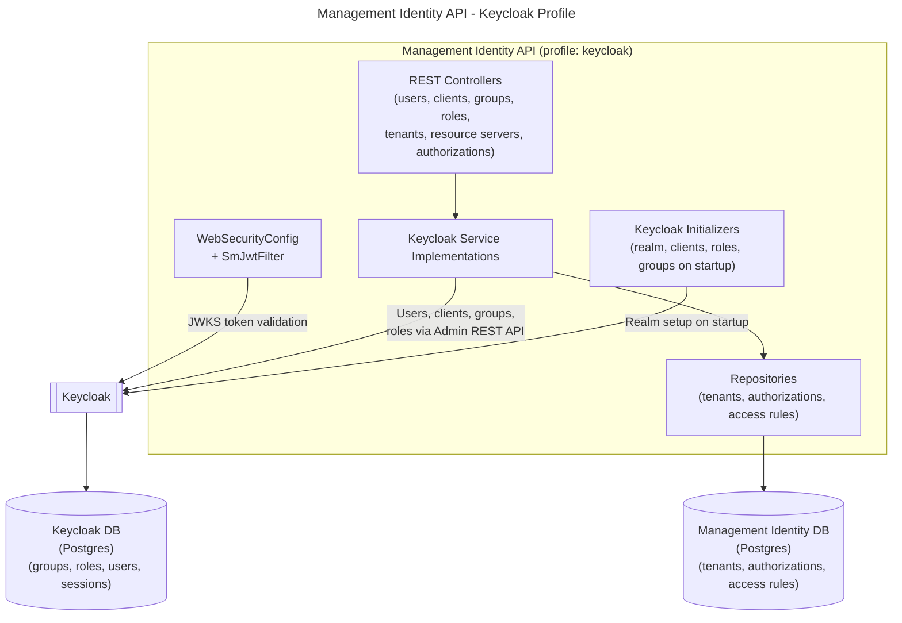

Key responsibilities:

- `WebSecurityConfig`: builds the security filter chain and registers `SmJwtFilter`.
- `SmJwtFilter`: validates JWTs using the Identity SDK against keycloak; handles cookie-based session refresh for browser flows.
- `UserController` (`/api/users`), `ClientController` (`/api/clients`): CRUD REST endpoints for users and OAuth2 clients (keycloak profile only).
- `GroupController` (`/api/groups`), `RoleController` (`/api/roles`): CRUD REST endpoints for groups and roles.
- `TenantController` (`/api/tenants`), `TenantApplicationController`, `TenantUserController`, `TenantGroupController`: tenant management and tenant-membership endpoints.
- Keycloak service implementations: implement domain logic by delegating user, client, group, and role operations to Keycloak via the Keycloak Admin Client (e.g. `KeycloakUserServiceImpl`).
- Repositories: Spring Data JPA repositories for tenants and authorization data stored in the Management Identity database.
- Initializers: configure the Keycloak realm, pre-defined clients, roles, and groups on startup.

#### 5.2.2 External OIDC deployment (profile `oidc`)

When an external OIDC provider is used instead of Keycloak (Spring profile `oidc`), user and client management via an admin API is not available.
Groups, roles, permissions, and mapping rules are stored in the Management Identity PostgreSQL database.
Token validation is handled in the same way as in the `keycloak` profile: `SmJwtFilter` delegates to the Identity SDK, which uses the configured IdP metadata (issuer, JWKS, and token endpoints).

OIDC service implementations (`OidcGroupService`, `OidcRoleServiceImpl`, `OidcPermissionServiceImpl`, `OidcMappingRuleServiceImpl`, `OidcTokenTenantService`, etc.) replace the Keycloak implementations.

Initializers (`OidcPresetInitializer`, `OidcMappingRuleInitializer`, `OidcTenantInitializerService`, etc.) set up default roles, permissions, and mapping rules in the Management Identity DB on startup.

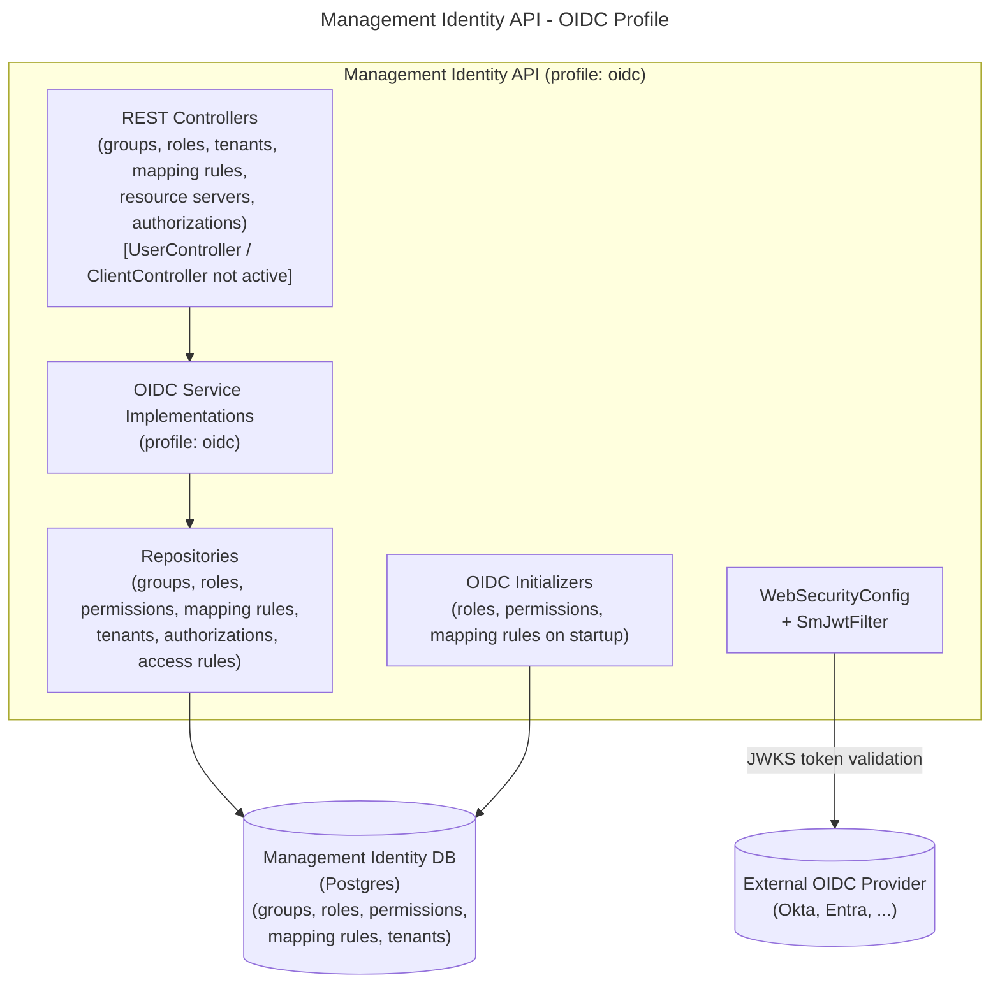

Key differences from the Keycloak variant:

- `UserController` and `ClientController` are not active: there is no user or client synchronization to the external OIDC provider via an admin API.
- `MappingRuleController` (`/api/mapping-rules`) is active only in the `oidc` profile, as mapping rules are the primary mechanism for resolving roles from IdP claims.
- Groups, roles, permissions, and mapping rules are stored in the Management Identity database.
- Role assignment from IdP claims relies on mapping rules evaluated against external token claims at login time.

## 6. Runtime view

### 6.1 User login via Keycloak (default)

Scenario: a platform user logs into Console, Web Modeler, or Optimize using the default bundled Keycloak as the IdP.

1. Browser navigates to Console, Web Modeler, or Optimize.
2. The application redirects the browser to Keycloak for login (OIDC authorization code flow).
3. The user authenticates with Keycloak.
4. Keycloak issues an ID token and access token and redirects back to the application.
5. The application exchanges the authorization code for tokens and requests user info.
6. The application calls Management Identity API to resolve the user's roles, groups, and tenants by matching token claims against stored assignments and mapping rules.
7. A session is established and the application renders the requested view.

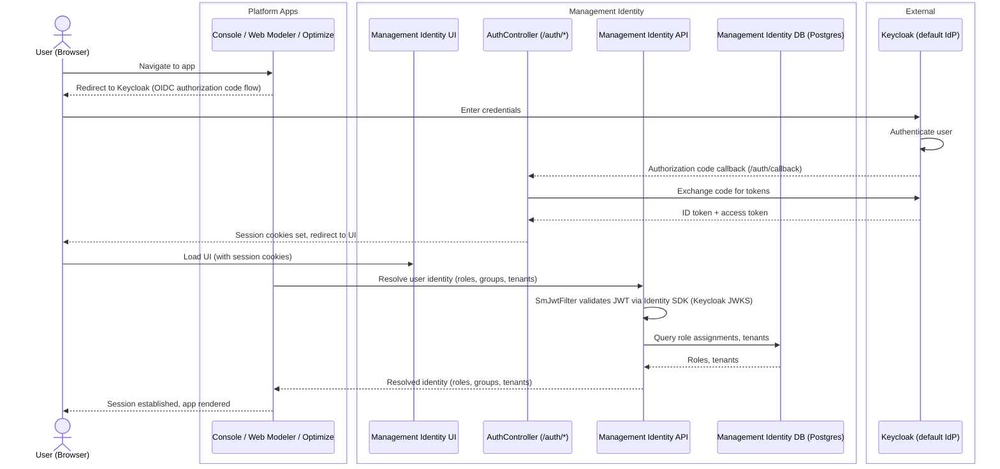

### 6.2 User login via external OIDC IdP (Keycloak as broker)

Scenario: the enterprise uses an external IdP (for example Okta or Microsoft Entra ID). Keycloak is configured as an OIDC broker and forwards authentication to the external IdP.

1. Browser navigates to Console, Web Modeler, or Optimize.
2. The application redirects to Keycloak; Keycloak in turn redirects to the external IdP.
3. The external IdP authenticates the user and redirects back to Keycloak with an authorization code.
4. Keycloak exchanges the code for external tokens, maps the external claims to local users/groups using Keycloak identity-provider mappers, and issues its own tokens.
5. The application receives Keycloak tokens and proceeds as in the default login flow (6.1).
6. Management Identity API evaluates mapping rules to assign platform roles and tenants based on the claims in the Keycloak token.

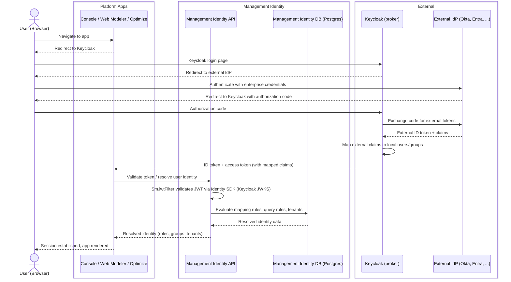

### 6.3 Machine-to-machine access via Keycloak (client credentials)

Scenario: an automated service calls the Management Identity API using client credentials against the default Keycloak IdP.

1. The service requests a JWT access token from Keycloak using the OAuth2 client credentials grant.
2. Keycloak validates the client credentials and issues an access token.
3. The service sends the token as a `Bearer` header on each Management Identity API request.
4. `SmJwtFilter` validates the token signature via the Identity SDK (Keycloak JWKS endpoint) and sets a `JwtAuthenticationToken` on the `SecurityContext`.
5. Management Identity API resolves the client's roles and permissions from the database and processes the authorized request.

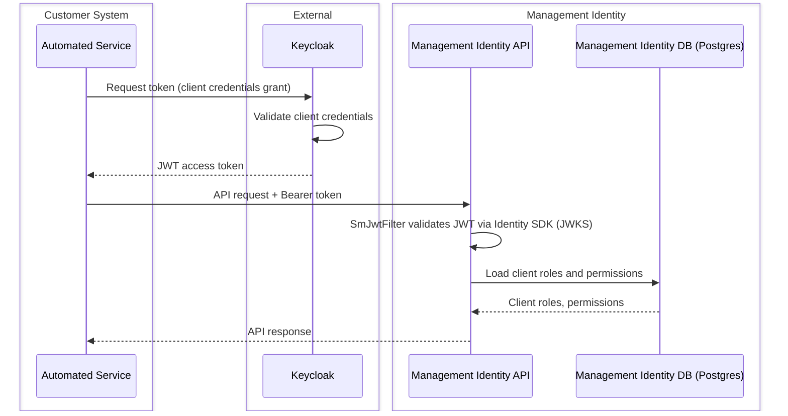

### 6.4 Machine-to-machine access via external OIDC provider (client credentials)

Scenario: an automated service calls the Management Identity API using a token issued directly by an external OIDC provider (no Keycloak involved).

1. The service requests a JWT access token directly from the external OIDC provider using the OAuth2 client credentials grant.
2. The external OIDC provider validates the client credentials and issues an access token.
3. The service sends the token as a `Bearer` header on each Management Identity API request.
4. `SmJwtFilter` validates the token signature via the Identity SDK (external OIDC JWKS endpoint) and sets a `JwtAuthenticationToken` on the `SecurityContext`.
5. Management Identity API evaluates `MappingRule` entities to resolve the client's roles from the database and processes the authorized request.

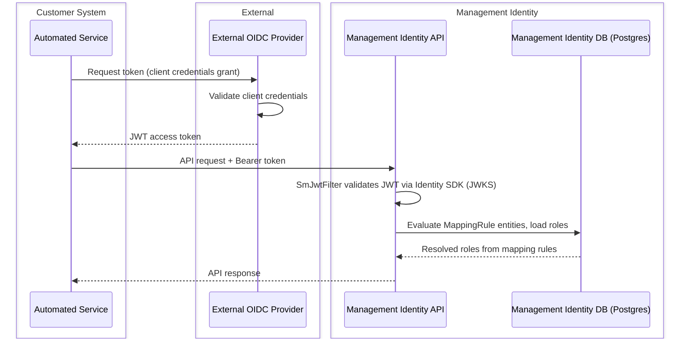

### 6.5 Admin operations: managing users and roles (Keycloak profile)

Scenario: a platform administrator uses the Management Identity UI to create a new user and assign a role to that user (keycloak profile only).

1. Administrator logs into the Management Identity UI via the standard OIDC login flow (see 6.1). The `AuthController` handles the OIDC callback and issues session cookies via `CookieService`.
2. Administrator navigates to Users and creates a new user.
3. Management Identity UI sends a `POST /api/users` request to the Management Identity API.
4. `UserController` delegates to `KeycloakUserServiceImpl`, which creates the user in the Keycloak realm via the Keycloak Admin Client.
5. Administrator assigns a role to the user.
6. Management Identity UI sends a `POST /api/users/{id}/roles` request.
7. `UserController` delegates to `KeycloakUserServiceImpl`, which assigns the Keycloak realm role to the user.

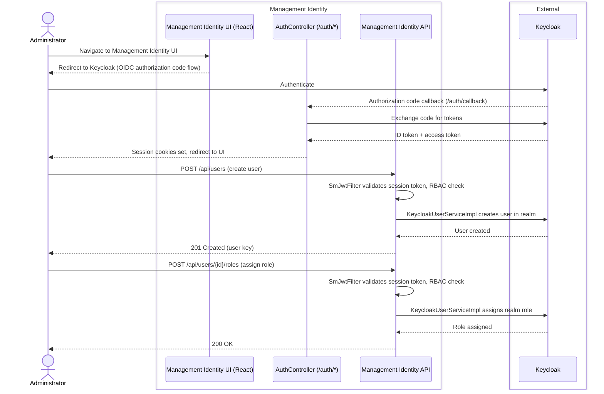

## 7. Deployment view

Management Identity is a standalone service deployed alongside (but separate from) the Orchestration Cluster in Self-Managed Camunda 8 installations.

### 7.1 Default Self-Managed deployment

In the default configuration, Management Identity is deployed with a bundled Keycloak and a PostgreSQL database. All platform apps (Console, Web Modeler, Optimize) are configured to use this Keycloak instance for OIDC login.

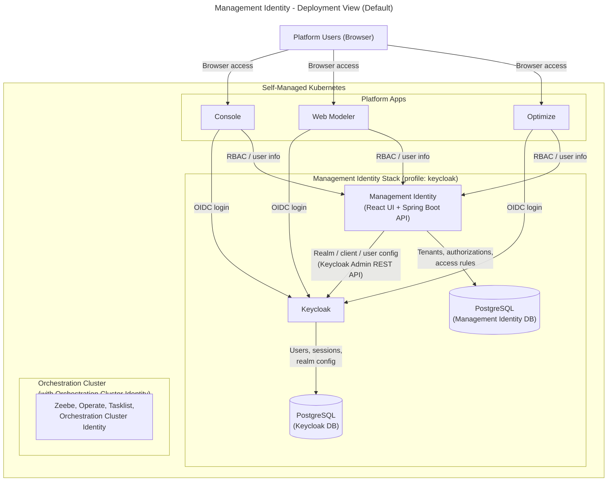

Key points:

- Management Identity (Spring Boot API + React UI) and Keycloak are deployed as separate pods/containers; they communicate via the Keycloak Admin REST API.
- The Orchestration Cluster (Zeebe, Operate, Tasklist, Orchestration Cluster Identity) is an independent stack that does not depend on Management Identity at runtime.
- The Management Identity DB stores tenants, authorizations, and access rules. User, group, role, and client data in the keycloak profile is stored in Keycloak's own database.

### 7.2 External Keycloak or OIDC provider

Management Identity supports two alternative IdP configurations for enterprise environments:

- External Keycloak (still profile `keycloak`): an existing Keycloak instance is connected instead of the bundled one. Management Identity configures realms and clients in the external Keycloak via the Keycloak Admin REST API.
- Direct OIDC mode (profile `oidc`): Management Identity is connected directly to a generic OIDC provider (for example Okta or Microsoft Entra ID) without Keycloak acting as an intermediary. Users and clients are managed only in the Management Identity DB; role resolution relies on mapping rules.

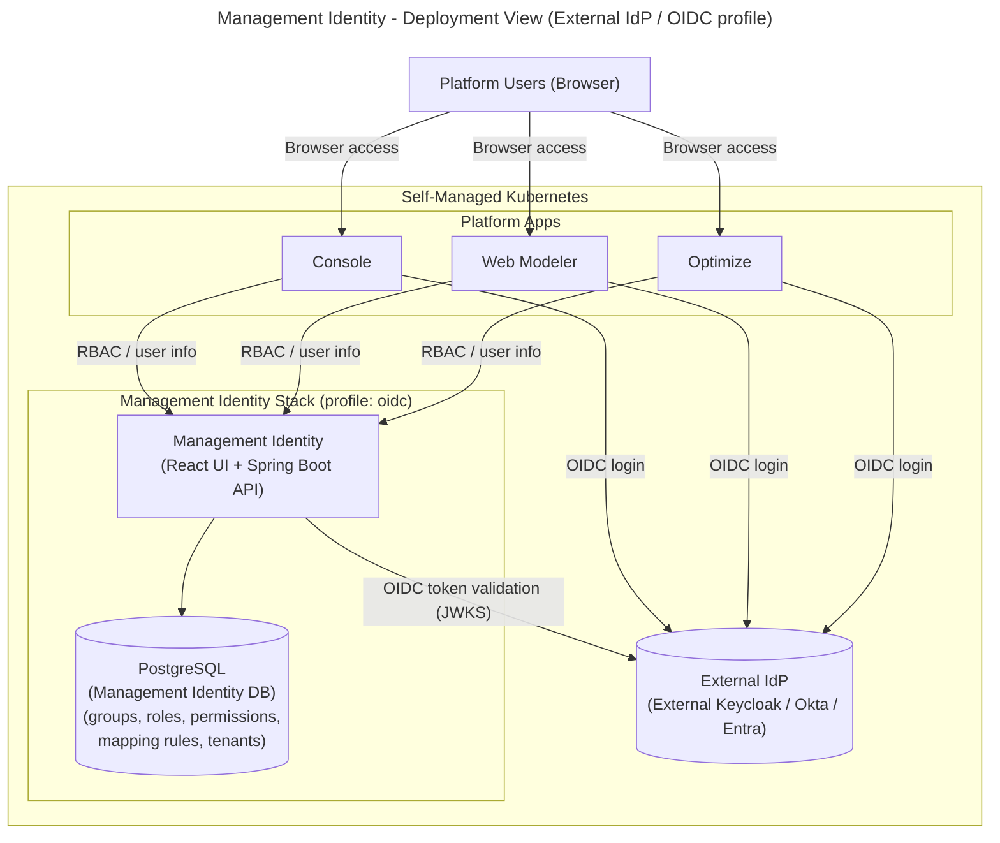

## 8. Crosscutting concepts

This section only highlights differences or specifics for Management Identity. For shared concepts (RBAC model, mapping rules, tenants, authorization checks), see the [Orchestration Cluster Identity architecture doc](identity_architecture_docs.md).

- Authentication
  - OIDC via Keycloak or external IdP.
  - Authorization code flow for human users; `AuthController` handles the OIDC callback and `CookieService` manages session cookies for browser-based UI access.
  - Client credentials for platform services and external tools.
  - Token validation in active profiles is performed by `SmJwtFilter` (a `JwtFilter` subclass) using the Identity SDK.

- Authorization
  - RBAC model with roles, permissions, users, and groups controlling:
    - Console features and views.
    - Web Modeler access and collaboration features.
    - Optimize data access and actions.
  - Method-level authorization is enforced by `@PreAuthorize` annotations on controller methods (configured via `GlobalMethodSecurityConfig` and `CustomMethodSecurityExpressionHandler`).
  - Runtime resource authorizations for process instances, tasks, etc. are handled by Orchestration Cluster Identity and its RBAC engine, not by Management Identity.

- Spring profile-based feature toggling
  Active profiles (`keycloak`, `oidc`) select which service implementations, controllers, and repositories are active. This avoids runtime conditionals in business logic and allows each supported deployment mode to be tested in isolation.

- Tenants
  - Management Identity tenants apply to Optimize only (for data isolation in reporting and analytics); they are stored in `TenantRepository` and gated by the `multi-tenancy` feature flag.
  - Runtime tenants for process execution live in Orchestration Cluster Identity.

- Mapping rules
  - In the `oidc` profile, `MappingRule` entities (stored in `MappingRuleRepository`) map IdP token claims (for example group names, attributes) to roles and Optimize tenants.
  - `OidcMappingRuleServiceImpl` (single-tenant) and `MultiTenantOidcMappingRuleServiceImpl` (multi-tenant) evaluate these rules on token validation.
  - The same general pattern is used for Orchestration Cluster Identity; see the [Orchestration Cluster Identity architecture doc](identity_architecture_docs.md) for details.

- Data storage
  - Management Identity uses its own PostgreSQL database. Unlike Orchestration Cluster Identity, it does not reuse Zeebe's primary or secondary storage.
  - In the `keycloak` profile, users, groups, roles, and clients are stored in Keycloak's database; only tenants and authorizations live in the Management Identity DB.
  - In the `oidc` profile, all identity data (groups, roles, permissions, mapping rules, tenants) is stored in the Management Identity DB.
  - Keycloak uses a separate PostgreSQL database for users, sessions, and realm configuration.

- Startup initialization
  - `ApplicationInitializer` validates that exactly one authentication backend profile is active on startup.
  - Profile-specific initializers configure the IdP realm, clients, roles, groups, permissions, and mapping rules in the correct backend on first boot.
  - `EnvironmentInitializer` seeds tenant data from common configuration when multi-tenancy is enabled.

## 9. Architectural decisions

The following decisions are specific to Management Identity. For decisions about Orchestration Cluster Identity (for example the decision to embed identity in the cluster rather than use Management Identity for runtime, or the resource-based authorization model), see the ADRs referenced in the [Orchestration Cluster Identity architecture doc](identity_architecture_docs.md#9-architectural-decisions).

- Keycloak as the default IdP
  Management Identity ships Keycloak as the default bundled IdP for Self-Managed deployments. This provides an out-of-the-box OIDC-capable IdP with a well-known admin API that Management Identity can configure programmatically. External Keycloak and direct OIDC modes are also supported for enterprise environments.

- Separate service (not cluster-embedded)
  Management Identity is deployed as an independent service rather than being embedded in the Orchestration Cluster. This keeps platform-level IAM (Console, Web Modeler, Optimize) decoupled from cluster runtime availability. The trade-off is that two identity services must be operated in Self-Managed deployments during the transition period.

- Spring profiles for deployment-mode selection
  Instead of runtime conditional logic, Management Identity uses Spring profiles (`keycloak`, `oidc`) to activate the correct service implementations, controllers, and repositories for each supported deployment mode. This isolates IdP-specific logic and allows each mode to be tested independently.

- Service-interface / implementation split
  Service contracts are defined as service interfaces, with profile-specific implementations. This allows the same controllers to operate in all modes without knowing which IdP is backing them.

- Clients as the OAuth2 abstraction
  The internal domain model uses the term “client” (aligned with OAuth2 terminology) for OAuth2 client registrations. The REST API is exposed under `/api/clients` and implemented by `ClientController` (keycloak profile only), with `KeycloakClientServiceImpl` managing client registration in Keycloak.

- PostgreSQL as a persistence layer
  Unlike Orchestration Cluster Identity, which reuses Zeebe's storage, Management Identity uses its own PostgreSQL database. This is consistent with its role as a standalone platform service.

- Alignment with Orchestration Cluster Identity model
  Identity concepts (users, groups, roles, tenants, mapping rules) is kept aligned with those in Orchestration Cluster Identity to reduce cognitive load and simplify tooling and documentation.

## 10. Quality goals

- Clear separation of concerns
  Platform-level identity (Management Identity) and runtime identity (Orchestration Cluster Identity) are separated to avoid cross-dependencies that affect availability.

- Integrability
  Straightforward integration with customer IdPs via Keycloak and OIDC, including support for common enterprise setups.

- Operability
  Management Identity should be observable and manageable (logging, metrics) as part of the broader Self-Managed deployment.

- Consistency with Orchestration Cluster Identity
  Where possible, concepts and naming are kept aligned with Orchestration Cluster Identity to reduce cognitive load and simplify documentation and tooling.

## 11. Risks and technical debt

- Dual identity model during transition
  Management Identity (for Console, Web Modeler, Optimize) and Orchestration Cluster Identity (for the runtime cluster) coexist during the transition period. This creates a risk of confusion about the source of truth for identity data and duplicated configuration. Users and groups may need to be managed in two places until consolidation is complete.
  Mitigation: clear documentation of the responsibility boundary; migration tooling; alignment of concepts and naming across both models.

- Keycloak operational complexity
  Running Keycloak as a dependency adds operational overhead: version management, database maintenance, configuration management, and availability dependencies. Misconfigured realms or client registrations can break login for all platform apps.
  Mitigation: Helm chart automation for standard setups; detailed documentation for external Keycloak and direct OIDC configurations.

- External IdP dependency
  For OIDC, availability and correctness of the external IdP (Keycloak or third-party) are critical. Misconfigured claims or mapping rules can lead to over- or under-provisioned access.
  Mitigation: mapping rule validation; comprehensive integration tests for common IdP configurations.

- Migration complexity
  Migrating identity data from Management Identity to Orchestration Cluster Identity (users, groups, roles, tenants, mapping rules) requires careful coordination to avoid access disruptions.
  Mitigation: dedicated migration endpoints and tooling, idempotent migration runs, detailed migration logs, and pre-migration validation.

## 12. Glossary

| Term                      | Definition |
|---------------------------|-----------|
| Management Identity       | Standalone identity service (Self-Managed) for platform-level apps: Console, Web Modeler, and Optimize. |
| Orchestration Cluster Identity | Cluster-embedded identity service for runtime IAM (Zeebe, Operate, Tasklist, Orchestration Cluster APIs). See [identity_architecture_docs.md](identity_architecture_docs.md). |
| Keycloak                  | Open-source IdP bundled with Management Identity by default (Spring profile `keycloak`); also supports external Keycloak or direct OIDC providers. |
| Spring profile            | Mechanism used to select deployment mode. Active profiles are `keycloak` (default) and `oidc` (external OIDC). |
| Platform app              | Applications managed by Management Identity: Console, Web Modeler, Optimize. |
| User                      | Human principal managed in Keycloak (keycloak profile) or referenced by ID from an external IdP (oidc profile). |
| Group                     | Named collection of users; stored in Keycloak (keycloak profile) or in `GroupRepository` (oidc profile). |
| Role                      | Set of permissions controlling what operations a user or service can perform in platform apps; stored in Keycloak (keycloak profile) or in `RoleRepository` (oidc profile). |
| Client                    | OAuth2 client registered in Management Identity representing a platform or external app (for example Optimize backend, Web Modeler backend). |
| Tenant (Optimize)         | Logical partition for reporting and data isolation in Optimize. Stored in `TenantRepository`. Distinct from runtime tenants in Orchestration Cluster Identity. |
| Mapping rule              | Entity mapping IdP token claims (for example group names, attributes) to Management Identity roles or Optimize tenants; evaluated by mapping rule services in the `oidc` profile. |
| OIDC                      | OpenID Connect; the protocol used for authentication and token issuance between platform apps, IdP, and Management Identity. |
| Client credentials grant  | OAuth2 flow for machine-to-machine access; a service authenticates with its client ID and secret to obtain a token. |
| Authorization code flow   | OAuth2/OIDC flow for interactive user login via a browser redirect to the IdP. |
| JWKS                      | JSON Web Key Set; the public key endpoint exposed by Keycloak/IdP, used by JWT filters to validate incoming JWT signatures. |
| WebSecurityConfig         | Spring configuration class that defines the security filter chain for the Management Identity API. |
| SmJwtFilter               | Self-Managed JWT filter; validates tokens and handles session cookie refresh for browser flows. |
| JwtAuthenticationToken    | Spring Security Authentication object set on the `SecurityContext` after JWT validation. |
