# Management Identity architecture documentation

## 1. Introduction and goals

This documentation is based on [arc42](https://arc42.org/overview) which is a common architecture documentation template for software systems. It is structured into several sections that cover different aspects of the system's architecture, including constraints, system context, solution strategy, building blocks, and runtime view.

### 1.1 Overview

The Management Identity component in Camunda 8 Self-Managed is used to manage authentication, access, and authorization for components outside the Orchestration Cluster.

- Console
- Web Modeler
- Optimize

It is responsible for:

- User and machine authentication via OIDC or the bundled Keycloak.
- Role‑based access control (RBAC) for Console, Web Modeler, and Optimize.
- Managing users, groups, roles, permissions, tenants (Optimize), and mapping rules.

By design, Management Identity does not control access to the Orchestration Cluster. That is handled by Orchestration Cluster Identity, described in the Orchestration Cluster Identity architecture documentation:

- [Orchestration Cluster Identity architecture](identity_architecture_docs.md)

Where concepts (users, groups, roles, mapping rules, tenants, RBAC) overlap between Management Identity and Orchestration Cluster Identity, the Orchestration Cluster Identity document is the primary reference. This document describes only the specifics of Management Identity.

User Guide can be found her: [User Guide](https://docs.camunda.io/docs/self-managed/components/management-identity/overview/)

### Goals

1. Provide a dedicated identity and access control layer for Web Modeler, Console, and Optimize in Self‑Managed deployments.
2. Integrate with enterprise IdPs via OIDC, including using Keycloak either as primary IdP or as a broker to external IdPs.
3. Offer a clear, UI‑driven experience to manage users, groups, roles, applications (clients), and tenants for Optimize.
4. Keep platform‑level identity concerns separate from runtime (cluster) identity.

## 2. Constraints

- Separate component
  Management Identity runs as its own service (and supporting services such as Keycloak and Postgres) alongside the Orchestration Cluster in Self‑Managed setups.

- Default IdP stack
  Management Identity is, by default, wired to a packaged Keycloak and its database but supports:
  - Using an external existing OIDC provider.
  - Using an external database.

- Protocols
  Authentication flows are based on OAuth 2.0 and OIDC (authorization code flow for interactive users, client credentials for machine‑to‑machine).

- Responsibility split
  Management Identity must not be a dependency for Orchestration Cluster runtime access. Orchestration Cluster Identity is the source of truth for runtime IAM; Management Identity handles only platform apps.

- Data ownership
  Management Identity is the source of truth for:
  - Platform users, groups, roles, and applications for Web Modeler, Console, and Optimize.
  - Platform‑level tenants and mapping rules relevant to Optimize.
    Runtime tenants and authorizations must not be managed in Management Identity after migration to Orchestration Cluster Identity.

## 3. System context and scope

### 3.1 Business context

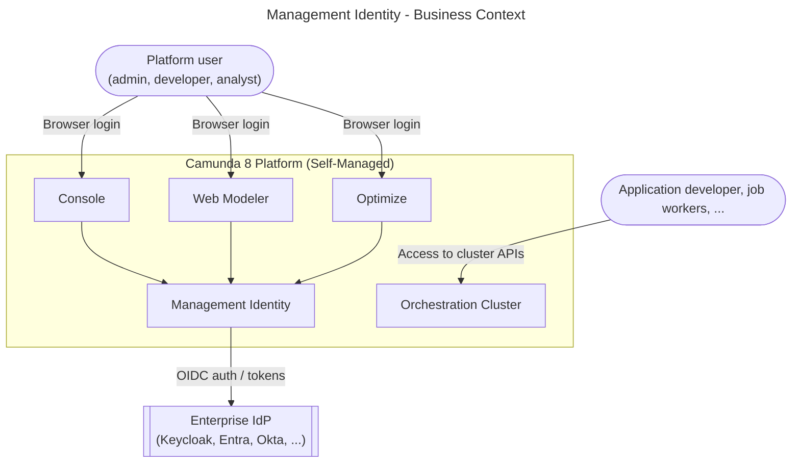

Main actors:

- Platform user: administrators, modelers, and analysts using Console, Web Modeler, and Optimize.
- Application developer: developers building job workers or integrations against Orchestration Clusters.
- Management Identity: manages platform‑level authentication and RBAC for Console, Web Modeler, and Optimize.
- Orchestration Cluster: runtime cluster with its own embedded identity service for process execution and task access control.
- Enterprise IdP: central source of user identities and group claims (via Keycloak or other OIDC providers).
- Database: stores identity data.
- Keycloak DB: stores Keycloak realm configuration.

### 3.2 Technical context

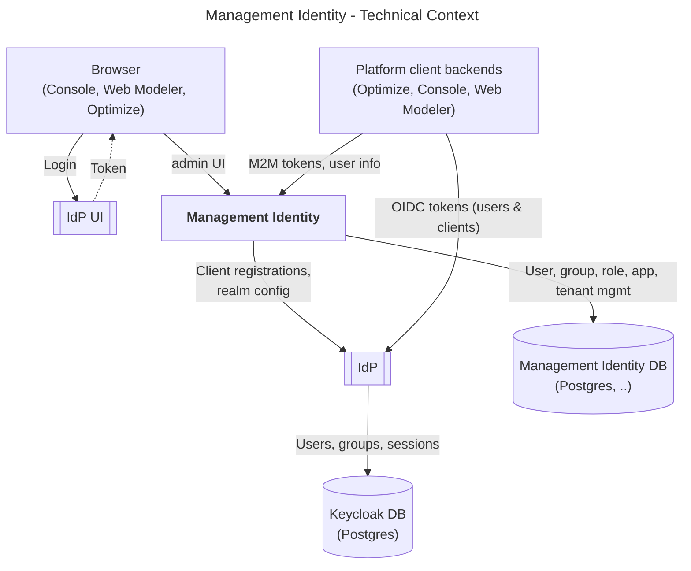

Key points:

- Console, Web Modeler, and Optimize UIs use OIDC login against the IdP (Keycloak or external), with Management Identity owning the configuration for:
  - Clients
  - Scopes
  - Redirect URIs
- Management Identity allows administrators to manage users, groups, roles, applications (clients), Optimize tenants, and mapping rules.
- Platform client backends (Console, Web Modeler, Optimize) use client credentials and/or user tokens issued by the IdP, and consult Management Identity’s RBAC model when enforcing access.

## 4. Solution strategy

- Separate management plane for platform apps
  Management Identity provides an independent authentication/authorization surface for Console, Web Modeler, and Optimize, without coupling cluster runtime IAM to platform app availability.

- OIDC‑based SSO via Keycloak or external IdPs
  Keycloak is provided as a default IdP and broker, with support for external enterprise IdPs via OIDC. Interactive users authenticate via authorization code flow; applications use client credentials.

- RBAC for platform resources
  A role‑based access model is used to protect:
  - Console features (cluster registration, license, user management, etc.).
  - Web Modeler workspaces, projects, and collaboration features.
  - Optimize dashboards, reports, and data access.

- Mapping rules and tenants for Optimize
  Mapping rules connect IdP claims (for example groups, attributes) to roles and tenants in Management Identity. Optimize uses these tenants to segment data and access for different business units or customers.

- Alignment with Orchestration Cluster Identity model
  Where consistent and possible, Management Identity uses naming and concepts aligned with Orchestration Cluster Identity (users, groups, roles, tenants, mapping rules, authorizations). Details of the shared model and runtime behavior are defined in the Orchestration Cluster Identity architecture doc.

## 5. Building block view

### 5.1 Whitebox overall system

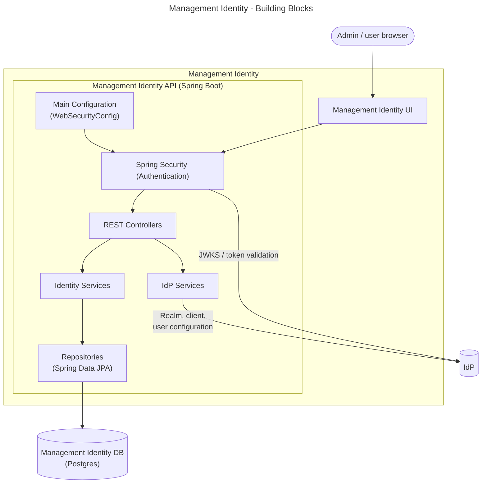

Main building blocks:

- **Management Identity UI**
  Web-based console for administrators to manage users, groups, roles, applications, and tenants, and define mapping rules.

- **Main Configuration (`WebSecurityConfig`)**
  Spring `@Configuration` class that defines the security setup for the Management Identity API. It configures the filter chain, enables OIDC/JWT handling, and wires authentication/authorization behavior used by the Security layer.

- **Security**
  Spring Security filter chain responsible for authenticating incoming requests (OIDC token validation via Keycloak JWKS) and enforcing RBAC before delegating to controllers.

- **REST Controllers**
  One controller per resource type (users, groups, roles, applications, tenants, mapping rules). Each controller validates inputs and delegates to the corresponding service.

- **Identity Services**
  Business logic layer; one service per resource type. Persists and retrieves data via repositories. Services for users and applications additionally synchronize with Keycloak via the Keycloak Admin Service.

- **Repositories**
  Spring Data JPA repositories providing CRUD access to the Management Identity PostgreSQL database; one repository per entity type.

- **IdP Service**
  A service that wraps interactions with the IdP (Keycloak or external OIDC provider). Responsible for configuring realms, clients, and users in Keycloak based on Management Identity data, and for validating tokens via JWKS.

- **IdP**
  Keycloak instance (default) or external OIDC provider.

### 5.2 Building Blocks

#### 5.2.1 REST Controllers — Level 2

Management Identity exposes a REST API consumed by the Management Identity UI and by platform apps. Each resource type is handled by a dedicated controller that maps HTTP verbs to service calls.

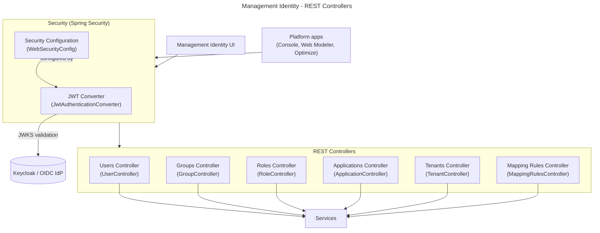

Key responsibilities:

- Security Configuration (`WebSecurityConfig`): Spring `@Configuration` class that sets up the Spring Security filter chain. Activates JWT/OIDC token validation and registers the `JwtAuthenticationConverter` bean. Controls which endpoints require authentication.
- JWT Converter (`JwtAuthenticationConverter`): converts a validated JWT into a `CamundaAuthentication` (or equivalent identity principal) by extracting roles, groups, and permissions from token claims.
- Users Controller (`UserController`): handles CRUD operations for platform users (`GET/POST/PUT/DELETE /api/users`). Delegates user creation and updates to `UserService`, which also synchronizes with Keycloak.
- Groups Controller (`GroupController`): handles CRUD and member-assignment operations for groups (`/api/groups`). Delegates to `GroupService`.
- Roles Controller (`RoleController`): handles CRUD operations for roles and permission assignments (`/api/roles`). Delegates to `RoleService`.
- Applications Controller (`ApplicationController`): handles CRUD for OAuth2 client registrations (`/api/applications`). Delegates to `ApplicationService`, which registers clients in Keycloak.
- Tenants Controller (`TenantController`): handles CRUD for Optimize-scoped tenants (`/api/tenants`). Delegates to `TenantService`.
- Mapping Rules Controller (`MappingRulesController`): handles CRUD for IdP-claim-to-role/tenant mapping rules (`/api/mapping-rules`). Delegates to `MappingRuleService`.

#### 5.2.2 Services and Repositories — Level 2

Each service implements business logic for one resource type, persists data via a Spring Data JPA repository, and (where required) calls the Keycloak Admin Service to synchronize data with Keycloak.

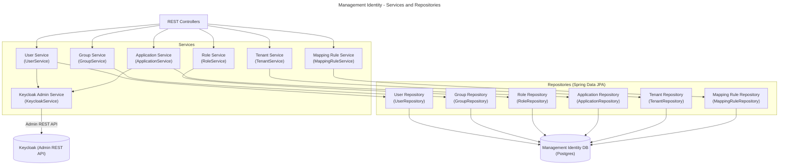

Key responsibilities:

- User Service (`UserService`): manages user lifecycle (create, update, delete, search). On user creation and update it delegates to `KeycloakService` to create or update the corresponding user in the Keycloak realm. Reads and writes user entities via `UserRepository`.
- Group Service (`GroupService`): manages group lifecycle and group–member assignments. Persists via `GroupRepository`.
- Role Service (`RoleService`): manages role definitions and permission assignments per platform app. Persists via `RoleRepository`.
- Application Service (`ApplicationService`): manages OAuth2 client registrations (name, type, scopes, redirect URIs). On creation and update it delegates to `KeycloakService` to register or update the client in the Keycloak realm. Persists via `ApplicationRepository`.
- Tenant Service (`TenantService`): manages Optimize-scoped tenants. Persists via `TenantRepository`.
- Mapping Rule Service (`MappingRuleService`): manages declarative claim-to-role/tenant mapping rules. Persists via `MappingRuleRepository`.
- Keycloak Admin Service (`KeycloakService`): wraps the Keycloak Admin REST API. Called by `UserService` and `ApplicationService` to synchronize identity data (users, clients, scopes, realm configuration) with Keycloak.
- Repositories (`UserRepository`, `GroupRepository`, `RoleRepository`, `ApplicationRepository`, `TenantRepository`, `MappingRuleRepository`): Spring Data JPA repositories; each provides standard CRUD operations plus domain-specific query methods backed by the Management Identity PostgreSQL database.

## 6. Runtime view

### 6.1 User login via Keycloak (default)

Scenario: a platform user logs into Console, Web Modeler, or Optimize using the default bundled Keycloak as the IdP.

1. Browser navigates to Console, Web Modeler, or Optimize.
2. The application redirects the browser to Keycloak for login (OIDC authorization code flow).
3. The user authenticates with Keycloak (username/password, or an existing Keycloak SSO session).
4. Keycloak issues an ID token and access token and redirects back to the application.
5. The application exchanges the authorization code for tokens and requests user info.
6. The application calls Management Identity API to resolve the user's roles, groups, and tenants by matching token claims against stored assignments and mapping rules.
7. A session is established and the application renders the requested view.

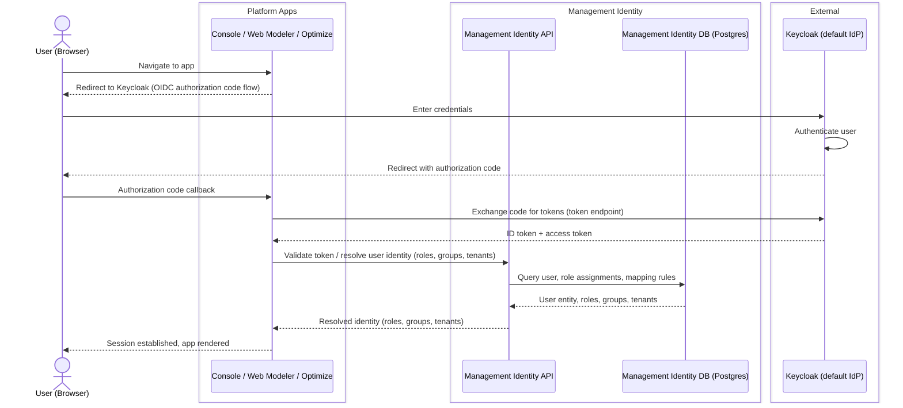

### 6.2 User login via external OIDC IdP (Keycloak as broker)

Scenario: the enterprise uses an external IdP (for example Okta or Microsoft Entra ID). Keycloak is configured as an OIDC broker and forwards authentication to the external IdP.

1. Browser navigates to Console, Web Modeler, or Optimize.
2. The application redirects to Keycloak; Keycloak in turn redirects to the external IdP.
3. The external IdP authenticates the user and redirects back to Keycloak with an authorization code.
4. Keycloak exchanges the code for external tokens, maps the external claims to local users/groups using Keycloak identity-provider mappers, and issues its own tokens.
5. The application receives Keycloak tokens and proceeds as in the default login flow (6.1).
6. Management Identity API evaluates mapping rules to assign platform roles and tenants based on the claims in the Keycloak token.

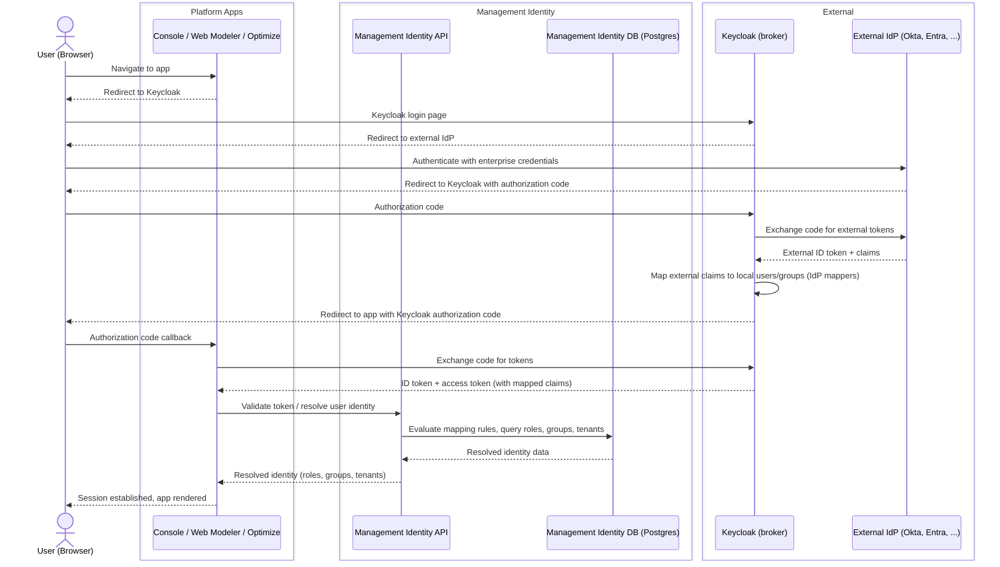

### 6.3 Machine-to-machine access (client credentials)

Scenario: an automated service (for example a CI/CD pipeline or backend integration) calls the Management Identity API using client credentials to obtain a token and perform identity operations.

1. The service requests a JWT access token from Keycloak using the OAuth2 client credentials grant.
2. Keycloak validates the client credentials and issues an access token.
3. The service sends the token as a `Bearer` header on each Management Identity API request.
4. Management Identity API validates the token signature via Keycloak's JWKS endpoint.
5. Management Identity API resolves the client's roles and permissions from the database and processes the authorized request.

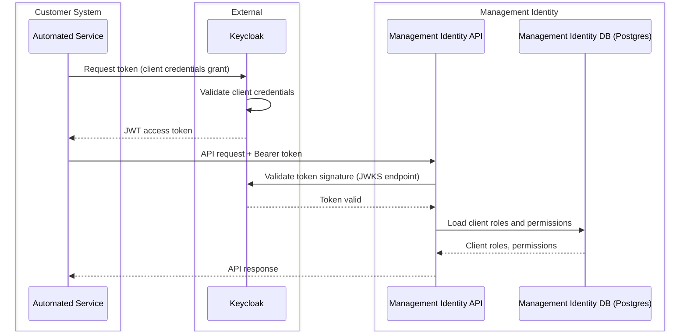

### 6.4 Admin operations: managing users and roles

Scenario: a platform administrator uses the Management Identity UI to create a new user and assign a role to that user.

1. Administrator logs into the Management Identity UI via the standard OIDC login flow (see 6.1).
2. Administrator navigates to Users and creates a new user.
3. Management Identity UI sends a `POST /api/users` request to the Management Identity API.
4. The API validates the request, stores the new user in the Management Identity DB, and synchronizes the user to the Keycloak realm via the Keycloak Connector.
5. Administrator assigns a role to the user.
6. Management Identity UI sends the assignment request to the Management Identity API.
7. The API updates the role assignment in the Management Identity DB.

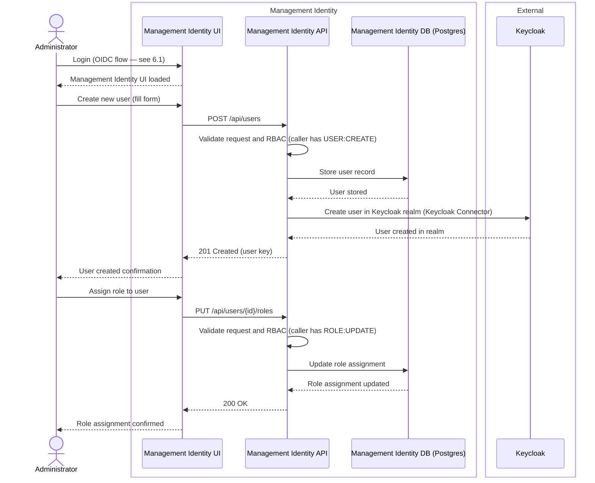

## 7. Deployment view

Management Identity is a standalone service deployed alongside (but separate from) the Orchestration Cluster in Self‑Managed Camunda 8 installations.

### 7.1 Default Self-Managed deployment

In the default configuration, Management Identity is deployed with a bundled Keycloak and a PostgreSQL database. All platform apps (Console, Web Modeler, Optimize) are configured to use this Keycloak instance for OIDC login.

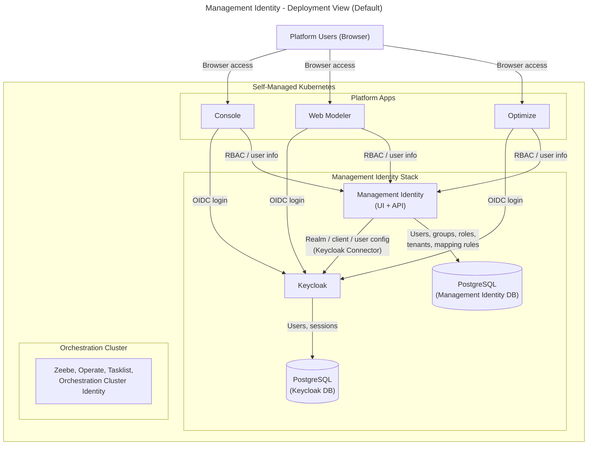

Key points:

- Management Identity and Keycloak are deployed as separate pods/containers; they communicate via the Keycloak Admin REST API.
- The Orchestration Cluster (Zeebe, Operate, Tasklist, Orchestration Cluster Identity) is an independent stack that does not depend on Management Identity at runtime.
- Each stack uses its own PostgreSQL instance (or separate databases in a shared instance).

### 7.2 External Keycloak or OIDC provider

Management Identity supports two alternative IdP configurations for enterprise environments:

- **External Keycloak**: an existing Keycloak instance is connected instead of the bundled one. Management Identity configures realms and clients in the external Keycloak via the Keycloak Connector.
- **Direct OIDC mode**: Management Identity is connected directly to a generic OIDC provider (for example Okta or Microsoft Entra ID) without Keycloak acting as an intermediary.

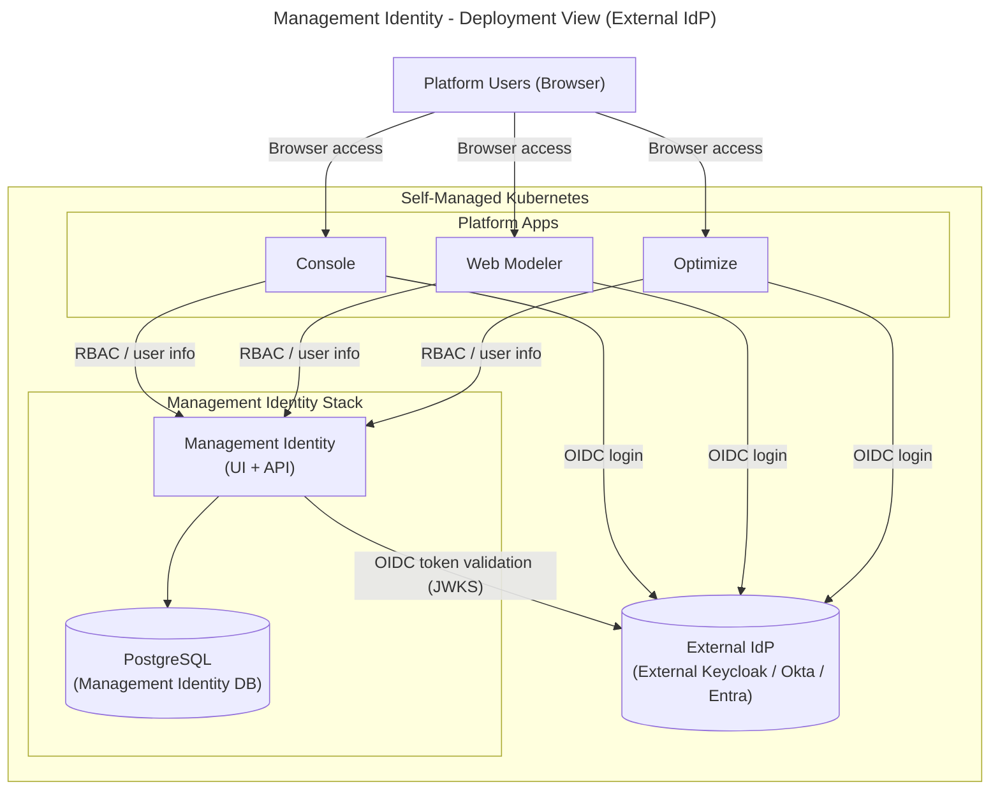

## 8. Crosscutting concepts

This section only highlights differences or specifics for Management Identity. For shared concepts (RBAC model, mapping rules, tenants, authorization checks), see the Orchestration Cluster Identity architecture doc.

- Authentication
  - OIDC via Keycloak or external IdP.
  - Authorization code flow for human users.
  - Client credentials for platform services and external tools.

- Authorization
  - RBAC model with roles, permissions, users, and groups controlling:
    - Console features and views.
    - Web Modeler access and collaboration features.
    - Optimize data access and actions.
  - Runtime resource authorizations for process instances, tasks, etc. are handled by Orchestration Cluster Identity and its RBAC engine, not by Management Identity.

- Tenants
  - Management Identity tenants apply to Optimize only (for data isolation in reporting and analytics).
  - Runtime tenants for process execution live in Orchestration Cluster Identity.

- Mapping rules
  - Rules in Management Identity map IdP claims (for example group names) to:
    - Roles (e.g. Console Admin, Optimize Analyst)
    - Optimize tenants
  - The same general pattern is used for Orchestration Cluster Identity; see the Orchestration Cluster Identity architecture doc for details.

- Data storage
  - Management Identity uses its own PostgreSQL database. Unlike Orchestration Cluster Identity, it does not reuse Zeebe's primary or secondary storage.
  - Keycloak uses a separate PostgreSQL database for users, sessions, and realm configuration.

## 9. Architectural decisions

The following decisions are specific to Management Identity. For decisions about Orchestration Cluster Identity (for example the decision to embed identity in the cluster rather than use Management Identity for runtime, or the resource-based authorization model), see the ADRs referenced in the [Orchestration Cluster Identity architecture doc](identity_architecture_docs.md#9-architectural-decisions).

- Keycloak as default IdP
  Management Identity ships Keycloak as the default bundled IdP for Self‑Managed deployments. This provides an out-of-the-box OIDC-capable IdP with a well-known admin API that Management Identity can configure programmatically. External Keycloak and direct OIDC modes are also supported for enterprise environments.

- Separate service (not cluster-embedded)
  Management Identity is deployed as an independent service rather than being embedded in the Orchestration Cluster. This keeps platform-level IAM (Console, Web Modeler, Optimize) decoupled from cluster runtime availability. The trade-off is that two identity services must be operated in Self‑Managed deployments during the transition period.

- PostgreSQL as persistence layer
  Unlike Orchestration Cluster Identity, which reuses Zeebe's storage, Management Identity uses its own PostgreSQL database. This is consistent with its role as a standalone platform service.

- Alignment with Orchestration Cluster Identity model
  Identity concepts (users, groups, roles, tenants, mapping rules) are kept aligned with those in Orchestration Cluster Identity to reduce cognitive load and simplify tooling and documentation. See [ADR-0001](adr/0001-cluster-embedded-identity.md) for background on the split between the two identity services.

## 10. Quality goals

- Clear separation of concerns
  Platform‑level identity (Management Identity) and runtime identity (Orchestration Cluster Identity) are separated to avoid cross‑dependencies that affect availability.

- Integratability
  Straightforward integration with customer IdPs via Keycloak and OIDC, including support for common enterprise setups.

- Operability
  Management Identity should be observable and manageable (logging, metrics) as part of the broader Self‑Managed deployment.

- Consistency with Orchestration Cluster Identity
  Where feasible, concepts and naming are kept aligned with Orchestration Cluster Identity to reduce cognitive load and simplify documentation and tooling.

## 11. Risks and technical debt

- Dual identity model during transition
  Management Identity (for Console, Web Modeler, Optimize) and Orchestration Cluster Identity (for the runtime cluster) coexist during the transition period. This creates a risk of confusion about the source of truth for identity data and duplicated configuration. Users and groups may need to be managed in two places until consolidation is complete.
  Mitigation: clear documentation of the responsibility boundary; Identity Migration App to assist migration; alignment of concepts and naming across both models.

- Keycloak operational complexity
  Running Keycloak as a dependency adds operational overhead: version management, database maintenance, configuration management, and availability dependencies. Misconfigured realms or client registrations can break login for all platform apps.
  Mitigation: Helm chart automation for standard setups; detailed documentation for external Keycloak and direct OIDC configurations.

- External IdP dependency
  For OIDC, availability and correctness of the external IdP (Keycloak or third-party) are critical. Misconfigured claims or mapping rules can lead to over- or under-provisioned access.
  Mitigation: mapping rule validation; comprehensive integration tests for common IdP configurations.

- Migration complexity
  Migrating identity data from Management Identity to Orchestration Cluster Identity (users, groups, roles, tenants, mapping rules) requires careful coordination to avoid access disruptions.
  Mitigation: dedicated Identity Migration App, idempotent migration runs, detailed migration logs, and pre-migration validation tooling.

## 12. Glossary

|              Term              |                                                                   Definition                                                                    |
|--------------------------------|-------------------------------------------------------------------------------------------------------------------------------------------------|
| Management Identity            | Standalone identity service (Self‑Managed) for platform-level apps: Console, Web Modeler, and Optimize.                                        |
| Orchestration Cluster Identity | Cluster‑embedded identity service for runtime IAM (Zeebe, Operate, Tasklist, Orchestration Cluster APIs).                                      |
| Keycloak                       | Open-source IdP bundled with Management Identity by default; also supports external Keycloak or direct OIDC providers.                          |
| Platform app                   | Applications managed by Management Identity: Console, Web Modeler, Optimize.                                                                    |
| User                           | Human principal registered in Management Identity for use with platform apps.                                                                   |
| Group                          | Named collection of users; groups can be assigned roles and used in mapping rules.                                                              |
| Role                           | Set of permissions controlling what operations a user or service can perform in platform apps.                                                  |
| Application (client)           | OAuth2 client registered in Management Identity representing a platform or external app (for example Optimize backend, Web Modeler backend).    |
| Tenant (Optimize)              | Logical partition for reporting and data isolation in Optimize. Distinct from runtime tenants in Orchestration Cluster Identity.                |
| Mapping rule                   | Rule that maps IdP token claims (for example group names, attributes) to Management Identity roles, groups, or Optimize tenants.                |
| OIDC                           | OpenID Connect; the protocol used for authentication and token issuance between platform apps, Keycloak, and Management Identity.               |
| Client credentials grant       | OAuth2 flow for machine-to-machine access; a service authenticates with its client ID and secret to obtain a token.                            |
| Authorization code flow        | OAuth2/OIDC flow for interactive user login via a browser redirect to the IdP.                                                                  |
| JWKS                           | JSON Web Key Set; the public key endpoint exposed by Keycloak/IdP, used by Management Identity API to validate incoming JWT signatures.         |
| Keycloak Connector             | Management Identity internal component that manages Keycloak realm, client, and user configuration via the Keycloak Admin REST API.             |
