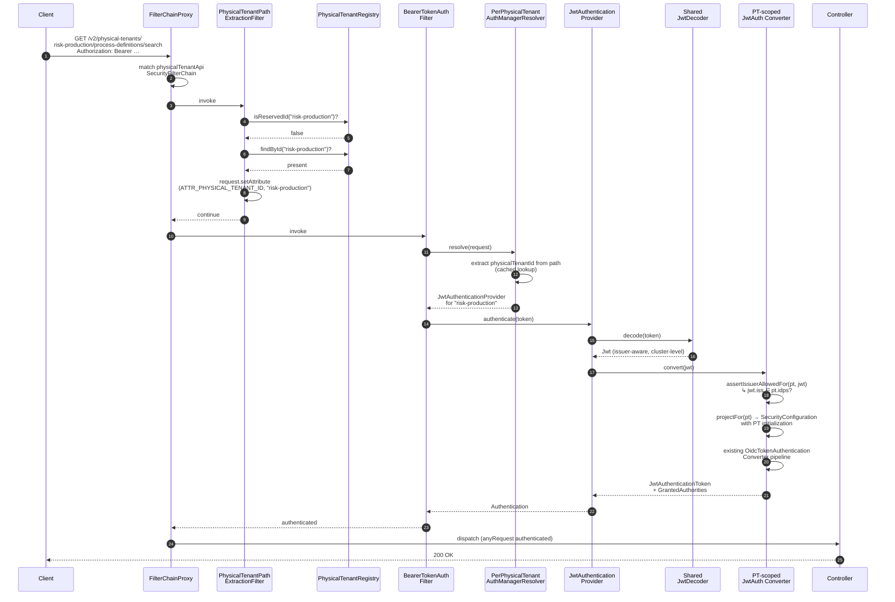
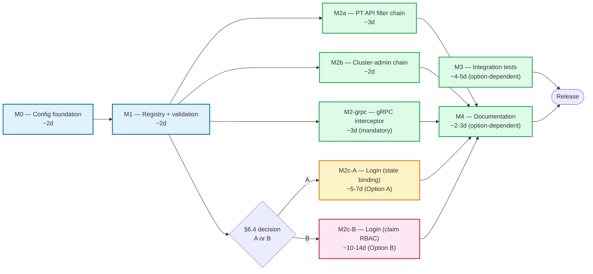
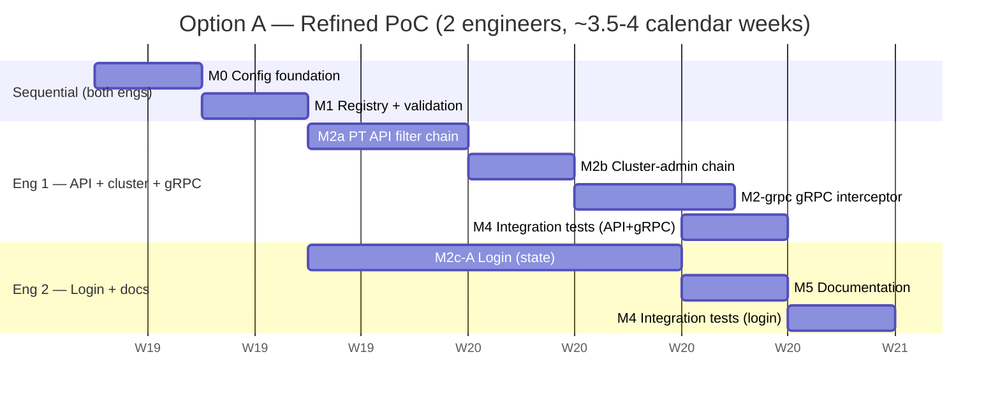
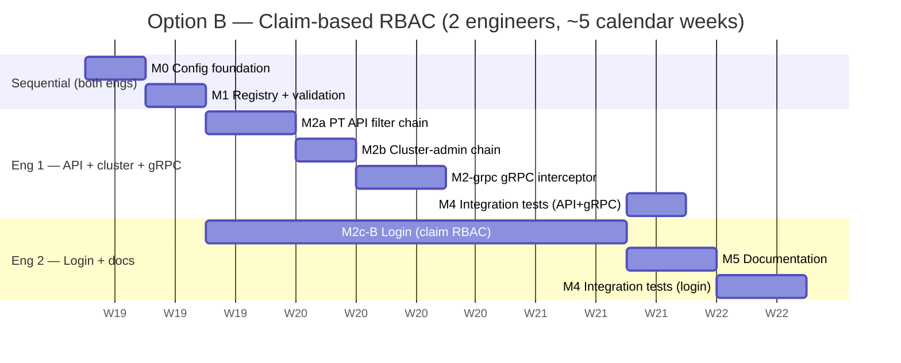

# Physical Tenants — Identity Support: Implementation Plan

> **Status:** Draft for team review
> **Epic:** [camunda/product-hub#3430 — Strong Tenant Isolation in Camunda 8 OC (Self-Managed)](https://github.com/camunda/product-hub/issues/3430)
> **Slice:** Identity (per-Physical-Tenant authentication and authorization, listed in the epic body under *Scope – Milestone 1 → Security and observability*).
> **Target release:** 8.10
> **Scope of this document:** Spring Security wiring + minimal configuration plumbing required to enable per-Physical-Tenant authentication and authorization. Intentionally narrow — adjacent slices of the same epic (primary/secondary storage isolation, per-PT backup/restore, webapps PT routing, gRPC PT header parity, Connectors multi-PT, observability) are referenced where relevant but **not** delivered here.
>
> **Canonical naming** (per epic body): API/config uses `physicalTenantId` / `physical-tenants`. Hub UX surfaces this as **Environment**. The existing `tenantId` (logical tenant) is unchanged.

---

## 1. Context and Goal

### 1.1 Problem statement

Camunda 8.9 multi-tenancy is *logical*: all tenants share one engine, and a user's role in any one tenant applies to all of them. **Physical Tenants (PT)** introduce a new boundary where each tenant is a distinct team / business unit / environment with its own authorization model and IdP routing.

This document covers **only the identity (authN/authZ) sub-slice** of that effort:
- Recognise a new REST path shape `/v2/physical-tenants/{physicalTenantId}/...` and apply per-tenant authN/authZ to it.
- Recognise `/v2/cluster/...` and apply claim-based cluster-admin authZ.

### 1.2 Design tenets

- **Reuse first.** Every PT shares the same `InitializationConfiguration` shape that already exists in `security/security-core`. No parallel domain model.
- **Minimise surface area.** No new modules, no new top-level `@ConfigurationProperties` registrations, no rewrites of existing converters or filters. Add seams, do not refactor.
- **Forward compatible.** Plumbing must not block the Strong Isolation epic from later swapping in per-PT `BrokerClient` / `TopologyServices` instances.
- **Backwards compatible.** A vanilla 8.9 configuration starts cleanly on 8.10 with no behaviour change.

### 1.3 What this slice does **not** deliver

- Persisted cluster-admin grant store, audit, dynamic PT/IdP management APIs, Hub policy distribution.
- Bulk migration tooling from existing 8.9 logical-tenant authorizations.
- **Per-PT BASIC auth.** BASIC is cluster-level only (cluster-admin break-glass on `/v2/cluster/**`). PTs cannot declare a `users` block — startup validation rejects non-empty PT user lists.
- **Cross-PT authorization.** `ROLE_CLUSTER_ADMIN` grants access to cluster-scoped resources only (`/v2/cluster/**`); it does **not** grant access to PT-scoped resources. The topology aggregator's per-PT fan-out uses a strictly read-only marker authority that PT-side services recognise **only** for topology, not for any other operation. See §6.4 (no-cross-tenant rule).
- **Per-PT session cookie isolation** — sessions remain on the single `camunda-session` cookie. Per-PT cookie scoping (so two browser tabs can hold sessions for different PTs simultaneously) is a UX improvement deferred from this slice.

#### What this slice **does** deliver (mandatory)

- **REST AUTH surfaces:**
  - `/v2/physical-tenants/{physicalTenantId}/**` per-PT bearer-token filter chain.
  - `/v2/cluster/**` cluster-admin filter chain (matcher only — specific controllers like topology, backup, restore are owned by **their respective slices**, not this one). The cluster-admin chain authenticates and authorises any controller mounted under that prefix uniformly.
- **gRPC parity:** A new gRPC interceptor at the Zeebe gateway reads the request header `Camunda-Physical-Tenant` (gRPC metadata) and resolves the PT for the call. Reuses `PhysicalTenantRegistry` and the per-PT JWT converter — single source of truth for PT auth across REST and gRPC.
- **Browser login/logout:** tenant-aware OIDC login flow per the §6.4 decision (Option A or Option B). **Mandatory in 8.10** per the requirements clarification.
- **Cluster-level authentication:** OIDC claim-based + BASIC fallback for cluster-admin break-glass.

---

## 2. Architecture Overview


Two new chains are inserted **before** the legacy `/v2/**` chain so that:
- `/v2/process-definitions/search` → legacy chain → default PT (unchanged).
- `/v2/physical-tenants/foo/process-definitions/search` → PT chain → `foo` config.
- `/v2/cluster/topology` → cluster chain → claim-based admin.

---

## 3. Configuration Model

### 3.1 YAML shape

All PT configuration lives at the **top level** under `camunda.physical-tenants.*`. The map key **is** the `physicalTenantId` (deliberately distinct from the existing logical-tenant `tenantId` so the two cannot be confused). No separate `id` field. Each PT carries its own `security` sub-block under `camunda.physical-tenants.{id}.security` — and other slices (storage, backup, broker-client) will own their own sibling sub-blocks (`camunda.physical-tenants.{id}.secondary-storage`, `camunda.physical-tenants.{id}.backup`, etc.) without colliding with security. The placeholder javadoc in `search/search-client-connect/.../TenantConnectConfigResolver.java` referencing `camunda.physical-tenants` is consistent with this layout — the search slice's per-PT storage config sits alongside `security` under the same `{id}`.

This shape **resolves the cross-slice coordination open question** (previously §11.6): one top-level PT tree, multiple per-PT sub-blocks each owned by its respective slice. The set of PT ids is single-source-of-truth via `PhysicalTenantRegistry` regardless of which slices are configured.

```yaml
camunda:
  security:
    authentication:
      method: oidc
      oidc:
        client-id-claim: client_id
        username-claim: preferred_username
        groups-claim: groups
        providers:
          default:
            client-name: "Default IdP"
            issuer-uri: https://login.example.com/realms/main
            client-id: camunda-cluster-default
            client-secret: ${DEFAULT_CLIENT_SECRET}
            audiences: camunda-cluster-default
          provider-a:
            client-name: "Provider A"
            issuer-uri: https://idp.provider-a.com/realms/somerealm
            client-id: client-id-a
            client-secret: ${PROVIDER_A_CLIENT_SECRET}
            audiences: client-id-a

    # NEW: cluster-admin claim-based mapping (used by /v2/cluster/** chain)
    cluster-admin:
      providers: [default]                    # IdPs allowed to mint cluster-admin tokens
      claim: groups                           # claim path inside the JWT
      value: cluster-admin                    # required claim value
      # Optional break-glass via BASIC; users come from camunda.security.initialization.users

    # Cluster-level identities — IN-MEMORY ONLY (no secondary-storage seeding in PT mode).
    # Used solely for cluster-admin BASIC break-glass auth on /v2/cluster/**.
    # In legacy mode (no `camunda.physical-tenants` block configured), this still seeds
    # into secondary storage as in 8.9 — backwards compatibility for single-tenant deployments.
    initialization:
      users:
        - username: cluster-admin
          password: ${CLUSTER_ADMIN_PASSWORD}
          name: Cluster Admin
      roles:
        - roleId: cluster-admin
          name: Cluster Admin
          users: [cluster-admin]

  # NEW: Physical Tenants — top-level, map keyed by tenant id.
  # Each PT carries its own `security` block under `camunda.physical-tenants.{id}.security`.
  physical-tenants:
    default:
      name: Default
      security:                               # PT-scoped security block
        idps: [default]                        # IdPs trusted by this PT
        initialization:                        # SEEDED into PT primary + secondary storage
          roles:
            - roleId: default-engine-admin
              name: Default Engine Admin
          groups:
            - groupId: default-developers
              name: Default Engine Developers
              roles: [default-engine-admin]
          tenants:                             # logical tenants inside this physical tenant
            - tenantId: default
              name: Default
              roles: [default-engine-admin]
              groups: [default-developers]
          authorizations:
            - ownerType: ROLE
              ownerId: default-engine-admin
              resourceType: PROCESS_DEFINITION
              resourceId: "*"
              permissions: [READ, CREATE, UPDATE, DELETE]
          # NOTE: no `users` block — BASIC auth is cluster-level only.

    risk-production:
      name: Risk Team Production
      security:
        idps: [default, provider-a]
        initialization:
          roles:
            - roleId: risk-production-admin
              name: Risk Production Admin
            - roleId: risk-analyst
              name: Risk Analyst
          groups:
            - groupId: risk-prod-admins
              name: Risk Production Admins
              roles: [risk-production-admin]
          authorizations:
            - ownerType: ROLE
              ownerId: risk-production-admin
              resourceType: PROCESS_DEFINITION
              resourceId: "*"
              permissions: [READ, CREATE, UPDATE, DELETE]
            - ownerType: ROLE
              ownerId: risk-analyst
              resourceType: PROCESS_INSTANCE
              resourceId: "*"
              permissions: [READ]
```

### 3.2 Why a `Map`, not a `List`

| Concern | `List<PhysicalTenantConfiguration>` with `id` field | `Map<String, PhysicalTenantConfiguration>` (chosen) |
|---|---|---|
| Duplicate IDs | Possible; needs runtime check | Impossible by construction |
| Cross-reference (e.g. assignments) | Fragile string matching | Direct key lookup |
| YAML readability | Indented list with `- id:` boilerplate | Flat map, key visually emphasized |
| Spring binding | Works | Works (native `Map<String, X>` binding) |
| Forward compatibility (renaming) | Friction-free | Same |

### 3.3 Why a top-level `camunda.physical-tenants` tree (not nested under `camunda.security`)

Per the requirements clarification: PT data is shared across slices (security, secondary storage, backup, broker-client). Nesting under `camunda.security` would force every other slice to either piggyback on the security tree (semantically wrong) or duplicate the PT id list under their own root (drift risk). A top-level `camunda.physical-tenants.{id}` with **per-slice sub-blocks** (`security`, `secondary-storage`, `backup`, …) keeps:

- one set of PT ids (registry-enforced single source of truth);
- per-slice ownership of sub-trees (no cross-slice contention);
- consistency with the placeholder javadoc in `TenantConnectConfigResolver`.

This requires a new `@ConfigurationProperties("camunda.physical-tenants")` registration in `dist/`, distinct from the existing `CamundaSecurityProperties extends SecurityConfiguration` binder. Cost: one new `@EnableConfigurationProperties` line. Benefit: clean cross-slice tree.

### 3.4 Why each PT carries `InitializationConfiguration` (and only that)

Each PT's `security` block contains an `idps: List<String>` and an `initialization: InitializationConfiguration` (existing type, reused). We do **not** allow per-PT `authentication.method` overrides:
- Authentication method (BASIC vs OIDC) is cluster-level by requirement.
- BASIC is **explicitly cluster-level only** (used for cluster-admin break-glass auth on `/v2/cluster/**`); a PT cannot declare a `users` block. This is enforced as a startup validation rule (§7).
- OIDC is the only authentication method that operates per-PT — and it operates by selecting which IdPs the PT trusts via the `idps` list.

The reused `InitializationConfiguration` carries `roles`, `groups`, `tenants` (logical), `authorizations`, `mappingRules`, and `defaultRoles`. Its `users` field **must be empty per PT** — startup validation rejects non-empty PT user lists.

This is the smallest reuse surface that satisfies the requirement — operators get full control of *who* (via roles/groups/mapping-rules) and *what* (via authorizations) per PT, while *how to authenticate* stays cluster-uniform.

---

## 4. Detailed Class Design

> Naming convention: every new class is prefixed `PhysicalTenant…` so it's grep-able and segregated from existing security types.

The new types and how they connect to existing ones:


### 4.1 `PhysicalTenantConfiguration` (NEW)

**Location:** `security/security-core/src/main/java/io/camunda/security/configuration/PhysicalTenantConfiguration.java`

**Purpose:** The bound type for each entry under `camunda.physical-tenants.{physicalTenantId}.security`. Reuses `InitializationConfiguration` verbatim so that the existing `ConfiguredUser`/`ConfiguredRole`/`ConfiguredAuthorization`/`ConfiguredGroup`/`ConfiguredTenant`/`ConfiguredMappingRule` types are reused.

```java
public class PhysicalTenantConfiguration {

  /** Optional human-readable name. The map key is the canonical id. */
  private String name;

  /**
   * IdP keys, each of which must exist under
   * {@code camunda.security.authentication.oidc.providers.*}.
   */
  private List<String> idps = new ArrayList<>();

  /** Reused unchanged from existing security-core types. */
  private InitializationConfiguration initialization = new InitializationConfiguration();

  // getters/setters
}
```

### 4.2 `SecurityConfiguration` (MODIFIED)

**Location:** `security/security-core/src/main/java/io/camunda/security/configuration/SecurityConfiguration.java`

**Change:** add a single field. No methods change shape.

```java
public class SecurityConfiguration {
  // ... existing fields ...

  /**
   * Per Physical Tenant config, keyed by tenant id.
   * If empty, the cluster runs in implicit single-tenant mode and the cluster-level
   * {@link #getInitialization()} acts as the synthetic "default" PT bootstrap.
   */
  private Map<String, PhysicalTenantConfiguration> physicalTenants = new LinkedHashMap<>();

  /** Optional cluster-admin claim-based authorizer config (see §6.3). */
  private ClusterAdminConfiguration clusterAdmin = new ClusterAdminConfiguration();

  // getters/setters
}
```

### 4.3 `ClusterAdminConfiguration` (NEW)

**Location:** `security/security-core/src/main/java/io/camunda/security/configuration/ClusterAdminConfiguration.java`

**Purpose:** Drive the cluster-admin chain (§6.3) declaratively from YAML.

```java
public class ClusterAdminConfiguration {

  /** IdP keys allowed to mint cluster-admin tokens. Empty = no JWT-based cluster admin. */
  private List<String> providers = new ArrayList<>();

  /** JWT claim name to inspect (e.g. {@code groups}, {@code roles}). */
  private String claim;

  /** Required claim value. The claim must be a string or array containing this value. */
  private String value;

  // getters/setters
}
```

### 4.4 `PhysicalTenantRegistry` (NEW)

**Location:** `security/security-core/src/main/java/io/camunda/security/tenants/PhysicalTenantRegistry.java`

**Purpose:** The single bean every other PT-aware piece consults. Immutable after construction.

```java
public interface PhysicalTenantRegistry {

  /** Returns the PT config, or empty if id is unknown. Null-safe. */
  Optional<PhysicalTenantConfiguration> findById(String physicalTenantId);

  /** IdP keys assigned to a PT. Empty if PT unknown or has no assignments. */
  List<String> idpsForTenant(String physicalTenantId);

  /** Reverse index: which PTs trust a given IdP. Empty if IdP unknown. */
  Set<String> tenantsForIdp(String idpKey);

  /** True if the candidate id collides with a reserved top-level path segment. */
  boolean isReservedId(String candidate);

  /** All registered PT ids (includes synthetic 'default' in legacy mode). */
  Set<String> allTenantIds();

  /** True if the cluster runs in legacy mode (no PTs configured). */
  boolean isLegacyMode();
}
```

**Default implementation:** `DefaultPhysicalTenantRegistry`, constructed once from `SecurityConfiguration`. Validation runs in `@PostConstruct` and throws `IllegalStateException` on any failure (fail-fast at startup, matching the existing `CamundaSecurityConfiguration.validate()` style).

```java
public final class DefaultPhysicalTenantRegistry implements PhysicalTenantRegistry {

  static final Set<String> RESERVED_IDS = Set.of(
      "login", "logout", "oauth2", "sso-callback",
      "identity", "admin", "cluster",
      "operate", "tasklist", "optimize", "console", "webmodeler",
      "actuator", "swagger", "swagger-ui", "v3", "v2", "v1",
      "api", "mcp", ".well-known", "error", "ready", "health", "startup",
      "post-logout", "new", "favicon.ico");

  private final Map<String, PhysicalTenantConfiguration> tenants;        // unmodifiable
  private final Map<String, Set<String>> tenantsByIdp;                    // unmodifiable
  private final boolean legacyMode;

  public DefaultPhysicalTenantRegistry(final SecurityConfiguration securityConfig) {
    this.legacyMode = securityConfig.getPhysicalTenants().isEmpty();
    this.tenants = legacyMode
        ? Map.of("default", synthesizeDefault(securityConfig))
        : Map.copyOf(securityConfig.getPhysicalTenants());
    this.tenantsByIdp = buildReverseIndex(this.tenants);
  }

  @PostConstruct
  void validate() { /* see §7 */ }

  // ...
}
```

### 4.5 `PerPhysicalTenantAuthenticationManagerResolver` (NEW)

**Location:** `authentication/src/main/java/io/camunda/authentication/config/PerPhysicalTenantAuthenticationManagerResolver.java`

**Purpose:** Spring Security's standard multi-tenant hook. Plugged into `oauth2ResourceServer().authenticationManagerResolver(...)` for the PT chain. Extracts the tenant id from the path, looks up (or lazily builds) an `AuthenticationManager` per PT.

```java
public final class PerPhysicalTenantAuthenticationManagerResolver
    implements AuthenticationManagerResolver<HttpServletRequest> {

  private static final PathPatternRequestMatcher PATH =
      PathPatternRequestMatcher.withDefaults().matcher("/v2/physical-tenants/{physicalTenantId}/**");

  private final PhysicalTenantRegistry registry;
  private final JwtDecoder sharedDecoder;                                   // existing issuer-aware decoder
  private final PhysicalTenantJwtAuthenticationConverterFactory converterFactory;
  private final Map<String, AuthenticationManager> cache = new ConcurrentHashMap<>();

  @Override
  public AuthenticationManager resolve(final HttpServletRequest request) {
    final var match = PATH.matcher(request);
    if (!match.isMatch()) {
      throw new OAuth2AuthenticationException(BearerTokenErrors.invalidRequest("missing tenant id"));
    }
    final String physicalTenantId = (String) match.getVariables().get("physicalTenantId");

    return cache.computeIfAbsent(physicalTenantId, this::buildManager);
  }

  private AuthenticationManager buildManager(final String physicalTenantId) {
    final PhysicalTenantConfiguration pt = registry.findById(physicalTenantId)
        .orElseThrow(() -> new OAuth2AuthenticationException(
            BearerTokenErrors.invalidToken("unknown physical tenant: " + physicalTenantId)));

    final var provider = new JwtAuthenticationProvider(sharedDecoder);
    provider.setJwtAuthenticationConverter(converterFactory.forTenant(physicalTenantId));
    return provider::authenticate;
  }
}
```

**Why a single shared `JwtDecoder`, not one per PT?** IdPs are cluster-level — the existing `IssuerAwareJWSKeySelector` already validates a token against any registered IdP. The PT-specific check is *which* IdPs are *allowed* for this tenant; that check lives in the per-PT converter (§4.6) where the resolved `iss` is compared to `pt.idps()`. One decoder, many converters.

### 4.6 `PhysicalTenantJwtAuthenticationConverterFactory` (NEW)

**Location:** `authentication/src/main/java/io/camunda/authentication/config/PhysicalTenantJwtAuthenticationConverterFactory.java`

**Purpose:** Produces `JwtAuthenticationConverter` instances scoped to one tenant, layered on top of the existing `OidcTokenAuthenticationConverter`/`TokenClaimsConverter`. No copy-paste of converter logic.

```java
public final class PhysicalTenantJwtAuthenticationConverterFactory {

  private final PhysicalTenantRegistry registry;
  private final OidcAuthenticationConfiguration globalOidc;
  private final SecurityConfiguration globalSecurity;

  public Converter<Jwt, AbstractAuthenticationToken> forTenant(final String physicalTenantId) {
    return jwt -> {
      final PhysicalTenantConfiguration pt = registry.findById(physicalTenantId)
          .orElseThrow(() -> new BadJwtException("unknown physical tenant: " + physicalTenantId));

      // 1. Reject tokens whose issuer is not in this PT's allowed IdP set.
      assertIssuerAllowedFor(pt, jwt);

      // 2. Reuse the existing converter pipeline, but seeded with this PT's
      //    InitializationConfiguration (roles, groups, mapping rules, authorizations).
      final var ptScopedSecurity = projectFor(pt);
      final var claimsConverter = new TokenClaimsConverter(ptScopedSecurity, ...);
      final var oidcConverter = new OidcTokenAuthenticationConverter(claimsConverter, ...);

      return oidcConverter.convert(jwt);
    };
  }

  private SecurityConfiguration projectFor(final PhysicalTenantConfiguration pt) {
    // Light projection: same SecurityConfiguration, but with .initialization replaced
    // by the PT's initialization. Auth/oidc/providers untouched.
    final var copy = new SecurityConfiguration();
    copy.setAuthentication(globalSecurity.getAuthentication());
    copy.setMultiTenancy(globalSecurity.getMultiTenancy());
    copy.setInitialization(pt.getInitialization());
    return copy;
  }
}
```

### 4.7 `PhysicalTenantPathExtractionFilter` (NEW)

**Location:** `authentication/src/main/java/io/camunda/authentication/config/PhysicalTenantPathExtractionFilter.java`

**Purpose:** Stamp the resolved tenant id into the request as an attribute so downstream services (`MembershipService`, `ResourceAccessProvider`, the topology aggregator) can pick it up without re-parsing the URL.

```java
public final class PhysicalTenantPathExtractionFilter extends OncePerRequestFilter {

  public static final String ATTR_PHYSICAL_TENANT_ID = "io.camunda.physical-tenant-id";

  private static final PathPatternRequestMatcher MATCHER =
      PathPatternRequestMatcher.withDefaults().matcher("/v2/physical-tenants/{physicalTenantId}/**");

  private final PhysicalTenantRegistry registry;

  @Override
  protected void doFilterInternal(HttpServletRequest req, HttpServletResponse res, FilterChain chain)
      throws IOException, ServletException {
    final var match = MATCHER.matcher(req);
    if (match.isMatch()) {
      final String physicalTenantId = (String) match.getVariables().get("physicalTenantId");
      if (registry.isReservedId(physicalTenantId) || registry.findById(physicalTenantId).isEmpty()) {
        res.sendError(HttpStatus.NOT_FOUND.value());
        return;
      }
      req.setAttribute(ATTR_PHYSICAL_TENANT_ID, physicalTenantId);
    }
    chain.doFilter(req, res);
  }
}
```

This filter sits **before** `BearerTokenAuthenticationFilter` on the PT chain so we 404 unknown / reserved tenants without paying for token validation.

### 4.8 `ClusterAdminClaimAuthorizer` (NEW)

**Location:** `authentication/src/main/java/io/camunda/authentication/config/ClusterAdminClaimAuthorizer.java`

**Purpose:** The `Converter<Jwt, AbstractAuthenticationToken>` for `/v2/cluster/**`. Pure predicate over `(iss, claim, value)`.

```java
public final class ClusterAdminClaimAuthorizer
    implements Converter<Jwt, AbstractAuthenticationToken> {

  static final String ROLE = "ROLE_CLUSTER_ADMIN";

  private final Set<String> allowedIssuers;          // resolved at startup from cluster-admin.providers
  private final String requiredClaim;
  private final String requiredValue;

  @Override
  public AbstractAuthenticationToken convert(final Jwt jwt) {
    if (!allowedIssuers.contains(jwt.getIssuer().toString())) {
      throw new BadJwtException("issuer not allowed for cluster admin");
    }
    final Object claim = jwt.getClaim(requiredClaim);
    if (!matches(claim, requiredValue)) {
      throw new BadJwtException("required cluster-admin claim missing");
    }
    return new JwtAuthenticationToken(jwt, List.of(new SimpleGrantedAuthority(ROLE)));
  }

  private static boolean matches(final Object claim, final String required) {
    if (claim instanceof String s)            return required.equals(s);
    if (claim instanceof Collection<?> c)     return c.contains(required);
    return false;
  }
}
```

BASIC fallback for break-glass reuses the existing `httpBasic()` configurer with the cluster-level `camunda.security.initialization.users` — no new user-details bean is required.

### 4.9 `WebSecurityConfig` (MODIFIED)

**Location:** `authentication/src/main/java/io/camunda/authentication/config/WebSecurityConfig.java`

**Change:** add two `SecurityFilterChain` `@Bean`s. The chains live as siblings to the existing `*WebappAuthSecurityFilterChain` / API chains. Existing `@Order` constants get re-spaced to make room.

```java
@Bean
@Order(ORDER_PT_API)                                   // higher precedence than legacy /v2/**
SecurityFilterChain physicalTenantApiSecurityFilterChain(
    final HttpSecurity http,
    final PerPhysicalTenantAuthenticationManagerResolver resolver,
    final PhysicalTenantPathExtractionFilter pathExtractionFilter,
    final SecurityConfiguration securityConfiguration) throws Exception {

  return http
      .securityMatcher("/v2/physical-tenants/{physicalTenantId}/**")
      .addFilterBefore(pathExtractionFilter, BearerTokenAuthenticationFilter.class)
      .oauth2ResourceServer(o -> o.authenticationManagerResolver(resolver))
      .sessionManagement(s -> s.sessionCreationPolicy(SessionCreationPolicy.NEVER))
      .authorizeHttpRequests(a -> a.anyRequest().authenticated())
      // CSRF + headers come from the shared helper that the cluster chain uses today —
      // *not* skipped despite the "skip everything else" wording.
      .with(applyCsrfConfiguration(securityConfiguration), Customizer.withDefaults())
      .with(applySecureHeaders(securityConfiguration), Customizer.withDefaults())
      // Explicit removals: no formLogin, no oauth2Login, no AdminUserCheckFilter,
      // no WebComponentAuthorizationCheckFilter — these belong to other chains.
      .build();
}

@Bean
@Order(ORDER_CLUSTER_ADMIN)
SecurityFilterChain clusterAdminSecurityFilterChain(
    final HttpSecurity http,
    final ClusterAdminClaimAuthorizer authorizer,
    final SecurityConfiguration securityConfiguration) throws Exception {

  return http
      .securityMatcher("/v2/cluster/**")
      .oauth2ResourceServer(o -> o.jwt(j -> j.jwtAuthenticationConverter(authorizer)))
      .httpBasic(Customizer.withDefaults())            // break-glass via initialization.users
      .authorizeHttpRequests(a -> a
          .anyRequest().hasAuthority(ClusterAdminClaimAuthorizer.ROLE))
      .sessionManagement(s -> s.sessionCreationPolicy(SessionCreationPolicy.NEVER))
      .with(applyCsrfConfiguration(securityConfiguration), Customizer.withDefaults())
      .with(applySecureHeaders(securityConfiguration), Customizer.withDefaults())
      .build();
}
```

The existing legacy `/v2/**` chain (`@Order(ORDER_DEFAULT_API)` after re-spacing) is **untouched**; calls without a PT prefix continue to behave exactly as 8.9.

### 4.10 Cluster-admin chain matcher — contract for downstream controllers

This slice does **not** ship any `/v2/cluster/*` controllers — those are owned by their respective slices (gateway/topology team for `/v2/cluster/topology`; backup/restore team for `/v2/cluster/backup` and `/v2/cluster/restore`; future cluster-ops slices for additions).

What this slice **does** ship is the **`clusterAdminSecurityFilterChain` with `securityMatcher("/v2/cluster/**")`** (§4.9 / §5.1) plus the contract:

> Any controller mounted under `/v2/cluster/**` inherits, automatically and without additional wiring:
> - **JWT authentication** against the configured cluster-admin IdP set (`camunda.security.cluster-admin.providers`).
> - **Claim-based authorisation** — request is authenticated only if the token carries the configured claim/value.
> - **HTTP BASIC fallback** for break-glass against the in-memory `camunda.security.initialization.users`.
> - **`ROLE_CLUSTER_ADMIN` granted authority** on success.
> - **No-cross-tenant enforcement** (§6.3) — any service the controller invokes must reject the marker authority for non-cluster-scoped operations.

Downstream controllers (topology, backup, restore) consume that contract; they ship in their own slices and PRs.

The existing `TopologyController` (`/v1/topology`, `/v2/topology`) is **untouched** by this slice. Whether or not it is later replaced or augmented by a `/v2/cluster/topology` controller is a decision for the gateway team, not this slice.

### 4.11 Files at a glance

| File | Change |
|---|---|
| `security/security-core/.../configuration/SecurityConfiguration.java` | Add `Map<String, PhysicalTenantConfiguration> physicalTenants`, add `ClusterAdminConfiguration clusterAdmin`. |
| `security/security-core/.../configuration/PhysicalTenantConfiguration.java` | **NEW** |
| `security/security-core/.../configuration/ClusterAdminConfiguration.java` | **NEW** |
| `security/security-core/.../tenants/PhysicalTenantRegistry.java` | **NEW** (interface) |
| `security/security-core/.../tenants/DefaultPhysicalTenantRegistry.java` | **NEW** (impl) |
| `authentication/.../config/WebSecurityConfig.java` | Add two `SecurityFilterChain` beans, re-space `@Order` constants. |
| `authentication/.../config/PerPhysicalTenantAuthenticationManagerResolver.java` | **NEW** |
| `authentication/.../config/PhysicalTenantJwtAuthenticationConverterFactory.java` | **NEW** |
| `authentication/.../config/PhysicalTenantPathExtractionFilter.java` | **NEW** |
| `authentication/.../config/ClusterAdminClaimAuthorizer.java` | **NEW** |
| `zeebe/gateway-rest/.../controller/TopologyController.java` | **UNTOUCHED** (and **not** replaced — `/v2/cluster/topology` controller is owned by the gateway slice if/when it ships, not by this slice). |
| `zeebe/gateway/.../interceptors/PhysicalTenantGrpcInterceptor.java` | **NEW** — reads the `Camunda-Physical-Tenant` request metadata header, resolves the PT, applies per-PT auth via the same converter the REST chain uses. |
| `dist/.../security/CamundaSecurityConfiguration.java` | Add a new `@Bean PhysicalTenantRegistry`; register the new `@ConfigurationProperties("camunda.physical-tenants")` bean. |
| `dist/.../physicaltenants/CamundaPhysicalTenantsConfiguration.java` | **NEW** — `@ConfigurationProperties("camunda.physical-tenants")` registration for the `Map<String, PhysicalTenantConfiguration>` binding. |

---

## 5. Spring Security Filter Chain Topology

### 5.1 Chain order

| Order constant | Chain | `securityMatcher` | Purpose |
|---|---|---|---|
| 0 | `unprotectedPathsSecurityFilterChain` (existing) | `UNPROTECTED_PATHS` | `/error`, `/actuator/**`, `/swagger/**`, … |
| 5 | `unprotectedApiAuthSecurityFilterChain` (existing) | `UNPROTECTED_API_PATHS` | `/v2/license`, `/v2/setup/user`, `/v2/status`, … |
| **10** | **`physicalTenantApiSecurityFilterChain` (NEW)** | `/v2/physical-tenants/{physicalTenantId}/**` | per-PT JWT |
| **15** | **`clusterAdminSecurityFilterChain` (NEW)** | `/v2/cluster/**` | cluster-admin claim |
| 20 | `httpBasicApiAuthSecurityFilterChain` / `oidcApiSecurity` (existing) | `API_PATHS` | default-PT (legacy) |
| 30 | `*WebappAuthSecurityFilterChain` (existing) | `WEBAPP_PATHS` | webapp login |
| 100 | `protectedUnhandledPathsSecurityFilterChain` (existing) | `/**` | deny-all |

```mermaid
flowchart LR
    subgraph order["Chain evaluation order — first match wins"]
        direction LR
        O0["<b>0</b><br/>unprotectedPaths"]
        O5["<b>5</b><br/>unprotectedApi"]
        O10["<b>10 · NEW</b><br/>physicalTenantApi<br/>/v2/physical-tenants/&#123;physicalTenantId&#125;/**"]
        O15["<b>15 · NEW</b><br/>clusterAdmin<br/>/v2/cluster/**"]
        O20["<b>20</b><br/>legacy API<br/>/v2/**, /v1/**, /api/**, /mcp/**"]
        O30["<b>30</b><br/>webapp login"]
        O100["<b>100</b><br/>denyAll /**"]
        O0 --> O5 --> O10 --> O15 --> O20 --> O30 --> O100
    end
    classDef new fill:#dcfce7,stroke:#16a34a,stroke-width:2px;
    class O10,O15 new;
```



The existing constants `ORDER_UNPROTECTED=0`, `ORDER_WEBAPP_API=1`, `ORDER_UNHANDLED=2` get re-spaced to give room. This is the only structural change to `WebSecurityConfig`.

### 5.2 Per-PT request flow (sequence)



---

## 6. Authorization Model

### 6.1 Where authorities come from — storage model

The two surfaces use **opposite** storage strategies, by requirement:

| Surface | Storage | Source of truth at runtime |
|---|---|---|
| Cluster level (`/v2/cluster/**`, cluster-admin BASIC, login-flow IdP/issuer validation) | **In-memory only** | `camunda.security.initialization.users` + `camunda.security.cluster-admin.{providers,claim,value}` read on each request — no seeding, no DB lookup |
| Per-PT (`/v2/physical-tenants/{id}/**`, webapp routes under `/{id}/...`, gRPC with PT header) | **Primary + secondary storage**, isolated per PT | `camunda.physical-tenants.{id}.security.initialization.{roles, groups, tenants, authorizations, mappingRules}` is **seeded once at startup** into that PT's primary + secondary storage; runtime reads go through the existing `MembershipService` / `ResourceAccessProvider` against that PT's storage |

**Cluster level — in-memory.** No `MembershipService` or `ResourceAccessProvider` involvement. The cluster-admin chain validates the JWT (claim check) or BASIC credentials (in-memory user lookup) directly against the configured YAML. This is correct because cluster-scoped resources are few (topology, backup, restore, IdP definitions, PT definitions) and their authorization is binary (`ROLE_CLUSTER_ADMIN` or not).

**Per-PT — full storage pipeline.** Each PT runs the existing 8.9 seeder against its own storage at startup (Strong Isolation provides per-PT `BrokerClient`, per-PT secondary-storage indices/schema). The per-PT JWT converter then resolves authorities through:

1. `OidcTokenAuthenticationConverter` — JWT decoded (cluster-level issuer-aware decoder).
2. `TokenClaimsConverter` — resolves principal (user / mapping-rule match) **against PT's primary storage**.
3. `MembershipService` (existing) — reads roles/groups **from PT's secondary storage**.
4. `ResourceAccessProvider` (existing) — reads authorizations **from PT's secondary storage**.

The `PhysicalTenantJwtAuthenticationConverterFactory` (§4.6) is reframed: it does not build a "PT-scoped `SecurityConfiguration` projection" anymore. Instead, it selects the **per-PT `MembershipService` / `ResourceAccessProvider` beans** from a registry-backed map, keyed on the URL's PT id. Strong Isolation provides those beans (one per configured PT); the identity slice consumes them.

**Backwards-compatibility (no PTs configured).** The registry synthesizes a single `default` PT whose `initialization` references the cluster-level `camunda.security.initialization`. The 8.9 single-storage seeder runs unchanged against the cluster's secondary storage. Cluster-level YAML is then **both** the in-memory cluster-admin source and the seed source for the synthetic default PT. This is the legacy path; runtime behavior is byte-identical to 8.9.

### 6.2 Cluster-admin

Claim-based, stateless, **in-memory**. The configured triple `(providers, claim, value)` is the only JWT gate. BASIC fallback resolves users from `camunda.security.initialization.users` (in-memory list) filtered to those mapped to a role with `resourceType: CLUSTER`. No DB lookup. No identity store.

The cluster-admin grant authorises **only** cluster-scoped resources — `/v2/cluster/**`. It does **not** grant access to `/v2/physical-tenants/{id}/**` data; see §6.4 (no-cross-tenant rule).

### 6.3 No-cross-tenant authorization rule (mandatory)

`ROLE_CLUSTER_ADMIN` authorises **only** cluster-scoped operations (anything mounted under `/v2/cluster/**`). It does **not** authorise reads, writes, or any other operation on PT-scoped resources (`/v2/physical-tenants/{id}/**`, gRPC calls with a PT header, webapp routes under `/{id}/...`).

Cluster-scoped controllers that fan out to per-PT operations (e.g. a future `/v2/cluster/topology` controller in the gateway slice, a future `/v2/cluster/backup` controller in the backup slice) will need a **bounded marker authority** to invoke per-PT services. The contract this slice imposes on those consumers:

- Each cluster-scoped operation grants its **own narrowly-scoped marker authority** for the duration of the per-PT call (e.g. `ROLE_INTERNAL_TOPOLOGY_READ` for topology, `ROLE_INTERNAL_BACKUP_RUN` for backup), in a `try/finally` that restores the `SecurityContextHolder` after the call returns.
- PT-side `ResourceAccessProvider` whitelists each marker **only** for its specific code path. Any other entry point rejects it as unauthenticated.
- Markers are **single-purpose**, not generic "internal cluster admin can do anything" authorities. A compromised cluster-admin token can read topology across PTs (intended) but **cannot** read process-instance data, decision data, secrets, or any other PT-scoped resource.

This rule is enforceable by `ResourceAccessProvider` regardless of which slice ships the cluster-scoped controller. Identity slice's job is to make the rule **obligatory** — any cluster-scoped controller that ignores it is incorrect.

### 6.4 Login and logout — 🚨 DECISION REQUIRED 🚨 (CTA)

> **Status: open.** Login/logout is **mandatory in 8.10** per the requirements clarification. The decision is **A vs B**.
>
> **Action required (CTA):** Identity team + Spring Security reviewers please leave a `+1` on **A** or **B** in the PR thread, or push back with a third alternative. Decision deadline: **before M2c starts** (see §14).
>
> The "no cross-tenant authorization" rule (§6.3) constrains both options the same way — neither A nor B grants cross-PT access via the cluster-admin role.

PR [camunda/camunda#51959](https://github.com/camunda/camunda/pull/51959) (Ana Vinogradova, marked "PoC, DO NOT MERGE") demonstrates a tenant-aware login picker bound to the OIDC session via `?tenant=` query parameter on `/oauth2/authorization/{idpId}`. A cross-functional review (Spring Security, Java/architecture, devil's advocate, TDD) surfaced **three security defects** in the PoC's specific mechanism that block adopting it as-is:

1. **CSRF on the binding GET.** `/oauth2/authorization/{idp}?tenant=foo` is a GET that side-effects the HTTP session (`session.setAttribute("boundPhysicalTenantId", "foo")`). Spring's `CsrfFilter` ignores GETs by design, so any attacker can pin a victim's session pre-authentication via `` — classic CSRF-on-GET, tenant-injection vector.
2. **Bearer-token bypass on webapp paths.** The existing `oidcWebappSecurity` chain enables both `oauth2Login` AND `oauth2ResourceServer.jwt(...)` (`WebSecurityConfig.java:1140-1147`). The PoC's `TenantBindingEnforcementFilter` explicitly passes `JwtAuthenticationToken` through. Anyone holding a valid JWT can hit `/{anyPt}/operate/...` unbound to any PT — the filter's "API chain handles bearer" assumption is wrong because the webapp chain *also* accepts Bearer.
3. **Multi-tab race not actually defended.** The PoC's success-handler check (`registry.getIdpsForTenant(tenantId).contains(idpId)`) is an *authorization* check (is this IdP allowed on this PT?), not a *race detector*. Two tabs picking PTs whose IdP sets overlap (e.g., one shared Keycloak across all PTs — the common enterprise case) end up with the user authenticated to one PT but session-bound to the other.

These are **structural to the choice of HTTP session as the binding store** — fixing one without fixing the foundation just shifts the attack surface. The team converged on two alternatives that resolve all three defects.

#### Option A — Refined PoC: bind PT in OIDC `state`, not in HTTP session

**Approach.** Keep the PoC's overall shape (per-PT picker, redirect-on-unauthenticated, single shared `/sso-callback`) but replace the `HttpSession.setAttribute("boundPhysicalTenantId", …)` mechanic with **PT id round-tripped through the OIDC `state` parameter** that Spring already uses for CSRF protection on the OIDC flow.

**Implementation sketch:**
- `OAuth2AuthorizationRequestResolver` adds the PT id to `OAuth2AuthorizationRequest.attributes()` via `setAuthorizationRequestCustomizer(b -> b.attributes(a -> a.put("ptId", tenantId)))`. Spring's `HttpSessionOAuth2AuthorizationRequestRepository` stores the request under the generated `state` value, so each in-flight authorization request has its own server-side binding.
- The success handler reads `OAuth2LoginAuthenticationToken.getAuthorizationExchange().getAuthorizationRequest().getAttribute("ptId")` and grants `SimpleGrantedAuthority("PT_" + ptId)` to the authenticated principal.
- Replace `TenantBindingEnforcementFilter` with `authorizeHttpRequests(a -> a.requestMatchers("/{ptId}/**").access(hasAuthorityForUrlPt))`. The custom filter goes away; Spring's `AuthorizationManager` handles the gating via `ExceptionTranslationFilter` (proper 401/403 rendering through the configured handlers).
- For Bearer traffic on webapp paths: either reject Bearer entirely on `oidcWebappSecurity` (force JWT through `physicalTenantApiSecurityFilterChain` only) or require the JWT to carry a PT claim that matches the URL.
- Move properties from PoC's `camunda.identity.engine-idp-assignments` to ADR-0007's `camunda.physical-tenants.{id}.security.idps`.
- Rename PoC's `Tenant…` classes to `PhysicalTenant…` for grep-ability and to avoid confusion with the existing logical-tenant `Tenant` types.
- Split the PoC's `OAuth2RefreshTokenFilter` `SecurityContextLogoutHandler` fix to a separate PR — it's an unrelated pre-existing bug.

**Resolves:** all three defects — `state` is HMAC-bound by Spring (no CSRF), per-flow not per-session (no multi-tab race), Bearer-bypass closed by chain-level decision.

**Does not resolve:** the foundational UX limitation — users still bind one session to one PT; switching PTs requires logout. No "sidebar of all my PTs" UX; no Hub-style multi-PT admin dashboard. API/webapp coexistence still requires webapps to forward an access token (BFF token relay) for `/v2/physical-tenants/{id}/...` calls.

**Effort:** ~5-7 engineering days from the PoC. Mostly resolver/state plumbing, removing the custom filter, test rework. Webapps still need a BFF token relay for PT API calls (out of identity scope but blocking webapp UX).

**Compatibility with API surface:** clean — both surfaces consume the same `PhysicalTenantRegistry`; webapp authorities (`PT_<id>`) and API authorities (per-PT JWT converter) are independent.

#### Option B — Cluster-wide session + per-request RBAC

**Approach.** Drop tenant binding entirely. The user logs in **once** via the existing cluster-uniform `/login` page; the OIDC token's claims carry **PT memberships** as a list (group claim like `pt-memberships: [risk-production, default]` or expansion of the existing `groups` claim). Every request is authorized against the URL's PT and the principal's memberships — no session state, no binding handler, no enforcement filter beyond a one-line `authorizeHttpRequests` check.

**Implementation sketch:**
- `TokenClaimsConverter` (existing) is extended to read PT memberships from a configurable claim path (e.g. `camunda.security.authentication.oidc.physical-tenants-claim: pt_memberships`) and translate each to a `SimpleGrantedAuthority("PT_" + ptId)`.
- `oidcWebappSecurity` adds `authorizeHttpRequests(a -> a.requestMatchers("/{ptId}/**").access((auth, ctx) -> hasAuthority("PT_" + ctx.getVariables().get("ptId"))))`.
- Tenant-aware login picker becomes optional UX (filter the cluster-uniform picker by claim-asserted memberships at render time, or keep showing all IdPs and let the user pick).
- API surface: webapps forward the OIDC access token (already in `OAuth2AuthorizedClient`) as `Authorization: Bearer …` to `/v2/physical-tenants/{id}/...` calls — same converter resolves PT membership the same way.

**Resolves:** all three defects (no session binding to attack), plus the foundational UX (sidebar-style multi-PT switching), plus the API/webapp mismatch (single token works both surfaces).

**Does not resolve:** the **IdP claim contract**. Customer IdPs must emit PT memberships as a token claim. Most enterprise IdPs (Keycloak, Okta, Auth0, Entra) support this via group/role mapping — but it's a **deployment-time requirement** that needs documentation, customer communication, and a migration story for 8.9 → 8.10 customers whose IdPs don't currently emit anything PT-shaped.

**Effort:** ~10-14 engineering days. Bigger upfront delta but kills more downstream work (no enforcement filter, no per-PT login chain, no session-binding handler). Eliminates the picker entirely if we're willing to ship "select PT in webapp navbar after login" as the UX.

**Compatibility with API surface:** ideal — converges API and webapp authentication/authorization on the same token-claim mechanism. The per-PT JWT converter (§4.6) becomes the single source of authority mapping for both surfaces.

#### Comparison summary

| Dimension | A — refined PoC | B — claim-based RBAC |
|---|---|---|
| Resolves CSRF-on-GET | ✅ via `state` | ✅ no session binding |
| Resolves Bearer bypass | ✅ chain decision | ✅ no enforcement filter |
| Resolves multi-tab race | ✅ per-flow `state` | ✅ no per-tab state |
| Multi-PT UX (no logout) | ❌ logout to switch | ✅ sidebar / freely |
| Webapp → PT API works | ⚠ needs BFF token relay | ✅ one token, both surfaces |
| IdP claim requirement | none | **PT memberships claim required** |
| Effort from PoC | ~5-7 days | ~10-14 days |
| Spring-native | ✅ uses `state` correctly | ✅ uses `authorizeHttpRequests` |
| Risk of regression | low (incremental on PoC) | medium (bigger surface) |

#### Bias / recommendation

Spring Security specialist recommends **A** as a minimum bar (closes all three defects with smallest delta). Devil's advocate recommends **B** because session-binding is the wrong primitive and A patches around it forever; **B** is also the only option that closes the API/webapp coexistence problem **inside** the identity slice rather than punting to "webapps will figure out a BFF later". The plan author (this document) leans **B** for the same reason; ticket-cutting team should weigh against the customer-side IdP-claim requirement.

#### What this slice keeps regardless of the A-vs-B decision

The API surface (`/v2/physical-tenants/{id}/**` chain, cluster-admin chain, `/v2/cluster/topology`, `/v2/cluster/backup` pattern, gRPC `Camunda-Physical-Tenant` interceptor, `PhysicalTenantRegistry`, `PhysicalTenantConfiguration`, validation rules, `ClusterAdminConfiguration`) is **independent of this decision** and proceeds to ticket-cutting now. Whichever option wins for the login side reuses the same registry and the same property tree (`camunda.physical-tenants.{id}.security.*`).

> **The chosen option's full design (sequence diagrams, component tables, filter-chain wiring, reserved-ID alignment, OAuth2RefreshTokenFilter logout fix split-out) is documented inline once A or B is selected.** Until selected, the milestone breakdown (§14) and decision log (§15) record the option-dependent effort and the reviewers' bias.

#### What this slice rejects regardless of A/B

These are PoC behaviors the team will **not** ship under either A or B, even though the PoC implemented them:

- **HTTP-session attribute as the binding store.** Replaced by OIDC `state` (Option A) or by per-request RBAC against token claims (Option B).
- **Custom `TenantBindingEnforcementFilter` after `AuthorizationFilter`.** Replaced by `authorizeHttpRequests` matchers that go through `ExceptionTranslationFilter` (proper 401/403 rendering through the configured handlers).
- **Bearer pass-through on the OIDC webapp chain.** Bearer is rejected on `oidcWebappSecurity` so JWT traffic is **only** routed through `physicalTenantApiSecurityFilterChain`. Closes the bypass.
- **Picker hosted in Identity admin webapp.** Per the Java specialist's recommendation, the picker UI is hosted as a standalone shell (or B's claim-based RBAC drops the picker entirely in favour of cluster-uniform login + post-login PT navigation).
- **`OAuth2RefreshTokenFilter` `SecurityContextLogoutHandler` fix bundled in this PR.** Split to a separate small PR — it's an unrelated pre-existing bug.

---

## 7. Validation Rules (startup, fail-fast)

| Rule | Enforced in | Failure mode |
|---|---|---|
| Tenant id (map key) matches `SecurityConfiguration.idValidationPattern` | `DefaultPhysicalTenantRegistry.validate()` | `IllegalStateException` listing the offending id |
| Tenant id (map key) ∉ `RESERVED_IDS` | Same | `IllegalStateException` listing reserved IDs |
| Tenant id (map key) is not all-numeric | Same | `IllegalStateException` (PoC-confirmed; collides with user-task id route) |
| Every `idps[*]` references a key under `camunda.security.authentication.oidc.providers` | Same | `IllegalStateException` listing unknown IdP keys per PT |
| OIDC mode + at least one PT defined ⇒ every PT has ≥1 IdP | Same | `IllegalStateException` listing PTs with empty `idps` |
| **PT `initialization.users` is empty.** BASIC auth is cluster-level only — PTs cannot declare local password users. | Same | `IllegalStateException` naming the PT(s) with non-empty user lists |
| `clusterAdmin.providers[*]` references a key under `camunda.security.authentication.oidc.providers` | Same | `IllegalStateException` listing unknown IdP keys |
| `clusterAdmin.claim` non-blank when `clusterAdmin.providers` non-empty | Same | `IllegalStateException` |
| **At least one PT is configured OR legacy mode is active** (single-tenant 8.9 BC) | Same | Acceptable — both paths are valid; no failure |

Duplicate-id validation is **structurally impossible** thanks to the `Map`-keyed shape.

---

## 8. Backwards Compatibility

> **Contract:** A vanilla 8.9 configuration starts on 8.10 with no behavior change.

When `camunda.physical-tenants` is empty (legacy mode):

- The registry synthesizes one `default` entry whose `initialization` **references** (not copies) `camunda.security.initialization`. Operator updates to the cluster-level initialization continue to flow.
- The synthetic `default` entry's `idps` is the full set of keys under `authentication.oidc.providers`.
- All `/v2/...` calls without a PT prefix hit the legacy `API_PATHS` chain (unchanged from 8.9).
- `/v2/topology` is unchanged.
- `/v2/cluster/topology` returns `{ "default": <topology> }` — a stable shape so multi-cluster tooling can rely on the endpoint regardless of mode.

There is **one code path**, never a `if (legacyMode) ... else ...` branch in business logic; the registry abstracts the mode. This is the lesson the devil's advocate flagged — two modes rot, one mode survives.

---

## 9. Test Plan

### 9.1 Pyramid

| Layer | Targets | Tooling |
|---|---|---|
| Unit | `DefaultPhysicalTenantRegistry`, `PhysicalTenantJwtAuthenticationConverterFactory`, `ClusterAdminClaimAuthorizer`, `PhysicalTenantPathExtractionFilter` | JUnit 5 + AssertJ + Mockito |
| Slice | Filter-chain dispatch, status codes per scenario | `@SpringBootTest(consolidated-auth)` + MockMvc |
| Integration | OIDC end-to-end, cross-PT token replay | Keycloak Testcontainer |
| Acceptance | One full-stack happy path | `qa/acceptance-tests` |

### 9.2 Key unit tests (`should…` names)

`DefaultPhysicalTenantRegistryTest`:
- `shouldReturnTenantByIdWhenConfigured`
- `shouldRejectReservedTenantIdAtStartup`
- `shouldRejectTenantWithUnknownIdpReference`
- `shouldRejectOidcModeWithEmptyIdpsForAnyTenant`
- `shouldExposeImmutableViewOfRegisteredTenants`
- `shouldSynthesizeDefaultTenantInLegacyMode`

`PhysicalTenantJwtAuthenticationConverterFactoryTest`:
- `shouldMapPtAuthorizationsBlockToGrantedAuthorities`
- `shouldRejectTokenWhoseIssuerIsNotAssignedToTargetTenant`
- `shouldNotLeakAuthoritiesAcrossTenants`
- `shouldFallBackToGlobalSecurityWhenPtInitializationEmpty`

`ClusterAdminClaimAuthorizerTest`:
- `shouldGrantAccessOnIssuerClaimAndValueMatch`
- `shouldDenyAccessWhenClaimMissing`
- `shouldDenyAccessWhenClaimValueDiffers`
- `shouldDenyAccessWhenIssuerNotInProvidersList`

### 9.3 Key slice tests (MockMvc, `consolidated-auth` profile)

- `shouldReturn200OnPtApiWithValidTokenFromAssignedIdp`
- `shouldReturn401OnPtApiWithTokenFromUnassignedIdp`           ← cross-PT replay defense
- `shouldReturn404OnUnknownPhysicalTenantBeforeAuthentication`
- `shouldReturn404OnReservedTenantIdInUrl`
- `shouldRouteUnprefixedRequestToLegacyDefaultChain`
- `shouldReturn403OnClusterTopologyWithoutClusterAdminClaim`
- `shouldReturn200OnClusterTopologyWithClusterAdminClaim`
- `shouldKeepCsrfActiveOnPtChain`                              ← defense-in-depth
- `shouldNotApplyAdminUserCheckOnPtChain`

### 9.4 Integration (Keycloak Testcontainer)

One module: `authentication/src/test/java/io/camunda/authentication/physicaltenants/PhysicalTenantOidcIT.java`. Two realms (`default-realm`, `provider-a-realm`); two PTs (`default` → default only, `risk-production` → both). Scenarios:

- `shouldAcceptTokenFromAssignedIdpOnTargetPt`
- `shouldRejectTokenFromUnassignedIdpOnTargetPt`              ← the highest-blast-radius regression
- `shouldAggregateTopologyAcrossPtsForClusterAdminCaller`
- `shouldRejectClusterTopologyForCallerWithoutAdminClaim`

### 9.5 Acceptance test (cap at one)

`qa/acceptance-tests/src/test/java/io/camunda/it/auth/PhysicalTenantHappyPathIT.java`:
- `shouldDeployAndRunProcessUnderNonDefaultPhysicalTenant` (OIDC + Keycloak fixture).

### 9.6 Backwards-compat tests

- `shouldStartWithEmptyPhysicalTenantsBlock`
- `shouldServeAllExistingV2EndpointsViaLegacyChain`
- `shouldKeepLogicalTenantBehaviourInsideASyntheticDefaultPt`
- Re-run the existing `OidcWebSecurityConfigTest` / `BasicAuthWebSecurityConfigTest` suites unmodified.

---

## 10. Risks and Mitigations

| # | Risk | Mitigation in this slice |
|---|---|---|
| 1 | Bean-count explosion with N PTs (one converter per PT, cached) | Lazy-build, single `JwtDecoder`, no per-PT chain. Bounded to one `Converter` + one `MembershipService`/`ResourceAccessProvider` per accessed PT. Documented limit: 50 PTs (per Strong Isolation decisions). |
| 2 | Reserved-ID list drift as new top-level paths land | Documented constant in `DefaultPhysicalTenantRegistry`; covered by a unit test that fails when an undocumented top-level segment is introduced. (Build-time scanner over `@RequestMapping` annotations is a documented follow-up — Java specialist's recommendation.) |
| 3 | Cluster-admin claim has no revocation/audit | Out of scope for 8.10. Documented as a known gap; follow-up ticket to evaluate a minimal grant-on-first-use record. |
| 4 | Microsoft Entra wildcard redirect-URI limitation | Resolved by Option A (single shared `/sso-callback` + `state`-based PT binding) and by Option B (cluster-uniform login + per-request RBAC). Both options sidestep per-PT redirect URI registration. |

---

## 11. Open Questions

1. **Reserved-ID list ownership.** Is `DefaultPhysicalTenantRegistry` the right home, or should the canonical list live in `gateway-rest` next to `@RequestMapping`? Decision needed before merge.
2. **`MultiTenancyConfiguration` interaction.** Logical tenants live inside a PT. If an operator sets `multiTenancy.checksEnabled=true` cluster-wide, does it apply per PT? Recommend yes (no behavioural change), confirm with engine team.
3. **`clusterAdmin.value` as a list?** Some IdPs ship multiple admin claim values. Do we accept `value: [...]` or just `value: cluster-admin`? Recommend single-value for 8.10, multi-value as a follow-up.
4. ~~Cross-slice config-tree coordination.~~ **Resolved** by the new property layout: `camunda.physical-tenants.{id}.security.{...}` (this slice) coexists with `camunda.physical-tenants.{id}.secondary-storage.{...}`, `…backup.{...}`, etc. (sibling slices). One tree, multiple per-PT sub-blocks, single source of truth for PT ids via `PhysicalTenantRegistry`.
5. **`§6.4` login-flow option.** Pick **A** or **B** — see §6.4 CTA. Mandatory before M2c starts.

---

## 13. Touch-points Reserved for Follow-ups

### 13.1 `PhysicalTenantContext` (FUTURE)

Suggested to land in this slice purely as a *holder*, even if only the REST filter populates it:

```java
public final class PhysicalTenantContext {
  public static String currentPhysicalTenantId() { /* reads request attribute */ }
}
```

— so the future gRPC interceptor and the future webapp chain populate the same holder. This keeps the source of truth for "current PT" single, regardless of protocol.

---

## 14. Implementation Milestones

> Estimates assume **2 engineers** working in parallel after the sequential M0 → M1 prefix, with the existing test infrastructure available. Cluster controllers (`/v2/cluster/topology`, `/v2/cluster/backup`) are **not** delivered by this slice — only the cluster-admin filter-chain matcher and the no-cross-tenant rule.
>
> | Option | Engineering days (sum) | Calendar duration (2 engineers) |
> |---|---|---|
> | **A — refined PoC** | ~20-22 | **~3.5-4 weeks** |
> | **B — claim-based RBAC** | ~26-30 | **~5 weeks** |
>
> Per-milestone breakdown:
>
> | Milestone | Effort | Critical path? |
> |---|---|---|
> | M0 — Config foundation | ~2d | Sequential prefix |
> | M1 — Registry + validation | ~2d | Sequential prefix |
> | M2a — PT API filter chain | ~3d | Eng 1 stream |
> | M2b — Cluster-admin chain | ~2d | Eng 1 stream |
> | M2-grpc — gRPC interceptor | ~3d | Eng 1 stream |
> | M2c-A — Login (state binding) | ~5-7d | Eng 2 stream (Option A) |
> | M2c-B — Login (claim RBAC) | ~10-14d | Eng 2 stream (Option B) |
> | M4 — Integration tests | ~4d (A) / ~5d (B) | Joint after M2 streams |
> | M5 — Documentation | ~2d (A) / ~3d (B) | Parallel with M4 |

### M0 — Configuration foundation (sequential prerequisite, ~2 days)

**Goal:** New types bind from YAML; legacy configs still pass.

- [ ] Add `PhysicalTenantConfiguration`, `ClusterAdminConfiguration` to `security-core`.
- [ ] Add `physicalTenants` and `clusterAdmin` fields to `SecurityConfiguration`.
- [ ] Verify Spring Boot binding from a sample YAML (one OIDC PT, one BASIC config) — `CamundaSecurityProperties extends SecurityConfiguration` already does the work.
- [ ] No registry, no chain changes yet — this milestone is just the schema.

**Exit criteria:** existing tests pass; new types load from YAML in a unit test.

### M1 — Registry + validation (depends on M0, ~2 days)

**Goal:** Single source of truth for PT lookup with fail-fast startup validation.

- [ ] `PhysicalTenantRegistry` interface + `DefaultPhysicalTenantRegistry` impl.
- [ ] Reserved-ID set, validation rules table (§7).
- [ ] Synthetic `default` PT for legacy mode.
- [ ] Full unit test suite (`DefaultPhysicalTenantRegistryTest`).

**Exit criteria:** registry bean is wired in `dist/`; integration test asserts startup failure on each invalid config; legacy mode auto-synthesizes default.

### M2a — PT API filter chain (depends on M1, ~3 days, parallel with M2b)

**Goal:** `/v2/physical-tenants/{physicalTenantId}/**` authenticates and authorizes per PT.

- [ ] `PhysicalTenantPathExtractionFilter`.
- [ ] `PerPhysicalTenantAuthenticationManagerResolver`.
- [ ] `PhysicalTenantJwtAuthenticationConverterFactory`.
- [ ] `physicalTenantApiSecurityFilterChain` `@Bean` in `WebSecurityConfig`; re-space `@Order` constants.
- [ ] Unit + slice tests for the chain (§9.2, §9.3).

**Exit criteria:** slice tests green for the per-PT positive and negative scenarios.

### M2b — Cluster-admin chain (depends on M1, ~2 days, parallel with M2a)

**Goal:** `/v2/cluster/**` enforces claim-based admin with BASIC fallback. **In-memory only** — no DB lookup, no seeder.

- [ ] `ClusterAdminClaimAuthorizer` reading `camunda.security.cluster-admin.{providers, claim, value}` in-memory.
- [ ] BASIC fallback resolving against `camunda.security.initialization.users` in-memory (no `MembershipService` involvement at the cluster level).
- [ ] `clusterAdminSecurityFilterChain` `@Bean` in `WebSecurityConfig`.
- [ ] Verify cluster-admin grant does **not** authorise `/v2/physical-tenants/{id}/**` paths (no-cross-tenant rule, §6.3) — slice test asserts 403 when a cluster-admin token hits a PT path.
- [ ] Unit + slice tests (§9.2, §9.3).

**Exit criteria:** slice tests green for cluster-admin positive/negative; cluster-admin cannot reach PT paths even with a valid claim.

### M2-grpc — gRPC `Camunda-Physical-Tenant` interceptor (depends on M1, ~3 days, parallel with M2a/M2b/M2c) — **mandatory**

**Goal:** gRPC traffic to the Zeebe gateway resolves PT from the `Camunda-Physical-Tenant` metadata header and applies per-PT authentication and authorization in lockstep with the REST surface.

- [ ] New `PhysicalTenantGrpcInterceptor` (`io.camunda.zeebe.gateway.interceptors`) reads `Camunda-Physical-Tenant` from gRPC `Metadata`. Missing/unknown id → `Status.UNAUTHENTICATED` (or `NOT_FOUND` for unknown PT).
- [ ] Interceptor consumes the same `PhysicalTenantRegistry` and the same `PhysicalTenantJwtAuthenticationConverterFactory` that REST uses — single source of truth for PT lookup and authority mapping. No duplicated logic.
- [ ] Wire the resolved `CamundaAuthentication` into the gRPC `Context` so downstream services see the same authority shape as REST.
- [ ] gRPC chain rejects bearer tokens whose `iss` is not in the targeted PT's `idps` (parity with REST cross-PT replay rejection).
- [ ] Unit + integration tests covering: missing header, unknown header, valid header + valid token, valid header + token from unassigned IdP, missing token (401).

**Exit criteria:** Java client (gRPC under the hood) authenticates against `/v2/physical-tenants/risk-production/...` REST endpoint AND the equivalent gRPC operation (e.g., `ActivateJobs`) with the same token + header — both succeed. Cross-PT token replay rejected on both protocols.

### M2c — Login surface (depends on M1, parallel with M2a/M2b/M2-grpc) — **option-dependent (A or B; C removed)**

> Pick **M2c-A** or **M2c-B** based on the §6.4 decision.

#### M2c-A — Refined PoC: bind PT in OIDC `state` (~5-7 engineering days)

**Goal:** Browser users land on a per-PT login picker; tenant binding is HMAC-bound via OIDC `state` (not HTTP session); cross-PT URL access is rejected via `authorizeHttpRequests`. Closes the three security defects in PR #51959 (CSRF on GET, Bearer-bypass, broken multi-tab race defense).

- [ ] Port the PoC's picker UI (`IdpPickerPage.tsx`) and login JSON controller, renamed and relocated per the converged design table (Java specialist's recommendation: standalone shell, not in Identity admin webapp).
- [ ] Replace PoC's `TenantAwareOAuth2AuthorizationRequestResolver` with `state`-based binding via `DefaultOAuth2AuthorizationRequestResolver.setAuthorizationRequestCustomizer(b -> b.attributes(a -> a.put("ptId", tenantId)))`.
- [ ] Replace PoC's `TenantBindingAuthenticationSuccessHandler` with a converter that reads `OAuth2LoginAuthenticationToken.getAuthorizationExchange().getAuthorizationRequest().getAttribute("ptId")` and grants `SimpleGrantedAuthority("PT_" + ptId)`.
- [ ] **Delete** `TenantBindingEnforcementFilter` — replace with `authorizeHttpRequests(a -> a.requestMatchers("/{physicalTenantId}/**").access(hasUrlMatchingAuthority))` so Spring's `AuthorizationManager` runs through `ExceptionTranslationFilter`.
- [ ] **Reject Bearer on `oidcWebappSecurity`** — `oauth2ResourceServer.jwt(...)` is removed from this chain (force JWT through `physicalTenantApiSecurityFilterChain` only). Closes the bypass.
- [ ] Migrate properties from PoC's `camunda.identity.engine-idp-assignments` to `camunda.physical-tenants.{id}.security.idps` per ADR-0007. Drop the PoC's standalone `PhysicalTenantIdpRegistry`; consume the unified `PhysicalTenantRegistry` (M1).
- [ ] Rename PoC's `Tenant…` classes → `PhysicalTenant…` (`PhysicalTenantAuthenticationEntryPoint`, `PhysicalTenantOAuth2AuthorizationRequestResolver`, `PhysicalTenantBindingSuccessHandler`, `PhysicalTenantLoginController`).
- [ ] Reserved-ID alignment: registry's reserved set absorbs the webapp-side additions and all-numeric rejection from §6.4.6.
- [ ] **Split out the PoC's `OAuth2RefreshTokenFilter` `SecurityContextLogoutHandler` fix as a separate PR** — it's an unrelated pre-existing bug.
- [ ] Modify `oidcWebappSecurity` chain in `WebSecurityConfig.java` per the §6.4 Option A design.
- [ ] Modify `AdminIndexController` (or new dedicated host module per Java specialist's recommendation) to serve the picker route.
- [ ] Unit + slice tests covering the **three defect classes** the PoC didn't catch:
  - `shouldNotBindSessionViaCsrfGetFromThirdPartyOrigin` (the ``-tag attack — assert no session attribute is created on a GET without a CSRF token; with `state`-based binding this is structural).
  - `shouldRejectBearerTokenOnWebappPathUnboundToPt` (Bearer-bypass closure).
  - `shouldIsolateMultiTabFlowsViaState` (two concurrent flows, two different `state` values, no cross-contamination).
- [ ] Integration test: full login flow against Keycloak Testcontainer with two PTs and three IdPs (one shared, two PT-specific) — assert picker filtering, cross-PT URL rejection (403 via `AccessDeniedException`, not `sendError`), state-based binding survives session id rotation.

**Exit criteria:** unauthenticated `/risk-production/operate` redirects to picker; picker shows only the IdPs assigned to `risk-production`; selecting an IdP completes login and lands on `/risk-production/operate`; `/default/operate` from the same session returns 403; ``-tag CSRF cannot pin a session pre-auth; Bearer token on `/risk-production/operate/...` is rejected (chain decision); multi-tab race scenario completes both flows without cross-contamination.

#### M2c-B — Claim-based RBAC (~10-14 engineering days)

**Goal:** Drop session-tenant binding entirely. PT memberships come from OIDC token claims; per-request RBAC gates URL access via `authorizeHttpRequests`. Same approach unifies API and webapp surfaces — webapps forward the OIDC access token to `/v2/physical-tenants/{id}/...` and the API converter resolves PT membership identically. Closes the three defects PLUS the multi-PT switching UX limit PLUS the API/webapp coexistence problem.

- [ ] Extend `OidcAuthenticationConfiguration` with `physicalTenantsClaim` (default e.g. `pt_memberships` or reuse `groups` with a prefix) and document the claim-shape contract for customer IdPs.
- [ ] Extend `TokenClaimsConverter` to read the configured claim and translate each PT id to a `SimpleGrantedAuthority("PT_" + ptId)`. Verify the new authorities round-trip through `OidcTokenAuthenticationConverter` for both bearer and login flows.
- [ ] Add `authorizeHttpRequests(a -> a.requestMatchers("/{physicalTenantId}/**").access((auth, ctx) -> hasAuthority("PT_" + ctx.getVariables().get("physicalTenantId"))))` to `oidcWebappSecurity`. **No** custom enforcement filter, **no** session attribute, **no** binding handler.
- [ ] **API/webapp BFF integration:** webapps forward `OAuth2AuthorizedClient.getAccessToken()` as `Authorization: Bearer …` on calls to `/v2/physical-tenants/{id}/...`. Wire a Spring `WebClient` filter (or equivalent for fetch-based UIs) that pulls the token from the current `OAuth2AuthenticationToken`'s authorized client.
- [ ] Picker UX: either drop the picker entirely (let users see all assigned PTs in a webapp navbar / sidebar after cluster-uniform login) or add a thin tenant-aware picker that filters the cluster `/login` IdP list by claim-asserted memberships at render time. **Decide with product before starting.**
- [ ] Customer IdP claim contract: write the operator documentation explaining how to emit `pt_memberships` on Keycloak / Okta / Auth0 / Microsoft Entra. Each IdP gets a recipe.
- [ ] Migration story for 8.9 → 8.10 customers whose IdPs don't currently emit anything PT-shaped: document a ramp where a default mapping rule grants every authenticated user membership in a synthetic `default` PT (so vanilla 8.9 → 8.10 upgrades keep working).
- [ ] Reject Bearer on webapp paths (same as Option A) OR document the alternative (accept Bearer on webapp chain too — viable under Option B because authorities are uniform).
- [ ] Unit + slice tests:
  - `shouldGrantPhysicalTenantAuthoritiesFromIdpClaim` (claim → authority mapping).
  - `shouldRejectUrlPtNotInPrincipalAuthorities` (one-line `authorizeHttpRequests` enforcement).
  - `shouldForwardAccessTokenFromOAuth2AuthorizedClientToPtApiCalls` (BFF token relay).
- [ ] Integration test: Keycloak Testcontainer fixture with PT memberships emitted via group claim mapper. Assert: cluster-uniform login → multi-PT navigation without re-login; webapp → `/v2/physical-tenants/{id}/...` call carries forwarded token and succeeds; URL-PT not in claim → 403; logout invalidates everything.
- [ ] Performance check: token claim parsing is on the hot path. Cache the per-token authority list (existing `OidcUserService` caching probably suffices; verify).

**Exit criteria:** logged-in user with `pt_memberships=[risk-production, default]` in their token can navigate freely between `/risk-production/...` and `/default/...` without re-login; webapp JS calls to `/v2/physical-tenants/risk-production/...` succeed via forwarded access token; user without a PT in their claim hitting `/that-pt/...` gets 403; cluster-uniform login is the only login flow.

### M3 — Integration tests (depends on M2a + M2b + M2-grpc [+ M2c-A or M2c-B], **option-dependent**)

**Goal:** End-to-end confidence with Keycloak.

**Effort:** ~4 days under Option A; ~5 days under Option B. Both options must cover REST + gRPC + login.

- [ ] Two-realm Keycloak Testcontainer fixture (shared across REST API, gRPC, and login surfaces).
- [ ] **REST API scenarios:** assigned/unassigned IdP, cross-PT bearer-token replay, cluster-admin happy/sad paths, cluster-admin token rejected on PT paths (no-cross-tenant rule).
- [ ] **gRPC scenarios:** missing `Camunda-Physical-Tenant` header → 401 (or NOT_FOUND for unknown PT), cross-PT bearer replay over gRPC, REST + gRPC sharing the same authority resolution per PT.
- [ ] **Webapp scenarios under Option A:** unauthenticated tenant URL → picker; picker filtering; IdP selection → callback → bound principal; cross-PT URL with same session → 403; `state`-based binding survives session id rotation; ``-tag CSRF cannot pin a session.
- [ ] **Webapp scenarios under Option B:** cluster-uniform login → multi-PT navigation without re-login; webapp → `/v2/physical-tenants/{id}/...` call via forwarded access token; URL-PT not in claim → 403; logout invalidates everything.
- [ ] **Cross-surface (A only):** browser session and bearer-token client coexisting; webapps cannot consume PT API without explicit token-forwarding adapter.
- [ ] **Cross-surface (B only):** webapps with forwarded access token successfully consume PT API; same authorities resolve identically on REST and gRPC.
- [ ] One acceptance test in `qa/acceptance-tests` per surface in scope.

**Exit criteria:** integration suite green for REST + gRPC + login (option-appropriate); cross-PT replay (bearer, both protocols) and cross-PT navigation (browser) both rejected; cluster-admin cannot reach PT data; acceptance tests cover at least one bearer call and one full browser login.

### M4 — Documentation + release notes (parallel with M4, **option-dependent**)

**Goal:** Everything operators need to upgrade to PTs.

**Effort:** ~2 days under Option A (login picker + reserved-ID + Entra notes + gRPC header recipe); ~3 days under Option B (claim contract + per-IdP recipes + 8.9 → 8.10 migration ramp + gRPC header recipe).

- [ ] User-facing docs for the new YAML shape (under `monorepo-docs-site/`).
- [ ] Migration note: empty `physical-tenants` block = unchanged 8.9 behavior.
- [ ] Cluster-admin claim-based config recipe.
- [ ] Reserved-ID list documented.
- [ ] **Option A only:** picker UX walkthrough; per-PT login URL pattern; Entra single-redirect-URI rationale.
- [ ] **Option B only:** PT-membership claim contract; per-IdP recipes (Keycloak / Okta / Auth0 / Entra) showing how to emit the claim; 8.9 → 8.10 migration ramp (default-PT membership for unconfigured customers).
- [ ] Release-note line.

**Exit criteria:** docs PR ready alongside the code PR; release note in changelog reflects the chosen option.

### Parallelisation map



**Stream assignment for 2 engineers:**
- **Eng 1 (API + cluster + gRPC):** M0 → M1 → M2a → M2b → M2-grpc → integration-test fragments + doc fragments.
- **Eng 2 (login + docs):** waits for M0+M1 (could pair on those) → M2c → M5 → integration-test fragments.





- **M0 → M1** is the only strict sequential prefix.
- **M2a, M2b, M2-grpc** form one stream (Eng 1); **M2c-{A|B}** is the other (Eng 2). Both run in parallel after M1.
- **M4** is the integration-test merge point and depends on every M2 stream (REST PT, cluster-admin, gRPC, login) being in place; it can be split between the two engineers along their stream lines.
- **M5** runs in parallel with M4 — its content grows under A (picker UX, Entra notes) and B (claim contract, per-IdP recipes, migration ramp).

### Critical path (2 engineers)

**Option A:**
- Eng 1: M0 (2d) + M1 (2d) + M2a (3d) + M2b (2d) + M2-grpc (3d) + M4-API/gRPC (2d) = **14d**
- Eng 2: waits for M0+M1 (4d) + M2c-A (7d) + M5 (2d) + M4-login (2d) = **15d** ← critical path
- **Total elapsed: ~3.5-4 calendar weeks** (15-16 working days plus buffer)

**Option B:**
- Eng 1: M0 (2d) + M1 (2d) + M2a (3d) + M2b (2d) + M2-grpc (3d) + M4-API/gRPC (2d) = **14d**
- Eng 2: waits for M0+M1 (4d) + M2c-B (14d) + M5 (3d) + M4-login (3d) = **24d** ← critical path
- **Total elapsed: ~5 calendar weeks**

The critical path under both options is **Eng 2's login stream**. Practical implications:
- M2c-B is the longest single milestone — it gates the calendar regardless of engineer count.
- Eng 1 finishes API/cluster/gRPC well before Eng 2 finishes login. Eng 1 absorbs M4 integration-test groundwork (containers, fixtures, realm setup) during the slack so the test merge is cheap.
- Adding a third engineer would only meaningfully shorten Option B (split M2c-B sub-streams: backend vs frontend, claim contract docs vs implementation). For Option A the M2c-A stream is short enough that the second engineer is the binding constraint.

---

## 15. Decision log (for review)

| Decision | Choice | Rationale |
|---|---|---|
| Property location | `camunda.physical-tenants.{id}.security.*` (top-level PT tree, security sub-block per PT) | Top-level allows non-security slices (storage, backup) to attach their own per-PT sub-blocks under the same `{id}`. Single set of PT ids; per-slice ownership of sub-trees. |
| PT collection shape | `Map<String, PhysicalTenantConfiguration>` keyed by id | Eliminates duplicate-id risk; cleaner YAML; native Spring Boot binding. |
| IdP assignment shape | Inline `idps:` list under `physical-tenants.{id}.security` | Removes the separate `engine-idp-assignments` tree — no cross-tree validation. |
| Per-PT auth config | `InitializationConfiguration` only (no auth-method override; **`users` rejected**) | IdPs and method are cluster-level by requirement. **BASIC is cluster-level only** per requirements clarification — PTs cannot declare local password users. |
| Cluster-level BASIC users | `camunda.security.initialization.users` (in-memory) | BASIC fallback for cluster-admin break-glass on `/v2/cluster/**`. No DB lookup. |
| `/v2/topology` | Untouched | Existing endpoint stays. |
| `/v2/cluster/topology` and `/v2/cluster/backup` controllers | **Not identity deliverables** | This slice ships the cluster-admin filter-chain matcher `/v2/cluster/**`; controllers are owned by their respective slices (gateway/topology team, backup/restore team). Identity slice provides the auth contract and the no-cross-tenant rule. |
| **Storage model** | **Cluster: in-memory. PT: primary + secondary storage** (per-PT, isolated) | Per requirements clarification — inverted from earlier draft. Cluster-admin auth is stateless and reads YAML at runtime; PT-scope authorization uses the existing 8.9 seeder + `MembershipService` / `ResourceAccessProvider` against per-PT storage. |
| **No cross-tenant authorization** | `ROLE_CLUSTER_ADMIN` does not authorise PT-scoped resources. Cluster-scoped controllers (delivered by other slices) must use single-purpose marker authorities for any per-PT call. | Per requirements clarification. PT-side `ResourceAccessProvider` whitelists each marker only for its specific code path. No cross-PT data path even with cluster-admin privilege. Identity slice's job is to make the rule obligatory; downstream controllers enforce per-call. |
| Filter-chain strategy | Two new REST chains (PT API at `/v2/physical-tenants/{id}/**`, cluster-admin at `/v2/cluster/**`); existing OIDC webapp chain modified in place for login; new gRPC interceptor for `Camunda-Physical-Tenant`. No `/v2/cluster/*` controllers shipped here. | Spring Security canonical multi-tenant pattern. Login chain modified in place; not duplicated. |
| `JwtDecoder` strategy | One shared issuer-aware decoder; per-PT *converter* selecting per-PT `MembershipService`/`ResourceAccessProvider` | Keeps decoder cardinality at 1 regardless of PT count. |
| "Skip everything else" | Scoped to authentication mechanisms only; CSRF/headers retained | Defense-in-depth not sacrificed. |
| **gRPC parity** | **Mandatory in this slice** | Per requirements clarification — gRPC is no longer a follow-up. New `PhysicalTenantGrpcInterceptor` reuses `PhysicalTenantRegistry` and converter factory. M2-grpc, ~3 days. |
| **Login/logout** | **Mandatory in this slice; pick A or B in §6.4** | Per requirements clarification. Decision still pending between **A** (refined PoC with `state` binding, ~5-7d) and **B** (claim-based RBAC, ~10-14d). |
| Logout | Tied to login decision | Cluster-uniform single-session logout via existing `CamundaOidcLogoutSuccessHandler` under both A and B. Per-PT logout cookie isolation excluded. |
| Cluster-admin store | Claim-based + BASIC fallback, no persisted grant table | As specified in the issue. Audit/revocation flagged as known gap. |

---

*End of plan. Comments welcome — leave them inline before we cut tickets.*
