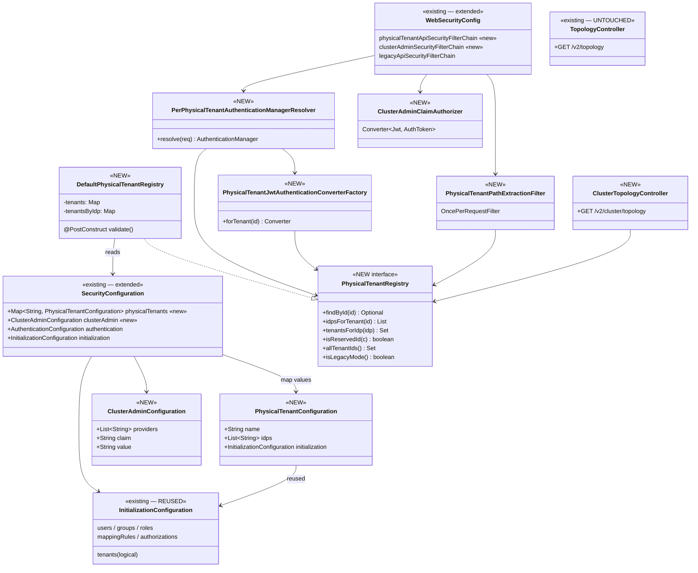
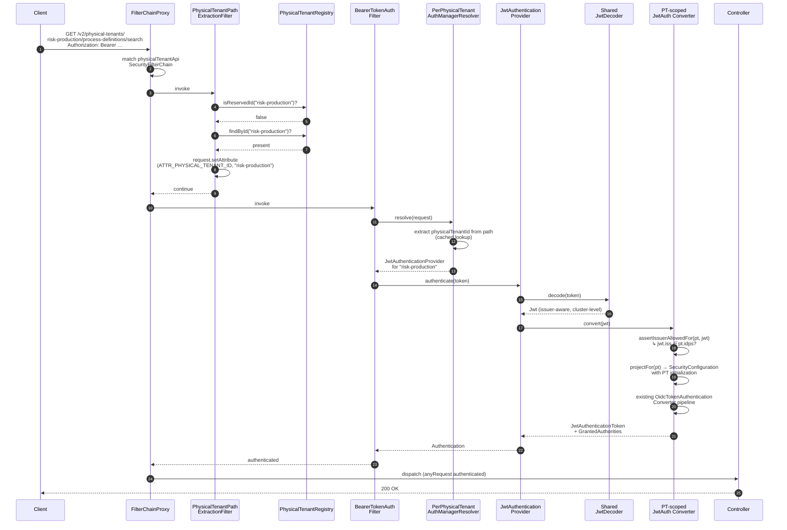
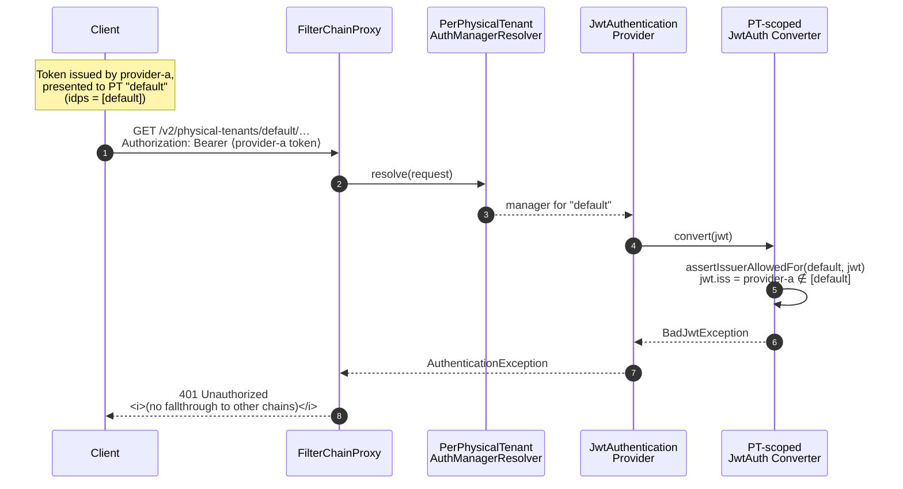
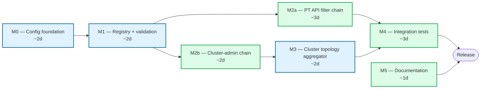
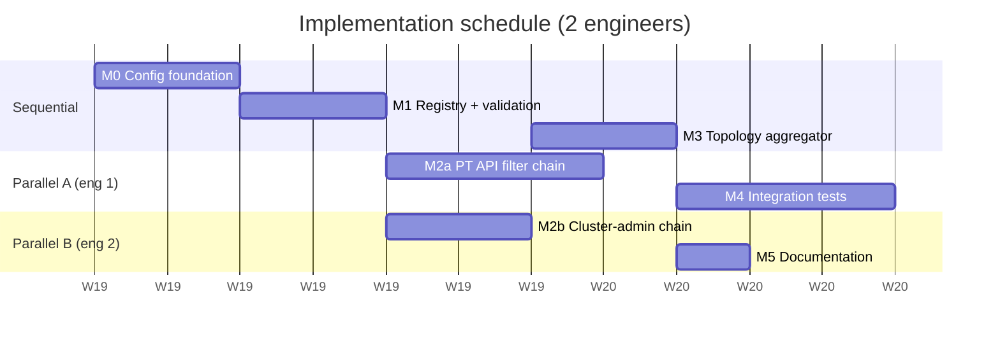

# Physical Tenants — Identity Support: Implementation Plan

> **Status:** Draft for team review
> **Epic:** [camunda/product-hub#3430 — Strong Tenant Isolation in Camunda 8 OC (Self-Managed)](https://github.com/camunda/product-hub/issues/3430)
> **Slice:** Identity (per-Physical-Tenant authentication and authorization, listed in the epic body under *Scope – Milestone 1 → Security and observability*).
> **Target release:** 8.10
> **Scope of this document:** Spring Security wiring + minimal configuration plumbing required to enable per-Physical-Tenant authentication and authorization. Intentionally narrow — adjacent slices of the same epic (primary/secondary storage isolation, per-PT backup/restore, webapps PT routing, gRPC PT header parity, Connectors multi-PT, observability) are referenced where relevant but **not** delivered here.
>
> **Canonical naming** (per epic body): API/config uses `physicalTenantId` / `physical-tenants`. Hub UX surfaces this as **Environment**. The existing `tenantId` (logical tenant) is unchanged.

---

## 1. Context and Goal

### 1.1 Problem statement

Camunda 8.9 multi-tenancy is *logical*: all tenants share one engine, and a user's role in any one tenant applies to all of them. **Physical Tenants (PT)** introduce a new boundary where each tenant is a distinct team / business unit / environment with its own authorization model and IdP routing.

This document covers **only the identity (authN/authZ) sub-slice** of that effort:
- Recognise a new REST path shape `/v2/physical-tenants/{physicalTenantId}/...` and apply per-tenant authN/authZ to it.
- Recognise `/v2/cluster/...` and apply claim-based cluster-admin authZ.
- Add a new `/v2/cluster/topology` aggregator that preserves the existing `/v2/topology` endpoint and overlays new behavior when PTs are configured.

### 1.2 Design tenets

- **Reuse first.** Every PT shares the same `InitializationConfiguration` shape that already exists in `security/security-core`. No parallel domain model.
- **Minimise surface area.** No new modules, no new top-level `@ConfigurationProperties` registrations, no rewrites of existing converters or filters. Add seams, do not refactor.
- **Forward compatible.** Plumbing must not block the Strong Isolation epic from later swapping in per-PT `BrokerClient` / `TopologyServices` instances.
- **Backwards compatible.** A vanilla 8.9 configuration starts cleanly on 8.10 with no behaviour change.
- **Scoped "skip-everything-else" semantics.** The PT chain skips global *authentication mechanisms* (no global auth fallback, no admin-user check, no webapp authorization filter). It does **not** skip cross-cutting hardening (CSRF, security headers, request firewall).

### 1.3 What this slice does **not** deliver

- Per-PT Raft groups, broker data layout, secondary storage isolation, document-store isolation — owned by the Strong Tenant Isolation epic.
- Per-PT login chains, tenant-aware OIDC login picker, `/sso-callback/{physicalTenantId}`, RP-initiated logout per PT — owned by a follow-up "Webapps PT routing" slice.
- gRPC `Camunda-Physical-Tenant` header handling — owned by a sibling slice of the same epic. Touch-points are documented (§13.2) so we ship a unified `PhysicalTenantContext` API the gRPC interceptor can later re-use.
- Persisted cluster-admin grant store, audit, dynamic PT/IdP management APIs, Hub policy distribution.
- Bulk migration tooling from existing 8.9 logical-tenant authorizations.

---

## 2. Architecture Overview

```mermaid
flowchart TB
    Req([HTTP request]) --> FCP[Spring FilterChainProxy<br/><i>matches first by securityMatcher</i>]

    FCP --> Unprot["<b>unprotectedPaths</b><br/>/error, /actuator/**,<br/>/swagger/**, …<br/><i>existing</i>"]
    FCP --> PtApi["<b>physicalTenantApi · NEW</b><br/>/v2/physical-tenants/&#123;physicalTenantId&#125;/**<br/>per-PT authN/authZ"]
    FCP --> ClusterAdmin["<b>clusterAdmin · NEW</b><br/>/v2/cluster/**<br/>claim-based admin<br/>+ BASIC fallback"]
    FCP --> Legacy["<b>legacyApi</b><br/>/v2/**, /v1/**, /api/**, /mcp/**<br/>default-PT, <i>unchanged</i>"]
    FCP --> Webapp["<b>webappAuth</b><br/>/login, /operate, …<br/><i>unchanged</i>"]

    PtApi --> PtResolver[PerPhysicalTenant<br/>AuthenticationManagerResolver]
    PtResolver --> PtProvider[JwtAuthenticationProvider<br/>shared JwtDecoder<br/>+ per-PT JwtAuthenticationConverter<br/>from InitializationConfiguration]

    ClusterAdmin --> ClusterAuthorizer[ClusterAdminClaimAuthorizer]
    ClusterAuthorizer --> ClusterRole[ROLE_CLUSTER_ADMIN]

    Legacy --> ExistingDecoder[existing JwtDecoder<br/>+ existing converters]

    classDef new fill:#dcfce7,stroke:#16a34a,stroke-width:2px;
    classDef existing fill:#f1f5f9,stroke:#64748b;
    class PtApi,ClusterAdmin,PtResolver,PtProvider,ClusterAuthorizer,ClusterRole new;
    class Unprot,Legacy,Webapp,ExistingDecoder existing;
```



Two new chains are inserted **before** the legacy `/v2/**` chain so that:
- `/v2/process-definitions/search` → legacy chain → default PT (unchanged).
- `/v2/physical-tenants/foo/process-definitions/search` → PT chain → `foo` config.
- `/v2/cluster/topology` → cluster chain → claim-based admin.

---

## 3. Configuration Model

### 3.1 YAML shape

All PT configuration lives under `camunda.security.physical-tenants.*`. The map key **is** the `physicalTenantId` (deliberately distinct from the existing logical-tenant `tenantId` so the two cannot be confused). No separate `id` field. IdP assignments live inside each PT entry — no separate `engine-idp-assignments` mapping.

> **Note on coexistence with other slices.** This identity slice introduces `camunda.security.physical-tenants.*` for security configuration only. Sibling slices of epic #3430 (secondary storage, backup repositories, broker-client wiring) will need their own per-PT properties for their own concerns. The placeholder javadoc in `search/search-client-connect/.../TenantConnectConfigResolver.java` already references a non-security `camunda.physical-tenants` tree as a forward placeholder for that purpose. The shared concept across slices is the **set of physical tenant ids** — owned by `PhysicalTenantRegistry` (this slice). A future cross-slice agreement on a unified top-level location for non-security PT properties is **out of scope here** and tracked as an open question (§11).

```yaml
camunda:
  security:
    authentication:
      method: oidc
      oidc:
        client-id-claim: client_id
        username-claim: preferred_username
        groups-claim: groups
        providers:
          default:
            client-name: "Default IdP"
            issuer-uri: https://login.example.com/realms/main
            client-id: camunda-cluster-default
            client-secret: ${DEFAULT_CLIENT_SECRET}
            audiences: camunda-cluster-default
          provider-a:
            client-name: "Provider A"
            issuer-uri: https://idp.provider-a.com/realms/somerealm
            client-id: client-id-a
            client-secret: ${PROVIDER_A_CLIENT_SECRET}
            audiences: client-id-a

    # NEW: cluster-admin claim-based mapping (used by /v2/cluster/** chain)
    cluster-admin:
      providers: [default]                    # IdPs allowed to mint cluster-admin tokens
      claim: groups                           # claim path inside the JWT
      value: cluster-admin                    # required claim value
      # Optional break-glass via BASIC; users come from camunda.security.initialization.users

    # Cluster-level seeded identities — also acts as the implicit "default" PT for legacy callers
    initialization:
      users:
        - username: cluster-admin
          password: ${CLUSTER_ADMIN_PASSWORD}
          name: Cluster Admin
      roles:
        - roleId: cluster-admin
          name: Cluster Admin
          users: [cluster-admin]

    # NEW: Physical Tenants — map keyed by tenant id
    physical-tenants:
      default:
        name: Default
        idps: [default]
        initialization:
          roles:
            - roleId: default-engine-admin
              name: Default Engine Admin
          groups:
            - groupId: default-developers
              name: Default Engine Developers
              roles: [default-engine-admin]
          tenants:
            - tenantId: default
              name: Default
              roles: [default-engine-admin]
              groups: [default-developers]
          authorizations:
            - ownerType: ROLE
              ownerId: default-engine-admin
              resourceType: PROCESS_DEFINITION
              resourceId: "*"
              permissions: [READ, CREATE, UPDATE, DELETE]

      risk-production:
        name: Risk Team Production
        idps: [default, provider-a]
        initialization:
          roles:
            - roleId: risk-production-admin
              name: Risk Production Admin
            - roleId: risk-analyst
              name: Risk Analyst
          groups:
            - groupId: risk-prod-admins
              name: Risk Production Admins
              roles: [risk-production-admin]
          authorizations:
            - ownerType: ROLE
              ownerId: risk-production-admin
              resourceType: PROCESS_DEFINITION
              resourceId: "*"
              permissions: [READ, CREATE, UPDATE, DELETE]
            - ownerType: ROLE
              ownerId: risk-analyst
              resourceType: PROCESS_INSTANCE
              resourceId: "*"
              permissions: [READ]
```

### 3.2 Why a `Map`, not a `List`

| Concern | `List<PhysicalTenantConfiguration>` with `id` field | `Map<String, PhysicalTenantConfiguration>` (chosen) |
|---|---|---|
| Duplicate IDs | Possible; needs runtime check | Impossible by construction |
| Cross-reference (e.g. assignments) | Fragile string matching | Direct key lookup |
| YAML readability | Indented list with `- id:` boilerplate | Flat map, key visually emphasized |
| Spring binding | Works | Works (native `Map<String, X>` binding) |
| Forward compatibility (renaming) | Friction-free | Same |

### 3.3 Why nest under `camunda.security.*`

- It **is** security configuration. Nesting keeps a single tree and avoids a third top-level `@ConfigurationProperties` registration.
- It piggybacks on the existing `CamundaSecurityProperties extends SecurityConfiguration` binder in `dist/src/main/java/io/camunda/application/commons/security/CamundaSecurityConfiguration.java` — **no new property class needs `@EnableConfigurationProperties`**.
- It collapses what was previously two trees (`camunda.physical-tenants` + `camunda.identity.engine-idp-assignments`) into one.

### 3.4 Why each PT carries `InitializationConfiguration` (and only that)

Each PT entry contains an instance of the **existing** `io.camunda.security.configuration.InitializationConfiguration`. We do **not** allow per-PT `authentication` / `authorizations` (the global `AuthorizationsConfiguration` flag, distinct from the `authorizations` list inside `InitializationConfiguration`) overrides:
- IdPs are cluster-level by requirement.
- Authentication method (BASIC vs OIDC) is cluster-level by requirement.
- Per-PT auth-method override would silently footgun (e.g. PT declared OIDC while cluster is BASIC).

This is the smallest reuse surface that satisfies the issue — operators get full control of *who* and *what* per PT, while *how to authenticate* stays cluster-uniform.

---

## 4. Detailed Class Design

> Naming convention: every new class is prefixed `PhysicalTenant…` so it's grep-able and segregated from existing security types.

The new types and how they connect to existing ones:



### 4.1 `PhysicalTenantConfiguration` (NEW)

**Location:** `security/security-core/src/main/java/io/camunda/security/configuration/PhysicalTenantConfiguration.java`

**Purpose:** The bound type for each entry under `camunda.security.physical-tenants.{physicalTenantId}`. Reuses `InitializationConfiguration` verbatim so that the existing `ConfiguredUser`/`ConfiguredRole`/`ConfiguredAuthorization`/`ConfiguredGroup`/`ConfiguredTenant`/`ConfiguredMappingRule` types are reused.

```java
public class PhysicalTenantConfiguration {

  /** Optional human-readable name. The map key is the canonical id. */
  private String name;

  /**
   * IdP keys, each of which must exist under
   * {@code camunda.security.authentication.oidc.providers.*}.
   */
  private List<String> idps = new ArrayList<>();

  /** Reused unchanged from existing security-core types. */
  private InitializationConfiguration initialization = new InitializationConfiguration();

  // getters/setters
}
```

### 4.2 `SecurityConfiguration` (MODIFIED)

**Location:** `security/security-core/src/main/java/io/camunda/security/configuration/SecurityConfiguration.java`

**Change:** add a single field. No methods change shape.

```java
public class SecurityConfiguration {
  // ... existing fields ...

  /**
   * Per Physical Tenant config, keyed by tenant id.
   * If empty, the cluster runs in implicit single-tenant mode and the cluster-level
   * {@link #getInitialization()} acts as the synthetic "default" PT bootstrap.
   */
  private Map<String, PhysicalTenantConfiguration> physicalTenants = new LinkedHashMap<>();

  /** Optional cluster-admin claim-based authorizer config (see §6.3). */
  private ClusterAdminConfiguration clusterAdmin = new ClusterAdminConfiguration();

  // getters/setters
}
```

### 4.3 `ClusterAdminConfiguration` (NEW)

**Location:** `security/security-core/src/main/java/io/camunda/security/configuration/ClusterAdminConfiguration.java`

**Purpose:** Drive the cluster-admin chain (§6.3) declaratively from YAML.

```java
public class ClusterAdminConfiguration {

  /** IdP keys allowed to mint cluster-admin tokens. Empty = no JWT-based cluster admin. */
  private List<String> providers = new ArrayList<>();

  /** JWT claim name to inspect (e.g. {@code groups}, {@code roles}). */
  private String claim;

  /** Required claim value. The claim must be a string or array containing this value. */
  private String value;

  // getters/setters
}
```

### 4.4 `PhysicalTenantRegistry` (NEW)

**Location:** `security/security-core/src/main/java/io/camunda/security/tenants/PhysicalTenantRegistry.java`

**Purpose:** The single bean every other PT-aware piece consults. Immutable after construction.

```java
public interface PhysicalTenantRegistry {

  /** Returns the PT config, or empty if id is unknown. Null-safe. */
  Optional<PhysicalTenantConfiguration> findById(String physicalTenantId);

  /** IdP keys assigned to a PT. Empty if PT unknown or has no assignments. */
  List<String> idpsForTenant(String physicalTenantId);

  /** Reverse index: which PTs trust a given IdP. Empty if IdP unknown. */
  Set<String> tenantsForIdp(String idpKey);

  /** True if the candidate id collides with a reserved top-level path segment. */
  boolean isReservedId(String candidate);

  /** All registered PT ids (includes synthetic 'default' in legacy mode). */
  Set<String> allTenantIds();

  /** True if the cluster runs in legacy mode (no PTs configured). */
  boolean isLegacyMode();
}
```

**Default implementation:** `DefaultPhysicalTenantRegistry`, constructed once from `SecurityConfiguration`. Validation runs in `@PostConstruct` and throws `IllegalStateException` on any failure (fail-fast at startup, matching the existing `CamundaSecurityConfiguration.validate()` style).

```java
public final class DefaultPhysicalTenantRegistry implements PhysicalTenantRegistry {

  static final Set<String> RESERVED_IDS = Set.of(
      "login", "logout", "oauth2", "sso-callback",
      "identity", "admin", "cluster",
      "operate", "tasklist", "optimize", "console", "webmodeler",
      "actuator", "swagger", "swagger-ui", "v3", "v2", "v1",
      "api", "mcp", ".well-known", "error", "ready", "health", "startup",
      "post-logout", "new", "favicon.ico");

  private final Map<String, PhysicalTenantConfiguration> tenants;        // unmodifiable
  private final Map<String, Set<String>> tenantsByIdp;                    // unmodifiable
  private final boolean legacyMode;

  public DefaultPhysicalTenantRegistry(final SecurityConfiguration securityConfig) {
    this.legacyMode = securityConfig.getPhysicalTenants().isEmpty();
    this.tenants = legacyMode
        ? Map.of("default", synthesizeDefault(securityConfig))
        : Map.copyOf(securityConfig.getPhysicalTenants());
    this.tenantsByIdp = buildReverseIndex(this.tenants);
  }

  @PostConstruct
  void validate() { /* see §7 */ }

  // ...
}
```

### 4.5 `PerPhysicalTenantAuthenticationManagerResolver` (NEW)

**Location:** `authentication/src/main/java/io/camunda/authentication/config/PerPhysicalTenantAuthenticationManagerResolver.java`

**Purpose:** Spring Security's standard multi-tenant hook. Plugged into `oauth2ResourceServer().authenticationManagerResolver(...)` for the PT chain. Extracts the tenant id from the path, looks up (or lazily builds) an `AuthenticationManager` per PT.

```java
public final class PerPhysicalTenantAuthenticationManagerResolver
    implements AuthenticationManagerResolver<HttpServletRequest> {

  private static final PathPatternRequestMatcher PATH =
      PathPatternRequestMatcher.withDefaults().matcher("/v2/physical-tenants/{physicalTenantId}/**");

  private final PhysicalTenantRegistry registry;
  private final JwtDecoder sharedDecoder;                                   // existing issuer-aware decoder
  private final PhysicalTenantJwtAuthenticationConverterFactory converterFactory;
  private final Map<String, AuthenticationManager> cache = new ConcurrentHashMap<>();

  @Override
  public AuthenticationManager resolve(final HttpServletRequest request) {
    final var match = PATH.matcher(request);
    if (!match.isMatch()) {
      throw new OAuth2AuthenticationException(BearerTokenErrors.invalidRequest("missing tenant id"));
    }
    final String physicalTenantId = (String) match.getVariables().get("physicalTenantId");

    return cache.computeIfAbsent(physicalTenantId, this::buildManager);
  }

  private AuthenticationManager buildManager(final String physicalTenantId) {
    final PhysicalTenantConfiguration pt = registry.findById(physicalTenantId)
        .orElseThrow(() -> new OAuth2AuthenticationException(
            BearerTokenErrors.invalidToken("unknown physical tenant: " + physicalTenantId)));

    final var provider = new JwtAuthenticationProvider(sharedDecoder);
    provider.setJwtAuthenticationConverter(converterFactory.forTenant(physicalTenantId));
    return provider::authenticate;
  }
}
```

**Why a single shared `JwtDecoder`, not one per PT?** IdPs are cluster-level — the existing `IssuerAwareJWSKeySelector` already validates a token against any registered IdP. The PT-specific check is *which* IdPs are *allowed* for this tenant; that check lives in the per-PT converter (§4.6) where the resolved `iss` is compared to `pt.idps()`. One decoder, many converters.

### 4.6 `PhysicalTenantJwtAuthenticationConverterFactory` (NEW)

**Location:** `authentication/src/main/java/io/camunda/authentication/config/PhysicalTenantJwtAuthenticationConverterFactory.java`

**Purpose:** Produces `JwtAuthenticationConverter` instances scoped to one tenant, layered on top of the existing `OidcTokenAuthenticationConverter`/`TokenClaimsConverter`. No copy-paste of converter logic.

```java
public final class PhysicalTenantJwtAuthenticationConverterFactory {

  private final PhysicalTenantRegistry registry;
  private final OidcAuthenticationConfiguration globalOidc;
  private final SecurityConfiguration globalSecurity;

  public Converter<Jwt, AbstractAuthenticationToken> forTenant(final String physicalTenantId) {
    return jwt -> {
      final PhysicalTenantConfiguration pt = registry.findById(physicalTenantId)
          .orElseThrow(() -> new BadJwtException("unknown physical tenant: " + physicalTenantId));

      // 1. Reject tokens whose issuer is not in this PT's allowed IdP set.
      assertIssuerAllowedFor(pt, jwt);

      // 2. Reuse the existing converter pipeline, but seeded with this PT's
      //    InitializationConfiguration (roles, groups, mapping rules, authorizations).
      final var ptScopedSecurity = projectFor(pt);
      final var claimsConverter = new TokenClaimsConverter(ptScopedSecurity, ...);
      final var oidcConverter = new OidcTokenAuthenticationConverter(claimsConverter, ...);

      return oidcConverter.convert(jwt);
    };
  }

  private SecurityConfiguration projectFor(final PhysicalTenantConfiguration pt) {
    // Light projection: same SecurityConfiguration, but with .initialization replaced
    // by the PT's initialization. Auth/oidc/providers untouched.
    final var copy = new SecurityConfiguration();
    copy.setAuthentication(globalSecurity.getAuthentication());
    copy.setMultiTenancy(globalSecurity.getMultiTenancy());
    copy.setInitialization(pt.getInitialization());
    return copy;
  }
}
```

**Decision: in-memory authority mapping, no secondary-storage seeding per PT.** The PT's `authorizations` block is read on each request and translated to `GrantedAuthority`s; we do not run a per-PT `InitializationConfiguration` seeder against secondary storage. This avoids the contradiction between the issue's *"in-memory only, no users — identities come from the IdP at login"* directive and the existing single-tenant initialization-seeding behavior. The legacy cluster-level seeder (under `camunda.security.initialization`) keeps running for cluster-admin BASIC users.

### 4.7 `PhysicalTenantPathExtractionFilter` (NEW)

**Location:** `authentication/src/main/java/io/camunda/authentication/config/PhysicalTenantPathExtractionFilter.java`

**Purpose:** Stamp the resolved tenant id into the request as an attribute so downstream services (`MembershipService`, `ResourceAccessProvider`, the topology aggregator) can pick it up without re-parsing the URL.

```java
public final class PhysicalTenantPathExtractionFilter extends OncePerRequestFilter {

  public static final String ATTR_PHYSICAL_TENANT_ID = "io.camunda.physical-tenant-id";

  private static final PathPatternRequestMatcher MATCHER =
      PathPatternRequestMatcher.withDefaults().matcher("/v2/physical-tenants/{physicalTenantId}/**");

  private final PhysicalTenantRegistry registry;

  @Override
  protected void doFilterInternal(HttpServletRequest req, HttpServletResponse res, FilterChain chain)
      throws IOException, ServletException {
    final var match = MATCHER.matcher(req);
    if (match.isMatch()) {
      final String physicalTenantId = (String) match.getVariables().get("physicalTenantId");
      if (registry.isReservedId(physicalTenantId) || registry.findById(physicalTenantId).isEmpty()) {
        res.sendError(HttpStatus.NOT_FOUND.value());
        return;
      }
      req.setAttribute(ATTR_PHYSICAL_TENANT_ID, physicalTenantId);
    }
    chain.doFilter(req, res);
  }
}
```

This filter sits **before** `BearerTokenAuthenticationFilter` on the PT chain so we 404 unknown / reserved tenants without paying for token validation.

### 4.8 `ClusterAdminClaimAuthorizer` (NEW)

**Location:** `authentication/src/main/java/io/camunda/authentication/config/ClusterAdminClaimAuthorizer.java`

**Purpose:** The `Converter<Jwt, AbstractAuthenticationToken>` for `/v2/cluster/**`. Pure predicate over `(iss, claim, value)`.

```java
public final class ClusterAdminClaimAuthorizer
    implements Converter<Jwt, AbstractAuthenticationToken> {

  static final String ROLE = "ROLE_CLUSTER_ADMIN";

  private final Set<String> allowedIssuers;          // resolved at startup from cluster-admin.providers
  private final String requiredClaim;
  private final String requiredValue;

  @Override
  public AbstractAuthenticationToken convert(final Jwt jwt) {
    if (!allowedIssuers.contains(jwt.getIssuer().toString())) {
      throw new BadJwtException("issuer not allowed for cluster admin");
    }
    final Object claim = jwt.getClaim(requiredClaim);
    if (!matches(claim, requiredValue)) {
      throw new BadJwtException("required cluster-admin claim missing");
    }
    return new JwtAuthenticationToken(jwt, List.of(new SimpleGrantedAuthority(ROLE)));
  }

  private static boolean matches(final Object claim, final String required) {
    if (claim instanceof String s)            return required.equals(s);
    if (claim instanceof Collection<?> c)     return c.contains(required);
    return false;
  }
}
```

BASIC fallback for break-glass reuses the existing `httpBasic()` configurer with the cluster-level `camunda.security.initialization.users` — no new user-details bean is required.

### 4.9 `WebSecurityConfig` (MODIFIED)

**Location:** `authentication/src/main/java/io/camunda/authentication/config/WebSecurityConfig.java`

**Change:** add two `SecurityFilterChain` `@Bean`s. The chains live as siblings to the existing `*WebappAuthSecurityFilterChain` / API chains. Existing `@Order` constants get re-spaced to make room.

```java
@Bean
@Order(ORDER_PT_API)                                   // higher precedence than legacy /v2/**
SecurityFilterChain physicalTenantApiSecurityFilterChain(
    final HttpSecurity http,
    final PerPhysicalTenantAuthenticationManagerResolver resolver,
    final PhysicalTenantPathExtractionFilter pathExtractionFilter,
    final SecurityConfiguration securityConfiguration) throws Exception {

  return http
      .securityMatcher("/v2/physical-tenants/{physicalTenantId}/**")
      .addFilterBefore(pathExtractionFilter, BearerTokenAuthenticationFilter.class)
      .oauth2ResourceServer(o -> o.authenticationManagerResolver(resolver))
      .sessionManagement(s -> s.sessionCreationPolicy(SessionCreationPolicy.NEVER))
      .authorizeHttpRequests(a -> a.anyRequest().authenticated())
      // CSRF + headers come from the shared helper that the cluster chain uses today —
      // *not* skipped despite the "skip everything else" wording.
      .with(applyCsrfConfiguration(securityConfiguration), Customizer.withDefaults())
      .with(applySecureHeaders(securityConfiguration), Customizer.withDefaults())
      // Explicit removals: no formLogin, no oauth2Login, no AdminUserCheckFilter,
      // no WebComponentAuthorizationCheckFilter — these belong to other chains.
      .build();
}

@Bean
@Order(ORDER_CLUSTER_ADMIN)
SecurityFilterChain clusterAdminSecurityFilterChain(
    final HttpSecurity http,
    final ClusterAdminClaimAuthorizer authorizer,
    final SecurityConfiguration securityConfiguration) throws Exception {

  return http
      .securityMatcher("/v2/cluster/**")
      .oauth2ResourceServer(o -> o.jwt(j -> j.jwtAuthenticationConverter(authorizer)))
      .httpBasic(Customizer.withDefaults())            // break-glass via initialization.users
      .authorizeHttpRequests(a -> a
          .anyRequest().hasAuthority(ClusterAdminClaimAuthorizer.ROLE))
      .sessionManagement(s -> s.sessionCreationPolicy(SessionCreationPolicy.NEVER))
      .with(applyCsrfConfiguration(securityConfiguration), Customizer.withDefaults())
      .with(applySecureHeaders(securityConfiguration), Customizer.withDefaults())
      .build();
}
```

The existing legacy `/v2/**` chain (`@Order(ORDER_DEFAULT_API)` after re-spacing) is **untouched**; calls without a PT prefix continue to behave exactly as 8.9.

### 4.10 `ClusterTopologyController` (NEW)

**Location:** `zeebe/gateway-rest/src/main/java/io/camunda/zeebe/gateway/rest/controller/ClusterTopologyController.java`

**Purpose:** Implements `/v2/cluster/topology` without touching the existing `TopologyController`.

```java
@CamundaRestController
@RequestMapping("/v2/cluster")
public final class ClusterTopologyController {

  private final TopologyServices topologyServices;
  private final PhysicalTenantRegistry registry;

  @CamundaGetMapping(path = "/topology")
  public CompletableFuture<ResponseEntity<Object>> getClusterTopology() {
    final var perTenant = registry.allTenantIds().stream()
        .collect(toMap(Function.identity(), this::topologyFor));

    return CompletableFuture.allOf(perTenant.values().toArray(new CompletableFuture[0]))
        .thenApply(v -> ResponseEntity.ok(toClusterTopologyResponse(perTenant)));
  }

  private CompletableFuture<TopologyOrError> topologyFor(final String physicalTenantId) {
    // For 8.10, every PT shares the same in-process TopologyServices.
    // The shape is forward-compatible with later per-PT BrokerClient instances
    // (Strong Isolation epic) — only this method body changes then.
    return RequestExecutor
        .executeServiceMethod(topologyServices::getTopology, ResponseMapper::toTopologyResponse)
        .handle((ok, ex) -> ex == null
            ? new TopologyOrError.Ok(ok)
            : new TopologyOrError.Failed(physicalTenantId, ex.getMessage()));
  }
}
```

**Decisions in this controller:**
- The existing `/v2/topology` endpoint (in `TopologyController`) is **not modified**. It remains the single-topology endpoint and continues to satisfy 8.9 callers and the default-PT case.
- Per-PT failure is data, not a 5xx — clients can render a "DEGRADED" PT in the cluster view.
- For 8.10 the controller delegates to the same `TopologyServices` for every PT (Strong Isolation hasn't shipped). The response shape is the forward-compatible one (`{ physicalTenantId → topology }`), so when per-PT broker clients arrive only the `topologyFor(...)` method body changes.

#### 4.10.1 The same pattern applies to `/v2/cluster/backup` (and any future `/v2/cluster/*`)

Cluster-wide backup follows the **identical pattern** that this slice establishes for topology, and is delivered by the per-PT backup/restore sibling slice of epic #3430:

- **Auth wiring is already in place.** The `clusterAdminSecurityFilterChain` matcher (`/v2/cluster/**`) covers every cluster-scoped endpoint uniformly. No new filter chain, no new resolver — adding `/v2/cluster/backup` is a controller-only addition from the security perspective.
- **Same controller shape.** A `ClusterBackupController` will be a thin fan-out over `registry.allTenantIds()`, returning `{ physicalTenantId → BackupOrError }`. Per-PT backup repository selection (today: shared `/actuator/backupRuntime`; tomorrow: per-PT repository per the Strong Isolation epic) lives behind that controller and is owned by the backup slice.
- **Failure surfaces as data.** A PT whose backup fails returns `{ status: DEGRADED, error: "..." }` in its slot — the cluster-wide call returns 200 if at least one PT could be processed.
- **Backwards compatibility.** The existing `/actuator/backupRuntime` and `/actuator/backupHistory` continue to work unchanged for 8.9 callers and operators. The new `/v2/cluster/backup` is additive.

**This slice does not deliver `ClusterBackupController` itself** — only the security wiring it will plug into. We document the pattern here so the backup-slice team has a clear contract: any controller they mount under `/v2/cluster/**` inherits cluster-admin authentication for free, and is expected to follow the same fan-out / per-PT-error shape that `ClusterTopologyController` establishes.

### 4.11 Files at a glance

| File | Change |
|---|---|
| `security/security-core/.../configuration/SecurityConfiguration.java` | Add `Map<String, PhysicalTenantConfiguration> physicalTenants`, add `ClusterAdminConfiguration clusterAdmin`. |
| `security/security-core/.../configuration/PhysicalTenantConfiguration.java` | **NEW** |
| `security/security-core/.../configuration/ClusterAdminConfiguration.java` | **NEW** |
| `security/security-core/.../tenants/PhysicalTenantRegistry.java` | **NEW** (interface) |
| `security/security-core/.../tenants/DefaultPhysicalTenantRegistry.java` | **NEW** (impl) |
| `authentication/.../config/WebSecurityConfig.java` | Add two `SecurityFilterChain` beans, re-space `@Order` constants. |
| `authentication/.../config/PerPhysicalTenantAuthenticationManagerResolver.java` | **NEW** |
| `authentication/.../config/PhysicalTenantJwtAuthenticationConverterFactory.java` | **NEW** |
| `authentication/.../config/PhysicalTenantPathExtractionFilter.java` | **NEW** |
| `authentication/.../config/ClusterAdminClaimAuthorizer.java` | **NEW** |
| `zeebe/gateway-rest/.../controller/ClusterTopologyController.java` | **NEW** |
| `zeebe/gateway-rest/.../controller/TopologyController.java` | **UNTOUCHED** |
| `dist/.../security/CamundaSecurityConfiguration.java` | No change needed — `CamundaSecurityProperties extends SecurityConfiguration` already binds new fields. |

---

## 5. Spring Security Filter Chain Topology

### 5.1 Chain order

| Order constant | Chain | `securityMatcher` | Purpose |
|---|---|---|---|
| 0 | `unprotectedPathsSecurityFilterChain` (existing) | `UNPROTECTED_PATHS` | `/error`, `/actuator/**`, `/swagger/**`, … |
| 5 | `unprotectedApiAuthSecurityFilterChain` (existing) | `UNPROTECTED_API_PATHS` | `/v2/license`, `/v2/setup/user`, `/v2/status`, … |
| **10** | **`physicalTenantApiSecurityFilterChain` (NEW)** | `/v2/physical-tenants/{physicalTenantId}/**` | per-PT JWT |
| **15** | **`clusterAdminSecurityFilterChain` (NEW)** | `/v2/cluster/**` | cluster-admin claim |
| 20 | `httpBasicApiAuthSecurityFilterChain` / `oidcApiSecurity` (existing) | `API_PATHS` | default-PT (legacy) |
| 30 | `*WebappAuthSecurityFilterChain` (existing) | `WEBAPP_PATHS` | webapp login |
| 100 | `protectedUnhandledPathsSecurityFilterChain` (existing) | `/**` | deny-all |

```mermaid
flowchart LR
    subgraph order["Chain evaluation order — first match wins"]
        direction LR
        O0["<b>0</b><br/>unprotectedPaths"]
        O5["<b>5</b><br/>unprotectedApi"]
        O10["<b>10 · NEW</b><br/>physicalTenantApi<br/>/v2/physical-tenants/&#123;physicalTenantId&#125;/**"]
        O15["<b>15 · NEW</b><br/>clusterAdmin<br/>/v2/cluster/**"]
        O20["<b>20</b><br/>legacy API<br/>/v2/**, /v1/**, /api/**, /mcp/**"]
        O30["<b>30</b><br/>webapp login"]
        O100["<b>100</b><br/>denyAll /**"]
        O0 --> O5 --> O10 --> O15 --> O20 --> O30 --> O100
    end
    classDef new fill:#dcfce7,stroke:#16a34a,stroke-width:2px;
    class O10,O15 new;
```



The existing constants `ORDER_UNPROTECTED=0`, `ORDER_WEBAPP_API=1`, `ORDER_UNHANDLED=2` get re-spaced to give room. This is the only structural change to `WebSecurityConfig`.

### 5.2 Per-PT request flow (sequence)



### 5.3 Cross-tenant token replay (negative path)



---

## 6. Authorization Model

### 6.1 Where authorities come from

`InitializationConfiguration.authorizations` (a `List<ConfiguredAuthorization>`) maps `(ownerType, ownerId, resourceType, resourceId, permissions)`. The existing `TokenClaimsConverter` already translates a JWT plus a `SecurityConfiguration` into a `CamundaAuthentication` carrying the right authorities. **The PT chain reuses that pipeline** — see §4.6 — by passing in the PT-scoped `SecurityConfiguration` projection.

### 6.2 Cluster-admin

Claim-based, stateless. The configured triple `(providers, claim, value)` is the only gate. BASIC fallback uses `camunda.security.initialization.users` filtered to whoever is mapped to a role with `resourceType: CLUSTER` `permissions: *`. No new identity store.

### 6.3 Cross-tenant aggregator

`/v2/cluster/topology` runs under `ROLE_CLUSTER_ADMIN`. Per-PT topology fan-out is in-process; visibility is the cluster-admin's by definition. When per-PT authorization granularity becomes a requirement (e.g. "cluster-admin who can only see PT-X topology"), introduce a `tenantAuthorizer.canRead(actor, physicalTenantId)` seam in the controller — explicitly out of scope for 8.10.

---

## 7. Validation Rules (startup, fail-fast)

| Rule | Enforced in | Failure mode |
|---|---|---|
| Tenant id (map key) matches `SecurityConfiguration.idValidationPattern` | `DefaultPhysicalTenantRegistry.validate()` | `IllegalStateException` listing the offending id |
| Tenant id (map key) ∉ `RESERVED_IDS` | Same | `IllegalStateException` listing reserved IDs |
| Every `idps[*]` references a key under `authentication.oidc.providers` | Same | `IllegalStateException` listing unknown IdP keys per PT |
| OIDC mode + at least one PT defined ⇒ every PT has ≥1 IdP | Same | `IllegalStateException` listing PTs with empty `idps` |
| `clusterAdmin.providers[*]` references a key under `authentication.oidc.providers` | Same | `IllegalStateException` listing unknown IdP keys |
| `clusterAdmin.claim` non-blank when `clusterAdmin.providers` non-empty | Same | `IllegalStateException` |

Duplicate-id validation is **structurally impossible** thanks to the `Map`-keyed shape. No cross-tree mismatch validation is needed (everything sits in one tree).

---

## 8. Backwards Compatibility

> **Contract:** A vanilla 8.9 configuration starts on 8.10 with no behavior change.

When `camunda.security.physical-tenants` is empty (legacy mode):

- The registry synthesizes one `default` entry whose `initialization` **references** (not copies) `camunda.security.initialization`. Operator updates to the cluster-level initialization continue to flow.
- The synthetic `default` entry's `idps` is the full set of keys under `authentication.oidc.providers`.
- All `/v2/...` calls without a PT prefix hit the legacy `API_PATHS` chain (unchanged from 8.9).
- `/v2/topology` is unchanged.
- `/v2/cluster/topology` returns `{ "default": <topology> }` — a stable shape so multi-cluster tooling can rely on the endpoint regardless of mode.

There is **one code path**, never a `if (legacyMode) ... else ...` branch in business logic; the registry abstracts the mode. This is the lesson the devil's advocate flagged — two modes rot, one mode survives.

---

## 9. Test Plan

### 9.1 Pyramid

| Layer | Targets | Tooling |
|---|---|---|
| Unit | `DefaultPhysicalTenantRegistry`, `PhysicalTenantJwtAuthenticationConverterFactory`, `ClusterAdminClaimAuthorizer`, `PhysicalTenantPathExtractionFilter` | JUnit 5 + AssertJ + Mockito |
| Slice | Filter-chain dispatch, status codes per scenario | `@SpringBootTest(consolidated-auth)` + MockMvc |
| Integration | OIDC end-to-end, cross-PT token replay | Keycloak Testcontainer |
| Acceptance | One full-stack happy path | `qa/acceptance-tests` |

### 9.2 Key unit tests (`should…` names)

`DefaultPhysicalTenantRegistryTest`:
- `shouldReturnTenantByIdWhenConfigured`
- `shouldRejectReservedTenantIdAtStartup`
- `shouldRejectTenantWithUnknownIdpReference`
- `shouldRejectOidcModeWithEmptyIdpsForAnyTenant`
- `shouldExposeImmutableViewOfRegisteredTenants`
- `shouldSynthesizeDefaultTenantInLegacyMode`

`PhysicalTenantJwtAuthenticationConverterFactoryTest`:
- `shouldMapPtAuthorizationsBlockToGrantedAuthorities`
- `shouldRejectTokenWhoseIssuerIsNotAssignedToTargetTenant`
- `shouldNotLeakAuthoritiesAcrossTenants`
- `shouldFallBackToGlobalSecurityWhenPtInitializationEmpty`

`ClusterAdminClaimAuthorizerTest`:
- `shouldGrantAccessOnIssuerClaimAndValueMatch`
- `shouldDenyAccessWhenClaimMissing`
- `shouldDenyAccessWhenClaimValueDiffers`
- `shouldDenyAccessWhenIssuerNotInProvidersList`

### 9.3 Key slice tests (MockMvc, `consolidated-auth` profile)

- `shouldReturn200OnPtApiWithValidTokenFromAssignedIdp`
- `shouldReturn401OnPtApiWithTokenFromUnassignedIdp`           ← cross-PT replay defense
- `shouldReturn404OnUnknownPhysicalTenantBeforeAuthentication`
- `shouldReturn404OnReservedTenantIdInUrl`
- `shouldRouteUnprefixedRequestToLegacyDefaultChain`
- `shouldReturn403OnClusterTopologyWithoutClusterAdminClaim`
- `shouldReturn200OnClusterTopologyWithClusterAdminClaim`
- `shouldKeepCsrfActiveOnPtChain`                              ← defense-in-depth
- `shouldNotApplyAdminUserCheckOnPtChain`

### 9.4 Integration (Keycloak Testcontainer)

One module: `authentication/src/test/java/io/camunda/authentication/physicaltenants/PhysicalTenantOidcIT.java`. Two realms (`default-realm`, `provider-a-realm`); two PTs (`default` → default only, `risk-production` → both). Scenarios:

- `shouldAcceptTokenFromAssignedIdpOnTargetPt`
- `shouldRejectTokenFromUnassignedIdpOnTargetPt`              ← the highest-blast-radius regression
- `shouldAggregateTopologyAcrossPtsForClusterAdminCaller`
- `shouldRejectClusterTopologyForCallerWithoutAdminClaim`

### 9.5 Acceptance test (cap at one)

`qa/acceptance-tests/src/test/java/io/camunda/it/auth/PhysicalTenantHappyPathIT.java`:
- `shouldDeployAndRunProcessUnderNonDefaultPhysicalTenant` (OIDC + Keycloak fixture).

### 9.6 Backwards-compat tests

- `shouldStartWithEmptyPhysicalTenantsBlock`
- `shouldServeAllExistingV2EndpointsViaLegacyChain`
- `shouldKeepLogicalTenantBehaviourInsideASyntheticDefaultPt`
- Re-run the existing `OidcWebSecurityConfigTest` / `BasicAuthWebSecurityConfigTest` suites unmodified.

---

## 10. Risks and Mitigations

| # | Risk | Mitigation in this slice |
|---|---|---|
| 1 | Bean-count explosion with N PTs (one converter per PT, cached) | Lazy-build, single `JwtDecoder`, no per-PT chain. Bounded to one `Converter` per accessed PT. Documented limit: 50 PTs (per Strong Isolation decisions). |
| 2 | Persisted-vs-in-memory contradiction | Decision: **in-memory only**. `InitializationConfiguration` per PT is read-on-request, never seeded into secondary storage. |
| 3 | "Skip everything else" interpreted too literally | Scoped narrowly: skip global *authentication mechanisms*, keep CSRF/headers/firewall. Documented in §1.2. |
| 4 | Reserved-ID list drift as new top-level paths land | Documented constant in `DefaultPhysicalTenantRegistry`; covered by a unit test that fails when an undocumented top-level segment is introduced. (Optional follow-up: build-time scanner.) |
| 5 | Cluster-admin claim has no revocation/audit | Out of scope for 8.10. Documented as a known gap; follow-up ticket to evaluate a minimal grant-on-first-use record. |
| 6 | Microsoft Entra wildcard redirect-URI limitation | N/A in this slice — login flow not modified. Risk transfers to the Webapps PT routing follow-up. |
| 7 | `/v2/cluster/topology` shape locked in early | Mitigated by returning `{ physicalTenantId → topology }` from day one — same shape regardless of legacy or PT mode. Per-PT body changes when Strong Isolation lands. The same shape is expected for `/v2/cluster/backup`. |
| 8 | Long-poll / `OAuth2AuthorizedClientRepository` cross-PT bleed | Out of scope here (no webapp login chain change). Documented as a dependency on Strong Isolation. |
| 9 | gRPC parity drift | Touch-points listed in §13.2; `PhysicalTenantRegistry` is the single source of truth so the future gRPC interceptor reuses it. |

---

## 11. Open Questions

1. **Reserved-ID list ownership.** Is `DefaultPhysicalTenantRegistry` the right home, or should the canonical list live in `gateway-rest` next to `@RequestMapping`? Decision needed before merge.
2. **`MultiTenancyConfiguration` interaction.** Logical tenants live inside a PT. If an operator sets `multiTenancy.checksEnabled=true` cluster-wide, does it apply per PT? Recommend yes (no behavioural change), confirm with engine team.
3. **Cluster-admin BASIC fallback ergonomics.** Should we warn at startup when the BASIC `cluster-admin` user keeps the default password? (Existing pattern for `demo` user — apply the same.)
4. **`clusterAdmin.value` as a list?** Some IdPs ship multiple admin claim values. Do we accept `value: [...]` or just `value: cluster-admin`? Recommend single-value for 8.10, multi-value as a follow-up.
5. **`/v2/cluster/topology` response schema sign-off.** Must be agreed with the API stewards before implementation. The same shape (`{ physicalTenantId → ResultOrError }`) is expected to apply to `/v2/cluster/backup` (sibling slice).
6. **Cross-slice config-tree coordination.** This slice introduces `camunda.security.physical-tenants.*` for identity. Sibling slices need their own per-PT config (secondary storage, backup repositories, broker-client wiring) — the placeholder javadoc in `TenantConnectConfigResolver` already references `camunda.physical-tenants` for non-security use. The set of physical tenant ids must remain **a single source of truth**. Options for resolution: (a) cross-slice agreement that `camunda.security.physical-tenants` and `camunda.physical-tenants` coexist as parallel trees keyed by the same set of ids (registry validates consistency); (b) a unified `camunda.physical-tenants.{id}.{security,storage,backup,...}` tree at a future epic-wide refactoring boundary. This slice ships option (a) implicitly; option (b) is a follow-up that does not block 8.10.

---

## 12. Out-of-scope dependencies (for situational awareness only)

This slice **does not** depend on, but is **forward-compatible with**:

- **Strong Tenant Isolation** — per-PT Raft groups, secondary storage, document store. When this lands, only `ClusterTopologyController.topologyFor(...)` changes (it picks a per-PT `TopologyServices` from a registry-backed map instead of the shared singleton).
- **Webapps PT routing** — `/{physicalTenantId}/operate`, `/{physicalTenantId}/tasklist`, tenant-aware login picker, `/sso-callback/{physicalTenantId}`, per-PT session cookie. Reuses `PhysicalTenantRegistry`.
- **gRPC PT header parity** — header `Camunda-Physical-Tenant` (canonical name from the epic body), mirrors the path-based REST resolution. Reuses `PhysicalTenantRegistry` and `PhysicalTenantJwtAuthenticationConverterFactory`. Same epic, different slice.
- **Connectors multi-PT** — `JobWorkerManager` per PT, `SecretContext.physicalTenantId`. Independent of identity wiring.
- **Cluster Backup/Restore** — `/v2/cluster/backup`, `/v2/cluster/restore`. Plugs into the same cluster-admin chain.

---

## 13. Touch-points Reserved for Follow-ups

### 13.1 `PhysicalTenantContext` (FUTURE)

Suggested to land in this slice purely as a *holder*, even if only the REST filter populates it:

```java
public final class PhysicalTenantContext {
  public static String currentPhysicalTenantId() { /* reads request attribute */ }
}
```

— so the future gRPC interceptor and the future webapp chain populate the same holder. This keeps the source of truth for "current PT" single, regardless of protocol.

### 13.2 gRPC interceptor seam

Out of this slice, but the gRPC team should consume:
- `PhysicalTenantRegistry` for PT lookup (header `Camunda-Physical-Tenant`).
- `PhysicalTenantJwtAuthenticationConverterFactory` for JWT-to-authority mapping.

### 13.3 Strong Isolation seam

`ClusterTopologyController.topologyFor(...)` is the only line that changes when per-PT broker clients arrive:

```java
// Today (this slice):
return RequestExecutor.executeServiceMethod(topologyServices::getTopology, ...);

// Future (Strong Isolation):
return RequestExecutor.executeServiceMethod(
    topologyServicesByPhysicalTenant.get(physicalTenantId)::getTopology, ...);
```

---

## 14. Implementation Milestones

> Estimates are rough engineering days assuming one engineer per stream, with the existing test infrastructure available. Total ≈ 12-18 engineering days (≈ 3-4 calendar weeks with one engineer, or ≈ 2 weeks with two engineers running streams in parallel).

### M0 — Configuration foundation (sequential prerequisite, ~2 days)

**Goal:** New types bind from YAML; legacy configs still pass.

- [ ] Add `PhysicalTenantConfiguration`, `ClusterAdminConfiguration` to `security-core`.
- [ ] Add `physicalTenants` and `clusterAdmin` fields to `SecurityConfiguration`.
- [ ] Verify Spring Boot binding from a sample YAML (one OIDC PT, one BASIC config) — `CamundaSecurityProperties extends SecurityConfiguration` already does the work.
- [ ] No registry, no chain changes yet — this milestone is just the schema.

**Exit criteria:** existing tests pass; new types load from YAML in a unit test.

### M1 — Registry + validation (depends on M0, ~2 days)

**Goal:** Single source of truth for PT lookup with fail-fast startup validation.

- [ ] `PhysicalTenantRegistry` interface + `DefaultPhysicalTenantRegistry` impl.
- [ ] Reserved-ID set, validation rules table (§7).
- [ ] Synthetic `default` PT for legacy mode.
- [ ] Full unit test suite (`DefaultPhysicalTenantRegistryTest`).

**Exit criteria:** registry bean is wired in `dist/`; integration test asserts startup failure on each invalid config; legacy mode auto-synthesizes default.

### M2a — PT API filter chain (depends on M1, ~3 days, parallel with M2b)

**Goal:** `/v2/physical-tenants/{physicalTenantId}/**` authenticates and authorizes per PT.

- [ ] `PhysicalTenantPathExtractionFilter`.
- [ ] `PerPhysicalTenantAuthenticationManagerResolver`.
- [ ] `PhysicalTenantJwtAuthenticationConverterFactory`.
- [ ] `physicalTenantApiSecurityFilterChain` `@Bean` in `WebSecurityConfig`; re-space `@Order` constants.
- [ ] Unit + slice tests for the chain (§9.2, §9.3).

**Exit criteria:** slice tests green for the per-PT positive and negative scenarios.

### M2b — Cluster-admin chain (depends on M1, ~2 days, parallel with M2a)

**Goal:** `/v2/cluster/**` enforces claim-based admin with BASIC fallback.

- [ ] `ClusterAdminClaimAuthorizer`.
- [ ] `clusterAdminSecurityFilterChain` `@Bean` in `WebSecurityConfig`.
- [ ] Unit + slice tests (§9.2, §9.3).

**Exit criteria:** slice tests green for the cluster-admin positive and negative scenarios.

### M3 — Cluster topology aggregator (depends on M2b, ~2 days)

**Goal:** `/v2/cluster/topology` returns aggregated topology shape; the same pattern is reusable for `/v2/cluster/backup` (delivered by the backup sibling slice — see §4.10.1).

- [ ] `ClusterTopologyController` (in-process delegation to `TopologyServices`).
- [ ] Response schema sign-off (open question §11.5) — same shape will apply to `/v2/cluster/backup`.
- [ ] Slice tests.
- [ ] Confirm `TopologyController` (`/v2/topology`) is untouched and still passes its existing tests.
- [ ] Confirm the cluster-admin chain matcher (`/v2/cluster/**`) covers the backup endpoint with no further security wiring needed when the backup slice lands its controller.

**Exit criteria:** legacy `/v2/topology` unchanged; new `/v2/cluster/topology` returns aggregated map; per-PT failure surfaces as data, not 5xx; backup-slice team has a documented contract for plugging `/v2/cluster/backup` into the same auth chain.

### M4 — Integration tests (depends on M2a + M2b + M3, ~3 days)

**Goal:** End-to-end confidence with Keycloak.

- [ ] Two-realm Keycloak Testcontainer fixture.
- [ ] PT scenarios (assigned/unassigned IdP, cross-PT replay).
- [ ] Cluster-admin happy/sad paths.
- [ ] One acceptance test in `qa/acceptance-tests`.

**Exit criteria:** integration test suite green; cross-PT token replay rejected; acceptance test deploys and runs a process under a non-default PT.

### M5 — Documentation + release notes (parallel with M4, ~1 day)

**Goal:** Everything operators need to upgrade to PTs.

- [ ] User-facing docs for the new YAML shape (under `monorepo-docs-site/`).
- [ ] Migration note: empty `physical-tenants` block = unchanged 8.9 behavior.
- [ ] Cluster-admin claim-based config recipe.
- [ ] Reserved-ID list documented.
- [ ] Release-note line.

**Exit criteria:** docs PR ready alongside the code PR; release note in changelog.

### Parallelisation map



Or as a Gantt schedule (illustrative; assumes 2 engineers and immediate hand-offs):



- **M0 → M1** is the only strict sequential prefix.
- **M2a and M2b** are independent after M1 — split between two engineers if available.
- **M3** depends on M2b for the cluster-admin chain to gate the new endpoint.
- **M4** is the integration-test merge point and depends on every chain being in place.
- **M5** runs in parallel with M4 — docs only depend on the YAML shape (M0) and the user-visible behavior (which is locked by M2/M3 design).

### Rough total

| Engineers | Calendar duration |
|---|---|
| 1 | ~3-4 weeks |
| 2 (parallel M2a/M2b, parallel M4/M5) | ~2 weeks |
| 3 (additionally split M4 fixture work from M5 docs) | ~1.5 weeks |

---

## 15. Decision log (for review)

| Decision | Choice | Rationale |
|---|---|---|
| Property location | `camunda.security.physical-tenants.*` | Lives in the security tree; reuses existing `CamundaSecurityProperties` binder. |
| PT collection shape | `Map<String, PhysicalTenantConfiguration>` keyed by id | Eliminates duplicate-id risk; cleaner YAML; native Spring Boot binding. |
| IdP assignment shape | Inline list `idps:` per PT | Removes the separate `engine-idp-assignments` tree — no cross-tree validation. |
| Per-PT auth config | `InitializationConfiguration` only (no auth-method override) | IdPs and method are cluster-level by requirement. |
| `/v2/topology` | Untouched | Existing endpoint stays; new behaviour is a sibling endpoint. |
| `/v2/cluster/topology` | New controller | Mounted under cluster-admin chain; same shape for legacy and PT mode. |
| `/v2/cluster/backup` | Same pattern, controller delivered by backup slice | Auth wiring is already in place via `securityMatcher: /v2/cluster/**`. Same fan-out / per-PT-error response shape. |
| Authorization model | In-memory, read-on-request from PT `authorizations` block | Avoids the persisted-vs-in-memory contradiction. |
| Filter-chain strategy | Two new chains, ordered before legacy `/v2/**` | Spring Security's canonical multi-tenant pattern; per-PT login chains deferred. |
| `JwtDecoder` strategy | One shared issuer-aware decoder; per-PT *converter* | Keeps decoder cardinality at 1 regardless of PT count. |
| "Skip everything else" | Scoped to authentication mechanisms only; CSRF/headers retained | Defense-in-depth not sacrificed. |
| Login flow | Out of scope | Deferred to Webapps PT routing follow-up. |
| gRPC parity | Out of scope | Deferred to gRPC PT parity follow-up; touch-points reserved. |
| Cluster-admin store | Claim-based + BASIC fallback, no persisted grant table | As specified in the issue. Audit/revocation flagged as known gap. |

---

*End of plan. Comments welcome — leave them inline before we cut tickets.*
