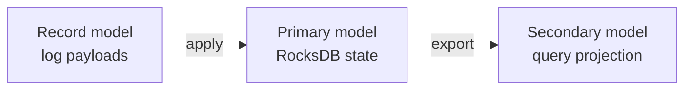
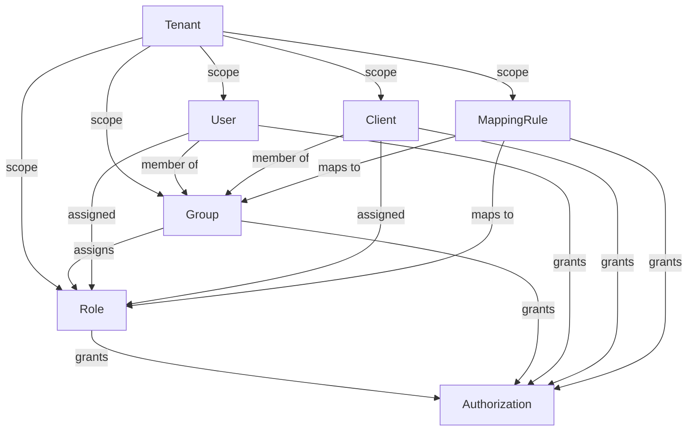
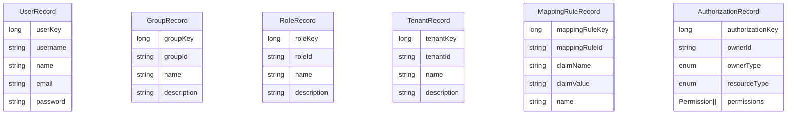
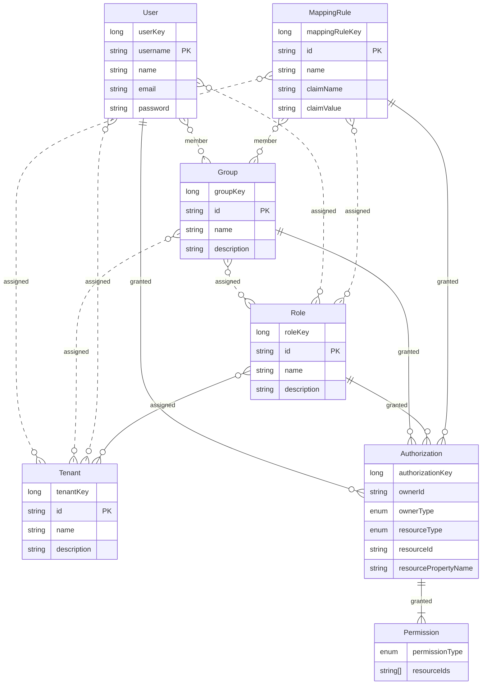
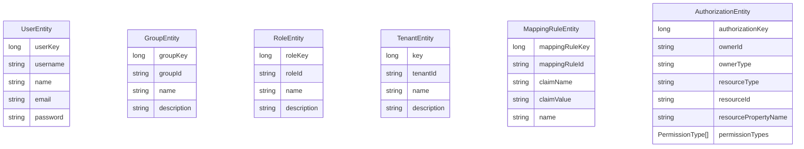

# Identity Data Model

## At a glance

- This is the runtime Identity model used by Orchestration Cluster Identity.
- `User` means a human identity in runtime IAM (username-based principal).
- The model exists in three related layers: record model, primary storage model, and secondary storage model.
- Commands are expressed as records, applied to primary storage, and then projected to secondary storage for queries.

## Model layers

| Layer | Purpose | Representative packages / symbols |
| --- | --- | --- |
| Record model | Command/event payloads written to the Zeebe log | `io.camunda.zeebe.protocol.impl.record.value.user.UserRecord`, `io.camunda.zeebe.protocol.impl.record.value.group.GroupRecord`, `io.camunda.zeebe.protocol.impl.record.value.tenant.TenantRecord`, `io.camunda.zeebe.protocol.impl.record.value.authorization.*` |
| Primary storage model | Source of truth for state transitions in Zeebe (RocksDB) | `io.camunda.zeebe.engine.state.user.DbUserState`, `io.camunda.zeebe.engine.state.tenant.DbTenantState`, `io.camunda.zeebe.engine.state.authorization.*` |
| Secondary storage model | Query projection in ES/OS/RDBMS | `io.camunda.search.entities.UserEntity`, `io.camunda.search.entities.GroupEntity`, `io.camunda.search.entities.RoleEntity`, `io.camunda.search.entities.TenantEntity`, `io.camunda.search.entities.AuthorizationEntity`, `io.camunda.search.entities.MappingRuleEntity` |

## Simplified view

### Cross-layer flow

This diagram shows the high-level data path across layers:

- Records represent intent in the Zeebe log.
- Primary storage applies records as source-of-truth state transitions.
- Secondary storage receives projected data for query/read workloads via exporters.

### Relationship view (conceptual, shared vocabulary)

This diagram shows the shared business vocabulary and its main relationships:

- `Tenant` is the top-level scope boundary.
- `User` and `Client` are principals that can be grouped and assigned roles.
- `MappingRule` represents a claim name and value pair from a JWT Authentication Token
- `Authorization` represents grants owned by principals, groups, roles, or mapping rules.
- The view is intentionally simplified (no storage-specific cardinalities or index details).

## Detailed view by layer

### 1) Record model (log payload shape)

- Focus: command and event payloads, not query-optimized documents.
- Common records for IAM entities: `UserRecord`, `GroupRecord`, `RoleRecord`, `TenantRecord`, `MappingRuleRecord`, `AuthorizationRecord`.

### 2) Primary storage model (RocksDB state)

- Focus: engine state optimized for deterministic command processing and key-based lookups.
- Backed by Zeebe state implementations in `io.camunda.zeebe.engine.state.*`.
- Entity relations are represented through state entries/indices (for example memberships and assignments), not as one relational schema.

### 3) Secondary storage model (search projection)

- Focus: query-ready documents/rows in ES/OS/RDBMS.
- Backed by `io.camunda.search.entities.*` records such as `UserEntity`, `RoleEntity`, `TenantEntity`, `AuthorizationEntity`, `MappingRuleEntity`.
- Relationship between entities is different, depending on ES/OS DB vs RDBMS.

## Primary vs secondary differences

| Concern | Primary storage model | Secondary storage model                |
| --- | --- |----------------------------------------|
| Role in architecture | Source of truth for command handling | Read model for query APIs              |
| Write path | Updated by command processing in engine | Updated by exporter pipeline           |
| Read pattern | Key/state access in engine internals | Filter/sort/search in REST query layer |
| Shape | State-centric, index-driven | Query-centric, document/row oriented   |
| Consistency | Immediate for command processing | Eventually consistent with primary     |
| Typical package | `io.camunda.zeebe.engine.state.*` | `io.camunda.search.entities.*`         |

## Entity cheat sheet

- `User`: human runtime principal, uniquely identified by `username`.
- `Client`: machine principal (service/client id) used for API access.
- `Group`: collection of principals (`User` or `Client`) to manage assignments in bulk.
- `Role`: reusable bundle for authorizations.
- `Tenant`: isolation boundary for runtime resources.
- `MappingRule`: token-claim based mapping from IdP claims to group/role/tenant membership and authorizations.
- `Authorization`: owner-to-resource grant (owner can be `User`, `Client`, `Group`, `Role`, or `MappingRule`).
- `Permission`: action scope within an authorization (for example READ/UPDATE style permissions depending on resource type).

## Unmanaged entities

Under the "simple mapping rule" feature, `User` and `Client` are not lifecycle-managed entities.
Membership and authorization relationships are resolved from the authenticated principal id
(`username` for users, client id for clients) instead of requiring explicit entity persistence first.
