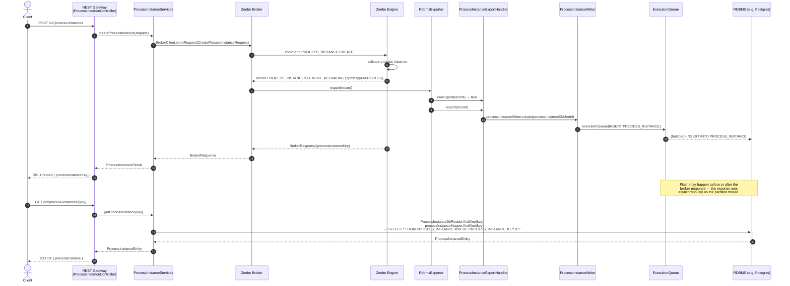

# RDBMS Data Model Reference

This document describes the tables that make up the RDBMS secondary-storage schema, how they
relate to each other, and how records flow through the system — from the Zeebe engine into the
database and back out through the REST API.

For a description of the general architecture (CQRS, `RdbmsService`, `ExecutionQueue`,
`HistoryCleanupService`), see
[rdbms_architecture_docs.md](./rdbms_architecture_docs.md).

---

## 1. Table Overview

Tables are grouped by concern.

### Infrastructure

| Table                  | Description                                                                                                                                                                            |
|------------------------|----------------------------------------------------------------------------------------------------------------------------------------------------------------------------------------|
| `EXPORTER_POSITION`    | Tracks the last successfully exported Zeebe record position per partition and exporter ID. Used to resume exporting after a broker restart without replaying already-exported records. |
| `RDBMS_SCHEMA_VERSION` | Single-row table that stores the current RDBMS schema version string. Used to detect version mismatches at startup.                                                                    |
| `WEB_SESSION`          | HTTP session store for the Camunda web applications (Spring Session JDBC). Not populated by the exporter.                                                                              |

### Process / Decision Definitions (static model)

These tables are written once at deploy time and never updated (except when a new version of the
same definition is deployed, which creates a new row with a higher `VERSION`).

| Table                         | Description                                                                                                                                                     |
|-------------------------------|-----------------------------------------------------------------------------------------------------------------------------------------------------------------|
| `PROCESS_DEFINITION`          | Stores deployed BPMN process definitions, including the full BPMN XML (`BPMN_XML` CLOB), version, tenant, and the optional linked form ID.                      |
| `DECISION_DEFINITION`         | Stores DMN decision definitions. Each row references a `DECISION_REQUIREMENTS` group via `DECISION_REQUIREMENTS_KEY`.                                           |
| `DECISION_REQUIREMENTS`       | Stores a complete DMN Decision Requirements Diagram (DRD), including the XML source. One `DECISION_REQUIREMENTS` groups multiple `DECISION_DEFINITION` entries. |
| `FORM`                        | Stores Camunda embedded form schemas (JSON). Forms can be referenced by `PROCESS_DEFINITION.FORM_ID` or `USER_TASK.FORM_KEY`.                                   |
| `DEPLOYED_RESOURCE`           | Generic deployed resource (e.g. Connector templates, RPA scripts, AI Agent configurations). Linked to a deployment via `DEPLOYMENT_KEY`.                        |
| `PROCESS_DEF_VAR_NAME_LOOKUP` | Index of all variable names that appear within a given process definition. Used to accelerate variable-name filtering queries.                                  |

### Process Instance Runtime

These tables represent the live (and historical) state of process execution. Most rows are
inserted when execution starts and updated or deleted as execution progresses.

| Table                             | Description                                                                                                                                                                                                                                                                                                                                         |
|-----------------------------------|-----------------------------------------------------------------------------------------------------------------------------------------------------------------------------------------------------------------------------------------------------------------------------------------------------------------------------------------------------|
| `PROCESS_INSTANCE`                | One row per process instance (root or sub-process). Tracks `STATE` (`ACTIVE`, `COMPLETED`, `CANCELED`), start/end dates, parent keys for sub-processes, incident count, `TREE_PATH`, and `HISTORY_CLEANUP_DATE` for TTL-based cleanup.                                                                                                              |
| `PROCESS_INSTANCE_TAG`            | Multi-value tag list for a `PROCESS_INSTANCE`. Rows are deleted via FK cascade when the parent process instance is deleted.                                                                                                                                                                                                                         |
| `FLOW_NODE_INSTANCE`              | One row per executing BPMN element (task, gateway, event, sub-process, etc.). Also known as *element instance* in the Zeebe protocol; the table name reflects the legacy Operate terminology. Tracks `STATE` (`ACTIVE`, `COMPLETED`, `TERMINATED`), type, scope, start/end dates, and incident references. Not to be confused with `SEQUENCE_FLOW`. |
| `VARIABLE`                        | One row per variable per scope. Scoped to a `FLOW_NODE_INSTANCE` (`SCOPE_KEY` / `ELEMENT_INSTANCE_KEY`) and belongs to a `PROCESS_INSTANCE`. A variable that is updated in place gets the same `VAR_KEY` — only the value columns change. Large values are stored in `VAR_FULL_VALUE` (CLOB) with a truncated preview in `VAR_VALUE`.               |
| `INCIDENT`                        | One row per incident. `STATE` transitions from `ACTIVE` to `RESOLVED`. References the `FLOW_NODE_INSTANCE` and optionally the `JOB` that caused it. Incident counter on `PROCESS_INSTANCE.NUM_INCIDENTS` is kept in sync by the exporter.                                                                                                           |
| `JOB`                             | One row per job (service task activation, boundary events, execution listeners, etc.). Tracks `TYPE`, `WORKER`, `STATE`, `RETRIES`, `DEADLINE`, `KIND` (regular job vs. listener), and `LISTENER_EVENT_TYPE`. Deleted when the process instance is cleaned up.                                                                                      |
| `USER_TASK`                       | One row per user task instance. Tracks `ASSIGNEE`, `STATE`, due/follow-up dates, `PRIORITY`, and a reference to the linked `FORM_KEY`.                                                                                                                                                                                                              |
| `CANDIDATE_USER`                  | One row per candidate user per user task. Deleted via FK cascade with the parent `USER_TASK`.                                                                                                                                                                                                                                                       |
| `CANDIDATE_GROUP`                 | One row per candidate group per user task. Deleted via FK cascade with the parent `USER_TASK`.                                                                                                                                                                                                                                                      |
| `USER_TASK_TAG`                   | Tag list for a user task. Deleted via FK cascade with the parent `USER_TASK`.                                                                                                                                                                                                                                                                       |
| `MESSAGE_SUBSCRIPTION`            | Tracks active and recently processed message/event subscriptions (intermediate catch events, receive tasks, boundary events). `MESSAGE_SUBSCRIPTION_STATE` values: `CREATED`, `CORRELATED`, `DELETED`, `MIGRATED`. The row stays alive after correlation, updated with the new state.                                                               |
| `CORRELATED_MESSAGE_SUBSCRIPTION` | Append-only correlation log. One row is inserted each time a message subscription is correlated. Provides the history of which messages were received by which element instances.                                                                                                                                                                   |
| `SEQUENCE_FLOW`                   | Records every sequence flow (edge in the BPMN diagram) that has been taken within a process instance. The combination `(FLOW_NODE_ID, PROCESS_INSTANCE_KEY)` is the primary key — each edge is recorded at most once per instance. Rows are deleted when the engine emits `SEQUENCE_FLOW_DELETED`.                                                  |
| `DECISION_INSTANCE`               | One row per DMN decision evaluation. References `DECISION_DEFINITION` and the `FLOW_NODE_INSTANCE` that triggered the evaluation. `HISTORY_CLEANUP_DATE` is set like `PROCESS_INSTANCE`.                                                                                                                                                            |
| `DECISION_INSTANCE_INPUT`         | Input values for a single `DECISION_INSTANCE` evaluation. Deleted via FK cascade.                                                                                                                                                                                                                                                                   |
| `DECISION_INSTANCE_OUTPUT`        | Output values (matched rules) for a single `DECISION_INSTANCE` evaluation. Deleted via FK cascade.                                                                                                                                                                                                                                                  |
| `WAIT_STATE`                      | Captures the current wait state of an element instance (e.g. waiting for a job, waiting for a message). One row per active wait state per element instance. Deleted when the element instance leaves the wait state.                                                                                                                                |
| `AGENT_INSTANCE`                  | One row per AI Agent task execution. Tracks token usage, model/provider, status, and tool call counts.                                                                                                                                                                                                                                              |
| `AGENT_INSTANCE_ELEMENT_INSTANCE` | Maps an `AGENT_INSTANCE` to the element instance(s) it is executing within. Deleted via FK cascade.                                                                                                                                                                                                                                                 |

### Batch Operations

| Table                   | Description                                                                                                                                               |
|-------------------------|-----------------------------------------------------------------------------------------------------------------------------------------------------------|
| `BATCH_OPERATION`       | One row per batch operation (e.g. "cancel 500 process instances"). Tracks overall `STATE`, counters (total/failed/completed), and `HISTORY_CLEANUP_DATE`. |
| `BATCH_OPERATION_ITEM`  | One row per item within a batch operation. Tracks per-item `STATE` and `ERROR_MESSAGE`. Deleted via FK cascade.                                           |
| `BATCH_OPERATION_ERROR` | Partition-level error records for a batch operation. Deleted via FK cascade.                                                                              |
| `HISTORY_DELETION`      | Staging table that records which resources (by key and type) need to be deleted as part of a history-cleanup batch operation.                             |

### Identity and Access Management

| Table                      | Description                                                                                                                                                                                                          |
|----------------------------|----------------------------------------------------------------------------------------------------------------------------------------------------------------------------------------------------------------------|
| `USER_`                    | Camunda-managed users (used with local authentication). Stores username, display name, email, and a hashed password.                                                                                                 |
| `TENANT` + `TENANT_MEMBER` | Multi-tenant configuration. `TENANT_MEMBER` maps users, groups, or roles (identified by `ENTITY_TYPE`) to a tenant.                                                                                                  |
| `ROLES` + `ROLE_MEMBER`    | Roles and their members. `ROLE_MEMBER` uses the same `ENTITY_TYPE` / `ENTITY_ID` pattern as `TENANT_MEMBER`.                                                                                                         |
| `GROUP_` + `GROUP_MEMBER`  | Groups and their members.                                                                                                                                                                                            |
| `AUTHORIZATIONS`           | Explicit permission assignments: which owner (`OWNER_ID`/`OWNER_TYPE`) has which `PERMISSION_TYPE` for which `RESOURCE_TYPE`/`RESOURCE_ID`. No single primary key because all columns together form the logical key. |
| `MAPPING_RULES`            | Claim-based mapping rules that map an OIDC token claim value to a Camunda identity.                                                                                                                                  |

### Audit and Metrics

| Table                                            | Description                                                                                                                                                                                           |
|--------------------------------------------------|-------------------------------------------------------------------------------------------------------------------------------------------------------------------------------------------------------|
| `AUDIT_LOG`                                      | Append-only audit trail. One row per relevant operation (process instance start/end, user task assignment, deployment, etc.). Carries actor, category, entity references, and `HISTORY_CLEANUP_DATE`. |
| `USAGE_METRIC`                                   | Aggregated usage counters per time window and tenant (e.g. number of root process instances started). Used for license reporting.                                                                     |
| `USAGE_METRIC_TU`                                | Task-user usage metrics — unique assignee hashes per time window. Used to count distinct task users for licensing.                                                                                    |
| `JOB_METRICS_BATCH`                              | Pre-aggregated job statistics per time window, job type, and worker. Used to serve the job statistics API without scanning the full `JOB` table.                                                      |
| `CLUSTER_VARIABLE`                               | Cluster-scoped (non-process) variables. Analogous to `VARIABLE` but not tied to any process instance.                                                                                                 |
| `GLOBAL_LISTENER` + `GLOBAL_LISTENER_EVENT_TYPE` | Registered global event listeners and the event types they subscribe to.                                                                                                                              |

---

## 2. Table Relationships

The RDBMS schema is a **read model**: foreign key constraints exist only for child tables whose
rows are always inserted and deleted together with their parent (e.g. `CANDIDATE_USER` /
`USER_TASK`). Most cross-table references are plain columns without a database-level foreign key,
because the data consistency guarantee lives in the Zeebe log — it is the engine's
responsibility to ensure that, for example, a `FLOW_NODE_INSTANCE` record always refers to an
existing `PROCESS_INSTANCE`. Enforcing this at the database level would add write overhead and
complicate out-of-order replay scenarios.

```mermaid
erDiagram
  PROCESS_DEFINITION {
    bigint PROCESS_DEFINITION_KEY PK
  }

  PROCESS_INSTANCE {
    bigint PROCESS_INSTANCE_KEY PK
    bigint ROOT_PROCESS_INSTANCE_KEY
    bigint PROCESS_DEFINITION_KEY
    bigint PARENT_PROCESS_INSTANCE_KEY
    bigint PARENT_ELEMENT_INSTANCE_KEY
  }

  PROCESS_INSTANCE_TAG {
    bigint PROCESS_INSTANCE_KEY FK
  }

  FLOW_NODE_INSTANCE {
    bigint FLOW_NODE_INSTANCE_KEY PK
    bigint FLOW_NODE_SCOPE_KEY
    bigint PROCESS_INSTANCE_KEY
    bigint PROCESS_DEFINITION_KEY
    bigint INCIDENT_KEY
  }

  VARIABLE {
    bigint VAR_KEY PK
    bigint PROCESS_INSTANCE_KEY
    bigint SCOPE_KEY
    bigint ELEMENT_INSTANCE_KEY
  }

  INCIDENT {
    bigint INCIDENT_KEY PK
    bigint FLOW_NODE_INSTANCE_KEY
    bigint PROCESS_INSTANCE_KEY
    bigint JOB_KEY
  }

  JOB {
    bigint JOB_KEY PK
    bigint PROCESS_INSTANCE_KEY
    bigint ELEMENT_INSTANCE_KEY
  }

  USER_TASK {
    bigint USER_TASK_KEY PK
    bigint PROCESS_INSTANCE_KEY
    bigint ELEMENT_INSTANCE_KEY
    bigint PROCESS_DEFINITION_KEY
    bigint FORM_KEY
  }

  CANDIDATE_USER {
    bigint USER_TASK_KEY FK
  }

  CANDIDATE_GROUP {
    bigint USER_TASK_KEY FK
  }

  SEQUENCE_FLOW {
    string FLOW_NODE_ID PK
    bigint PROCESS_INSTANCE_KEY PK
    bigint PROCESS_DEFINITION_KEY
  }

  MESSAGE_SUBSCRIPTION {
    bigint MESSAGE_SUBSCRIPTION_KEY PK
    bigint PROCESS_INSTANCE_KEY
    bigint FLOW_NODE_INSTANCE_KEY
  }

  DECISION_INSTANCE {
    string DECISION_INSTANCE_ID PK
    bigint PROCESS_INSTANCE_KEY
    bigint FLOW_NODE_INSTANCE_KEY
    bigint DECISION_DEFINITION_KEY
  }

  DECISION_DEFINITION {
    bigint DECISION_DEFINITION_KEY PK
    bigint DECISION_REQUIREMENTS_KEY
  }

  DECISION_REQUIREMENTS {
    bigint DECISION_REQUIREMENTS_KEY PK
  }

  DECISION_INSTANCE_INPUT {
    string DECISION_INSTANCE_ID FK
  }

  DECISION_INSTANCE_OUTPUT {
    string DECISION_INSTANCE_ID FK
  }

  FORM {
    bigint FORM_KEY PK
  }

  AUDIT_LOG {
    string AUDIT_LOG_KEY PK
    bigint PROCESS_INSTANCE_KEY
    bigint PROCESS_DEFINITION_KEY
    bigint ELEMENT_INSTANCE_KEY
    bigint USER_TASK_KEY
    bigint JOB_KEY
  }

  BATCH_OPERATION {
    string BATCH_OPERATION_KEY PK
  }

  BATCH_OPERATION_ITEM {
    string BATCH_OPERATION_KEY FK
    bigint ITEM_KEY PK
    bigint PROCESS_INSTANCE_KEY
  }

  PROCESS_DEFINITION ||--o{ PROCESS_INSTANCE: "PROCESS_DEFINITION_KEY"
  PROCESS_INSTANCE ||--o{ PROCESS_INSTANCE: "PARENT_PROCESS_INSTANCE_KEY (sub-process)"
  PROCESS_INSTANCE ||--o{ PROCESS_INSTANCE_TAG: "FK cascade"
  PROCESS_INSTANCE ||--o{ FLOW_NODE_INSTANCE: "PROCESS_INSTANCE_KEY"
  PROCESS_INSTANCE ||--o{ VARIABLE: "PROCESS_INSTANCE_KEY"
  PROCESS_INSTANCE ||--o{ INCIDENT: "PROCESS_INSTANCE_KEY"
  PROCESS_INSTANCE ||--o{ JOB: "PROCESS_INSTANCE_KEY"
  PROCESS_INSTANCE ||--o{ USER_TASK: "PROCESS_INSTANCE_KEY"
  PROCESS_INSTANCE ||--o{ SEQUENCE_FLOW: "PROCESS_INSTANCE_KEY"
  PROCESS_INSTANCE ||--o{ MESSAGE_SUBSCRIPTION: "PROCESS_INSTANCE_KEY"
  PROCESS_INSTANCE ||--o{ DECISION_INSTANCE: "PROCESS_INSTANCE_KEY"
  PROCESS_INSTANCE ||--o{ AUDIT_LOG: "PROCESS_INSTANCE_KEY"
  PROCESS_INSTANCE ||--o{ BATCH_OPERATION_ITEM: "PROCESS_INSTANCE_KEY"
  FLOW_NODE_INSTANCE ||--o{ VARIABLE: "ELEMENT_INSTANCE_KEY (scope)"
  FLOW_NODE_INSTANCE ||--o{ INCIDENT: "FLOW_NODE_INSTANCE_KEY"
  FLOW_NODE_INSTANCE ||--o{ JOB: "ELEMENT_INSTANCE_KEY"
  FLOW_NODE_INSTANCE ||--o{ USER_TASK: "ELEMENT_INSTANCE_KEY"
  FLOW_NODE_INSTANCE ||--o{ MESSAGE_SUBSCRIPTION: "FLOW_NODE_INSTANCE_KEY"
  FLOW_NODE_INSTANCE ||--o{ DECISION_INSTANCE: "FLOW_NODE_INSTANCE_KEY"
  JOB ||--o{ INCIDENT: "JOB_KEY"
  USER_TASK ||--o{ CANDIDATE_USER: "FK cascade"
  USER_TASK ||--o{ CANDIDATE_GROUP: "FK cascade"
  FORM ||--o{ USER_TASK: "FORM_KEY"
  DECISION_DEFINITION ||--o{ DECISION_INSTANCE: "DECISION_DEFINITION_KEY"
  DECISION_REQUIREMENTS ||--o{ DECISION_DEFINITION: "DECISION_REQUIREMENTS_KEY"
  DECISION_INSTANCE ||--o{ DECISION_INSTANCE_INPUT: "FK cascade"
  DECISION_INSTANCE ||--o{ DECISION_INSTANCE_OUTPUT: "FK cascade"
  BATCH_OPERATION ||--o{ BATCH_OPERATION_ITEM: "FK cascade"
```



> **Note on foreign keys:** Hard database-level foreign keys (`FK cascade`) exist only for child
> tables that have no independent lifecycle (`PROCESS_INSTANCE_TAG`, `CANDIDATE_USER`,
> `CANDIDATE_GROUP`, `USER_TASK_TAG`, `DECISION_INSTANCE_INPUT`, `DECISION_INSTANCE_OUTPUT`,
> `BATCH_OPERATION_ITEM`, `BATCH_OPERATION_ERROR`, `AGENT_INSTANCE_ELEMENT_INSTANCE`). All
> other cross-table references (shown as `"column-name"` labels) are plain columns without FK
> enforcement. This is intentional: the Zeebe log is the source of truth for consistency; the
> RDBMS is a derived read model.

---

## 3. End-to-End Example: Starting a Process Instance

The following sequence shows what happens when a client starts a process instance through the
REST API and then reads it back.

> This section focuses on the RDBMS-specific path. The general CQRS pattern (RDBMS Exporter,
> `RdbmsService`, readers/writers) is described in
> [rdbms_architecture_docs.md § 5.2](./rdbms_architecture_docs.md).



The same pattern applies to all other entities: the exporter handler picks up the Zeebe record,
delegates to a writer that enqueues SQL statements, the `ExecutionQueue` flushes them in a
batch, and readers serve the data from the RDBMS through the MyBatis mapper.

---

## 4. Data Lifecycle

Different entity types have fundamentally different write patterns depending on their role in
the system.

### 4.1 Write-once entities: `SEQUENCE_FLOW`

Sequence flow records (`SEQUENCE_FLOW`) represent BPMN edges that have been taken during
execution. They are **inserted once** and never updated; their only lifecycle event other than
the initial insert is deletion.

| Zeebe record intent                      | Handler                     | DB operation                              |
|------------------------------------------|-----------------------------|-------------------------------------------|
| `PROCESS_INSTANCE:SEQUENCE_FLOW_TAKEN`   | `SequenceFlowExportHandler` | `INSERT` (idempotent `createIfNotExists`) |
| `PROCESS_INSTANCE:SEQUENCE_FLOW_DELETED` | `SequenceFlowExportHandler` | `DELETE`                                  |

The composite primary key `(FLOW_NODE_ID, PROCESS_INSTANCE_KEY)` ensures that the same edge is
only stored once per process instance even if the engine emits duplicate `SEQUENCE_FLOW_TAKEN`
events (e.g. in a loop). When the Zeebe engine prunes sequence flows from its internal state,
it emits `SEQUENCE_FLOW_DELETED`, which triggers the corresponding `DELETE`.

Because `SEQUENCE_FLOW` has no `HISTORY_CLEANUP_DATE`, rows belonging to a completed process
instance are removed as part of the bulk history cleanup sweep (cascade via
`PROCESS_INSTANCE_KEY`).

```
Code trace:
  SequenceFlowExportHandler  zeebe/exporters/rdbms-exporter/.../handlers/SequenceFlowExportHandler.java
  SequenceFlowWriter         db/rdbms/src/main/java/io/camunda/db/rdbms/write/service/SequenceFlowWriter.java
```

### 4.2 Short-lived entities: `FLOW_NODE_INSTANCE` and `MESSAGE_SUBSCRIPTION`

`FLOW_NODE_INSTANCE` rows track a single BPMN element activation. Most rows live only for the
duration of the element's execution:

| Zeebe record intent                   | Handler                 | DB operation                                   |
|---------------------------------------|-------------------------|------------------------------------------------|
| `PROCESS_INSTANCE:ELEMENT_ACTIVATING` | `FlowNodeExportHandler` | `INSERT` (state: `ACTIVE`)                     |
| `PROCESS_INSTANCE:ELEMENT_MIGRATED`   | `FlowNodeExportHandler` | `UPDATE` (process definition fields)           |
| `PROCESS_INSTANCE:ELEMENT_COMPLETED`  | `FlowNodeExportHandler` | `UPDATE` (state: `COMPLETED`, `END_DATE` set)  |
| `PROCESS_INSTANCE:ELEMENT_TERMINATED` | `FlowNodeExportHandler` | `UPDATE` (state: `TERMINATED`, `END_DATE` set) |

`PROCESS`, `SEQUENCE_FLOW` element types are excluded — the process-level element is handled by
`ProcessInstanceExportHandler`, and sequence flows by `SequenceFlowExportHandler`.

`MESSAGE_SUBSCRIPTION` rows are similarly short-lived. They are created when an intermediate
catch event or receive task starts waiting, and updated (not deleted) when the subscription is
processed:

| Zeebe record intent                       | Handler                            | DB operation                   |
|-------------------------------------------|------------------------------------|--------------------------------|
| `PROCESS_MESSAGE_SUBSCRIPTION:CREATED`    | `MessageSubscriptionExportHandler` | `INSERT` (state: `CREATED`)    |
| `PROCESS_MESSAGE_SUBSCRIPTION:CORRELATED` | `MessageSubscriptionExportHandler` | `UPDATE` (state: `CORRELATED`) |
| `PROCESS_MESSAGE_SUBSCRIPTION:DELETED`    | `MessageSubscriptionExportHandler` | `UPDATE` (state: `DELETED`)    |
| `PROCESS_MESSAGE_SUBSCRIPTION:MIGRATED`   | `MessageSubscriptionExportHandler` | `UPDATE` (all fields)          |

Updating rather than deleting on correlation and deletion preserves the record for audit and
history purposes until the process instance's `HISTORY_CLEANUP_DATE` is reached.

```
Code trace:
  FlowNodeExportHandler              zeebe/exporters/rdbms-exporter/.../handlers/FlowNodeExportHandler.java
  FlowNodeInstanceWriter             db/rdbms/src/main/java/io/camunda/db/rdbms/write/service/FlowNodeInstanceWriter.java
  MessageSubscriptionExportHandler   zeebe/exporters/rdbms-exporter/.../handlers/MessageSubscriptionExportHandler.java
  MessageSubscriptionWriter          db/rdbms/src/main/java/io/camunda/db/rdbms/write/service/MessageSubscriptionWriter.java
```

### 4.3 Long-lived entities: `PROCESS_INSTANCE` and `VARIABLE`

`PROCESS_INSTANCE` rows persist from creation until TTL-based history cleanup removes them:

| Zeebe record intent                                      | Handler                        | DB operation                                                       |
|----------------------------------------------------------|--------------------------------|--------------------------------------------------------------------|
| `PROCESS_INSTANCE:ELEMENT_ACTIVATING` (bpmnType=PROCESS) | `ProcessInstanceExportHandler` | `INSERT` (state: `ACTIVE`)                                         |
| `PROCESS_INSTANCE:ELEMENT_MIGRATED`                      | `ProcessInstanceExportHandler` | `UPDATE` (process definition, tree path)                           |
| `PROCESS_INSTANCE:ELEMENT_COMPLETED`                     | `ProcessInstanceExportHandler` | `UPDATE` (state: `COMPLETED`, `END_DATE` + `HISTORY_CLEANUP_DATE`) |
| `PROCESS_INSTANCE:ELEMENT_TERMINATED`                    | `ProcessInstanceExportHandler` | `UPDATE` (state: `CANCELED`, `END_DATE` + `HISTORY_CLEANUP_DATE`)  |
| After TTL expires                                        | `HistoryCleanupService`        | `DELETE` (batch, by `HISTORY_CLEANUP_DATE`)                        |

When a root process instance completes, `ProcessInstanceExportHandler` also calls
`HistoryCleanupService.scheduleProcessForHistoryCleanup(...)`, which propagates the
`HISTORY_CLEANUP_DATE` to all related tables (`VARIABLE`, `FLOW_NODE_INSTANCE`, `INCIDENT`,
`JOB`, `AUDIT_LOG`, etc.) in a single batch.

`VARIABLE` rows share the same long-lived pattern but also support in-place value updates:

| Zeebe record intent | Handler                 | DB operation                                     |
|---------------------|-------------------------|--------------------------------------------------|
| `VARIABLE:CREATED`  | `VariableExportHandler` | `INSERT`                                         |
| `VARIABLE:UPDATED`  | `VariableExportHandler` | `UPDATE` (value columns only)                    |
| `VARIABLE:MIGRATED` | `VariableExportHandler` | `UPDATE` (`PROCESS_DEFINITION_ID` only)          |
| After TTL expires   | `HistoryCleanupService` | `DELETE` (cascade from process instance cleanup) |

The `VAR_KEY` (primary key) is stable throughout the variable's lifetime — an update in Zeebe
produces the same key and triggers an `UPDATE`, not a new `INSERT`.

```
Code trace:
  ProcessInstanceExportHandler  zeebe/exporters/rdbms-exporter/.../handlers/ProcessInstanceExportHandler.java
  ProcessInstanceWriter         db/rdbms/src/main/java/io/camunda/db/rdbms/write/service/ProcessInstanceWriter.java
  VariableExportHandler         zeebe/exporters/rdbms-exporter/.../handlers/VariableExportHandler.java
  VariableWriter                db/rdbms/src/main/java/io/camunda/db/rdbms/write/service/VariableWriter.java
  HistoryCleanupService         db/rdbms/src/main/java/io/camunda/db/rdbms/write/service/HistoryCleanupService.java
```
