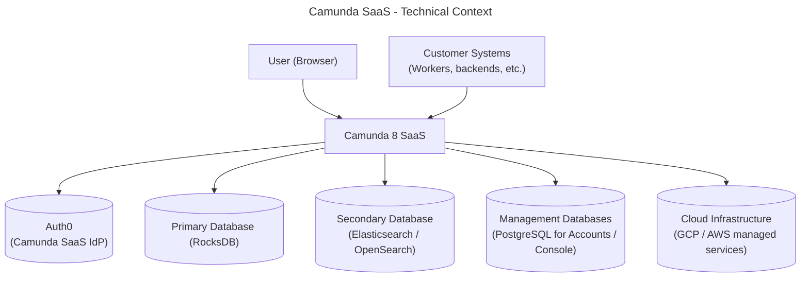
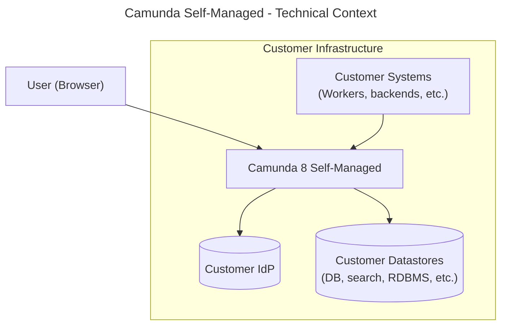
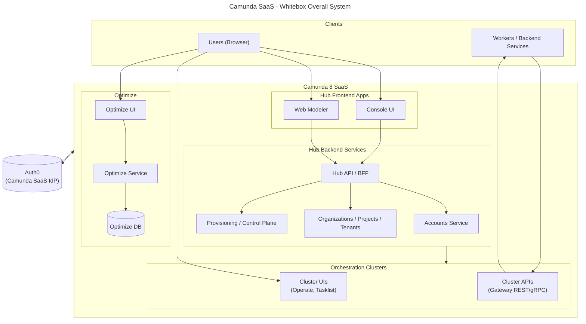
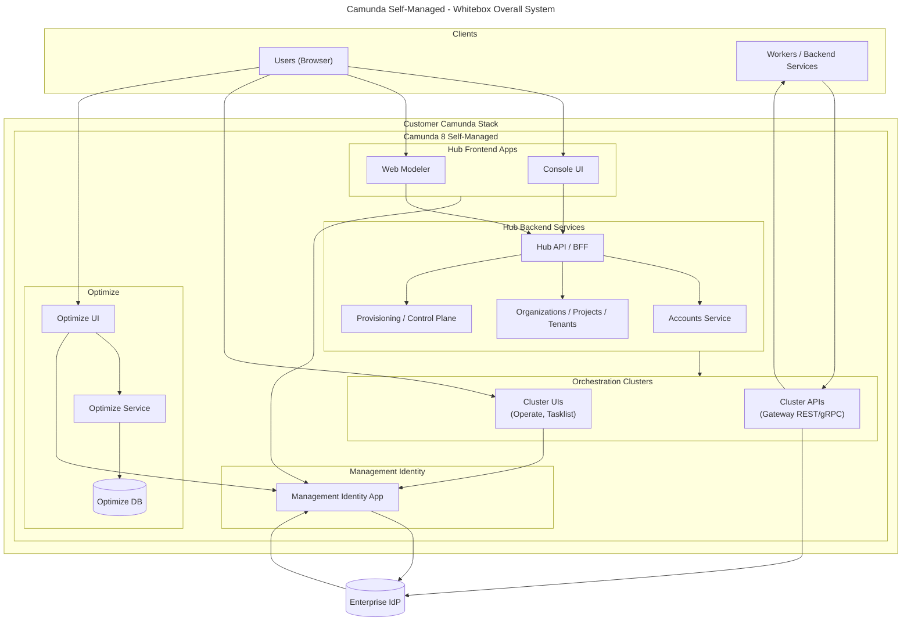

# 1. Introduction and goals

WIP!!!

This document describes the overall Camunda 8 architecture (Hub and Orchestration Clusters) as of **Camunda 8.9**, before any future “unified identity” consolidation between Hub and runtime.

Camunda provides a cloud-native orchestration platform composed of:

- Camunda Hub: central entry point for account, tenant, and configuration management, as well as modeling and governance features.
- Orchestration Clusters: runtime environments for executing process workloads.

The goal of this document is to:

- Provide a shared, high-level mental model of the complete Camunda system (Hub and Orchestration Clusters).
- Distinguish clearly between SaaS and Self-Managed deployments.
- Serve as a starting point for more detailed arc42 sections (constraints, runtime views, etc.).

---

# 3. System context and scope

## 3.2 Technical context – Camunda SaaS

Key aspects:

- Camunda 8 SaaS (Hub and Orchestration Clusters) is fully operated and hosted by Camunda; customers access all UIs via a browser and all APIs via the public internet.
- Identity for Hub and runtime UIs/APIs is provided by Auth0 together with the internal Accounts Service; there is no separate Management Identity in SaaS.
- Persistence, search, and management data stores (primary RocksDB, secondary Elasticsearch/OpenSearch, management PostgreSQL) as well as cloud infrastructure services (GCP/AWS) are internal dependencies of the Camunda 8 SaaS black box and managed by Camunda.
- External workers and systems interact with the Orchestration Cluster APIs that are part of the Camunda 8 SaaS black box; Hub APIs are primarily used for account/organization/tenant and configuration concerns, not for direct process execution.

## 3.3 Technical context – Camunda Self-Managed

Key aspects:

- Camunda 8 Self-Managed (Hub and Orchestration Clusters) is deployed and operated entirely inside the customer's infrastructure and network.
- From a technical context perspective, Camunda 8 Self-Managed behaves as a single black box application inside customer infrastructure: customer systems and workers call its APIs, and it in turn relies on customer-provided infrastructure services and IdP.
- The customer is responsible for provisioning and operating all required infrastructure services around Camunda 8 (databases, search, observability, ingress, networking, backups, etc.).

---

# 5. Building block view

## 5.1 Whitebox overall system – Camunda SaaS

This section provides a whitebox view of the main logical building blocks in Camunda SaaS, their responsibilities, and high-level interactions.

Main building blocks (SaaS):

- Hub frontend apps: Console UI and Web Modeler as browser-based entry points for account, tenant, environment, and modeling/governance features.
- Hub backend services: Accounts, organization/project/tenant configuration, provisioning/control plane, and Hub API/BFF; these services back the Hub frontends and persist Hub-level state in management databases.
- Orchestration Clusters (public surface): cluster UIs (Operate, Tasklist) and cluster APIs (gateway REST/gRPC) used by users and workers; internal details of the engine and persistence are intentionally not shown in this whitebox.
- Orchestration Cluster runtime internals (conceptual, not shown in the diagram): Zeebe engine, cluster identity, and primary/secondary datastores providing execution, IAM enforcement, and search/query capabilities.
- Optimize: analytics and reporting application with its own UI, backend service, and dedicated Optimize DB; not part of Hub, but integrated into Camunda 8 SaaS and reusing the same organizations/tenants and identity setup.
- Auth0 (Camunda SaaS IdP): SaaS identity provider used for Hub, runtime, and Optimize authentication, integrated with Accounts and Cluster Identity.

## 5.2 Whitebox overall system – Camunda Self-Managed

Main building blocks (Self-Managed):

- Hub frontend apps (Self-Managed): Console UI and Web Modeler with the same logical responsibilities as in SaaS, but deployed and operated by the customer.
- Hub backend services (Self-Managed): Accounts, organization/project/tenant configuration, provisioning/control plane, and Hub API/BFF; same logical responsibilities as in SaaS, but talking to customer-managed datastores.
- Management Identity (Self-Managed): Hub-level IAM for Console, Web Modeler, and Optimize; integrates with the customer’s Enterprise IdP and issues tokens consumed by these apps.
- Orchestration Clusters (public surface): cluster UIs (Operate, Tasklist) and cluster APIs (gateway REST/gRPC) used by users and workers; engine, storage, and other internals are not shown in this whitebox, but mirror the SaaS responsibilities.
- Orchestration Cluster runtime internals (conceptual, not shown in the diagram): Zeebe engine, cluster identity, and primary/secondary datastores running in customer infrastructure and managed by the customer.
- Optimize (Self-Managed): separate application with its own UI, backend service, and dedicated Optimize DB; integrates with Hub concepts (organizations, tenants) and reuses Management Identity and the Enterprise IdP for authentication.
- Enterprise IdP: customer-provided IdP for SSO and JWTs; integrates with Management Identity (for Hub and Optimize) and Cluster Identity (for runtime UIs/APIs).
- Observability stack (conceptual, not shown): customer-provided logging, metrics, and tracing for Hub, Optimize, and clusters.

---

# 11. Glossary (initial, high-level)

- Camunda Hub: Central entry point for managing organizations, tenants, projects, clusters, and modeling/governance capabilities.
- Orchestration Cluster: Runtime deployment containing the workflow engine, cluster UIs, cluster identity, and runtime APIs.
- Management Identity (Self-Managed): Standalone identity app for Hub components such as Web Modeler, Console, and Optimize in Self-Managed environments.
- Cluster Identity: Identity and access management embedded in an Orchestration Cluster, enforcing runtime access for cluster UIs and APIs.
- Auth0 (Camunda SaaS IdP): Hosted identity provider used by Camunda 8 SaaS for Hub, runtime, and Optimize authentication.
- Enterprise IdP: External identity provider (e.g., Entra ID, Okta, Keycloak) integrating with Self-Managed Hub, Optimize, and Cluster Identity for SSO and token-based access.
- Worker / Automation: Non-interactive client calling Camunda APIs or processing work items.
