# Unified Identity Architecture

**IMPORTANT**: This document is a work in progress and reflects the current thinking on the unified identity architecture for Camunda Hub and Orchestration Clusters. It is intended to provide a high-level overview of the proposed design, including key components, interactions, and deployment models. The architecture is subject to change as we iterate on the design and gather feedback from stakeholders.

---

## 1. Introduction and goals

This document describes the planned Unified Identity Architecture for Camunda Hub and Orchestration Clusters in an arc42-style structure. It:

- Summarizes the current identity architecture across Camunda platform components (OC Identity, Management Identity, SaaS Auth0).
- Proposes a target architecture with a single identity plane, implemented as a hexagonal library reused in Hub and Orchestration Clusters.
- Shows how the architecture supports multiple engines per cluster and multi-tenancy.
- Emphasizes that standalone Orchestration Cluster (without Hub) remains a first-class deployment option.
- Outlines how a single shared frontend and pluggable backends (persistence, OC command creation, etc.) fit into the design.

IMPORTANT: This document shows the final architecture, we won’t be able to implement it by October.
We need to break the project down into several iterations with interim goals until we actually reach the endgame.

---

## 2. Current identity architecture (Camunda platform today)

### 2.1 Identity components

Today identity responsibilities are split across several components:

- **Orchestration Cluster Identity (OC Identity)**
  - Embedded into the Orchestration Cluster runtime.
  - Manages runtime authentication and fine-grained authorizations (process definitions, instances, tasks, tenants, cluster APIs) for Zeebe, Operate, Tasklist, and OC APIs.

- **Management Identity**
  - Separate service used to control access to Web Modeler, Console, and Optimize and other management-plane functions in earlier releases.
  - Uses Keycloak or an external OIDC provider plus its own SQL database in self-managed deployments (see existing Management Identity arc42 docs).

- **SaaS Auth0 tenant (Console / Hub)**
  - In SaaS today, Console and other management-side UIs use a Camunda-operated Auth0 tenant as their IdP/broker.
  - From the target-architecture perspective, this is an internal broker/IdP implementation detail, not part of the long-term reference model.

- **Customer Enterprise IdPs**
  - In self-managed and in the target state, the Enterprise IdP is always the customer’s IdP (Entra, Okta, Keycloak, etc.), integrated via standard OIDC.
  - SAML is supported via Keycloak.

### 2.2 Current high-level structure

#### 2.2.1 SaaS

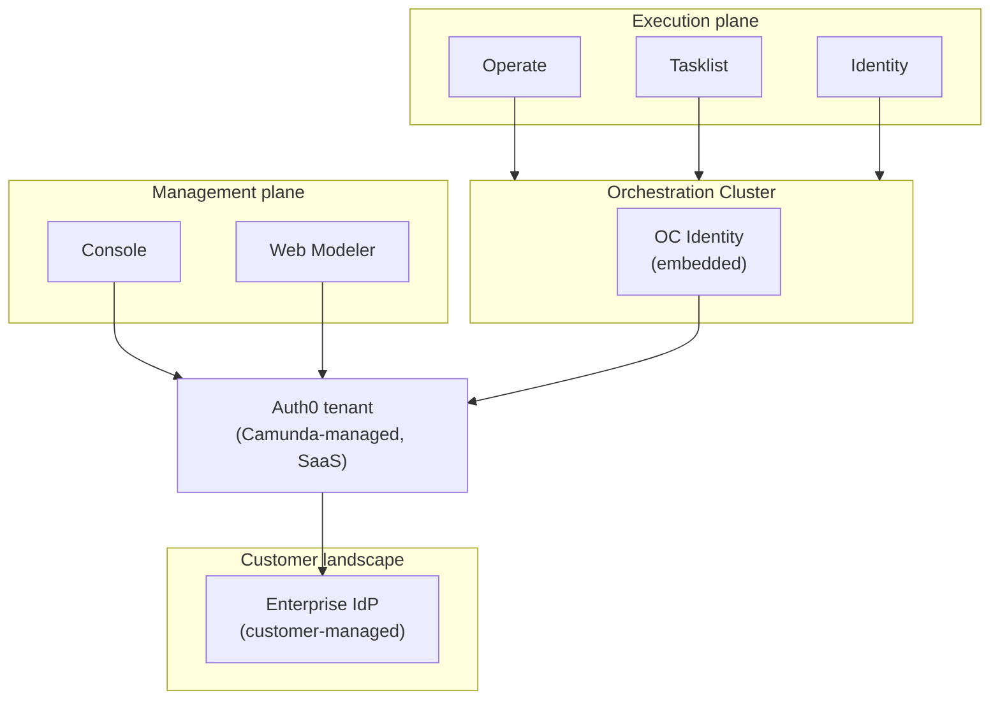
```mermaid
flowchart TB
  subgraph SaaS_Mgmt["Management plane"]
    ConsoleHub["Console"]
    WebModeler["Web Modeler"]
  end

  subgraph Execution["Execution plane"]
    Operate["Operate"]
    Tasklist["Tasklist"]
    Identity["Identity"]
  end

  subgraph OC["Orchestration Cluster"]
    OCId["OC Identity</br>(embedded)"]
  end

  subgraph Customer["Customer landscape"]
    CustIdP["Enterprise IdP</br>(customer-managed)"]
  end

  SaaSAuth0["Auth0 tenant</br>(Camunda-managed, SaaS)"]

  ConsoleHub & WebModeler --> SaaSAuth0
  Operate & Tasklist & Identity  --> OC

  OCId --> SaaSAuth0
  SaaSAuth0 --> CustIdP
```

In SaaS today:

- Console and Web Modeler authenticate users against a Camunda-managed Auth0 tenant, which acts as the IdP/broker for all SaaS tenants.
- OC Identity in each Orchestration Cluster also uses Auth0 as its OIDC IdP, applying runtime authorization for Operate, Tasklist, and cluster APIs.
- Auth0 either federates to the customer Enterprise IdP or manages user accounts directly, depending on tenant configuration. The concrete integration code lives in the respective SaaS backends (Console/Hub services and OC Identity OIDC client configuration), which use standard OAuth2/OIDC client libraries to communicate with Auth0.

#### 2.2.2 Self-managed

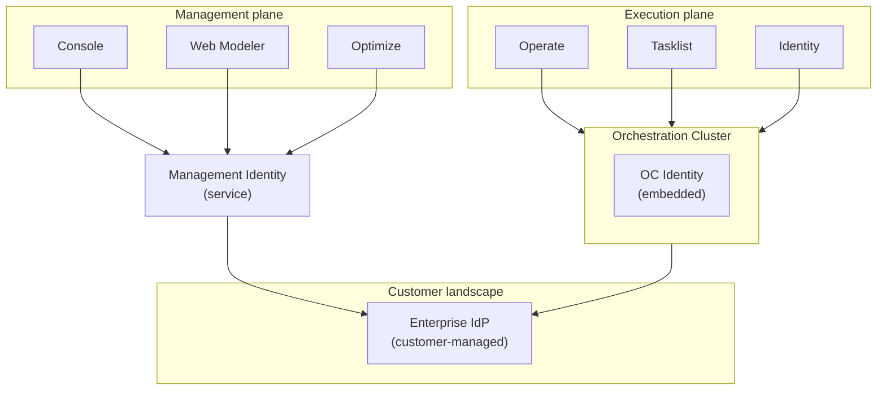
```mermaid
flowchart TB
  subgraph Mgmt["Management plane"]
    Console["Console"]
    WebModeler["Web Modeler"]
    Optimize["Optimize"]
  end

  MgmtId["Management Identity</br>(service)"]

  subgraph Execution["Execution plane"]
    Operate["Operate"]
    Tasklist["Tasklist"]
    Identity["Identity"]
  end

  subgraph OC["Orchestration Cluster"]
    OCId["OC Identity</br>(embedded)"]
  end

  subgraph Customer["Customer landscape"]
    CustIdP["Enterprise IdP</br>(customer-managed)"]
  end

  Console & WebModeler & Optimize --> MgmtId

  MgmtId --> CustIdP

  Operate & Tasklist & Identity --> OC

  OC --> CustIdP
```

In Self-managed today:

- Console, Web Modeler, and Optimize delegate authentication and authorization to Management Identity, which in turn integrates with the customer Enterprise IdP via OIDC.
- OC Identity is embedded into each Orchestration Cluster and directly integrates with the same Enterprise IdP; it handles runtime authentication and fine-grained authorizations for Operate, Tasklist, and the cluster APIs.
- This results in two identity silos (Management Identity vs OC Identity) that both depend on the Enterprise IdP but use different models and configuration surfaces.

### 2.3 Limitations and motivation for change

Based on the target-architecture appendix and identity roadmap, the current setup has several issues:

- Split identity
  - Separate models and configuration for Management Identity vs OC Identity.
  - SaaS and self-managed use different stacks (Auth0 vs direct IdP).
- SaaS vs self-managed parity gaps
  - Capabilities such as mapping rules, tenants, and fine-grained RBAC/ABAC differ or are missing depending on deployment.
- Manual lifecycle and configuration
  - Joiner/mover/leaver flows are not fully automated from the customer’s IdP/HR system.
  - Tenants, roles, and mappings are often configured by hand in UIs.
- Limited observability and migration tooling
  - Identity migrations (e.g. Management Identity → unified plane) and policy changes are fragile, not first-class “jobs”.
  - It is hard to see and debug identity health end to end.

These limitations motivate a unified identity plane with consistent semantics and tooling across Hub and all clusters, including multi-engine and multi-tenant scenarios.

---

### 2.4 Assumptions

The target architecture is based on the following assumptions:

- In SaaS, there is one shared Hub instance that serves multiple organizations.
  - In the first iterations, identity and policy data in Hub are separated only logically, via organization-aware persistence and queries in shared Hub storage.
- In full mode, each Orchestration Cluster is associated with exactly one Hub organization boundary for policy management; policies are always authored “above” the cluster in Hub and projected downward.
  - In SaaS today, Hub itself does not own the current list of OCs. Hub must read cluster metadata from the Console backend for the Admin UI and for policy targeting.
  - Discovering newly created OCs, and keeping the Hub-side view in sync, is still an open integration question in Self-Managed.
    - In future Self-Managed full-mode deployments, Hub should be able to read OCs directly once the Console backend is embedded in Hub and the experimental discovery mode (`CAMUNDA_CONSOLE_EXPERIMENTAL_DISCOVERY_MODE=true`) is enabled.
- In OC-only mode, the Orchestration Cluster is the local source of truth for policy; there is no Hub and therefore no cross-cluster policy coordination.
- All engines within a given Orchestration Cluster share the same OC-level; engines never talk to IdPs directly and are not configured as OIDC/SAML clients.
  - There will be one client per IDP (could be multiple per engine); we rely on roles and claims to decide which Engines each user can access and what they can do there.
  - Since engines are in the first iteration just configurable via configuration files, IDPs are also just configurable like this. In a later iteration, both should be configurable via Hub.
- Policy propagation across layers is eventually consistent:
  - Hub tracks the last acknowledged policy versions per OC.
  - Each OC tracks its own last applied policy version.
  - Engines receive policy via the OC’s internal command path and are assumed to converge towards the OC-level policy state; engines do not track separate policy versions.
- Existing infrastructure (databases, message brokers, cluster gateways, IdP configurations) is reused; no new global identity databases or dedicated identity clusters are introduced.

---

### 2.5 Preparation work and ongoing epics

- [Prepare Authentication for Hub Integration](https://github.com/camunda/camunda/issues/38556)
- Spike about extraction of code: [Spike/new replacement auth lib](https://github.com/camunda/camunda/pull/49058)

---

## 3. Solution strategy: unified identity plane and library

The target architecture introduces one consistent identity and policy model shared between Hub and all Orchestration Clusters:

- Hub Identity & Policy
  - Source of Truth (SoT) for users, groups, roles, tenants, mapping rules, and authorizations for all clusters and Hub apps.
- OC Identity
  - Per-cluster projection and enforcement of that policy, optimized for runtime access checks, and aware of multiple engines/tenants per cluster.
- Single identity plane for all consumers
  - Web UIs, user apps, workers, and integrations are all just API clients authenticated by the Enterprise IdP and authorized against this unified policy model.

Technically, this is implemented as a pluggable identity/security library:

- Embedded into Hub and Orchestration Cluster.
- Exposes Authentication (OIDC/SAML) and Authorization (RBAC/ABAC) capabilities via well-defined SPIs.
- Reuses the host application’s existing storage and infrastructure via SPI interfaces (no new standalone database or service).

Key design principles (selected):

- One identity plane for Hub and OC, with Hub as policy SoT whenever present.
- One Hub runtime in SaaS, serving many organizations, with organization-aware policy partitioning in shared Hub storage.
- SaaS / self-managed parity: same concepts (tenants, mapping rules, fine‑grained permissions, BYO IdP) in both deployment models.
- Hexagonal architecture: all persistence, messaging, OC command creation, and engine‑level wiring are behind interfaces; default implementations can be swapped or replaced entirely.
- IdP-agnostic: only relies on OIDC and SAML standards, so any compliant IdP can integrate.
- Automated lifecycle and migrations: IdP claim mapping and outbox-based policy replication, with idempotent and observable migrations.
- Standalone OC support: OC can act as the top-level policy authority when Hub is absent, mirroring the fallback topologies in existing docs.

### 3.1 Functional user journeys

The following user journeys describe, from a functional perspective, which actors perform which actions in which subsystem. They are not sequence diagrams, but concrete scenarios tying together Hub, Orchestration Clusters, and IdPs.

#### 3.1.1 Configure cluster policies in full mode (Hub + OC)

Short- to midterm target: Admins configure cluster policies (including engine- and tenant-scoped permissions) primarily in Hub. OC Admin exposes a read-only view of the applied policy for that cluster.

- Actor: Organization / platform administrator (Hub)
- Goal: Adjust who can do what on a given Orchestration Cluster and its engines/tenants.
- Main steps:
  1. Admin signs into Hub and navigates to the Admin UI.
  2. Admin selects a specific Orchestration Cluster and opens its policy configuration.
  3. Admin edits tenants, roles, groups, mapping rules, and authorizations for that cluster, including:
    - Cluster-wide permissions (for example cluster admins).
    - Tenant-scoped permissions (for example `retail` vs `wholesale`).
    - Engine-scoped or engine+tenant-scoped permissions where needed.
  4. Hub Security Gateway Framework validates and persists the changes in the selected organization scope, producing a new `PolicyVersion` for the target cluster.
  5. The outbox dispatcher propagates the updated policy to the target OC; OC Security Gateway Framework applies it and updates the engine-scoped projections.
  6. OC Admin UI (read-only in full mode) allows cluster operators to view the effective policies per engine and tenant, including the applied policy version.

Outcome: Cluster policies, including engine- and tenant-specific permissions, are authored once in Hub and enforced consistently in the target OC. Cluster operators can inspect, but not change, these policies via OC Admin.

#### 3.1.2 Application developer configures a worker client

- Actor: Application developer / project owner
- Goal: Set up a job worker or integration that can safely access cluster APIs.
- Main steps:
  1. Developer creates a machine principal (client) in the Admin UI (Hub in full mode, OC Admin in OC-only mode), getting client ID and secret or another credential form.
  2. Admin associates the client with one or more tenants and assigns roles or groups appropriate for the worker.
  3. Admin configures mapping rules (if needed) so that the client’s token claims map to the desired roles and tenants.
  4. Developer configures the worker application to request tokens from the Enterprise IdP using the client credentials.
  5. At runtime, the worker calls the OC APIs with those tokens; OC’s Security Gateway Framework validates the token against the IdP, derives permissions from the policy model, and enforces them for each request.

Outcome: The worker runs with the minimum required permissions derived from the unified policy model; there is no ad-hoc, engine-specific authorization logic.

#### 3.1.3 End user works across Hub and OC applications

- Actor: End user (for example, modeler, operator, support agent)
- Goal: Use Hub applications (for example, Web Modeler) and OC applications (Operate, Tasklist) with consistent permissions.
- Main steps:
  1. User signs into Hub (for example, Console/Web Modeler) via the Enterprise IdP.
  2. Hub Security Gateway Framework validates the token and derives roles, groups, and tenants from mapping rules.
  3. User creates or edits models, deploys them to a target Orchestration Cluster or environment.
  4. When the user opens the Operate / Tasklist for that cluster, they authenticate via the same Enterprise IdP; OC’s Security Gateway Framework derives the same or related roles/tenants from the token.
  5. In Operate/Tasklist, the user can only see and act on data allowed by their tenant- and role-based authorizations (for example, only instances in `retail` tenant, only tasks assigned to their team).

Outcome: The user experiences a consistent identity across Hub and OC: one Enterprise IdP login, one conceptual set of roles and tenants, and predictable access in both management and execution plane UIs.

#### 3.1.4 Configure policies in an OC-only deployment (long-term target)

Long-term target: Bring the same unified policy model, including engine- and tenant-scoped authorizations, to OC-only deployments. Today OC-only already supports identity and authorizations, but this journey describes the target unified behavior.

- Actor: Cluster administrator (OC-only)
- Goal: Configure identity and policies for a standalone OC without Hub, including engine- and tenant-scoped rules.
- Main steps:
  1. Cluster admin opens the OC Admin UI.
  2. Cluster admin configures the Enterprise IdP connection directly on the OC (OIDC/SAML client settings for the deployment).
  3. Cluster admin creates tenants, roles, groups, and mapping rules in the OC Admin UI.
  4. Cluster admin defines authorizations for cluster resources (definitions, instances, tasks, cluster APIs) and, if needed, engine- and tenant-specific scopes.
  5. OC Security Gateway Framework persists the policy locally and propagates engine-scoped projections to the engines.

Outcome: The OC acts as local SoT for identity and policy. Users and workers can authenticate via the Enterprise IdP, and permissions are enforced consistently across Operate, Tasklist, Admin, and APIs within that cluster, including engine- and tenant-specific rules.

#### 3.1.5 Configure identity for a new organization (full mode: Hub + OC, long-term target)

Long-term target: Org-level IdP setup and cluster provisioning are performed centrally via Hub. Early iterations may still rely on lower-level configuration on individual components and, in SaaS, on cluster metadata coming from the Console backend.

- Actor: Organization administrator (Hub)
- Goal: Connect the organization’s IdP, provision an Orchestration Cluster, and define baseline access.
- Main steps:
  1. Org admin signs into Hub and navigates to the Admin UI.
  2. Org admin configures the Enterprise IdP connection for the organization (for example Entra, Okta, Keycloak) via Hub (org-level IdP setup in the target state).
  3. Org admin creates or imports tenants (for example `default`, `retail`, `wholesale`) in the Hub Admin UI.
  4. Org admin defines mapping rules (claims → roles/tenants) and assigns baseline roles and groups for key personas (for example Cluster Admins, Developers, Support).
  5. Org admin provisions (or selects) an Orchestration Cluster and associates it with the organization/tenants.
     - In SaaS today, this selection depends on cluster metadata read from the Console backend.
     - In future Self-Managed full mode, the same lookup should be possible directly in Hub once the embedded Console backend is enabled with `CAMUNDA_CONSOLE_EXPERIMENTAL_DISCOVERY_MODE=true`.
  6. Hub Security Gateway Framework persists this configuration in the organization-scoped Hub partition, produces a new `PolicyVersion`, and starts outbox-based propagation to the relevant OC(s).

Outcome: The organization’s IdP is connected, tenants and roles exist, and cluster-local policy is projected to the associated OCs. Cluster admins and developers can authenticate via the Enterprise IdP and start using cluster UIs and APIs, with Hub acting as the central identity and policy entry point.

---

## 4. Target system context

This section describes the unified identity system at a high level, showing how the new library integrates into the platform across two supported deployment modes. The diagrams illustrate key components (Hub, Orchestration Clusters, identity UIs, infrastructure) and their relationships.

### 4.1 Full mode (Hub + OC)

In full mode, the platform runs with both Hub (management/control plane) and Orchestration Cluster (execution plane). Both use the same identity model and the same Security Gateway Framework.

Configuration flows top-down: Hub is the central source of truth for all policy. Configuration is authored once in Hub and propagated via the outbox pattern to each OC, which then propagates scoped views to individual engines. The Admin UI in each OC runs in read-only mode, showing the local projection of Hub policy. In SaaS, this full-mode topology is realized by one shared Hub instance serving multiple organizations; in Self-Managed, the same topology is expected once Hub can host the Console backend with experimental cluster discovery enabled.

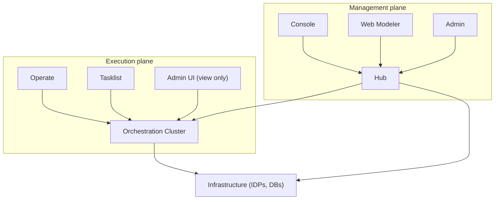
```mermaid
flowchart TB

  subgraph Mgmt["Management plane"]
    Console["Console"]
    WebModeler["Web Modeler"]
    Admin["Admin"]

    Hub["Hub"]

    Console & WebModeler & Admin --> Hub
  end

  subgraph Execution["Execution plane"]
    Operate["Operate"]
    Tasklist["Tasklist"]
    SecGaUIExec["Admin UI (view only)"]

    OC["Orchestration Cluster"]

    Operate & Tasklist & SecGaUIExec --> OC
  end

  Infra["Infrastructure (IDPs, DBs)"]

  Hub --> OC
  OC --> Infra
  Hub --> Infra
```

- Hub and each OC use the same Security Gateway Framework as the shared identity and policy engine.
- Hub is the single source of truth for all policy and configuration.
- Hub propagates policy changes via the outbox pattern to OC, which maintains a local projection and handles runtime enforcement per engine/tenant.
- Existing infrastructure is reused, no new databases or services are introduced.
- Hub and OC instances of the framework integrate with one or more IdPs (per tenant/engine as configured) via standard OIDC/SAML clients; engines never integrate with IdPs directly.

### 4.2 OC-only mode (standalone OC)

In OC-only mode, Hub is not present. The Orchestration Cluster becomes the local source of truth for all policy and configuration. OC is a first-class deployment option and acts as top-level policy authority for its engines. This mode is useful for development environments and self-contained production scenarios.

Configuration flows locally: OC manages all policies directly, and the Admin UI in OC runs in read-write mode, allowing full policy authoring and management. Configuration then propagates from OC to individual engines.

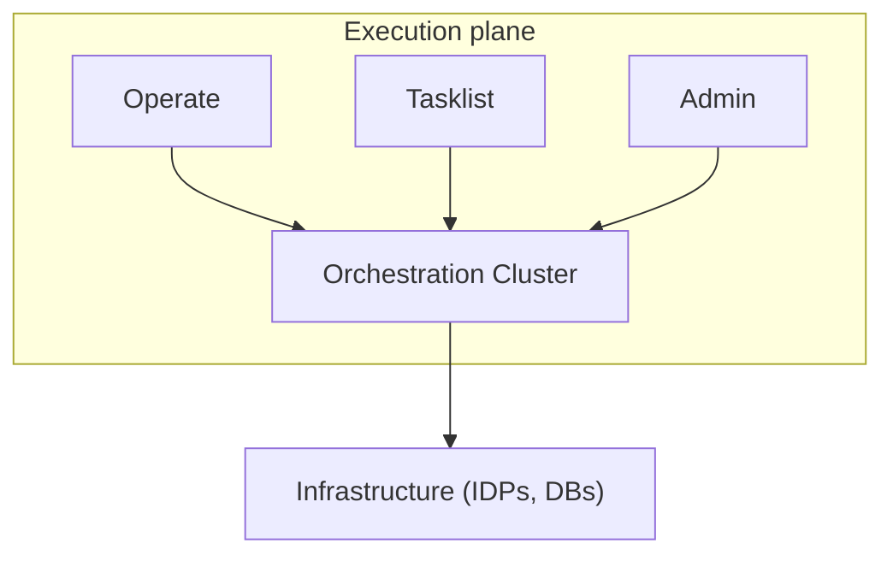
```mermaid
flowchart TB

  subgraph Execution["Execution plane"]
    Operate["Operate"]
    Tasklist["Tasklist"]
    Admin["Admin"]

    OC["Orchestration Cluster"]

    Operate & Tasklist & Admin --> OC
  end

  Infra["Infrastructure (IDPs, DBs)"]

  OC --> Infra
```

- OC is the single source of truth for all policy and configuration.
- The same Security Gateway Framework is used but configured for standalone operation.
- Existing infrastructure is reused, no new databases or services are introduced.
- OC owns the IdP client configurations for its tenants and engines; engines still only consume OC-level identity decisions and never call IdPs directly.

---

## 5. Building block view (target)

### 5.1 High-level components

The following diagrams show the internal structure of Hub and Orchestration Cluster, including how Security Gateway Framework instance connects to frontend applications, infrastructure, and (in multi-engine scenarios) individual engine instances.

Both the Hub and OC instances of the Security Gateway Framework maintain their own local state:

- A cluster-scoped policy projection for the relevant cluster(s) they manage.
- Local tracking of the last applied policy version (`last_applied_version` on the OC side, `last_acked_version` per OC on the Hub side).
- Local session state.

#### 5.1.1 Full mode (Hub + OC)

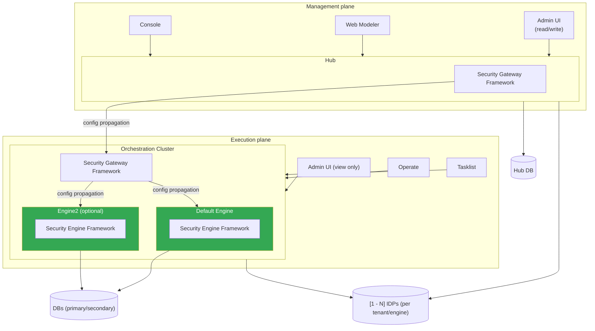
```mermaid
flowchart TB
  subgraph Mgmt["Management plane"]
    Console["Console"]
    WebModeler["Web Modeler"]
    AdminHub["Admin UI</br>(read/write)"]

    subgraph Hub["Hub"]
      SecGatHub["Security Gateway Framework"]
    end

    Console & WebModeler & AdminHub --> Hub
  end

  subgraph Execution["Execution plane"]
    Operate["Operate"]
    Tasklist["Tasklist"]
    AdminOC["Admin UI (view only)"]

    subgraph OC["Orchestration Cluster"]
      SecGatOC["Security Gateway Framework"]

      SecGatOC -->|"config propagation"| Engine2
      SecGatOC -->|"config propagation"| EngineN

      subgraph Engine2["Engine2 (optional)"]
        SecEngFrame1["Security Engine Framework"]
      end

      subgraph EngineN["Default Engine"]
        SecEngFrameN["Security Engine Framework"]
      end
    end

    AdminOC & Operate & Tasklist --> OC
  end

  IdPs[("[1 - N] IDPs (per tenant/engine)")]
  DBs[("DBs (primary/secondary)")]
  HubDb[("Hub DB")]

  SecGatHub -->|"config propagation"| SecGatOC
  Engine2 & EngineN --> DBs
  OC & Hub --> IdPs

  Hub --> HubDb

  style Engine2 fill:#34a853,color:#fff
  style EngineN fill:#34a853,color:#fff
```

Key building blocks in full mode:

- Console, Web Modeler, Admin UI (read-write): Frontend applications in the management plane. The Admin UI here allows full policy authoring for all configurable layers (Hub, OCs, engines, tenants).
- Hub + Security Gateway Framework: Central source of truth. Manages all policy configuration for all clusters, OCs, and engines. All policy changes originate here.
- Operate, Tasklist, Admin UI (read-only): Runtime frontends in the execution plane. The Admin UI shows the cluster-local projection of Hub policy; configuration is read-only.
- OC + Security Gateway Framework: Per-cluster policy enforcement and projection layer. Receives policy snapshots from Hub via the outbox pattern. Propagates scoped policy views to individual engines.
- Engine instances (Default Engine, Engine2 optional): Optional multi-engine support. Each engine receives its scoped projection of cluster policy from OC. No direct Hub connection.
- Security Engine Framework: Engine-specific policy enforcement layer.
- Infrastructure (IDPs, DBs): Shared existing persistence and IdP connectivity for authentication and authorization across all layers.

Configuration propagation chain: Hub → OC → Engine.

#### 5.1.2 OC-only mode (standalone OC)

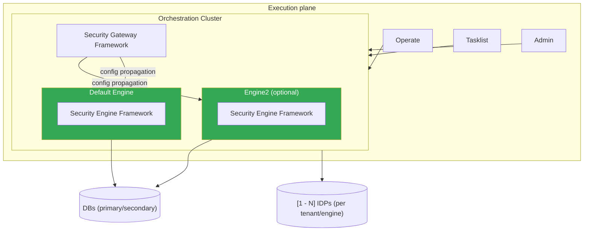
```mermaid
flowchart TB

  subgraph Execution["Execution plane"]
    Operate["Operate"]
    Tasklist["Tasklist"]
    AdminUI["Admin"]

    subgraph OC["Orchestration Cluster"]
      OCLib["Security Gateway Framework"]

      OCLib -->|"config propagation"| Engine2
      OCLib -->|"config propagation"| EngineN

      subgraph EngineN["Default Engine"]
        EngLibN["Security Engine Framework"]
      end

      subgraph Engine2["Engine2 (optional)"]
        EngLib2["Security Engine Framework"]
      end
    end
  end

  Operate & Tasklist & AdminUI --> OC

  IdPs[("[1 - N] IDPs (per tenant/engine)")]
  DBs[("DBs (primary/secondary)")]

  Engine2 & EngineN --> DBs
  OC --> IdPs

  style Engine2 fill:#34a853,color:#fff
  style EngineN fill:#34a853,color:#fff
```

Key building blocks in OC-only mode:

- Operate, Tasklist, Admin UI (read-write): Runtime frontends that interact directly with OC. The Admin UI allows full policy authoring (no Hub restrictions).
- OC + Security Gateway Framework: Local source of truth. Manages all policy and authorization directly without Hub coordination. All policy changes originate here.
- Engine instances (Default Engine, Engine2 optional): Each engine receives its scoped projection of local OC policy. OC is the single source of all policy.
- Security Engine Framework: Engine-specific policy enforcement layer.
- Infrastructure (IDPs, DBs): Local persistence and IdP connectivity; no cross-cluster replication or Hub involvement.

Configuration propagation chain: OC → Engine.

### 5.2 Unified policy model

The unified identity architecture is built around a single policy model that is shared between Hub Identity & Policy and OC Identity. Hub is the source of truth for this model per cluster; in shared-Hub deployments, Hub stores it per organization and cluster. Each OC hosts a cluster-local projection of the same concepts for enforcement.

At a high level, the shared policy model consists of:

- **Organization**
  - Hub-side partitioning boundary for identity and policy data.
  - In SaaS, one Hub instance serves multiple organizations, so all Hub policy tables and queries must be organization-aware.
  - In early iterations, this separation is logical only: shared Hub infrastructure and databases remain in place, but all policy state is keyed and filtered by organization.
  - Each Orchestration Cluster belongs to exactly one organization boundary for policy propagation at a given time.

- **Tenant**
  - Logical partition for data and access in a cluster (for example `default`, `retail`, `wholesale`, `customer-x`).
  - Used to scope where a principal is allowed to read or write data.
  - Tenant configuration (names, descriptions, flags) is authored in Hub and projected to each OC.

- **Group / Role**
  - **Group**
    - Collection of principals (users, mapping rules, clients) that should share the same permissions.
  - **Role**
    - Reusable set of permissions that can be attached to groups, users, or clients.
    - Roles are used both on the management plane (Hub apps) and execution plane (cluster APIs and UIs).

- **MappingRule**
  - Declarative rule that maps **IdP claims** to Camunda concepts:
    - `claimName` (for example `groups`, `org`, `department`).
    - `operator` (for example `EQUALS`, `CONTAINS`).
    - `claimValue` (for example `camunda-platform-admin`, `Retail`).
  - Targets one or more **roles**, **groups**, and **tenants**:
    - When an incoming token’s claims match, the principal automatically receives those roles/groups/tenants.
  - This is the main mechanism that turns IdP attributes into platform-level permissions.

- **Principal**
  - Represents an actor that can authenticate and be authorized:
  - **User principal**
    - Identified by an IdP user claim (for example `preferred_username`, `email`).
    - May have direct role/group assignments in addition to mapping-rule derived ones.
  - **Machine principal**
    - Identified by client credentials (for example `client_id`).
    - Used by workers, automation, and integrations (job workers, CI/CD, connectors, etc.).

- **Authorization**
  - Fine-grained permission record that ties **owners** to **resources** and **actions**:
  - Conceptually:
    - `(ownerType, ownerId, resourceType, resourceId, permissions[])`
  - Examples:
    - Owner: `GROUP:RetailDevelopers`
      ResourceType: `PROCESS_DEFINITION`
      ResourceId: `*`
      Permissions: `[READ_PROCESS_DEFINITION, READ_PROCESS_INSTANCE, CREATE_PROCESS_INSTANCE]`
    - Owner: `ROLE:ClusterAdmin`
      ResourceType: `CLUSTER_API`
      ResourceId: `*`
      Permissions: `[MANAGE_CLUSTER_SETTINGS, MANAGE_USERS]`
  - The same structure is used on:
    - **OC side** for engine and cluster resources (definitions, instances, tasks, cluster APIs).
    - **Hub side** for management resources (orgs, workspaces, projects, assets, clusters).

#### 5.2.1 Hub vs. OC responsibilities

Both Hub and OC use exactly the same policy model, but with different responsibilities.

- **Hub Identity & Policy**
  - Acts as **policy source of truth** for all clusters.
  - Authoring location for tenants, roles, groups, mapping rules, and authorizations.
  - Stores organization-scoped `PolicyVersion` records per cluster and drives propagation via Outbox/`OutboxEvent`. See section `5.3`.

- **OC Identity**
  - Hosts a **cluster-local projection** of the same entities.
  - Enforces authorizations for:
    - Web UIs on the cluster (Operate, Tasklist, Admin).
    - Cluster runtime APIs (gRPC/REST) for workers and integrations.
  - Does not invent new policy; it only applies and enforces what Hub (or, in standalone mode, local OC configuration) defines.

This unified model allows:

- The same concepts (tenants, roles, groups, mapping rules, authorizations, principals) to be used consistently on both **management** and **execution** planes.
- Identity-as-code and migrations to operate on one canonical representation (`PolicyVersion`) per cluster, with clear ownership (Hub) and enforcement (OC).

#### 5.2.2 Responsibility matrix (IdP and policy-related information)

The following table summarizes which information must be known to which component:

| Information type                             | Hub (full mode)                                                | OC (full mode)                                                      | OC-only mode (OC)                | Engine                                 |
|---------------------------------------------|-----------------------------------------------------------------|---------------------------------------------------------------------|----------------------------------|----------------------------------------|
| IdP client credentials (client IDs/secrets) | Yes (managed centrally or per-tenant)                          | Yes (cluster-local credentials / secrets per OC / tenant / engine)  | Yes                              | No                                     |
| IdP connections per tenant (OIDC/SAML)      | Yes (for Hub apps)                                             | Yes (for cluster-side authn)                                        | Yes                              | No (trusts OC)                         |
| Organization / cluster ownership metadata   | Yes (organization boundary + OC lookup, currently via Console backend in SaaS) | Yes (cluster-local identity context)                                | No                               | No                                     |
| Tenant                                      | Yes (SoT)                                                      | Yes (projection per cluster)                                        | Yes (SoT)                        | Indirectly via OC commands             |
| Mapping rules (claims → roles/tenants)      | Yes (SoT)                                                      | Yes (projection per cluster)                                        | Yes                              | No                                     |
| Roles and groups                            | Yes (SoT)                                                      | Yes (projection per cluster)                                        | Yes                              | No (only resulting permissions)        |
| Authorizations (role/group → resource perms)| Yes (SoT)                                                      | Yes (projection per cluster; engine-scoped and tenant-scoped views) | Yes                              | Indirectly (via engine-local projections) |
| Policy versions and outbox state            | Yes (`PolicyVersion`, `OutboxEvent`, `OcSyncState`), scoped by organization + cluster in shared Hub deployments | Yes (`last_applied_version` per cluster)                            | Yes (local policy versions only) | No explicit versioning; consumes OC-level updates |
| Session data                                | Yes (Hub sessions only)                                        | Yes (cluster sessions only)                                         | Yes                              | No                                     |

Engines only need to know the effective permissions resulting from the policy model; they neither talk to IdPs nor store policy versions.

### 5.3 Outbox-based policy propagation (Hub → Orchestration Clusters)

The Security Gateway Framework uses an outbox pattern to propagate policy changes from Hub (policy SoT) to each Orchestration Cluster in a reliable, observable, and idempotent way. In shared-Hub deployments, this propagation is scoped by organization and cluster.

**Snapshot vs. incremental diff:** Sending a full snapshot on every change would be unnecessarily expensive at scale. The propagation therefore follows a two-phase approach:

- **Initial sync (full snapshot):** When an OC connects for the first time (or after a reset), Hub sends a complete `POLICY_SNAPSHOT` — the full current state of tenants, roles, groups, mapping rules, principals, and authorizations for that cluster.
- **Subsequent updates (incremental diff):** After the initial sync, Hub sends only the changed entities as a `POLICY_DIFF` event. The OC applies the diff on top of its locally cached state. This keeps payloads small and propagation fast.

If an OC falls behind (e.g. due to a gap in its applied version sequence), it can request a full re-sync from Hub to recover a consistent baseline.

**Who decides snapshots, and when?**

- **Decision owner:** Hub (via the Outbox Dispatcher) decides per target OC whether to send `POLICY_DIFF` or `POLICY_SNAPSHOT`.
- **Snapshot triggers:**
  - OC has no acknowledged version yet (initial sync).
  - OC requests re-sync because `base_version` does not match `last_applied_version`.
  - Operator-triggered/manual re-sync for a specific OC.
  - Optional periodic checkpoint snapshot (operational safety net, typically low cadence).
- **How snapshot is built:** Hub reconstructs the current state for the cluster from latest non-deleted revisions per entity/scope and sends it as `POLICY_SNAPSHOT`.

`base_version` means the version an incoming `POLICY_DIFF` is built on top of (expected previous version in OC), not the last snapshot version.

The outbox pattern we use here is a specific instance of the “Transactional Outbox” architecture pattern.

Reference: [Transactional outbox](https://microservices.io/patterns/data/transactional-outbox.html)

#### 5.3.1 High-level flow

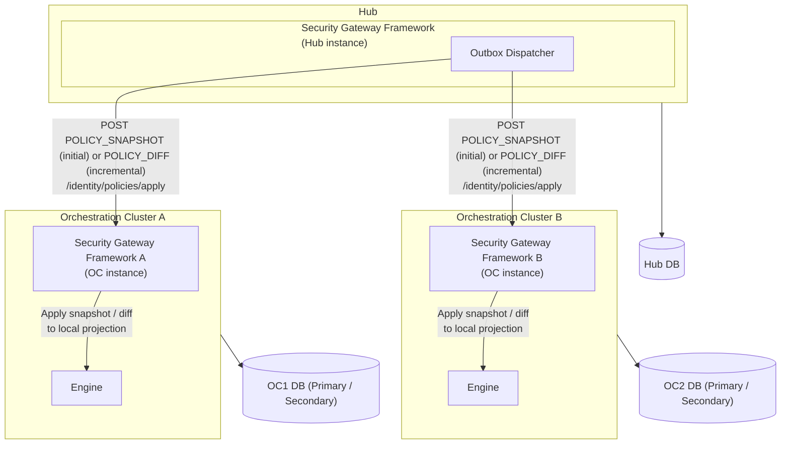
```mermaid
flowchart TB
  subgraph Hub["Hub"]
    subgraph subHubLib["Security Gateway Framework</br>(Hub instance)"]
      Dispatcher["Outbox Dispatcher"]
    end
  end

  HubDB[("Hub DB")]

  subgraph OC1["Orchestration Cluster A"]
    OC1Lib["Security Gateway Framework A</br>(OC instance)"]
    Engine1["Engine"]
  end

  OC1DB[("OC1 DB (Primary / Secondary)")]
  OC2DB[("OC2 DB (Primary / Secondary)")]

  subgraph OC2["Orchestration Cluster B"]
    OC2Lib["Security Gateway Framework B</br>(OC instance)"]
    Engine2["Engine"]
  end

  Hub --> HubDB
  OC1 --> OC1DB
  OC2 --> OC2DB

%% Dispatch path
  Dispatcher -->|"POST POLICY_SNAPSHOT (initial) or POLICY_DIFF (incremental)</br>/identity/policies/apply"| OC1Lib & OC2Lib

%% Apply on OC side
  OC1Lib -->|"Apply snapshot / diff</br>to local projection"| Engine1
  OC2Lib -->|"Apply snapshot / diff</br>to local projection"| Engine2
```

#### 5.3.2 Detailed outbox flow

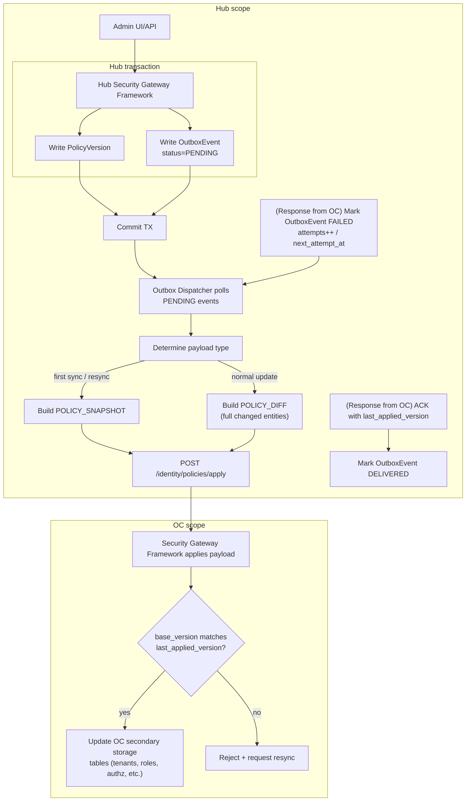
```mermaid
flowchart TB
  subgraph HUB["Hub scope"]
    direction TB
    Admin["Admin UI/API"] --> HubSvc["Hub Security Gateway Framework"]

    subgraph HubTx["Hub transaction"]
      direction TB
      HubSvc --> WritePolicy["Write PolicyVersion"]
      HubSvc --> WriteOutbox["Write OutboxEvent</br>status=PENDING"]
    end

    WritePolicy & WriteOutbox --> Commit["Commit TX"]
    Commit --> Poll["Outbox Dispatcher polls</br>PENDING events"]
    Poll --> Decide["Determine payload type"]
    Decide -->|"first sync / resync"| Snapshot["Build POLICY_SNAPSHOT"]
    Decide -->|"normal update"| Diff["Build POLICY_DIFF</br>(full changed entities)"]
    Snapshot & Diff --> Send["POST /identity/policies/apply"]
    Ack["(Response from OC) ACK with last_applied_version"] --> Delivered["Mark OutboxEvent DELIVERED"]
    Failed["(Response from OC) Mark OutboxEvent FAILED</br>attempts++ / next_attempt_at"] --> Poll
  end

  subgraph OC_SCOPE["OC scope"]
    direction TB
    OCApply["Security Gateway Framework applies payload"]
    VersionCheck{"base_version matches</br>last_applied_version?"}
    UpdateStorage["Update OC secondary storage</br>tables (tenants, roles, authz, etc.)"]
    ResyncReq["Reject + request resync"]

    OCApply --> VersionCheck
    VersionCheck -->|"yes"| UpdateStorage
    VersionCheck -->|"no"| ResyncReq
  end

  Send --> OCApply
```

- Hub Security Gateway Framework
  - Accepts policy changes via UI/API.
  - Writes a delivery-neutral `PolicyVersion` and a corresponding `OutboxEvent` (`POLICY_SNAPSHOT` or `POLICY_DIFF`, status = PENDING) in the same transaction.
  - Tracks per-OC `last_acked_version` via `OcSyncState` to decide whether to send a diff or fall back to a full snapshot.
- Outbox Dispatcher
  - Periodically selects due PENDING events.
  - Loads the corresponding `PolicyVersion` and either prepares the full snapshot or computes the diff against the OC's last acknowledged version.
    - The diff contains only the changed entities. (But the full entity, not just updated fields)
  - Calls each OC's public admin endpoint (e.g. `POST /identity/policies/apply`) with the snapshot or diff payload.
  - Updates `OutboxEvent.status` to DELIVERED or FAILED and manages retries via `attempts` and `next_attempt_at`.
  - On successful delivery, updates `OcSyncState.last_acked_version` for the target OC.
- OC Security Gateway Framework
  - Tracks `last_applied_version` locally in secondary storage.
  - For `POLICY_SNAPSHOT`: replaces the entire local policy projection in secondary storage tables and updates `last_applied_version`.
  - For `POLICY_DIFF`: applies the delta on top of existing secondary storage state; rejects and requests a re-sync if the diff's `base_version` does not match `last_applied_version`.
  - All updates to secondary storage happen in a single transaction to ensure consistency.
  - Treats every apply as idempotent per `policyVersionId`.
  - Returns an ACK (including `last_applied_version`) to the dispatcher.

This pattern decouples policy authoring (Hub) from policy enforcement (OCs), ensures at-least-once delivery, keeps incremental payloads small, and provides clear observability hooks (per-cluster status, last error, retry attempts) for identity operations.

#### 5.3.3 Linking `PolicyVersion` with the policy data model

At a high level, Hub persists policy propagation in three layers:

- `PolicyVersion` is the organization + cluster-scoped commit marker in Hub (`version_number`, `base_version`).
- `EntityRevision` stores immutable payload snapshots per changed entity (or tombstones for deletes) and is linked to the policy version where it was introduced.
- `PolicyVersionChange` is the ordered index that links one `PolicyVersion` to the changed entity revisions in apply order.

In practice, each policy update writes a new `PolicyVersion`, writes one or more `EntityRevision` rows for changed entities, and writes matching `PolicyVersionChange` rows. Each `EntityRevision.payload` contains only the single referenced entity JSON. `EntityRevision` is tied to policy in two ways: directly via `introduced_in_policy_version`, and indirectly via `PolicyVersionChange.entity_revision_id` + `PolicyVersionChange.policy_version_id`. From these helper tables, Hub can deterministically build either a full snapshot (latest revisions up to target version) or an incremental diff (ordered changes of target version).

To keep snapshots and incremental updates consistent, `PolicyVersion` should be treated as an **organization + cluster-scoped commit in Hub** over the unified policy model (and as cluster-scoped from the receiving OC's point of view).

**How payload resources are calculated**

- **For `POLICY_SNAPSHOT` (full state at target version `V`)**
  - Start from all `EntityRevision` rows with `introduced_in_policy_version <= V` for the target cluster.
  - Group by `(entity_type, entity_id, scope_type, scope_id)`.
  - Keep only the latest revision in each group (highest `introduced_in_policy_version`, then latest sequence if needed).
  - Drop rows where the latest revision is a tombstone (`is_deleted = true`).
  - Emit the remaining payloads as the full snapshot resource set.
  - Result: exactly the effective current policy state for that OC at version `V`.

- **For `POLICY_DIFF` (increment from base `B` to target `V`)**
  - Read ordered `PolicyVersionChange` rows for `policy_version_id = V`.
  - Join each change to its `EntityRevision` via `entity_revision_id`.
  - For `UPSERT`, include the full resource payload from the joined revision.
  - For `DELETE`, include a tombstone-style change entry (entity identity + scope + operation), no full object required.
  - Preserve `sequence_no` order in the payload.
  - Result: only the resources changed in version `V`, applied on top of base version `B`.

Operational note:

- Hub chooses snapshot vs diff per target OC using `OcSyncState.last_acked_version`.
- If `last_acked_version` is `null` or incompatible with diff preconditions, Hub sends snapshot.
- Otherwise, Hub sends diff.

#### 5.3.4 Model for Policy Linking

Minimal conceptual schema:

```text
OcSyncState
  organization_id    -- organization boundary in Hub
  oc_id              -- stable identifier of the target OC
  cluster_id
  last_acked_version -- last PolicyVersion successfully delivered and ACKed
  last_sync_at

OutboxEvent
  id
  organization_id
  oc_id              -- target OC for this delivery attempt
  policy_version_id
  event_type         -- POLICY_SNAPSHOT | POLICY_DIFF
  status             -- 'PENDING' | 'DELIVERED' | 'FAILED'
  attempts
  next_attempt_at

PolicyVersion
  id
  organization_id
  cluster_id
  version_number
  base_version

EntityRevision
  id
  organization_id
  entity_type
  entity_id
  introduced_in_policy_version
  scope_type
  scope_id
  is_deleted
  payload            -- single referenced entity JSON

PolicyVersionChange
  policy_version_id
  organization_id
  entity_type        -- TENANT | GROUP | ROLE | MAPPING_RULE | PRINCIPAL | AUTHORIZATION
  entity_id          -- stable logical ID
  operation          -- UPSERT | DELETE
  scope_type         -- ALL | TENANT | ENGINE | TENANT_ENGINE
  scope_id           -- nullable; for TENANT_ENGINE use a composite key format
  revision_ref       -- reference to concrete entity revision payload
```

- `OutboxEvent`
  - One row per policy delivery attempt to a specific cluster.
  - In shared-Hub deployments, includes the organization boundary and concrete target OC to make routing and operations explicit.
  - `event_type` distinguishes `POLICY_SNAPSHOT` (initial / re-sync) from `POLICY_DIFF` (incremental).
  - Drives asynchronous delivery and retry without coupling Hub writes to OC availability.
- `OcSyncState`
  - One row per target OC.
  - Scoped by organization in shared-Hub deployments.
  - Tracks `last_acked_version`: the last `PolicyVersion` successfully delivered and acknowledged.
  - Read by the Outbox Dispatcher to decide snapshot vs diff per OC.
  - `null` `last_acked_version` triggers a full `POLICY_SNAPSHOT` on next dispatch.
- `PolicyVersion`
  - One row per cluster and version of the desired policy.
  - Represents the canonical policy commit for a cluster within one organization boundary.
- `PolicyVersionChange`
  - Ordered list of changed entities for one `PolicyVersion`.
  - Contains `entity_type`, `entity_id`, `operation`, and scope (`scope_type`, `scope_id`).
  - Used to build `POLICY_DIFF` payloads.
- `EntityRevision`
  - Immutable revision payload per changed entity.
  - Stores one referenced entity JSON payload per row or delete tombstones (`is_deleted`).
  - Used to reconstruct snapshots (latest non-deleted revision per entity/scope up to target version).
  - Practical persistence split:
    - Keep canonical current-state tables per entity (role/group/authorization/etc.) for normal queries and constraints.
    - Keep `EntityRevision.payload` as JSON for versioned transport, idempotent apply, and snapshot/diff reconstruction.
    - Do not require fully normalized historical tables per version.

The full policy data model is described in [5.2 Unified policy model](#52-unified-policy-model). The tables above are the outbox-relevant persistence model in Hub. In SaaS, they live in a shared Hub database and are separated logically by `organization_id`.

Version tracking is explicitly scoped to the Hub–OC relationship:

- Hub tracks last acknowledged versions per OC via `OcSyncState.last_acked_version`.
- Each OC tracks its own `last_applied_version` locally.
- Engines do not track policy versions explicitly. They receive commands or projections from the OC and are expected to converge towards the OC’s effective policy state. From the unified identity plane’s perspective, “policy version X is applied” is defined at the OC boundary.

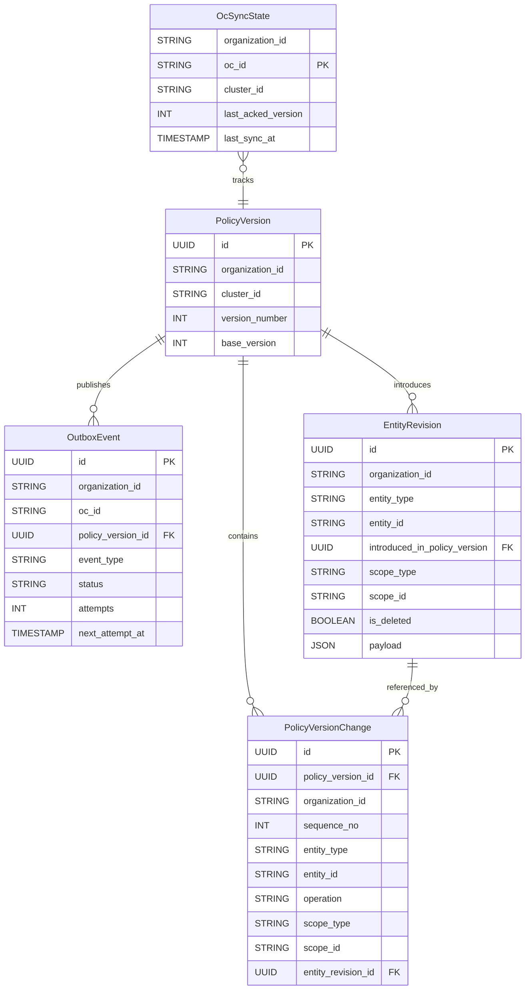
```mermaid
erDiagram
  OutboxEvent {
    UUID id PK
    STRING organization_id
    STRING oc_id
    UUID policy_version_id FK
    STRING event_type
    STRING status
    INT attempts
    TIMESTAMP next_attempt_at
  }

  PolicyVersion {
    UUID id PK
    STRING organization_id
    STRING cluster_id
    INT version_number
    INT base_version
  }

  OcSyncState {
    STRING organization_id
    STRING oc_id PK
    STRING cluster_id
    INT last_acked_version
    TIMESTAMP last_sync_at
  }

  EntityRevision {
    UUID id PK
    STRING organization_id
    STRING entity_type
    STRING entity_id
    UUID introduced_in_policy_version FK
    STRING scope_type
    STRING scope_id
    BOOLEAN is_deleted
    JSON payload
  }

  PolicyVersionChange {
    UUID id PK
    UUID policy_version_id FK
    STRING organization_id
    INT sequence_no
    STRING entity_type
    STRING entity_id
    STRING operation
    STRING scope_type
    STRING scope_id
    UUID entity_revision_id FK
  }

  PolicyVersion ||--o{ EntityRevision : introduces
  PolicyVersion ||--o{ PolicyVersionChange : contains
  PolicyVersion ||--o{ OutboxEvent : publishes
  OcSyncState }o--|| PolicyVersion : tracks
  EntityRevision ||--o{ PolicyVersionChange : referenced_by
```

### 5.3.5 Consistency guarantees

The outbox-based propagation provides the following consistency characteristics:

- Eventual consistency across layers
  - Policy changes become visible in this order:
    - Hub (immediately in the Admin UI after commit).
    - OC (after outbox dispatch and a successful apply).
    - Engines (after OC-to-engine propagation via the engine command path).
  - There may be short windows where Hub and OC/engines disagree on the currently effective policy; operational tooling should reflect per-OC sync status.
- Delivery semantics
  - At-least-once delivery from Hub to each OC:
    - Failed `OutboxEvent`s are retried according to `attempts` and `next_attempt_at`.
  - Idempotent apply on the OC side:
    - Each `PolicyVersion` is applied at most once per OC; replays with the same `policyVersionId` are ignored.
- Ordering
  - Within a single OC:
    - `PolicyVersion.version_number` is strictly increasing.
    - A `POLICY_DIFF` for version `V` is only accepted if its `base_version` matches the OC’s `last_applied_version`.
  - If an OC falls behind or misses one or more versions, it rejects the diff and requests a fresh snapshot.
- Snapshots as a safety net
  - Hub can at any time fall back to sending a `POLICY_SNAPSHOT` that reconstructs the full desired state up to a target version.
  - Applying a snapshot overwrites the local projection and resets the OC back to a known-good baseline.

---

### 5.3.6 Example database rows (Hub)

The following simplified rows show selected database rows for the same entities used in examples A/B/C in section `5.3.7`.

**OcSyncState**

| organization_id | oc_id | cluster_id | last_acked_version | last_sync_at |
|---|---|---|---:|---|
| `org-acme` | `oc-a` | `oc-a` | 3 | `2025-01-03T10:00:00Z` |

**OutboxEvent**

| id | organization_id | oc_id | policy_version_id | event_type | status | attempts | next_attempt_at |
|---|---|---|---|---|---|---:|---|
| `evt-1` | `org-acme` | `oc-a` | `pv-1` | `POLICY_SNAPSHOT` | `DELIVERED` | 1 | `null` |
| `evt-2` | `org-acme` | `oc-a` | `pv-2` | `POLICY_DIFF` | `DELIVERED` | 1 | `null` |
| `evt-3` | `org-acme` | `oc-a` | `pv-3` | `POLICY_DIFF` | `DELIVERED` | 1 | `null` |

**PolicyVersion**

| id | organization_id | cluster_id | version_number | base_version |
|---|---|---|---:|---:|
| `pv-1` | `org-acme` | `oc-a` | 1 | `null` |
| `pv-2` | `org-acme` | `oc-a` | 2 | 1 |
| `pv-3` | `org-acme` | `oc-a` | 3 | 2 |

**EntityRevision**

| id | organization_id | entity_type | entity_id | introduced_in_policy_version | scope_type | scope_id | is_deleted | payload |
|---|---|---|---|---|---|---|---|---|
| `rev-tenant-default-v1` | `org-acme` | `TENANT` | `default` | `pv-1` | `ALL` |  | `false` | `{"id":"default"}` |
| `rev-role-admin-v1` | `org-acme` | `ROLE` | `role-cluster-admin` | `pv-1` | `ALL` |  | `false` | `{"id":"role-cluster-admin","permissions":["MANAGE_CLUSTER_SETTINGS","MANAGE_USERS"]}` |
| `rev-authz-cluster-admin-api-v1` | `org-acme` | `AUTHORIZATION` | `authz-cluster-admin-api` | `pv-1` | `ALL` |  | `false` | `{"id":"authz-cluster-admin-api","ownerType":"ROLE","ownerId":"role-cluster-admin","resourceType":"CLUSTER_API","resourceId":"*","permissions":["MANAGE_CLUSTER_SETTINGS","MANAGE_USERS"]}` |
| `rev-role-support-agent-v2` | `org-acme` | `ROLE` | `role-support-agent` | `pv-2` | `ALL` |  | `false` | `{"id":"role-support-agent","permissions":["READ_PROCESS_INSTANCE","READ_TASK","UPDATE_TASK"]}` |
| `rev-authz-support-task-v2` | `org-acme` | `AUTHORIZATION` | `authz-support-task` | `pv-2` | `ALL` |  | `false` | `{"id":"authz-support-task","ownerType":"ROLE","ownerId":"role-support-agent","resourceType":"USER_TASK","resourceId":"*","permissions":["READ_TASK","UPDATE_TASK"]}` |
| `rev-authz-engine2-support-v3` | `org-acme` | `AUTHORIZATION` | `authz-engine2-support` | `pv-3` | `ENGINE` | `engine-2` | `false` | `{"id":"authz-engine2-support","ownerType":"ROLE","ownerId":"role-support-agent","resourceType":"PROCESS_INSTANCE","resourceId":"*","permissions":["READ_PROCESS_INSTANCE"]}` |

**PolicyVersionChange**

| id | organization_id | policy_version_id | sequence_no | entity_type | entity_id | operation | scope_type | scope_id | entity_revision_id |
|---|---|---|---:|---|---|---|---|---|---|
| `chg-1` | `org-acme` | `pv-1` | 1 | `TENANT` | `default` | `UPSERT` | `ALL` |  | `rev-tenant-default-v1` |
| `chg-2` | `org-acme` | `pv-1` | 2 | `ROLE` | `role-cluster-admin` | `UPSERT` | `ALL` |  | `rev-role-admin-v1` |
| `chg-3` | `org-acme` | `pv-1` | 3 | `AUTHORIZATION` | `authz-cluster-admin-api` | `UPSERT` | `ALL` |  | `rev-authz-cluster-admin-api-v1` |
| `chg-4` | `org-acme` | `pv-2` | 1 | `ROLE` | `role-support-agent` | `UPSERT` | `ALL` |  | `rev-role-support-agent-v2` |
| `chg-5` | `org-acme` | `pv-2` | 2 | `AUTHORIZATION` | `authz-support-task` | `UPSERT` | `ALL` |  | `rev-authz-support-task-v2` |
| `chg-6` | `org-acme` | `pv-3` | 1 | `AUTHORIZATION` | `authz-engine2-support` | `UPSERT` | `ENGINE` | `engine-2` | `rev-authz-engine2-support-v3` |

### 5.3.7 Example policy versions (initial + 2 updates)

The following examples show one initial policy and two incremental updates for the same cluster.

#### Example A: Initial policy (`PolicyVersion = 1`, `POLICY_SNAPSHOT`)

```json
{
  "organizationId": "org-acme",
  "clusterId": "oc-a",
  "policyVersion": 1,
  "kind": "POLICY_SNAPSHOT",
  "tenants": [
    {"id": "default"}
  ],
  "roles": [
    {"id": "role-cluster-admin", "permissions": ["MANAGE_CLUSTER_SETTINGS", "MANAGE_USERS"]}
  ],
  "authorizations": [
    {
      "id": "authz-cluster-admin-api",
      "ownerType": "ROLE",
      "ownerId": "role-cluster-admin",
      "resourceType": "CLUSTER_API",
      "resourceId": "*",
      "permissions": ["MANAGE_CLUSTER_SETTINGS", "MANAGE_USERS"]
    }
  ]
}
```

#### Example B: Update 1 (`PolicyVersion = 2`, `POLICY_DIFF`)

Change: add support role and support task authorization.

```json
{
  "organizationId": "org-acme",
  "clusterId": "oc-a",
  "policyVersion": 2,
  "baseVersion": 1,
  "kind": "POLICY_DIFF",
  "changes": [
    {
      "entityType": "ROLE",
      "entityId": "role-support-agent",
      "operation": "UPSERT",
      "scope": {
        "scopeType": "ALL"
      },
      "value": {
        "id": "role-support-agent",
        "permissions": ["READ_PROCESS_INSTANCE", "READ_TASK", "UPDATE_TASK"]
      }
    },
    {
      "entityType": "AUTHORIZATION",
      "entityId": "authz-support-task",
      "operation": "UPSERT",
      "scope": {
        "scopeType": "ALL"
      },
      "value": {
        "id": "authz-support-task",
        "ownerType": "ROLE",
        "ownerId": "role-support-agent",
        "resourceType": "USER_TASK",
        "resourceId": "*",
        "permissions": ["READ_TASK", "UPDATE_TASK"]
      }
    }
  ]
}
```

#### Example C: Update 2 (`PolicyVersion = 3`, `POLICY_DIFF`)

Change: add one engine-scoped authorization for support role on `engine-2`.

```json
{
  "organizationId": "org-acme",
  "clusterId": "oc-a",
  "policyVersion": 3,
  "baseVersion": 2,
  "kind": "POLICY_DIFF",
  "changes": [
    {
      "entityType": "AUTHORIZATION",
      "entityId": "authz-engine2-support",
      "operation": "UPSERT",
      "scope": {
        "scopeType": "ENGINE",
        "scopeId": "engine-2"
      },
      "value": {
        "id": "authz-engine2-support",
        "ownerType": "ROLE",
        "ownerId": "role-support-agent",
        "resourceType": "PROCESS_INSTANCE",
        "resourceId": "*",
        "permissions": ["READ_PROCESS_INSTANCE"]
      }
    }
  ]
}
```

These examples illustrate the expected apply behavior:

- OC at version `1` can apply diff `2` directly.
- OC at version `2` can apply diff `3` directly.
- OC at version `1` cannot apply diff `3` without first applying version `2` (or requesting a snapshot).

---

### 5.4 Security Gateway Framework – hexagonal architecture

The **Security Gateway Framework** is a **hexagonal (ports and adapters)** library. Its core domain never imports a concrete database class, OIDC library, or Zeebe API — all external dependencies are hidden behind port interfaces that the host application (Hub, OC) wires in.

**Key rule: all port interfaces — both inbound and outbound — are defined inside the library core.** The host application depends on the library, never the other way around.

- **Inbound (driving) side:** A Spring MVC controller or security filter lives in the host application. It imports and calls an inbound port interface (e.g. `PolicyService`) from the library. The domain service inside the library implements that interface.
- **Outbound (driven) side:** The domain service calls an outbound port interface (e.g. `PolicyRepository`) defined in the library. The host application (or a default adapter module) provides the concrete implementation.

***WIP***: The following diagram is a work-in-progress and more an example than the actual library architecture.

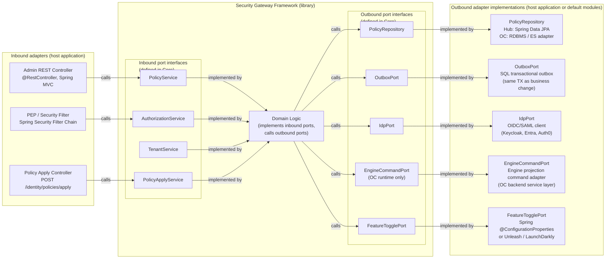
```mermaid
graph LR
  subgraph EXT_IN["Inbound adapters (host application)"]
    AC["Admin REST Controller</br>@RestController, Spring MVC"]
    PEP["PEP / Security Filter</br>Spring Security Filter Chain"]
    PAC["Policy Apply Controller</br>POST /identity/policies/apply"]
  end

  subgraph CORE["Security Gateway Framework (library)"]
    subgraph IN_PORTS["Inbound port interfaces</br>(defined in Core)"]
      PS["PolicyService"]
      AZ["AuthorizationService"]
      TS["TenantService"]
      PA["PolicyApplyService"]
    end
    DL["Domain Logic</br>(implements inbound ports,</br>calls outbound ports)"]
    subgraph OUT_PORTS["Outbound port interfaces</br>(defined in Core)"]
      PR["PolicyRepository"]
      OX["OutboxPort"]
      IDP_P["IdpPort"]
      CMD_P["EngineCommandPort</br>(OC runtime only)"]
      FT_P["FeatureTogglePort"]
    end
  end

  subgraph EXT_OUT["Outbound adapter implementations (host application or default modules)"]
    PR_I["PolicyRepository</br>Hub: Spring Data JPA</br>OC: RDBMS / ES adapter"]
    OX_I["OutboxPort</br>SQL transactional outbox</br>(same TX as business change)"]
    IDP_I["IdpPort</br>OIDC/SAML client</br>(Keycloak, Entra, Auth0)"]
    CMD_I["EngineCommandPort</br>Engine projection command adapter</br>(OC backend service layer)"]
    FT_I["FeatureTogglePort</br>Spring @ConfigurationProperties</br>or Unleash / LaunchDarkly"]
  end

  AC -->|"calls"| PS
  PEP -->|"calls"| AZ
  PAC -->|"calls"| PA

  PS & AZ & TS & PA -->|"implemented by"| DL

  DL -->|"calls"| PR & OX & IDP_P & CMD_P & FT_P

  PR -->|"implemented by"| PR_I
  OX -->|"implemented by"| OX_I
  IDP_P -->|"implemented by"| IDP_I
  CMD_P -->|"implemented by"| CMD_I
  FT_P -->|"implemented by"| FT_I
```

**Inbound port responsibilities and example usage by profile:**

| Inbound port | Responsibility | Used in profiles | Typical host-side adapters |
|---|---|---|---|
| `AuthorizationService` | Evaluate whether the current principal is allowed to access a Hub or OC resource. Resolves the effective permission set from token/session context, roles, groups, mapping rules, and scoped authorizations. | `HUB`, `OC_MANAGED`, `OC_STANDALONE` | Spring Security filter chain, method-security interceptor, API authorization middleware |
| `TenantService` | Resolve and validate the active tenant context for the current request. Provides tenant-aware policy lookup and ensures tenant scoping is applied consistently before authorization decisions are made. | `HUB`, `OC_MANAGED`, `OC_STANDALONE` | Request filter, tenant resolver, REST controller support |
| `PolicyService` | Handle policy authoring and policy read operations in the local source-of-truth runtime. Validates and persists changes to tenants, roles, groups, mapping rules, principals, and authorizations. | `HUB`, `OC_STANDALONE` | Admin REST controller, Admin UI backend |
| `PolicyApplyService` | Accept and apply externally produced policy payloads (`POLICY_SNAPSHOT`, `POLICY_DIFF`) to the local projection. Performs version checks, idempotency handling, and apply orchestration. | `OC_MANAGED` | `POST /identity/policies/apply` controller |

**Outbound port responsibilities and example usage by profile:**

| Outbound port | Responsibility | Used in profiles | Typical host-side implementations                                                |
|---|---|---|----------------------------------------------------------------------------------|
| `PolicyRepository` | Persist and query tenants, roles, mapping rules, principals, and authorizations. | `HUB`, `OC_MANAGED`, `OC_STANDALONE` | Hub: Spring Data JPA adapter; OC: RDBMS/Commands and Camunda Services            |
| `OutboxPort` | Persist and dispatch outbox records transactionally with policy changes for Hub-to-OC propagation. | `HUB` | SQL transactional outbox adapter (same DB transaction as policy write)           |
| `IdpPort` | Resolve IdP metadata, validate tokens, and provide claims needed for principal mapping. | `HUB`, `OC_MANAGED`, `OC_STANDALONE` | OIDC client adapter (Keycloak, Entra, Auth0), SAML adapter                       |
| `EngineCommandPort` | Emit engine-scoped projection commands from OC to engines after local apply or local authoring changes. | `OC_MANAGED`, `OC_STANDALONE` | OC engine command adapter backed by engine command handling                      |
| `FeatureTogglePort` | Expose runtime feature switches for mode-gated behavior (for example outbox dispatch, shadow evaluation). | `HUB`, `OC_MANAGED`, `OC_STANDALONE` | Spring `@ConfigurationProperties` adapter, Unleash adapter, LaunchDarkly adapter |
| `SessionStore` | Persist and retrieve authenticated sessions (create, read, update, delete, cleanup). | `HUB`, `OC_MANAGED`, `OC_STANDALONE` | Redis adapter, SQL session adapter, in-memory adapter                            |

This design guarantees that **swapping a database, replacing the IdP client, or providing a custom command backend requires only a new adapter class** — no changes to the domain core.

#### 5.4.1 Runtime profiles and mode switching

The same library core is reused in all deployments. **In every runtime profile, AuthN and AuthZ enforcement is always active** — the library always configures a Spring Security filter chain to authenticate inbound requests and enforce scope-aware authorization decisions. What differs per profile is which additional capabilities (authoring, outbox dispatch, engine projection) are switched on.

Hub enforces AuthN/AuthZ for its own application scope: Console, Web Modeler, and the Admin UI are all protected by Hub-scoped roles and authorizations. This is exactly the same `AuthorizationService` and `IdpPort` used by OC, just configured with Hub-scoped resources instead of cluster/engine resources.

| Profile | AuthN/AuthZ enforcement | Policy source | Outbox dispatch to OCs | Engine projection |
|---|---|---|---|---|
| `HUB` | ✅ Hub-scoped (org, workspace, cluster resources) | Hub is SoT | ✅ via `OutboxPort` | ❌ no engines in Hub |
| `OC_MANAGED` | ✅ Cluster-scoped (engine, tenant, task resources) | Receives from Hub | ❌ | ✅ via `EngineCommandPort` |
| `OC_STANDALONE` | ✅ Cluster-scoped (engine, tenant, task resources) | OC is local SoT | ❌ | ✅ via `EngineCommandPort` |

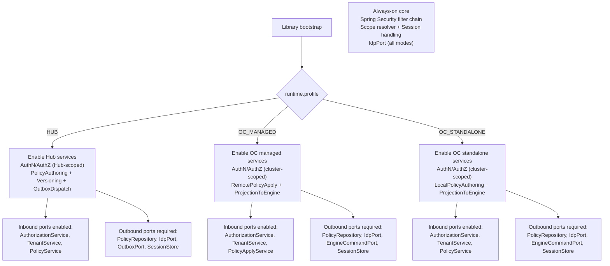
```mermaid
flowchart TB
  Start["Library bootstrap"] --> Profile{"runtime.profile"}

  Profile -->|"HUB"| Hub["Enable Hub services<br>AuthN/AuthZ (Hub-scoped)<br>PolicyAuthoring + Versioning + OutboxDispatch"]
  Profile -->|"OC_MANAGED"| OCM["Enable OC managed services<br>AuthN/AuthZ (cluster-scoped)<br>RemotePolicyApply + ProjectionToEngine"]
  Profile -->|"OC_STANDALONE"| OCS["Enable OC standalone services<br>AuthN/AuthZ (cluster-scoped)<br>LocalPolicyAuthoring + ProjectionToEngine"]

  Core["Always-on core<br>Spring Security filter chain<br>Scope resolver + Session handling<br>IdpPort (all modes)"]

  Hub --> HubIn["Inbound ports enabled:<br>AuthorizationService, TenantService, PolicyService"]
  OCM --> OCMIn["Inbound ports enabled:<br>AuthorizationService, TenantService, PolicyApplyService"]
  OCS --> OCSIn["Inbound ports enabled:<br>AuthorizationService, TenantService, PolicyService"]

  Hub --> HubPorts["Outbound ports required:<br>PolicyRepository, IdpPort, OutboxPort, SessionStore"]
  OCM --> OCMPorts["Outbound ports required:<br>PolicyRepository, IdpPort, EngineCommandPort, SessionStore"]
  OCS --> OCSPorts["Outbound ports required:<br>PolicyRepository, IdpPort, EngineCommandPort, SessionStore"]
```

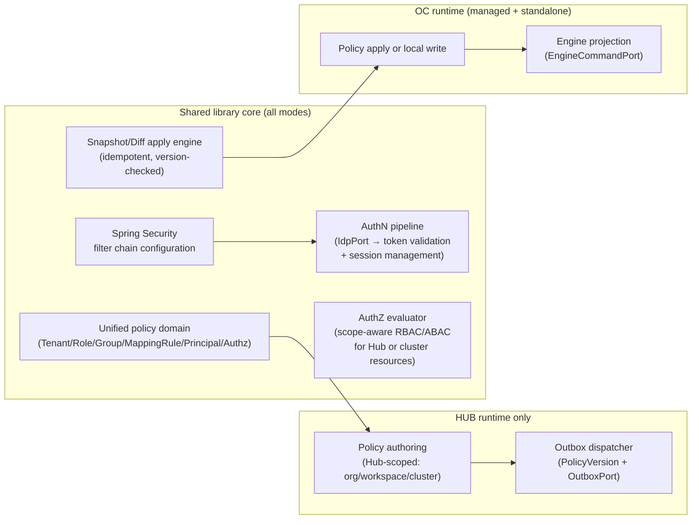
```mermaid
flowchart LR
  subgraph SharedCore["Shared library core (all modes)"]
    SpringSec["Spring Security<br>filter chain configuration"]
    AuthN["AuthN pipeline<br>(IdpPort → token validation<br>+ session management)"]
    AuthZ["AuthZ evaluator<br>(scope-aware RBAC/ABAC<br>for Hub or cluster resources)"]
    Domain["Unified policy domain<br>(Tenant/Role/Group/MappingRule/Principal/Authz)"]
    Apply["Snapshot/Diff apply engine<br>(idempotent, version-checked)"]

    SpringSec --> AuthN
  end

  subgraph HubRuntime["HUB runtime only"]
    HubAuthoring["Policy authoring<br>(Hub-scoped: org/workspace/cluster)"]
    HubOutbox["Outbox dispatcher<br>(PolicyVersion + OutboxPort)"]
    HubAuthoring --> HubOutbox
  end

  subgraph OcRuntime["OC runtime (managed + standalone)"]
    OcWrite["Policy apply or local write"]
    OcProject["Engine projection<br>(EngineCommandPort)"]
    OcWrite --> OcProject
  end

  Domain --> HubAuthoring
  Apply --> OcWrite
```

#### 5.4.2 Why a shared Security Gateway Framework layer?

The extra layer between UIs/clients and engines is intentional:

- Centralized policy enforcement
  - All web UIs (Hub apps, Operate, Tasklist, Admin) and all API clients (workers, automation, integrations) talk to the same policy engine per deployment boundary (Hub or OC).
  - Engines no longer need to embed IdP and policy logic; they only evaluate engine-local projections and commands.
- Reuse across Hub and OC
  - The same library, with the same domain model and ports, is embedded into Hub and OC.
  - Differences between full mode (Hub + OC) and OC-only mode are expressed via adapters and configuration, not divergent business logic.
- Clean separation of concerns
  - IdP integration, session handling, multi-tenancy, mapping rules, and authorization decisions are handled in one place.
  - Engine integration is reduced to a narrow command API (Security Engine Framework) that can evolve independently.
- Pluggable backends
  - Concrete persistence (SQL, search), outbox transport, and IdP clients can be swapped or customized by providing alternative adapters, without changing the domain model.

The IdP plays a standard role in this picture:

- Hub and OC instances of the framework use the `IdpPort` to integrate with OIDC/SAML IdPs per tenant.
- There is no dedicated or separate IdP “for the gateway”; the framework acts as the OIDC/SAML client against the configured IdPs.

### 5.5 Persistent sessions

Persistent sessions are required for the OC authentication UX and remain part of the unified architecture.

#### Current status

- OC already uses persistent server-side web sessions.
- Sessions are backed by existing secondary storage integrations (RDBMS or search backends).
- Session cleanup and logout invalidation are already implemented in the current authentication module.

#### Target in unified architecture

- Keep persistent sessions as the default behavior in `Security Gateway Framework`.
- Expose session persistence behind a `SessionStore` port so integrating applications can choose the backend.
- Enforce timeout-based expiry (idle and absolute timeout) and explicit logout invalidation.
- Keep session handling local per deployment:
  - In full mode, Hub and each OC manage their own sessions independently.
  - In OC-only mode, OC is the only session authority.
- Session data is not propagated via the policy outbox flow.

### 5.6 Single shared Admin UI

TODO

### 5.7 Scoped Policies

#### 5.7.1 Multi Engine support

The unified identity plane supports multiple engines per Orchestration Cluster in both deployment modes:

- Full mode (Hub + OC): Hub as SoT defines cluster-scoped policies (roles, mappings, tenants, authorizations), OC projects them, and engines consume scoped views.
- OC-only mode: OC is SoT for local policies and propagates scoped views directly to engines.
- Policy scoping supports all levels needed for multi-engine and multi-tenant operation: `ALL` (cluster-wide), `TENANT` (tenant-wide), `ENGINE` (engine-wide), and `TENANT_ENGINE` (tenant within a specific engine).
- In both modes: Engines do not define their own identity models.

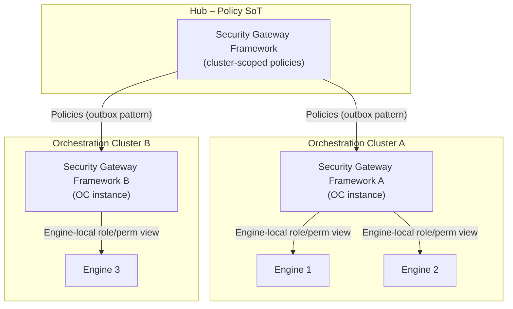
```mermaid
flowchart TB
  subgraph HubLayer["Hub – Policy SoT"]
    HubPolicy["Security Gateway Framework</br>(cluster-scoped policies)"]
  end

  subgraph OC1["Orchestration Cluster A"]
    OC1Id["Security Gateway Framework A</br>(OC instance)"]
    E1["Engine 1"]
    E2["Engine 2"]
  end

  subgraph OC2["Orchestration Cluster B"]
    OC2Id["Security Gateway Framework B</br>(OC instance)"]
    E3["Engine 3"]
  end

  HubPolicy -->|"Policies (outbox pattern)"| OC1Id & OC2Id

  OC1Id -->|"Engine-local role/perm view"| E1 & E2
  OC2Id -->|"Engine-local role/perm view"| E3
```

- In full mode, Hub is the single SoT; policy flows downward: Hub → all OCs → all Engines.
- OC identity instances maintain cluster-local projections and handle engine-level scoping.
- OC identity instances also enforce tenant-level scoping and combined tenant+engine scoping where required.
- Engines consume the cluster-level projection; they do not define their own identity models and cannot override OC policy.
- In OC-only mode, the same projection model applies with local flow: OC → Engines.

#### 5.7.2 Multi Tenant support

Multi-tenancy is a first-class concern in the policy model. Tenant configuration is authored once in Hub and propagated top-down to OC and then to engines. Each layer maintains tenant-aware roles, mapping rules, and authorizations.

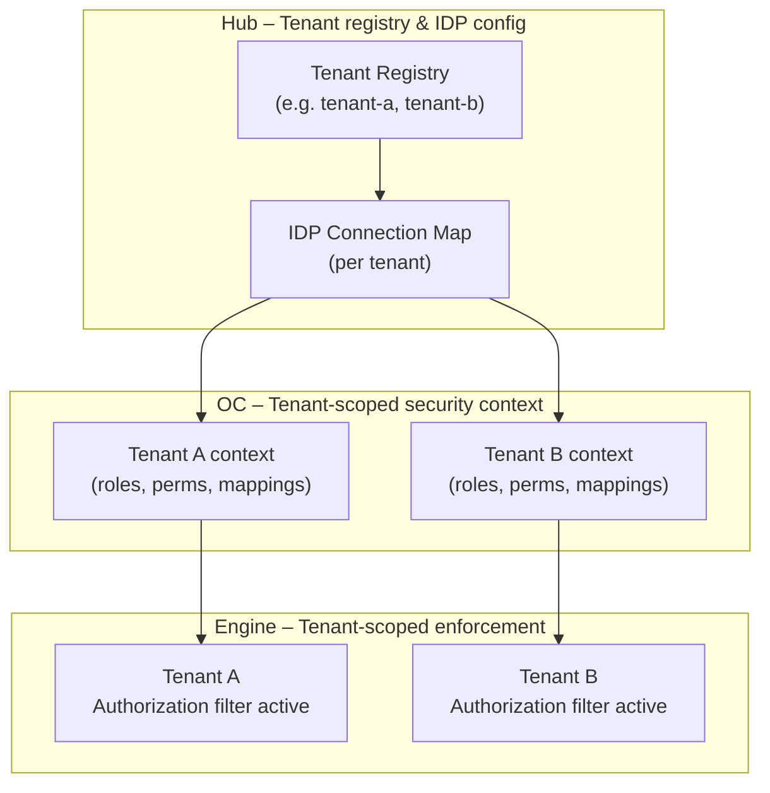
```mermaid
graph TB
  subgraph HubTenants["Hub – Tenant registry & IDP config"]
    TR["Tenant Registry</br>(e.g. tenant-a, tenant-b)"]
    IdpMap["IDP Connection Map</br>(per tenant)"]
  end

  subgraph OCView["OC – Tenant-scoped security context"]
    OC_TA["Tenant A context</br>(roles, perms, mappings)"]
    OC_TB["Tenant B context</br>(roles, perms, mappings)"]
  end

  subgraph EngineView["Engine – Tenant-scoped enforcement"]
    ENG_TA["Tenant A</br>Authorization filter active"]
    ENG_TB["Tenant B</br>Authorization filter active"]
  end

  TR --> IdpMap
  IdpMap --> OC_TA & OC_TB
  OC_TA --> ENG_TA
  OC_TB --> ENG_TB
```

On each request, the Security Gateway Framework:

1. Resolves the tenant context from token claims and/or headers.
2. Loads the tenant-specific policy view (roles, mappings, authorizations).
3. Enforces permissions within the tenant boundary, preventing cross-tenant data access.

#### 5.7.3 Global vs scoped policies (tenant and engine)

The policy model supports both:

- Global roles and permissions
  - Roles (for example `ClusterAdmin`, `SupportAgent`) are defined once per cluster in Hub or OC.
  - Authorizations with scope `ALL` apply across all engines in the cluster.
- Tenant- and engine-scoped authorizations
  - The same role can have additional authorizations restricted to a tenant (`scope_type = TENANT`), a specific engine (`scope_type = ENGINE`), or a tenant within a specific engine (`scope_type = TENANT_ENGINE`).
  - Example: `SupportAgent` role may have:
    - Global read/update access to user tasks across all engines (`ALL`).
    - Additional read access to process instances only on `engine-2` (`ENGINE`).
    - Access to process instances only for tenant `retail` (`TENANT`) or only for tenant `retail` on `engine-2` (`TENANT_ENGINE`).

Roles and groups are always defined at the OC/cluster level; engine-specific behavior is expressed through scoping of authorizations, not through engine-local role definitions.

---

## 6. Runtime view (selected scenarios)

This section illustrates selected runtime flows as concrete user journeys, focusing on who performs which action at which point in time.

### 6.1 Admin configures cluster policies in full mode (Hub + OC)

1. Admin logs into Hub Admin UI.
2. Hub Security Gateway Framework authenticates the user against the configured IdP for the Hub organization and derives roles/tenants via mapping rules.
3. Admin creates or updates tenants, roles, mapping rules, and authorizations for a specific Orchestration Cluster in the Admin UI.
4. Hub Security Gateway Framework:
  - Resolves the organization and target cluster context (with cluster metadata currently coming from the Console backend in SaaS).
  - Validates and persists the changes in the Hub DB under that organization scope.
  - Writes a new `PolicyVersion` and associated `EntityRevision` and `PolicyVersionChange` rows.
  - Writes one or more `OutboxEvent`s in status `PENDING` for the affected OCs.
5. Outbox Dispatcher picks up the new events:
  - Decides between `POLICY_SNAPSHOT` and `POLICY_DIFF` per OC based on `OcSyncState.last_acked_version`.
  - Posts the payload to `/identity/policies/apply` on each target OC.
6. OC Security Gateway Framework:
  - Validates `base_version` against its `last_applied_version`.
  - Applies the snapshot or diff to its local projection and updates `last_applied_version`.
  - Propagates engine-scoped changes to engines via the engine command path / Security Engine Framework.

From the admin’s perspective, all policy changes are made centrally in Hub; the OC and engines converge asynchronously.

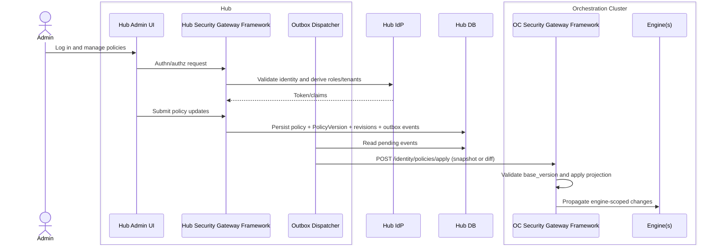
```mermaid
sequenceDiagram
  actor Admin
  box Hub
    participant HubUI as Hub Admin UI
    participant HubSGF as Hub Security Gateway Framework
    participant Outbox as Outbox Dispatcher
  end
  participant IdP as Hub IdP
  participant HubDB as Hub DB
  box Orchestration Cluster
    participant OCSGF as OC Security Gateway Framework
    participant Engine as Engine(s)
  end

  Admin->>HubUI: Log in and manage policies
  HubUI->>HubSGF: Authn/authz request
  HubSGF->>IdP: Validate identity and derive roles/tenants
  IdP-->>HubSGF: Token/claims
  HubUI->>HubSGF: Submit policy updates
  HubSGF->>HubDB: Persist policy + PolicyVersion + revisions + outbox events
  Outbox->>HubDB: Read pending events
  Outbox->>OCSGF: POST /identity/policies/apply (snapshot or diff)
  OCSGF->>OCSGF: Validate base_version and apply projection
  OCSGF->>Engine: Propagate engine-scoped changes
```

### 6.2 End user logs into Operate in full mode

1. User opens Operate in the browser.
2. Operate delegate authentication to the OC’s Security Gateway Framework (for example via OAuth2 login flow or existing session cookie).
3. OC Security Gateway Framework:
  - Redirects or talks to the configured IdP for the user’s tenant.
  - Validates the returned OIDC/SAML token and derives the principal’s roles, groups, and tenant assignments from mapping rules and direct assignments.
4. For each incoming request from Operate:
  - OC resolves the tenant context (from token claims and/or headers).
  - Loads the tenant- and engine-scoped policy view from its local projection (which is synchronized from Hub).
  - Evaluates whether the principal has the required permissions on the requested resource (for example reading process instances in a given tenant).
5. If the check passes:
  - OC forwards or executes the corresponding operation against the engine(s).
  - Engines apply their own runtime-level checks (for example engine-level authorization filters) based on the OC-provided projections.
6. If the check fails:
  - OC denies the request and returns an appropriate error to Operate.

The user never interacts directly with Hub; Hub’s role is to define the policy that OC enforces.

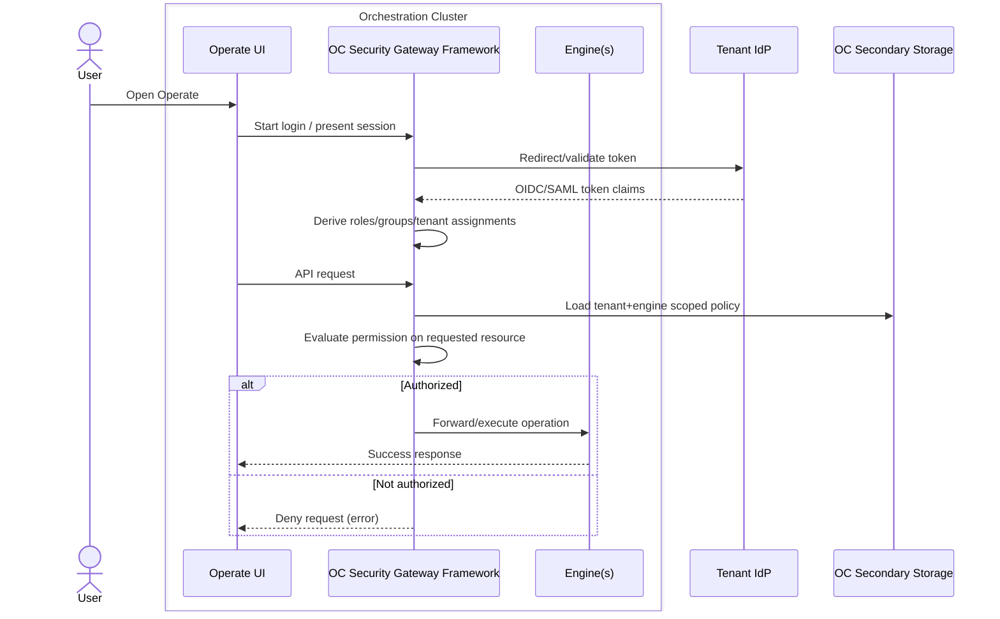
```mermaid
sequenceDiagram
  actor User
  box Orchestration Cluster
    participant Operate as Operate UI
    participant OCSGF as OC Security Gateway Framework
    participant Engine as Engine(s)
  end
  participant IdP as Tenant IdP
  participant SecStore as OC Secondary Storage

  User->>Operate: Open Operate
  Operate->>OCSGF: Start login / present session
  OCSGF->>IdP: Redirect/validate token
  IdP-->>OCSGF: OIDC/SAML token claims
  OCSGF->>OCSGF: Derive roles/groups/tenant assignments

  Operate->>OCSGF: API request
  OCSGF->>SecStore: Load tenant+engine scoped policy
  OCSGF->>OCSGF: Evaluate permission on requested resource
  alt Authorized
    OCSGF->>Engine: Forward/execute operation
    Engine-->>Operate: Success response
  else Not authorized
    OCSGF-->>Operate: Deny request (error)
  end
```

### 6.3 Worker authenticates against cluster APIs

1. A worker application gets a token from the customer’s IdP using the configured client credentials (machine principal).
2. The worker calls OC gRPC/REST APIs with the token.
3. OC Security Gateway Framework:
  - Validates the token against the IdP.
  - Maps its claims to machine principal permissions via mapping rules and authorizations (for example which tenants and which process instances the worker can access).
4. If authorized, the worker’s request is executed against the engine(s); otherwise it is rejected.

The same unified policy model governs both human users and machine principals.

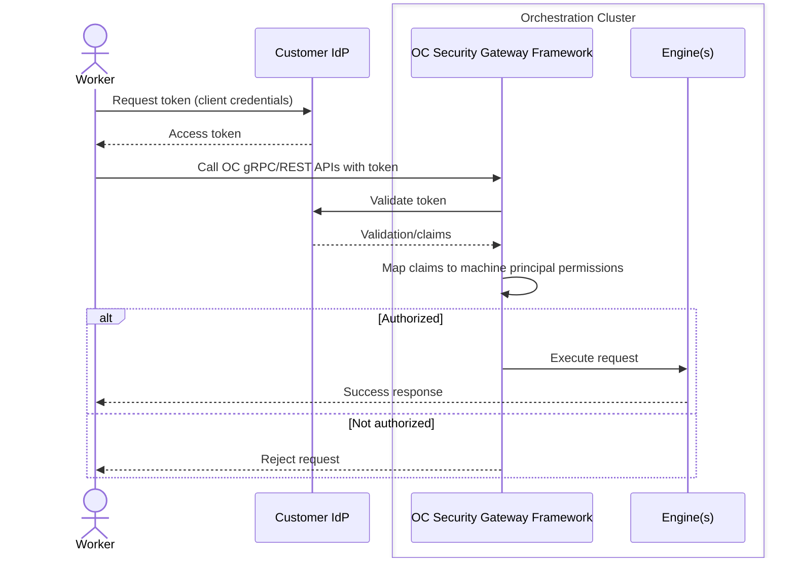
```mermaid
sequenceDiagram
  actor Worker
  participant IdP as Customer IdP
  box Orchestration Cluster
    participant OCSGF as OC Security Gateway Framework
    participant Engine as Engine(s)
  end

  Worker->>IdP: Request token (client credentials)
  IdP-->>Worker: Access token
  Worker->>OCSGF: Call OC gRPC/REST APIs with token
  OCSGF->>IdP: Validate token
  IdP-->>OCSGF: Validation/claims
  OCSGF->>OCSGF: Map claims to machine principal permissions
  alt Authorized
    OCSGF->>Engine: Execute request
    Engine-->>Worker: Success response
  else Not authorized
    OCSGF-->>Worker: Reject request
  end
```

---

## 7. Deployment view

### 7.1 Self-Managed deployment

In Self-Managed, the customer owns and operates all infrastructure. Two deployment modes are supported, mirroring the general modes described in section 4.

#### 7.1.1 OC-only mode (standalone Orchestration Cluster)

The most common Self-Managed topology. Hub is not present; the Orchestration Cluster is the local source of truth for all policy. The Admin UI runs in read/write mode. The customer's Enterprise IdP (Keycloak, Entra, Okta, etc.) is configured directly on the OC.

- OC acts as local SoT for identity and policy.
- The Enterprise IdP is integrated directly via OIDC/SAML; no Camunda-operated broker is involved.
- Multiple engines per cluster are supported with OC-level policy propagation.
- Suitable for production use cases that do not require cross-cluster policy management.

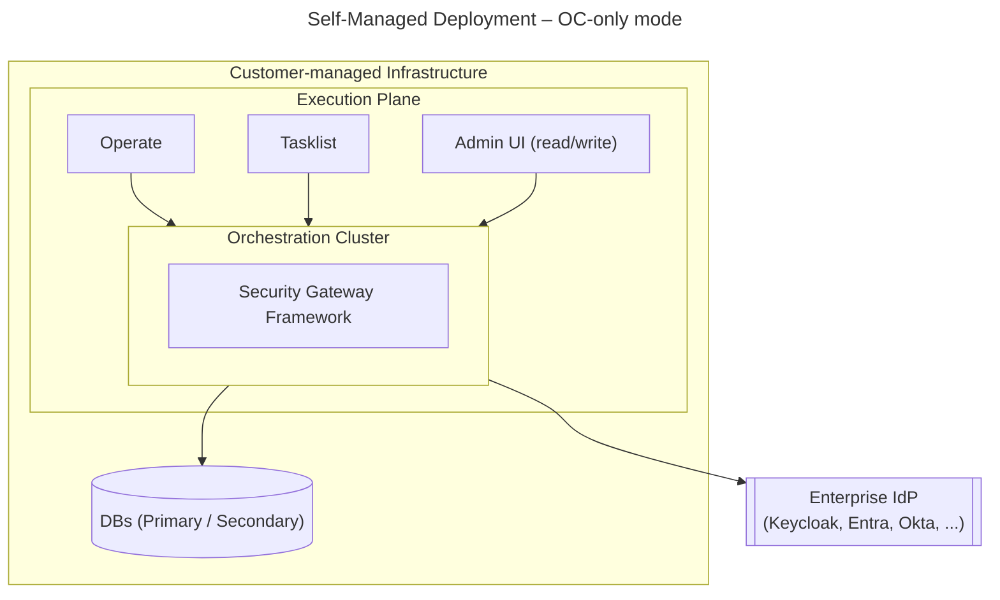
```mermaid
---
title: Self-Managed Deployment – OC-only mode
---
flowchart TB
  subgraph Customer["Customer-managed Infrastructure"]
    subgraph Execution["Execution Plane"]
      Operate["Operate"]
      Tasklist["Tasklist"]
      AdminUI["Admin UI (read/write)"]

      subgraph OC["Orchestration Cluster"]
        SecGatOC["Security Gateway Framework"]
      end

      Operate & Tasklist & AdminUI --> OC
    end

    DBs[("DBs (Primary / Secondary)")]
    OC --> DBs
  end

  EnterpriseIdP[["Enterprise IdP</br>(Keycloak, Entra, Okta, ...)"]]
  OC --> EnterpriseIdP
```

#### 7.1.2 Full mode (Hub + Orchestration Cluster, self-managed)

An advanced Self-Managed topology where the customer also operates Hub. Hub becomes the central policy SoT, and policy is propagated via the outbox pattern to each OC. The Admin UI on OC runs in read-only mode; all policy authoring happens in Hub.

- Hub and all OC instances are deployed and operated by the customer on their own infrastructure.
- The Enterprise IdP is integrated at both Hub (management plane auth) and OC (execution plane auth) levels.
- Cluster discovery in Hub becomes feasible once the Console backend is hosted in Hub and the experimental discovery mode (`CAMUNDA_CONSOLE_EXPERIMENTAL_DISCOVERY_MODE=true`) is enabled.
- Policy flows top-down: Hub → OC → Engine, same as in SaaS, but without a Camunda-operated broker.
- Suitable for large-scale or multi-cluster Self-Managed environments requiring centralized policy governance.

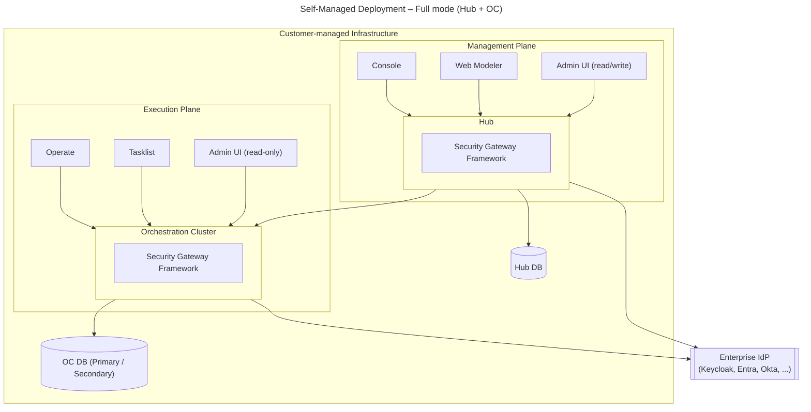
```mermaid
---
title: Self-Managed Deployment – Full mode (Hub + OC)
---
flowchart TB
  subgraph Customer["Customer-managed Infrastructure"]
    subgraph MgmtPlane["Management Plane"]
      Console["Console"]
      WebModeler["Web Modeler"]
      AdminHub["Admin UI (read/write)"]

      subgraph Hub["Hub"]
        SecGatHub["Security Gateway Framework"]
      end

      Console & WebModeler & AdminHub --> Hub
    end

    subgraph Execution["Execution Plane"]
      Operate["Operate"]
      Tasklist["Tasklist"]
      AdminOC["Admin UI (read-only)"]

      subgraph OC["Orchestration Cluster"]
        SecGatOC["Security Gateway Framework"]
      end

      Operate & Tasklist & AdminOC --> OC
    end

    HubDB[("Hub DB")]
    OCDB[("OC DB (Primary / Secondary)")]

    Hub --> OC
    Hub --> HubDB
    OC --> OCDB
  end

  EnterpriseIdP[["Enterprise IdP</br>(Keycloak, Entra, Okta, ...)"]]
  Hub & OC --> EnterpriseIdP
```

---

### 7.2 SaaS deployment

In SaaS, Camunda operates one shared Hub instance for many customer organizations. The unified identity library therefore has to support multi-organization policy authoring and propagation inside a single Hub runtime.

- One shared Hub instance serves multiple organizations; policy and identity data in Hub must therefore be partitioned by organization.
- In the first iterations, this partitioning is logical only: shared Hub databases and infrastructure are reused, while policy tables and queries are keyed by `organization_id`.
- Each OC remains associated with exactly one organization boundary for policy propagation.
- Today, Hub does not own orchestration-cluster metadata directly in SaaS. To show/select OCs and target policy rollout, Hub must query the Console backend.
- Discovering newly created OCs, and deciding how Hub learns about them without drifting from Console, remains an open question.
- During migration, SaaS may still keep Auth0 or another broker as an internal implementation detail; this does not change the target policy model.

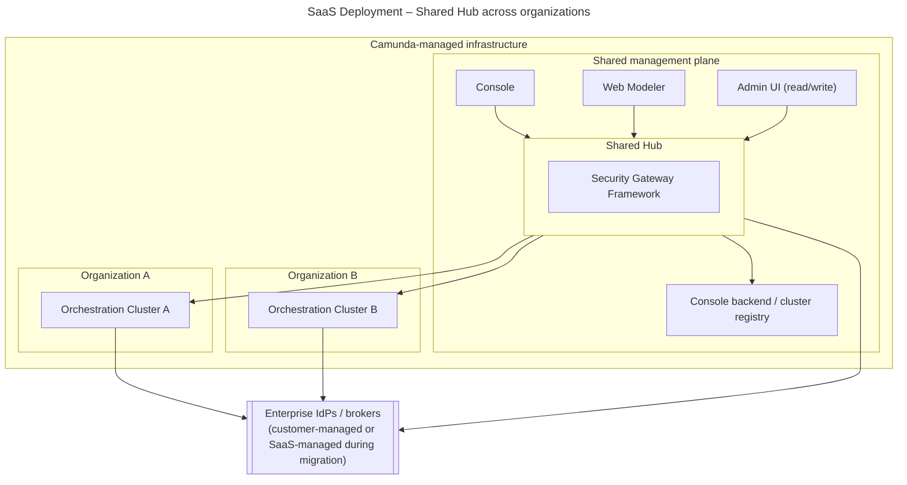
```mermaid
---
title: SaaS Deployment – Shared Hub across organizations
---
flowchart TB
  subgraph Camunda["Camunda-managed infrastructure"]
    subgraph SharedMgmt["Shared management plane"]
      Console["Console"]
      WebModeler["Web Modeler"]
      AdminHub["Admin UI (read/write)"]
      ConsoleBackend["Console backend / cluster registry"]

      subgraph Hub["Shared Hub"]
        SecGatHub["Security Gateway Framework"]
      end

      Console & WebModeler & AdminHub --> Hub
      Hub --> ConsoleBackend
    end

    subgraph OrgA["Organization A"]
      OCA["Orchestration Cluster A"]
    end

    subgraph OrgB["Organization B"]
      OCB["Orchestration Cluster B"]
    end

    Hub --> OCA
    Hub --> OCB
  end

  EnterpriseIdP[["Enterprise IdPs / brokers</br>(customer-managed or SaaS-managed during migration)"]]
  Hub & OCA & OCB --> EnterpriseIdP
```

---

## 8. Crosscutting concepts (target)

- IdP-agnostic: Any OIDC/SAML IdP integrating via standards (no IdP-specific code in the domain layer).
- RBAC + ABAC: Roles and authorizations with optional attribute-based policies (resource attributes, environment conditions).
- Multi-tenancy: Tenant-aware identity context propagated from tokens/headers; tenant-specific policy and IdP configuration; outbox filters by tenant.
- Lifecycle handling: Principal and tenant assignment are derived from IdP claims and mapping rules; clusters receive derived principals and policies from Hub.
- Observability: Identity flows emit metrics, logs, and traces (e.g. authn attempts, authz decisions, outbox propagation delay, health indicators). For Spring Security instrumentation, align with the Spring Security observability integration guidance: https://docs.spring.io/spring-security/reference/reactive/integrations/observability.html

---

## 9. Architecture decisions and open points

This unified architecture builds on existing identity arc42 docs and ADRs for OC Identity and Management Identity; those ADRs remain the canonical source for detailed trade-offs. The main new decisions here are:

- Use a shared hexagonal Security Gateway Framework with SPIs for persistence, outbox, IdP, OC commands, and (optionally) engine-level integration.
- Use Hub as policy SoT whenever present; OC-only deployments are treated as documented first-class modes, not afterthoughts.
- Ship a single shared Admin UI package, feature-gated by configuration for Hub vs OC, standalone vs Hub-managed.
- Make multi-tenancy and multi-engine support explicit in the core model and diagrams, not side effects.

### 9.1 Open High Level points (to be refined in separate ADRs):

- Exact SPI boundaries for OC/engine command creation.
- Migration path from current Auth0-based SaaS setup to “Enterprise IdP as SoT” while keeping Auth0 as a private implementation detail.
- If the endpoints to apply policy changes are public, Hub will not be aware of what a customer applies to OC and will run out of sync.
- Which data should be persisted directly by security gateway (like sessions) and which should go via engine / exporter? (We will need policy metadata, but this is not of interest for the engine so will not be part of any record through the engine)
- How can we apply a snapshot multiple times? How could we reset the projections in primary and secondary storage?
- How Hub should discover newly created OCs in SaaS while the authoritative cluster list still lives in the Console backend, and how that evolves once Console is embedded in Hub for Self-Managed with `CAMUNDA_CONSOLE_EXPERIMENTAL_DISCOVERY_MODE=true`.

### 9.2 Detailed ADRs

This section contains detailed Architectural Decision Records (ADRs) for the Security Gateway Framework. Each ADR documents a specific decision, the context, alternatives considered, and consequences.

- [ADR-0001: Link PolicyVersion with policy data via versioned change sets](adr/0001-policy-version-change-sets.md)
- [ADR-0002: Placement of the Security Gateway Framework (embedded vs standalone service)](adr/0002-placement-of-the-security-gateway-framework.md)
- [ADR-0003: Push vs Pull Policy Propagation (Hub ↔ Orchestration Clusters)](adr/0003-Push-vs-Pull-Policy-Propagation.md)

---

### Sources

- [Unified Identity Target Architecture for Camunda Hub and Orchestration Clusters](https://docs.google.com/document/d/1ExLH2KYmz_V7Zq51adzz9c1Yk2s5ZR7ZhhIKwaEcPs0)
