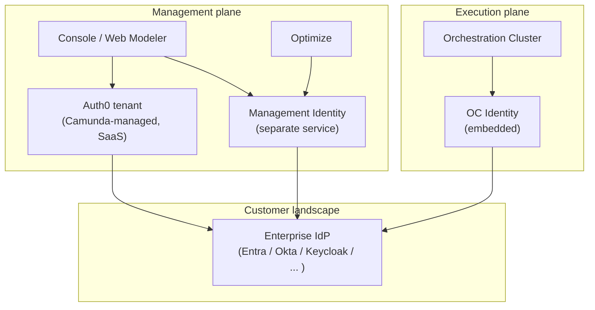
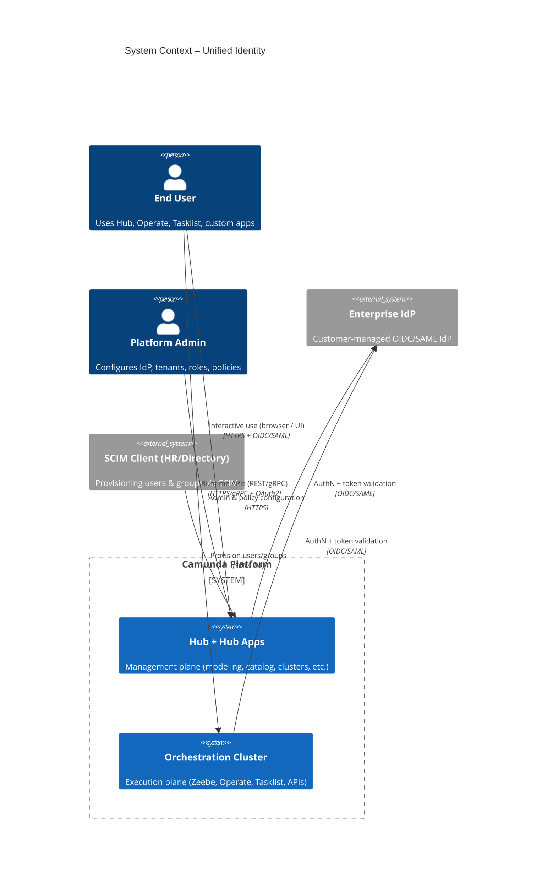
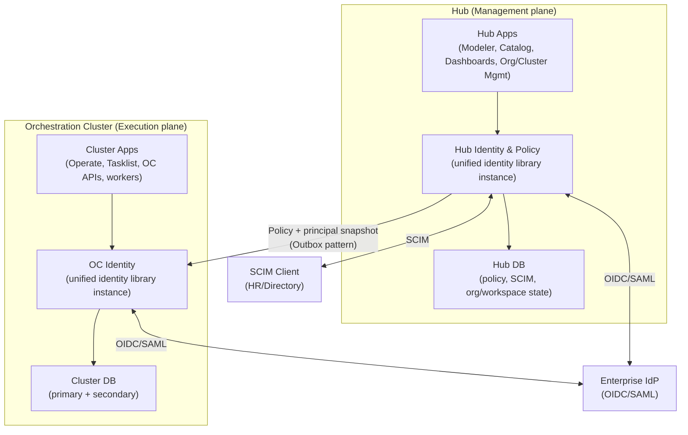
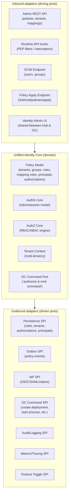
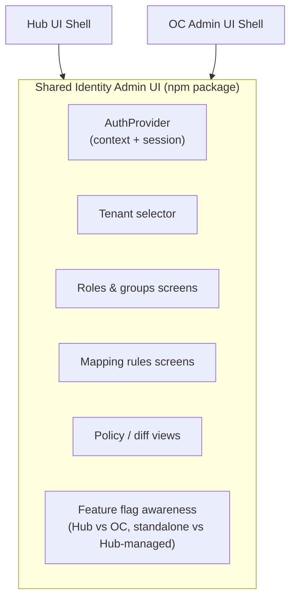
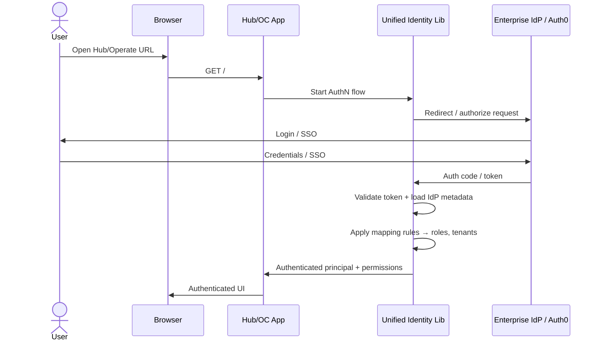
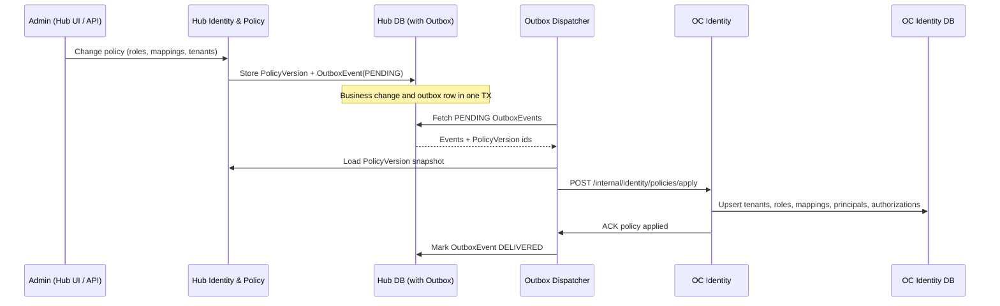
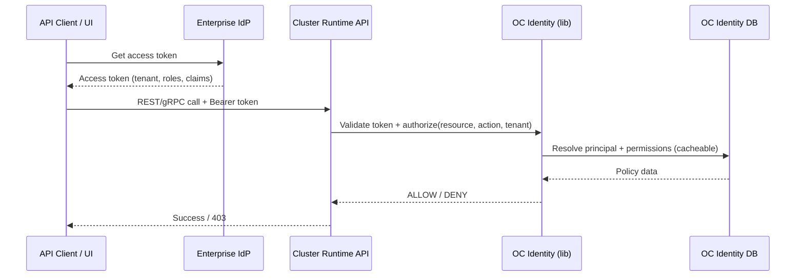

# 1. Introduction and goals

This document describes the planned **Unified Identity Architecture** for Camunda Hub and Orchestration Clusters in an arc42-style structure. It:

- Summarizes the **current identity architecture** across Camunda platform components (OC Identity, Management Identity, SaaS Auth0).
- Proposes a **target architecture** with a single identity plane, implemented as a **hexagonal library** reused in Hub and Orchestration Clusters.
- Defines how identity policy is authored once and enforced consistently in all clusters.
- Outlines how a **single shared frontend** and pluggable backends (persistence, OC command creation, etc.) fit into the design.

---

# 2. Current identity architecture (Camunda platform today)

## 2.1 Identity components

Today, identity responsibilities are split across several components:

- **Orchestration Cluster Identity (OC Identity)**
  - Embedded into the Orchestration Cluster runtime.
  - Manages runtime authentication and fine-grained authorizations (process definitions, instances, tasks, tenants, cluster APIs) for Zeebe, Operate, and Tasklist.

- **Management Identity**
  - Separate service used to control access to **Web Modeler, Console, and Optimize** and other management-plane functions in earlier releases.
  - Uses Keycloak or an external OIDC provider plus its own SQL database in self-managed deployments (see existing Management Identity arc42 docs).

- **SaaS Auth0 tenant (Console / Hub)**
  - In SaaS today, Console and other management-side UIs use a Camunda-operated Auth0 tenant as their IdP/broker.
  - From the target-architecture perspective, this is an **internal broker/IdP implementation detail**, not part of the long-term reference model.

- **Customer Enterprise IdPs**
  - In self-managed and in the target state, the **Enterprise IdP is always the customer’s IdP** (Entra, Okta, Keycloak, etc.), integrated via standard OIDC/SAML.

## 2.2 Current high-level structure



Characteristics:

- Two distinct identity “silos” (Management Identity vs OC Identity), plus Auth0 in SaaS.
- Identity models and configuration concepts differ between Management Identity and OC Identity.
- Policy lifecycle is partly manual and duplicated across planes.

## 2.3 Limitations and motivation for change

Based on the target-architecture appendix and identity roadmap, the current setup has several issues:

- **Split identity**
  - Separate models and configuration for Management Identity vs OC Identity.
  - SaaS and self-managed use different stacks (Auth0 vs direct IdP).

- **SaaS vs self-managed parity gaps**
  - Capabilities such as mapping rules, tenants, SCIM lifecycle, and fine-grained RBAC/ABAC differ or are missing depending on deployment.

- **Manual lifecycle and configuration**
  - Joiner/mover/leaver flows are not fully automated from the customer’s IdP/HR system.
  - Tenants, roles, and mappings are often configured by hand in UIs.

- **Limited observability and migration tooling**
  - Identity migrations (e.g. Management Identity → unified plane) and policy changes are fragile, not first-class “jobs”.
  - It is hard to see and debug “identity health” end to end.

These limitations motivate a **unified identity plane** with consistent semantics and tooling across Hub and all clusters.

---

# 3. Solution strategy: unified identity plane and library

The target architecture introduces **one consistent identity and policy model** shared between Hub and all Orchestration Clusters:

- **Hub Identity & Policy**
  - Source of Truth (SoT) for **users, groups, roles, tenants, mapping rules, and authorizations** for all clusters and Hub apps.

- **OC Identity**
  - Per-cluster **projection and enforcement** of that policy, optimized for runtime access checks.

- **Single identity plane for all consumers**
  - Web UIs, user apps, workers, and integrations are all just API clients authenticated by the Enterprise IdP and authorized against this unified policy model.

Technically, this is implemented as a **pluggable identity/security library**:

- Embedded into Hub and Orchestration Cluster (and optionally other apps).
- Exposes **AuthN (OIDC/SAML)** and **AuthZ (RBAC/ABAC)** capabilities via well-defined SPIs.
- **Reuses the host application’s existing storage and infrastructure** via SPI interfaces (no new standalone database or service).

Key design principles (selected):

- **One identity plane** for Hub and OC, with Hub as policy SoT.
- **SaaS / self-managed parity**: same concepts (tenants, mapping rules, fine-grained permissions, BYO IdP, SCIM) in both deployment models.
- **Hexagonal architecture**: all persistence, messaging, and OC command creation are behind interfaces; default implementations can be swapped or replaced entirely.
- **IdP-agnostic**: only relies on OIDC, SAML, SCIM 2.0, so any compliant IdP can integrate.
- **Automated lifecycle and migrations**: SCIM-driven provisioning and outbox-based policy replication, with idempotent and observable migrations.

---

# 4. Target system context

## 4.1 Identity planes

Conceptually, the platform is split into a **management/control plane** (Hub) and an **execution plane** (Orchestration Clusters). Both use the same identity model and the same hexagonal identity library:



- Hub hosts **Hub Identity & Policy** (SoT for policy per cluster).
- Each Orchestration Cluster hosts an **OC Identity** instance enforcing that policy locally.

---

# 5. Building block view (target)

## 5.1 High-level components



- Hub Identity & Policy is **authoring and SoT** for the shared policy model per cluster.
- OC Identity is a **replica and enforcement layer**; it never becomes the primary SoT for policy when Hub is present.
- Data and policy replication Hub → clusters uses an **outbox pattern** with explicit `PolicyVersion` and `OutboxEvent` entities.

## 5.2 Unified Identity Library – hexagonal architecture

The core design is a **hexagonal (ports-and-adapters) library** used inside Hub and OC. All real implementations of persistence, messaging, and OC command creation are hidden behind interfaces and can be provided by the host application (or even by a customer extension).



Key properties:

- **Persistence behind SPI**
  - The library does **not** introduce its own database; it reuses the host app’s existing database or search store via adapters (e.g. JPA in Hub, OC’s primary/secondary storage in clusters).

- **Outbox behind SPI**
  - Policy replication is expressed as **outbox commands** via an Outbox SPI, again reusing the host DB (SQL-based transactional outbox, etc.).

- **OC command creation behind SPI**
  - The library does not know how to “start a process” or “create a command” in OC directly; instead, it calls a **Command SPI**, which the OC backend implements using its service layer. This keeps the library reusable and testable and allows experimental or customer-specific command backends.

- **Feature toggles**
  - Capabilities like outbox publishing, outbox consuming, multi-tenancy, or shadow-mode evaluation are controlled via a Feature Toggle SPI, with property-based default implementation.

This design ensures **implementation details (DB type, outbox transport, OC command wiring)** are entirely hidden behind interfaces and can be implemented by Camunda or extended by customers.

## 5.3 Single shared Identity Admin UI

The target frontend approach is a **single Identity Admin UI package** reused by Hub and OC, with behavior controlled by configuration (e.g. “Hub-managed” vs “standalone OC”) and feature toggles.



Examples:

- In **Hub**, the UI exposes full policy authoring (tenants, mapping rules, fine‑grained permissions) for all clusters.
- In **OC with Hub present**, the same UI runs **read-only / diagnostic mode** (inspect cluster-local projection, health, last applied policy).
- In **standalone OC**, the UI enables direct local policy management; Hub integration and outbox features are disabled by configuration.

---

# 6. Runtime view (selected scenarios)

## 6.1 User login (Hub / OC)

High-level behavior (independent of the specific IdP):

1. Browser is redirected to the Enterprise IdP (or Auth0 broker in current SaaS) to authenticate.
2. The identity library validates the token/assertion, derives the **principal** and **IdP claims**.
3. Claims are matched against **mapping rules** to determine roles, groups, and tenant assignments.
4. A session is established; subsequent requests carry an access token with tenant and role context.



## 6.2 Hub → cluster policy replication (outbox pattern)



This follows the outbox pattern proposed in the target architecture, including idempotence per `policyVersionId` and explicit status transitions.

In the hexagonal library, this scenario is expressed purely via the **Outbox SPI** and **Policy Apply inbound adapter**.

## 6.3 Runtime access: cluster APIs

At runtime, both Web UIs and API clients are authenticated by the Enterprise IdP and authorized by OC Identity:



---

# 7. Deployment view

## 7.1 SaaS

- Hub and Orchestration Clusters run as managed services.
- A Camunda-operated Auth0 tenant continues to exist as an internal broker in the near term, but the architecture assumes **a single Enterprise IdP per org/workspace**, configurable via OIDC/SAML in Hub and per-cluster in OC.

```mermaid
flowchart TB
    subgraph SaaS["Camunda SaaS"]
        HubSaaS["Hub (w/ Identity lib)"]
        OCSaaS["OC (w/ Identity lib)"]
    end

    CustIdP["Customer Enterprise IdP\n(OIDC/SAML)"]
    Auth0SaaS["Auth0 Broker\n(Camunda-managed, internal)"]

    HubSaaS --> OCSaaS
    HubSaaS -->|"AuthN/AuthZ via identity lib"| CustIdP
    OCSaaS -->|"AuthN/AuthZ via identity lib"| CustIdP

    HubSaaS --- Auth0SaaS
    note right of Auth0SaaS: Internal broker used\nby current SaaS\nimplementation
```

## 7.2 Self-managed

- Same logical architecture; Hub and OC are deployed into the customer’s environment (Kubernetes, etc.).
- Enterprise IdP and SCIM endpoints are under customer control.

## 7.3 Standalone / fallback modes

The unified library still supports “no Hub” and “standalone cluster/engine” scenarios by reconfiguring which ports are active (e.g. local-only policy authoring vs outbox-based replication). This mirrors the fallback deployment topologies in the Security Gateway docs.

---

# 8. Crosscutting concepts (target)

Short summary, reusing and aligning with the unified target and Security Gateway docs:

- **IdP-agnostic**: Any OIDC/SAML IdP integrating via standards (no IdP-specific code in the domain layer).
- **RBAC + ABAC**: Roles and authorizations with optional attribute-based policies (resource attributes, environment conditions).
- **Multi-tenancy**: Tenant-aware identity context propagated from tokens/headers; tenant-specific policy and IdP configuration; outbox filters by tenant.
- **SCIM lifecycle**: SCIM only terminates at Hub; clusters receive derived principals and policies from Hub, not direct SCIM.
- **Observability**: Identity flows emit metrics, logs, and traces (e.g. authn attempts, authz decisions, outbox propagation delay, health indicators).

---

# 9. Architecture decisions and open points (high level)

This unified architecture builds on existing identity arc42 docs and ADRs for OC Identity and Management Identity; those ADRs remain the canonical source for detailed trade-offs. The main new decisions here are:

- Use a **shared hexagonal identity library** with SPIs for persistence, outbox, IdP, and OC commands.
- Use **Hub as policy SoT** whenever present; OC-only and engine-only deployments are treated as documented fallback modes.
- Ship a **single shared Identity Admin UI** package, feature-gated by configuration for Hub vs OC, standalone vs Hub-managed.

Open points (to be refined in separate ADRs):

- Exact SPI boundaries for OC command creation.
- Migration path from current Auth0-based SaaS setup to “Enterprise IdP as SoT” while keeping Auth0 as a private implementation detail.
- Operational tooling and UX for large-scale policy changes and policy drift diagnostics.

---

# 10. Glossary (excerpt)

- **Enterprise IdP** – Customer-managed identity provider (Entra, Okta, Keycloak, …) integrated via OIDC/SAML.
- **Hub Identity & Policy** – Management-plane instance of the unified identity library; SoT for policy and SCIM-driven principal state.
- **OC Identity** – Per-cluster instance of the unified identity library; enforces policy for cluster APIs and apps.
- **PolicyVersion** – Immutable snapshot of tenants, roles, mappings, principals, and authorizations for a given cluster at a specific version.
- **Outbox pattern** – Pattern where policy changes are written to an outbox table inside the same transaction and delivered asynchronously to clusters.
- **RBAC/ABAC** – Role-based access control extended with attribute-based policies.
- **Tenant** – Logical partition used to isolate data and permissions in Hub and OC.


---

## Sources

- [whats-new-in-88.md](https://github.com/camunda/camunda-docs/blob/main/docs/reference/announcements-release-notes/880/whats-new-in-88.md)
- [Unified Identity Target Architecture for Camunda Hub and Orchestration Clusters](https://docs.google.com/document/d/1ExLH2KYmz_V7Zq51adzz9c1Yk2s5ZR7ZhhIKwaEcPs0)
