# Unified Identity Architecture

**IMPORTANT**: This document is a work in progress and reflects the current thinking on the unified identity architecture for Camunda Hub and Orchestration Clusters. It is intended to provide a high-level overview of the proposed design, including key components, interactions, and deployment models. The architecture is subject to change as we iterate on the design and gather feedback from stakeholders.

---

## 1. Introduction and goals

This document describes the planned Unified Identity Architecture for Camunda Hub and Orchestration Clusters in an arc42-style structure. It:

- Summarizes the current identity architecture across Camunda platform components (OC Identity, Management Identity, SaaS Auth0).
- Proposes a target architecture with a single identity plane, implemented as a hexagonal library reused in Hub and Orchestration Clusters.
- Shows how the architecture supports multiple engines per cluster and multi-tenancy.
- Emphasizes that standalone Orchestration Cluster (without Hub) remains a first-class deployment option.
- Outlines how a single shared frontend and pluggable backends (persistence, OC command creation, etc.) fit into the design.

IMPORTANT: This document shows the final architecture, we won’t be able to implement it by October.
We need to break the project down into several iterations with interim goals until we actually reach the endgame.

---

## 2. Current identity architecture (Camunda platform today)

### 2.1 Identity components

Today identity responsibilities are split across several components:

- **Orchestration Cluster Identity (OC Identity)**
  - Embedded into the Orchestration Cluster runtime.
  - Manages runtime authentication and fine-grained authorizations (process definitions, instances, tasks, tenants, cluster APIs) for Zeebe, Operate, Tasklist, and OC APIs.

- **Management Identity**
  - Separate service used to control access to Web Modeler, Console, and Optimize and other management-plane functions in earlier releases.
  - Uses Keycloak or an external OIDC provider plus its own SQL database in self-managed deployments (see existing Management Identity arc42 docs).

- **SaaS Auth0 tenant (Console / Hub)**
  - In SaaS today, Console and other management-side UIs use a Camunda-operated Auth0 tenant as their IdP/broker.
  - From the target-architecture perspective, this is an internal broker/IdP implementation detail, not part of the long-term reference model.

- **Customer Enterprise IdPs**
  - In self-managed and in the target state, the Enterprise IdP is always the customer’s IdP (Entra, Okta, Keycloak, etc.), integrated via standard OIDC.
  - SAML is supported via Keycloak.

### 2.2 Current high-level structure

#### 2.2.1 SaaS

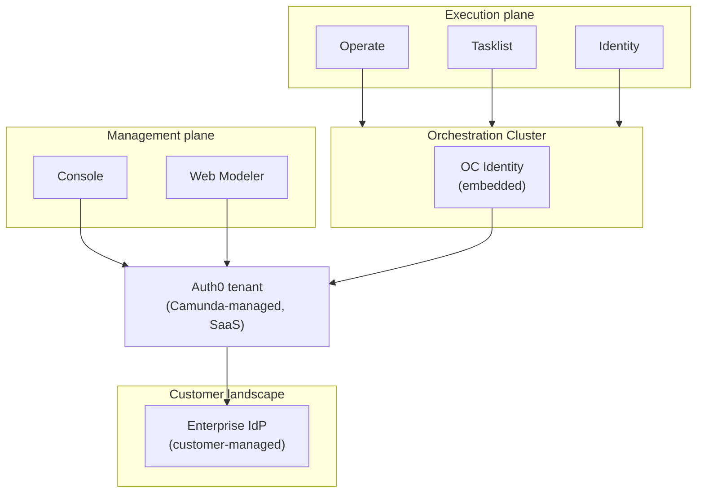

In SaaS today:

- Console and Web Modeler authenticate users against a Camunda-managed Auth0 tenant, which acts as the IdP/broker for all SaaS tenants.
- OC Identity in each Orchestration Cluster also uses Auth0 as its OIDC IdP, applying runtime authorization for Operate, Tasklist, and cluster APIs.
- Auth0 either federates to the customer Enterprise IdP or manages user accounts directly, depending on tenant configuration. The concrete integration code lives in the respective SaaS backends (Console/Hub services and OC Identity OIDC client configuration), which use standard OAuth2/OIDC client libraries to communicate with Auth0.

#### 2.2.2 Self-managed

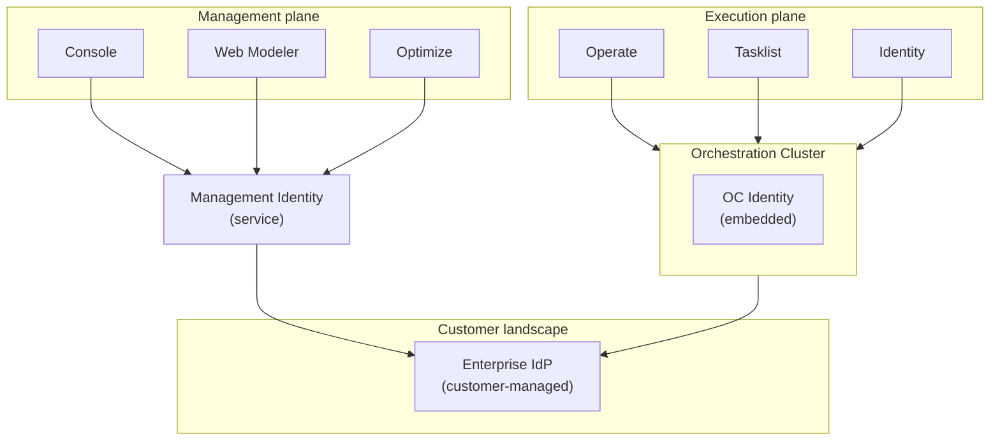

In Self-managed today:

- Console, Web Modeler, and Optimize delegate authentication and authorization to Management Identity, which in turn integrates with the customer Enterprise IdP via OIDC.
- OC Identity is embedded into each Orchestration Cluster and directly integrates with the same Enterprise IdP; it handles runtime authentication and fine-grained authorizations for Operate, Tasklist, and the cluster APIs.
- This results in two identity silos (Management Identity vs OC Identity) that both depend on the Enterprise IdP but use different models and configuration surfaces.

### 2.3 Limitations and motivation for change

Based on the target-architecture appendix and identity roadmap, the current setup has several issues:

- Split identity
  - Separate models and configuration for Management Identity vs OC Identity.
  - SaaS and self-managed use different stacks (Auth0 vs direct IdP).
- SaaS vs self-managed parity gaps
  - Capabilities such as mapping rules, tenants, and fine-grained RBAC/ABAC differ or are missing depending on deployment.
- Manual lifecycle and configuration
  - Joiner/mover/leaver flows are not fully automated from the customer’s IdP/HR system.
  - Tenants, roles, and mappings are often configured by hand in UIs.
- Limited observability and migration tooling
  - Identity migrations (e.g. Management Identity → unified plane) and policy changes are fragile, not first-class “jobs”.
  - It is hard to see and debug identity health end to end.

These limitations motivate a unified identity plane with consistent semantics and tooling across Hub and all clusters, including multi-engine and multi-tenant scenarios.

---

## 3. Solution strategy: unified identity plane and library

The target architecture introduces one consistent identity and policy model shared between Hub and all Orchestration Clusters:

- Hub Identity & Policy
  - Source of Truth (SoT) for users, groups, roles, tenants, mapping rules, and authorizations for all clusters and Hub apps.
- OC Identity
  - Per-cluster projection and enforcement of that policy, optimized for runtime access checks, and aware of multiple engines/tenants per cluster.
- Single identity plane for all consumers
  - Web UIs, user apps, workers, and integrations are all just API clients authenticated by the Enterprise IdP and authorized against this unified policy model.

Technically, this is implemented as a pluggable identity/security library:

- Embedded into Hub and Orchestration Cluster.
- Exposes Authentication (OIDC/SAML) and Authorization (RBAC/ABAC) capabilities via well-defined SPIs.
- Reuses the host application’s existing storage and infrastructure via SPI interfaces (no new standalone database or service).

Key design principles (selected):

- One identity plane for Hub and OC, with Hub as policy SoT whenever present.
- SaaS / self-managed parity: same concepts (tenants, mapping rules, fine‑grained permissions, BYO IdP) in both deployment models.
- Hexagonal architecture: all persistence, messaging, OC command creation, and engine‑level wiring are behind interfaces; default implementations can be swapped or replaced entirely.
- IdP-agnostic: only relies on OIDC and SAML standards, so any compliant IdP can integrate.
- Automated lifecycle and migrations: IdP claim mapping and outbox-based policy replication, with idempotent and observable migrations.
- Standalone OC support: OC can act as the top-level policy authority when Hub is absent, mirroring the fallback topologies in existing docs.

---

## 4. Target system context

This section describes the unified identity system at a high level, showing how the new library integrates into the platform across two supported deployment modes. The diagrams illustrate key components (Hub, Orchestration Clusters, identity UIs, infrastructure) and their relationships.

### 4.1 Full mode (Hub + OC)

In full mode, the platform runs with both Hub (management/control plane) and Orchestration Cluster (execution plane). Both use the same identity model and the same Security Gateway Framework.

Configuration flows top-down: Hub is the central source of truth for all policy. Configuration is authored once in Hub and propagated via the outbox pattern to each OC, which then propagates scoped views to individual engines. The Admin UI in each OC runs in read-only mode, showing the local projection of Hub policy.

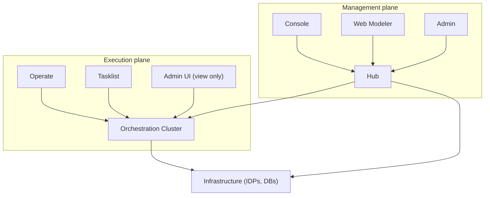

- Hub and each OC use the same Security Gateway Framework as the shared identity and policy engine.
- Hub is the single source of truth for all policy and configuration.
- Hub propagates policy changes via the outbox pattern to OC, which maintains a local projection and handles runtime enforcement per engine/tenant.
- Existing infrastructure is reused, no new databases or services are introduced.

### 4.2 OC-only mode (standalone OC)

In OC-only mode, Hub is not present. The Orchestration Cluster becomes the local source of truth for all policy and configuration. OC is a first-class deployment option and acts as top-level policy authority for its engines. This mode is useful for development environments and self-contained production scenarios.

Configuration flows locally: OC manages all policies directly, and the Admin UI in OC runs in read-write mode, allowing full policy authoring and management. Configuration then propagates from OC to individual engines.

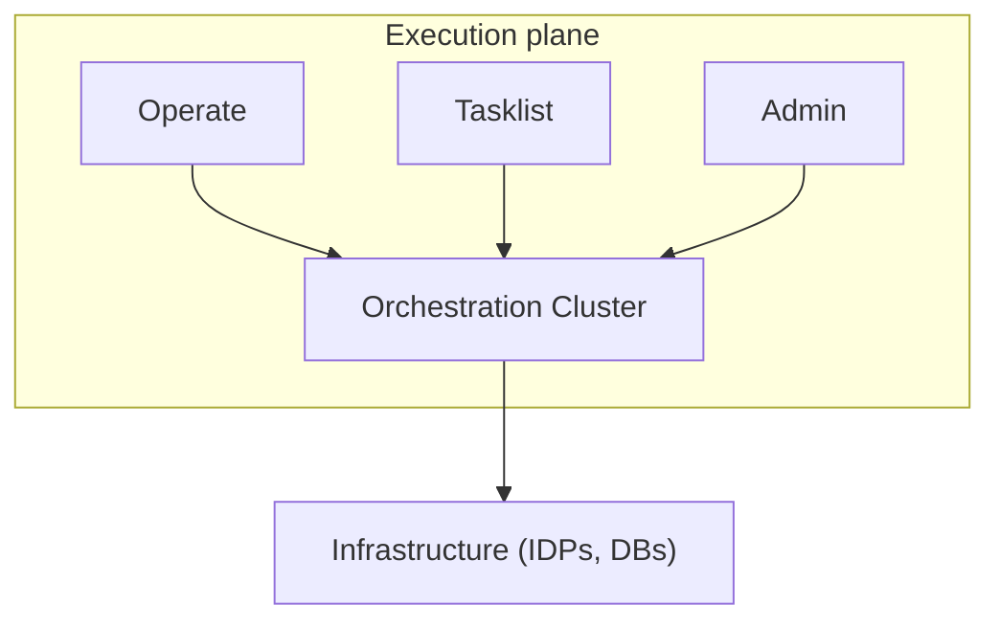

- OC is the single source of truth for all policy and configuration.
- The same Security Gateway Framework is used but configured for standalone operation.
- Existing infrastructure is reused, no new databases or services are introduced.

---

## 5. Building block view (target)

### 5.1 High-level components

The following diagrams show the internal structure of Hub and Orchestration Cluster, including how Security Gateway Framework instance connects to frontend applications, infrastructure, and (in multi-engine scenarios) individual engine instances.

#### 5.1.1 Full mode (Hub + OC)

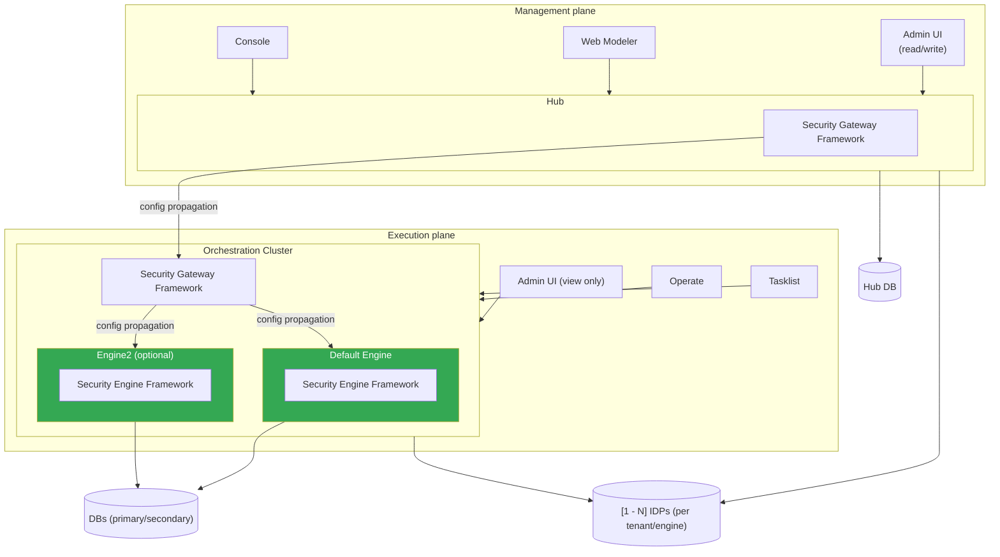

Key building blocks in full mode:

- Console, Web Modeler, Admin UI (read-write): Frontend applications in the management plane. The Admin UI here allows full policy authoring for all configurable layers (Hub, OCs, engines, tenants).
- Hub + Security Gateway Framework: Central source of truth. Manages all policy configuration for all clusters, OCs, and engines. All policy changes originate here.
- Operate, Tasklist, Admin UI (read-only): Runtime frontends in the execution plane. The Admin UI shows the cluster-local projection of Hub policy; configuration is read-only.
- OC + Security Gateway Framework: Per-cluster policy enforcement and projection layer. Receives policy snapshots from Hub via the outbox pattern. Propagates scoped policy views to individual engines.
- Engine instances (Default Engine, Engine2 optional): Optional multi-engine support. Each engine receives its scoped projection of cluster policy from OC. No direct Hub connection.
- Security Engine Framework: Engine-specific policy enforcement layer.
- Infrastructure (IDPs, DBs): Shared existing persistence and IdP connectivity for authentication and authorization across all layers.

Configuration propagation chain: Hub → OC → Engine.

#### 5.1.2 OC-only mode (standalone OC)

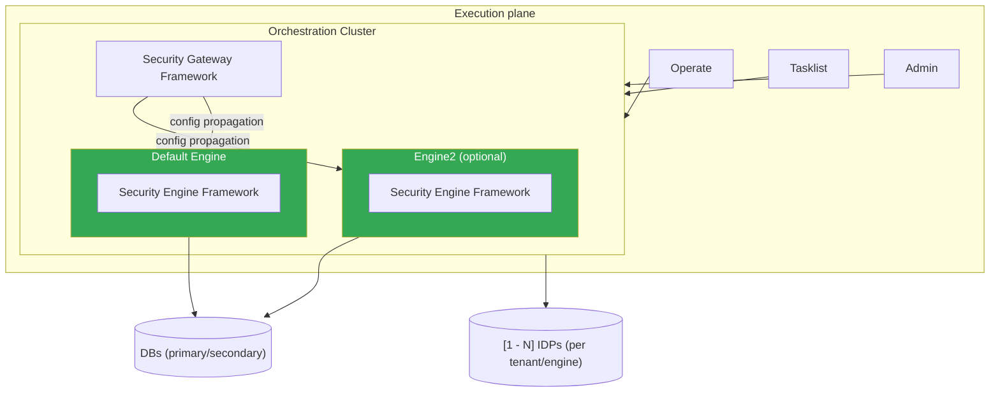

Key building blocks in OC-only mode:

- Operate, Tasklist, Admin UI (read-write): Runtime frontends that interact directly with OC. The Admin UI allows full policy authoring (no Hub restrictions).
- OC + Security Gateway Framework: Local source of truth. Manages all policy and authorization directly without Hub coordination. All policy changes originate here.
- Engine instances (Default Engine, Engine2 optional): Each engine receives its scoped projection of local OC policy. OC is the single source of all policy.
- Security Engine Framework: Engine-specific policy enforcement layer.
- Infrastructure (IDPs, DBs): Local persistence and IdP connectivity; no cross-cluster replication or Hub involvement.

Configuration propagation chain: OC → Engine.

### 5.2 Outbox-based policy propagation (Hub → Orchestration Clusters)

The Security Gateway Framework uses an outbox pattern to propagate policy changes from Hub (policy SoT) to each Orchestration Cluster in a reliable, observable, and idempotent way.

**Snapshot vs. incremental diff:** Sending a full snapshot on every change would be unnecessarily expensive at scale. The propagation therefore follows a two-phase approach:

- **Initial sync (full snapshot):** When an OC connects for the first time (or after a reset), Hub sends a complete `POLICY_SNAPSHOT` — the full current state of tenants, roles, groups, mapping rules, principals, and authorizations for that cluster.
- **Subsequent updates (incremental diff):** After the initial sync, Hub sends only the changed entities as a `POLICY_DIFF` event. The OC applies the diff on top of its locally cached state. This keeps payloads small and propagation fast.

If an OC falls behind (e.g. due to a gap in its applied version sequence), it can request a full re-sync from Hub to recover a consistent baseline.

The outbox pattern we use here is a specific instance of the “Transactional Outbox” architecture pattern.

Reference: [Transactional outbox](https://microservices.io/patterns/data/transactional-outbox.html)

#### Component view

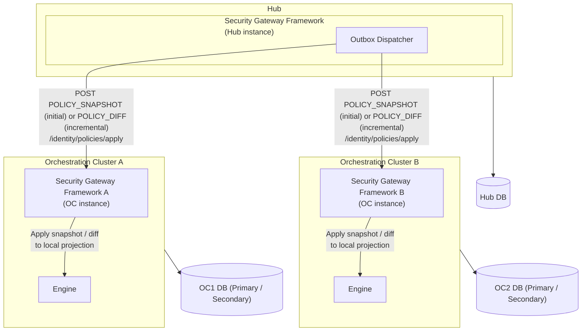

#### 5.2.1 Responsibilities and guarantees

Flowchart (detailed outbox flow):

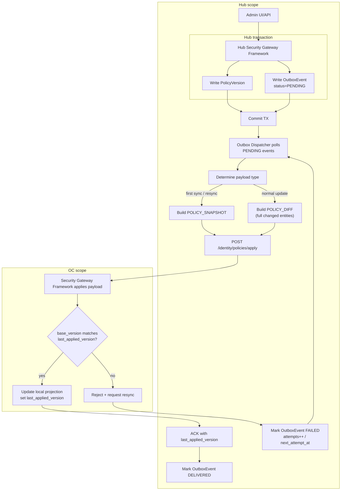

- Hub Security Gateway Framework
  - Accepts policy changes via UI/API.
  - Writes a `PolicyVersion` and a corresponding `OutboxEvent` (`POLICY_SNAPSHOT` or `POLICY_DIFF`, status = PENDING) in the same transaction.
  - Tracks per-OC `last_acked_version` to decide whether to send a diff or fall back to a full snapshot.
- Outbox Dispatcher
  - Periodically selects due PENDING events.
  - Loads the corresponding `PolicyVersion` and either prepares the full snapshot or computes the diff against the OC's last acknowledged version.
    - The diff contains only the changed entities. (But the full entity, not just updated fields)
  - Calls each OC's public admin endpoint (e.g. `POST /identity/policies/apply`) with the snapshot or diff payload.
  - Updates `OutboxEvent.status` to DELIVERED or FAILED and manages retries via `attempts` and `next_attempt_at`.
- OC Security Gateway Framework
  - Tracks `last_applied_version` locally.
  - For `POLICY_SNAPSHOT`: replaces the local projection entirely and updates `last_applied_version`.
  - For `POLICY_DIFF`: applies the delta on top of local state; rejects and requests a re-sync if the diff's `base_version` does not match `last_applied_version`.
  - Treats every apply as idempotent per `policyVersionId`.
  - Returns an ACK (including `last_applied_version`) to the dispatcher.

This pattern decouples policy authoring (Hub) from policy enforcement (OCs), ensures at-least-once delivery, keeps incremental payloads small, and provides clear observability hooks (per-cluster status, last error, retry attempts) for identity operations.

#### 5.2.2 Hub data model (simplified)

Conceptually, Hub maintains:

- `PolicyVersion`
  - One row per cluster and version of the desired policy.
  - For snapshot events: captures the full state of tenants, roles, groups, mapping rules, principals, and authorizations for that cluster.
  - For diff events: captures only the changed entities relative to the previous version (`base_version`).
- `OutboxEvent`
  - One row per policy delivery attempt to a specific cluster.
  - `event_type` distinguishes `POLICY_SNAPSHOT` (initial / re-sync) from `POLICY_DIFF` (incremental).
  - Drives asynchronous delivery and retry without coupling Hub writes to OC availability.

The full policy data model is described in [5.3 Unified policy model](#53-unified-policy-model), but the relevant tables for the outbox pattern are:

```text
PolicyVersion
  id                UUID
  cluster_id        string
  engine_id         string
  version_number    int
  base_version      int      -- null for snapshots; previous version number for diffs
  created_at        timestamp
  created_by        string
  ...               -- full state (snapshot) or changed entities only (diff)

OutboxEvent
  id                UUID
  cluster_id        string
  engine_id         string
  policy_version_id UUID
  event_type        string   -- 'POLICY_SNAPSHOT' | 'POLICY_DIFF'
  status            string   -- 'PENDING' | 'DELIVERED' | 'FAILED'
  attempts          int
  next_attempt_at   timestamp
  last_error        text
  created_at        timestamp
  updated_at        timestamp
```

#### 5.2.3 Open Questions

Those questions can maybe also be addressed later in the project:

- How will the Hub know which cluster it should talk to?
- Who will initiate the communication between Hub and OCs? Does OC know about Hub?
- Should Hub or OC keep track of the last policy version applied?

### 5.3 Unified policy model

The unified identity architecture is built around a single **policy model** that is shared between Hub Identity & Policy and OC Identity. Hub is the **source of truth** for this model per cluster; each OC hosts a **cluster-local projection** of the same concepts for enforcement.

At a high level, the shared policy model consists of:

- **Tenant**
  - Logical partition for data and access in a cluster (for example `default`, `retail`, `wholesale`, `customer-x`).
  - Used to scope where a principal is allowed to read or write data.
  - Tenant configuration (names, descriptions, flags) is authored in Hub and projected to each OC.

- **Group / Role**
  - **Group**
    - Collection of principals (users, mapping rules, clients) that should share the same permissions.
  - **Role**
    - Reusable set of permissions that can be attached to groups, users, or clients.
    - Roles are used both on the management plane (Hub apps) and execution plane (cluster APIs and UIs).

- **MappingRule**
  - Declarative rule that maps **IdP claims** to Camunda concepts:
    - `claimName` (for example `groups`, `org`, `department`).
    - `operator` (for example `EQUALS`, `CONTAINS`).
    - `claimValue` (for example `camunda-platform-admin`, `Retail`).
  - Targets one or more **roles**, **groups**, and **tenants**:
    - When an incoming token’s claims match, the principal automatically receives those roles/groups/tenants.
  - This is the main mechanism that turns IdP attributes into platform-level permissions.

- **Principal**
  - Represents an actor that can authenticate and be authorized:
  - **User principal**
    - Identified by an IdP user claim (for example `preferred_username`, `email`).
    - May have direct role/group assignments in addition to mapping-rule derived ones.
  - **Machine principal**
    - Identified by client credentials (for example `client_id`).
    - Used by workers, automation, and integrations (job workers, CI/CD, connectors, etc.).

- **Authorization**
  - Fine-grained permission record that ties **owners** to **resources** and **actions**:
  - Conceptually:
    - `(ownerType, ownerId, resourceType, resourceId, permissions[])`
  - Examples:
    - Owner: `GROUP:RetailDevelopers`
      ResourceType: `PROCESS_DEFINITION`
      ResourceId: `*`
      Permissions: `[READ_PROCESS_DEFINITION, READ_PROCESS_INSTANCE, CREATE_PROCESS_INSTANCE]`
    - Owner: `ROLE:ClusterAdmin`
      ResourceType: `CLUSTER_API`
      ResourceId: `*`
      Permissions: `[MANAGE_CLUSTER_SETTINGS, MANAGE_USERS]`
  - The same structure is used on:
    - **OC side** for engine and cluster resources (definitions, instances, tasks, cluster APIs).
    - **Hub side** for management resources (orgs, workspaces, projects, assets, clusters).

- **PolicyVersion**
  - Tracks the **desired policy state** per cluster in Hub.
  - Each `PolicyVersion` ties together:
    - The set of tenants, groups, roles, mapping rules, principals, and authorizations intended for a specific cluster.
  - OC Identity applies `PolicyVersion` snapshots (and later diffs) received from Hub and stores an equivalent representation in its local policy store.
  - `PolicyVersion` is also what the outbox pattern (section 5.2) uses as payload when propagating changes Hub → OC.

### 5.3.1 Hub vs. OC responsibilities

Both Hub and OC use exactly the same policy model, but with different responsibilities.

- **Hub Identity & Policy**
  - Acts as **policy source of truth** for all clusters.
  - Authoring location for tenants, roles, groups, mapping rules, and authorizations.
  - Stores `PolicyVersion` records per cluster and drives propagation via Outbox/`OutboxEvent`.

- **OC Identity**
  - Hosts a **cluster-local projection** of the same entities.
  - Enforces authorizations for:
    - Web UIs on the cluster (Operate, Tasklist, Admin).
    - Cluster runtime APIs (gRPC/REST) for workers and integrations.
  - Does not invent new policy; it only applies and enforces what Hub (or, in standalone mode, local OC configuration) defines.

This unified model allows:

- The same concepts (tenants, roles, groups, mapping rules, authorizations, principals) to be used consistently on both **management** and **execution** planes.
- Identity-as-code and migrations to operate on one canonical representation (`PolicyVersion`) per cluster, with clear ownership (Hub) and enforcement (OC).

### 5.4 Security Gateway Framework – hexagonal architecture

The **Security Gateway Framework** is a **hexagonal (ports and adapters)** library. Its core domain never imports a concrete database class, OIDC library, or Zeebe API — all external dependencies are hidden behind port interfaces that the host application (Hub, OC) wires in.

**Key rule: all port interfaces — both inbound and outbound — are defined inside the library core.** The host application depends on the library, never the other way around.

- **Inbound (driving) side:** A Spring MVC controller or security filter lives in the host application. It imports and calls an inbound port interface (e.g. `PolicyService`) from the library. The domain service inside the library implements that interface.
- **Outbound (driven) side:** The domain service calls an outbound port interface (e.g. `PolicyRepository`) defined in the library. The host application (or a default adapter module) provides the concrete implementation.

***WIP***: The following diagram is a work-in-progress and more an example than the actual library architecture.

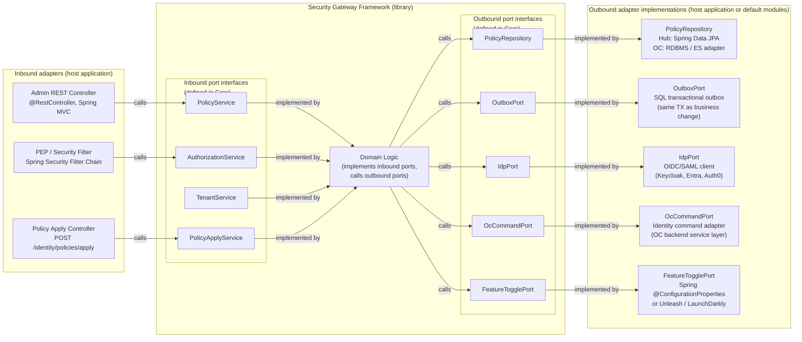

**Outbound port responsibilities and example implementations:**

| Port interface | Responsibility | Example implementations |
|---|---|---|
| `PolicyRepository` | Persist and query tenants, roles, mapping rules, principals, authorizations | Hub: Spring Data JPA; OC: RDBMS adapter, Elasticsearch adapter |
| `OutboxPort` | Write outbox events transactionally alongside business changes | SQL transactional outbox (same DB as policy store) |
| `IdpPort` | Resolve IdP metadata, validate tokens, fetch claim mappings | OIDC client (Keycloak, Entra, Auth0), SAML adapter |
| `OcCommandPort` | Emit identity persistence commands so OC stores the identity model through its command path | OC identity command adapter backed by engine command handling; no-op stub in Hub |
| `FeatureTogglePort` | Gate capabilities (outbox publishing, multi-tenancy, shadow-mode evaluation) | Spring `@ConfigurationProperties`, Unleash, LaunchDarkly |

This design guarantees that **swapping a database, replacing the IdP client, or providing a custom command backend requires only a new adapter class** — no changes to the domain core.

### 5.5 Single shared Admin UI

TODO

### 5.6 Multi-engine support

The unified identity plane supports multiple engines per Orchestration Cluster in both deployment modes:

- Full mode (Hub + OC): Hub as SoT defines cluster-scoped policies (roles, mappings, tenants, authorizations), OC projects them, and engines consume scoped views.
- OC-only mode: OC is SoT for local policies and propagates scoped views directly to engines.
- In both modes: Engines do not define their own identity models.

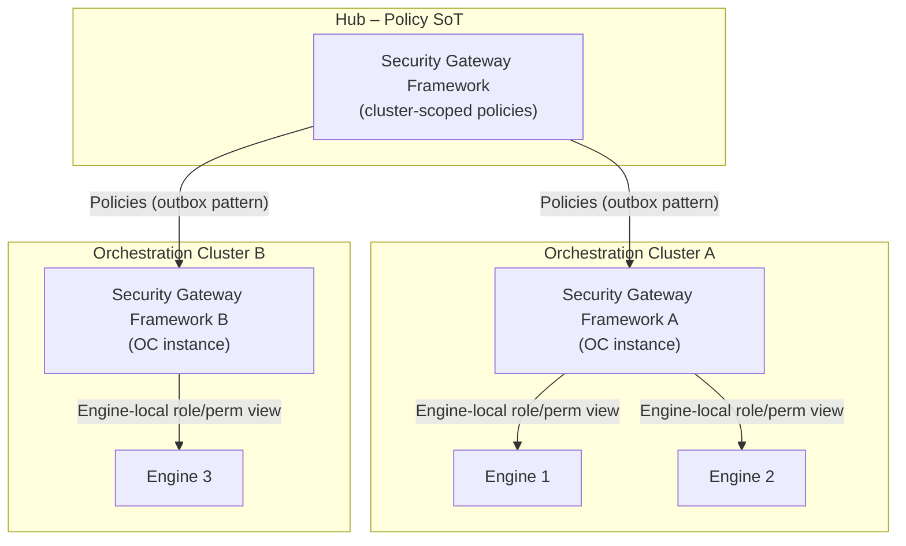

- In full mode, Hub is the single SoT; policy flows downward: Hub → all OCs → all Engines.
- OC identity instances maintain cluster-local projections and handle engine-level scoping.
- Engines consume the cluster-level projection; they do not define their own identity models and cannot override OC policy.
- In OC-only mode, the same projection model applies with local flow: OC → Engines.

### 5.7 Multi-tenancy support

Multi-tenancy is a first-class concern in the policy model. Tenant configuration is authored once in Hub and propagated top-down to OC and then to engines. Each layer maintains tenant-aware roles, mapping rules, and authorizations.

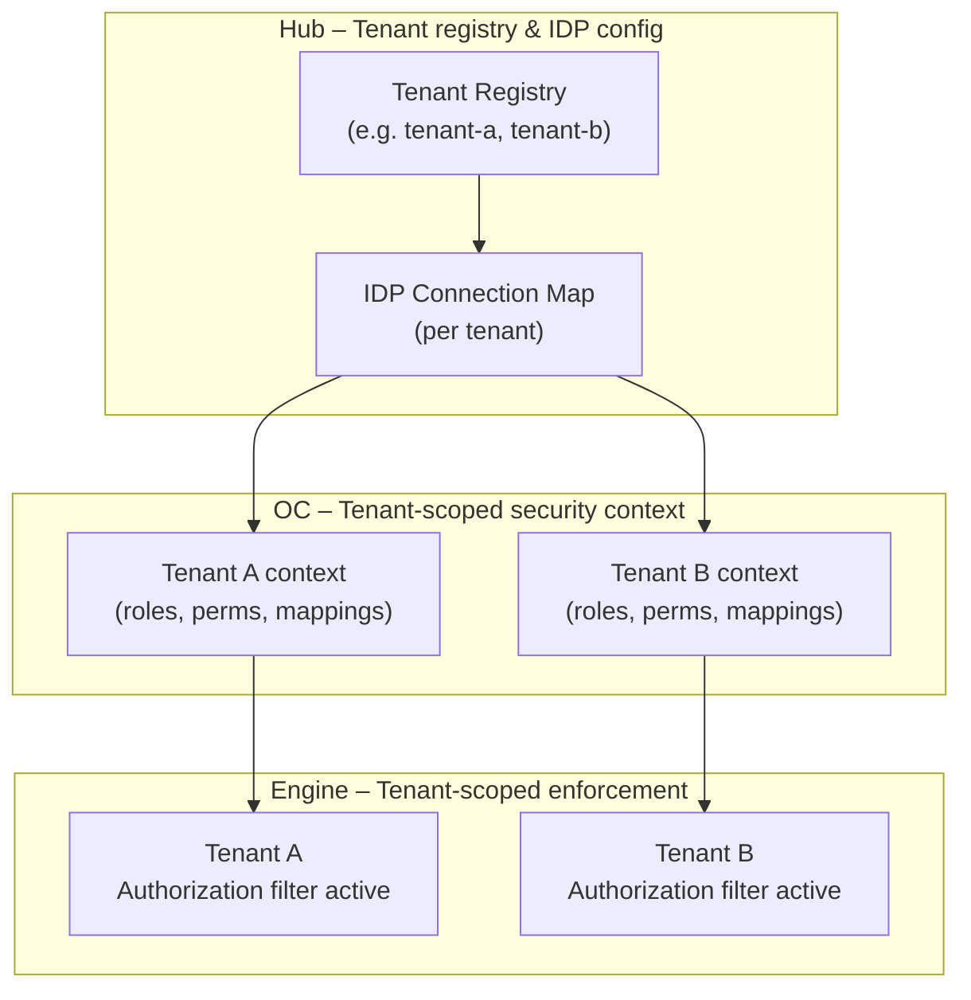

On each request, the Security Gateway Framework:

1. Resolves the tenant context from token claims and/or headers.
2. Loads the tenant-specific policy view (roles, mappings, authorizations).
3. Enforces permissions within the tenant boundary, preventing cross-tenant data access.

---

## 6. Runtime view (selected scenarios)

TODO

## 7. Deployment view

TODO

## 8. Crosscutting concepts (target)

- IdP-agnostic: Any OIDC/SAML IdP integrating via standards (no IdP-specific code in the domain layer).
- RBAC + ABAC: Roles and authorizations with optional attribute-based policies (resource attributes, environment conditions).
- Multi-tenancy: Tenant-aware identity context propagated from tokens/headers; tenant-specific policy and IdP configuration; outbox filters by tenant.
- Lifecycle handling: Principal and tenant assignment are derived from IdP claims and mapping rules; clusters receive derived principals and policies from Hub.
- Observability: Identity flows emit metrics, logs, and traces (e.g. authn attempts, authz decisions, outbox propagation delay, health indicators).

---

## 9. Architecture decisions and open points

This unified architecture builds on existing identity arc42 docs and ADRs for OC Identity and Management Identity; those ADRs remain the canonical source for detailed trade-offs. The main new decisions here are:

- Use a shared hexagonal Security Gateway Framework with SPIs for persistence, outbox, IdP, OC commands, and (optionally) engine-level integration.
- Use Hub as policy SoT whenever present; OC-only deployments are treated as documented first-class modes, not afterthoughts.
- Ship a single shared Admin UI package, feature-gated by configuration for Hub vs OC, standalone vs Hub-managed.
- Make multi-tenancy and multi-engine support explicit in the core model and diagrams, not side effects.

Open High Level points (to be refined in separate ADRs):

- Exact SPI boundaries for OC/engine command creation.
- Migration path from current Auth0-based SaaS setup to “Enterprise IdP as SoT” while keeping Auth0 as a private implementation detail.

---

### Sources

- [Unified Identity Target Architecture for Camunda Hub and Orchestration Clusters](https://docs.google.com/document/d/1ExLH2KYmz_V7Zq51adzz9c1Yk2s5ZR7ZhhIKwaEcPs0)
