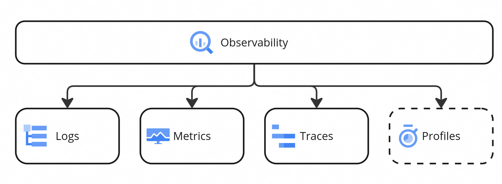

# Observability

[//]: # (You can find all assets on Miro here: https://miro.com/app/board/uXjVIReRqIk=/?share_link_id=495140883440)

Observability is the property of a system's behavior to be understood at runtime. Good observability
allows you to easily debug runtime issues, find and fix performance bottlenecks, and alert on
misbehavior. Conversely, poor observability leads to a system which is hard to understand and thus
hard to improve; after all, how can you improve something if you don't understand why it's failing?

## Pillars

A common way of talking about observability is to talk about its three pillars: logs, metrics, and
traces. Additionally, you may sometime see continuous profiling (which is still in fairly early
stages, but progressing rapidly via things like eBPF) be mentioned as a fourth pillar.

> [!Note]
> We've included profiles as a fourth pillar as this is something we make good use of in the
> distributed systems and performance team (with [Pyroscope](https://pyroscope.io/)), and would
> encourage everyone to use.

More concretely, the four pillars are:

- [Logs](#logs): a historical record of discrete application events. This is typically the first
  thing developers ever interact with in terms of observability. This can be, for example, logging the
  application configuration on startup, and a debug message on shutdown indicating the reason for the
  shutdown. They can be used to monitor the behavior of a running application, but also to diagnose
  its previous behavior by looking at its history.
- [Metrics](#metrics): aggregated measurements of application performance and/or behavior. For
  example, how much time every database query takes on average, or the count of 401 errors for a REST
  API in the last 5 minutes. They can be used to monitor the health of an application and detect
  performance bottlenecks.
- [Traces](#traces): sampled recordings of events which can be logically sliced into so-called
  spans. Traces let you follow a specific logical action (e.g. a request, a transaction) across
  boundaries (e.g. network, processes, threads), allowing you to see where time is spent. They're
  mostly used for diagnosing performance issues.
- [Profiles](#profiles): aggregated stack traces which are recombined, allowing you to find
  performance bottlenecks and allocation hot spots. Similar to traces, but offering a coarser view of
  your application, divorced from logical context.

### Logs

Coming soon...

### Metrics

Coming soon...

### Traces

There is currently no support for distributed tracing in C8, but it is something we are definitely
looking forward to, and often requested by users.

### Profiles

Coming soon...
