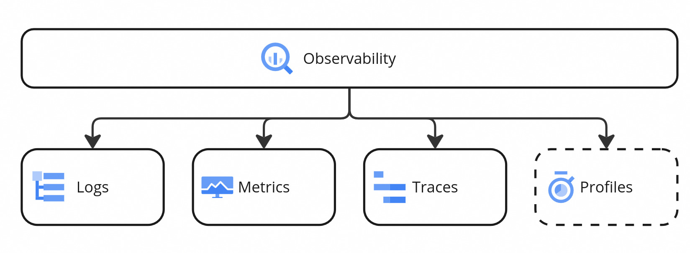

# Observability

[//]: # (You can find all assets on Miro here: https://miro.com/app/board/uXjVIReRqIk=/?share_link_id=495140883440)

Observability is the property of a system's behavior to be understood at runtime. Good observability
allows you to easily debug runtime issues, find and fix performance bottlenecks, and alert on
misbehavior. Conversely, poor observability leads to a system which is hard to understand and thus
hard to improve; after all, how can you improve something if you don't understand why it's failing?

- [Pillars](#pillars)
- [Logs](#logs)
  - [Configuration](#logs-configuration)
    - [Defaults](#logs-configuration-defaults)
  - [Usage](#logs-usage)
    - [Levels](#logs-levels)
    - [Structured logging](#logs-structured-logging)
- [Metrics](#metrics)
- [Traces](#traces)
- [Profiles](#profiles)

## Pillars

A common way of talking about observability is to talk about its three pillars: logs, metrics, and
traces. Additionally, you may sometime see continuous profiling (which is still in fairly early
stages, but progressing rapidly via things like eBPF) be mentioned as a fourth pillar.

> [!Note]
> We've included profiles as a fourth pillar as this is something we make good use of in the
> distributed systems and performance team (with [Pyroscope](https://pyroscope.io/)), and would
> encourage everyone to use.

More concretely, the four pillars are:

- [Logs](#logs): a historical record of discrete application events. This is typically the first
  thing developers ever interact with in terms of observability. This can be, for example, logging
  the
  application configuration on startup, and a debug message on shutdown indicating the reason for
  the
  shutdown. They can be used to monitor the behavior of a running application, but also to diagnose
  its previous behavior by looking at its history.
- [Metrics](#metrics): aggregated measurements of application performance and/or behavior. For
  example, how much time every database query takes on average, or the count of 401 errors for a
  REST
  API in the last 5 minutes. They can be used to monitor the health of an application and detect
  performance bottlenecks.
- [Traces](#traces): sampled recordings of events which can be logically sliced into so-called
  spans. Traces let you follow a specific logical action (e.g. a request, a transaction) across
  boundaries (e.g. network, processes, threads), allowing you to see where time is spent. They're
  mostly used for diagnosing performance issues.
- [Profiles](#profiles): aggregated stack traces which are recombined, allowing you to find
  performance bottlenecks and allocation hot spots. Similar to traces, but offering a coarser view
  of
  your application, divorced from logical context.

## Logs

- [Configuration](#logs-configuration)
  - [Defaults](#logs-configuration-defaults)
- [Usage](#logs-usage)
  - [Levels](#logs-levels)
  - [Structured logging](#logs-structured-logging)

Logging in C8 is done through [SLF4J](https://www.slf4j.org/). SLF4J is a _facade_ - that is, it's
simply an API to perform logging, delegating the actual implementation to one or multiple
implementations.

> [!Note]
> This means that without an implementation, SLF4J will simply do nothing. For a typical project,
> you would include the `slf4j-api` dependency, and then the `slf4j-simple` dependency for tests.
> For production use cases, common implementations are logback and log4j.
>
> C8 uses [Log4j2](https://logging.apache.org/log4j/2.x/index.html). As of now, we cannot use
> logback due to licensing issues.

We encourage you to read the [SLF4J Hello World](https://www.slf4j.org/manual.html#hello_world) and
[typical usage](https://www.slf4j.org/manual.html#typical_usage) sections of their manual before
continuing.

> [!Note]
> The SLF4J manual in general is quite short, and it's recommended you read it; that said, the API
> is intuitive enough that you will likely grasp it by learning through usage.

#### Logs: Configuration

Configuration of Log4j2 is done via a `log4j2.xml` file, located in a module's resource bundle,
i.e. `src/main/resources`.

For the single C8 application, the configuration file is located in the `dist` folder (aka
`camunda-zeebe` module), at [dist/src/config/log4j2.xml](../dist/src/main/config/log4j2.xml). When
looking at the assembled distribution artifact, you will find it at `config/log4j2.xml`. The
application resolves it because we add the `config/` folder to the classpath at launch in all the
shell scripts found in the distribution's `bin` folder.

> [!Note]
> You can read more about
> [the various ways to configure log4j2 here](https://logging.apache.org/log4j/2.x/manual/configuration.html).

The configuration bundled with the application is the default configuration, and **we should
consider it to be used by most users, so change it carefully**.

We use the configuration file primarily to define the default logging levels, the logging outputs,
and the output formats.

##### Logs: Configuration Defaults

As a rule of thumb, 3rd-party libraries default log level should be `WARN`, and the log level for
our own application should be `INFO`. This is because anyone running the application will want to
know what it is doing, but would only care about 3rd party logs if something goes wrong.

One notable exception is Spring, for which we set the log level to `INFO`. This is because we use
Spring as our application server, and information about its operation (e.g. the embedded Tomcat
server starting, the security chain configuration, etc.) is relevant to the user.

As for outputs, C8 will log both to standard out (aka console) and to file by default. Logging to
STDOUT is how most Kubernetes implementations - or in general, most cloud providers - capture and
aggregate logs. The file output is then mostly for bare metal systems, where logs are expected to be
found on the server itself, and are periodically logged over, allowing the user to specify a
retention window.

> [!Note]
> You can disable the file logging via `CAMUNDA_LOG_FILE_APPENDER_ENABLED=false` environment
> variable. This is done in the configuration file by using so-called
> [Arbiters](https://logging.apache.org/log4j/2.x/manual/configuration.html#arbiters).

Finally, while we support all Log4j2 output formats (aka layouts), C8 is configured out of the box
to use a basic logging pattern called `Console`. This targets primarily development and testing
setups. For production use cases, it's recommended to use the `StackdriverLayout`, a JSON layout
tailor-made for Google Cloud's monitoring platform, Stackdriver (now called Google Cloud
Operations). The output format can be controlled at startup via environment variables; refer to the
distribution's [log4j2.xml](../dist/src/main/config/log4j2.xml) for more.

> [!Note]
> If you want to read about how to use logs at runtime, check out the following links:
> - [Camunda Docs: Log Levels](https://docs.camunda.io/docs/next/self-managed/operational-guides/monitoring/log-levels/)
> - [Camunda Docs: Setting the log level](https://docs.camunda.io/docs/next/self-managed/zeebe-deployment/configuration/#logging)
> - [Camunda Runbook](https://github.com/camunda/runbook)

#### Logs: Usage

`org.slf4j.Logger` instances are thread-safe, and it's encouraged to reuse them in order to group
log statements logically.

Since configuration is applied based on logger name prefix, the common pattern is to use the class
name as the logger name. This will uniquely identify your logger by using the [fully qualified name
of the class](https://docs.oracle.com/javase/specs/jls/se17/html/jls-6.html#jls-6.7).

By doing this, you can configure log level, appenders, output format, etc., not only for a specific
class (e.g. for tracing), but for a complete package, module, namespace, etc., simply by matching
prefixes. Using the class name thus makes it very intuitive to find the location of the log and
understand its context.

For example, take the `zeebe-util` module, where all classes live under the `io.camunda.zeebe.util`
package. By configuring the log level to `DEBUG` for `io.camunda.zeebe.util`, you would see debug
level logging (and higher) for all classes under the module. Now, say we want to trace allocations
from the `io.camunda.zeebe.util.allocation` classes, we could also configure a logger with this name
to `TRACE`. If we only cared to trace
[DirectBufferAllocator](../zeebe/util/src/main/java/io/camunda/zeebe/util/allocation/DirectBufferAllocator.java),
then we could simply set `io.camunda.zeebe.util.allocation.DirectBufferAllocator` to trace.

> [!Note]
> Doing so would also trace inner classes, as their fully qualified class names are prefixed by the
> enclosing class' FQCN. However, in many such cases, this is still what you want to do.

> [!Note]
> Remember, you can change the log level dynamically at runtime, making the above feature very
> powerful to diagnose problems on a live system.

##### Logs: Levels

##### Logs: Structured logging

## Metrics

Coming soon...

## Traces

There is currently no support for distributed tracing in C8, but it is something we are definitely
looking forward to, and often requested by users.

## Profiles

Coming soon...
