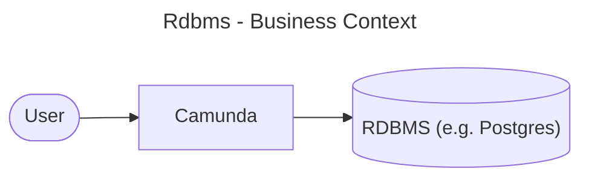
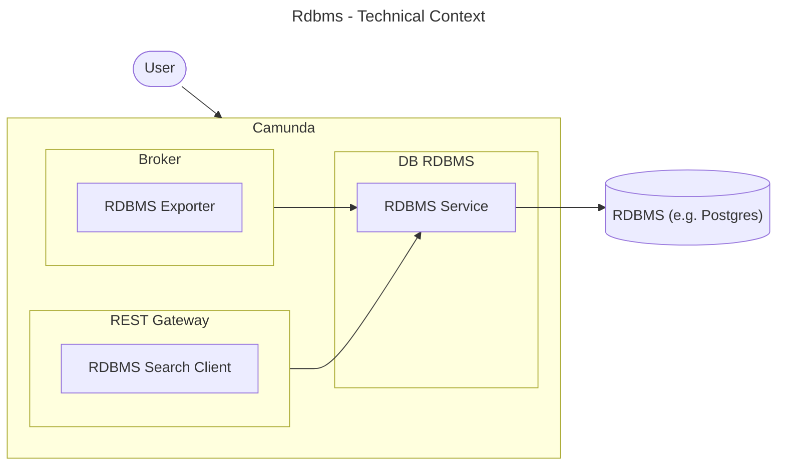
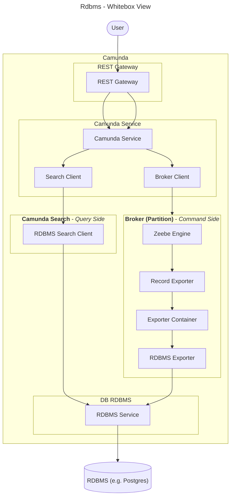

# Rdbms Module

**This document is WIP!**

## Introduction and Goals

The rdbms module adds support to Camunda for relational database management systems (RDBMS) as an
alternative to
Elasticsearch (ES) and OpenSearch (OS) for second-level storage.

Key Features & Benefits:

* Seamless RDBMS Integration: Supports SQL-based databases, enabling customers to leverage existing
  DBA expertise.
* Simplified Onboarding & Testing: Removes the dependency on ES/OS, making it easier to use
  lightweight in-memory databases for local development and testing scenarios.
* Operational Efficiency: Facilitates easier maintenance, backups, and upgrades with established
  database procedures.
* Enterprise Readiness: Addresses licensing constraints, compliance requirements, and cost concerns.

### Requirements Overview

### Quality Goals

tbd

### Stakeholders

* Daniel Meyer
* Maximilian Trumpf
* Roman Smirnov
* Aleksander Dytko

## Architecture Constraints

### Spring

Spring should only be used in the dist folder to bring together the components for the
application. So in the rdbms module itself, no spring should be used.

## Context and Scope

### Business Context

| Entity  |                           Description                            |
|---------|------------------------------------------------------------------|
| User    | The user which uses Camunda.                                     |
| Camunda | The whole camunda platform, including broker, webapps, ...       |
| RDBMS   | A relational database like e.g. H2, Postgres, MariaDB or Oracle. |

### Technical Context

|       Entity        |                                                                                               Description                                                                                               |
|---------------------|---------------------------------------------------------------------------------------------------------------------------------------------------------------------------------------------------------|
| User                | The user which uses Camunda.                                                                                                                                                                            |
| Camunda             | The whole camunda platform, including broker, webapps, ...                                                                                                                                              |
| RDBMS Exporter      | An additional exporter like the Camunda Exporter which listens for records from broker and exports them via RDBMS Service into a RDBMS. Only active if there is an configured exporter with id `rdbms`. |
| RDBMS Search Client | Is used by the new v2 rest API in gateway for query data from the RDBMS. Only active if the camunda.data.secondary-storage.type is set to rdbms.                                                        |
| RDBMS Service       | Entry Point to the database modul which provides readers for the search client as well as writers for the exporter.                                                                                     |
| RDBMS               | A relational database like e.g. H2, Postgres, MariaDB or Oracle.                                                                                                                                        |

## Solution Strategy

* **CQRS**: Like how zeebe in general is working, we also segregate the read and write operations
  for the RDBMS module. We have own services for reading and writing to the database.
* **Exporter creation via Spring**: A new approach to create exporters was introduced while building
  the rdbms module, because the exporter needs access to the spring context. For details, see
  here: https://github.com/camunda/camunda/issues/22446

## Building Block View

### Whitebox Overall System

|       Entity        |                                                                                               Description                                                                                               |
|---------------------|---------------------------------------------------------------------------------------------------------------------------------------------------------------------------------------------------------|
| User                | The user which uses Camunda.                                                                                                                                                                            |
| REST Gateway        | The v2 REST API, e.g.: `io.camunda.zeebe.gateway.rest.controller.ProcessInstanceController`                                                                                                             |
| Camunda Service     | A camunda service, e.g.: `io.camunda.service.ProcessInstanceServices`. It uses a either a SearchClient for query data, or the broker client to send commands to zeebe.                                  |
| Search Client       | An interface which is either be implemented from `RdbmsSearchClient`or `SearchClients` which is ES/OS specific.                                                                                         |
| Broker Client       | Is used to send commands to zeebe.                                                                                                                                                                      |
| RDBMS Search Client | Is used by the new v2 rest API in gateway for query data from the RDBMS. Only active if the camunda.data.secondary-storage.type is set to rdbms.                                                        |
| Engine              | The engine works on commands and produces the records which are processed later by the exporters.                                                                                                       |
| RDBMS Exporter      | An additional exporter like the Camunda Exporter which listens for records from broker and exports them via RDBMS Service into a RDBMS. Only active if there is an configured exporter with id `rdbms`. |
| RDBMS Service       | Entry Point to the database modul which provides readers for the search client as well as writers for the exporter.                                                                                     |
| RDBMS               | A relational database like e.g. H2, Postgres, MariaDB or Oracle.                                                                                                                                        |

## Runtime View

WIP

## Deployment View

WIP

## Cross-cutting Concepts

WIP

## Architecture Decisions

### ADR: Use MyBatis as the ORM Framework for the RDBMS Module

#### Status

Accepted

#### Context

We need an Object-Relational Mapping (ORM) framework for the RDBMS module to facilitate database
interactions. The chosen framework should be simple, lightweight, and allow for efficient mapping
between Java objects and SQL statements.

#### Decision

We will use **MyBatis** as the ORM framework for the RDBMS module.

#### Rationale

- **Simplicity & Lightweight**: MyBatis is a minimalistic framework that avoids the complexity of
  full-fledged ORM solutions like Hibernate.
- **SQL Control**: It allows for direct SQL execution with fine-grained control over queries, which
  can be beneficial for performance tuning and complex queries.
- **Proven Experience**: MyBatis was successfully used in **Camunda 7**, meaning we already have
  significant experience with it, reducing the learning curve and implementation risks.
- **Flexibility**: It supports dynamic SQL generation and allows for mapping Java objects to SQL
  statements without requiring extensive annotations or configurations.

#### Consequences

##### Positive

- Faster onboarding due to existing team expertise.
- More control over SQL queries, leading to optimized performance.
- Avoids the overhead and potential pitfalls of more complex ORM frameworks.

##### Negative

- Requires manual handling of some database operations that full ORM solutions might automate.
- May require additional effort to manage complex object relationships compared to fully automated
  ORM tools.

#### Alternatives Considered

- **Hibernate**: A more comprehensive ORM solution but introduces additional complexity and
  potential performance overhead.
- **JPA (Jakarta Persistence API)**: Standardized ORM approach but would require additional
  abstraction layers and potentially lead to less control over SQL execution.

#### Decision Outcome

We will proceed with MyBatis as the ORM framework for the RDBMS module, leveraging our prior
experience and its lightweight, SQL-centric approach.

### ADR: Use Liquibase for Database Schema Management

#### Status

Accepted

#### Context

We need a reliable way to manage database schema changes across different environments. The chosen
tool should support versioning, be database-independent, and allow for declarative schema
management.

#### Decision

We will use **Liquibase** to manage the database schema.

#### Rationale

- **Database Independence**: Liquibase works with multiple database systems, ensuring flexibility
  for future changes.
- **Version Control for Schema**: It provides a structured way to track and apply database changes,
  ensuring consistency across environments.
- **Declarative Approach**: Changesets can be defined in XML, YAML, JSON, or SQL, making it easier
  to manage and review schema modifications.
- **Automation & Rollback Support**: Liquibase integrates well with CI/CD pipelines and provides
  rollback capabilities to revert changes when needed.

#### Consequences

##### Positive

- Simplifies database schema management across environments.
- Reduces manual intervention, minimizing the risk of errors.
- Supports automated deployments and rollbacks, improving DevOps workflows.

##### Negative

- Requires learning Liquibase syntax and best practices.
- Initial setup and migration from existing schema management processes may take some effort.

#### Alternatives Considered

- **Flyway**: Another popular database migration tool but follows a SQL-based approach rather than a
  declarative one.
- **Manual SQL Scripts**: Less structured and harder to track changes across environments.

#### Decision Outcome

We will proceed with Liquibase for database schema management due to its flexibility, versioning
capabilities, and integration with automated deployment processes.

## Quality Requirements

### Quality Tree

### Quality Scenarios

## Risks and Technical Debts

## Glossary

