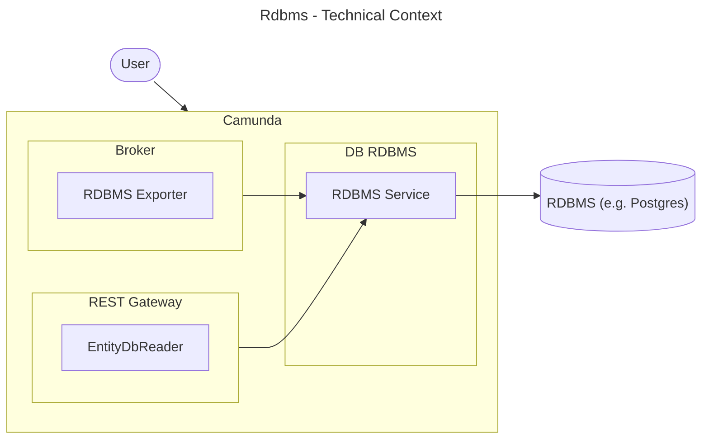
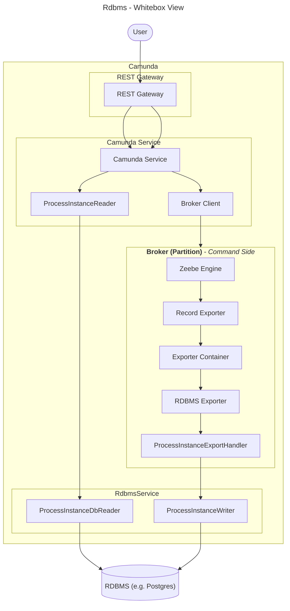
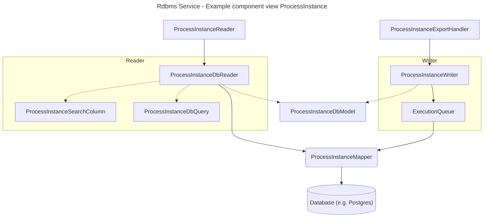

# Rdbms Module

**This document is WIP!**

## Introduction and Goals

The rdbms module adds support to Camunda for relational database management systems (RDBMS) as an
alternative to
Elasticsearch (ES) and OpenSearch (OS) for second-level storage.

Key Features & Benefits:

* Seamless RDBMS Integration: Supports SQL-based databases, enabling customers to leverage existing
  DBA expertise.
* Simplified Onboarding & Testing: Removes the dependency on ES/OS, making it easier to use
  lightweight in-memory databases for local development and testing scenarios.
* Operational Efficiency: Facilitates easier maintenance, backups, and upgrades with established
  database procedures.
* Enterprise Readiness: Addresses licensing constraints, compliance requirements, and cost concerns.

### Requirements Overview

### Quality Goals

tbd

### Stakeholders

* Daniel Meyer
* Maximilian Trumpf
* Roman Smirnov
* Aleksander Dytko

## Architecture Constraints

### Spring

Spring should only be used in the dist folder to bring together the components for the
application. So in the rdbms module itself, no spring should be used.

## Context and Scope

### Business Context

| Entity  |                           Description                            |
|---------|------------------------------------------------------------------|
| User    | The user which uses Camunda.                                     |
| Camunda | The whole camunda platform, including broker, webapps, ...       |
| RDBMS   | A relational database like e.g. H2, Postgres, MariaDB or Oracle. |

### Technical Context

|     Entity     |                                                                                               Description                                                                                               |
|----------------|---------------------------------------------------------------------------------------------------------------------------------------------------------------------------------------------------------|
| User           | The user which uses Camunda.                                                                                                                                                                            |
| Camunda        | The whole camunda platform, including broker, webapps, ...                                                                                                                                              |
| RDBMS Exporter | An additional exporter like the Camunda Exporter which listens for records from broker and exports them via RDBMS Service into a RDBMS. Only active if there is an configured exporter with id `rdbms`. |
| EntityDbReader | Each entity (processInstance, user, role) has an Reader interface (e.g. ProcessInstanceReader). For each of these interfaces, RDBMS provides a DbReader implementation (e.g. ProcessInstanceDbReader)   |
| RDBMS Service  | Entry Point to the database modul which provides readers for the search client as well as writers for the exporter.                                                                                     |
| RDBMS          | A relational database like e.g. H2, Postgres, MariaDB or Oracle.                                                                                                                                        |

## Solution Strategy

* **CQRS**: Like how zeebe in general is working, we also segregate the read and write operations
  for the RDBMS module. We have own services for reading and writing to the database.
* **Exporter creation via Spring**: A new approach to create exporters was introduced while building
  the rdbms module, because the exporter needs access to the spring context. For details, see
  here: https://github.com/camunda/camunda/issues/22446

## Building Block View

### Whitebox Overall System

|            Entity            |                                                                                               Description                                                                                               |
|------------------------------|---------------------------------------------------------------------------------------------------------------------------------------------------------------------------------------------------------|
| User                         | The user which uses Camunda.                                                                                                                                                                            |
| REST Gateway                 | The v2 REST API, e.g.: `io.camunda.zeebe.gateway.rest.controller.ProcessInstanceController`                                                                                                             |
| Camunda Service              | A camunda service, e.g.: `io.camunda.service.ProcessInstanceServices`. It uses a either a SearchClient for query data, or the broker client to send commands to zeebe.                                  |
| Broker Client                | Is used to send commands to zeebe.                                                                                                                                                                      |
| Zeebe Engine                 | The engine works on commands and produces the records which are processed later by the exporters.                                                                                                       |
| RDBMS Exporter               | An additional exporter like the Camunda Exporter which listens for records from broker and exports them via RDBMS Service into a RDBMS. Only active if there is an configured exporter with id `rdbms`. |
| ProcessInstanceExportHandler | An example record handler, here for records for processInstances.                                                                                                                                       |
| ProcessInstanceWriter        | Is used by the RDBMS exporter and it's handlers to write processInstance data.                                                                                                                          |
| RDBMS Service                | Entry Point to the database modul which provides readers for the search client as well as writers for the exporter.                                                                                     |
| ProcessInstanceReader        | Is the general API interface to read data from the secondary storage (here processInstance as example). Has to be implemented by the secondary storage implementation.                                  |
| ProcessInstanceDbReader      | The RDBMS implementation of the ProcessInstanceReader.                                                                                                                                                  |
| RDBMS                        | A relational database like e.g. H2, Postgres, MariaDB or Oracle.                                                                                                                                        |

### Component RdbmsExporter

In contrast to the CamundaExporter, the RDBMS Exporter is created via Spring, because it needs
access to the spring context to get access to the RdbmsService and the spring DataSource.

The RdbmsExporter is divided into several classes:

* **RdbmsExporterWrapper**: The main entry class which implements the `Exporter` interface. It is
  responsible to parse the configuration, caches and create the handlers for the different record
  types (e.g. processInstance) and delegate the records to the `RdbmsExporter`.
* **RdbmsExporter**: The class which receives the records from the
  `RdbmsExporterWrapper` and delegates them to the correct handler (e.g.
  `ProcessInstanceExportHandler`)
  based on the record type. The `RdbmsExporter` also manages the flush batch and transactional
  boundaries if necessary.
* **ProcessInstanceExportHandler**: An example handler which handles records for process instances.
  It uses the `ProcessInstanceWriter` from the `RdbmsService` to write the data to the database.
  Next to this handler there are numerous other handlers for different record types.

### Component RdbmsService

The RdbmsService is the entry point to the rdbms module. It provides readers for the search client
as well as writers for the exporter.

#### Database Domain models

Every entity (e.g. processInstance, user, role) has different domain objects (example by `ProcessInstance`):
* **ProcessInstanceDbModel**: The database domain model which represents the database table structure.
* **ProcessInstanceDbQuery**: The database query object which is used to build the SQL. It contains
the filter criteria for the SQL query, sort and pagination options and authorization criteria.
* **ProcessInstanceSearchColumn**: The database search column enum which maps the API properties to database column names.

#### Readers

Every entity (e.g. processInstance, user, role) has a Reader interface (e.g.
`ProcessInstanceReader`). For each of these interfaces, RDBMS provides a DbReader implementation (
e.g. `ProcessInstanceDbReader`).

Each entity reader does the same following steps to retrieve the data:

* converts the sort options from the API properties list to database column list
* convert the pagination options from the API pagination object to database pagination object. This
  especially
* transform the API query object (e.g. `ProcessInstanceQuery`) to a database query object
  (e.g. `ProcessInstanceDbQuery`). This is needed to optimize the query datastructures for the use
  in MyBatis
* query the database via MyBatis mappers
* (optional): map the database domain models to API domain models - in most cases this is not
  needed, because the query result mapping already targets the API domain models

#### Writers

Every entity (e.g. processInstance, user, role) has a Writer service class (e.g.
`ProcessInstanceWriter`). The writer is used by the exporter handlers (e.g.
`ProcessInstanceExportHandler`) to write the data to the database. The writers provide dedicated and
specialised methods for the different create or update operations and map these operations to one or
more SQL statements. The writers never use the MyBatis mapper files directly but always use the
`ExecutionQueue` to enqueue the statements.

#### ExecutionQueue

MyBatis statements are not executed immediately, but are queued up in the `ExecutionQueue` and
executed in a batch. This is done to improve performance and reduce the number of database
round-trips. The `ExecutionQueue` is flushed either when it reaches a certain size or when the
exporter flushes the batch manually (usually after a certain amount of time).

##### Database optimisations in the `ExecutionQueue`

* **JDBC batching**: The `ExecutionQueue` uses JDBC batching to group multiple SQL statements into a
  single batch, which is then sent to the database in one go. This reduces the number of round-trips
  to the database and improves performance.
* **QueueItem merge:** If there are multiple operations on the same entity (e.g. multiple updates to
  the
  same process instance), the `ExecutionQueue` merges these operations into a single operation. For
  example, if there are two updates to the same process instance, the `ExecutionQueue` will merge
  them into a single update operation that contains the latest state of the process instance. This
  must be done manually by the calling writer components.

#### History Cleanup Service

The history cleanup service is responsible to clean up old data from the database based on the
configured retention period. The service runs periodically and deletes data that is older than the
retention period. The cleanup is done in batches to avoid long-running transactions and to minimize
the impact on database performance.

Every relevant database object has a historyCleanupDate column. To schedule some data for cleanup,
this date has to be set to the respective date this record should be deleted. The
HistoryCleanupService then deletes all records which have a historyCleanupDate older than the
current date.

Most objects are marked for history cleanup when their process instance is finished (completed or
canceled). BatchOperation objects are an exception to that, they are marked when the batch is
finished.

### Component Liquibase & MyBatis

#### Database specific configurations

RDBMS supports multiple database vendors. Each has its own SQL dialect, specific features and other
limitations which have to be considered. To handle these differences, RDBMS uses database-specific
configurations for both MyBatis and Liquibase. These configurations are located in the
`resources/db/vendor-properties/` folder of the `db/rdbms-schema` module. These configurations cover:
* Syntax configurations, especially for pagination
* data type limitations, especially for varchar lengths and boolean types
* foreign key behavior

These properties are loaded and available in all Liquibase scripts as well as in MyBatis mappers via
`${db.vendor.property}` placeholders.

## Architecture Decisions

### ADR: Use MyBatis as the ORM Framework for the RDBMS Module

#### Status

Accepted

#### Context

We need an Object-Relational Mapping (ORM) framework for the RDBMS module to facilitate database
interactions. The chosen framework should be simple, lightweight, and allow for efficient mapping
between Java objects and SQL statements.

#### Decision

We will use **MyBatis** as the ORM framework for the RDBMS module.

#### Rationale

- **Simplicity & Lightweight**: MyBatis is a minimalistic framework that avoids the complexity of
  full-fledged ORM solutions like Hibernate.
- **SQL Control**: It allows for direct SQL execution with fine-grained control over queries, which
  can be beneficial for performance tuning and complex queries.
- **Proven Experience**: MyBatis was successfully used in **Camunda 7**, meaning we already have
  significant experience with it, reducing the learning curve and implementation risks.
- **Flexibility**: It supports dynamic SQL generation and allows for mapping Java objects to SQL
  statements without requiring extensive annotations or configurations.

#### Consequences

##### Positive

- Faster onboarding due to existing team expertise.
- More control over SQL queries, leading to optimized performance.
- Avoids the overhead and potential pitfalls of more complex ORM frameworks.

##### Negative

- Requires manual handling of some database operations that full ORM solutions might automate.
- May require additional effort to manage complex object relationships compared to fully automated
  ORM tools.

#### Alternatives Considered

- **Hibernate**: A more comprehensive ORM solution but introduces additional complexity and
  potential performance overhead.
- **JPA (Jakarta Persistence API)**: Standardized ORM approach but would require additional
  abstraction layers and potentially lead to less control over SQL execution.

#### Decision Outcome

We will proceed with MyBatis as the ORM framework for the RDBMS module, leveraging our prior
experience and its lightweight, SQL-centric approach.

### ADR: Use Liquibase for Database Schema Management

#### Status

Accepted

#### Context

We need a reliable way to manage database schema changes across different environments. The chosen
tool should support versioning, be database-independent, and allow for declarative schema
management.

#### Decision

We will use **Liquibase** to manage the database schema.

#### Rationale

- **Database Independence**: Liquibase works with multiple database systems, ensuring flexibility
  for future changes.
- **Version Control for Schema**: It provides a structured way to track and apply database changes,
  ensuring consistency across environments.
- **Declarative Approach**: Changesets can be defined in XML, YAML, JSON, or SQL, making it easier
  to manage and review schema modifications.
- **Automation & Rollback Support**: Liquibase integrates well with CI/CD pipelines and provides
  rollback capabilities to revert changes when needed.

#### Consequences

##### Positive

- Simplifies database schema management across environments.
- Reduces manual intervention, minimizing the risk of errors.
- Supports automated deployments and rollbacks, improving DevOps workflows.

##### Negative

- Requires learning Liquibase syntax and best practices.
- Initial setup and migration from existing schema management processes may take some effort.

#### Alternatives Considered

- **Flyway**: Another popular database migration tool but follows a SQL-based approach rather than a
  declarative one.
- **Manual SQL Scripts**: Less structured and harder to track changes across environments.

#### Decision Outcome

We will proceed with Liquibase for database schema management due to its flexibility, versioning
capabilities, and integration with automated deployment processes.

## Glossary

