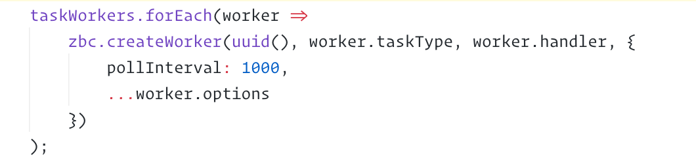

# Zeebe: Cloud-Native Workflow Engine for Microservices Orchestration.

## Graphically model your workflows.

Using industry-standard BPMN.

## Write light-weight services to handle tasks.

In any programming language that supports gRPC: Java, Go, JavaScript, C#, Ruby, Python, Rust....

## Inspect the running state of your system.

Using Camunda Operate, or anything that integrates with Zeebe's streaming exporter.

## Deploy to Kubernetes.

Run your workloads on any cloud provider.

## Scalable. Fault-tolerant. Distributed.

Choose three.
