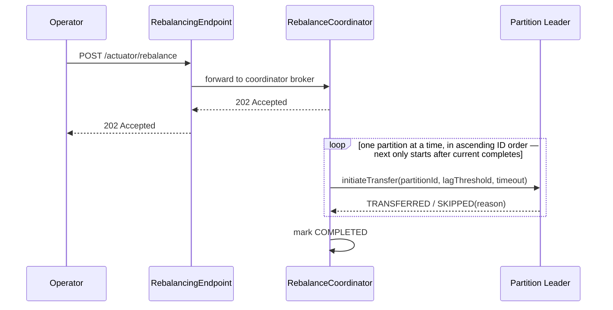
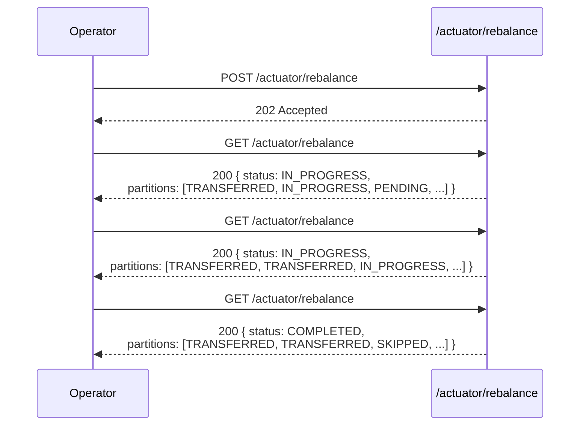
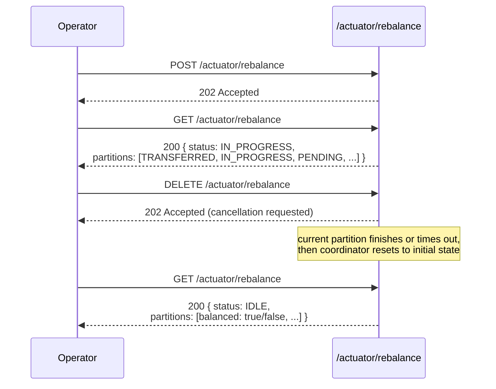
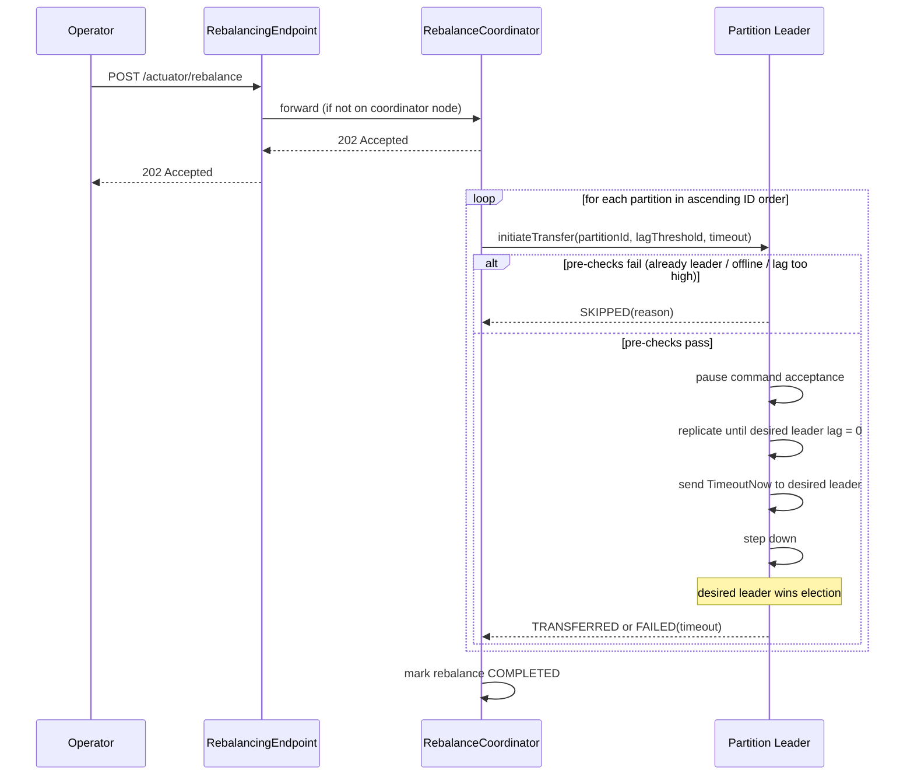
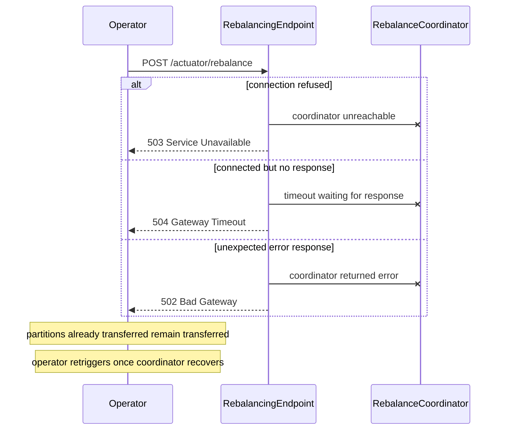
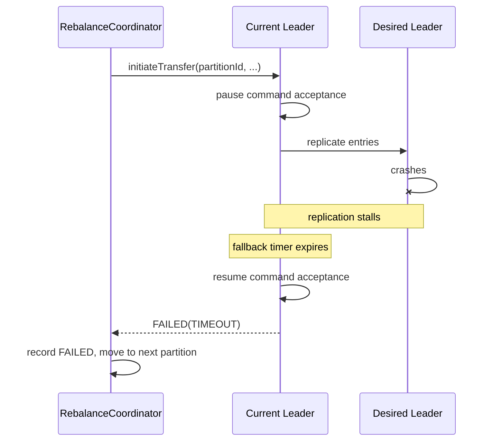
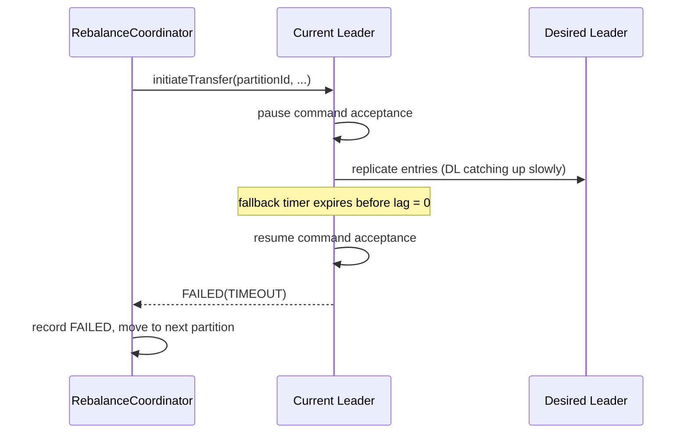
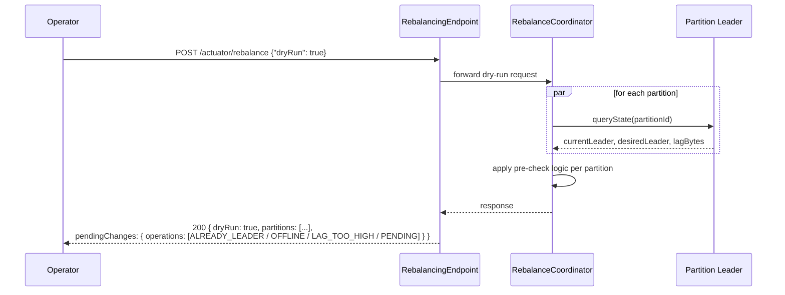

# Coordinated Leadership Transfer — Engineering Design

**Issue:** https://github.com/camunda/product-hub/issues/3630
**Audience:** Distributed Systems team
**Status:** Draft — open questions noted inline

---

## Problem Statement

Camunda 8 clusters elect a leader per partition using Raft. Each partition has a
designated primary member — the node with the highest configured election priority.
After events like broker restarts or network partitions, leadership may settle on a
non-primary member. This is correct from Raft's perspective but suboptimal for
performance: partition leadership is distributed round-robin across brokers by default,
giving each broker an equal share of the processing work. When leadership drifts from
that intended layout, work becomes unevenly distributed across the cluster. In the
future, priority assignment may also encode rack awareness, making reliable rebalancing
even more important.

The existing `/actuator/rebalance` endpoint attempts to correct this by sending a
`stepDownIfNotPrimary()` request to each node simultaneously. It is fire-and-forget:
returns `200` immediately, applies no coordination, provides no feedback, and cannot
guarantee the desired leader is elected (e.g. if the desired member's log is behind,
it will lose the election regardless of priority). Operators have no reliable recovery
path short of manual intervention.

This design replaces the fire-and-forget implementation with a coordinated leadership
transfer protocol that guarantees transfer when all conditions are met (target is online,
replication lag is within the configured threshold, and catch-up completes before the
fallback timer expires). When conditions are not met, the partition is skipped or the
transfer falls back to the existing leader — transfer is still not guaranteed in those
cases. The protocol processes one partition at a time to limit blast radius, and provides
full observability into each decision and its outcome.

---

## Prior Work

Diego Ongaro's dissertation **"Consensus: Bridging Theory and Practice"** (2014),
§3.10 *"Leadership transfer extension"*, defines a `TimeoutNow` RPC that causes a
follower to immediately start an election, bypassing its election timeout. The leader
sends `TimeoutNow` to the intended successor after verifying the follower's log is
up-to-date, then stops accepting new client requests. We adopt this mechanism directly,
adding pre-checks and coordination on top for operational safety.

---

## Solution Overview

The feature is gated by a feature flag (`camunda.cluster.rebalance.enabled`, default
`false`) at the existing `/actuator/rebalance` endpoint. When disabled, the existing
fire-and-forget behaviour runs unchanged. When enabled, the new coordinated protocol
runs.

The feature spans four layers: the **Management API** (`RebalancingEndpoint`, proxies to
coordinator if not on the coordinator node), the **Coordinator** (`RebalanceCoordinator`
in `zeebe/broker`, in-memory state machine), the **Partition layer**
(`PartitionLeadershipTransfer` in `zeebe/broker`, pre-checks and transfer state machine),
and the **Raft layer** (`LeaderRole` extensions in `zeebe/atomix/cluster`).

Routing uses the same mechanism as backup scheduling and dynamic-config (lowest broker ID
as coordinator). The coordinator node is determined by the `RebalancingEndpoint` before
forwarding.

### Happy path overview



> [!NOTE]
> Ongoing work in the Physical Tenant epic may result in this endpoint being
> surfaced on the main REST API as well. We do not anticipate significant friction from
> that transition given the management API context.


### Monitoring a rebalance

Trigger rebalance with a `POST`, then poll `GET` to watch progress partition by
partition until the operation completes.



### Cancelling a rebalance in progress

Send `DELETE` at any point to stop after the current partition finishes. Partitions
already transferred remain under the new leadership.



---

## Transfer Protocol

A `POST /actuator/rebalance` returns `202` immediately. The coordinator then processes
each partition in sequence: run pre-checks, skip if any fail, otherwise execute the
transfer and wait for the outcome before moving to the next partition.



### Pre-checks — skip partition if:

1. **Already leader:** desired member (highest-priority member per partition config)
   is already the current leader → `SKIPPED: ALREADY_LEADER`
2. **Offline:** desired member is not present in the current cluster topology →
   `SKIPPED: DESIRED_LEADER_OFFLINE`
3. **Lag exceeds threshold:** desired member's replication lag in bytes >
   `camunda.cluster.rebalance.replicationLagThreshold` →
   `SKIPPED: LAG_EXCEEDS_THRESHOLD`

### Transfer sequence — if pre-checks pass:

1. **Pause command acceptance** on current leader (see details below)
2. **Monitor replication lag** for the desired member until lag = 0 bytes
3. **Send `TimeoutNow`** to the desired member → it immediately starts a voting round
   (one full `RequestVote` round for correctness; target wins: full log + highest priority)
4. **Step down** — current leader relinquishes leadership
5. **Coordinator observes topology** until partition's leader matches desired member →
   `TRANSFERRED`

### Fallback — if catch-up stalls:

If the desired member has not reached lag = 0 within
`camunda.cluster.rebalance.partitionTimeout`, abort:
- Current leader **resumes accepting commands**
- Partition marked `FAILED: TIMEOUT`
- Coordinator moves to next partition

The fallback timer is local to the partition leader. Coordinator crashes cannot leave
a partition stuck in a paused state.

### Rationale for one voting round

The desired member having lag = 0 at the moment `TimeoutNow` is sent does not
guarantee it still has the full log when votes are cast — the old leader may have
written one additional entry during the grace period. The voting round lets members
reject a stale candidate. The latency cost is one network round trip on an otherwise
idle partition (command acceptance is paused), which is negligible.

---

## Failure Modes

### Coordinator unreachable or unresponsive

The `RebalancingEndpoint` distinguishes three forwarding failure modes:

| Scenario | HTTP status |
|---|---|
| Coordinator broker down — connection refused | `503 Service Unavailable` |
| Coordinator reachable but timed out — no response within deadline | `504 Gateway Timeout` |
| Coordinator reachable but returned an unexpected error response | `502 Bad Gateway` |

Any rebalance already in progress on the coordinator is lost (in-memory state) if the
coordinator restarts. Partitions already transferred remain transferred — Raft durably
elected their new leaders. The operator retries once the coordinator recovers.



### Current leader loses leadership mid-transfer

Two sub-cases depending on when the concurrent election occurs:

- **Before pause:** no state has been touched yet; the now-follower simply rejects
  `initiateTransfer`; the coordinator handles this via the topology change path
  (wait for new leader, retry, or `FAILED: TOPOLOGY_CHANGE_TIMEOUT`)
- **During pause:** the node detects it has lost leadership while paused and reports
  `FAILED: LOST_LEADERSHIP_DURING_TRANSFER`; the new leader resumes command acceptance
  naturally as part of its leader role startup — the cluster is never left stuck

### Desired leader goes offline after pre-check passes

If the desired leader goes offline after the pre-check but during the catch-up window,
the current leader detects this through normal Raft follower health monitoring
(heartbeat timeouts). It aborts the transfer immediately, resumes command acceptance,
and reports `FAILED: DESIRED_LEADER_WENT_OFFLINE` to the coordinator — minimising
the unavailability window rather than waiting for the full fallback timeout to expire.

### Desired leader crashes mid-transfer

If the desired leader crashes during the catch-up window, the same mechanism applies:
the current leader detects the follower loss via Raft heartbeat monitoring, aborts,
resumes command acceptance, and reports `FAILED: DESIRED_LEADER_WENT_OFFLINE`.



### Resume fails after fallback

Leaving a partition stuck in paused state is the worst possible outcome. Three
independent layers guarantee this cannot persist:

1. **Simplicity:** resume is an in-memory flag clear + re-enable of the append
   pipeline — no I/O, no network calls. Minimal failure surface by design.
2. **Local step-down:** any failure on the resume path must trigger a step-down.
   Step-down is a well-tested Raft path; the new leader elected afterwards will not
   be in a paused state.
3. **Follower watchdog:** the leader signals to followers (e.g. via a flag in
   heartbeat/AppendEntries) that it is in "should resume" state. Followers start a
   timer; if the leader has not resumed within an election timeout, they force an
   election. This covers the case where the leader is alive enough to send heartbeats
   but stuck — exactly the scenario layers 1 and 2 might miss.

### Fallback timer fires (catch-up too slow)

If the desired leader is alive but catching up too slowly to meet the timeout, the
outcome is the same: fallback timer fires, commands resume, partition marked `FAILED`.
The difference from a crash is that the desired leader remains a follower and will
continue replicating normally after the fallback.



### Replication lag counter drift

The incremental lag tracking (increment on append, decrement on ack) may drift around
follower resets or snapshot transitions. A conservative approximation is acceptable:
- **Overestimate** → partition skipped when it could have been transferred; operator
  retries when lag genuinely drops. Safe.
- **Underestimate** → transfer attempted with lag slightly above threshold; pause may
  last longer than expected; fallback timer is the safety net. Also acceptable.

The lag tracking implementation should bias toward overestimating when uncertain.

### TimeoutNow lost in transit

If `TimeoutNow` is lost on the network, the target never fires its immediate election.
The existing priority election timer (`PriorityElectionTimer`) ensures the target still
wins the next election — just slightly slower. The coordinator observes no topology
change within the transfer timeout, marks the partition `FAILED`, and the operator
can retry.

---

## Pausing Command Acceptance

Pausing is modelled as a partial step-down: the leader holds the term and continues
replicating, but is functionally unavailable for new writes.

**Mechanism:**
- The entry currently mid-write completes (one-entry grace)
- All pending append operations fail via the **existing append listener failure path**
  (same path as normal leader elections — reuse, do not reinvent)
- `ZeebePartition` is notified to **pause stream processing** — the engine cannot
  write results anyway, so processing must stop
- `ZeebePartition` is **tentatively not paused for exporting** — exporting can continue
  but cannot acknowledge exported positions without writes; final decision during
  implementation
- Replication to all followers continues normally

**On in-flight appends:** an alternative would be to only stop accepting new writes and
let any already-queued appends drain naturally. However, since we stop processing, those
queued appends would never receive a response and would time out silently from the
client's perspective — poor UX. We therefore choose to fail them immediately via the
append listener path, mimicking a real leader change. This gives clients an immediate
signal to retry, consistent with normal leader election behaviour, even though there is
a chance the transfer does not ultimately succeed.

**Throttling considered and rejected:** finding a throttle level that allows catch-up
while not fully stopping client availability is too imprecise; at e.g. 80% backpressure
the user experience is indistinguishable from a full pause.

---

## Replication Lag Tracking (Slice 1 — Independent)

Delivered as an independent slice. Until it ships, the pre-check threshold falls back
to entry count as a proxy.

### Hard constraint: zero I/O in the hot path

**Log lag — incremental tracking:**
- On follower join or reset: calculate initial lag in bytes (some I/O acceptable,
  infrequent)
- On each append to a follower: `lag += size(entry)`
- On follower acknowledgment: `lag -= size(acknowledged)`
- On follower reset: recalculate from scratch

**Shortcuts to minimise initial I/O:**
- Whole segments: use segment descriptor size (no per-entry I/O)
- Sparse journal index: extend to track cumulative byte offsets between indexed
  positions — in-memory for most of the range; only the last leg needs any I/O
- Entry metadata (size field only): avoids full deserialization but still touches
  pages and may trigger mmap pre-fetching

**Snapshot lag:**
Snapshot metadata file (separate from snapshot ID) contains snapshot size. Read once
and cached in-memory in `SnapshotStore` when a snapshot is committed. If a snapshot
install is in progress, snapshot lag = total snapshot size − bytes already sent.

**Metric:** `zeebe.raft.replication.lag.bytes` (GAUGE, labels: `partitionId`,
`followerId`) — continuously updated, lives in Raft layer, useful beyond rebalancing.

---

## TimeoutNow Raft Message (Slice 2)

New message type in Atomix Raft (does not exist today).

- **`LeaderRole`**: after lag = 0, sends `TimeoutNow` to the desired member
- **`FollowerRole`**: on receipt, immediately transitions to candidate state and
  sends `RequestVote` to all members, skipping election timeout
- Normal `RequestVote` processing applies — other members vote based on log
  completeness and term

This is a direct implementation of §3.10 of the Ongaro dissertation.

---

## Per-Partition Transfer State Machine (Slice 3)

Lives in `zeebe/broker`, sitting between the coordinator and the Raft layer.

**Internal API exposed to coordinator:**
```
initiateTransfer(partitionId, lagThreshold, timeout) → TransferResult
  TransferResult: TRANSFERRED | SKIPPED(reason) | FAILED(reason)
```

**State machine:**
```
IDLE → PRE_CHECKING → PAUSED → WAITING_FOR_CATCHUP → SIGNALLING → CONFIRMING
                   ↘ SKIPPED        ↘ FAILED(timeout)
```

The coordinator is **logically sequential but asynchronously implemented**: it sends the
`BrokerAdminRequest` and registers a callback on the resulting `CompletableFuture`. When
the future completes (transferred, skipped, failed, or timed out), the coordinator
schedules the next partition. The coordinator actor is never blocked — it remains free
to handle `GET` and `DELETE` requests while a transfer is in progress. All transfer
logic is encapsulated in this layer; the coordinator has no knowledge of Raft internals.

---

## Coordinator & REST API (Slice 4)

### Coordinator

One designated broker (lowest broker ID — existing cluster topology coordinator,
same routing mechanism as backup scheduling/compaction and dynamic-config) owns
the rebalance state machine. Any broker receiving a request proxies to it.

The coordinator is topology-aware and reacts to topology events (new leader elections,
broker joins/leaves) during a rebalance.

**Partition leader changes mid-request:**
If the current leader rejects `initiateTransfer` with "I'm not leader" (a rejection,
not an error):
1. Check if the topology already reflects a new leader → if so, retry immediately with
   the new leader; the transfer timeout starts fresh
2. If topology not yet updated → wait for a topology event indicating a new leader,
   bounded by a separate **topology stabilization timeout**
   (distinct from the per-partition transfer timeout — not charged against it)
3. If the stabilization timeout expires before a new leader is seen → mark partition
   `FAILED` with reason `TOPOLOGY_CHANGE_TIMEOUT` and move to the next partition

**In-memory state:**
```
status:               IDLE | IN_PROGRESS | COMPLETED | CANCELLED
pendingChanges:       { startedAt, operations: List<OperationResult> } | null
lastCompletedChanges: { startedAt, finishedAt, status, operations: List<OperationResult> } | null
```

On coordinator restart: state is lost. Already-transferred partitions remain
transferred (Raft durably elected the new leaders). Operator re-triggers to continue.

**Concurrent `POST` behaviour:** `202` vs `409` — **open question, to be resolved
during proposal review.** Depends on whether dynamic partition priorities are
imminent (static → `202` idempotent; dynamic → `409` with pointer to `DELETE`).

### REST API

| Method | Path | Description |
|--------|------|-------------|
| `POST` | `/actuator/rebalance` | Start rebalance (or dry-run) |
| `GET` | `/actuator/rebalance` | Current status + per-partition balance |
| `DELETE` | `/actuator/rebalance` | Cancel after current partition completes |

**`POST` request body:**
```json
{ "dryRun": false }
```
Dry-run returns `plannedOperations` with per-partition predicted action and reason,
without executing any transfer.

**`GET` response:**
```json
{
  "status": "IDLE | IN_PROGRESS | COMPLETED | CANCELLED",
  "partitions": [
    { "partitionId": 1, "currentLeader": "broker-1", "desiredLeader": "broker-1" },
    { "partitionId": 2, "currentLeader": "broker-0", "desiredLeader": "broker-1" }
  ],
  "pendingChanges": {
    "startedAt": "2026-05-06T14:30:00Z",
    "operations": [
      { "partitionId": 1, "currentLeader": "broker-1", "desiredLeader": "broker-1", "status": "ALREADY_LEADER" },
      { "partitionId": 2, "currentLeader": "broker-0", "desiredLeader": "broker-1", "status": "IN_PROGRESS" },
      { "partitionId": 3, "currentLeader": "broker-0", "desiredLeader": "broker-2", "status": "PENDING" }
    ]
  },
  "lastCompletedChanges": {
    "startedAt": "2026-05-06T12:00:00Z",
    "finishedAt": "2026-05-06T12:05:00Z",
    "status": "COMPLETED | CANCELLED",
    "operations": [
      { "partitionId": 1, "currentLeader": "broker-1", "desiredLeader": "broker-1", "status": "ALREADY_LEADER" },
      { "partitionId": 2, "currentLeader": "broker-0", "desiredLeader": "broker-1", "status": "TRANSFERRED" },
      { "partitionId": 3, "currentLeader": "broker-0", "desiredLeader": "broker-2", "status": "FAILED" }
    ]
  }
}
```

**Field semantics:**
- `status` (top-level): lifecycle state of the current or most recent operation —
  `IDLE` (nothing running, nothing completed yet), `IN_PROGRESS`, `COMPLETED` (ran to
  completion regardless of individual outcomes), `CANCELLED` (stopped via `DELETE`)
- `partitions`: live cluster view — current and desired leader per partition, always
  present. Derivable from topology; `currentLeader == desiredLeader` indicates balance.
- `pendingChanges`: present and non-null only while `IN_PROGRESS`; clears when the
  operation ends (completed or cancelled)
- `lastCompletedChanges`: snapshot of the previous finished operation (completed or
  cancelled); updated atomically when the operation ends; null until first operation runs

**Operation statuses:** `PENDING` · `IN_PROGRESS` · `TRANSFERRED` · `ALREADY_LEADER` ·
`OFFLINE` · `LAG_TOO_HIGH` · `FAILED` · `CANCELLED` (for operations not reached before
a `DELETE`)

**Error cases** (operation could not start): the controller returns an appropriate HTTP
error response with a descriptive message body. The status body above is only returned
for valid operational states; `FAILED` does not appear at the top level.

**`DELETE`:** cancels after the current in-flight partition completes. Does not
interrupt an in-flight transfer (too many edge cases). The current partition's
fallback timer is the safety net.

`DELETE` when no rebalance is in progress returns `404` with a descriptive body
(e.g. `"No active rebalance operation to cancel"`). Explicit rejection — a `DELETE`
with nothing to cancel likely indicates a bug in operator tooling.

**No global timeout.** `DELETE` is the only way to abort.

---

## Configuration

New subsection in unified config:

```yaml
camunda:
  cluster:
    rebalance:
      enabled: false                        # feature flag; default off
      replicationLagThreshold: <TBD>        # max bytes lag to attempt transfer; default low (conservative)
      partitionTimeout: <TBD>               # per-partition fallback timer; default low (conservative)
```

**Direction for defaults:** low threshold + low timeout (conservative). Low threshold
= only transfer when desired leader is nearly caught up → short pause duration. Low
timeout = fall back quickly if catch-up stalls → bounded unavailability. Exact values
require benchmarking.

Designed for future expansion: auto-rebalancing triggers, scheduling config, etc.
will fit naturally under `camunda.cluster.rebalance.*`.

---

## Observability

### Metrics

| Metric | Type | Labels | Notes |
|---|---|---|---|
| `zeebe.raft.replication.lag.bytes` | GAUGE | `partitionId`, `followerId` | continuous; Slice 1; general Raft health |
| `zeebe.cluster.balance.ratio` | GAUGE | — | fraction of partitions led by desired leader; 1.0 = fully balanced |
| `zeebe.cluster.rebalance.status` | GAUGE | — | 0=idle 1=in_progress 2=completed 3=failed |
| `zeebe.cluster.rebalance.partitions.pending` | GAUGE | — | |
| `zeebe.cluster.rebalance.partitions.completed` | GAUGE | — | |
| `zeebe.cluster.rebalance.elapsed` | TIMER | — | end-to-end rebalance duration including coordination overhead |
| `zeebe.cluster.rebalance.partition.duration` | TIMER | `partitionId`, `outcome` | outcome: transferred/skipped/failed |
| `zeebe.cluster.rebalance.partition.attempts` | COUNTER | `partitionId`, `outcome` | |
| `zeebe.cluster.rebalance.partition.skip.reason` | COUNTER | `reason` | already_leader / offline / lag_too_high |
| `zeebe.cluster.rebalance.partition.paused` | GAUGE | `partitionId` | 1 while command acceptance halted |
| `zeebe.cluster.rebalance.partition.pause.duration` | TIMER | `partitionId` | availability impact per partition |
| `zeebe.cluster.rebalance.fallback.triggered` | COUNTER | `partitionId` | fires when per-partition timeout expires |
| `zeebe.raft.timeoutnow.sent` | COUNTER | `partitionId` | **maybe** — check if existing Raft request tracking covers it |

Duration SLO buckets (consistent with dynamic-config): 100ms, 1s, 2s, 5s, 10s, 30s,
60s, 120s, 180s, 300s, 600s.

### Structured logs

| Level | Content |
|---|---|
| TRACE | Fine-grained per-event tracing: pre-check outcome per partition, transfer initiated, pause confirmed, lag = 0 reached, TimeoutNow sent, new leader observed, fallback timer triggered, per-partition outcome |
| INFO | Rebalancing plan on start (partitions to process, desired leaders, configured thresholds) |
| INFO | Rebalancing outcome on completion (N transferred, M skipped, K failed — with reasons) |

Fallback and transfer failure are expected operational outcomes monitored via metrics
and the `GET` endpoint — they do not warrant WARN-level logging.

### Dry-run mode

`POST` with `{"dryRun": true}` — coordinator queries all partition leaders in parallel,
applies pre-check logic, returns `plannedOperations` without executing any transfer.
Enables operators to preview the outcome and tune thresholds before committing.

The response mirrors what the first `GET` after a real `POST` would return, with a
`dryRun: true` marker so consumers can distinguish a preview from a live operation.
No coordinator state is modified.



---

## Delivery Slices

| Slice | Scope | Dependency |
|---|---|---|
| 1 — Replication lag tracking | `zeebe.raft.replication.lag.bytes`; incremental tracking in `LeaderRole`; snapshot size in `SnapshotStore` | None — independent |
| 2 — TimeoutNow Raft message | New message type in Atomix; send in `LeaderRole`, handle in `FollowerRole` | None — can parallel with Slice 1 |
| 3 — Per-partition transfer protocol | Command pause/resume; transfer state machine; `initiateTransfer` API | Slices 1 & 2 |
| 4 — Coordinator + REST API | In-memory coordinator; request routing; POST/GET/DELETE; feature flag; config | Slice 3 |

---

## Alternatives Considered

### Parallel (stateless)

All partitions transferred simultaneously. No coordinator, no state, restart-safe.

**Rejected:** violates the "one partition at a time" user story; worst case all
partitions lose their leader simultaneously.

### Dynamic-config integration

Sequencing and persistence via the existing `dynamic-config` module.

**Rejected:**
- Semantic mismatch: dynamic-config is declarative config deltas; this is a live
  procedural protocol (pause, monitor real-time metric, send Raft signal)
- Blocks the entire dynamic-config queue for potentially 8+ minutes on a 50-partition
  cluster (50 × 10s timeout), preventing unrelated operations
- Partial-failure resume semantics are murky for transient partition pause state
- Coordinator unavailability is equally a problem in both approaches

---

## Open Questions

| Question | Status |
|---|---|
| `POST` while in-progress: `202` or `409`? | **Discuss at proposal review** — depends on dynamic priority roadmap |
| Exact defaults for `replicationLagThreshold` and `partitionTimeout` | **TBD** — requires benchmarking |
| `TimeoutNow` sent metric: is it already covered by existing Raft request tracking? | **Check during Slice 2 implementation** |
| Exporting during pause: continue (tentative yes) or pause? | **Final decision during Slice 3 implementation** |
| Old leader notifies coordinator on new leader discovery (reduces polling latency) | **Stretch goal, v2** |
| `DELETE` with no active rebalance: `404` (current) vs `200` with IDLE body (idempotent) | **Consider based on expected operator UX** |
| On `TOPOLOGY_CHANGE_TIMEOUT`: move partition to end of queue and retry after remaining partitions, rather than marking immediately as FAILED | **Optimization, consider for v1 if low implementation cost** |
| Topology stabilization timeout value | **TBD — requires input from team on typical election duration** |
| Prevent elections while a partition transfer is in progress (suppress election timer or refuse votes) | **Open — reduces concurrent election risk but adds protocol complexity; revisit during Slice 2/3** |
