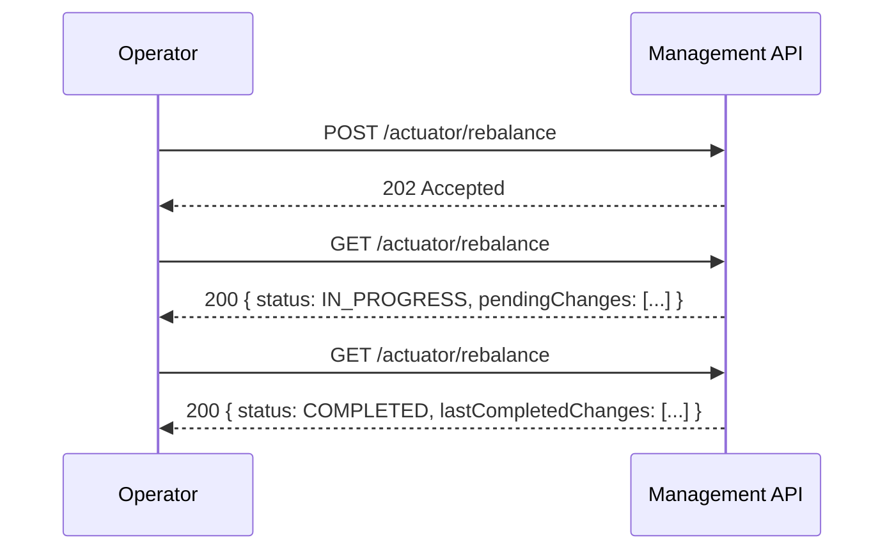
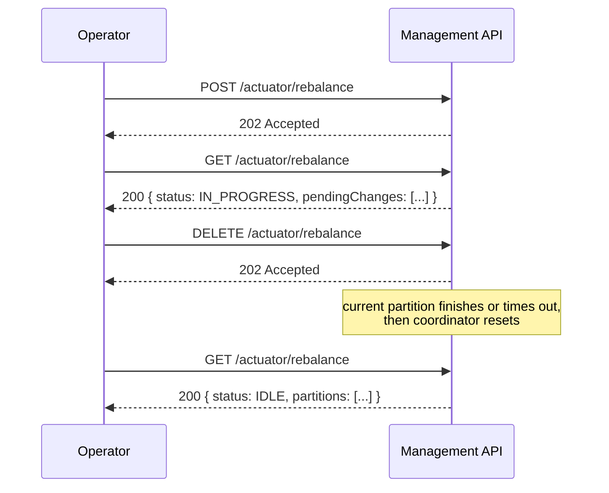

# Coordinated Leadership Transfer — Overview

**Issue:** https://github.com/camunda/product-hub/issues/3630
**Audience:** Application engineers (non-DS teams)
**Status:** Draft

---

## Background

In a Camunda 8 cluster, each partition has a **leader** — the broker responsible for
processing commands and replicating them to the other brokers (followers). The leader
for a given partition is determined by Raft, our consensus algorithm.

By default, partition leadership is distributed round-robin across brokers, giving
each broker an equal share of the processing work. Each broker is assigned a
**priority** per partition that encodes this intended layout: the highest-priority
broker is the preferred leader and will be elected first under normal conditions. In
the future, priority assignment may also encode rack awareness, making reliable
rebalancing even more important.

---

## The Problem

After events like broker restarts, rolling upgrades, or network hiccups, leadership
can end up on a non-preferred broker. Raft doesn't automatically move it back: the
current leader is doing its job correctly, so there's no reason for it to step down.
When this happens, work is no longer evenly distributed across the cluster.

Today, operators can call `POST /actuator/rebalance` on the management API to nudge
the cluster back into its preferred layout. But this is a best-effort, fire-and-forget
operation: it broadcasts "step down if you're not the preferred leader" to all brokers
simultaneously with no coordination and no feedback. It can fail silently — for
example, if the preferred broker's log is behind, it will lose the election and the
cluster stays unbalanced. Operators are left with no reliable path to recovery and no
visibility into what happened.

---

## What This Feature Does

This feature replaces the fire-and-forget rebalance with a **coordinated leadership
transfer** that:

- Checks whether the preferred broker is actually ready to become leader before
  attempting a transfer — and skips partitions where conditions are not met
- **Guarantees transfer only when all conditions are met** (preferred broker online,
  replication lag within threshold, catch-up completes before timeout); otherwise
  the partition is skipped or falls back to the existing leader
- Pauses new work on the current leader just long enough for the preferred broker to
  fully catch up, then triggers a fast handover
- Processes **one partition at a time** to limit the impact on cluster availability
- Falls back safely if something goes wrong (e.g. the preferred broker crashes
  mid-transfer) — the cluster is never left in a stuck state
- Provides full visibility into what happened per partition — whether a transfer
  succeeded, was skipped, or failed, and why

The feature is accessed through the same `/actuator/rebalance` endpoint on the
management API that operators already know, and is gated by a feature flag so existing
deployments are unaffected until they opt in.

---

## How It Works (High Level)

For each partition, in order:

1. **Is a transfer needed?** If the preferred broker is already the leader, skip. If
   it's offline or too far behind, skip and move on — no disruption.

2. **Pause new work** on the current leader. The broker stops accepting new commands
   but keeps replicating existing ones to the followers. From the application's
   perspective, this partition is briefly unavailable for writes.

3. **Wait for the preferred broker to catch up** fully. Once its log matches the
   leader's exactly, it's safe to hand over.

4. **Trigger the handover.** The current leader signals the preferred broker to start
   an election immediately. A quick voting round confirms the new leader.

5. **Done.** The coordinator confirms the topology reflects the new leader and moves
   to the next partition.

If the preferred broker doesn't catch up within the configured timeout, the current
leader resumes accepting commands and the partition is marked as failed — the cluster
returns to normal, nothing is left in a broken state.

---

## Impact on the Application

### Brief per-partition unavailability

During the catch-up window (steps 2–4 above), the partition being transferred does not
accept new commands. In practice this window should be short — the feature is designed
to only attempt transfers when the preferred broker is already nearly caught up. The
default configuration is conservative: it skips partitions where the catch-up would
take too long.

Other partitions continue operating normally throughout. Only one partition is ever
in transfer at a time.

### Clients receive an immediate error signal

When a partition pauses for transfer, any in-flight commands receive an immediate
failure response — the same signal clients get during a normal leader election. This
is intentional: silently queuing those commands would leave clients waiting for a
response that may never arrive if the transfer ultimately fails. Existing retry logic
in clients and the gateway handles this transparently.

### No changes to normal operation

When the feature flag is off (the default), nothing changes. Operators enable it
explicitly when they want to rebalance their cluster.

---

## Operator API

### Starting and monitoring a rebalance

Trigger with `POST`, then poll `GET` to watch progress partition by partition.



### Cancelling a rebalance

`DELETE` stops the rebalance after the current partition finishes. The coordinator
resets to its initial state — a subsequent `GET` returns `IDLE` with the current
live partition view. Partitions already transferred remain under the new leadership.



---

## Observability

### GET response

`GET /actuator/rebalance` always returns a live view of partition balance plus the
state of any running or recently completed rebalance:

```json
{
  "status": "IDLE | IN_PROGRESS | COMPLETED | CANCELLED",
  "partitions": [
    { "partitionId": 1, "currentLeader": "broker-1", "desiredLeader": "broker-1" },
    { "partitionId": 2, "currentLeader": "broker-0", "desiredLeader": "broker-1" }
  ],
  "pendingChanges": {
    "startedAt": "2026-05-06T14:30:00Z",
    "operations": [
      { "partitionId": 1, "status": "ALREADY_LEADER" },
      { "partitionId": 2, "status": "IN_PROGRESS" },
      { "partitionId": 3, "status": "PENDING" }
    ]
  },
  "lastCompletedChanges": {
    "startedAt": "2026-05-06T12:00:00Z",
    "finishedAt": "2026-05-06T12:05:00Z",
    "status": "COMPLETED | CANCELLED",
    "operations": [
      { "partitionId": 1, "status": "ALREADY_LEADER" },
      { "partitionId": 2, "status": "TRANSFERRED" },
      { "partitionId": 3, "status": "FAILED" }
    ]
  }
}
```

`pendingChanges` is non-null only while a rebalance is running. `lastCompletedChanges`
persists until the next rebalance starts, giving operators a record of the previous
run. Calling `GET` with no rebalance ever triggered returns `status: IDLE` with only
the `partitions` array — useful as a standalone balance health check.

### Dry-run mode

`POST /actuator/rebalance {"dryRun": true}` returns what *would* happen without
executing anything — which partitions would be transferred and which would be skipped
and why. The response mirrors the first `GET` a real `POST` would produce, with a
`dryRun: true` marker.

### Key metrics

- **`zeebe.cluster.balance.ratio`** — fraction of partitions currently led by their
  preferred broker (1.0 = fully balanced). Alert on this dropping below 1.0 after
  a broker restart.
- **`zeebe.cluster.rebalance.partition.pause.duration`** — how long each partition was
  unavailable for writes during its transfer.
- **`zeebe.raft.replication.lag.bytes`** — replication lag per broker per partition,
  updated continuously. Useful for understanding cluster health independently of
  rebalancing.

---

## Configuration

```yaml
camunda:
  cluster:
    rebalance:
      enabled: false               # off by default; opt in explicitly
      replicationLagThreshold: ?   # how caught-up the preferred broker must be before attempting transfer
      partitionTimeout: ?          # how long to wait for catch-up before giving up
```

Defaults are conservative (low threshold, short timeout): the feature prefers skipping
over causing disruption. Operators can relax these values to accept longer transfer
windows in exchange for more successful transfers.

---

## Delivery Plan

The feature is split into four slices — slices 1 and 2 can run in parallel:

1. **Replication lag tracking** — new metric tracking how far behind each follower is
   in bytes. Independent; ships first.
2. **Fast election signalling** — a new internal Raft message that tells the preferred
   broker to start an election immediately.
3. **Per-partition transfer protocol** — the full pause → catch-up → handover →
   fallback state machine, at the single-partition level.
4. **Coordinator + Management API** — the orchestration layer and the public-facing
   endpoint, bringing everything together. Note: ongoing work in the Physical Tenant
   epic may also surface this on the main REST API.

---

## Open Question for Team Input

**If a rebalance is already in progress and an operator calls `POST` again, should
the endpoint return the current status (`202`) or reject the request (`409 Conflict`)?**

- `202` is more ergonomic if partition priorities never change — every call wants the
  same outcome, so returning the current status is harmless.
- `409` is safer if priorities can change dynamically in future — a new rebalance
  request may want a different target layout than the one currently in progress.

This will be discussed at the proposal review.
