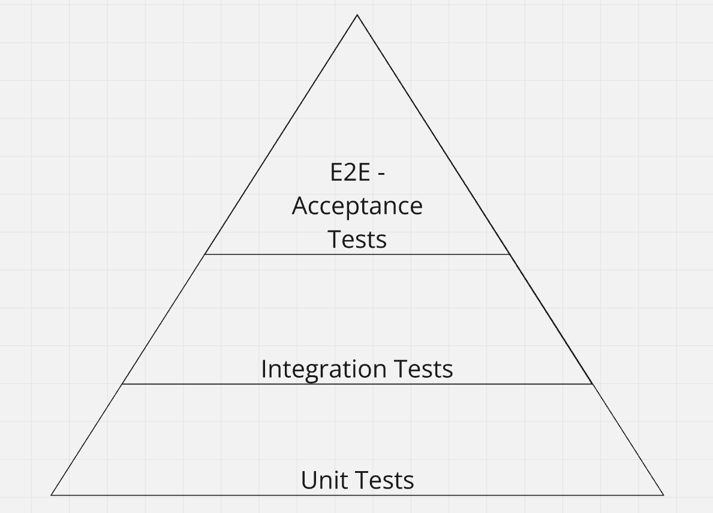

# Testing strategy

The following document describes the testing strategy of the Camunda mono repository.

After reading this guide the reader should understand what kinds of tests exist, how to write tests,
and where to write them, if necessary.
It can be seen as a reference for engineers and outside collaborators.

> [!Note]
>
> If you detect anything incomplete/wrong, please open PR or issue to get this fixed.

## General overview - Testing pyramid

> The “Test Pyramid” is a metaphor that tells us to group software tests into buckets of different
> granularity. It also gives an idea of how many tests we should have in each of these groups.
> https://martinfowler.com/articles/practical-test-pyramid.html

It has different notations, often depending on the context. But the general gist is that you should
have:

* unit tests, quick in execution, testing components in isolation
* integration tests, slower in execution, testing components with dependencies
* E2E or acceptance tests, slow, testing a complete user journey or a feature end-to-end (E2E)



## General conventions

- Every public change should be verified via an automated test.
  - Every bug fix should be verified via a regression test.
- It's perfectly fine to repeat yourself in tests; the focus is on readability.
  - One caveat here, is with acceptance tests, where set up can be expensive.
- Where possible, use junit 5 to write tests.
  - When modifying an existing junit 4 test, if possible, first take the time to migrate it to junit 5.
  - If it is too time-consuming to migrate (e.g. uses lots of custom junit 4 rules), you can omit that.
- Where possible, avoid waiting for something to happen; this will reduce flakiness.
  - If you have to, use [Awaitility](http://www.awaitility.org/) to await conditions, **do not use `Thread.sleep` or the likes**.
- Avoid using any shaded dependencies, and use direct ones.

[//]: # (### Add rules of thumb when writing tests, e.g. use junit 5 where possible, etc.)

## Unit tests

[//]: # (### What is a unit test)

A test which validates/verified the behavior of just one component or unit, without dependencies is
a unit test.

> [!Note]
>
> A unit or component can be just one class, but doesn't need necessarily.

**Key properties:**

* Small scoped:
  * one unit test should validate one behavior
  * Testing without dependencies
* Fast: A unit test should be quick in execution
  * Comes with small scoped
* Most of our tests should be unit tests (see testing pyramid above)
  * As they should be fast and small scoped we can have many of them

> [!Note]
>
> The key properties are rule of thumb, we should try to stick with it, there might be cases to
> break with this.
>
> [!Note]
>
> **It is fine to repeat yourself in tests.**
>
> It is also highly recommended to improve the readability and understandably of such tests. Giving
> the full context to the reader.
>
> The expectation is that for unit tests that set up code is fast, and test should be itself fast.
> If this is not the case, there might be something off with your test itself.

### Small scoped

**Why:**

* To separate concerns
  - To make sure we test on component/unit in isolation, building confidence that this unit itself
    behaves correctly. The test behavior is more controllable and observable
  - A test fail shows specific that one unit and behavior is affected. If not small scoped we might
    not test one unit, and can't be sure whether any other behavior influences the test
* Allows to be quick in execution time, when focusing on one small unit with little setup
* Reduces the maintainability/readability
  - as tests are not affected by changes in other components
  - it makes clear and understandable what is tested

#### Do's:

```java

@Test
public void shouldAddSomeValues() {
  // given
  // .. set up component/unit/class
  final var calculator = new Calculator();
  final var expectedValue = 7;

  // when
  // .. trigger some behavior
  final var actualValue = calculator.add(2, 5);

  // then
  // .. validate result / behavior
  assertThat(actualValue).isEqualTo(expectedValue);
}
```

The test is a unit test because:

* It is small scoped
  * it tests one behavior - addition
  * it has no dependencies
* Side-effect: It is likely to be quick

#### Dont's: Usage of dependency

```java

@Test
public void shouldReturnSuccessfulResponse() {
  // given
  // .. set up database
  // .. set up client

  // when
  final var response = client.sendRequest();

  // then
  assertThat(response.statusCode).isEqualTo(200);
}
```

This test is not a unit test, because:

* It is not small scoped:
  * it tests one behavior, but it depends on other components to run
* Test is an integration test, as we are integrating with a dependency.
  * It might be flaky due to the dependency
  * The dependency might be not fully under control, which means there might be many cases we can't
    test in such a test
* It may also be slow, setting up the database

#### Dont's: Testing multiple behaviors

```java

@Test
public void shouldAddAndSubstract() {
  // given
  // .. set up component/unit/class
  final var calculator = new Calculator();
  final var expectedValue = 5;

  // when
  // .. trigger some behavior
  final var actualValue = calculator.add(2, 5);

  // then
  // .. validate result / behavior
  assertThat(actualValue).isEqualTo(expectedValue);

  // when
  // .. trigger some behavior
  final var anotherValue = calculator.sub(2, actualValue);

  // then
  // .. validate result / behavior
  assertThat(anotherValue).isEqualTo(expectedValue);
}
```

This test is **not a good** unit test, _because_:

* It is not small scoped:
  * it tests multiple behaviors at once
    * Good indicator of such, is the `And` in the name
  * it has a dependency, to an early behavior of the component
    * In general this might be fine, if multiple tests exist to validate the different behaviors
      individually

**How to improve this:**

* Add new tests for `Add` and `Substract` individually
* Then combine behaviors if necessary
* Rename test to `shouldSubstractAfter`

```java

@Test
public void shouldAdd() {
  // given
  // .. set up component/unit/class
  final var calculator = new Calculator();
  final var expectedValue = 7;

  // when
  // .. trigger some behavior
  final var actualValue = calculator.add(2, 5);

  // then
  // .. validate result / behavior
  assertThat(actualValue).isEqualTo(expectedValue);
}

@Test
public void shouldSubstract() {
  // given
  // .. set up component/unit/class
  final var calculator = new Calculator();
  final var expectedValue = 5;

  // when
  // .. trigger some behavior
  final var value = calculator.sub(7, 2);

  // then
  // .. validate result / behavior
  assertThat(value).isEqualTo(expectedValue);
}

@Test
public void shouldSubstractAfterAdd() {
  // given
  // .. set up component/unit/class
  final var calculator = new Calculator();
  final var expectedValue = 5;
  final var actualValue = calculator.add(2, 5);

  // when
  // .. trigger some behavior
  final var anotherValue = calculator.sub(2, actualValue);

  // then
  // .. validate result / behavior
  assertThat(anotherValue).isEqualTo(expectedValue);
}
```

### Where should unit tests live

Typically, unit tests will live in the same module and package as the unit under test, but under the
test source folder.

For example, say you are unit testing the following class under
`module-foo/src/main/java/com/acme/foo/MyClass.java`, in the `module-foo` module. An equivalent test
class would then live in `module-foo/src/test/java/com/acme/foo/MyClassTest.java`, also in the
`module-foo` module.

As a convention, if you're unit testing a class, the equivalent test file would be the class name
with the `Test` suffix. So in our case, `MyClass` becomes `MyClassTest`.

Some examples of class unit tests:

- [DbCompositeKey](zeebe/zb-db/src/main/java/io/camunda/zeebe/db/impl/DbCompositeKey.java)
- [DbCompositeKeyTest](zeebe/zb-db/src/test/java/io/camunda/zeebe/db/impl/DbCompositeKeyTest.java)

> [!Note]
> This convention allows the surefire-maven module (which runs all the unit tests as part of our
> build pipeline) to know which classes are test classes. This allows you to also have utility
> classes in your test package which are not executed by surefire, so long as they are not suffixed
> with `Test`.

Of course, sometimes you're not testing a class, but rather multiple as one unit. In this case,
name the test class such that it conveys the logical grouping of the tests it contains.

For example, take a look at:
- [ObjectMappingDefaultValuesTest](zeebe/msgpack-value/src/test/java/io/camunda/zeebe/msgpack/ObjectMappingDefaultValuesTest.java),
which tests the serialization and deserialization of default properties in `UnpackedObject` types.
- [JsonSerializableToJsonTest](zeebe/protocol-impl/src/test/java/io/camunda/zeebe/protocol/impl/JsonSerializableToJsonTest.java),
which tests that all protocol values can be serialized to JSON.

In both cases, we are testing a few classes interacting together, but testing logically similar
behavior (e.g. JSON serialization) which warrants grouping together in the same test class.

Note that these classes still live in the same modules as the units they are testing, even if they
group multiple ones together.

### When to write a unit test

As a rule of thumb, you should always add unit tests for any public API with some business logic.
Avoid testing very simple methods (e.g. getter, setter), and focus on those with business logic.

Additionally, focus on public facing APIs only. Avoid testing private, protected, or package private
methods as these are implementation details: if something is not accessible from outside the unit,
it's essentially an implementation detail. By focusing on testing only the public behavior, we avoid
coupling the test to the implementation, making it more resilient to future changes.

> [!Note]
> Of course, if a class is package-private and used extensively in its own package, its public API
> is then its private-package level methods. Use your judgement on what is the public API of a unit.

Finally, bug fixes should always come with at least one regression test.

> [!Note]
> You can use the
> [RegressionTest](zeebe/test-util/src/main/java/io/camunda/zeebe/test/util/junit/RegressionTest.java)
> annotation where you can add a link to issue being fixed. This provides context for future
> maintainers as to why the test is here at all.

Let's illustrate this with some examples. Take one of our existing
classes, [ClientStreamImpl](zeebe/transport/src/main/java/io/camunda/zeebe/transport/stream/impl/ClientStreamImpl.java):

```java
/** Represents a registered client stream. * */
record ClientStreamImpl<M extends BufferWriter>(
    ClientStreamIdImpl streamId,
    AggregatedClientStream<M> serverStream,
    DirectBuffer streamType,
    M metadata,
    ClientStreamConsumer clientStreamConsumer)
  implements ClientStream<M> {

  @Override
  public Set<MemberId> liveConnections() {
    return serverStream().liveConnections();
  }
}
```

It would be pointless to test that the properties are returned by the getters; not only is this
logic too simple, but it's also essentially testing a Java feature, not our own code.

Additionally, testing the `#liveConnections()` method, while our own code, is also much too simple
as it simply delegates to the underlying server stream member.

### Unit test conventions

[//]: # (TODO: General thing &#40;move later&#41; If you see yourself fixing a bug, you must write at least one test.)

## Integration test

### What is an integration tests

### When should I write an integration test

### Where should I write an integration test

## Acceptance test

> [!Note]
>
> Formerly known as QA - Tests

### What is an acceptance test

### When should I write an acceptance test

### Where should I write an integration test

