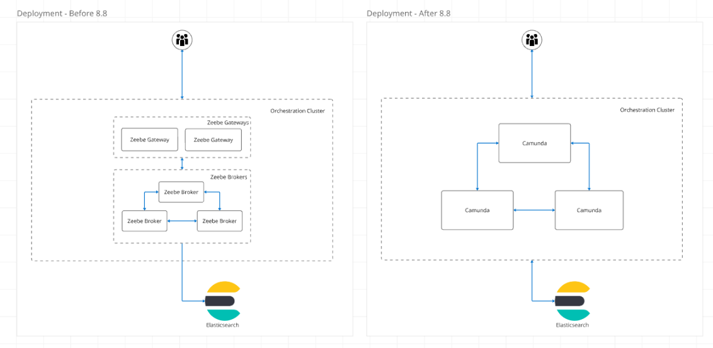
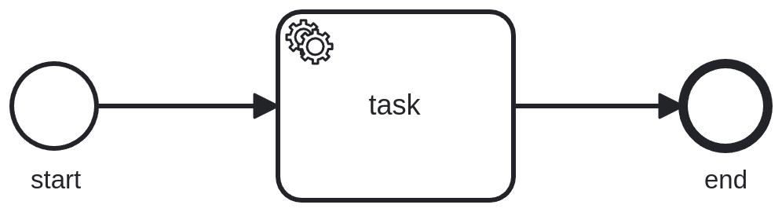
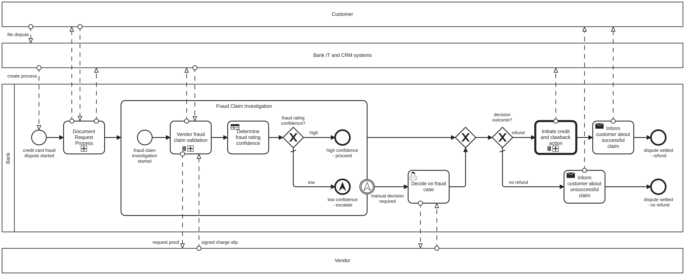
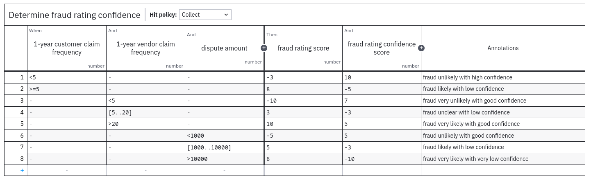
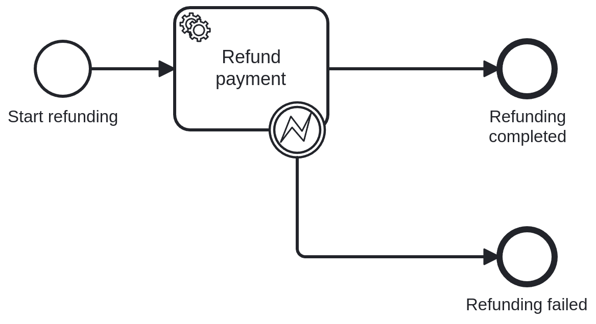
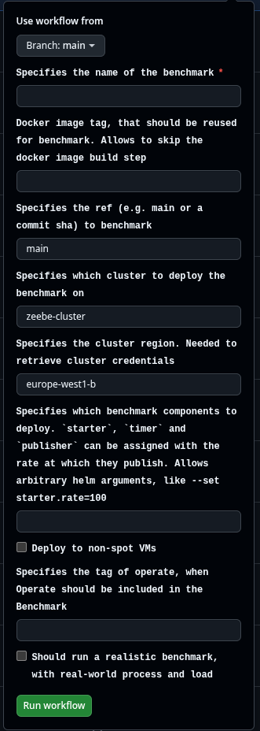
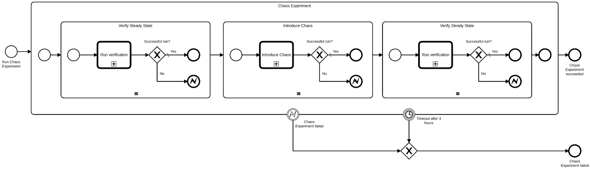
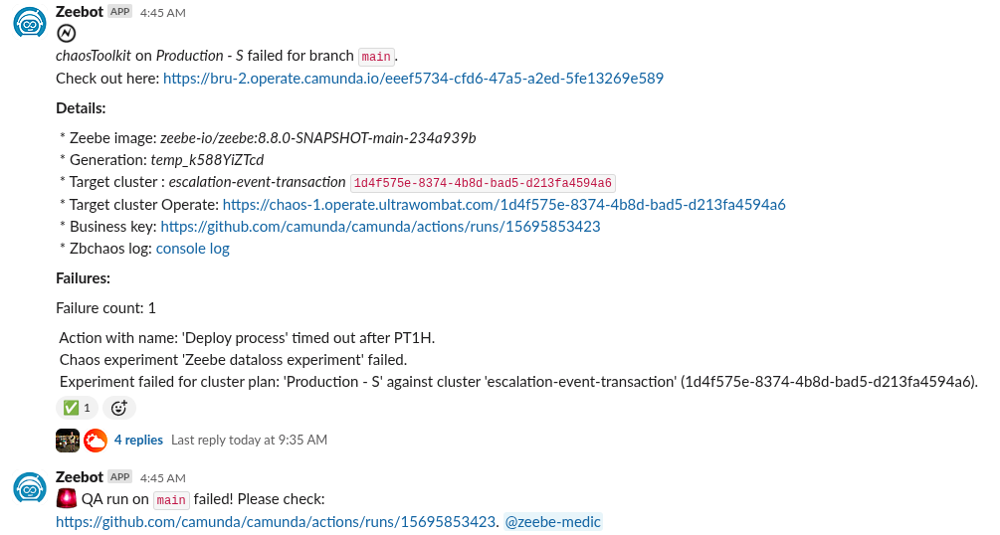
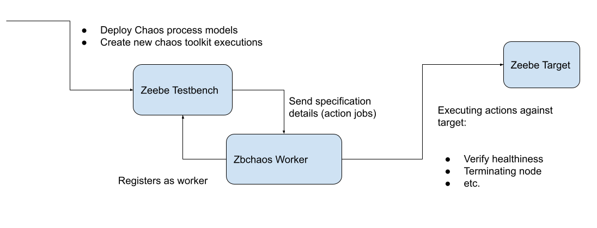
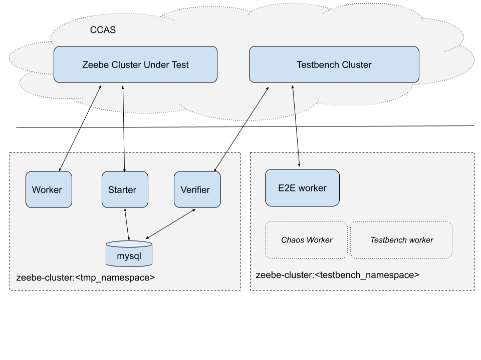

# Reliability testing

We define reliability testing as a type of software testing and practice that validates system performance and reliability. It can thus be done over time and with injection failure scenarios (injecting chaos).

The aim of such testing practices is to ensure that [2]

* Issues are identified before customers see them (proactively finding bugs)
* The system can run fault-free / reliably over a longer / specific period of time for its intended purpose and specific environment
  * to ensure that the system will be able to meet the needs of its users over the long term
* Failures are handled gracefully, validating reliability even after error cases
* Performance stays within its bounds, even over long periods of time.

The last points are especially interesting, as they allow for identifying issues that are with normal unit or integration tests not discoverable. For example, memory leaks or problems in distribution systems, etc.

Reliability testing consists of several sub-testing practices (depending on the context/area, company, this might vary).

While several resources ([1], [2]) cover feature or regression testing as one part of reliability testing, we see this as part of our automated acceptance testing done by Engineers and/or QA. See also related documentation about this here.

We focus as part of the reliability testing on topics like load testing (stress and endurance testing), and recovery testing (done by chaos experiments)

[1]: https://www.gremlin.com/blog/reliability-testing-definition-history-methods-and-examples
[2]: https://testsigma.com/guides/reliability-testing/
[3]: https://www.geeksforgeeks.org/software-testing-reliability-testing/

## Load testing

Load testing, or previously called "benchmarks" is a practice that was introduced [in early 2019](https://github.com/zeebe-io/zeebe-benchmark). As of today, we run load tests on a regular basis.

### General Goals

With our load test, we pursue the following goals

* Build up confidence in the system's reliability
* Discover failures when running over longer periods of time
  * Memory leaks
  * Performance degradation
  * Business logic errors
  * Distributed system failures
* Discover configuration/set up issues in different environments, SM/SaaS

### Setup



The setup for all of our load tests is equal for better comparability. We use a custom helm chart ([zeebe-benchmark](https://github.com/camunda/zeebe-benchmark-helm)) based on our official [Camunda Platform Helm chart](https://github.com/camunda/camunda-platform-helm).

We always ran load tests with a three-node cluster, configured with three partitions and a replication factor of three. Depending on the version of Camunda/Zeebe (pre 8.8), we might only deploy Zeebe Brokers and the Zeebe (standalone) gateway (with two replicas) or the single Camunda application (with an embedded gateway). To validate that our data flow pipeline is working, we are running an Elasticsearch cluster with three nodes for any Camunda test cluster.

On top of the [Camunda Platform Helm Chart](https://github.com/camunda/camunda-platform-helm), the benchmark Helm Chart deploys different applications. They can be distinguished into workers and starters. The related code can be found in the [Camunda mono repository](https://github.com/camunda/camunda/tree/main/load-tests/load-tester).

Depending on the test variant, different process models are created and executed by the Starter and Worker applications. They only differ in configurations, which can be done by the respective [zeebe-benchmark](https://github.com/camunda/zeebe-benchmark-helm) Helm chart, and their [values files](https://github.com/camunda/zeebe-benchmark-helm/blob/main/charts/zeebe-benchmark/values.yaml).

All of this is deployed in a Zeebe-maintained (as of now; 16 Jun 2025) Google Kubernetes Engine (GKE) cluster (zeebe-cluster), in its own zeebe-io Google Cloud Project (GCP). Details of the general infrastructure, which is deployed related to observability (Prometheus), can be found in the [Zeebe infrastructure repository](https://github.com/camunda/zeebe-infra).

### Variants

We run our load tests in different variants to cover different goals.

#### Normal (artificial) load

A load test where we run some artificial load, ensuring that the system behaves reliably.


It contains only a start event, one service task, and an end event. Covering a straight-through processing use case, with a [bigger data set of ~45 kb](https://github.com/camunda/camunda/blob/main/load-tests/load-tester/src/main/resources/bpmn/big_payload.json).

Reducing the used feature set to a small amount allows easy comparison between tests, as fewer variations and outside factors can influence test results. This test load is historical, as it was one of the first we designed. Likely might be replaced by the more realistic load tests.

The idea here is not to overload or stress the system, but to run a more stable and continuous load, to validate the reliability of the system.

**The expected load is:**

* 150 process instances per second (PI/s) completed.
* 150 task instances per second (TI/s) completed

_Intrinsic SLO to always be able to satisfy such a load, and perform reliably._

#### Latency load

Similar to the normal load test, we ran the artificial (normal) process model to run some latency-related tests. To validate the latency, we reduce the load to one PI/s, to reduce the blast radius, and make sure we have clear values for the latency of process instance completion.

*As of now, there is no clear SLO/SLA defined for such.*

#### Realistic load

In the past year, we designed a new load test, where we ran a [more complex and more realistic process](https://github.com/camunda/camunda/blob/main/load-tests/load-tester/src/main/resources/bpmn/realistic/bankCustomerComplaintDisputeHandling.bpmn) and [data set](https://github.com/camunda/camunda/blob/main/zeebe/load-tests/project/src/main/resources/bpmn/realistic/realisticPayload.json).

As part of this test, we cover a wide variety of BPMN elements, like CallActivities, Multi-Instance, Sub-Processes, DMN, etc.





The test is based on [a blueprint we provide in our Marketplace](https://marketplace.camunda.com/en-US/apps/449510/credit-card-fraud-dispute-handling), which was enhanced in partnership with Pre-Sales/Consulting.

**The expected load is:**

* 50 process instances per second (PI/s) completed.
* 100 task instances per second (TI/s) completed
* **To note here:** We create one process instance per second, but due to the realistic payload, the multi-instance and call activity will create 50 sub-process instances, and further flow elements.

*Intrinsic SLO to always be able to satisfy such a load, and perform reliably.*

### Observability

Observability plays a vital role in running such kind of tests. Since the beginning of our load testing practices, the Zeebe team, spent significant efforts in adding metrics into the system and building Grafana dashboards to support them.

The metrics exported by our applications are stored in a self-hosted Prometheus instance and can be observed with a self-hosted [Grafana instance](https://grafana.dev.zeebe.io/?orgId=1). To log in, a GitHub account must be used, which must be part of the mono repository.

A general Grafana dashboard, covering all sorts of metrics, is the [Zeebe Dashboard](https://github.com/camunda/camunda/blob/main/monitor/grafana/zeebe.json). There are more tailored dashboards that exist in the corresponding monitoring folder.

With the help of such dashboards, we can observe the running load tests and validate certain criteria and assumptions.

More details about observability can also be read [here](../observability.md).

### Scenarios

We have different scenarios targeting different use cases and versions.

#### Release load tests

For every [supported/maintained](https://confluence.camunda.com/pages/viewpage.action?pageId=245400921&spaceKey=HAN&title=Standard%2Band%2BExtended%2BSupport%2BPeriods) version, we run a continuous load test with artificial load. They are created or updated [as part of the release process](https://github.com/camunda/zeebe-engineering-processes/blob/main/src/main/resources/release/setup_benchmark.bpmn). Triggering our ad-hoc [Zeebe Benchmark GitHub workflow](https://github.com/camunda/camunda/actions/workflows/zeebe-benchmark.yml).

**Goal:** Validating the reliability of our releases and detecting earlier issues, especially with alpha versions and updates.

**Validation:** The tailored [Zeebe Medic Dashboard](https://grafana.dev.zeebe.io/d/zeebe-medic-benchmark/zeebe-medic-benchmarks?orgId=1&refresh=1m), can be used to observe and validate the performance of the different load tests

As of today (16 Jun 2025), we have load tests running:

* For all the last minor versions, they are run until the version goes out of support (and are updated on every patch)
  * release-8-4-x
  * release-8-5-x
  * release-8-6-x
  * Release-8-7-x
* For the current alpha
  * release-8-8-0-alpha5
* One rolling release test, which is always updated
  * Release-rolling

#### Weekly load tests

In addition to our release tests, we ran weekly load tests in all variants based on the state of the **main** branch (from the [Camunda mono repository](https://github.com/camunda/camunda)) with our [Zeebe Medic GitHub Workflow.](https://github.com/camunda/camunda/actions/workflows/zeebe-medic-benchmarks.yml) The load tests are automatically created every Monday and run for 4 weeks. This means we have three variants per week times four weeks running at the same time (makes 12 weekly load tests running concurrently).

**Goal:** Validating the reliability of our current main, and detecting earlier issues, allowing us to detect newly introduced instabilities and potential memory leaks or performance degradation.

**Validation:** The tailored [Zeebe Medic Dashboard](https://grafana.dev.zeebe.io/d/zeebe-medic-benchmark/zeebe-medic-benchmarks?orgId=1&refresh=1m), can be used to observe and validate the performance of the different load tests

As of today (16 Jun 2025) we have the following tests running:

* medic-y-2025-cw-22-a60d64da-benchmark
* medic-y-2025-cw-22-a60d64da-benchmark-latency
* medic-y-2025-cw-22-a60d64da-benchmark-mixed
* medic-y-2025-cw-23-a799b041-benchmark
* medic-y-2025-cw-23-a799b041-benchmark-latency
* medic-y-2025-cw-23-a799b041-benchmark-mixed
* medic-y-2025-cw-24-0c3f2664-benchmark
* medic-y-2025-cw-24-0c3f2664-benchmark-latency
* medic-y-2025-cw-24-0c3f2664-benchmark-mixed
* medic-y-2025-cw-25-59a095c4-benchmark
* medic-y-2025-cw-25-59a095c4-benchmark-latency
* medic-y-2025-cw-25-59a095c4-benchmark-mixed

#### Ad-Hoc load tests

On top of the previous scenarios, we support running ad-hoc load tests. They can be either set up by labeling an existing a pull-request (PR) at the mono repository with **benchmark** label, using the [Zeebe Benchmark Workflow](https://github.com/camunda/camunda/actions/workflows/zeebe-benchmark.yml), or deploying the [zeebe-benchmark](https://github.com/camunda/zeebe-benchmark-helm) Helm Chart [manually](https://github.com/camunda/camunda/tree/main/zeebe/load-tests/setup).

**Goal:** The goal of these ad-hoc load tests is to have a quick way to validate certain changes (reducing the feedback loop). The intentions can be manifold, may it be stability/reliability, performance, or something else.

**Validation:** The more general [Zeebe Dashboard](https://grafana.dev.zeebe.io/d/zeebe-dashboard/zeebe?orgId=1), should be used to observe and validate the performance of the different load tests. If performance is the motivator of such a test, it might be helpful to use the [Camunda Performance](https://grafana.dev.zeebe.io/d/camunda-benchmarks/camunda-performance?orgId=1) Dashboard.

**Requirement:** Please make sure that load test namespaces are always prefixed with your initials, to allow us to identify who created the tests and reach out if necessary.

##### Labeling a PR

It is as easy as it sounds; we can label an existing PR with the [**benchmark**](https://github.com/camunda/camunda/labels/benchmark) label, which triggers a [GitHub Workflow](https://github.com/camunda/camunda/blob/main/.github/workflows/zeebe-pr-benchmark.yaml). The workflow will build a new Docker image, based on the PR branch, and deploy a new load test against this version.

This method allows no specific configuration or adjustment. If this is needed, triggering the [Zeebe Benchmark GitHub Workflow](https://github.com/camunda/camunda/actions/workflows/zeebe-benchmark.yml) is recommended.

##### Trigger Zeebe Benchmark GitHub Workflow

The [Zeebe Benchmark GitHub Workflow](https://github.com/camunda/camunda/actions/workflows/zeebe-benchmark.yml) is the easiest way to run a load test for a specific branch or main (default) with more customization.

Existing Docker images can be reused if needed, which is especially useful if we want to recreate tests (like for weekly load tests).

Arbitrary Helm arguments can be passed, making it easier to customize the load tests.



##### Creating manually

As a last resort, if more customization is needed, it is also possible to manually deploy a benchmark.

###### Requirements (local)

To set up a load test from your local machine you need to have several tools installed.

Follow these guide's to install each of them:

* gcloud https://cloud.google.com/sdk/install
* Kubectl https://kubernetes.io/de/docs/tasks/tools/install-kubectl/
* Helm 3.*  https://helm.sh/docs/intro/install/
* docker https://docs.docker.com/install/
* kubens/kubectx https://github.com/ahmetb/kubectx
* OPTIONAL go https://golang.org/doc/install

Some of the necessary steps you need to do are:

```sh
## Init gcloud
gcloud init
gcloud config set project zeebe-io
gcloud container clusters get-credentials zeebe-cluster --zone europe-west1-b --project zeebe-io

## to use google cloud docker registry
gcloud auth configure-docker

## install kubectl via gcloud cli
gcloud components install kubectl

## install helm
curl -fsSL -o get_helm.sh https://raw.githubusercontent.com/helm/helm/master/scripts/get-helm-3
chmod 700 get_helm.sh
./get_helm.sh

## add zeebe as helm repo
helm version
helm repo add zeebe https://helm.camunda.io
helm repo add stable https://charts.helm.sh/stable
helm repo update

## install kubens
curl -LO https://raw.githubusercontent.com/ahmetb/kubectx/master/kubens
install kubens /usr/local/bin/
```

###### Best Practices Windows

Running the load tests with Windows is possible, with the help of the [Windows Subsystem for Linux](https://docs.microsoft.com/en-us/windows/wsl/install-win10).
The setup changes slightly compared to the Linux setup.

These are the components to install on Windows:
* Docker

These are the components to install within the WSL:
* gcloud https://cloud.google.com/sdk/install?hl=de
* Kubectl https://kubernetes.io/de/docs/tasks/tools/install-kubectl/
* Helm 3.*  https://helm.sh/docs/intro/install/
* kubens/kubectx https://github.com/ahmetb/kubectx

When following the instructions above, execute all commands that deal with Docker in a Windows shell, and exeucte all other commands in the WSL shell.

###### Installing manually

The [zeebe-benchmark](https://github.com/camunda/zeebe-benchmark-helm) Helm chart repository contains a [detailed](https://github.com/camunda/zeebe-benchmark-helm/blob/main/charts/zeebe-benchmark/README.md) guide regarding this.

```shell
# Add the Zeebe benchmark chart to the local repository
helm repo add zeebe-benchmark https://camunda.github.io/zeebe-benchmark-helm/
# Install a new Helm Chart release to the current namespace
helm install RELEASE-NAME zeebe-benchmark/zeebe-benchmark
```

To apply configuration changes, either edit the existing [values](https://github.com/camunda/zeebe-benchmark-helm/blob/main/charts/zeebe-benchmark/values.yaml) file in the repository (and apply them via **\-f**) or set configurations via the **\--se**t flag. For more information, see also the [related Helm documentation](https://helm.sh/docs/chart_template_guide/values_files/).

##### SaaS Test

One use case to create load tests manually is to run load tests against an SaaS cluster.

As a precondition for such tests, you need to create a cluster in SaaS (the stage doesn’t matter, may it be **DEV**, **INT,** or **PROD**). Additionally, we need client credentials deployed with the SaaS load tests, such that the starters and workers can connect to the right cluster.

```shell
# Source the downloaded credentials first, before run the following install command
helm install ck-saas-load-test zeebe-benchmark/zeebe-benchmark \
  --set camunda-platform.enabled=false \
  --set saas.enabled=true \
  --set saas.credentials.clientId="$ZEEBE_CLIENT_ID" \
  --set saas.credentials.clientSecret="$ZEEBE_CLIENT_SECRET" \
  --set saas.credentials.zeebeAddress="$ZEEBE_ADDRESS" \
  --set saas.credentials.authServer="$ZEEBE_AUTHORIZATION_SERVER_URL"
```

## Chaos engineering

*Chaos Engineering is the discipline of experimenting on a system in order to build confidence in the system’s capability to withstand turbulent conditions in production.*
[*https://principlesofchaos.org/*](https://principlesofchaos.org/)

Chaos engineering and with this the experimenting part was introduced at Camunda in late 2019 with the first [ChaosToolkit](https://chaostoolkit.org/) experiment. At this time we had no Helm charts to deploy load tests or our Platform/Zeebe, everything was done by Kubernetes manifests.

[The first experiments](https://github.com/zeebe-io/zeebe-benchmark/commit/6ac98341e6b7dc020e773b26503f0e252995233f) used different shell/bash or Kubernetes commands to inject chaos. All of them were written in so-called [experiment definitions](https://chaostoolkit.org/reference/api/experiment/) (JSON files compatible with ChaosToolKit). This allowed us to automate them later on CI, with Jenkins and ChaosToolkit.

At some point, we started to eat more of our own dog food or drink our champagne, and started with an initiative called [Zeebe Cluster TestBench](https://github.com/camunda/zeebe-cluster-testbench). That allows us to automatically set up SaaS clusters and run tests against them.

To improve our automation (improve maintainability) and increase manual experimentation possibilities we created a new tool called **zbchaos**. The [code](https://github.com/camunda/zeebe-chaos/tree/main/go-chaos) is hosted in the **zeebe-chaos** repository, and details about the tool have been published as [a blog post](https://camunda.com/blog/2022/09/zbchaos-a-new-fault-injection-tool-for-zeebe/%20).

### General Goals

With our chaos experiments, we pursue the following goals

* Build up confidence in the system's reliability
  * Continuous validation of failure-tolerance
  * Continuous validation of failure handling
* Explorative and proactive, identifying new challenges with new features or environments

### Chaos days (manual chaos experiments)

At the beginning of 2020, a practice called Chaos Days was formed, and the [first blog post](https://camunda.github.io/zeebe-chaos/2020/06/04/first-chaos-day) was posted.

Chaos days are an event where we run manual chaos experiments, by defining a hypothesis and executing experiments to validate such. For such experiments, we use available tools like the [zeebe-benchmark](https://github.com/camunda/zeebe-benchmark-helm) Helm Chart to set up a general load test, and the [zbchaos](https://github.com/camunda/zeebe-chaos/tree/main/go-chaos) CLI to inject failures. At the end, we normally write a blog post about the experiment and results on our [zeebe chaos blog](https://camunda.github.io/zeebe-chaos/).

The zbchaos CLI and blog resources are hosted in the [Zeebe chaos](https://github.com/camunda/zeebe-chaos) repository.

### Chaos experiment automation

We have automated the execution of defined chaos experiments fully with Camunda 8 (SaaS) and BPMN.



The [defined chaos experiments](https://github.com/camunda/zeebe-chaos/blob/main/go-chaos/internal/chaos-experiments/camunda-cloud/manifest.yml) can be found in the  [Zeebe chaos](https://github.com/camunda/zeebe-chaos) repository. New experiments can be published in the repository and defined in the respective manifest file. If necessary, a specific minVersion or maxVersion can be set, to make sure we run experiments only for versions where such feature exist. As of today (17 Jun 2025) 16 experiments exist, which are executed against a [**Production \- S** Cluster plan](https://accounts.cloud.ultrawombat.com/consoleadmin/clusterplans/a5716fd8-66f6-4447-9964-5602abe5d864) (three Brokers, three partitions, lower resource assignment).

Every day, our defined chaos experiments are executed against all supported versions by the [Zeebe QA Testbench GitHub Workflow](https://github.com/camunda/camunda/actions/workflows/zeebe-qa-testbench.yaml) in the mono repository. Their result is posted as a message in the [#zeebe-ci](https://app.slack.com/client/T0PM0P1SA/C013MEVQ4M9) slack channel.



With the [Zeebe QA Testbench GitHub Workflow](https://github.com/camunda/camunda/actions/workflows/zeebe-qa-testbench.yaml) it is possible to run so-called “QA runs” ad-hoc for a specific branch. This can be used to validate certain changes, reducing the feedback loop.

The mentioned workflow will create a new instance on our [Camunda 8 Testbench cluster on PROD](https://console.cloud.camunda.io/org/9061128c-7381-4caa-abbe-e97057e0e1eb/cluster/eeef5734-cfd6-47a5-a2ed-5fe13269e589). This will orchestrate the creation of clusters and chaos experiments.



New target test clusters are created on INT (by Testbench) in a specific [Testbench Organization](https://console.cloud.ultrawombat.com/org/f1155314-5031-4a84-9e29-58f69f8ab242). The clusters exist until the tests are either successful or an investigation of failures is done.

As we can see in the above diagram, **zbchaos** can not only run as a CLI, but it is also an essential part of the chaos experiment orchestration, as it runs as a worker and executes the chaos injecting and validation steps.

If you want to know more about the details and interactions, we have some **useful resources**:

* [Tech talk: Testbench and running Chaos Experiments](https://camunda.zoom.us/rec/share/uhASC0hhe1kZd98Qcytt0gtHX3fPqaRP7OcJk9u2cYdsbxl-A2-4if86aDOs0CCC.BVl0niSPUMJ_RsuB)
* [Camunda Con 2020.2: Chaos Engineering Meets Zeebe](https://page.camunda.com/recording-chaos-engineering-meets-zeebe)
* [Blog post: Drinking Our Champagne: Chaos Experiments with Zeebe against Zeebe](https://camunda.com/blog/2023/08/automate-chaos-experiments/)
* [Camunda Con 2024: Drinking our own Champagne: Chaos Experiments with Zeebe against Zeebe](https://vimeo.com/947050323/ce692173b3)

## Mixin (E2E tests)

We combine the load tests and part of our chaos experiments with additional validation in so-called [Zeebe E2E tests](https://github.com/camunda/zeebe-e2e-test).



In our Zeebe E2E tests, we reuse the Camunda 8 Testbench cluster to orchestrate our E2E tests. Testbench takes care of creating a SaaS Cluster, the E2E test workers are making sure to create a continuous load on the test target cluster and validate the execution/completion of such process instances. Additionally, failures are injected into these target clusters to validate resilience.
