# Reliability testing

We define reliability testing as a type of software testing and practice that validates system performance and reliability. It can thus be done over time and with injection failure scenarios (injecting chaos).

The aim of such testing practices is to ensure that [2]

* Issues are identified before customers see them (proactively finding bugs)
* The system can run fault-free / reliably over a longer / specific period of time for its intended purpose and specific environment
  * to ensure that the system will be able to meet the needs of its users over the long term
* Failures are handled gracefully, validating reliability even after error cases
* Performance stays within its bounds, even over long periods of time.

The last points are especially interesting, as they allow for identifying issues that are with normal unit or integration tests not discoverable. For example, memory leaks or problems in distribution systems, etc.

Reliability testing consists of several sub-testing practices (depending on the context/area, company, this might vary).

While several resources ([1], [2]) cover feature or regression testing as one part of reliability testing, we see this as part of our automated acceptance testing done by Engineers and/or QA. See also related documentation about this [here](https://github.com/camunda/camunda/blob/main/docs/testing/acceptance.md).

We focus as part of the reliability testing on topics like load testing (stress and endurance testing), and recovery testing (done by chaos experiments)

[1]: https://www.gremlin.com/blog/reliability-testing-definition-history-methods-and-examples
[2]: https://testsigma.com/guides/reliability-testing/
[3]: https://www.geeksforgeeks.org/software-testing-reliability-testing/

## Load testing

Load testing, or previously called "benchmarks" is a practice that was introduced [in early 2019](https://github.com/zeebe-io/zeebe-benchmark). As of today, we run load tests on a regular basis.

### General Goals

With our load test, we pursue the following goals

* Build up confidence in the system's reliability
* Discover failures when running over longer periods of time
  * Memory leaks
  * Performance degradation
  * Business logic errors
  * Distributed system failures
* Discover configuration/set up issues in different environments, SM/SaaS

### Variations

There exist various variations of load tests in the wild to answer different questions. The approaches to achieve them are pretty similar and can be covered under the category of load tests, which is to answer the question “What is the load we can handle? And how does the system behave?”.

* Normal [Load test](https://en.wikipedia.org/wiki/Load_testing)
  * _Question: How does the system behave under normal workload?_
  * This is to understand, in general, how the system behaves, providing a base for comparison.
  * Resources:
    * [Wiki: Load testing](https://en.wikipedia.org/wiki/Load_testing)
    * [Geeks4Geeks: Load testing](https://www.geeksforgeeks.org/software-testing/software-testing-load-testing/)
* [Stress test](https://en.wikipedia.org/wiki/Stress_testing)
  * _Question: How does the system perform under stress? Can it handle high load, and what is the maximum?_
  * Here we put the system under high load up to maximum load. We want to find out what the limit is and where it starts to break.
  * These tests are commonly not long-running.
  * Resources:
    * [Wiki: Stress testing](https://en.wikipedia.org/wiki/Stress_testing)
    * [Geeks4Geeks: Load testing](https://www.geeksforgeeks.org/software-testing/software-testing-load-testing/)
* Spike test
  * _Question: How does the system handle spikes? Can it recover? What is max etc._
  * Here we put the system also under high load up to maximum load, but only for a short period of time. We want to understand how the system behaves and recovers afterwards.
  * These tests are commonly not long-running.
  * Resources:
    * [Geeks4Geeks: Load testing](https://www.geeksforgeeks.org/software-testing/software-testing-load-testing/)
* [Endurance or soak test](https://en.wikipedia.org/wiki/Soak_testing)
  * _Question: Can it handle high load (not maximum) over a long time? Reliable?_
  * Discovery of memory or thread leaks and performance and stability issues over time
  * Resources:
    * [Geeks4Geeks: Load testing](https://www.geeksforgeeks.org/software-testing/software-testing-load-testing/)
    * [Geeks4Geeks:  Endurance testing](https://www.geeksforgeeks.org/software-testing/software-testing-endurance-testing/)

Our load tests can also be viewed as **endurance or soak tests**, as they typically share the same goals.

### Setup

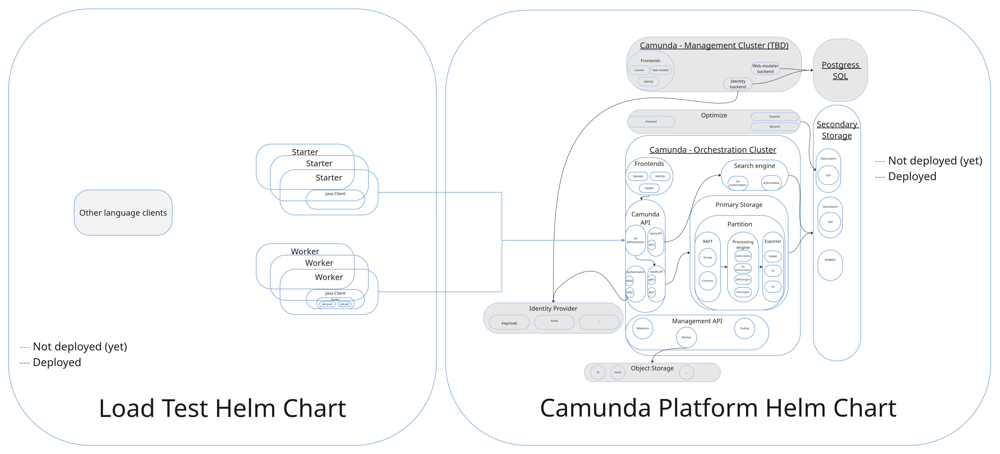

The setup for all of our load tests is equal for better comparability, and consist of two main ingredients.

1. The official [Camunda Platform Helm Chart](https://github.com/camunda/camunda-platform-helm), taking care of the general set up of our Camunda 8 Platform.
2. A custom Helm chart ([camunda-load-tests](https://github.com/camunda/camunda-load-tests-helm)) to set up our load test applications.

By default, the full Camunda Platform is deployed, including Orchestation Cluster (OC), Optimize (with history cleanup), Connectors (with OIDC authentication), and Identity with Keycloak as identity provider. This ensures load tests validate the system in a production-like configuration. Optimize can be disabled via the `enable-optimize` workflow input or the `newLoadTest.sh` script parameter. We always ran load tests with a three-node OC cluster, configured with three partitions and a replication factor of three. Depending on the version of Camunda/Zeebe, we might only deploy Zeebe Brokers and the Zeebe (standalone) gateway (with two replicas) only (pre 8.8).

An Elasticsearch cluster with three nodes is deployed as well, which is used to validate the performance of the exporters. Exporting and archiving throughput must be able to sustain the load of the cluster.

Our [load test Helm Chart](https://github.com/camunda/camunda-load-tests-helm) deploys different load test applications. They can be distinguished into workers and starters. The related code can be found in the [Camunda mono repository](https://github.com/camunda/camunda/tree/main/load-tests/load-tester).

Depending on the test variant, different process models are created and executed by the Starter and Worker applications. They only differ in configurations, which can be done by the respective [camunda-load-test](https://github.com/camunda/camunda-load-tests-helm) Helm chart, and their [values files](https://github.com/camunda/camunda-load-tests-helm/blob/main/charts/camunda-load-tests/values.yaml).

All of this is deployed in an Infra-team-maintained Google Kubernetes Engine (GKE) cluster (`camunda-benchmark-prod`). Access is managed via [Teleport](https://camunda.teleport.sh). Container images are stored in `registry.camunda.cloud/team-zeebe`. Details about the benchmark cluster infrastructure can be found in the [infra-core repository](https://github.com/camunda/infra-core/), and specifically in the [benchmark cluster access guide](https://github.com/camunda/infra-core/blob/stage/docs/kubernetes-cluster/benchmark-cluster-access.md).

For posterity, the deployment between 8.8 and pre-8.8 differs slightly. The Platform Helm  Chart will now deploy a single Camunda application (replicated), whereas previously, the Zeebe Brokers and Zeebe Gateways were deployed standalone.

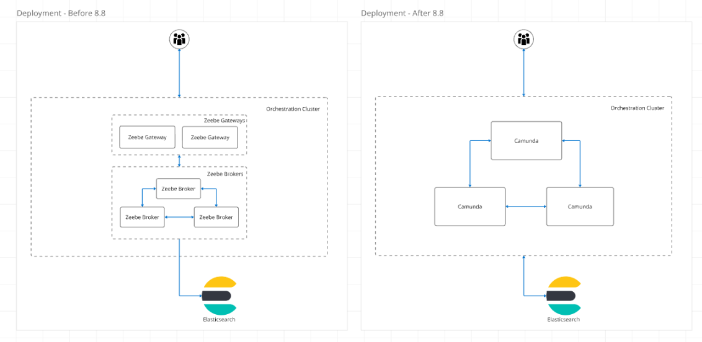

#### Secondary Storage Options

Load tests can be configured with different secondary storage backends to validate Camunda's performance and reliability across various deployment scenarios:

* **Elasticsearch** (default): Deploys a three-node Elasticsearch cluster. This is the standard configuration used to validate exporter performance and archiving throughput.
* **OpenSearch**: Deploys an OpenSearch cluster as an alternative to Elasticsearch.
* **PostgreSQL**: Deploys a PostgreSQL database for RDBMS-based secondary storage testing.
* **MySQL**: Deploys a MySQL database for RDBMS-based secondary storage testing.
* **MariaDB**: Deploys a MariaDB database for RDBMS-based secondary storage testing.
* **MSSQL**: Deploys an MSSQL database for RDBMS-based secondary storage testing.
* **Oracle**: Deploys an Oracle database for RDBMS-based secondary storage testing.
* **None**: Runs load tests without any secondary storage. This is useful for testing the core orchestration engine performance in isolation, without the overhead of exporting data to a secondary database. In this mode, Camunda exporters are disabled.

The secondary storage type can be specified when creating a load test via the `newLoadTest.sh` script or the GitHub workflow inputs.

### Endurance test variants

We conduct our endurance tests in various variants and with different workloads to cover a broader scope, with the primary goal of identifying instabilities such as memory or thread leaks, as well as performance and stability issues over time.

#### Typical load

After discussing with different stakeholders, we defined a so-called "typical" load. Using a typical or commonly used process model, which is often also called the straight-through process model, and [data set](../../load-tests/load-tester/src/main/resources/bpmn/typical_payload.json) that is typical as well (~0.5KB). We defined a load that we want to be able to sustain reliably.

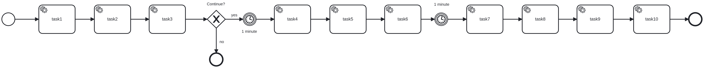

The straight-trough process contains ten tasks, two timers, and one exclusive gateway. Covering a typical use case, where a process instance is started, undergoes several automated tasks, waits for a specified period (using timers), and then concludes.

**The expected load is:**

* 50 process instances per second (PI/s) completed.
* 500 task instances per second (TI/s) completed

_Intrinsic SLO to always be able to satisfy such a load, and perform reliably._

#### Realistic load

In the past year (2024), we designed a new load test, where we ran a [more complex and more realistic process](https://github.com/camunda/camunda/blob/main/load-tests/load-tester/src/main/resources/bpmn/realistic/bankCustomerComplaintDisputeHandling.bpmn) and [data set](https://github.com/camunda/camunda/blob/main/zeebe/load-tests/project/src/main/resources/bpmn/realistic/realisticPayload.json).

As part of this test, we cover a wide variety of BPMN elements, including Call Activities, Multi-Instance, Sub-Processes, and DMN.

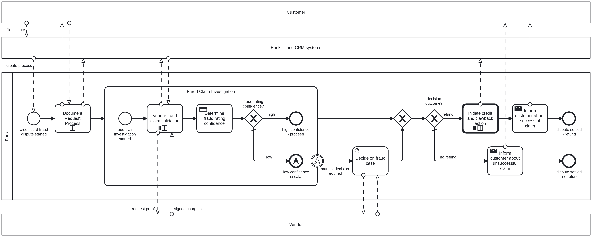
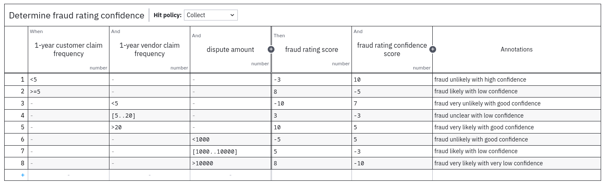
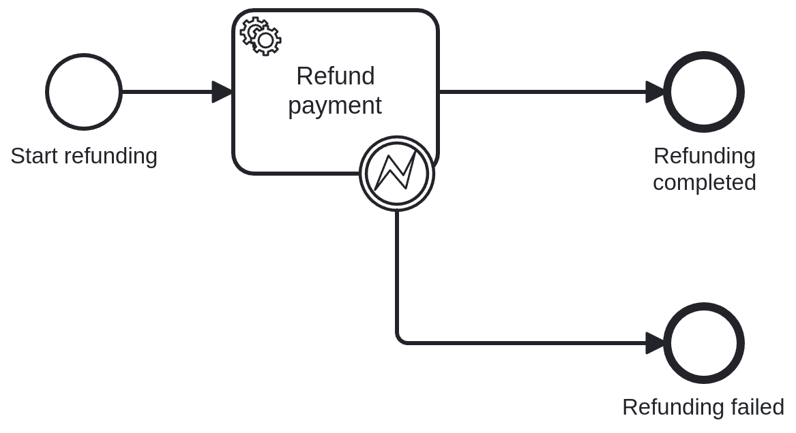

The test is based on [a blueprint we provide in our Marketplace](https://marketplace.camunda.com/en-US/apps/449510/credit-card-fraud-dispute-handling), which was enhanced in partnership with Pre-Sales/Consulting.

**The expected load is:**

* 50 process instances per second (PI/s) completed.
* 100 task instances per second (TI/s) completed
* **To note here:** We create one process instance per second, but due to the realistic payload, the multi-instance and call activity will create 50 sub-process instances, and further flow elements.

*Intrinsic SLO to always be able to satisfy such a load, and perform reliably.*

### Max / Stress load test

A load test where we run some artificial load, ensuring that the system behaves reliably under stress (max-load).

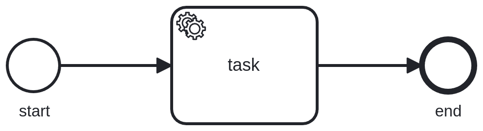

It contains only a start event, one service task, and an end event. Covering a straight-through processing use case and using the same payload as for our typical load test (~0.5KB).

This type of process is helpful for stress tests, as it gives us a good sense of the maximum load.
This is one of the smallest processes (including a service task) that we can model.

Reducing the used feature set to a small amount allows easy comparison between tests, as fewer variations and outside factors can influence test results. Still, this is not very realistic and useful for our long-running tests.

**The expected load is:**

* 300 process instances per second (PI/s) completed.
* 300 task instances per second (TI/s) completed

_Intrinsic SLO to always be able to satisfy such a load, and perform reliably._

### Latency load test

Similar to the stress test from above, we ran the artificial (normal) process model to run some latency-related tests. To validate the latency, we reduce the load to **one** PI/s, to reduce the blast radius, and make sure we have clear values for the latency of process instance completion.

*As of now, there is no clear SLO/SLA defined for such.*

### Observability

Observability plays a vital role in running such kind of tests. Since the beginning of our load testing practices, the Zeebe team, spent significant efforts in adding metrics into the system and building Grafana dashboards to support them.

The metrics exported by our applications are stored in a [Prometheus instance](https://monitor.benchmark.camunda.cloud/) and can be observed with the [Grafana instance](https://dashboard.benchmark.camunda.cloud/?orgId=1). These applications sit behind a vouch-enabled proxy, so only Okta login is required to access them.

A general Grafana dashboard, covering all sorts of metrics, is the [Zeebe Dashboard](https://github.com/camunda/camunda/blob/main/monitor/grafana/zeebe.json). There are more tailored dashboards that exist in the corresponding monitoring folder.

With the help of such dashboards, we can observe the running load tests and validate certain criteria and assumptions.

More details about observability can also be read [here](../observability.md).

### Test Scenarios

We run load tests in several scenarios: release, weekly, daily, and ad-hoc. For how to trigger or configure each, see [test scenarios in the load-tests README](../../load-tests/README.md#test-scenarios).

## Chaos engineering

*Chaos Engineering is the discipline of experimenting on a system in order to build confidence in the system’s capability to withstand turbulent conditions in production.*
[*https://principlesofchaos.org/*](https://principlesofchaos.org/)

Chaos engineering and with this the experimenting part was introduced at Camunda in late 2019 with the first [ChaosToolkit](https://chaostoolkit.org/) experiment. At this time we had no Helm charts to deploy load tests or our Platform/Zeebe, everything was done by Kubernetes manifests.

[The first experiments](https://github.com/zeebe-io/zeebe-benchmark/commit/6ac98341e6b7dc020e773b26503f0e252995233f) used different shell/bash or Kubernetes commands to inject chaos. All of them were written in so-called [experiment definitions](https://chaostoolkit.org/reference/api/experiment/) (JSON files compatible with ChaosToolKit). This allowed us to automate them later on CI, with Jenkins and ChaosToolkit.

At some point, we started to eat more of our own dog food or drink our champagne, and started with an initiative called [Zeebe Cluster TestBench](https://github.com/camunda/zeebe-cluster-testbench). That allows us to automatically set up SaaS clusters and run tests against them.

To improve our automation (improve maintainability) and increase manual experimentation possibilities we created a new tool called **zbchaos**. The [code](https://github.com/camunda/zeebe-chaos/tree/main/go-chaos) is hosted in the **zeebe-chaos** repository, and details about the tool have been published as [a blog post](https://camunda.com/blog/2022/09/zbchaos-a-new-fault-injection-tool-for-zeebe/%20).

### General Goals

With our chaos experiments, we pursue the following goals

* Build up confidence in the system's reliability
  * Continuous validation of failure-tolerance
  * Continuous validation of failure handling
* Explorative and proactive, identifying new challenges with new features or environments

### Chaos days (manual chaos experiments)

At the beginning of 2020, a practice called Chaos Days was formed, and the [first blog post](https://camunda.github.io/zeebe-chaos/2020/06/04/first-chaos-day) was posted.

Chaos days are an event where we run manual chaos experiments, by defining a hypothesis and executing experiments to validate such. For such experiments, we use available tools like the [camunda-load-tests](https://github.com/camunda/camunda-load-tests-helm) Helm Chart to set up a general load test, and the [zbchaos](https://github.com/camunda/zeebe-chaos/tree/main/go-chaos) CLI to inject failures. At the end, we normally write a blog post about the experiment and results on our [zeebe chaos blog](https://camunda.github.io/zeebe-chaos/).

The zbchaos CLI and blog resources are hosted in the [Zeebe chaos](https://github.com/camunda/zeebe-chaos) repository.

### Chaos experiment automation

We have automated the execution of defined chaos experiments fully with Camunda 8 (SaaS) and BPMN.

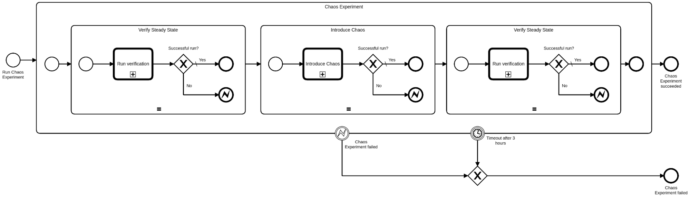

The [defined chaos experiments](https://github.com/camunda/zeebe-chaos/blob/main/go-chaos/internal/chaos-experiments/camunda-cloud/manifest.yml) can be found in the  [Zeebe chaos](https://github.com/camunda/zeebe-chaos) repository. New experiments can be published in the repository and defined in the respective manifest file. If necessary, a specific minVersion or maxVersion can be set, to make sure we run experiments only for versions where such feature exist. As of today (17 Jun 2025) 16 experiments exist, which are executed against a [**Production \- S** Cluster plan](https://accounts.cloud.ultrawombat.com/consoleadmin/clusterplans/a5716fd8-66f6-4447-9964-5602abe5d864) (three Brokers, three partitions, lower resource assignment).

Every day, our defined chaos experiments are executed against all supported versions by the [Zeebe QA Testbench GitHub Workflow](https://github.com/camunda/camunda/actions/workflows/zeebe-qa-testbench.yaml) in the mono repository. Their result is posted as a message in the [#zeebe-ci](https://app.slack.com/client/T0PM0P1SA/C013MEVQ4M9) slack channel.

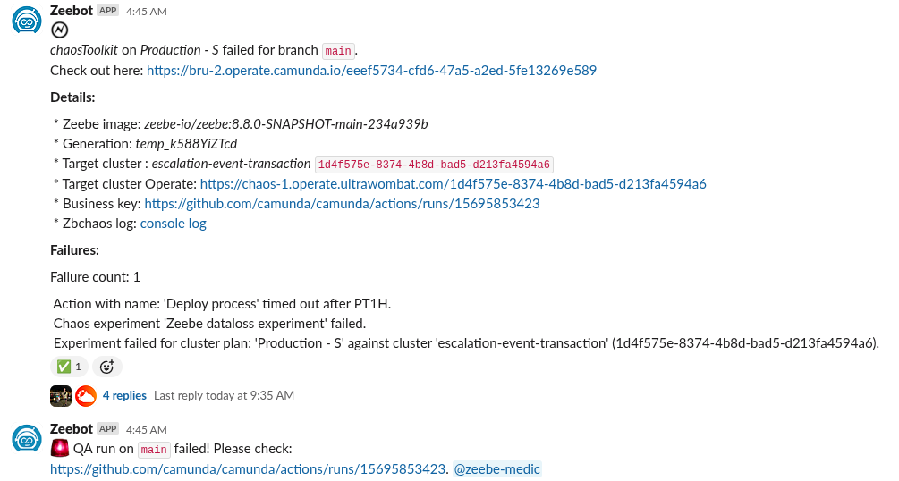

With the [Zeebe QA Testbench GitHub Workflow](https://github.com/camunda/camunda/actions/workflows/zeebe-qa-testbench.yaml) it is possible to run so-called “QA runs” ad-hoc for a specific branch. This can be used to validate certain changes, reducing the feedback loop.

The mentioned workflow will create a new instance on our [Camunda 8 Testbench cluster on PROD](https://console.cloud.camunda.io/org/9061128c-7381-4caa-abbe-e97057e0e1eb/cluster/eeef5734-cfd6-47a5-a2ed-5fe13269e589). This will orchestrate the creation of clusters and chaos experiments.

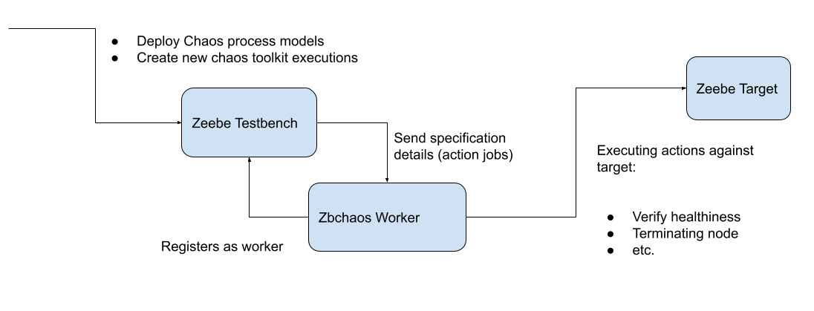

New target test clusters are created on INT (by Testbench) in a specific [Testbench Organization](https://console.cloud.ultrawombat.com/org/f1155314-5031-4a84-9e29-58f69f8ab242). The clusters exist until the tests are either successful or an investigation of failures is done.

As we can see in the above diagram, **zbchaos** can not only run as a CLI, but it is also an essential part of the chaos experiment orchestration, as it runs as a worker and executes the chaos injecting and validation steps.

If you want to know more about the details and interactions, we have some **useful resources**:

* [Tech talk: Testbench and running Chaos Experiments](https://camunda.zoom.us/rec/share/uhASC0hhe1kZd98Qcytt0gtHX3fPqaRP7OcJk9u2cYdsbxl-A2-4if86aDOs0CCC.BVl0niSPUMJ_RsuB)
* [Camunda Con 2020.2: Chaos Engineering Meets Zeebe](https://page.camunda.com/recording-chaos-engineering-meets-zeebe)
* [Blog post: Drinking Our Champagne: Chaos Experiments with Zeebe against Zeebe](https://camunda.com/blog/2023/08/automate-chaos-experiments/)
* [Camunda Con 2024: Drinking our own Champagne: Chaos Experiments with Zeebe against Zeebe](https://vimeo.com/947050323/ce692173b3)

## Mixin (E2E tests)

We combine the load tests and part of our chaos experiments with additional validation in so-called [Zeebe E2E tests](https://github.com/camunda/zeebe-e2e-test).

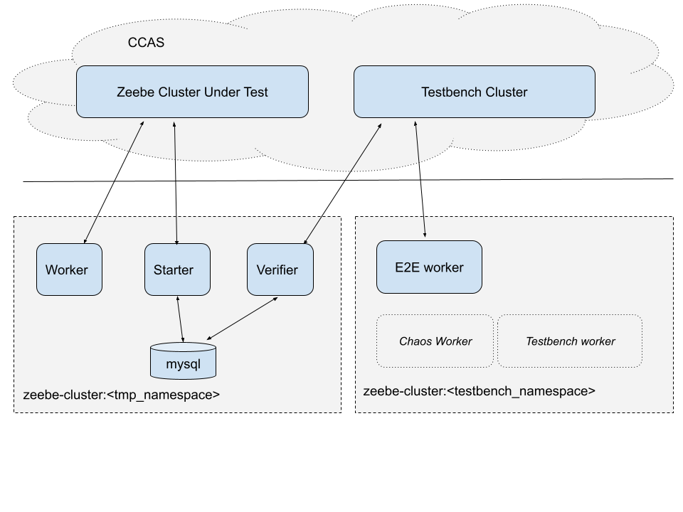

In our Zeebe E2E tests, we reuse the Camunda 8 Testbench cluster to orchestrate our E2E tests. Testbench takes care of creating a SaaS Cluster, the E2E test workers are making sure to create a continuous load on the test target cluster and validate the execution/completion of such process instances. Additionally, failures are injected into these target clusters to validate resilience.
