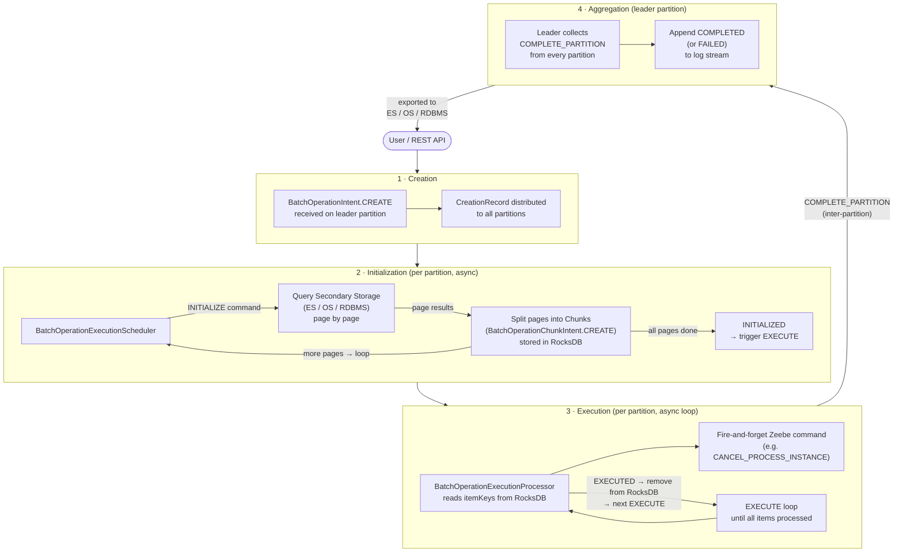

# Batch Operations – High-Level Data Flow

A simplified overview of how a batch operation flows from creation to completion.

> **Detailed view** → [`batch-operation-dataflow.md`](batch-operation-dataflow.md)

