# Batch Operations – Detailed Data Flow

This diagram covers the full data flow for batch operations: initialization (querying secondary
storage, creating chunks), execution (processing items from RocksDB), and how results are
aggregated across partitions.

```mermaid
flowchart TB
    USER(["User / REST API"])
    LEADER_PART["Leader Partition\n(StreamProcessor)"]
    FOLLOWER_PART["Follower Partition(s)\n(StreamProcessor)"]
    ROCKSDB_L[("RocksDB\n(Leader)")]
    ROCKSDB_F[("RocksDB\n(Follower)")]
    SECONDARY[(Secondary Storage\nES / OS / RDBMS)]
    EXPORTER["CamundaExporter"]

    USER -->|"BatchOperationIntent.CREATE\n(filter, type, plan)"| LEADER_PART
    LEADER_PART -->|"BatchOperationIntent.CREATED\nevent"| LEADER_PART
    LEADER_PART -->|"distribute CreationRecord\nto all partitions"| FOLLOWER_PART
    LEADER_PART -->|store batch-op state + filter| ROCKSDB_L
    FOLLOWER_PART -->|store batch-op state + filter| ROCKSDB_F

    subgraph INIT_LEADER ["Initialization (Leader Partition)"]
        direction TB
        SCHED_L["BatchOperationExecutionScheduler\n(Actor – decoupled from StreamProcessor)"]
        PAGE_PROC_L["Page Processor\n(deserialize filter, enrich with partitionId)"]
        CHUNK_SPLIT_L["Chunk Splitter\n(split page into ≤4 MB chunks)"]

        SCHED_L -->|"BatchOperationIntent.INITIALIZE"| PAGE_PROC_L
        PAGE_PROC_L -->|"BatchOperationIntent.INITIALIZING event\n(stores cursor in RocksDB)"| PAGE_PROC_L
        PAGE_PROC_L -->|query page of items| SECONDARY
        SECONDARY -->|page result + search cursor| PAGE_PROC_L
        PAGE_PROC_L --> CHUNK_SPLIT_L
        CHUNK_SPLIT_L -->|"BatchOperationChunkIntent.CREATE\n(chunk of itemKeys)"| ROCKSDB_L
        CHUNK_SPLIT_L -->|"more pages? → next\nBatchOperationIntent.INITIALIZE\n(with cursor)"| SCHED_L
        CHUNK_SPLIT_L -->|"last page →\nBatchOperationIntent.FINISH_INITIALIZATION"| SCHED_L
        SCHED_L -->|"BatchOperationIntent.INITIALIZED event"| SCHED_L
        SCHED_L -->|"BatchOperationExecutionIntent.EXECUTE"| SCHED_L
    end

    subgraph INIT_FOLLOWER ["Initialization (each Follower Partition) — same flow"]
        direction TB
        SCHED_F["BatchOperationExecutionScheduler"]
        PAGE_PROC_F["Page Processor"]
        CHUNK_SPLIT_F["Chunk Splitter"]

        SCHED_F -->|INITIALIZE| PAGE_PROC_F
        PAGE_PROC_F -->|query with partitionId filter| SECONDARY
        SECONDARY -->|page result| PAGE_PROC_F
        PAGE_PROC_F --> CHUNK_SPLIT_F
        CHUNK_SPLIT_F -->|"ChunkIntent.CREATE\n(chunks stored)"| ROCKSDB_F
        CHUNK_SPLIT_F -.->|more pages| SCHED_F
        CHUNK_SPLIT_F -->|"FINISH_INITIALIZATION\n→ INITIALIZED\n→ EXECUTE"| SCHED_F
    end

    LEADER_PART --> INIT_LEADER
    FOLLOWER_PART --> INIT_FOLLOWER

    subgraph EXEC_LEADER ["Execution Loop (Leader Partition)"]
        direction TB
        EXEC_PROC_L["BatchOperationExecutionProcessor"]
        EXECUTOR_L["BatchOperationExecutor\n(e.g. CancelProcessInstanceExecutor)"]
        ZEEBE_CMD_L["Regular Zeebe Command\n(e.g. ProcessInstanceIntent.CANCEL)"]

        EXEC_PROC_L -->|read next chunk of itemKeys| ROCKSDB_L
        ROCKSDB_L -->|itemKeys| EXEC_PROC_L
        EXEC_PROC_L --> EXECUTOR_L
        EXECUTOR_L -->|"fire-and-forget\nappend command"| ZEEBE_CMD_L
        EXEC_PROC_L -->|"EXECUTING event\n→ EXECUTED event\n(removes itemKeys from RocksDB)"| ROCKSDB_L
        EXEC_PROC_L -->|"next BatchOperationExecutionIntent.EXECUTE\n(loop until all items done)"| EXEC_PROC_L
        EXEC_PROC_L -->|"all items done →\nBatchOperationIntent.COMPLETE_PARTITION\n(distributed to leader)"| LEADER_PART
    end

    subgraph EXEC_FOLLOWER ["Execution Loop (each Follower Partition) — same flow"]
        direction TB
        EXEC_PROC_F["BatchOperationExecutionProcessor"]
        EXECUTOR_F["BatchOperationExecutor"]
        EXEC_PROC_F -->|read itemKeys| ROCKSDB_F
        ROCKSDB_F -->|itemKeys| EXEC_PROC_F
        EXEC_PROC_F --> EXECUTOR_F
        EXECUTOR_F -->|"fire-and-forget Zeebe command"| EXEC_PROC_F
        EXEC_PROC_F -->|"EXECUTING → EXECUTED\n(itemKeys removed)"| ROCKSDB_F
        EXEC_PROC_F -->|"all done →\nCOMPLETE_PARTITION\n(inter-partition → leader)"| LEADER_PART
    end

    INIT_LEADER --> EXEC_LEADER
    INIT_FOLLOWER --> EXEC_FOLLOWER

    subgraph AGGREGATION ["Result Aggregation (Leader Partition)"]
        direction TB
        AGG["Leader collects\nPARTITION_COMPLETED / PARTITION_FAILED\nfrom all partitions"]
        FINAL["Append BatchOperationIntent.COMPLETED\n(or FAILED if all partitions failed)"]
        AGG --> FINAL
    end

    EXEC_LEADER --> AGGREGATION
    EXEC_FOLLOWER -->|COMPLETE_PARTITION| AGGREGATION

    AGGREGATION --> EXPORTER
    EXEC_LEADER --> EXPORTER
    EXEC_FOLLOWER --> EXPORTER

    subgraph ERROR_HANDLING ["Scheduler Error Handling"]
        direction LR
        RETRY["Retryable errors\n(QUERY_FAILED, UNKNOWN)\n→ exponential backoff retry"]
        FAIL_NOW["Non-retryable errors\n(RESULT_BUFFER_SIZE_EXCEEDED,\nNOT_FOUND, FORBIDDEN, …)\n→ immediate FAIL_PARTITION"]
    end

    INIT_LEADER -.->|on error| ERROR_HANDLING
    INIT_FOLLOWER -.->|on error| ERROR_HANDLING
    ERROR_HANDLING -.->|"FAIL_PARTITION\n(inter-partition → leader)"| AGGREGATION
```

## Key Data Structures

| Record | Purpose |
|---|---|
| `BatchOperationCreationRecord` | Carries filter, type and plan; distributed to all partitions |
| `BatchOperationInitializationRecord` | Carries `searchResultCursor` for paged queries |
| `BatchOperationChunkRecord` | One chunk of `itemKeys` (≤ 4 MB); stored in RocksDB column family `BATCH_OPERATION_CHUNKS` |
| `BatchOperationExecutionRecord` | Tracks items being executed or already executed |
| `BatchOperationLifecycleManagementRecord` | Lifecycle commands/events (SUSPEND, RESUME, CANCEL, COMPLETED, FAILED) |
| `BatchOperationPartitionLifecycleRecord` | Inter-partition message carrying `sourcePartitionId` (COMPLETE_PARTITION / FAIL_PARTITION) |

## RocksDB Column Families

| Column Family | Content |
|---|---|
| `BATCH_OPERATION` | Batch operation state, filter, type, execution plan (no itemKeys) |
| `BATCH_OPERATION_CHUNKS` | Chunks of itemKeys per batch operation per partition |
| `PENDING_BATCH_OPERATIONS` | Newly created batch operations not yet picked up by the scheduler |

