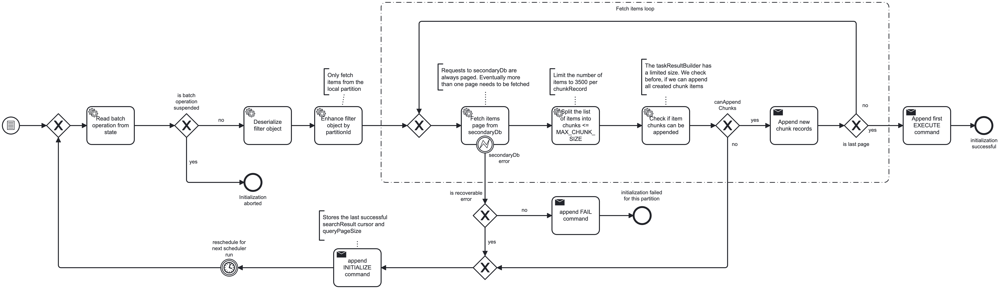

# Zeebe Batch Operations Module

## Introduction and Goals

The Zeebe batch operations module is designed to provide a robust and efficient way to handle batch
operations within the Zeebe core engine. It aims to replace the existing batch operation engine
within the Operate webapp.

### Key Features & Benefits:

* **Scalability:** The module is designed to handle large volumes of data efficiently, making it
  suitable for high-throughput applications. It should scale horizontally with the number of
  partitions of the Zeebe cluster.
* **Performance:** The module is optimized for low latency and high throughput, ensuring that batch
  operations do not negatively impact the performance of live running process instances.
* **Monitoring:** The module provides comprehensive monitoring capabilities, allowing users to track
  the status and progress of batch operations in real-time.

### Quality Goals

* Running batch operations should never impact the overall performance of the Zeebe core engine and
  the latency and throughput of live running process instances.
  * Even when the whole system is at high load, the backpressure rate should be as low as possible.
* The batch operations module should be able to handle large volumes of data efficiently. The number
  of processed batch operation items should not be limited by internal technical constraints.

## Business documentation

### Requirements

* The batch operation should be able to be started, managed and observed by both the camunda-client
  and the Cluster Orchestration API
* The following batch operation types are supported:
  * `CANCEL_PROCESS_INSTANCE`: Cancel a number of process instances
  * `MODIFY_PROCESS_INSTANCE`: Modify the active elements of a number of process instances
  * `MIGRATE_PROCESS_INSTANCE`: Migrate process instances to a new version of the process definition
  * `RESOLVE_INCIDENT`: Resolve incidents of a number of process instances
* The end user can define the relevant process instances by providing a query, usually a
  ProcessInstanceFilter
* The user can suspend, resume and cancel a running batch operation
* When a batch operation starts, the number and amount of process instances to be processed
  is known and can be observed by the user
* The user can observe the overall progress of a running batch operation
* The user can observe the progress of each individual batch operation item
* In case of errors, the user can see the error message and the number of failed items

## Technical documentation

### Technical Context

|          Entity           |                                           Description                                            |
|---------------------------|--------------------------------------------------------------------------------------------------|
| User                      | The user which uses Camunda.                                                                     |
| Camunda                   | The whole camunda platform, including broker, webapps, ...                                       |
| Camunda Client            | The Java Camunda client API.                                                                     |
| Operate UI                | The  Operate UI as general administration UI, the end user usually starts batch operations from. |
| Cluster Orchestration API | REST Entry Point to the Camunda platform.                                                        |
| Zeebe Engine              | The Camunda Zeebe engine which executes the batch operation.                                     |

### Sequence flow of a batch operation

A batch operation is always started by the Cluster Orchestration API and the underlying broker gateway. The
initial command to start a batch operation is routed to a single partition by the broker but then
also forwarded to all other partitions.

Each batch operation has a **leader partition** and a number of **follower partitions**. In contrast
to process deployments (where it is always partition 1), this leader partition is not fixed but
simply the partition, the `CreateBatchOperationCommand` was first processed. The partitions that
command is distributed to, are considered follower partitions. Aside from executing the batch
operation items, the leader partitions is responsible for coordinating the batch operation (suspend,
resume, cancel) and observing the overall progress, collect errors and append the final COMPLETED
record. The follower partitions are responsible for executing the batch operation items.

Each batch operation is divided into two steps:

#### Step 1: Initialization

When a batch operation is requested by the end user with `BatchOperationIntent.CREATE`, the request
is sent by the gateway to only one random partition (now called the **leader partition**) and
contains only a filter object and a description of what operation to execute on the filtered items.
First, this command record is distributed to all other partitions, so that each partition of the
cluster will become part of the batch operation. On each partition the batch operation, including
the serialized filter object, will now be stored in the local rocksDb.

The next step is an asynchronous step. To not block the `StreamProcessor`,
the `BatchOperationExecutionScheduler` component is an own _Actor_ and is running decoupled from
the `StreamProcessors`. It is responsible for initialing the batch operation:

1. Deserialize the filter object. This filter object depends on the selected batch operation type.
2. Enhance the filter object with the local `partitionId`. Each partition should only process its
   own items. Therefore the local filter needs to be enhanced with the
   `partitionId` of the partition.
3. Query the secondary database with the enhanced filter.
   * Because ElasticSearch always limits a search result to 10000 items, the secondary database is
     queried in pages. So each response may only contain a subset of the
     result. Therefore, the scheduler will query the secondary database multiple times until all
     items are fetched.
   * Between the queries, the scheduler always checks again if the batch operation is still active.
     If it was suspended or cancelled, the scheduler will stop the INIT process. In case the batch
     operation es resumed later, the INIT process will restart again.
   * In case an error occurs during the query, the scheduler will append a FAIL command. If the batch
     operation has retries left, the INIT process will be restarted after an exponential backoff
     period. If not, a FAIL_PARTITION will be distributed to the lead partition to mark this
     partition
     as failed.
4. Once all items are fetched, the scheduler will split the amount of items into smaller chunks. The
   reason behind this is that a Zeebe record is limited to 4MB size. With the itemKey being a `long`
   value, a record can only contain 500,000 keys (minus some metadata overhead).
5. The scheduler will now append all chunks with a `BatchOperationChunkIntent.CREATE` command to the
   local partition
6. Finally, the scheduler will append a `BatchOperationExecutionIntent.EXECUTE` record to start the
   actual execution of the batch operation.

** TODO document `PARTITION_FAILED` and retry behaviour once it's all merged.

#### Step 2: Execution

After the INIT phase, the batch operation is now ready to be executed. The execution is initialized
with a `BatchOperationExecutionIntent.EXECUTE` record. The `BatchOperationExecutionProcessor` picks
up the record and reads the next of itemKey from the local rocksDb storage. Depending on the type of
the batch operation, now a special `BatchOperationExecutor` is called and the operation is executed
on the itemKey. The actual execution happens by appending an already existing, regular Zeebe command
(like `ProcessInstanceIntent.CANCEL`).

The executed itemKeys are appended in a `BatchOperationExecutionIntent.EXECUTED`
event record, which (when applied) will delete the itemKey from the local rocksDb storage.
After this, a next `BatchOperationExecutionIntent.EXECUTE` is appended to create a
follow-up loop of executions until all items have been processed.

When the last itemKey was processed, the `BatchOperationExecutionProcessor` will distribute
a `BatchOperartionIntent.COMPLETE_PARTITION` record to the leader partition. This marks the batch
operation as finished for the local partition.

Note: The actual commands execution the batch operation (e.g. for canceling a process
instance `ProcessInstanceIntent.CANCEL`) are appended as *fire-and-forget*. The Zeebe engine itself
has no ability to monitor the result of this operation and if it was successful or not. This is left
to the configured exporters.

### Intents and records

The batch operation module uses the following records:

#### BatchOperationCreationRecord

This record is used to create a new batch operation.

|      Property       |                                                Description                                                |
|---------------------|-----------------------------------------------------------------------------------------------------------|
| `batchOperationKey` | The primary key of the batch operation                                                                    |
| `type`              | The type of the batch operation. Defines which action to be executed on each item                         |
| `filter`            | The filter object to select the items to be processed. This is a JSON object.                             |
| `migrationPlan`     | The optional description of a process instance migration. Only used for type `MIGRATE_PROCESS_INSTANCE`   |
| `modificationPlan`  | The optional description of a process instance modification. Only used for type `MODIFY_PROCESS_INSTANCE` |
| `partitionIds`      | A list all partitions this batch operations is distributed to.                                            |

#### BatchOperationChunkRecord

This record is used to transport a chunk of itemKeys. Each partition of a batch operation can have
multiple of these records to collect all itemKeys to be processed by the partition. The overall
collection of itemKeys eventually needs to be split in several chunks when the number of itemKeys
exceeds the 4MB limit of a Zeebe record.

The `BatchOperationChunkRecord` also contains the respective `processInstanceKey` of the `itemKey`.
This is used in the exporters to enable searches like "fetch all batch operations related to this
process instance".

|      Property       |                                                                  Description                                                                  |
|---------------------|-----------------------------------------------------------------------------------------------------------------------------------------------|
| `batchOperationKey` | The primary key of the batch operation                                                                                                        |
| `items`             | Contains the itemKeys on which the batch operation will be performed on. The itemKey is stored in a DTO together with the processInstanceKey. |

#### BatchOperationExecutionRecord

This record is used to start a new execution and transport information on executed items.

|      Property       |                                   Description                                    |
|---------------------|----------------------------------------------------------------------------------|
| `batchOperationKey` | The primary key of the batch operation                                           |
| `itemKeys`          | Contains the executed itemKeys (only contains data on `EXECUTING` and `EXECUTED` |

#### BatchOperationLifecycleManagementRecord

This record is used when lifecycle records are communicated. Aside from the batchOperationKey it
contains no other properties.

#### BatchOperationPartitionLifecycleRecord

This record is used when lifecycle records are distributed from a follower partition to the leader partition.

|      Property       |                    Description                    |
|---------------------|---------------------------------------------------|
| `batchOperationKey` | The primary key of the batch operation            |
| `sourcePartitionId` | The partition this record is originally sent from |

#### BatchOperationInitializationRecord

This record is used when the batch operation scheduler initializes the batch operation. It contains
the last searchResultCursor, which is used in the next scheduler run.

|       Property       |                     Description                      |
|----------------------|------------------------------------------------------|
| `batchOperationKey`  | The primary key of the batch operation               |
| `searchResultCursor` | The last endCursor of the last applied search result |

#### BatchOperationIntent

|          Property          |                  Record                   |                                            Description                                            |
|----------------------------|-------------------------------------------|---------------------------------------------------------------------------------------------------|
| `CREATE`                   | `BatchOperationCreationRecord`            | Request to create a new batch operation                                                           |
| `CREATED`                  | `BatchOperationCreationRecord`            | Response event when a batch operation was created successfully                                    |
| `START`                    | `BatchOperationLifecycleManagementRecord` | Internal command record to append a `STARTED` record from the scheduler                           |
| `STARTED`                  | `BatchOperationLifecycleManagementRecord` | Marks a batch operation as started. This starts the init phase, not the execution.                |
| `FAIL`                     | `BatchOperationCreationRecord`            | Internal command record to mark a batch operation partition as failed from the scheduler          |
| `FAILED`                   | --                                        | Not used?                                                                                         |
| `CANCEL`                   | `BatchOperationLifecycleManagementRecord` | User command record to cancel a running batch operation                                           |
| `CANCELED`                 | `BatchOperationLifecycleManagementRecord` | Marks a batch operation as canceled. This stops any execution loop indefinitely.                  |
| `SUSPEND`                  | `BatchOperationLifecycleManagementRecord` | User command record to suspend a running batch operation                                          |
| `SUSPENDED`                | `BatchOperationLifecycleManagementRecord` | Marks a batch operation as suspended. This stops any execution loop until it it is resumed again. |
| `RESUME`                   | `BatchOperationLifecycleManagementRecord` | User command record to resume a suspended batch operation                                         |
| `RESUMED`                  | `BatchOperationLifecycleManagementRecord` | Marks a batch operation as resumed.                                                               |
| `COMPLETE`                 | --                                        | Not used?                                                                                         |
| `COMPLETED`                | `BatchOperationLifecycleManagementRecord` | Marks a batch operation as completed. All partitions have either failed or finished.              |
| `COMPLETE_PARTITION`       | `BatchOperationPartitionLifecycleRecord`  | Used to notify the leader partition, that a partition completed its processing.                   |
| `PARTITION_COMPLETED`      | `BatchOperationPartitionLifecycleRecord`  | Marks a single partition as completed for this batch operation.                                   |
| `FAIL_PARTITION`           | `BatchOperationPartitionLifecycleRecord`  | Used to notify the leader partition, that a partition failed its init phase.                      |
| `PARTITION_FAILED`         | `BatchOperationPartitionLifecycleRecord`  | Marks a single partition as failed for this batch operation.                                      |
| `CONTINUE_INITIALIZATION`  | `BatchOperationInitializationRecord`      | Continues the initialization of a batch operation in the next scheduler run.                      |
| `INITIALIZATION_CONTINUED` | `BatchOperationInitializationRecord`      | Continues the initialization of a batch operation in the next scheduler run.                      |

#### BatchOperationChunkIntent

| Property  |           Record            |                                Description                                 |
|-----------|-----------------------------|----------------------------------------------------------------------------|
| `CREATE`  | `BatchOperationChunkRecord` | Transport a chunk of itemKeys for a batch operation and a single partition |
| `CREATED` | `BatchOperationChunkRecord` | Transport a chunk of itemKeys for a batch operation and a single partition |

#### BatchOperationExecutionIntent

|  Property   |             Record              |                                     Description                                      |
|-------------|---------------------------------|--------------------------------------------------------------------------------------|
| `EXECUTE`   | `BatchOperationExecutionRecord` | Internal command record to start or continue an execution loop for a batch operation |
| `EXECUTING` | `BatchOperationExecutionRecord` | Marks one or more itemKeys as "in execution".                                        |
| `EXECUTED`  | `BatchOperationExecutionRecord` | Marks one or more itemKeys as executed.                                              |

### RocksDb internal storage

The batchOperation module uses the local RocksDb storage to store the batch operation and its items. It introduces tree column families:

- `BATCH_OPERATION`: This column family stores the major state of the match operation, the filter,
  types and execution plans. It does *not* store the itemKeys as they are stored in the separate
  column family `BATCH_OPERATION_CHUNKS`. With this separation we can keep the single records small
  and avoid clogging the cache of the rocksdb.
- `BATCH_OPERATION_CHUNKS`: This column family stores the chunks of itemKeys for each batch
  operation. Each chunk is stored as a separate record.
- `PENDING_BATCH_OPERATIONS`: This column family stores the pending batch operations. This is used
  to track which batch operations are just created and not already in the INIT phase and not yet
  started. This is used by the `BatchOperationExecutionScheduler` to pick up new batch operations to
  initialize.

### Inter partition communication

The batch operation module uses command distribution to synchronize important information between partitions:

- When a batch operation is created on the leader partition, the `BatchOperationCreationRecord` is distributed to all
  partitions.
- When a follower partition has finished its last itemKey, it will distribute a
  `BatchOperationPartitionLifecycleRecord` with the intent `COMPLETE_PARTITION` to the leader
  partition.
- When a follower partition has failed during the INIT phase, it will distribute a
  `BatchOperationPartitionLifecycleRecord` with the intent `FAIL_PARTITION` to the leader partition.
- The leader partition will collect all `BatchOperationPartitionLifecycleRecord`s from finished partitions and
  append a `BatchOperationLifecycleManagementRecord` with the intent `COMPLETED` to mark
  the whole batch operation as completed, when all follower partitions have reported in.

### Authorizations

In order to execute a batch operation, the user must have two different sets of permissions.

**Batch operation execution permissions**
- The user must have permission to create the batch operation itself.
- To suspend, resume or cancel a running batch operation, the user must have permission to manage these operations on the batch operation.

These permissions are verified by the BatchOperationProcessors when the batch operation command is
executed

**Batch operation item permissions**
To execute a batch operation on an item, the user must have permission to
- Read the process instances and/or incidents from the secondary storage
- Execute the operation on the process instances or incidents

To verify these permissions, the authorization claims of the user, which has created the batch
operation, are stored with the batch operation in the RocksDB and used to query the secondary
database and to execute the actual operation on the process instance

## Architecture Decisions

### ADR: Query the Secondary database within the Zeebe engine

The end user wants to execute a batch operation on a set of process instances. This set of process
instances is usually defined by a filter defined by the end user in the operate UI.

Additional requirements and facts:

* The filter query can match an unknown number of items/process instances
* The filter result always contains only a subset/page of the total result set
* When a batch operation is started, the collection of items to be processed is known and should not
  change during processing
* a record in Zeebe cannot be larger than 4MB, which limits the number of itemKeys (`long` values)
  to about 500,000 per record

#### Decision

The filter is serialized into a JSON object and stored in the `BatchOperationCreationRecord`. Each
partition has an init phase, where the secondary database is queried with the filter object. This
query phase is a loop to query all items pages until the while result set is fetched. This itemKeys
result is then used to create smaller chunks of itemKeys, which are then appended to the local rocksDb.

##### Rationale

Querying the secondary database within the Zeebe engine allows us to overcome the limitations of the
maximum record size and allows us more orchestration of the init phase of the batch operation.

##### Consequences

###### Positive

- A single batch operation can be scaled to almost infinite number of items to be processed.
- More control over the INIT phase of the batch operation, as the whole process is orchestrated as
  atomic but asynchronous
  phase within the Zeebe engine and can be retried without blocking the gateway.

###### Negative

- Accessing the secondary database within the Zeebe engine couples the write side of the CQRS
  architecture to the main read model of the system. Although this is not forbidden, it is not the
  cleanest solution and adds much more complexity to the whole setup.
- The created `BatchOperationExecutionScheduler` is an additional complex component that needs to be
  maintained and monitored. It is a separate actor that runs decoupled from the `StreamProcessor`
  and needs to be resilient against failures.

### ADR: Agrgegate and synchronize COMPLETED partition results

When a batch operation is executed, each partition processes its own set of itemKeys individually
and finishes this processing at different points in time. The end user wants to know when a batch
operation is finished completely. So we need a way to aggregate the results of all partitions and
only then mark a batch operation as COMPLETED in the secondary database.

#### Decision

We have decided to synchronize the different partition statuses inside the engine.

- We will introduce the concept of “leader partition”, which collects internal status events from
  other partitions status and publishes a public status event when all partitions have reported that
  status (e.g. a final COMPLETED)
- Follower partitions will send inter-partition commands to the leader and now publish events on its
  own
- With this all exporters are kept free of this status aggregation logic

##### Rationale

Moving this logic into the Zeebe engine allows us to keep the exporters free of this counting logic
and we have it at a central location.

##### Consequences

###### Positive

- There is a clear final record for when a batch operation is completed. The exporters don't need to keep track of
  the partition statuses and can just observe the final COMPLETED record.

###### Negative

- The synchronization of the partition statuses adds some complexity to the Zeebe engine and
  requires additional inter-partition communication. Also the state management and error handling
  inside the Zeebe engine got more complex.

### ADR: Use the existing ES/OS indices for batch operations

Operate already has an existing batch operation engine. This engine already stores batch operation
relevant data in two indices (`batch-operation` and `operation`).

When the new batch operation module is introduced, the question was, if we introduce a completely
new set of indices or if we use the existing ones.

#### Decision

We have decided to reuse the existing indices for the new batch operation module.

##### Rationale

Introducing a new and separate set of indices would have required us to maintain two different sets
of indices for the transition phase while Operate is still using the old batch operation engine. The
integration into the Operate UI would have been more complex otherwise.

##### Consequences

###### Positive

- The two batch operation engines can be run in parallel, which allows a smooth transition from the
  old batch operation engine to the new one. In the same way, both the old and the new batch
  operations can be displayed in Operate UI without much effort using the same frontend views.

###### Negative

- Reusing the existing indices means that we have to keep the old batch operation engine running
  and compatible until Operate UI it is fully migrated to the new batch operation module. This
  requires a more complex data handling in the CamundaExporter since both batch operations use
  different properties, enums and data structures.

