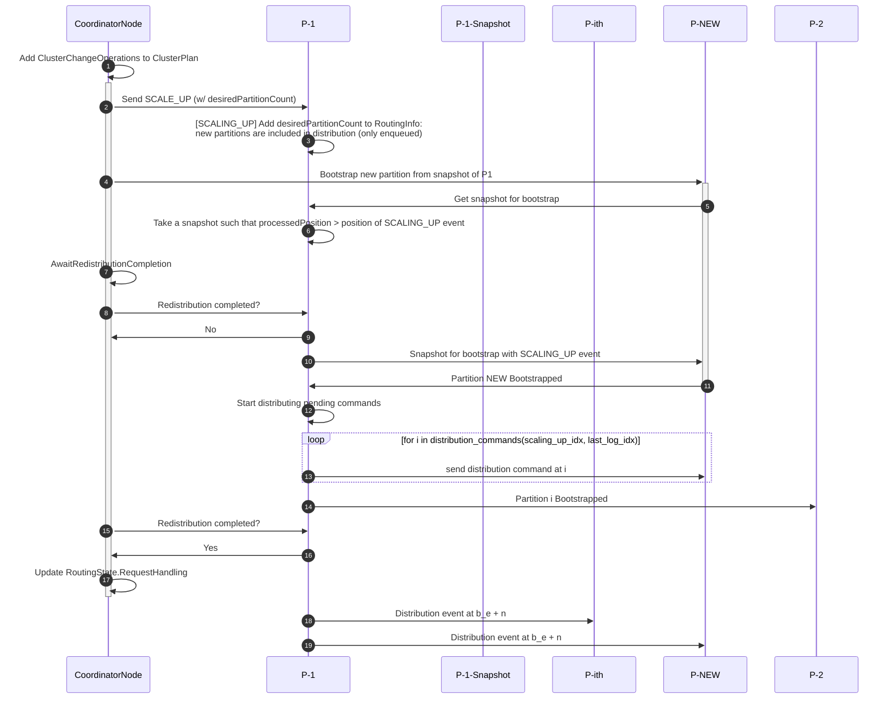

# Dynamic Scaling

*Dynamic Scaling* refers to the process of increasing the number of partitions of a zeebe cluster once a cluster has been created.
Before this feature, the number of partitions could not be changed.

The scaling process is comprised of two sequential phases that ensure new partitions are fully integrated into the cluster:

1. **Redistribution**: Deploy common resources (process definitions, decisions, forms) to new partitions so they can process events
2. **Relocation**: Redistribute message/signal subscriptions across all partitions (old and new) for optimal correlation

## Redistribution

A sequence diagram of the redistribution process can be found below:

### Detailed steps

1. A client sends a [ClusterConfigurationManagementRequest](zeebe/dynamic-config/src/main/java/io/camunda/zeebe/dynamic/config/api/ClusterConfigurationManagementApi.java) as a PATCH HTTP request at `actuator/cluster/`
1. The [ClusterChangeCoordinator](zeebe/dynamic-config/src/main/java/io/camunda/zeebe/dynamic/config/changes/ConfigurationChangeCoordinator.java) generates the `ClusterChangeOperation` needed to reach the requested result.
  For a pure scaling operation, the generated `ClusterChangeOperation` will be:
    - `StartPartitionScaleUp` to Partition 1
    - `PartitionBootstrapOperation` to all new partitions
    - `AwaitRedistributionCompletion` to the coordinator node 1

 Once generated, the coordinator node will execute one operation at a time, on the correct node.

1. `StartPartitionScaleUp`:
    - Partition 1 marks that the scale up is started in the state.
    - new partitions are added to the `desiredPartitionCount` in the state
    - commands distribution will enqueue new commands for the new partitions, but it will not start distributing them yet.

1. `PartitionBootstrapOperation` on the new partitions (one partition at a time, from the *lowest* to the *highest*):

    - The partition is bootstrapped in the node with the flag `bootstrapFromSnapshot=true`.
    - It will request the snapshot for bootstrap to partition 1.

    - When the snapshot is received, it will restore the `PersistedSnapshotStore` with it, before the partition is even started (in a `PartitionStartupStep`)
    - When the bootstrap is completed, it will inform partition 1 that they are ready to process messages
    - Partition 1 will include the newly bootstrapped partitions to the `activePartitions` field in `RoutingInfo` in the state
    - Partition 1 will distribute to all partitions the newly received bootstrap command
    - All other partition will do the same changes to the `RoutingInfo` in the state

1. `AwaitRedistributionCompletion`:
   CoordinatorNode will keep polling Partition 1 to know when all partitions have been bootstrapped.

   When redistribution is completed, the routing information in the dynamic config module will update, so that gateways will send new requests to the new partitions
