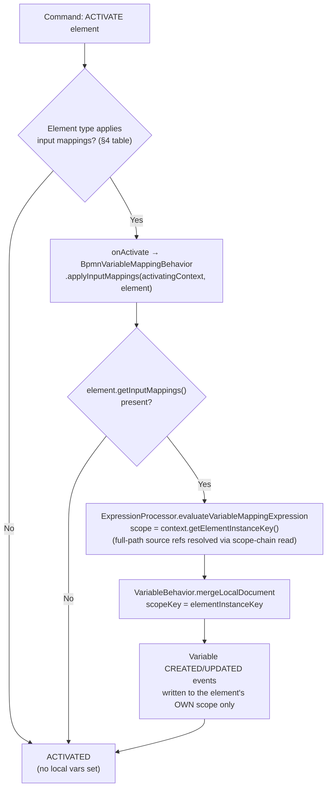
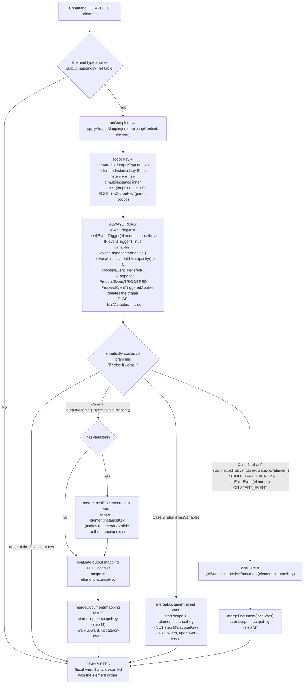
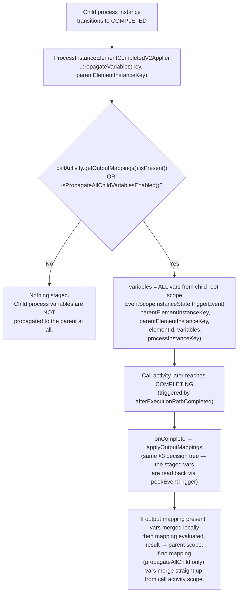
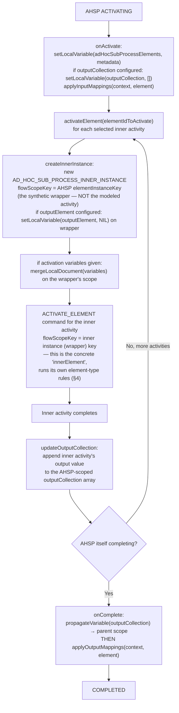
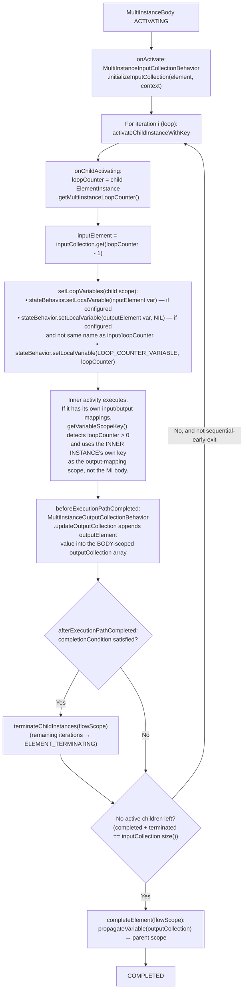

# Variable Propagation and Input/Output Mappings: Discovery Document

> **Issue:** [#56734](https://github.com/camunda/camunda/issues/56734)
> **Parent:** [#56387](https://github.com/camunda/camunda/issues/56387)

## Purpose

Single authoritative reference for how input/output mappings and variable propagation work per BPMN element in Zeebe, as implemented in code (not only per spec).

Two ways to read this doc:
- **In a hurry?** Read the Fast Outcome Table below and stop.
- **Need the "why", the exact scope keys, or a code citation?** Read the Detailed Report that follows it.

---

## Table of Contents

- [Fast Outcome Table](#sec-fast-outcome-table)
  - [Table 1 — Mapping Support per Element Type](#sec-table-1--mapping-support-per-element-type)
  - [Table 2 — Propagation With vs. Without an Output Mapping](#sec-table-2--propagation-with-vs-without-an-output-mapping)
- [Detailed Report](#sec-detailed-report)
  1. [Vocabulary](#sec-1-vocabulary-used-throughout-this-doc)
  2. [Master Flow Diagram — Input Mappings (ACTIVATING)](#sec-2-master-flow-diagram--input-mappings-activating)
  3. [Master Flow Diagram — Output Mappings (COMPLETING)](#sec-3-master-flow-diagram--output-mappings-completing)
  4. [Per-Element Behavior — Grouped by Identical Code Path](#sec-4-per-element-behavior--grouped-by-identical-code-path)
  5. [Special Route — Call Activity Parent ↔ Child Propagation](#sec-5-special-route--call-activity-parent--child-propagation)
  6. [Special Route — Ad-Hoc Sub-Process Output Collection](#sec-6-special-route--ad-hoc-sub-process-output-collection)
  7. [Special Route — Multi-Instance Loop Variables](#sec-7-special-route--multi-instance-loop-variables)
  8. [Nested Variable References: Input vs. Output Mapping Path Semantics](#sec-8-nested-variable-references-input-vs-output-mapping-path-semantics)
  9. [Open Questions / Needs Team Input](#sec-9-open-questions--needs-team-input)
  10. [Key Source Files](#sec-10-key-source-files)

---

<a id="sec-fast-outcome-table"></a>

## Fast Outcome Table

**Four terms used below, if you're skipping straight to the tables:**
- **Parent scope** — the element's container (its "flow scope"). Where propagated variables *usually* end up, but not always — see note below.
- **Own scope** — the element's own instance. Only relevant when the element is itself one iteration of a multi-instance loop — its output mapping then writes locally instead of to the parent.
- **Staged / staging** — a variable placed into a temporary holding area (the "event-trigger buffer") ahead of the element completing, so it's ready to read at completion time. Explained fully in [§1](#sec-1-vocabulary-used-throughout-this-doc) and [§3](#sec-3-master-flow-diagram--output-mappings-completing).
- **Allowlist** — a specific short list of element types (event-based-gateway-connected catch events, non-error boundary events, start events) that promote their own local variables to the parent scope even when nothing else would. Defined in [§3](#sec-3-master-flow-diagram--output-mappings-completing).

> **Note on "parent scope":** the propagating write `VariableBehavior.mergeDocument` walks from its starting scope up through parents one at a time; a variable lands wherever it *first* finds a same-named variable already sitting in that chain, and only if the walk reaches the top with no match anywhere is it created fresh — at the **process root**, not necessarily the immediate parent. This also means "Propagation OFF" in Table 2 can silently stay local: Case 2's walk starts at the completing element's *own* scope key, so if an input mapping already wrote a same-named local variable there `mergeLocalDocument`, the walk finds it on the very first iteration, updates it in place, and never reaches the parent — the job/task result is shadowed and stays local.

<a id="sec-table-1--mapping-support-per-element-type"></a>

### Table 1 — Mapping Support per Element Type

**This table now answers "can I actually get a working mapping here," not "does the engine's code technically support it."** Two independent layers have to agree:

- **App** — Camunda Modeler and Web Modeler share the same properties-panel library `bpmn-io/bpmn-js-properties-panel`. Whether an Input/Output Mapping tab even appears for an element is decided by two functions, `areInputParametersSupported`/`areOutputParametersSupported` in `src/provider/zeebe/utils/InputOutputUtil.js`, gated by the element's BPMN/moddle type (verified against `zeebe-bpmn-moddle`'s `ZeebeServiceTask.extends` list: `ServiceTask`, `BusinessRuleTask`, `ScriptTask`, `SendTask`, `EndEvent`, `IntermediateThrowEvent`, `AdHocSubProcess`).
- **Engine** — whether the Zeebe processor for that element actually calls `applyInputMappings`/`applyOutputMappings` at runtime (§2–§4 below).

**✅ below means both layers agree it works.** ❌ means at least one layer blocks it — the Reason column says which, and whether the engine would still honor a hand-authored/API-deployed mapping the app won't let you create. Deploy-time validation never restricts `zeebe:input`/`zeebe:output` by element type, so "the app won't show it" and "the engine can't run it" are not the same claim — see the Reason column for which applies to each row.

|                         Element Type                          |                                       Input Mapping                                        |                         Output Mapping                         |                                                                                                                                                                             Reason (for any ❌ or caveat)                                                                                                                                                                             |                                                                   Details                                                                   |
|---------------------------------------------------------------|--------------------------------------------------------------------------------------------|----------------------------------------------------------------|--------------------------------------------------------------------------------------------------------------------------------------------------------------------------------------------------------------------------------------------------------------------------------------------------------------------------------------------------------------------------------------|---------------------------------------------------------------------------------------------------------------------------------------------|
| Service Task / Send Task                                      | ✅                                                                                          | ✅                                                              | — both layers agree                                                                                                                                                                                                                                                                                                                                                                  | [§4 Group A](#sec-group-a--standard-single-scope-activities)                                                                                |
| Manual Task                                                   | ❌                                                                                          | ❌                                                              | **Both layers agree — and this corrects an earlier version of this doc**, which wrongly grouped Manual Task with Service/Send Task. It has its own `ManualTaskProcessor` → `UndefinedTaskProcessor`, which has no `onActivate`/`onComplete` override at all; it auto-completes immediately. Not in the app's moddle type list either.                                                | [§4 Group A](#sec-group-a--standard-single-scope-activities)                                                                                |
| User Task                                                     | ✅                                                                                          | ✅                                                              | — both layers agree                                                                                                                                                                                                                                                                                                                                                                  | [§4 Group A](#sec-group-a--standard-single-scope-activities)                                                                                |
| Receive Task                                                  | ❌ *(engine-only ✅)*                                                                        | ✅                                                              | **App restriction.** Modeler's `areInputParametersSupported` list has no `ReceiveTask` entry at all. The engine would honor a hand-authored `zeebe:input` here (`ReceiveTaskProcessor.onActivate` calls `applyInputMappings` unconditionally, and deploy-time validation never restricts it by element type) — there's just no in-app way to create one.                             | [§4 Group A](#sec-group-a--standard-single-scope-activities)                                                                                |
| Script Task — inline FEEL expression                          | ✅                                                                                          | ✅                                                              | **Verified directly in Camunda Modeler:** the Output Mapping tab is shown for the inline/no-connector variant, and the engine applies the output mapping unconditionally regardless `ScriptTaskProcessor.onCompleteInternal`. This contradicts a static read of the app's own gating code — see [§9 item 6](#sec-9-open-questions--needs-team-input) for the unresolved discrepancy. | [§4 Group A](#sec-group-a--standard-single-scope-activities)                                                                                |
| Script Task — connector/job-worker backed                     | ✅                                                                                          | ✅                                                              | — both layers agree once `zeebe:TaskDefinition` is present                                                                                                                                                                                                                                                                                                                           | [§4 Group A](#sec-group-a--standard-single-scope-activities)                                                                                |
| Business Rule Task (DMN)                                      | ✅                                                                                          | ✅                                                              | — both layers agree, for both the called-decision and job-worker implementation variants (`BusinessRuleTask` is listed directly in both app type lists, not gated by task-definition presence)                                                                                                                                                                                       | [§4 Group A](#sec-group-a--standard-single-scope-activities)                                                                                |
| Sub-Process (embedded)                                        | ✅                                                                                          | ✅                                                              | — both layers agree                                                                                                                                                                                                                                                                                                                                                                  | [§4 Group B](#sec-group-b--sub-process--event-sub-process)                                                                                  |
| Event Sub-Process                                             | ✅                                                                                          | ✅                                                              | — both layers agree (same moddle type, `triggeredByEvent` flag)                                                                                                                                                                                                                                                                                                                      | [§4 Group B](#sec-group-b--sub-process--event-sub-process)                                                                                  |
| Call Activity                                                 | ✅                                                                                          | ✅ *(hidden in app when "propagate all child variables" is on)* | Not a restriction bug — the app deliberately hides the Output tab when the "propagate all child variables" checkbox is enabled, mirroring the engine's own `isPropagateAllChildVariablesEnabled` gate (§5). Turn that checkbox off to get the tab back.                                                                                                                              | [§4 Group C](#sec-group-c--call-activity-parentchild-process-boundary), [§5](#sec-5-special-route--call-activity-parent--child-propagation) |
| Ad-Hoc Sub-Process                                            | ✅                                                                                          | ✅                                                              | — both layers agree (matches via the `SubProcess` supertype regardless of job-worker variant)                                                                                                                                                                                                                                                                                        | [§4 Group D](#sec-group-d--ad-hoc-sub-process), [§6](#sec-6-special-route--ad-hoc-sub-process-output-collection)                            |
| — AHSP inner activity (e.g. task "A")                         | *(per its own element type above)*                                                         | *(per its own element type above)*                             | —                                                                                                                                                                                                                                                                                                                                                                                    | [§6](#sec-6-special-route--ad-hoc-sub-process-output-collection)                                                                            |
| Multi-Instance Body                                           | ❌                                                                                          | ❌                                                              | Not a mapping-tab element in the app at all (it's loop characteristics on an activity, not its own BPMN element type); engine has no mapping hooks for it either. `outputCollection` is a separate, non-mapping propagation path (§7).                                                                                                                                               | [§4 Group E](#sec-group-e--multi-instance-body), [§7](#sec-7-special-route--multi-instance-loop-variables)                                  |
| Start Event — None                                            | ❌                                                                                          | ✅                                                              | **Both layers agree.** No start event subtype gets an Input tab in the app (not in any of the app's checks), and the engine never calls `applyInputMappings` for any start event either.                                                                                                                                                                                             | [§4 Group F](#sec-group-f--start-events)                                                                                                    |
| Start Event — Message/Signal/Timer/Error/Conditional          | ❌                                                                                          | ✅                                                              | Same as None — both layers agree, no exceptions per subtype.                                                                                                                                                                                                                                                                                                                         | [§4 Group F](#sec-group-f--start-events)                                                                                                    |
| Intermediate Catch Event — Message/Signal/Timer/Conditional   | ❌ *(engine-only ✅ — the original question)*                                                | ✅                                                              | **App restriction.** The app's input check covers exactly one event scenario (`isSignalThrowEvent`, End/Throw only) — no catch event of any kind gets an Input tab. Engine fully supports and applies it `DefaultIntermediateCatchEventBehavior.onActivate`, and nothing in deploy-time validation blocks a hand-authored `zeebe:input` here.                                        | [§4 Group G](#sec-group-g--intermediate-catch-events)                                                                                       |
| Intermediate Catch Event — Link                               | ❌                                                                                          | ✅                                                              | Both layers agree (link events carry no data to map from either way).                                                                                                                                                                                                                                                                                                                | [§4 Group G](#sec-group-g--intermediate-catch-events)                                                                                       |
| Intermediate Throw Event — None                               | ❌                                                                                          | ✅                                                              | Both layers agree.                                                                                                                                                                                                                                                                                                                                                                   | [§4 Group H](#sec-group-h--intermediate-throw-events)                                                                                       |
| Intermediate Throw Event — Message                            | ✅ *(shown in app regardless of connector config — but only executes if job-worker-backed)* | ✅                                                              | **Reverse mismatch.** The app shows the Input tab the moment you add a message event definition, with no check for whether a connector/job is configured yet. The engine only calls `applyInputMappings` `if jobWorkerProperties != null`. Configure an input mapping here without also wiring up a connector, and the app lets you do it while the engine silently never runs it.   | [§4 Group H](#sec-group-h--intermediate-throw-events)                                                                                       |
| Intermediate Throw Event — Link                               | ❌                                                                                          | ✅                                                              | Both layers agree.                                                                                                                                                                                                                                                                                                                                                                   | [§4 Group H](#sec-group-h--intermediate-throw-events)                                                                                       |
| Intermediate Throw Event — Escalation                         | ❌                                                                                          | ✅                                                              | Both layers agree.                                                                                                                                                                                                                                                                                                                                                                   | [§4 Group H](#sec-group-h--intermediate-throw-events)                                                                                       |
| Intermediate Throw Event — Signal                             | ✅                                                                                          | ✅                                                              | — both layers agree                                                                                                                                                                                                                                                                                                                                                                  | [§4 Group H](#sec-group-h--intermediate-throw-events)                                                                                       |
| Intermediate Throw Event — Compensation                       | ❌                                                                                          | ❌ *(app shows the tab; engine ignores it)*                     | **Reverse mismatch, output side.** The app shows an Output tab (matches the generic `bpmn:Event` type, not on the exclusion list). The engine's `CompensationBehavior` has no `onComplete` override at all — anything you configure here has zero effect. Marked ❌ because "the app lets you configure it" isn't the same as "it works."                                             | [§4 Group H](#sec-group-h--intermediate-throw-events)                                                                                       |
| End Event — None                                              | ❌                                                                                          | ✅                                                              | Both layers agree.                                                                                                                                                                                                                                                                                                                                                                   | [§4 Group I](#sec-group-i--end-events)                                                                                                      |
| End Event — Message                                           | ✅                                                                                          | ✅                                                              | — both layers agree, unconditionally on both sides (unlike the Throw variant, the engine here applies the input mapping regardless of job-worker config)                                                                                                                                                                                                                             | [§4 Group I](#sec-group-i--end-events)                                                                                                      |
| End Event — Signal                                            | ✅                                                                                          | ✅                                                              | — both layers agree                                                                                                                                                                                                                                                                                                                                                                  | [§4 Group I](#sec-group-i--end-events)                                                                                                      |
| End Event — Escalation                                        | ❌                                                                                          | ✅                                                              | Both layers agree.                                                                                                                                                                                                                                                                                                                                                                   | [§4 Group I](#sec-group-i--end-events)                                                                                                      |
| End Event — Error                                             | ❌                                                                                          | ❌                                                              | Both layers agree — app explicitly excludes error end events from the Output check too.                                                                                                                                                                                                                                                                                              | [§4 Group I](#sec-group-i--end-events)                                                                                                      |
| End Event — Terminate                                         | ❌                                                                                          | ❌                                                              | Both layers agree — app explicitly excludes terminate end events from the Output check too.                                                                                                                                                                                                                                                                                          | [§4 Group I](#sec-group-i--end-events)                                                                                                      |
| End Event — Compensation                                      | ❌                                                                                          | ❌ *(app shows the tab; engine ignores it)*                     | **Reverse mismatch, output side** — same situation as Compensation throw above: app shows the Output tab (`bpmn:Event` generic match, not excluded), but `CompensationBehaviour` has no `onComplete` override.                                                                                                                                                                       | [§4 Group I](#sec-group-i--end-events)                                                                                                      |
| Boundary Event — non-error (message/signal/timer/conditional) | ❌                                                                                          | ✅                                                              | Both layers agree — boundary events activate via an internal ACTIVATING+ACTIVATED pair specifically to carry event variables; there's no input-mapping code path to expose.                                                                                                                                                                                                          | [§4 Group J](#sec-group-j--boundary-events)                                                                                                 |
| Boundary Event — error                                        | ❌                                                                                          | ✅                                                              | Both layers agree.                                                                                                                                                                                                                                                                                                                                                                   | [§4 Group J](#sec-group-j--boundary-events)                                                                                                 |
| Gateways (Exclusive / Parallel / Inclusive / Event-Based)     | ❌                                                                                          | ❌                                                              | Both layers agree — not in any app type check, and not wired to `BpmnVariableMappingBehavior` anywhere in the engine.                                                                                                                                                                                                                                                                | [§4 Group K](#sec-group-k--gateways)                                                                                                        |

<a id="sec-table-2--propagation-with-vs-without-an-output-mapping"></a>

### Table 2 — Propagation With vs. Without an Output Mapping

"ON" = an output mapping is configured on the element. "OFF" = no output mapping configured. Both columns describe what reaches the **parent scope**; "own scope" applies only when the element is itself a multi-instance inner instance ([§1](#sec-1-vocabulary-used-throughout-this-doc) vocabulary). See [§1](#sec-1-vocabulary-used-throughout-this-doc)'s new note above for what actually stages a task's result into the event-trigger buffer in the OFF cases below.

**This table describes engine behavior, not what you can reach through the modeler UI.** Check Table 1 first — a few "ON" rows below (Intermediate Catch Event input, Receive Task input, inline Script Task output) are only reachable by hand-authoring the mapping into the BPMN XML directly (e.g. via the API), since the app doesn't expose a tab for them. Manual Task is excluded from this table entirely — it has no output mapping capability and no propagation mechanism of any kind (see the note in [§4 Group A](#sec-group-a--standard-single-scope-activities)).

|                         Element Type                          |                                                                                                           Propagation — Output Mapping ON                                                                                                           |                                                                                                             Propagation — Output Mapping OFF                                                                                                             |
|---------------------------------------------------------------|-----------------------------------------------------------------------------------------------------------------------------------------------------------------------------------------------------------------------------------------------------|----------------------------------------------------------------------------------------------------------------------------------------------------------------------------------------------------------------------------------------------------------|
| Service Task / Send Task                                      | Mapping result → parent scope                                                                                                                                                                                                                       | Job result auto-stages into the event-trigger buffer on completion → propagates to parent scope                                                                                                                                                          |
| User Task                                                     | Mapping result → parent scope                                                                                                                                                                                                                       | Completion variables stage the same way → propagate to parent scope                                                                                                                                                                                      |
| Receive Task                                                  | Mapping result → parent scope                                                                                                                                                                                                                       | Correlated message payload stages via message correlation (`EventHandle.activateElement` → `EventTriggerBehavior.activateTriggeredEvent`), **not** `triggeringProcessEvent` — no job is ever created → propagates to parent scope                        |
| Script Task — inline FEEL expression                          | Mapping result → parent scope (available in the app — see the correction in Table 1)                                                                                                                                                                | Inline-FEEL result stages the same way as tasks → propagates to parent scope                                                                                                                                                                             |
| Script Task — connector/job-worker backed                     | Mapping result → parent scope                                                                                                                                                                                                                       | Connector-job result stages the same way → propagates to parent scope                                                                                                                                                                                    |
| Business Rule Task (DMN)                                      | Mapping result → parent scope                                                                                                                                                                                                                       | Called-decision variant stages via `BpmnDecisionBehavior.triggerProcessEventWithResultVariable` at activation; job-worker variant stages via `JobCompleteProcessor` at completion — both end up in the event-trigger buffer → propagates to parent scope |
| Sub-Process (embedded)                                        | Mapping result → parent scope                                                                                                                                                                                                                       | **Nothing.** Sub-process-local variables stay local and are discarded when it completes — no staging mechanism of its own                                                                                                                                |
| Event Sub-Process                                             | Mapping result → parent scope                                                                                                                                                                                                                       | Same as embedded sub-process — nothing propagates                                                                                                                                                                                                        |
| Call Activity                                                 | Always evaluated; if child-process vars were staged (needs this same output mapping present, or `propagateAllChildVariablesEnabled` — [§5](#sec-5-special-route--call-activity-parent--child-propagation)), the mapping can read and propagate them | Staging (and therefore any propagation) only happens if `propagateAllChildVariablesEnabled = true` — then child vars propagate directly. If that flag is false, **child vars are dropped entirely**                                                      |
| Ad-Hoc Sub-Process                                            | Mapping result → parent scope (`outputCollection`, if configured, already propagated first, so the mapping can reference it)                                                                                                                        | `outputCollection` (if configured) still propagates via its own explicit mechanism; everything else stays local and is discarded                                                                                                                         |
| — AHSP inner activity                                         | *(per its own element type row above)* — runs under its own per-activation wrapper scope, not the AHSP's                                                                                                                                            | *(per its own element type row above)*                                                                                                                                                                                                                   |
| Multi-Instance Body                                           | N/A — never has an output mapping                                                                                                                                                                                                                   | `outputCollection` (if configured) propagates via its own explicit mechanism regardless; `loopCounter` and the input-element variable are local to each inner instance and never auto-propagate                                                          |
| Start Event — None                                            | Mapping result → parent scope                                                                                                                                                                                                                       | No event payload (top-level start) → local vars (if any) still promoted, via the allowlist                                                                                                                                                               |
| Start Event — Message/Signal/Timer/Error/Conditional          | Event payload folded in locally, then mapping result → parent scope                                                                                                                                                                                 | Correlation payload auto-propagates to parent scope directly                                                                                                                                                                                             |
| Intermediate Catch Event — Message/Signal/Timer/Conditional   | Event payload folded in locally, then mapping result → parent scope                                                                                                                                                                                 | Correlation payload auto-propagates to parent scope                                                                                                                                                                                                      |
| Intermediate Catch Event — Link                               | Mapping result → parent scope (link events carry no data, so this is typically a static/literal mapping)                                                                                                                                            | **Nothing.** Link events carry no correlation payload, and Link catch is not on the local-var-promotion allowlist                                                                                                                                        |
| Intermediate Throw Event — None                               | Mapping result → parent scope                                                                                                                                                                                                                       | **Nothing** — no job, no correlation, not allowlisted                                                                                                                                                                                                    |
| Intermediate Throw Event — Message                            | Mapping result → parent scope                                                                                                                                                                                                                       | If connector/job-backed: job result auto-propagates the same way as tasks. If not job-backed: nothing propagates                                                                                                                                         |
| Intermediate Throw Event — Link                               | Mapping result → parent scope                                                                                                                                                                                                                       | **Nothing** — synchronous goto, no payload                                                                                                                                                                                                               |
| Intermediate Throw Event — Escalation                         | Mapping result → parent scope                                                                                                                                                                                                                       | **Nothing** — broadcast only, nothing staged on its own scope                                                                                                                                                                                            |
| Intermediate Throw Event — Signal                             | Mapping result → parent scope                                                                                                                                                                                                                       | **Nothing** — broadcast only, nothing staged on its own scope                                                                                                                                                                                            |
| Intermediate Throw Event — Compensation                       | N/A — never has an output mapping                                                                                                                                                                                                                   | Nothing propagates via this mechanism                                                                                                                                                                                                                    |
| End Event — None                                              | Mapping result → parent scope                                                                                                                                                                                                                       | **Nothing** — synchronous, no job                                                                                                                                                                                                                        |
| End Event — Message                                           | Mapping result → parent scope                                                                                                                                                                                                                       | Job result auto-propagates the same way as tasks (job-backed)                                                                                                                                                                                            |
| End Event — Signal                                            | Mapping result → parent scope                                                                                                                                                                                                                       | **Nothing** — broadcast only, nothing staged on its own scope                                                                                                                                                                                            |
| End Event — Escalation                                        | Mapping result → parent scope                                                                                                                                                                                                                       | **Nothing** — broadcast only, nothing staged on its own scope                                                                                                                                                                                            |
| End Event — Error / Terminate / Compensation                  | N/A — never has an output mapping                                                                                                                                                                                                                   | Nothing propagates via this mechanism (error payload, if any, travels through catch-event mechanics instead)                                                                                                                                             |
| Boundary Event — non-error (message/signal/timer/conditional) | Mapping result → parent scope                                                                                                                                                                                                                       | Correlation payload (if any) auto-propagates; if none (e.g. a bare timer with no payload), local vars are still promoted via the allowlist                                                                                                               |
| Boundary Event — error                                        | Mapping result → parent scope                                                                                                                                                                                                                       | Correlation/error payload (if any) auto-propagates; if none, **nothing propagates** — error boundary events are excluded from the allowlist fallback                                                                                                     |
| Gateways (Exclusive / Parallel / Inclusive / Event-Based)     | N/A — never has an output mapping                                                                                                                                                                                                                   | Not applicable — variables stay reachable via normal scope-chain reads through the gateway                                                                                                                                                               |

---

<a id="sec-detailed-report"></a>

## Detailed Report

<a id="sec-1-vocabulary-used-throughout-this-doc"></a>

## 1. Vocabulary (used throughout this doc)

Every element instance has a **scope key** — its own identity in the variable-storage hierarchy — and a **parent scope key**, which is its containing element `flowScopeKey`. Scopes form a tree rooted at the process instance.

|           Term           |                                                                                                                               Meaning                                                                                                                                |                                 Code                                 |
|--------------------------|----------------------------------------------------------------------------------------------------------------------------------------------------------------------------------------------------------------------------------------------------------------------|----------------------------------------------------------------------|
| **Scope Key**            | The element instance's own scope. Where input mappings are evaluated into and where a completing element's local variables live.                                                                                                                                     | `context.getElementInstanceKey()`                                    |
| **Parent Scope**         | The scope one level up — the element's flow scope. Default target when propagating variables outward.                                                                                                                                                                | `context.getFlowScopeKey()`                                          |
| **Local Scope write**    | A variable written directly to one scope, no upward search. Invisible to the parent until explicitly propagated.                                                                                                                                                     | `VariableBehavior.mergeLocalDocument(...)` / `setLocalVariable(...)` |
| **Propagating write**    | A variable written by walking from a starting scope up through parents: update the first scope where the name already exists, otherwise keep walking, otherwise create at the root.                                                                                  | `VariableBehavior.mergeDocument(...)`                                |
| **Event-trigger buffer** | A staging area `EventScopeInstanceState` that holds variables attached to a not-yet-consumed trigger (message/signal/timer/error payload, or — reused for call activities — a completed child process's variables). Read via `peekEventTrigger(elementInstanceKey)`. | `EventScopeInstanceState`                                            |

**Where task-type results come from:** by the time `applyOutputMappings` runs for service/user/script/business-rule tasks, the result is already sitting in the event-trigger buffer, staged by a call to `EventTriggerBehavior.triggeringProcessEvent(...)` (keyed at the task's own `elementInstanceKey`). This is *why* `hasVariables` is true for these elements in [§3](#sec-3-master-flow-diagram--output-mappings-completing)'s decision tree even though nothing in `BpmnVariableMappingBehavior` itself ever sets it. There are four staging call sites, not one:

1. `JobCompleteProcessor.postCompleteActions`, via the `EventHandle.triggeringProcessEvent(JobRecord)` overload. It runs in **both** the `EXECUTION_LISTENER` branch (before appending `COMPLETE_EXECUTION_LISTENER`) and the `default` branch (before appending `COMPLETE_ELEMENT`, guarded by a flow-scope-active check) — it is not limited to "non-listener" completions. This covers every job-backed variant: Service/Send Task, and the job-worker/connector variants of Script Task and Business Rule Task.
2. The User Task completion path — `EventHandle.triggeringProcessEvent(UserTaskRecord)` in `UserTaskCompleteProcessor`.
3. `ScriptTaskProcessor`'s own private `triggerProcessEventWithResultVariable` helper, called from `evaluateScript` for the inline-FEEL-expression variant (no job at all). It calls `EventTriggerBehavior.triggeringProcessEvent` directly, bypassing `EventHandle`.
4. `BpmnDecisionBehavior`'s own private `triggerProcessEventWithResultVariable` helper, for the called-decision variant of Business Rule Task. Also calls `EventTriggerBehavior.triggeringProcessEvent` directly, and does so at element **ACTIVATION** time — the decision is evaluated when the element activates, and its result is staged immediately so the later output mapping at completion doesn't need to re-evaluate it.

**Receive Task is not on this list.** It never creates a job, so none of the four call sites above ever fire for it. Its correlated message payload is staged by the same mechanism used for message/signal catch events instead: `EventHandle.activateElement(...)` → `EventTriggerBehavior.activateTriggeredEvent(...)`. By the time `ReceiveTaskProcessor.onComplete` runs `applyOutputMappings`, the payload is already in the event-trigger buffer from that correlation — not from `triggeringProcessEvent`.

Manual Task never reaches any of this either — it never creates a job and has no event-trigger interaction at all ([§4 Group A](#sec-group-a--standard-single-scope-activities)). Elements with no staging call of any kind (sub-processes, none/link/escalation/signal/compensation throw and end events) never get `hasVariables = true` this way — see Table 2 below for the full breakdown.

Two BPMN-level concepts map onto these primitives:

- **Input mapping** → always a **local-scope write** at the element's own scope key `mergeLocalDocument`. Never walks upward.
- **Output mapping** (or its absence) → always a **propagating write**, starting at a scope key that is *usually* the parent scope, but is the element's **own** scope key when the element is itself a multi-instance inner instance (see [§3](#sec-3-master-flow-diagram--output-mappings-completing), `getVariableScopeKey`).

---

<a id="sec-2-master-flow-diagram--input-mappings-activating"></a>

## 2. Master Flow Diagram — Input Mappings (ACTIVATING)



**Key file:** `BpmnVariableMappingBehavior.applyInputMappings`

Input mappings **never propagate**. They always land on the activating element's own scope key, which is exactly where the element's task/expression evaluation will read from — plus everything visible from ancestor scopes above it (scope-chain read, not a copy).

---

<a id="sec-3-master-flow-diagram--output-mappings-completing"></a>

## 3. Master Flow Diagram — Output Mappings (COMPLETING)

This is the single most complex piece of logic in the whole system. One method, `BpmnVariableMappingBehavior.applyOutputMappings`, drives every branch below — the code path is identical regardless of BPMN element type; only *whether it's called at all* differs ([§4](#sec-4-per-element-behavior--grouped-by-identical-code-path)).



**Two independent checks — do not conflate them:**
- `eventTrigger != null` gates whether `processEventTriggered(...)` fires — unconditional on `hasVariables`. It fires even for an empty/zero-length variables buffer (e.g. a timer catch event with no payload).
- `hasVariables` `variables.capacity() > 0` is computed once, at the top, whenever `eventTrigger != null`. That single flag then drives both Case 2 (taken instead of the mapping branch when there is no mapping) and the inner check inside Case 1 (node `C1a`, whether to fold vars in locally before evaluating the mapping). If `eventTrigger != null` but carries no variables, Case 2 is skipped and control falls through to Case 3.

**Read this diagram as:** *"with a mapping, event-trigger vars (if any) are folded in locally first, then the mapping result propagates from the parent scope (or the element's own scope, if it's an MI inner instance); without a mapping, whatever arrived via the event-trigger buffer propagates as-is starting from the element's own scope; and a small allowlist of element types (event-based-gateway-connected catch events, non-error boundary events, start events) additionally promote their local variables even with no trigger variables and no mapping."*

---

<a id="sec-4-per-element-behavior--grouped-by-identical-code-path"></a>

## 4. Per-Element Behavior — Grouped by Identical Code Path

Columns follow [§1](#sec-1-vocabulary-used-throughout-this-doc)'s vocabulary. "Scope Key" = the key input mappings write to / output mappings read+evaluate at ([§2](#sec-2-master-flow-diagram--input-mappings-activating)/[§3](#sec-3-master-flow-diagram--output-mappings-completing), always `elementInstanceKey` unless noted). "Parent Scope" = the upward target for output-mapping results and default propagation ([§3](#sec-3-master-flow-diagram--output-mappings-completing) step M).

<a id="sec-group-a--standard-single-scope-activities"></a>

### Group A — Standard single-scope activities

`ExecutableJobWorkerTask` (service/send task — **not** manual task, see below), `ExecutableUserTask`, `ExecutableReceiveTask`, `ExecutableScriptTask`, `ExecutableBusinessRuleTask`.

All five follow the exact same call shape: `onActivate` → `applyInputMappings(context, element)`; `onComplete` → `applyOutputMappings(context, element)`.

**Manual Task is not part of this group, despite modeling as a task.** It has its own `ManualTaskProcessor` (extends `UndefinedTaskProcessor`), which overrides neither `onActivate` nor `onComplete` — no mapping calls exist for it at all. `finalizeActivation` transitions the element straight from ACTIVATED to COMPLETED with nothing in between. Input Mapping ❌, Output Mapping ❌, both confirmed by the app (not in either properties-panel type check, see Table 1) and the engine (no processing hooks).

|   Dimension    |                                                Behavior                                                |
|----------------|--------------------------------------------------------------------------------------------------------|
| Parent Scope   | `context.getFlowScopeKey()` — the containing sub-process/process                                       |
| Scope Key      | `context.getElementInstanceKey()` (or own key if this instance is an MI inner instance)                |
| Local Scope    | Input mapping result written here; local vars set by execution listeners/workers also live here        |
| Input Mapping  | ✅ always, on ACTIVATING                                                                                |
| Output Mapping | ✅ always, on COMPLETING                                                                                |
| Propagation    | Standard [§3](#sec-3-master-flow-diagram--output-mappings-completing) decision tree, no extra behavior |

Classes: `JobWorkerTaskProcessor` (`onActivate`, `onComplete`) · `UserTaskProcessor` (`onActivateInternal`, `onCompleteInternal`) · `ReceiveTaskProcessor` (`onActivate`, `onComplete`) · `ScriptTaskProcessor` (`onActivateInternal`, `onCompleteInternal`) · `BusinessRuleTaskProcessor` (`onActivateInternal`, `onCompleteInternal`).

<a id="sec-group-b--sub-process--event-sub-process"></a>

### Group B — Sub-Process / Event Sub-Process

`ExecutableFlowElementContainer` used as (interrupting or non-interrupting) sub-process or event sub-process.

|   Dimension    |                                                                                                                                        Behavior                                                                                                                                        |
|----------------|----------------------------------------------------------------------------------------------------------------------------------------------------------------------------------------------------------------------------------------------------------------------------------------|
| Parent Scope   | The element enclosing the sub-process                                                                                                                                                                                                                                                  |
| Scope Key      | The sub-process's own instance key                                                                                                                                                                                                                                                     |
| Local Scope    | Input mapping result stays here — nothing later promotes it. The embedded sub-process's own none-start-event runs Case 3 too, but that reads *its own* local vars `getVariablesLocalAsDocument(startEventElementInstanceKey)`, not the sub-process's scope, so it never picks these up |
| Input Mapping  | ✅ on ACTIVATING                                                                                                                                                                                                                                                                        |
| Output Mapping | ✅ on COMPLETING                                                                                                                                                                                                                                                                        |
| Propagation    | Standard [§3](#sec-3-master-flow-diagram--output-mappings-completing) tree                                                                                                                                                                                                             |

Classes: `SubProcessProcessor` (`onActivate`, `onComplete`) · `EventSubProcessProcessor` (`onActivate`, `onComplete`).

<a id="sec-group-c--call-activity-parentchild-process-boundary"></a>

### Group C — Call Activity (parent↔child process boundary)

`ExecutableCallActivity`. This is the one element with a **second, independent propagation mechanism** layered on top of the standard input/output mapping calls — see [§5](#sec-5-special-route--call-activity-parent--child-propagation) for the full diagram.

|   Dimension    |                                                                                                                                                                                                  Behavior                                                                                                                                                                                                   |
|----------------|-------------------------------------------------------------------------------------------------------------------------------------------------------------------------------------------------------------------------------------------------------------------------------------------------------------------------------------------------------------------------------------------------------------|
| Parent Scope   | The element enclosing the call activity (in the **parent** process)                                                                                                                                                                                                                                                                                                                                         |
| Scope Key      | The call activity's own instance key                                                                                                                                                                                                                                                                                                                                                                        |
| Local Scope    | Input mapping result (if configured)                                                                                                                                                                                                                                                                                                                                                                        |
| Input Mapping  | ✅ on ACTIVATING, applied to the call activity's own scope                                                                                                                                                                                                                                                                                                                                                   |
| Output Mapping | ✅ on COMPLETING, always evaluated — but its access to the **child process's** variables specifically depends on whether they were staged first (see [§5](#sec-5-special-route--call-activity-parent--child-propagation))                                                                                                                                                                                    |
| Propagation    | **Inbound:** `propagateAllParentVariablesEnabled` (default) copies *everything* visible at the call activity scope into the child process root; else if an input mapping is configured, only the mapping's local result is copied. **Outbound:** gated by `propagateAllChildVariablesEnabled` OR an output mapping being present — see [§5](#sec-5-special-route--call-activity-parent--child-propagation). |

Classes: `CallActivityProcessor.onActivate` (input mapping call), `.onComplete` (output mapping call), `.finalizeActivation` (inbound copy modes) · `ProcessInstanceElementCompletedV2Applier.propagateVariables` (outbound gate + staging).

<a id="sec-group-d--ad-hoc-sub-process"></a>

### Group D — Ad-Hoc Sub-Process

`ExecutableAdHocSubProcess`. Second special mechanism — internal metadata variable + output collection. See [§6](#sec-6-special-route--ad-hoc-sub-process-output-collection).

|   Dimension    |                                                                                     Behavior                                                                                      |
|----------------|-----------------------------------------------------------------------------------------------------------------------------------------------------------------------------------|
| Parent Scope   | Element enclosing the AHSP                                                                                                                                                        |
| Scope Key      | The AHSP's own instance key                                                                                                                                                       |
| Local Scope    | Input mapping result; `adHocSubProcessElements` (engine metadata, must not be user-propagated); `outputCollection` initialized to `[]`                                            |
| Input Mapping  | ✅ on ACTIVATING                                                                                                                                                                   |
| Output Mapping | ✅ on COMPLETING, **after** the output collection is propagated                                                                                                                    |
| Propagation    | `outputCollection` propagated via `stateBehavior.propagateVariable` (parent scope) before mappings run; each inner activity runs independently under its own inner-instance scope |

Classes: `AdHocSubProcessProcessor` — `onActivate` (calls `applyInputMappings`), `onComplete` (calls `propagateVariable`, then `applyOutputMappings`).

<a id="sec-group-e--multi-instance-body"></a>

### Group E — Multi-Instance Body

`ExecutableMultiInstanceBody`. **Does not use input/output mappings at all.** Its own mechanism is described fully in [§7](#sec-7-special-route--multi-instance-loop-variables).

|   Dimension    |                                                                 Behavior                                                                  |
|----------------|-------------------------------------------------------------------------------------------------------------------------------------------|
| Parent Scope   | Element enclosing the MI body                                                                                                             |
| Scope Key      | N/A (no mapping support on the body itself)                                                                                               |
| Local Scope    | Each *inner* instance gets `loopCounter` and (if configured) the input-element variable, set locally on **its own** scope, not the body's |
| Input Mapping  | ❌ (body itself has none; inner activity may have its own, per its own group)                                                              |
| Output Mapping | ❌ (same)                                                                                                                                  |
| Propagation    | `outputCollection`, if configured, propagated from body scope to parent scope via `propagateVariable` on body completion                  |

Class: `MultiInstanceBodyProcessor.java` — see [§7](#sec-7-special-route--multi-instance-loop-variables) for exact line references.

> **Groups F–K below drop the Parent Scope / Scope Key / Local Scope columns** — for every event and gateway subtype these are identical to Group A's defaults (Parent Scope = `flowScopeKey`, Scope Key = Local Scope = `elementInstanceKey`). The only thing that actually varies per subtype is input/output mapping support, so only that is tabulated.

<a id="sec-group-f--start-events"></a>

### Group F — Start Events

`ExecutableStartEvent`, all trigger types.

|                    Subtype                     | Input Mapping | Output Mapping |                                                                           Notes                                                                           |
|------------------------------------------------|---------------|----------------|-----------------------------------------------------------------------------------------------------------------------------------------------------------|
| None                                           | ❌             | ✅              | Simple local-var promotion if any exist                                                                                                                   |
| Message / Signal / Timer / Error / Conditional | ❌             | ✅              | Event-trigger vars (the message/signal payload etc.) merged in via [§3](#sec-3-master-flow-diagram--output-mappings-completing)'s `hasVariables` branches |

No start event subtype applies an input mapping — `StartEventProcessor` never calls `applyInputMappings`. All call `applyOutputMappings` uniformly `StartEventProcessor.onComplete`. Because `START_EVENT` is in the [§3](#sec-3-master-flow-diagram--output-mappings-completing) allowlist, even a start event with no event-trigger vars and no output mapping still promotes its local vars upward.

<a id="sec-group-g--intermediate-catch-events"></a>

### Group G — Intermediate Catch Events

`ExecutableCatchEventElement` (message, signal, timer, conditional catch — anything not a link).

|                  Subtype                   |        Input Mapping         |                                   Output Mapping                                   |
|--------------------------------------------|------------------------------|------------------------------------------------------------------------------------|
| Default (message/signal/timer/conditional) | ✅ on ACTIVATING              | ✅ on COMPLETING                                                                    |
| Link catch                                 | ❌ (no `onActivate` override) | ✅ on COMPLETING (called unconditionally by the outer processor for *all* subtypes) |

Class: `IntermediateCatchEventProcessor.onComplete` (`applyOutputMappings` call — applies to every subtype, including link) · `DefaultIntermediateCatchEventBehavior.onActivate` (`applyInputMappings` call, non-link subtypes only).

<a id="sec-group-h--intermediate-throw-events"></a>

### Group H — Intermediate Throw Events

`ExecutableIntermediateThrowEvent`. Six subtypes, each with its own behavior class inside `IntermediateThrowEventProcessor`.

|   Subtype    |                                      Input Mapping                                      |                Output Mapping                |
|--------------|-----------------------------------------------------------------------------------------|----------------------------------------------|
| None         | ❌                                                                                       | ✅                                            |
| Message      | ✅ **only if** `jobWorkerProperties != null` (i.e. it's implemented via a job/connector) | ✅ always                                     |
| Link (throw) | ❌                                                                                       | ✅                                            |
| Escalation   | ❌                                                                                       | ✅                                            |
| Signal       | ✅                                                                                       | ✅                                            |
| Compensation | ❌                                                                                       | ❌ (no `onComplete` override — default no-op) |

Class: `IntermediateThrowEventProcessor` — `MessageIntermediateThrowEventBehavior.onActivate` (conditional input, gated on `jobWorkerProperties != null`), `SignalIntermediateThrowEventBehavior.onActivate` (unconditional input); `onComplete` (output mapping) is implemented on `NoneIntermediateThrowEventBehavior`, `MessageIntermediateThrowEventBehavior`, `LinkIntermediateThrowEventBehavior`, `EscalationIntermediateThrowEventBehavior`, and `SignalIntermediateThrowEventBehavior`.

<a id="sec-group-i--end-events"></a>

### Group I — End Events

`ExecutableEndEvent`, seven subtypes. Error, Terminate, and Compensation end events apply **no** mapping at all; Escalation applies output only, not input — the only subtypes with both are Message and Signal.

|   Subtype    | Input Mapping | Output Mapping |                                                                       Notes                                                                        |
|--------------|---------------|----------------|----------------------------------------------------------------------------------------------------------------------------------------------------|
| None         | ❌             | ✅              |                                                                                                                                                    |
| Message      | ✅             | ✅              | Only subtype with both                                                                                                                             |
| Signal       | ✅             | ✅              |                                                                                                                                                    |
| Escalation   | ❌             | ✅              | No `onActivate` override                                                                                                                           |
| Error        | ❌             | ❌              | Error is caught and propagated via `EventPublicationBehavior.throwErrorEvent`, not via output mapping; element never reaches a normal `onComplete` |
| Terminate    | ❌             | ❌              | No mapping methods overridden                                                                                                                      |
| Compensation | ❌             | ❌              | No mapping methods overridden                                                                                                                      |

Class: `EndEventProcessor.java` — behavior classes `NoneEndEventBehavior`, `MessageEndEventBehavior`, `SignalEndEventBehavior` (input+output), `ErrorEndEventBehavior`/`TerminateEndEventBehavior`/`CompensationBehaviour` (neither), `EscalationEndEventBehavior` (output only).

<a id="sec-group-j--boundary-events"></a>

### Group J — Boundary Events

`ExecutableBoundaryEvent`.

|                                  Dimension                                  |                                                                                                                   Behavior                                                                                                                   |
|-----------------------------------------------------------------------------|----------------------------------------------------------------------------------------------------------------------------------------------------------------------------------------------------------------------------------------------|
| Input Mapping                                                               | ❌ never (boundary events activate via an internal ACTIVATING+ACTIVATED pair specifically to carry event variables — `onActivate` throws if reached as a plain command, confirming there is no input-mapping code path)                       |
| Output Mapping                                                              | ✅ always, on COMPLETING                                                                                                                                                                                                                      |
| Special [§3](#sec-3-master-flow-diagram--output-mappings-completing) branch | Non-error boundary events are in the allowlist ([§3](#sec-3-master-flow-diagram--output-mappings-completing), Case 3) — local vars promote even with no trigger vars and no mapping. Error boundary events are excluded from that allowlist. |

Class: `BoundaryEventProcessor.onComplete` (`applyOutputMappings` call).

<a id="sec-group-k--gateways"></a>

### Group K — Gateways

Exclusive, Parallel, Inclusive, Event-Based Gateway. **No input or output mapping support at all** — not wired to `BpmnVariableMappingBehavior` anywhere in the codebase. Variables simply remain visible via normal scope-chain reads through the gateway.

---

<a id="sec-5-special-route--call-activity-parent--child-propagation"></a>

## 5. Special Route — Call Activity Parent ↔ Child Propagation

This is the one place where output-mapping application depends on a *second* processor entirely — the child process's completion applier — staging data into the event-trigger buffer before the call activity's own `onComplete` ever runs.



**This means:** a call activity with `propagateAllChildVariablesEnabled = false` and no output mapping configured **drops all child process variables on the floor** — nothing comes back to the parent process, by design.

Classes: `ProcessInstanceElementCompletedV2Applier.propagateVariables` (staging) · `CallActivityProcessor.onComplete` (output mapping) · inbound copy in `CallActivityProcessor.finalizeActivation`.

---

<a id="sec-6-special-route--ad-hoc-sub-process-output-collection"></a>

## 6. Special Route — Ad-Hoc Sub-Process Output Collection

### Terminology — "inner activity" vs. "inner instance" (resolves the `innerElement` question, [§9](#sec-9-open-questions--needs-team-input))

AHSP activation is two levels deep per activated activity, and the two levels are easy to conflate:

|        Term        |                                                                                                          What it is                                                                                                          |                                                                                         Element type / id                                                                                          |                                                                                                  Scope role                                                                                                   |
|--------------------|------------------------------------------------------------------------------------------------------------------------------------------------------------------------------------------------------------------------------|----------------------------------------------------------------------------------------------------------------------------------------------------------------------------------------------------|---------------------------------------------------------------------------------------------------------------------------------------------------------------------------------------------------------------|
| **Inner activity** | The concrete, user-modeled node inside the ad-hoc sub-process — e.g. task **"A"**, task **"B"**. This is what `innerElement` in #56387 actually refers to.                                                                   | Whatever the user modeled it as (`ExecutableFlowNode`, id = e.g. `"A"`)                                                                                                                            | Its own scope key = its own element instance key; runs the normal Group A/B/etc. rules for its element type, including its own input/output mappings if configured                                            |
| **Inner instance** | A **synthetic wrapper** the engine creates once per activation, purely to give the activity a flow scope. Easy to confuse with the activity itself — it is not modeled by the user and carries no BPMN semantics of its own. | `BpmnElementType.AD_HOC_SUB_PROCESS_INNER_INSTANCE`, id = `adHocSubProcess.getInnerInstanceId()` (constant suffix `#innerInstance`, `ZeebeConstants.AD_HOC_SUB_PROCESS_INNER_INSTANCE_ID_POSTFIX`) | Sits between the AHSP and the inner activity: `AHSP → inner instance (flow scope) → inner activity`. The `outputElement` nil-initialization (if configured) is set here, on the wrapper, not on the activity. |

One inner instance is created per activation `createInnerInstance`, so concurrent/repeated activations of the same modeled activity each get their own wrapper and their own scope — they don't share state.



`adHocSubProcessElements` is engine-internal metadata (constant `ZeebeConstants.AD_HOC_SUB_PROCESS_ELEMENTS = "adHocSubProcessElements"`) and must never be treated as a user variable to propagate.

**`toolCall` / `toolCallResult` / `toolCallResults` — corrected: these are *not* ordinary variables with no special expectations.** Per [#51939](https://github.com/camunda/camunda/issues/51939), which concerns the AI Agent connector's `toolCall`/`toolCallResult` variables, the intended behavior is:

- `toolCall` — set by the job worker as a variable **local to the specific activated inner instance**, carrying the input parameters for that one tool call.
- `toolCallResult` (singular) — set to an **empty value, deliberately local to the inner instance scope**, so the tool can write its result there; `updateOutputCollection` (§6 above) then picks it up via the AHSP's `outputElement` mapping and appends it to the AHSP-level array.
- `toolCallResults` (plural) — the AHSP's `outputCollection`, the aggregated array of all `toolCallResult` values across activations.

**Locality is the entire point** — the AI Agent connector's duplicate-detection logic depends on `toolCall` *not* being visible outside the one inner instance it belongs to. That is not automatic: it is not engine-internal metadata like `adHocSubProcessElements`, and (as of the code verified in this doc, §3/§6) `BpmnVariableMappingBehavior` applies no AHSP-inner-instance-specific guard. Whether that locality holds in practice depends entirely on whether the AHSP has an input mapping that keeps these names out of its own local scope, or whether they're using the standard Case 2 propagation path.

**This has already broken in production once.** [#51939](https://github.com/camunda/camunda/issues/51939) documents a regression (Camunda 8.9.1) where `toolCall`/`toolCallResult` leaked from the inner instance up through the AHSP into the global scope, causing the AI Agent to see a stale `toolCall` ID from a previous activation and raise a duplicate-tool-call-ID incident. A fix ([#51972](https://github.com/camunda/camunda/pull/51972)) added a dedicated `isAdHocSubProcessInnerInstance(context)` guard to `BpmnVariableMappingBehavior.applyOutputMappings`, forcing the mapping result to stay in the local scope whenever the completing element's flow scope is an `AD_HOC_SUB_PROCESS_INNER_INSTANCE`. **That fix was later reverted** along with three related PRs ([#54957](https://github.com/camunda/camunda/pull/54957), [#52737](https://github.com/camunda/camunda/pull/52737), [#49149](https://github.com/camunda/camunda/pull/49149)) via [#55260](https://github.com/camunda/camunda/pull/55260), because the team found the fixes introduced further variable-propagation regressions and lacked adequate test coverage — this is the same reversion referenced in the parent issue, [#56387](https://github.com/camunda/camunda/issues/56387). The revert PR's own checklist explicitly flags "AHSP inner instance variables should not leak to parent scope" as still-missing test coverage.

**Net: as of the code currently verified in this doc, the leak this bug describes can recur** — there is no `isAdHocSubProcessInnerInstance`-style guard in the live `BpmnVariableMappingBehavior.applyOutputMappings` (confirmed by direct read, §3). This is not a "confirm if deliberate" open question — it's a known, previously-fixed-then-reverted gap that needs a properly tested fix, not a design confirmation. **Note for anyone checking the tracker:** [#51939](https://github.com/camunda/camunda/issues/51939) itself still shows as **closed** on GitHub — closing an issue doesn't reopen automatically when its fix is later reverted — so the closed status should not be read as "this is currently fixed."

Classes: `AdHocSubProcessProcessor` (`onActivate`, `onComplete`) · `BpmnAdHocSubProcessBehavior` (`activateElement`, both overloads; `createInnerInstance`; activity `ACTIVATE_ELEMENT` dispatch).

---

<a id="sec-7-special-route--multi-instance-loop-variables"></a>

## 7. Special Route — Multi-Instance Loop Variables



The gate is **"no active children remain"** (`ElementInstance.getNumberOfActiveElementInstances()`, via `stateBehavior.canBeCompleted`/`isAllChildrenHasCompletedOrTerminated` in `MultiInstanceBodyProcessor.afterExecutionPathCompleted`) — not a straight count of *completed* instances. Two things follow from that:

- **Terminated children count too.** `isAllChildrenHasCompletedOrTerminated` sums `getNumberOfCompletedElementInstances() + getNumberOfTerminatedElementInstances()` against the input-collection size, so a body with some terminated iterations can still complete once nothing is left active.
- **`completionCondition` can finish the body early.** If it evaluates to `true` in `afterExecutionPathCompleted`, the processor calls `stateTransitionBehavior.terminateChildInstances(flowScopeContext)` (terminating whatever iterations are still running) and completes the body immediately once no active children remain (or unconditionally for sequential MI) — it does not wait for every planned iteration to run.

`numberOfInstances` / `numberOfActiveInstances` / `numberOfCompletedInstances` / `numberOfTerminatedInstances` are **not stored variables** — they are computed on demand, only reachable from a `completionCondition` FEEL expression `MultiInstanceBodyProcessor.getVariable(...)`. They cannot be referenced from input/output mapping expressions or task expressions.

`loopCounter` is set locally on each child scope and is **never** propagated upward automatically — there is no output mapping on the MI body itself, and the loop-counter constant is explicitly excluded even from the local nil-initialization step for `outputElement` (in `MultiInstanceBodyProcessor.setLoopVariables`). It is possible, however, for a **user's own output mapping on the inner activity** to reference `loopCounter` by name and propagate it — the engine does not block this. Whether that should be blocked is an open question ([§9](#sec-9-open-questions--needs-team-input), item 1).

Class: `MultiInstanceBodyProcessor` (`onChildActivating`, `beforeExecutionPathCompleted`, `afterExecutionPathCompleted`, `onChildTerminated`, `setLoopVariables`).

---

<a id="sec-8-nested-variable-references-input-vs-output-mapping-path-semantics"></a>

## 8. Nested Variable References: Input vs. Output Mapping Path Semantics

Both mapping types compile to a FEEL context expression `{key: expr, ...}`, but they differ in how nested targets are built `VariableMappingTransformer.java`:

**Input mapping** — plain nested context, no merge:

```feel
{ a: { b: sourceExpr } }
```

The **source** side is a full path expression (e.g. `parentVar.nested.field`), resolved by walking the scope chain from the activating element's scope key upward. Overwrites whatever nested shape existed before at the target scope key.

**Output mapping** — nested targets are wrapped in `context merge()` so sibling keys survive:

```feel
a: if (a != null) then context merge(a, {b: sourceExpr}) else {b: sourceExpr}
```

The **target** side `a.b` is a dot-path; only the leaf `b` is written, and existing sibling keys under `a` in the destination scope are preserved rather than clobbered.

Class: `VariableMappingTransformer` (`transformInputMappings`, `transformOutputMappings`, `mergeContextExpression`).

---

<a id="sec-9-open-questions--needs-team-input"></a>

## 9. Open Questions / Needs Team Input

1. **`loopCounter` upward propagation via user output mapping** — confirmed possible today ([§7](#sec-7-special-route--multi-instance-loop-variables)), not explicitly blocked. This is a **known gap, not a hypothetical**: the checklist in the [#55260](https://github.com/camunda/camunda/pull/55260) revert PR explicitly lists "MI body should not propagate local variables (such as `loopCounter`) to parent scope" as missing test coverage. Needs a properly tested fix, same class of issue as item 3 below.
2. **Call activity silent variable drop** — confirmed by code ([§5](#sec-5-special-route--call-activity-parent--child-propagation)): with no output mapping and `propagateAllChildVariablesEnabled = false`, child process variables are dropped entirely, not even locally accessible. The same [#55260](https://github.com/camunda/camunda/pull/55260) checklist separately flags "check if call activities are also impacted" and "check if event sub-processes are also impacted" as unverified — call activity and event sub-process propagation correctness are both still under active team scrutiny, not just this specific drop behavior. Should the drop be surfaced to users (e.g. a warning), or is silent-drop the intended contract?
3. **`toolCall` / `toolCallResults`** — **resolved as a known, currently-unfixed regression**, not a design question (see [§6](#sec-6-special-route--ad-hoc-sub-process-output-collection)). [#51939](https://github.com/camunda/camunda/issues/51939) documents that these are meant to stay local to the AHSP inner instance; a targeted fix ([#51972](https://github.com/camunda/camunda/pull/51972)) was merged and then reverted ([#55260](https://github.com/camunda/camunda/pull/55260)) alongside three related fixes because they caused further regressions. As verified directly against the current code (§3), there is no guard against this leak today. Needs a properly tested fix — not confirmation that it's "deliberate design." Related, ongoing work referenced by the parent issue: [#55330](https://github.com/camunda/camunda/issues/55330) (added test coverage for this area) and [#55491](https://github.com/camunda/camunda/issues/55491) (a further propagation bug surfaced while writing those tests) — neither is analyzed in this doc.
4. **Error End Event** — confirmed to skip both mappings entirely ([§4 Group I](#sec-group-i--end-events)); the error payload travels via `EventPublicationBehavior`/catch-event mechanics rather than variable mapping. Worth documenting explicitly in user-facing docs since it differs from every other end event subtype with a payload.
5. **Multi-entry mapping ordering** — **partially answered.** For **input** mappings, declaration order matters and there was a concrete bug: [#54946](https://github.com/camunda/camunda/issues/54946) found that when one input mapping entry writes a nested target path (e.g. `a.b`) and a later entry in the same list reads that path as its source `=a.b`, the source resolved to stale/`null` data — `VariableMappingTransformer`'s FEEL accumulator `_camunda_input_context` updated the nested value but never re-synced the top-level local variable `a` that later entries would read from. Fixed and released (8.9.8 / 8.8.27 / 8.7.32 and later). **Still open:** whether the same class of ordering dependency exists for multi-entry **output** mappings — [§2](#sec-2-master-flow-diagram--input-mappings-activating)/[§3](#sec-3-master-flow-diagram--output-mappings-completing) in this doc only cover ordering *between* mapping phases (input vs. output), not ordering *within* one element's mapping list, and #54946 only covers the input-mapping side.
6. **Script Task — inline FEEL expression, Output Mapping tab** — Table 1 marks this ✅ based on a direct, first-hand observation in Camunda Modeler (the Output Mapping tab is shown). That contradicts a static read of `bpmn-js-properties-panel`'s `areOutputParametersSupported`, which appears to gate the output tab on a `zeebe:TaskDefinition` being present — something the inline/no-connector variant lacks. The pin checked was v5.61.0 from Camunda Modeler's `package.json` at the time of this check; **TODO: reverify this pin against the current `camunda-modeler/package.json`**, since a vendored copy found elsewhere in this repo resolves to the older v5.54.0, which neither confirms nor refutes it. The mechanism reconciling the code with the observed behavior is unresolved — possibly an element-template override, or something else not visible from static analysis. Engine-side behavior is not in question: `ScriptTaskProcessor.onCompleteInternal` applies the output mapping unconditionally either way.

---

<a id="sec-10-key-source-files"></a>

## 10. Key Source Files

|                                                                               File                                                                                |                                                                                         Purpose                                                                                         |
|-------------------------------------------------------------------------------------------------------------------------------------------------------------------|-----------------------------------------------------------------------------------------------------------------------------------------------------------------------------------------|
| `zeebe/engine/.../bpmn/behavior/BpmnVariableMappingBehavior.java`                                                                                                 | Input/output mapping application — the single decision tree in [§2](#sec-2-master-flow-diagram--input-mappings-activating)/[§3](#sec-3-master-flow-diagram--output-mappings-completing) |
| `zeebe/engine/.../variable/VariableBehavior.java`                                                                                                                 | Core primitives: `mergeLocalDocument`, `mergeDocument`, `setLocalVariable`                                                                                                              |
| `zeebe/engine/.../bpmn/behavior/BpmnStateBehavior.java`                                                                                                           | `propagateVariable`, `setLocalVariable`, `copyAllVariablesToProcessInstance`, `copyLocalVariablesToProcessInstance` wrappers                                                            |
| `zeebe/engine/.../bpmn/container/MultiInstanceBodyProcessor.java`                                                                                                 | MI loop variable setup, output collection, completion-condition-only counters                                                                                                           |
| `zeebe/engine/.../bpmn/container/AdHocSubProcessProcessor.java`                                                                                                   | AHSP metadata variable, output collection, mapping calls                                                                                                                                |
| `zeebe/engine/.../bpmn/behavior/BpmnAdHocSubProcessBehavior.java`                                                                                                 | AHSP inner-instance activation and local variable seeding                                                                                                                               |
| `zeebe/engine/.../bpmn/container/CallActivityProcessor.java`                                                                                                      | Call activity inbound propagation modes, mapping calls                                                                                                                                  |
| `zeebe/engine/.../state/appliers/ProcessInstanceElementCompletedV2Applier.java`                                                                                   | Child-process → call-activity variable staging `propagateVariables`                                                                                                                     |
| `zeebe/engine/.../deployment/model/transformer/VariableMappingTransformer.java`                                                                                   | FEEL expression generation for both mapping types                                                                                                                                       |
| `zeebe/engine/.../bpmn/event/{StartEventProcessor,BoundaryEventProcessor,EndEventProcessor,IntermediateCatchEventProcessor,IntermediateThrowEventProcessor}.java` | Per-event-subtype wiring ([§4 Groups F–J](#sec-4-per-element-behavior--grouped-by-identical-code-path))                                                                                 |
| `zeebe/engine/.../bpmn/task/{JobWorkerTaskProcessor,UserTaskProcessor,ReceiveTaskProcessor,ScriptTaskProcessor,BusinessRuleTaskProcessor}.java`                   | Group A wiring                                                                                                                                                                          |

