# Architecture Documentation

## 1. Introduction and goals

This documentation is based on [arc42](https://arc42.org/overview) which is a common architecture documentation template for software systems. It is structured into several sections that cover different aspects of the system's architecture, including constraints, system context, solution strategy, building blocks, and runtime view.

### 1.1 Overview

The Identity module is the cluster‑embedded authentication and authorization service for a Camunda 8 Orchestration Cluster.

It provides:

- Unified access management for cluster components: Zeebe, Operate, Tasklist, Orchestration Cluster REST/gRPC APIs.
- Flexible authentication:
  - OIDC with external IdPs (Keycloak, Okta, Auth0, Microsoft Entra ID, Amazon Cognito, and other OIDC providers).
  - Basic authentication.
  - Optional unauthenticated API access for local and simple Self‑Managed setups.
- Fine‑grained, resource‑based authorizations across runtime resources (for example, PROCESS_DEFINITION, PROCESS_INSTANCE, USER_TASK).
- Tenant management is handled directly in Orchestration Cluster Identity (Self‑Managed), allowing tenants per cluster for runtime data and access isolation.
- No dedicated identity database; Identity entities reuse Zeebe primary and secondary storage.

Goals:

1. Provide a single identity surface per Orchestration Cluster that is independent of Management Identity.
2. Enable least‑privilege, resource‑level authorization for both UI and API interactions.
3. Support enterprise IdP integration via OIDC for human SSO and machine‑to‑machine access.
4. Align semantics across SaaS and Self‑Managed, with cluster‑level roles and groups in both.

### 1.2 Requirements overview (functional)

Selected high‑level requirements:

R1 – Cluster‑scoped access control
:   Identity controls access to Zeebe, Operate, Tasklist, and Orchestration Cluster APIs per cluster.

R2 – External IdP integration
:   OIDC integration with enterprise IdPs; mapping of token claims to users, groups, roles, tenants, and authorizations.

R3 – Fine‑grained authorizations
:   Resource‑based permissions evaluated uniformly across UIs and APIs.

R4 – Multi‑tenancy
:   Tenants created, assigned, and enforced at Orchestration Cluster level. Management Identity is no longer a source of truth for runtime tenants.

R5 – Migration from Management Identity
:   Tooling and mappings to migrate users, groups, roles, tenants, mapping rules, and resource authorizations from Management Identity.

### 1.3 Quality goals (top level)

Security
:   Strong, auditable authentication and authorization; OIDC‑based SSO recommended for production.

Consistency
:   Same authorization semantics for UI and API; same conceptual model in SaaS and Self‑Managed.

Operability
:   Minimal extra infrastructure; suitable hooks for observing authentication and authorization flows.

Extensibility
:   Other teams can introduce new resource or permission types while reusing the shared RBAC framework.

### 1.4 Stakeholders

* Product and architecture: Identity PM, Orchestration Cluster architects, Hub team.
* Implementation teams:
  * Orchestration Cluster engine / Zeebe
  * Operate, Tasklist, REST API teams
  * Identity team (cluster Identity and Management Identity)
* Operations and SRE: SaaS operations, Self‑Managed platform teams.
* Customers: platform owners, security/identity teams, application developers.

## 2. Constraints

- Embedded in Orchestration Cluster
  Identity is shipped as part of the Orchestration Cluster artifact (JAR/container).

- Based on Spring Security
  Authentication logic builds on Spring Security, configured via CAMUNDA_SECURITY_* and related properties.

- Multi‑protocol authentication
  Support for Basic and OIDC, with OIDC as the recommended method for production; optional no‑auth for simple setups.

- External security library dependency
  Authorization and authentication checks are implemented on top of the [Camunda Security Library](https://github.com/camunda/camunda-security-library) (CSL), an external repository versioned independently and pinned via the `version.camunda-security-library` property in `parent/pom.xml`. The Identity team owns the local port implementations (state adapters, search-client scope repository, Spring wiring) that plug into CSL; the core authorization/authentication logic itself is out-of-repo.

- No Management Identity dependency for runtime
  Engine and runtime UIs should not depend on Management Identity. That component is reserved for Web Modeler, Console, and Optimize in Self‑Managed.

- Reuse of existing storage
  No separate identity database; Identity entities reuse Zeebe primary and secondary storage.

## 3. System context and scope

### 3.1 Business context

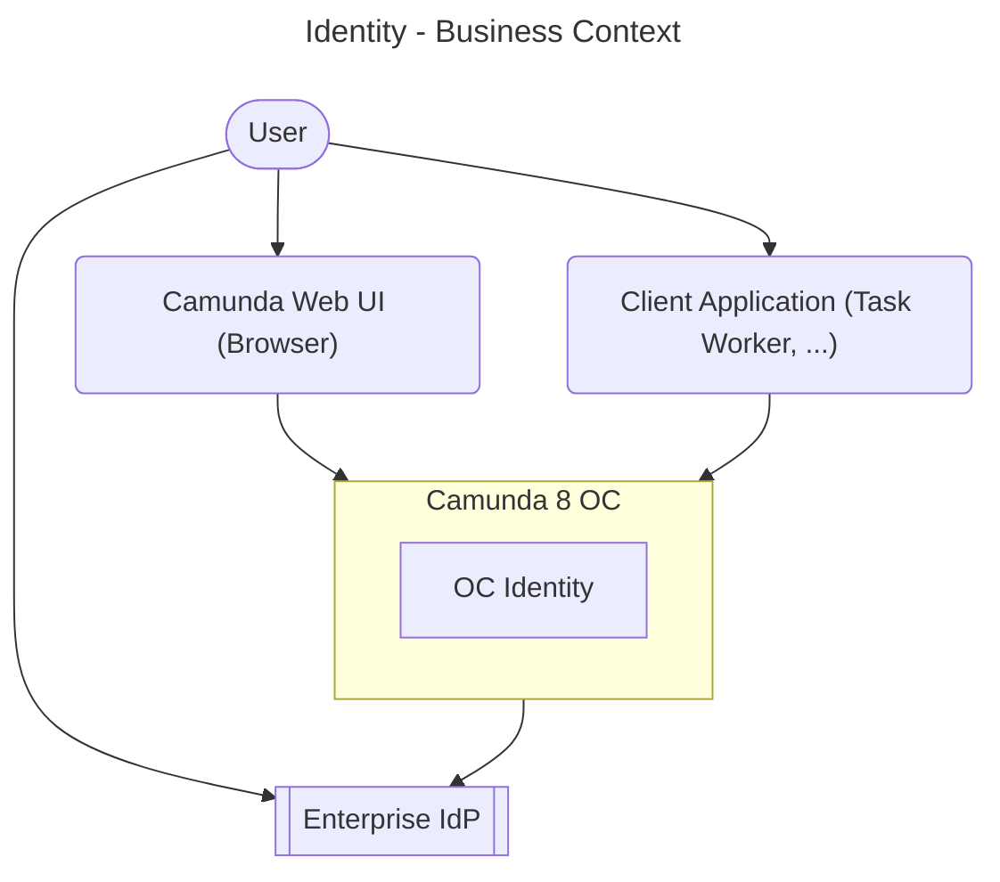
```mermaid
---
title: Identity - Business Context
---
flowchart TB
  USER(["User"])
  WEB_UI("Camunda Web UI (Browser)")
  CLIENT_APP("Client Application (Task Worker, ...)")
  IDP[["Enterprise IdP"]]

  subgraph SAAS_OR_SM["Camunda 8 OC"]
    IDENTITY["OC Identity"]
  end

  USER --> WEB_UI --> SAAS_OR_SM
  USER --> CLIENT_APP --> SAAS_OR_SM
  SAAS_OR_SM --> IDP
  USER --> IDP
```

Entities:

- User: A human performing modeling, operations, or task work.
- User Application: A client application interacting with Camunda either with a camunda client or REST/gRPC API.
- Camunda Web UI: Console, Web Modeler, Operate, Tasklist, Identity
- Camunda Client: Official language clients - Java client and Spring Boot Starter
- Camunda 8 OC (Orchestration Cluster): runtime deployment containing Zeebe, Operate, Tasklist, Identity, REST/gRPC APIs.
- Enterprise IdP: customer IdP providing SSO and tokens via OIDC/SAML (e.g. Okta, Entra, Keycloak, etc.).

### 3.2 Technical context

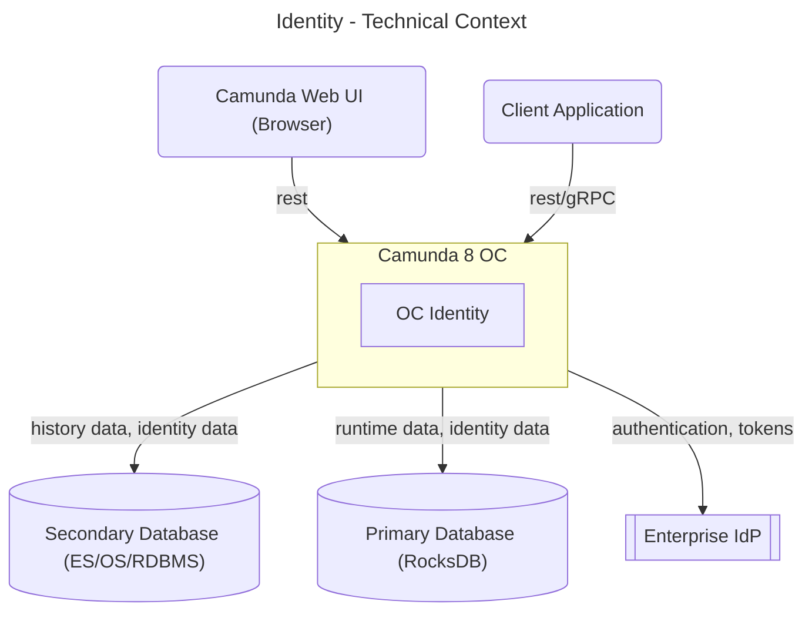
```mermaid
---
title: Identity - Technical Context
---
flowchart TB
  WEB_UI("Camunda Web UI (Browser)")
  CLIENT_APP("Client Application")
  IDP[["Enterprise IdP"]]
  PRIMARY_DB[("Primary Database (RocksDB)")]
  SECONDARY_DB[("Secondary Database (ES/OS/RDBMS)")]

  subgraph SAAS_OR_SM["Camunda 8 OC"]
    IDENTITY["OC Identity"]
  end

  WEB_UI -->|"rest"| SAAS_OR_SM
  CLIENT_APP -->|"rest/gRPC"| SAAS_OR_SM
  SAAS_OR_SM -->|"history data, identity data"| SECONDARY_DB
  SAAS_OR_SM -->|"runtime data, identity data"| PRIMARY_DB
  SAAS_OR_SM -->|"authentication, tokens"| IDP
```

Entities:
- Camunda Web UI: Operate, Tasklist, Admin UI
- Client Application: A client, either using the Camunda Client or REST/gRPC API.
- Camunda 8 OC (Orchestration Cluster): runtime deployment containing the Zeebe Processing engine, Zeebe gRPC API, Orchestration Cluster API  as well ad the Operate, Tasklist, Identity Web Applications along with their deprecated V1 APIs.
- Enterprise IdP: customer IdP providing SSO and tokens via OIDC/SAML (e.g. Okta, Entra, Keycloak, etc.).
- Primary Database: RocksDB used for Zeebe Engine state and OC Identity IAM records.
- Secondary Database: Elasticsearch, OpenSearch, or RDBMS are used for search queries. Contains Runtime, History, and Identity data.

External interfaces (technical):

- Incoming:
  - Browser‑based UIs (Operate, Tasklist, Admin UI) using OIDC or Basic auth.
  - REST/gRPC APIs for workers, service accounts, and applications (Bearer tokens from IdP).
- Outgoing:
  - OIDC IdP for login redirects, token introspection, or validation depending on IdP use.
  - Requests against secondary database for search queries.
- Internal:
  - Calls from UIs and APIs to Authentication and Authorization engine.
  - Persistence of identity entities in primary and secondary storage.

## 4. Solution strategy

Cluster‑embedded identity service
:   Identity runs inside the Orchestration Cluster and is the source of truth for runtime IAM instead of relying on an external system to query for identity data.

Multiple authentication methods
:   Basic for simple Self‑Managed setups and development. OIDC for production with SSO, MFA, and centralized user lifecycle. Optional no‑auth for local or demo scenarios.

Resource‑based authorization
:   Fine‑grained authorizations per resource type and action (for example, PROCESS_DEFINITION:READ, USER_TASK:ASSIGN) across UIs and APIs.

Cluster‑local tenant model
:   Tenants are managed directly in Identity per cluster. Management Identity tenants remain only for Optimize in Self‑Managed.

Adopt the Camunda Security Library
:   Delegate the authorization and authentication decisions themselves to CSL, along with the boundary types they are expressed in (`SecurityContext`, `CamundaAuthentication`, `RequiredAuthorization`, `TenantAccess`), so feature teams introduce new resource and permission types by implementing CSL's ports rather than re‑implementing authorization logic locally.

Reuse of Zeebe storage
:   Identity entities are stored using Zeebe’s existing primary (RocksDB) and secondary (ES/OS/RDBMS) storage instead of a separate identity database.

## 5. Building block view

### 5.1 Whitebox overall system

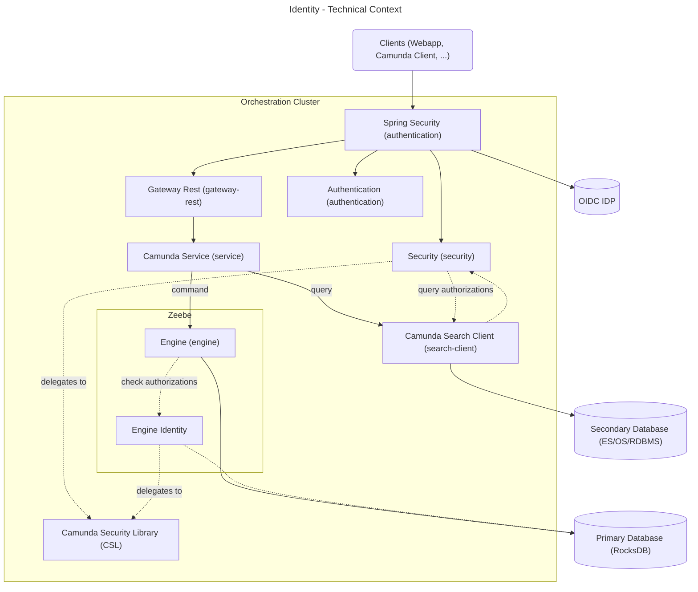
```mermaid
---
title: Identity - Technical Context
---
flowchart TB
  CLIENTS("Clients (Webapp, Camunda Client, ...)")
  IDP[("OIDC IDP")]
  PRIMARY_DB[("Primary Database (RocksDB)")]
  SECONDARY_DB[("Secondary Database (ES/OS/RDBMS)")]

  subgraph CLUSTER["Orchestration Cluster"]
    REST["Gateway Rest (gateway-rest)"]
    SPRING_SECURITY["Spring Security (authentication)"]
    CAMUNDA_SERVICES["Camunda Service (service)"]
    CAMUNDA_SEARCH_CLIENT["Camunda Search Client (search-client)"]
    AUTHENTICATION["Authentication (authentication)"]
    SECURITY["Security (security)"]
    CSL["Camunda Security Library (CSL)"]

    subgraph ZEEBE["Zeebe"]
        ENGINE["Engine (engine)"] -.->|"check authorizations"| ENGINE_IDENTITY["Engine Identity"]
    end

    SPRING_SECURITY --> AUTHENTICATION
    SPRING_SECURITY --> SECURITY
    REST --> CAMUNDA_SERVICES -->|"query"| CAMUNDA_SEARCH_CLIENT -.-> SECURITY -.->|"query authorizations"| CAMUNDA_SEARCH_CLIENT
    CAMUNDA_SERVICES -->|"command"| ENGINE
  end

  CLIENTS --> SPRING_SECURITY --> REST
  CAMUNDA_SEARCH_CLIENT --> SECONDARY_DB
  ENGINE --> PRIMARY_DB
  ENGINE_IDENTITY -.-> PRIMARY_DB
  SPRING_SECURITY --> IDP
  SECURITY -.->|"delegates to"| CSL
  ENGINE_IDENTITY -.->|"delegates to"| CSL
```

Main building blocks:

- Gateway Rest: Orchestration Cluster REST API (v2), Administration API, Web Modeler API
- Camunda Services: Enhances the commands and queries with the given authentication and the necessary authorizations.
- Camunda Search Client: Used for querying the secondary database against ES, OS, or RDBMS, depending on the configuration.
- Authentication: Contains authentication-related converters, helpers, utils, and services among others for spring security.
- Security: Builds the CSL security context for a request and provides shared security helpers used by authentication components; authorization decisions themselves are delegated to CSL.
- Zeebe: Is responsible for processing commands and storing state.
- Engine: Processes commands and applies state changes. Uses (engine) identity to check permissions for user- or client-initiated operations.
- Engine Identity: Engine-side adapters that bridge Zeebe's RocksDB state to CSL's authorization/tenant ports; the actual authorization/tenant logic lives in CSL, there is no own module for it, the adapters live directly in the engine in "identity".
- Primary Database: RocksDB used for Zeebe Engine state and OC Identity IAM records.
- Secondary Database: Elasticsearch, OpenSearch, or RDBMS used for search queries. Contains Runtime, History, and Identity data.
- Camunda Security Library (CSL): Library that performs the authorization and authentication decisions and assembles the Spring Security filter chain, and that supplies the boundary types OC passes across it (`SecurityContext`, `CamundaAuthentication`, `RequiredAuthorization`, `TenantAccess`). Developed in a separate repository ([camunda/camunda-security-library](https://github.com/camunda/camunda-security-library)) but compiled into the Orchestration Cluster artifact, not a remote service. Consumed as `camunda-security-library-api`, `-core`, `-spring-boot-starter`, and `-validation`, version pinned by the `version.camunda-security-library` property in `parent/pom.xml`.

#### CSL extension points and OC's adapters

CSL follows a ports-and-adapters design: it owns the authorization and authentication logic and
declares extension points for everything it needs from the host. The two tables below are the
contract surface between the two repositories — CSL's internal behaviour is documented in the
[CSL architecture documentation](https://github.com/camunda/camunda-security-library/blob/main/docs/architecture/05-building-block-view.md),
sections 5.4 (hexagonal architecture) and 5.5 (engine authorization integration), and is not
repeated here.

Two kinds of type cross the boundary, and they point in opposite directions:

- **Callback extension points** — interfaces CSL declares and *calls into*. OC implements them, so
  CSL can reach host data (RocksDB, the search index, the session store) and host decisions without
  depending on OC. Not all are named `*Port`.
- **Data contracts** — shapes OC's *own* domain types implement so CSL can *read* them. No adapter
  is involved; the coupling is that OC's entities carry the members CSL expects.

Both couple at compile time, which is why both are named here (see the naming convention below), but
only the first is a ports-and-adapters seam.

**Naming convention used in this document and the linked authorization docs.** A CSL class name may
appear here only if it falls into one of two categories, both defined by whether a rename on CSL's
side would break our build:

1. **Types OC implements or extends** — everything in the two tables below. This half is mechanical:
   the tables *are* the list, and the sweep described under [10. Risks](#10-risks-and-technical-debt)
   regenerates it.
2. **Types OC builds the value of and passes across the boundary** — `RequiredAuthorization`,
   `SecurityContext`, `TenantAccess`, `AuthorizationCondition`, `ResourceAccessChecks`. OC code
   populates these field by field on the way in or reads them on the way out.

Everything else on CSL's side is referred to by role ("Basic Auth Converter (CSL)"), never by class
name, so a refactor behind the boundary does not oblige a change here.

Note that "does the name appear in an OC `.java` file" is *not* the test, and would give the wrong
answer. The test for category 2 is narrower than "OC holds a reference to it": does OC's own code
populate the value's fields, or does OC only receive an already-built instance and pass it on
unread? Only the former qualifies.

`AuthorizationChecker` is the case to check a proposed name against: it is referenced by 14
non-test OC files, yet it is used nowhere in these docs to describe the engine or REST check paths —
those say "the CSL check" instead. OC obtains one from `AuthorizationCheckerFactory.forPhysicalTenant`
and hands it straight to `DefaultResourceAccessProvider` without ever reading it, so it is an opaque
handle rather than a value OC builds; category 2 turns on constructing the value, not on holding the
reference. Package location does not decide it either — `AuthorizationChecker` sits in `core.authz`,
the same package as `ResourceAccessProvider` and `TenantAccess`, which are both named here.

##### Callback extension points

|    CSL package     |                  Type                   |                                                                                                       OC implementation                                                                                                        |
|--------------------|-----------------------------------------|--------------------------------------------------------------------------------------------------------------------------------------------------------------------------------------------------------------------------------|
| `core.port.in`     | `AuthorizationCheckPort`                | Primarily consumed. `TenantAwareAuthorizationCheckPort` (`dist`) routes each request to the per-physical-tenant port CSL assembles                                                                                             |
| `core.port.in`     | `CamundaUserPort`                       | `BasicCamundaUserService` (`authentication`)                                                                                                                                                                                   |
| `core.port.out`    | `AuthorizationScopeRepositoryPort`      | `SearchAuthorizationScopeRepository` (`security-services`, secondary storage) · `AuthorizationScopeStateAdapter` (`zeebe/engine`, RocksDB)                                                                                     |
| `core.port.out`    | `MembershipPort`                        | `DefaultMembershipService` / `NoDBMembershipService` (`authentication`) · `MembershipStateAdapter` (`zeebe/engine`)                                                                                                            |
| `core.port.out`    | `BasicAuthUserDetailsPort`              | `BasicAuthUserDetailsAdapter` (`authentication`)                                                                                                                                                                               |
| `core.port.out`    | `SessionStorePort`                      | `SessionStoreAdapter` (`authentication`)                                                                                                                                                                                       |
| `core.port.out`    | `ScopedSessionStorePortProvider`        | `PhysicalTenantScopedSessionStorePortProvider` (`authentication`) — hands out one `SessionStorePort` per physical tenant                                                                                                       |
| `core.port.out`    | `SecurityPathPort`                      | `SecurityPathAdapter` (`authentication`)                                                                                                                                                                                       |
| `core.port.out`    | `AdminUserPresencePort`                 | `AdminUserPresenceAdapter` (`authentication`) — answers whether an admin user is provisioned, which gates CSL's setup-redirect filter                                                                                          |
| `core.port.out`    | `AuthorizedComponentsPort`              | `AuthorizedComponentsAdapter` (`authentication`) — resolves which webapp components the principal may open, for `/v2/authentication/me`                                                                                        |
| `core.authz`       | `ResourceAccessProvider`                | `DefaultResourceAccessProvider` (`search-client-query-transformer`)                                                                                                                                                            |
| `core.authz`       | `ResourceAccessController`              | `AbstractResourceAccessController` (`search-client`) and its subclasses `DocumentBasedResourceAccessController` / `RdbmsResourceAccessController` · `AnonymousResourceAccessController` · `ResourceAccessDelegatingController` |
| `api.context`      | `CamundaAuthenticationConverter`        | `ClusterAdminAuthenticationConverter` (`authentication`) — membership-free principal for cluster admins, registered ahead of CSL's DB-backed converter                                                                         |
| `api.context`      | `CamundaSecurityScopeProvider`          | `PhysicalTenantScopeProvider` (`authentication`) — one security descriptor per configured physical tenant, from which CSL builds the per-tenant filter chains                                                                  |
| `api.context`      | `MembershipResolutionContextPropagator` | `PhysicalTenantMembershipContextPropagator` (`authentication`) — rebinds the physical tenant around lazy membership lookups that resolve outside request scope                                                                 |
| `spring.converter` | `OidcUserAuthenticationConverter`       | `ProviderAwareOidcUserAuthenticationConverter` (`authentication`) extends it to pick the right converter per configured IdP (see [5.2.1](#521-authentication---level-2))                                                       |
| `spring.oidc`      | `OidcTokenEndpointCustomizer`           | `OidcTokenEndpointCustomizer` (`authentication`) — builds the `private_key_jwt` client assertion converter (see [6.3.2](#632-oidc-with-private_key_jwt-client-authentication))                                                 |
| `spring.security`  | `OidcResourceServerCustomizer`          | `ProtectedResourceMetadataCustomizer` (`authentication`)                                                                                                                                                                       |
| `spring.session`   | `WebSessionAttributeConverter`          | `MigratingWebSessionAttributeConverter` (`dist`)                                                                                                                                                                               |
| `spring.spi`       | `WebAppProviderPort`                    | `WebAppProviderAdapter` (`authentication`) — derives the web app id from the request path prefix                                                                                                                               |

The pattern to note: the authorization *read* ports each have two implementations, one per storage
layer — search-index-backed for the REST layer, RocksDB-backed for the engine.

Optimize is out of scope for this table. It wires CSL separately and supplies its own adapters, some
of them stubs; one CSL extension point (`spring.spi.OidcAuthenticationEntryPoint`) is implemented
only there and so appears in neither table.

##### Data contracts

These are not adapters. CSL declares the shape, and OC's own domain types carry it so CSL can read
them directly.

|            CSL package            |                                        Type                                        |                                                                          OC types implementing it                                                                           |
|-----------------------------------|------------------------------------------------------------------------------------|-----------------------------------------------------------------------------------------------------------------------------------------------------------------------------|
| `core.authz`                      | `TenantOwnedEntity`                                                                | 21 `search-domain` entities (`ProcessDefinitionEntity`, `UserTaskEntity`, `IncidentEntity`, `VariableEntity`, …) — the marker by which CSL recognises a tenant-owned record |
| `core.auth`                       | `MappingRuleMatcher` (and its nested `MappingRule`)                                | `MappingRuleEntity` (`search-domain`) · `PersistedMappingRule` (`zeebe/engine`) · `ClusterAdminJwtAuthenticationConverter` (`authentication`)                               |
| `api.model.config.initialization` | `ConfiguredAuthorization`, `ConfiguredGroup`, `ConfiguredRole`, `ConfiguredTenant` | the four configurers in `zeebe/engine/.../processing/identity/initialize/`                                                                                                  |
| `spring`                          | `CamundaSecurityLibraryProperties`                                                 | `Security` (`configuration`)                                                                                                                                                |

### 5.2 Building Blocks

#### 5.2.1 Authentication - Level 2

The Authentication building block provides configuration classes, converters, and helpers that extend Spring Security.
CSL's Spring Boot auto-configuration assembles the Spring Security filter chain stack by default (Spring Security itself still performs the actual token exchange and IdP communication); local `BasicAuthBeansConfiguration` and `OidcOverrideBeansConfiguration` supply OC-specific override beans that CSL backs off from via `@ConditionalOnMissingBean`.
Authentication classes enrich the resulting principal with Camunda-specific claims (groups, roles, tenants) and persist sessions.

To keep it simple, we describe the Basic Auth and OIDC flows separately, but they share several components, notably the Authentication Provider and the Session Repository, both supplied by CSL.

##### Basic Auth flow

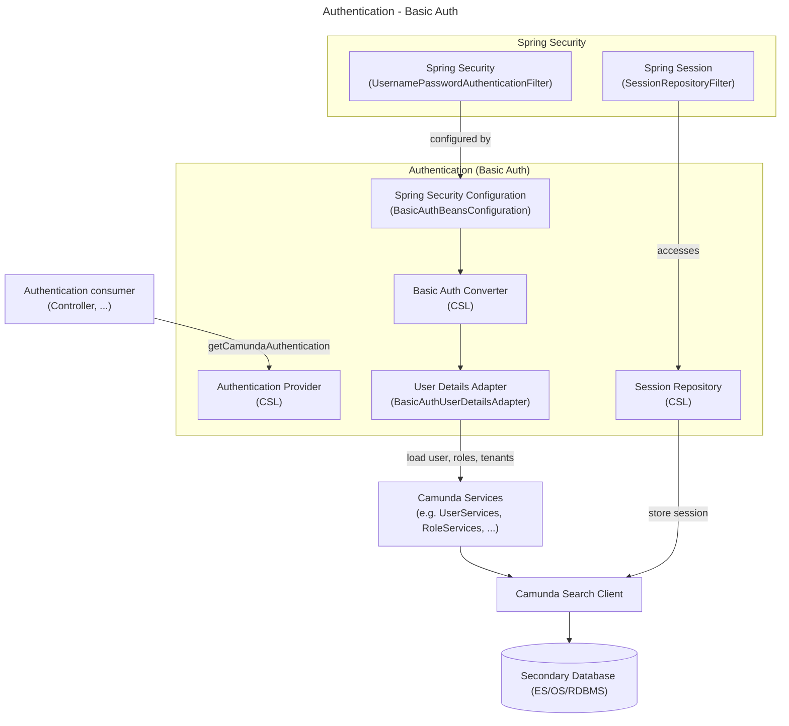
```mermaid
---
title: Authentication - Basic Auth
---
flowchart TB
  AUTH_CONSUMER["Authentication consumer</br> (Controller, ...)"] -->|"getCamundaAuthentication"| AUTH_PROVIDER

  subgraph SPRING_SECURITY["Spring Security"]
    SPRING_FILTER["Spring Security</br>(UsernamePasswordAuthenticationFilter)"]
    SPRING_SESSION["Spring Session</br>(SessionRepositoryFilter)"]
  end

  subgraph AUTHENTICATION_BASIC["Authentication (Basic Auth)"]
    WEB_SEC_CFG["Spring Security Configuration</br>(BasicAuthBeansConfiguration)"]
    BASIC_CONV["Basic Auth Converter</br>(CSL)"]
    USER_DETAILS["User Details Adapter</br>(BasicAuthUserDetailsAdapter)"]
    SESSION_MGR["Session Repository</br>(CSL)"]
    AUTH_PROVIDER["Authentication Provider</br>(CSL)"]

    WEB_SEC_CFG --> BASIC_CONV
    BASIC_CONV --> USER_DETAILS
  end

  CAMUNDA_SEARCH_CLIENT["Camunda Search Client"]
  SECONDARY_DB[("Secondary Database (ES/OS/RDBMS)")]

  SPRING_FILTER -->|"configured by"| WEB_SEC_CFG
  SPRING_SESSION -->|"accesses"| SESSION_MGR

  USER_DETAILS -->|"load user, roles, tenants"| CAMUNDA_SERVICES
  CAMUNDA_SERVICES["Camunda Services</br>(e.g. UserServices, RoleServices, ...)"] --> CAMUNDA_SEARCH_CLIENT --> SECONDARY_DB
  SESSION_MGR -->|"store session"| CAMUNDA_SEARCH_CLIENT
```

Key responsibilities:

- Spring Security Configuration (`BasicAuthBeansConfiguration`): local `@Configuration` class, imported by `WebSecurityConfig`, activated by `camunda.security.authentication.method=basic`. CSL's auto-configuration assembles the Basic auth filter chain by default; this class and `WebSecurityConfig` itself supply OC's override beans on top of it, including the `usernamePasswordAuthenticationConverter` and `basicAuthUserDetailsPort` beans.
- User Details Adapter (`BasicAuthUserDetailsAdapter`): local implementation of CSL's `BasicAuthUserDetailsPort` (registered in `WebSecurityConfig`), looking up the user's credentials, roles, and tenants via Camunda Services.
- Basic Auth Converter (CSL): converts Basic auth credentials (username/password or clientId/secret) into a `CamundaAuthentication`, using OC's `BasicAuthUserDetailsAdapter` for credential verification and OC's `MembershipPort` implementation for role/tenant membership.
- Authentication Provider (CSL): bridges Spring Security to the Camunda authentication context via `CamundaAuthentication`.
- Session Repository (CSL): implements Spring Session's `SessionRepository` interface and manages server‑side sessions backed by secondary storage via the local `PersistentWebSessionClient` (`search/search-client`). Wired locally by `WebSessionRepositoryConfiguration` (`dist`) — so the repository is CSL's, but the storage behind it is OC's.

External responsibilities:

- Spring Security (`UsernamePasswordAuthenticationFilter`): performs the actual credential extraction and delegates to the configured converter.
- Camunda Services: provide access to user, role, group, tenant, and mapping rule data via the Camunda Search Client (secondary database). Used services include `UserServices`, `RoleServices`, `GroupServices`, `TenantServices`, and `MappingRuleServices`.
- Camunda Search Client: used to query the secondary database for user, role, tenant and mapping rule data during authentication, or in case of the Session Repository to store the session.

##### OIDC flow

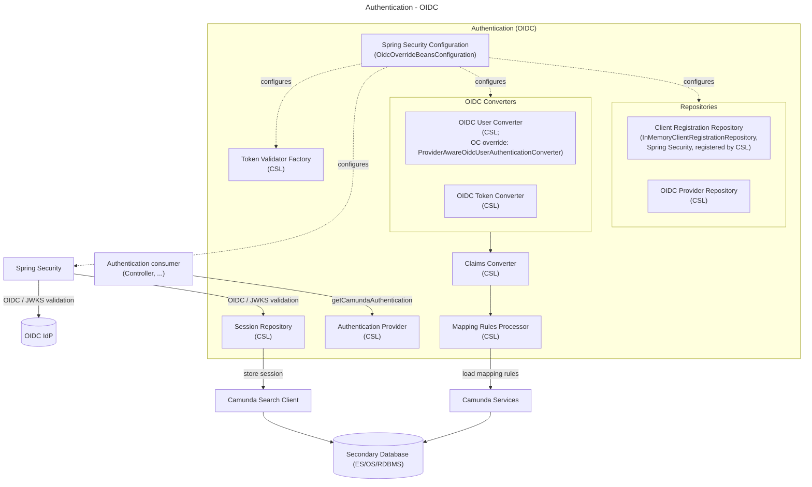
```mermaid
---
title: Authentication - OIDC
---
flowchart TB
  subgraph AUTHENTICATION_OIDC["Authentication (OIDC)"]
    WEB_SEC_CFG["Spring Security Configuration</br>(OidcOverrideBeansConfiguration)"]

    subgraph OIDC_CONV["OIDC Converters"]
      OIDC_USER_CONV["OIDC User Converter</br>(CSL;</br>OC override: ProviderAwareOidcUserAuthenticationConverter)"]
      OIDC_TOKEN_CONV["OIDC Token Converter</br>(CSL)"]
    end

    subgraph REPOSITORIES["Repositories"]
      CLIENT_REG_REPO["Client Registration Repository</br>(InMemoryClientRegistrationRepository,</br>Spring Security, registered by CSL)"]
      OIDC_PROVIDER_REPO["OIDC Provider Repository</br>(CSL)"]
    end

    TOKEN_VALIDATOR["Token Validator Factory</br>(CSL)"]

    CLAIMS_CONV["Claims Converter</br>(CSL)"]
    MAPPING_RULES_PROC["Mapping Rules Processor</br>(CSL)"]
    SESSION_MGR["Session Repository</br>(CSL)"]
    AUTH_PROVIDER["Authentication Provider</br>(CSL)"]

    WEB_SEC_CFG -.->|"configures"| OIDC_CONV
    WEB_SEC_CFG -.->|"configures"| REPOSITORIES
    WEB_SEC_CFG -.->|"configures"| TOKEN_VALIDATOR

    OIDC_CONV --> CLAIMS_CONV
    CLAIMS_CONV --> MAPPING_RULES_PROC
  end

  AUTH_CONSUMER["Authentication consumer</br> (Controller, ...)"] -->|"getCamundaAuthentication"| AUTH_PROVIDER

  SPRING_SECURITY["Spring Security"]

  IDP[("OIDC IdP")]
  CAMUNDA_SERVICES["Camunda Services"]
  CAMUNDA_SEARCH_CLIENT["Camunda Search Client"]
  SECONDARY_DB[("Secondary Database (ES/OS/RDBMS)")]

  WEB_SEC_CFG -.->|"configures"| SPRING_SECURITY
  SPRING_SECURITY -->|"OIDC / JWKS validation"| IDP & SESSION_MGR
  MAPPING_RULES_PROC -->|"load mapping rules"| CAMUNDA_SERVICES
  CAMUNDA_SERVICES --> SECONDARY_DB
  SESSION_MGR -->|"store session"| CAMUNDA_SEARCH_CLIENT --> SECONDARY_DB
```

Key responsibilities:

- Spring Security Configuration (`OidcOverrideBeansConfiguration`): local `@Configuration` class, imported by `WebSecurityConfig`, activated by `camunda.security.authentication.method=oidc`. CSL's auto-configuration assembles the OIDC filter chain stack by default; this class overrides the beans OC needs bespoke behavior for (multi-IdP support, issuer-aware JWT decoding, `private_key_jwt`, observability instrumentation), and CSL backs off from them via `@ConditionalOnMissingBean`:
  - Client Registration Repository (`InMemoryClientRegistrationRepository` -- a Spring Security class, registered by CSL by default): holds the OAuth2 client registrations (one per configured OIDC provider).
  - OIDC Provider Repository (CSL): reads the OIDC provider configuration (issuer URIs, client credentials, additional JWKS URIs) from `SecurityConfiguration`.
  - OAuth2AuthorizedClientRepository (`HttpSessionOAuth2AuthorizedClientRepository` -- a Spring Security class, registered by CSL by default): stores authorized client state in the HTTP session.
  - OIDC Token Converter (CSL): converts Bearer JWTs (M2M) into a `CamundaAuthentication` (OIDC M2M only).
  - OIDC User Converter (CSL): post-processes the OIDC user for the browser login flow. OC overrides it with `ProviderAwareOidcUserAuthenticationConverter` (`authentication/`) to pick the right converter per configured IdP — the OIDC counterpart to `BasicAuthUserDetailsAdapter` on the Basic auth path. Unlike the other beans in this list it extends a CSL class rather than replacing it, so it is listed among the [callback extension points](#callback-extension-points).
- Claims Converter (CSL): converts token claims into a `CamundaAuthentication`; group, role, and tenant memberships come from OC's `MembershipPort` implementation.
- Mapping Rules Processor (CSL): applies mapping rules to IdP claims, yielding roles, groups, tenants, and authorizations. The rules themselves are OC data, loaded via `MappingRuleServices`.
- Authentication Provider (CSL): bridges Spring Security to the Camunda authentication context via `CamundaAuthentication`.
- Session Repository (CSL): implements Spring Session's `SessionRepository` interface and manages server‑side sessions backed by secondary storage via the local `PersistentWebSessionClient` (`search/search-client`). Wired locally by `WebSessionRepositoryConfiguration` (`dist`) — so the repository is CSL's, but the storage behind it is OC's.

External responsibilities:

- Spring Security (`OAuth2LoginAuthenticationFilter`, `BearerTokenAuthenticationFilter`): manages the OIDC authorization code flow and Bearer token validation, using stock Spring Security components not shown in the diagram — `SupplierJwtDecoder` (Bearer JWT decoding, single- or issuer-aware multi-provider), `DefaultOAuth2AuthorizedClientManager` (authorized client state for the authorization code, refresh token, and client credentials flows, including `private_key_jwt` — see [6.3.2](#632-oidc-with-private_key_jwt-client-authentication)), and `OidcUserService` (userinfo lookup during browser login).
- OIDC IdP: issues ID tokens, access tokens, and JWKS for signature verification.
- Camunda Services: provide access to role, group, tenant, and mapping rule data via the Camunda Search Client (secondary database). Used services include `RoleServices`, `GroupServices`, `TenantServices`, and `MappingRuleServices` (via `DefaultMembershipService`).
- Camunda Search Client: used to query the secondary database for user, role, tenant and mapping rule data during authentication, or in case of the Session Repository to store the session.

#### 5.2.2 Security - Level 2

The Security building block provides authorization checks for REST queries executed via the Camunda Search Client.
It builds the CSL security context for a query and adapts CSL's authorization decision into a search-engine filter, ensuring that search results are filtered according to the caller's permissions. The permission evaluation itself is owned by CSL, not by this module.

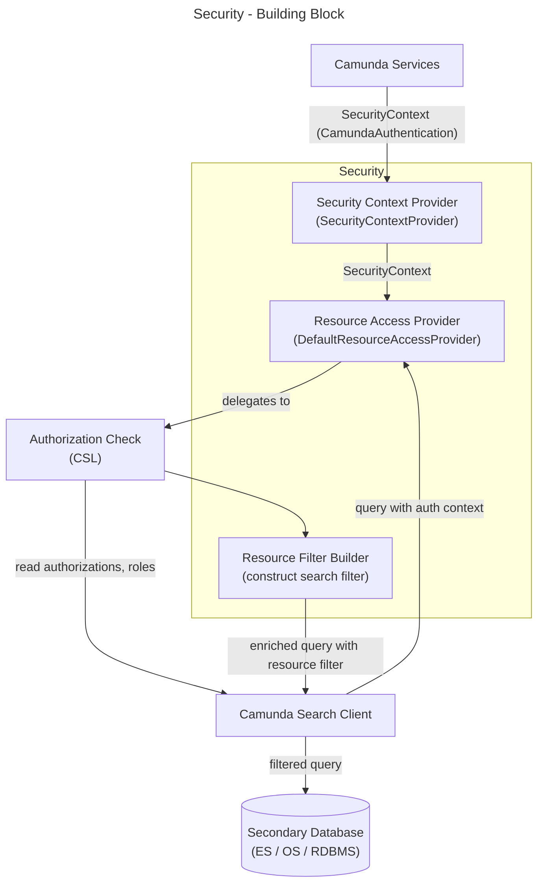
```mermaid
---
title: Security - Building Block
---
flowchart TB
  subgraph SECURITY["Security"]
    SC_PROVIDER["Security Context Provider</br>(SecurityContextProvider)"]
    AUTHZ_CHECKER["Resource Access Provider</br>(DefaultResourceAccessProvider)"]
    RESOURCE_FILTER["Resource Filter Builder</br>(construct search filter)"]
  end

  CSL_CHECKER["Authorization Check</br>(CSL)"]
  CAMUNDA_SERVICES["Camunda Services"]
  CAMUNDA_SEARCH_CLIENT["Camunda Search Client"]
  SECONDARY_DB[("Secondary Database</br>(ES / OS / RDBMS)")]

  CAMUNDA_SERVICES -->|"SecurityContext (CamundaAuthentication)"| SC_PROVIDER
  SC_PROVIDER -->|"SecurityContext"| AUTHZ_CHECKER
  CAMUNDA_SEARCH_CLIENT -->|"query with auth context"| AUTHZ_CHECKER
  AUTHZ_CHECKER -->|"delegates to"| CSL_CHECKER
  CSL_CHECKER -->|"read authorizations, roles"| CAMUNDA_SEARCH_CLIENT
  CSL_CHECKER --> RESOURCE_FILTER
  RESOURCE_FILTER -->|"enriched query with resource filter"| CAMUNDA_SEARCH_CLIENT
  CAMUNDA_SEARCH_CLIENT -->|"filtered query"| SECONDARY_DB
```

Key responsibilities:

- Security Context Provider (`SecurityContextProvider`): builds CSL's `SecurityContext` combining CSL's `CamundaAuthentication` with a `RequiredAuthorization`/`AuthorizationCondition` before a query is executed.
- Resource Access Provider (`DefaultResourceAccessProvider`): OC's implementation of CSL's `ResourceAccessProvider`; entry point for checking whether the caller may perform a given action on a resource type. It hands the decision to CSL's authorization check and uses the local `ResourcePropertyMatcherRegistry` to resolve resource-property constraints.
- Authorization Check (CSL): evaluates the caller's permissions. It reads authorization and role data exclusively through OC's `AuthorizationScopeRepositoryPort` implementation, which queries the Camunda Search Client — CSL never touches the secondary database directly.
- Resource Filter Builder: translates the resulting permissions into a search‑engine filter that restricts query results to authorized resources only.
- Physical-tenant scoping: CSL assembles one `AuthorizationCheckPort` per physical-tenant scope, wired locally by `WebAppAuthorizationCheckPortConfiguration` (`dist`); the local `TenantAwareAuthorizationCheckPort` selects the port matching the current request's scope. The `ResourceAccessProvider` side fans out the same way but through a type of OC's own: `ResourceAccessControllerConfiguration` (`dist`) builds one `DefaultResourceAccessProvider` per tenant, each over its own `SearchAuthorizationScopeRepository`, and the local `PhysicalTenantResourceAccessProvider` record selects between them — it is a registry keyed by physical tenant, not itself an implementation of CSL's `ResourceAccessProvider`. Services that hold the check directly rather than going through the data plane (`DocumentServices`, `SecretServices`) get a per-physical-tenant instance from OC's `AuthorizationCheckerFactory` (`security-services`), collected by `AuthorizationCheckerProvider` (`dist`). The engine path has no such fan-out (see [5.2.3](#523-engine-identity---level-2)).

#### 5.2.3 Engine Identity - Level 2

Engine Identity is the set of engine-side adapters that bridge Zeebe's RocksDB state to CSL's authorization and tenant ports.
It intercepts engine commands (such as creating process instances or completing user tasks) and enforces authorization before the command is applied.
The authorization/tenant decision logic itself lives in CSL; this building block does not communicate with the external IdP directly.

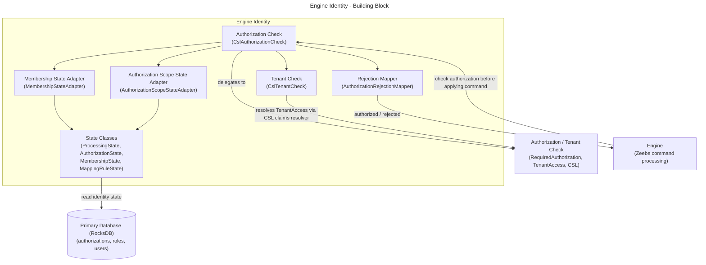
```mermaid
---
title: Engine Identity - Building Block
---
flowchart TB
  subgraph ENGINE_IDENTITY["Engine Identity"]
    AUTHZ_CHECK["Authorization Check</br>(CslAuthorizationCheck)"]
    TENANT_CHECK["Tenant Check</br>(CslTenantCheck)"]
    MEMBERSHIP_ADAPTER["Membership State Adapter</br>(MembershipStateAdapter)"]
    SCOPE_ADAPTER["Authorization Scope State Adapter</br>(AuthorizationScopeStateAdapter)"]
    REJECTION_MAPPER["Rejection Mapper</br>(AuthorizationRejectionMapper)"]
    STATE_CLASSES["State Classes</br>(ProcessingState, AuthorizationState,</br>MembershipState, MappingRuleState)"]

    AUTHZ_CHECK --> TENANT_CHECK
    AUTHZ_CHECK --> MEMBERSHIP_ADAPTER
    AUTHZ_CHECK --> SCOPE_ADAPTER
    AUTHZ_CHECK --> REJECTION_MAPPER
    MEMBERSHIP_ADAPTER --> STATE_CLASSES
    SCOPE_ADAPTER --> STATE_CLASSES
  end

  CSL_PORTS["Authorization / Tenant Check</br>(RequiredAuthorization, TenantAccess, CSL)"]
  ENGINE["Engine</br>(Zeebe command processing)"]
  PRIMARY_DB[("Primary Database (RocksDB)</br>(authorizations, roles, users)")]

  ENGINE -->|"check authorization before applying command"| AUTHZ_CHECK
  AUTHZ_CHECK -->|"delegates to"| CSL_PORTS
  TENANT_CHECK -->|"resolves TenantAccess via CSL claims resolver"| CSL_PORTS
  REJECTION_MAPPER -->|"authorized / rejected"| ENGINE
  STATE_CLASSES -->|"read identity state"| PRIMARY_DB
```

Key responsibilities:

- Authorization Check (`CslAuthorizationCheck`): main entry point; receives the command authentication context (derived from upstream `CamundaAuthentication`) and a CSL `RequiredAuthorization` describing the requested resource and action, and decides whether to allow or deny the command by delegating to CSL's `AuthorizationCheckPort`. It does not read directly from RocksDB.
- Tenant Check (`CslTenantCheck`): resolves the set of tenants the principal is authorized for as a CSL `TenantAccess`, using membership state and mapping rules read from primary storage via the adapters below. Replaces the previous local, identity-sense `TenantResolver` (unrelated to the physical-tenancy `PhysicalTenantResolver`, which still exists).
- Membership State Adapter (`MembershipStateAdapter`): implements CSL's membership-lookup port, resolving username, clientId, and group/role/tenant memberships for the command's principal from the engine's State classes. Replaces the previous local `ClaimsExtractor`.
- Authorization Scope State Adapter (`AuthorizationScopeStateAdapter`): implements CSL's `AuthorizationScopeRepositoryPort`, resolving the authorization scopes (permissions) granted to a principal from the engine's State classes.
- Rejection Mapper (`AuthorizationRejectionMapper`): maps CSL's authorization/tenant rejections back to Zeebe's `Rejection` types.
- State classes (`ProcessingState`, `AuthorizationState`, `MembershipState`, `MappingRuleState`): abstract the RocksDB state access; the adapters above read all identity state (authorizations, roles, memberships, mapping rules) through these classes.
- `PermissionsBehavior` (top-level `processing/identity/`, not shown above): a separate, OC-owned behavior for command *processing* (e.g. applying permission-changing events), distinct from the authorization *check* gate described above.

## 6. Runtime view

The sequence diagrams below are wide. On the Camunda Platform docs site (Docusaurus) they are easier to read [on GitHub](https://github.com/camunda/camunda/blob/main/identity/docs/architecture.md), which supports zooming.

Component responsibilities are described once in [5.2 Building Blocks](#52-building-blocks). The flows below only list participants that section does not already cover.

### 6.1 User login

#### 6.1.1 Basic Auth

Scenario: human user logs into Operate or Tasklist using username and password (Form Login).

1. Browser navigates to a cluster UI (for example Operate).
2. Spring Security redirects the browser to the built-in login form.
3. User submits credentials; Spring Security delegates to the Basic Auth Converter (CSL).
4. The converter verifies the credentials via `BasicAuthUserDetailsAdapter` and resolves roles and tenants via CSL's `MembershipPort`, both backed by Camunda Services (which queries the Secondary Database through the Camunda Search Client) — no external IdP is involved.
5. CSL's Authentication Provider creates a `CamundaAuthentication` object
6. The Session Repository stores the session in secondary storage
7. Subsequent requests are authenticated via the session.

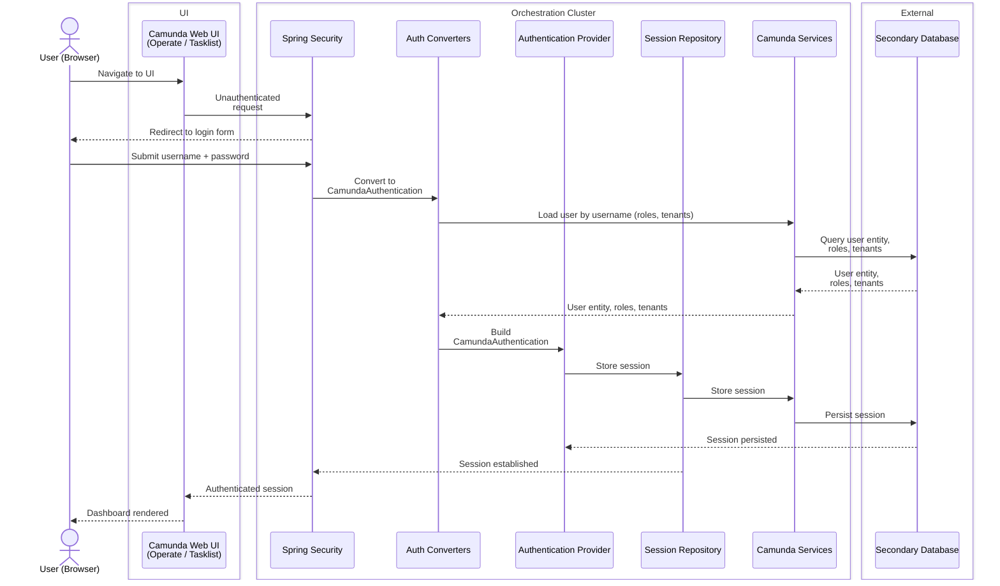
```mermaid
sequenceDiagram
  actor USER as User (Browser)
  box UI
    participant UI as Camunda Web UI<br/>(Operate / Tasklist)
  end
  box Orchestration Cluster
    participant SPRING_SECURITY as Spring Security
    participant AUTH_CONVERTERS as Auth Converters
    participant AUTHN_PROVIDER as Authentication Provider
    participant SESSION as Session Repository
    participant CAMUNDA_SERVICES as Camunda Services
  end
  box External
    participant SECONDARY_DB as Secondary Database
  end

  USER->>UI: Navigate to UI
  UI->>SPRING_SECURITY: Unauthenticated <br>request
  SPRING_SECURITY-->>USER: Redirect to login form
  USER->>SPRING_SECURITY: Submit username + password
  SPRING_SECURITY->>AUTH_CONVERTERS: Convert to <br>CamundaAuthentication
  AUTH_CONVERTERS->>CAMUNDA_SERVICES: Load user by username (roles, tenants)
  CAMUNDA_SERVICES->>SECONDARY_DB: Query user entity,<br> roles, tenants
  SECONDARY_DB-->>CAMUNDA_SERVICES: User entity,<br> roles, tenants
  CAMUNDA_SERVICES-->>AUTH_CONVERTERS: User entity, roles, tenants
  AUTH_CONVERTERS->>AUTHN_PROVIDER: Build <br>CamundaAuthentication
  AUTHN_PROVIDER->>SESSION: Store session
  SESSION->>CAMUNDA_SERVICES: Store session
  CAMUNDA_SERVICES->>SECONDARY_DB: Persist session
  SECONDARY_DB-->>AUTHN_PROVIDER: Session persisted
  SESSION-->>SPRING_SECURITY: Session established
  SPRING_SECURITY-->>UI: Authenticated session
  UI-->>USER: Dashboard rendered
```

#### 6.1.2 OIDC

Scenario: human user logs into Operate or Tasklist via OIDC.

1. Browser navigates to a cluster UI (for example Operate).
2. Spring Security redirects the browser to the external IdP for login.
3. IdP authenticates the user and returns ID/access tokens.
4. Identity validates the token, extracts username and group or attribute claims, and applies mapping rules.
5. Subsequent UI or API calls include the session and are authorized. Logout behavior, including RP‑initiated logout back to the IdP, is described in [RP‑initiated logout](references/rp-initiated-logout.md).

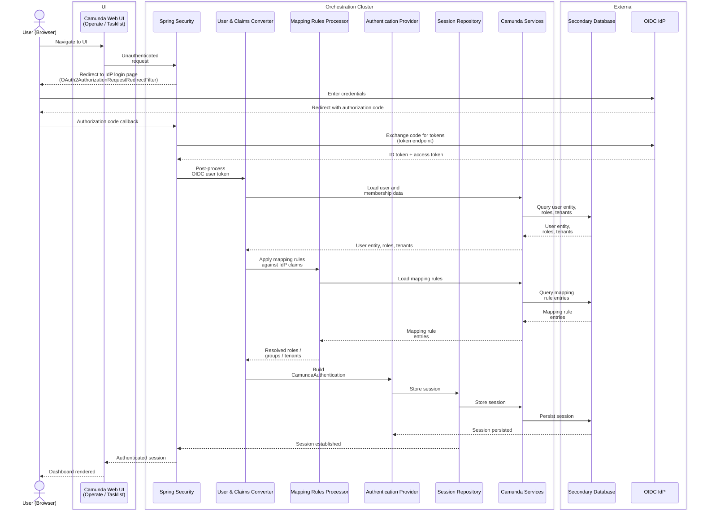
```mermaid
sequenceDiagram
  actor USER as User (Browser)
  box UI
    participant UI as Camunda Web UI<br/>(Operate / Tasklist)
  end
  box Orchestration Cluster
    participant SPRING_SECURITY as Spring Security
    participant CONVERTER as User & Claims Converter
    participant MAPPING as Mapping Rules Processor
    participant AUTHN_PROVIDER as Authentication Provider
    participant SESSION as Session Repository
    participant CAMUNDA_SERVICES as Camunda Services
  end
  box External
    participant SECONDARY_DB as Secondary Database
    participant IDP as OIDC IdP
  end

  USER->>UI: Navigate to UI
  UI->>SPRING_SECURITY: Unauthenticated<br>request
  SPRING_SECURITY-->>USER: Redirect to IdP login page<br>(OAuth2AuthorizationRequestRedirectFilter)
  USER->>IDP: Enter credentials
  IDP-->>USER: Redirect with authorization code
  USER->>SPRING_SECURITY: Authorization code callback
  SPRING_SECURITY->>IDP: Exchange code for tokens<br>(token endpoint)
  IDP-->>SPRING_SECURITY: ID token + access token
  SPRING_SECURITY->>CONVERTER: Post-process <br>OIDC user token
  CONVERTER->>CAMUNDA_SERVICES: Load user and<br>membership data
  CAMUNDA_SERVICES->>SECONDARY_DB: Query user entity,<br>roles, tenants
  SECONDARY_DB-->>CAMUNDA_SERVICES: User entity,<br>roles, tenants
  CAMUNDA_SERVICES-->>CONVERTER: User entity, roles, tenants
  CONVERTER->>MAPPING: Apply mapping rules<br>against IdP claims
  MAPPING->>CAMUNDA_SERVICES: Load mapping rules
  CAMUNDA_SERVICES->>SECONDARY_DB: Query mapping<br>rule entries
  SECONDARY_DB-->>CAMUNDA_SERVICES: Mapping rule<br>entries
  CAMUNDA_SERVICES-->>MAPPING: Mapping rule<br>entries
  MAPPING-->>CONVERTER: Resolved roles /<br>groups / tenants
  CONVERTER->>AUTHN_PROVIDER: Build<br>CamundaAuthentication
  AUTHN_PROVIDER->>SESSION: Store session
  SESSION->>CAMUNDA_SERVICES: Store session
  CAMUNDA_SERVICES->>SECONDARY_DB: Persist session
  SECONDARY_DB-->>AUTHN_PROVIDER: Session persisted
  SESSION-->>SPRING_SECURITY: Session established
  SPRING_SECURITY-->>UI: Authenticated session
  UI-->>USER: Dashboard rendered
```

### 6.2 User logout

#### 6.2.1 Basic Auth

Since no external IdP session was established, logout only invalidates the local server-side session:
Spring Security's `LogoutFilter` invokes the Session Repository to drop the session, then redirects
the browser back to the login form. No RP-initiated logout or IdP interaction is involved.

#### 6.2.2 OIDC

Scenario: human user logs out of a cluster UI when authenticated via OIDC.
Logout involves both local session invalidation and RP‑initiated logout to propagate the logout back to the external IdP.

1. User clicks Logout in the UI.
2. The UI sends a logout request to Spring Security (`LogoutFilter`).
3. Spring Security invokes the Session Repository to invalidate the local session.
4. CSL's logout success handler redirects the browser to the IdP's end-session endpoint (RP-initiated logout), including a `logout_hint`.
5. The IdP invalidates the SSO session and redirects the browser to the configured post-logout URL.
6. The `PostLogoutController` validates and resolves the post-logout redirect URI, then redirects the browser to the application login page.

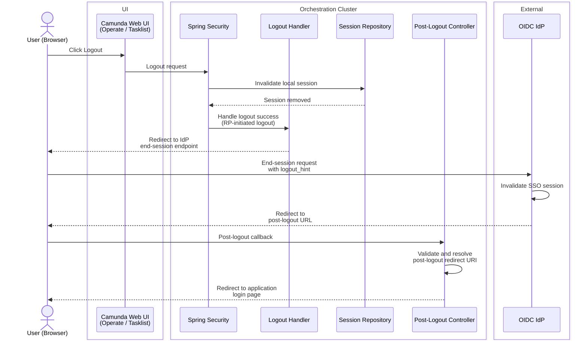
```mermaid
sequenceDiagram
  actor USER as User (Browser)
  box UI
    participant UI as Camunda Web UI<br/>(Operate / Tasklist)
  end
  box Orchestration Cluster
    participant SPRING_SECURITY as Spring Security
    participant LOGOUT_HANDLER as Logout Handler
    participant SESSION as Session Repository
    participant POST_LOGOUT as Post-Logout Controller
  end
  box External
    participant IDP as OIDC IdP
  end

  USER->>UI: Click Logout
  UI->>SPRING_SECURITY: Logout request
  SPRING_SECURITY->>SESSION: Invalidate local session
  SESSION-->>SPRING_SECURITY: Session removed
  SPRING_SECURITY->>LOGOUT_HANDLER: Handle logout success<br>(RP-initiated logout)
  LOGOUT_HANDLER-->>USER: Redirect to IdP<br>end-session endpoint
  USER->>IDP: End-session request<br>with logout_hint
  IDP->>IDP: Invalidate SSO session
  IDP-->>USER: Redirect to<br>post-logout URL
  USER->>POST_LOGOUT: Post-logout callback
  POST_LOGOUT->>POST_LOGOUT: Validate and resolve<br>post-logout redirect URI
  POST_LOGOUT-->>USER: Redirect to application<br>login page
```

Participants:

* Spring Security: Intercepts the logout request and triggers session invalidation. (`LogoutFilter`)
* Session Repository: Invalidates the local server-side session. (CSL)
* Logout Handler: Triggers RP-initiated logout and redirects to the IdP end-session endpoint. (CSL)
* Post-Logout Controller: Validates and resolves the post-logout redirect URI. (`PostLogoutController`, local — `authentication/`)

### 6.3. Machine‑to‑machine access

#### 6.3.1 Bearer Token / OIDC

Scenario: worker or backend service calls REST APIs using an OIDC JWT Bearer Token acquired via the OAuth2 client credentials grant.
1. Service acquires a JWT from the external IdP via the client credentials grant.
2. It sends the token as a `Bearer` header on each REST request.
3. Spring Security (`BearerTokenAuthenticationFilter`) validates the token signature via the IdP's JWKS endpoint — no local credential storage needed.
4. CSL's OIDC Token Converter and Claims Converter extract the client identity and apply mapping rules to resolve roles and tenants via Camunda Services.

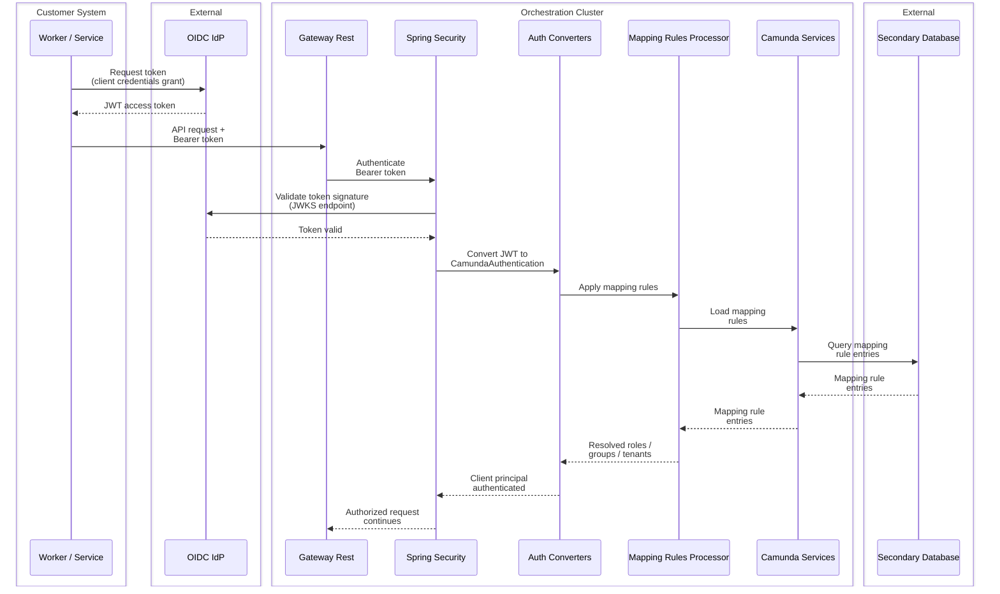
```mermaid
sequenceDiagram
  box Customer System
    participant WORKER as Worker / Service
  end
  box External
    participant IDP as OIDC IdP
  end
  box Orchestration Cluster
    participant REST as Gateway Rest
    participant SPRING_SECURITY as Spring Security
    participant AUTH_CONVERTERS as Auth Converters
    participant MAPPING as Mapping Rules Processor
    participant CAMUNDA_SERVICES as Camunda Services
  end
  box External
    participant SECONDARY_DB as Secondary Database
  end

  WORKER->>IDP: Request token<br>(client credentials grant)
  IDP-->>WORKER: JWT access token
  WORKER->>REST: API request +<br>Bearer token
  REST->>SPRING_SECURITY: Authenticate<br>Bearer token
  SPRING_SECURITY->>IDP: Validate token signature<br>(JWKS endpoint)
  IDP-->>SPRING_SECURITY: Token valid
  SPRING_SECURITY->>AUTH_CONVERTERS: Convert JWT to<br>CamundaAuthentication
  AUTH_CONVERTERS->>MAPPING: Apply mapping rules
  MAPPING->>CAMUNDA_SERVICES: Load mapping<br>rules
  CAMUNDA_SERVICES->>SECONDARY_DB: Query mapping<br>rule entries
  SECONDARY_DB-->>CAMUNDA_SERVICES: Mapping rule<br>entries
  CAMUNDA_SERVICES-->>MAPPING: Mapping rule<br>entries
  MAPPING-->>AUTH_CONVERTERS: Resolved roles /<br>groups / tenants
  AUTH_CONVERTERS-->>SPRING_SECURITY: Client principal<br>authenticated
  SPRING_SECURITY-->>REST: Authorized request<br>continues
```

#### 6.3.2 OIDC with private_key_jwt client authentication

> **Available since**: Camunda 8.8 clients (issue [#36971](https://github.com/camunda/camunda/issues/36971)).

`private_key_jwt` replaces the shared `client_secret` with a JWT **client assertion** signed by the
client's private key. The private key is never transmitted.

Two separate OAuth clients can use it independently, and conflating them is the usual source of
confusion:

|                 Which client                 |                                                                                                                    Configured by                                                                                                                     |
|----------------------------------------------|------------------------------------------------------------------------------------------------------------------------------------------------------------------------------------------------------------------------------------------------------|
| Customer-side Camunda client (e.g. a worker) | The client itself, via its `OAuthCredentialsProvider`. OC needs no setting for this beyond running in OIDC mode                                                                                                                                      |
| OC as an OAuth client towards the IdP        | `camunda.security.authentication.oidc.clientAuthenticationMethod=private_key_jwt` plus `oidc.assertion.keystore.*` (path, password, keyAlias, keyPassword) and the optional `assertion.kidSource` / `kidDigestAlgorithm` / `kidEncoding` / `kidCase` |

In many enterprise environments both are set to `private_key_jwt`, but they are technically separate
OAuth clients and can be configured differently.

**Important distinction:** the JWT sent to the IdP token endpoint is the client assertion
(`client_assertion`). It is *not* the access token that is later sent to OC as
`Authorization: Bearer ...`.

The customer-side flow — the one that gets configured most often:

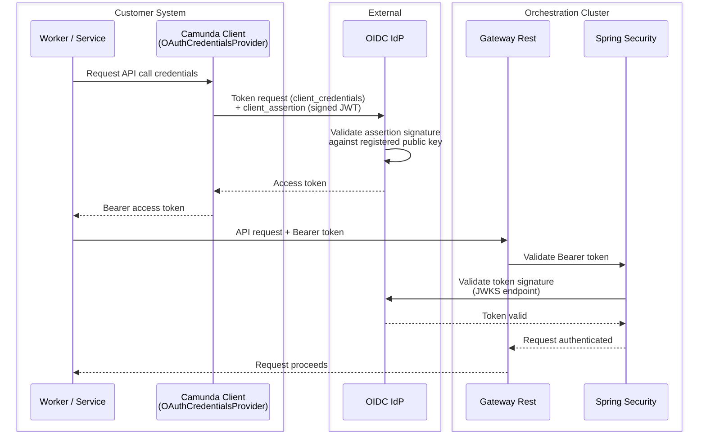
```mermaid
sequenceDiagram
  box Customer System
    participant WORKER as Worker / Service
    participant CLIENT as Camunda Client<br/>(OAuthCredentialsProvider)
  end
  box External
    participant IDP as OIDC IdP
  end
  box Orchestration Cluster
    participant REST as Gateway Rest
    participant SPRING_SECURITY as Spring Security
  end

  WORKER->>CLIENT: Request API call credentials
  CLIENT->>IDP: Token request (client_credentials)<br>+ client_assertion (signed JWT)
  IDP->>IDP: Validate assertion signature<br>against registered public key
  IDP-->>CLIENT: Access token
  CLIENT-->>WORKER: Bearer access token
  WORKER->>REST: API request + Bearer token
  REST->>SPRING_SECURITY: Validate Bearer token
  SPRING_SECURITY->>IDP: Validate token signature<br>(JWKS endpoint)
  IDP-->>SPRING_SECURITY: Token valid
  SPRING_SECURITY-->>REST: Request authenticated
  REST-->>WORKER: Request proceeds
```

From the Bearer token onwards this is the normal OIDC path from [6.3.1](#631-bearer-token--oidc).

On the OC side, when OC itself authenticates to the IdP token endpoint (authorization code exchange,
refresh, or an OC-initiated client credentials flow), three parties are involved and it is worth
keeping them apart:

- **CSL** loads OC's private key and certificate from the configured keystore and builds the JSON Web
  Key, including `kid` and `x5t#S256`.
- **OC** wires that key into the token endpoint. `OidcTokenEndpointCustomizer` (`authentication/`)
  implements CSL's SPI of the same name — it is one of the [callback extension
  points](#callback-extension-points) — constructs the converter below, and caches the resolved JWK
  per client registration.
- **Spring Security's** `NimbusJwtClientAuthenticationParametersConverter` signs the assertion and
  attaches it to the token request.

#### 6.3.3 Basic Auth

Scenario: worker or backend service calls REST APIs using a clientId and secret via HTTP Basic authentication.
No external IdP is involved; credentials are verified directly against Identity entities stored in the Secondary Database.

The mechanism is the same as the Basic Auth browser login in [6.1.1](#611-basic-auth), minus the login
form and the session: the service sends a `Basic` header on every request, and CSL's Basic Auth
Converter verifies the credentials through OC's `BasicAuthUserDetailsAdapter` and resolves roles and
tenants through OC's `MembershipPort` implementation, both backed by Camunda Services. Because each
request carries its own credentials, no server-side session is created.

### 6.4 Sending a command via REST

Scenario: a client starts a process instance via the REST API; the Zeebe Engine enforces RBAC via Engine Identity before applying the command.

1. Client sends a `POST /v2/process-instances` request with a valid credential (session cookie, Basic auth header, or JWT bearer token).
2. Spring Security authenticates the request and resolves a `CamundaAuthentication` principal.
3. The REST API delegates to Camunda Services, which issues a `CreateProcessInstance` command to the Zeebe Engine together with the resolved authentication context (claims and principal data from `CamundaAuthentication`).
4. Before applying the command, the Engine calls `CslAuthorizationCheck` with a CSL `RequiredAuthorization` for the `PROCESS_DEFINITION:CREATE_PROCESS_INSTANCE` permission. Engine Identity performs this check against local engine state and does not call the external IdP.
5. `CslAuthorizationCheck` delegates to CSL's `AuthorizationCheckPort`. The data CSL needs is supplied by the engine's two port implementations, `AuthorizationScopeStateAdapter` and `MembershipStateAdapter`, which read from RocksDB via the engine's State classes.
6. If the check passes, the Engine writes the new process instance state to the Primary Database and returns the result.
7. Camunda Services returns a `CreateProcessInstanceResponse` and the REST API responds with `200 OK` containing the process instance key.

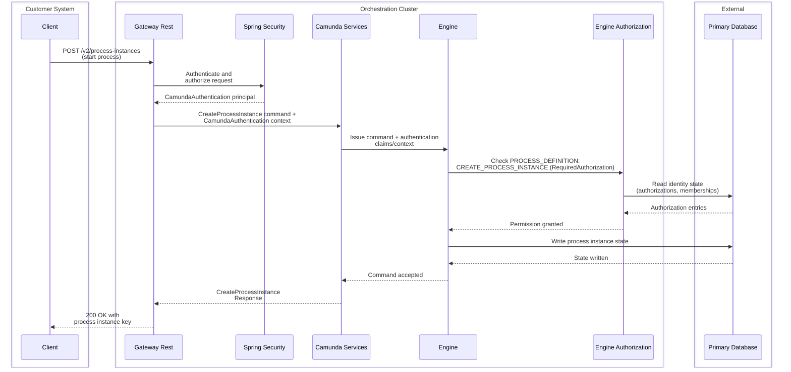
```mermaid
sequenceDiagram
  box Customer System
    participant CLIENT as Client
  end
  box Orchestration Cluster
    participant REST as Gateway Rest
    participant SPRING_SECURITY as Spring Security
    participant CAMUNDA_SERVICES as Camunda Services
    participant ENGINE as Engine
    participant ENGINE_AUTHZ as Engine Authorization
  end
  box External
    participant PRIMARY_DB as Primary Database
  end

  CLIENT->>REST: POST /v2/process-instances<br>(start process)
  REST->>SPRING_SECURITY: Authenticate and<br>authorize request
  SPRING_SECURITY-->>REST: CamundaAuthentication principal
  REST->>CAMUNDA_SERVICES: CreateProcessInstance command +<br>CamundaAuthentication context
  CAMUNDA_SERVICES->>ENGINE: Issue command + authentication<br>claims/context
  ENGINE->>ENGINE_AUTHZ: Check PROCESS_DEFINITION:<br>CREATE_PROCESS_INSTANCE (RequiredAuthorization)
  ENGINE_AUTHZ->>PRIMARY_DB: Read identity state<br>(authorizations, memberships)
  PRIMARY_DB-->>ENGINE_AUTHZ: Authorization entries
  ENGINE_AUTHZ-->>ENGINE: Permission granted
  ENGINE->>PRIMARY_DB: Write process instance state
  PRIMARY_DB-->>ENGINE: State written
  ENGINE-->>CAMUNDA_SERVICES: Command accepted
  CAMUNDA_SERVICES-->>REST: CreateProcessInstance<br>Response
  REST-->>CLIENT: 200 OK with<br>process instance key
```

### 6.5 Reading resources via REST

Scenario: a client queries process instances via the REST API; the Camunda Search Client uses Security (`DefaultResourceAccessProvider`) to filter results to authorized resources only.

1. Client sends a `GET /v2/process-instances` request with a valid credential.
2. Spring Security authenticates the request and resolves a `CamundaAuthentication` principal.
3. The REST API delegates to Camunda Services, which builds a `SecurityContext` (via `SecurityContextProvider`) combining the principal with the required authorization context.
4. Camunda Services invokes the Camunda Search Client with the `SecurityContext`.
5. Before executing the search query, the Camunda Search Client calls `DefaultResourceAccessProvider` (implementing CSL's `ResourceAccessProvider` port) to determine the caller's effective permissions.
6. `DefaultResourceAccessProvider` hands the decision to CSL's authorization check, which reads what it needs through the `AuthorizationScopeRepositoryPort` implementation backed by the Camunda Search Client — CSL never queries the database directly.
7. The resolved permissions are translated into a resource filter (e.g. restricting results to specific process definition keys or tenants) and applied to the search query.
8. The Camunda Search Client executes the filtered query against the Secondary Database and returns the results.
9. Camunda Services returns a `SearchQueryResult<ProcessInstanceEntity>` and the REST API responds with `200 OK` containing the filtered process instances.

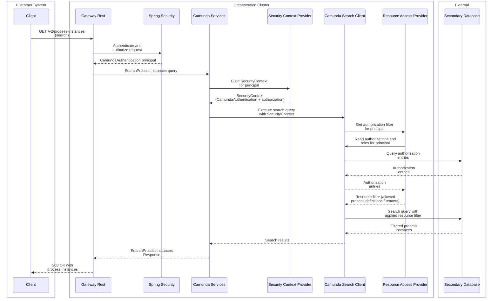
```mermaid
sequenceDiagram
  box Customer System
    participant CLIENT as Client
  end
  box Orchestration Cluster
    participant REST as Gateway Rest
    participant SPRING_SECURITY as Spring Security
    participant CAMUNDA_SERVICES as Camunda Services
    participant SC_PROVIDER as Security Context Provider
    participant CAMUNDA_SEARCH_CLIENT as Camunda Search Client
    participant RESOURCE_ACCESS as Resource Access Provider
  end
  box External
    participant SECONDARY_DB as Secondary Database
  end

  CLIENT->>REST: GET /v2/process-instances<br>(search)
  REST->>SPRING_SECURITY: Authenticate and<br>authorize request
  SPRING_SECURITY-->>REST: CamundaAuthentication principal
  REST->>CAMUNDA_SERVICES: SearchProcessInstances query
  CAMUNDA_SERVICES->>SC_PROVIDER: Build SecurityContext<br>for principal
  SC_PROVIDER-->>CAMUNDA_SERVICES: SecurityContext<br>(CamundaAuthentication + authorization)
  CAMUNDA_SERVICES->>CAMUNDA_SEARCH_CLIENT: Execute search query<br>with SecurityContext
  CAMUNDA_SEARCH_CLIENT->>RESOURCE_ACCESS: Get authorization filter<br>for principal
  RESOURCE_ACCESS->>CAMUNDA_SEARCH_CLIENT: Read authorizations and<br>roles for principal
  CAMUNDA_SEARCH_CLIENT->>SECONDARY_DB: Query authorization<br>entries
  SECONDARY_DB-->>CAMUNDA_SEARCH_CLIENT: Authorization<br>entries
  CAMUNDA_SEARCH_CLIENT-->>RESOURCE_ACCESS: Authorization<br>entries
  RESOURCE_ACCESS-->>CAMUNDA_SEARCH_CLIENT: Resource filter (allowed<br>process definitions / tenants)
  CAMUNDA_SEARCH_CLIENT->>SECONDARY_DB: Search query with<br>applied resource filter
  SECONDARY_DB-->>CAMUNDA_SEARCH_CLIENT: Filtered process<br>instances
  CAMUNDA_SEARCH_CLIENT-->>CAMUNDA_SERVICES: Search results
  CAMUNDA_SERVICES-->>REST: SearchProcessInstances<br>Response
  REST-->>CLIENT: 200 OK with<br>process instances
```

### 6.6 Creating an identity entity

Scenario: an administrator creates a new identity entity via the REST API. The Engine authorizes and
applies the command, writes it to the Primary Database, and the Exporter propagates it asynchronously
to the Secondary Database so it becomes searchable.

Creating a user and creating an authorization follow the same path, differing only in the command,
the required permission, and the state class that persists the record:

|    Entity     |          Request          |        Command        |  Required permission   |        Persisted by         |
|---------------|---------------------------|-----------------------|------------------------|-----------------------------|
| User          | `POST /v2/users`          | `CreateUser`          | `USER:CREATE`          | `MutableMembershipState`    |
| Authorization | `POST /v2/authorizations` | `CreateAuthorization` | `AUTHORIZATION:CREATE` | `MutableAuthorizationState` |

1. Client sends the request with a valid credential and the entity's details.
2. Spring Security authenticates the request and resolves a `CamundaAuthentication` principal.
3. The REST API delegates to Camunda Services (`UserServices` / `AuthorizationServices`), which issues the command to the Zeebe Engine.
4. Before applying the command, the Engine checks the required permission via `CslAuthorizationCheck`, which reads authorization and membership state from the Primary Database.
5. Once the check passes, the Engine applies the command and the corresponding mutable state class persists the record to RocksDB. Note that the authorization check is a gate only — it neither applies commands nor writes state (see [5.2.3](#523-engine-identity---level-2)).
6. The Engine acknowledges the command and the REST API responds with `201 Created` and the new entity key.
7. Asynchronously, the Camunda or RDBMS Exporter picks up the resulting event and writes the record to the Secondary Database.

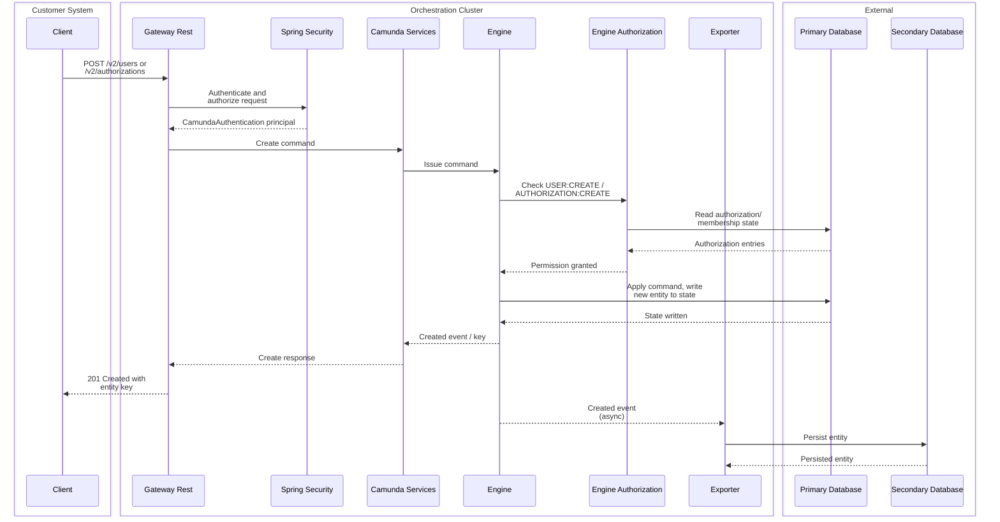
```mermaid
sequenceDiagram
  box Customer System
    participant CLIENT as Client
  end
  box Orchestration Cluster
    participant REST as Gateway Rest
    participant SPRING_SECURITY as Spring Security
    participant CAMUNDA_SERVICES as Camunda Services
    participant ENGINE as Engine
    participant ENGINE_AUTHZ as Engine Authorization
    participant EXPORTER as Exporter
  end
  box External
    participant PRIMARY_DB as Primary Database
    participant SECONDARY_DB as Secondary Database
  end

  CLIENT->>REST: POST /v2/users or<br>/v2/authorizations
  REST->>SPRING_SECURITY: Authenticate and<br>authorize request
  SPRING_SECURITY-->>REST: CamundaAuthentication principal
  REST->>CAMUNDA_SERVICES: Create command
  CAMUNDA_SERVICES->>ENGINE: Issue command
  ENGINE->>ENGINE_AUTHZ: Check USER:CREATE /<br>AUTHORIZATION:CREATE
  ENGINE_AUTHZ->>PRIMARY_DB: Read authorization/<br>membership state
  PRIMARY_DB-->>ENGINE_AUTHZ: Authorization entries
  ENGINE_AUTHZ-->>ENGINE: Permission granted
  ENGINE->>PRIMARY_DB: Apply command, write<br>new entity to state
  PRIMARY_DB-->>ENGINE: State written
  ENGINE-->>CAMUNDA_SERVICES: Created event / key
  CAMUNDA_SERVICES-->>REST: Create response
  REST-->>CLIENT: 201 Created with<br>entity key
  ENGINE-->>EXPORTER: Created event<br>(async)
  EXPORTER->>SECONDARY_DB: Persist entity
  SECONDARY_DB-->>EXPORTER: Persisted entity
```

Participants:

* Engine Authorization: Gates the command on the required permission before it is applied. (`CslAuthorizationCheck`, CSL `AuthorizationCheckPort`, `AuthorizationState`, `MembershipState`)
* Exporter: Asynchronously propagates applied events to the secondary database. (`CamundaExporter` / `RdbmsExporter`)

## 7. Deployment view

Identity‑specific aspects:

- Orchestration Cluster packaging
  Identity is part of the Orchestration Cluster deployment artifact (JAR/container) for SaaS and Self‑Managed.

- Storage
  Identity entities are stored using:

  - Primary storage: RocksDB.
  - Secondary storage: the configured search database (ES/OS/RDBMS).

For detailed infrastructure topologies, see the Camunda 8 reference architectures listed in the sources appendix.

### 7.1 Basic Auth

In a Basic Auth setup, no external IdP is involved.
All authentication and authorization is handled directly by the Identity components embedded within the Orchestration Cluster.
There is no OIDC component or token exchange with an external system.

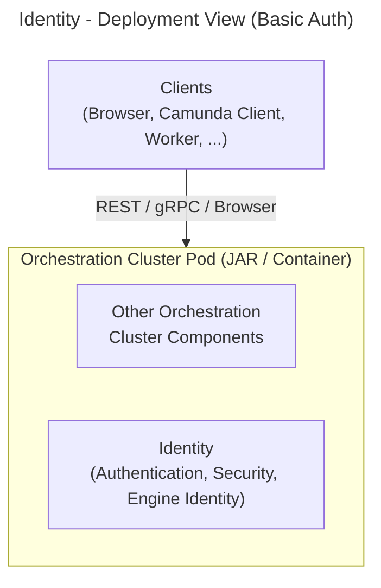
```mermaid
---
title: Identity - Deployment View (Basic Auth)
---
flowchart TB
  subgraph OC_POD["Orchestration Cluster Pod (JAR / Container)"]
    CLUSTER_STUFF["Other Orchestration</br>Cluster Components"]
    IDENTITY["Identity</br>(Authentication, Security, Engine Identity)"]
  end

  CLIENTS["Clients</br>(Browser, Camunda Client, Worker, ...)"]

  CLIENTS -->|"REST / gRPC / Browser"| OC_POD
```

### 7.2 OIDC

In an OIDC setup, an external IdP handles SSO and token issuance.
Spring Security communicates directly with the IdP for authorization code exchange and token validation (JWKS).
Identity components within the Orchestration Cluster process the resulting tokens to build a `CamundaAuthentication` and apply mapping rules.

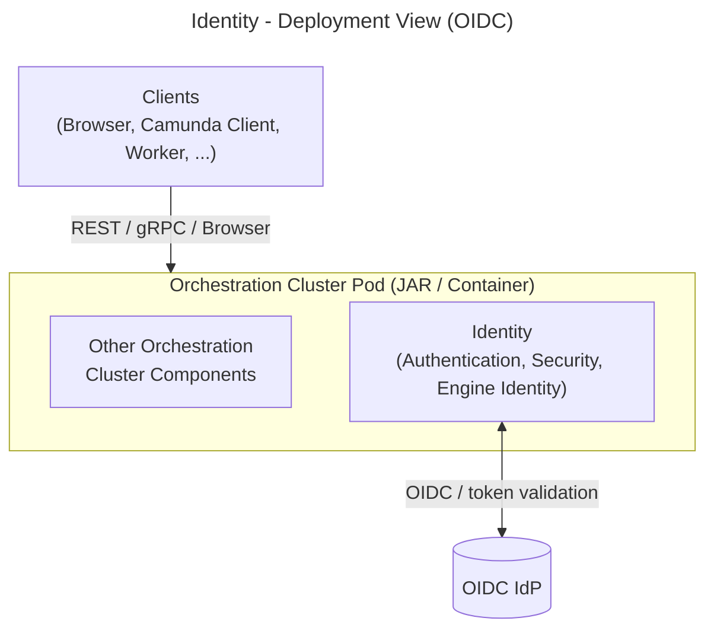
```mermaid
---
title: Identity - Deployment View (OIDC)
---
flowchart TB
  subgraph OC_POD["Orchestration Cluster Pod (JAR / Container)"]
    CLUSTER_STUFF["Other Orchestration</br>Cluster Components"]
    IDENTITY["Identity</br>(Authentication, Security, Engine Identity)"]
  end

  CLIENTS["Clients</br>(Browser, Camunda Client, Worker, ...)"]
  IDP[("OIDC IdP")]

  CLIENTS -->|"REST / gRPC / Browser"| OC_POD
  IDENTITY <-->|"OIDC / token validation"| IDP
```

## 8. Crosscutting concepts

Authentication concept
:   Unified Spring Security configuration for Basic and OIDC. Pluggable IdP integration through standard OIDC configuration.

Authorization and RBAC concept
:   Central resource‑based authorization model, decoupled from individual UIs and services. Shared checks used by engine, Operate, Tasklist, and APIs. For detailed behavior and examples, see the [Authorization concept](authorizations/authorization-concept.md), [Engine authorization checks](authorizations/engine-authorization.md), and [REST authorization checks](authorizations/rest-authorization.md).

Tenant concept
:   Cluster‑local tenants defined in Identity. Tenants applied across runtime resources for data and access isolation (Self‑Managed).

Mapping rules concept
:   Declarative mapping from IdP claims (groups, attributes) to Identity entities such as groups, roles, tenants, authorizations. Enables identity‑as‑code and external lifecycle via IdP.

Migration concept (from Management Identity)
:   Identity Migration tooling to move roles, groups, tenants, resource authorizations, and mapping rules. Designed to be idempotent and re‑runnable.

Storage and consistency
:   Identity state follows Zeebe's durability and snapshot mechanisms via shared storage. Secondary storage ensures efficient querying for Admin UI and APIs.

## 9. Architectural decisions

The architectural decisions for Identity are documented as individual ADR files:

- [ADR-0001: Cluster-Embedded Identity Instead of External Component](./adr/0001-cluster-embedded-identity.md)
- [ADR-0002: OIDC as Default Production Authentication](./adr/0002-oidc-default-production-authentication.md)
- [ADR-0003: Resource-Based Authorization Model](./adr/0003-resource-based-authorization-model.md)
- [ADR-0004: Support Multiple JWKS Endpoints per OIDC Issuer](./adr/0004-multi-jwks-endpoints-per-issuer.md)
- [ADR-0005: Support Forward Slashes in Entity IDs via URL Encoding](./adr/0005-support-forward-slashes-in-entity-ids.md)
- [ADR-0006: UserInfo Claim Augmentation for Bearer Tokens](./adr/0006-userinfo-claim-augmentation-for-bearer-tokens.md)

Cross-cutting decisions on the CSL migration (affecting Identity along with other modules) are
documented at the repo-root level rather than here:

- [ADR: Endpoint Required-Permission Mapping](https://github.com/camunda/camunda/blob/main/docs/adr/security/001-endpoint-required-permission-mapping.md)
- [ADR: Tenant Access Provider Ownership and Seam](https://github.com/camunda/camunda/blob/main/docs/adr/security/002-tenant-access-provider-ownership-and-seam.md)
- [ADR: Physical-Tenant Routing of Authorization Reads](https://github.com/camunda/camunda/blob/main/docs/adr/orchestration-cluster/0005-physical-tenant-routing-of-authorization-reads.md) -- the background for the per-physical-tenant `AuthorizationCheckPort` scoping described in [5.2.2](#522-security---level-2).

No dedicated ADR records the decision to adopt CSL itself; that predates these two and is not
tracked in `identity/docs/adr/` or `docs/adr/`.

## 10. Risks and technical debt

Migration complexity and failure modes
:   Migration from Management Identity introduces complexity and potential misconfiguration (for example mismatched IdP setups, conflicting mapping rules). Mitigation: dedicated Identity Migration App, idempotent runs, detailed logs; still requires careful testing in customer environments.

Dual identity model during transition
:   Management Identity remains for Web Modeler, Console, and Optimize (Self‑Managed) while Orchestration Cluster Identity serves runtime. Risk of confusion about the source of truth and duplicated configuration until long‑term consolidation is complete.

Cross-repo coupling to the Camunda Security Library
:   The authorization and authentication decisions themselves, the boundary types they are expressed in (`CamundaAuthentication`, `SecurityContext`, `RequiredAuthorization`, `TenantAccess`), and the Spring Security filter chain assembly now live in the separately-versioned [camunda-security-library](https://github.com/camunda/camunda-security-library) repo rather than in this codebase. Changes to authorization/authentication behavior can originate from a CSL release bump (`version.camunda-security-library` in `parent/pom.xml`) rather than from a change in this repo. The two risks that follow from that are different, and only one of them is now controlled:

- *The inventory* in [5.1](#csl-extension-points-and-ocs-adapters) is verifiable. Every entry is a type OC implements or extends, so it can be regenerated from the tree: sweep the non-test sources that import `io.camunda.security.*` and resolve each type declaration's `implements`/`extends` clause against that file's imports, then diff against the tables. Run it after a version bump. Discount four things or it will report false positives — generic type *parameters* (`implements PhysicalTenantScoped<ResourceAccessProvider>` is not a row for `ResourceAccessProvider`), generic *arguments* on an unrelated supertype (`ScopeCacheLoader extends CacheLoader<…, Set<AuthorizationScope>>` is not a row for `AuthorizationScope`), Optimize's separate CSL wiring, and fully-qualified `implements` clauses with no matching import, which any import-driven sweep misses.
- *Behavior* is not verifiable this way. A CSL release can change how a decision is reached without changing a single signature OC declares, and nothing in this repo will show it. The prose describing CSL's role — as opposed to the names in the tables — can therefore go stale silently, which is why this document deliberately describes CSL's internals by role and links [CSL's own docs](https://github.com/camunda/camunda-security-library/blob/main/docs/architecture/05-building-block-view.md) instead of restating them.

## 11. Glossary

|              Term              |                                                                                                               Definition                                                                                                                |
|--------------------------------|-----------------------------------------------------------------------------------------------------------------------------------------------------------------------------------------------------------------------------------------|
| Orchestration Cluster          | Unified Camunda 8 runtime: Zeebe, Operate, Tasklist, Identity, REST/gRPC APIs.                                                                                                                                                          |
| Orchestration Cluster Identity | Cluster‑embedded identity service for authentication, authorization and identity entities.                                                                                                                                              |
| Orchestration Cluster Admin    | UI surface for cluster Identity (new name in 8.9); hosts identity features.                                                                                                                                                             |
| Management Identity            | Standalone identity app (Self‑Managed) for Web Modeler, Console and Optimize.                                                                                                                                                           |
| Tenant                         | Logical partition of data and access within a cluster (runtime multi‑tenancy).                                                                                                                                                          |
| Authorization                  | Permission linking a principal to a resource type and action (for example READ, UPDATE, DELETE).                                                                                                                                        |
| Mapping rule                   | Rule mapping IdP claims (groups, attributes) to identity entities such as groups, roles, tenants, authorizations.                                                                                                                       |
| User                           | Human user performing modeling, operations or task work.                                                                                                                                                                                |
| Service accounts / workers     | Non‑interactive clients calling REST/gRPC APIs using client credentials.                                                                                                                                                                |
| CSL (Camunda Security Library) | External library ([camunda/camunda-security-library](https://github.com/camunda/camunda-security-library)) providing the shared authorization/authentication primitives and Spring Security filter chain assembly consumed by Identity. |
| OIDC IdP                       | External identity provider; source of identity, attributes and group claims.                                                                                                                                                            |
| Cluster components             | Runtime components enforcing Identity decisions for user and client operations.                                                                                                                                                         |

