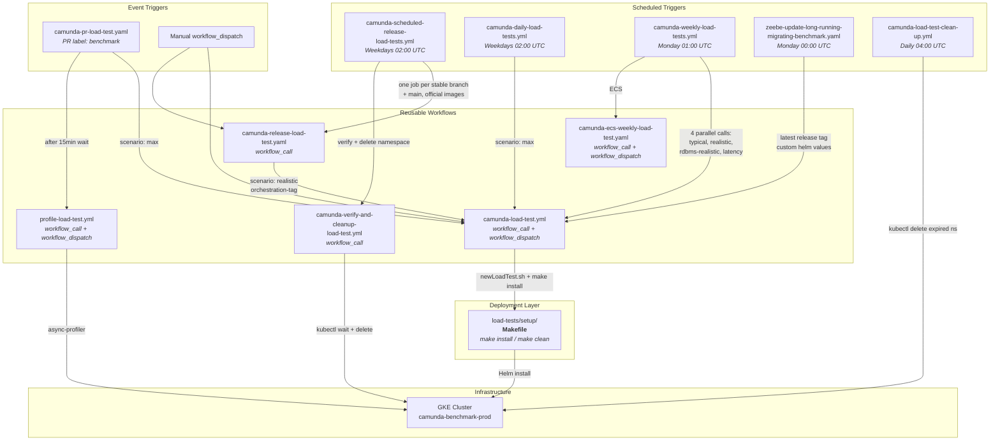
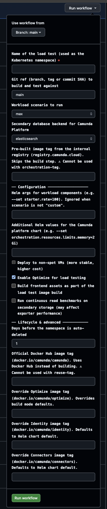
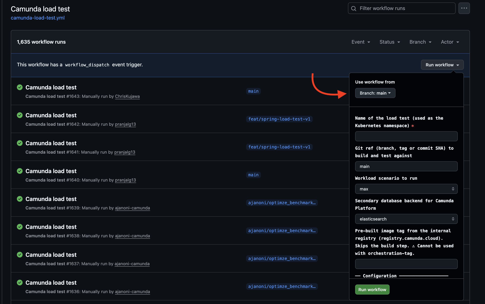
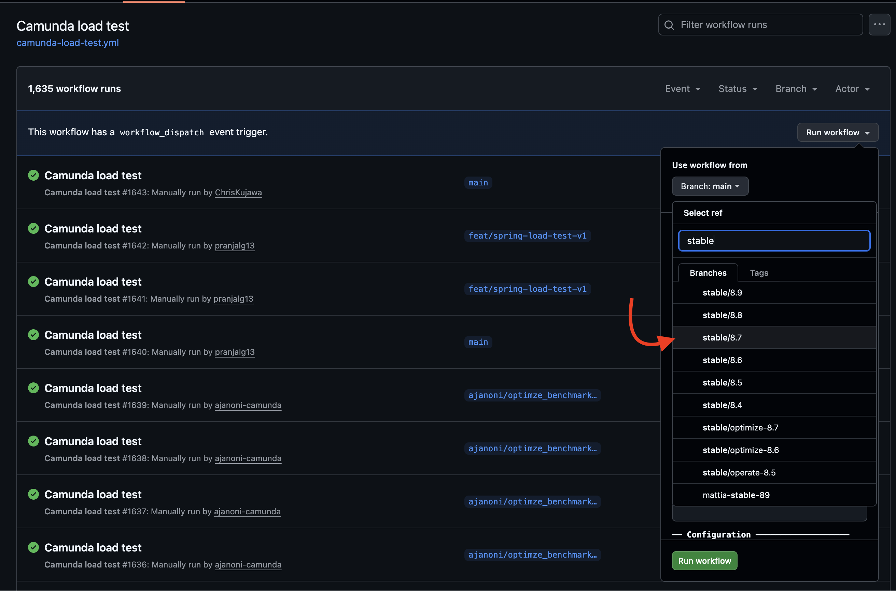
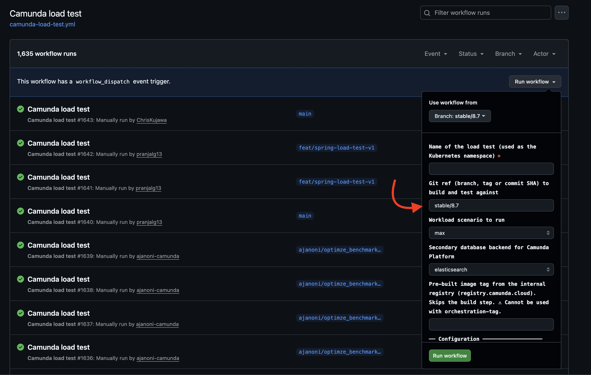
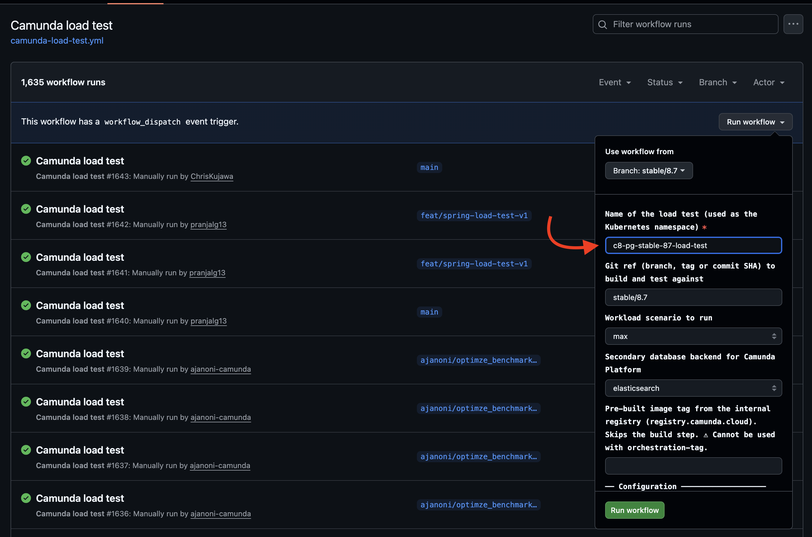
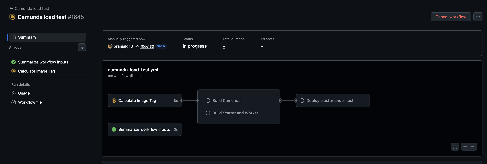
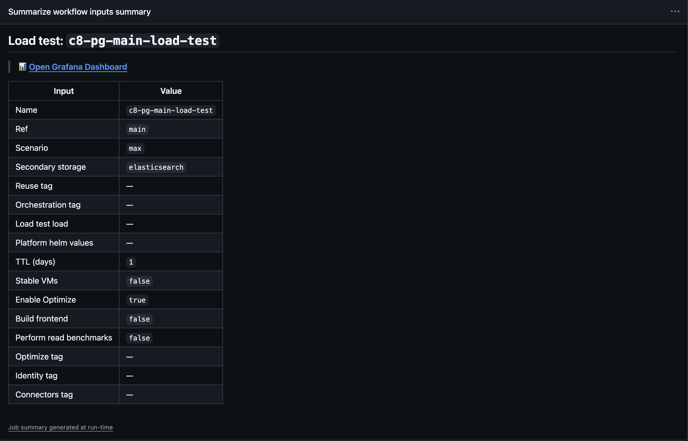

# Camunda Load Tests

Load tests validate the reliability and performance of Camunda 8 across releases and development branches. They can be created via automated GitHub Actions workflows or manually (via Makefiles) on a GKE cluster (`camunda-benchmark-prod`), deploying the [Camunda Platform Helm Chart](https://github.com/camunda/camunda-platform-helm) and a custom [load test Helm chart](https://github.com/camunda/camunda-load-tests-helm).

For background on goals and test variants, see the [reliability testing documentation](../docs/testing/reliability-testing.md).

## Directory Layout

|   Directory    |                                              Description                                              |
|----------------|-------------------------------------------------------------------------------------------------------|
| `setup/`       | Makefiles, shell scripts, and Helm values for deploying load tests ([README](setup/README.md))        |
| `load-tester/` | Java load test applications (starters and workers) ([README](load-tester/README.md))                  |
| `docs/`        | Additional documentation: [scripts](docs/scripts/README.md), [past failures](docs/failures/README.md) |

## Quick Start

### Via GitHub Actions (recommended)

Trigger the [Camunda load test workflow](https://github.com/camunda/camunda/actions/workflows/camunda-load-test.yml) via the UI. Select a branch, name your test, and choose a scenario.

### Via Makefile (manual)

Prerequisites: access to the GKE benchmark cluster via [Teleport](https://camunda.teleport.sh).

```bash
cd load-tests/setup
./newLoadTest.sh <name> <storage-type> <ttl-days> <enable-optimize>
cd <name>
make install
```

See the [setup README](setup/README.md) for full details.

## Workflow Overview

All automated load tests flow through `camunda-load-test.yml`, which builds images and deploys via the same Makefiles used for manual deployments.



### Schedule

|       Time        |                       Workflow                       | Frequency |
|-------------------|------------------------------------------------------|-----------|
| 00:00 UTC Monday  | `zeebe-update-long-running-migrating-benchmark.yaml` | Weekly    |
| 01:00 UTC Monday  | `camunda-weekly-load-tests.yml`                      | Weekly    |
| 02:00 UTC Mon-Fri | `camunda-scheduled-release-load-tests.yml`           | Weekdays  |
| 02:00 UTC Mon-Fri | `camunda-daily-load-tests.yml`                       | Weekdays  |
| 04:00 UTC         | `camunda-load-test-clean-up.yml`                     | Daily     |

For detailed inputs, triggers, and job definitions, see each workflow's header comments in [`.github/workflows/`](../.github/workflows/).

## Setup


The setup for all of our load tests is equal for better comparability, and consists of two main ingredients.

1. The official [Camunda Platform Helm Chart](https://github.com/camunda/camunda-platform-helm), taking care of the general set up of our Camunda 8 Platform.
2. A custom Helm chart ([camunda-load-tests](https://github.com/camunda/camunda-load-tests-helm)) to set up our load test applications.

By default, the full Camunda Platform is deployed, including Orchestration Cluster (OC), Optimize (with history cleanup), Connectors (with OIDC authentication), and Identity with Keycloak as identity provider. This ensures load tests validate the system in a production-like configuration. Optimize can be disabled via the `enable-optimize` workflow input or the `newLoadTest.sh` script parameter. We always run load tests with a three-node OC cluster, configured with three partitions and a replication factor of three. Depending on the version of Camunda/Zeebe, we might only deploy Zeebe Brokers and the Zeebe (standalone) gateway (with two replicas) only (pre 8.8).

An Elasticsearch cluster with three nodes is deployed as well, which is used to validate the performance of the exporters. Exporting and archiving throughput must be able to sustain the load of the cluster.

Our [load test Helm Chart](https://github.com/camunda/camunda-load-tests-helm) deploys different load test applications. They can be distinguished into workers and starters. The related code can be found in the [Camunda mono repository](https://github.com/camunda/camunda/tree/main/load-tests/load-tester).

Depending on the test variant, different process models are created and executed by the Starter and Worker applications. They only differ in configurations, which can be done by the respective [camunda-load-test](https://github.com/camunda/camunda-load-tests-helm) Helm chart, and their [values files](https://github.com/camunda/camunda-load-tests-helm/blob/main/charts/camunda-load-tests/values.yaml).

All of this is deployed in an Infra-team-maintained Google Kubernetes Engine (GKE) cluster (`camunda-benchmark-prod`). Access is managed via [Teleport](https://camunda.teleport.sh). Container images are stored in `registry.camunda.cloud/team-zeebe`. Details about the benchmark cluster infrastructure can be found in the [infra-core repository](https://github.com/camunda/infra-core/), and specifically in the [benchmark cluster access guide](https://github.com/camunda/infra-core/blob/stage/docs/kubernetes-cluster/benchmark-cluster-access.md).

For posterity, the deployment between 8.8 and pre-8.8 differs slightly. The Platform Helm Chart will now deploy a single Camunda application (replicated), whereas previously, the Zeebe Brokers and Zeebe Gateways were deployed standalone.


### Secondary Storage Options

Load tests can be configured with different secondary storage backends to validate Camunda's performance and reliability across various deployment scenarios:

* **Elasticsearch** (default): Deploys a three-node Elasticsearch cluster. This is the standard configuration used to validate exporter performance and archiving throughput.
* **OpenSearch**: Deploys an OpenSearch cluster as an alternative to Elasticsearch.
* **PostgreSQL**: Deploys a PostgreSQL database for RDBMS-based secondary storage testing.
* **MySQL**: Deploys a MySQL database for RDBMS-based secondary storage testing.
* **MariaDB**: Deploys a MariaDB database for RDBMS-based secondary storage testing.
* **MSSQL**: Deploys an MSSQL database for RDBMS-based secondary storage testing.
* **Oracle**: Deploys an Oracle database for RDBMS-based secondary storage testing.
* **None**: Runs load tests without any secondary storage. This is useful for testing the core orchestration engine performance in isolation, without the overhead of exporting data to a secondary database. In this mode, Camunda exporters are disabled.

The secondary storage type can be specified when creating a load test via the `newLoadTest.sh` script or the GitHub workflow inputs.

## Observability

Observability plays a vital role in running load tests. Since the beginning of our load testing practices, the Zeebe team has spent significant efforts adding metrics into the system and building Grafana dashboards to support them.

The metrics exported by our applications are stored in a [Prometheus instance](https://monitor.benchmark.camunda.cloud/) and can be observed with the [Grafana instance](https://dashboard.benchmark.camunda.cloud/?orgId=1). These applications sit behind a vouch-enabled proxy, so only Okta login is required to access them.

A general Grafana dashboard covering all sorts of metrics is the [Zeebe Dashboard](https://github.com/camunda/camunda/blob/main/monitor/grafana/zeebe.json). There are more tailored dashboards in the corresponding monitoring folder.

More details about observability can be read [here](../docs/observability.md).

## Test Scenarios

We have different scenarios targeting different use cases and versions. All use the same [setup](#setup) and [endurance test variants](../docs/testing/reliability-testing.md#endurance-test-variants) defined in the reliability testing documentation.

### Release load tests

For every [supported/maintained](https://confluence.camunda.com/pages/viewpage.action?pageId=245400921&spaceKey=HAN&title=Standard%2Band%2BExtended%2BSupport%2BPeriods) version, we run a continuous load test with a realistic workload. They are created or updated [as part of the release process](https://github.com/camunda/zeebe-engineering-processes/blob/main/src/main/resources/release/setup_benchmark.bpmn), which triggers the [Camunda release load test workflow](https://github.com/camunda/camunda/blob/main/.github/workflows/camunda-release-load-test.yaml).

**Goal:** Validating the reliability of our releases and detecting earlier issues, especially with alpha versions and updates.

**Validation:** The tailored [Zeebe Medic Dashboard](https://dashboard.benchmark.camunda.cloud/d/zeebe-medic-benchmark/zeebe-medic-benchmarks?orgId=1&refresh=1m) can be used to observe and validate the performance of the different load tests.

#### Architecture

The release load test workflow acts as an abstraction layer between the release process and the underlying load test infrastructure, with a simple public API accepting `name` and `tag` as required inputs, plus optional per-component image tag overrides (`optimize-tag`, `identity-tag`, `connectors-tag`).


This decoupling provides several benefits:

- **Clear API**: The release process only needs to provide a test name and tag — implementation details (official images, realistic scenario, TTL) are encapsulated in the release load test workflow.
- **Independent evolution**: Changes to load test infrastructure (helm values, Makefiles, scripts) don't require changes to the release process BPMN.
- **Per-branch workflows**: Each stable branch has its own copy of the release load test workflow (via backports), ensuring the correct infrastructure files are used for each version.
- **Daily smoke tests**: The [scheduled release load test workflow](https://github.com/camunda/camunda/blob/main/.github/workflows/camunda-scheduled-release-load-tests.yml) validates daily that release load tests can be created for all active stable branches.

#### Setup and integration

The release load tests are created as part of the [release process](https://github.com/camunda/zeebe-engineering-processes/blob/main/src/main/resources/release/setup_benchmark.bpmn#L7-L18) via a "Setup benchmark" sub-process.


The REST-Connector calls the GitHub API (`https://api.github.com/repos/camunda/camunda/actions/workflows/camunda-release-load-test.yaml/dispatches`) to trigger the [Camunda release load test workflow](https://github.com/camunda/camunda/blob/main/.github/workflows/camunda-release-load-test.yaml) on a specific git reference.

> [!Important]
>
> This event will only trigger a workflow run if the workflow file exists on the default branch.
> https://docs.github.com/en/actions/reference/workflows-and-actions/events-that-trigger-workflows#workflow_dispatch

An example payload:

```json
{
    "ref": workflow_ref_name,
    "inputs": {
      "name": benchmark_name,
      "tag": release_tag,
      "optimize-tag": "optional, Docker Hub tag for Optimize",
      "identity-tag": "optional, Docker Hub tag for Identity",
      "connectors-tag": "optional, Docker Hub tag for Connectors"
    }
}
```

Example values from a past release:

|      Variable       |  Example Value  |             Description             |
|---------------------|-----------------|-------------------------------------|
| `workflow_ref_name` | `stable/8.7`    | The stable branch to trigger on     |
| `release_tag`       | `8.7.17`        | The release tag to use for the test |
| `benchmark_name`    | `release-8-7-x` | The name of the load test           |

#### Scheduled smoke tests

The [scheduled release load test workflow](https://github.com/camunda/camunda/blob/main/.github/workflows/camunda-scheduled-release-load-tests.yml) runs on weekdays at 02:00 UTC to validate that release load tests can be created for the currently active stable branches (`stable/8.7`, `stable/8.8`, `stable/8.9`) and `main`. Each branch's load test is created by calling the release load test workflow on that branch (`@stable/8.x`), ensuring the correct infrastructure files are used.

After deployment, each load test is verified by the [verify-and-cleanup workflow](https://github.com/camunda/camunda/blob/main/.github/workflows/camunda-verify-and-cleanup-load-test.yml), which:

1. Waits for all pods to be ready
2. Checks gateway connectivity via the `app.connected` gauge metric
3. Deletes the namespace (regardless of verification outcome)

Results are posted to the `#reliability-testing-alerts` Slack channel.

> [!Note]
>
> The scheduled workflow uses hardcoded release tags per stable branch. Patch releases do not require updates — only new minor versions (e.g., 8.10) or deprecated branches need the workflow to be updated.

### Weekly load tests

Weekly load tests run against the state of the **main** branch via the [Camunda load test GitHub workflow](https://github.com/camunda/camunda/actions/workflows/camunda-load-test.yml). They are automatically created every Monday and run for 4 weeks, then cleaned up by the [TTL checker](https://github.com/camunda/camunda/blob/main/.github/workflows/camunda-load-test-clean-up.yml). This results in several concurrent weekly tests (multiple variants × four weeks).

The weekly tests cover, for example, the [realistic load](../docs/testing/reliability-testing.md#realistic-load) variants (one with Elasticsearch, one with OpenSearch, and one with PostgreSQL) plus the [latency test](../docs/testing/reliability-testing.md#latency-load-test).

**Goal:** Validating the reliability of the current main, detecting newly introduced instabilities, memory leaks, and performance degradation.

**Validation:** The tailored [Zeebe Medic Dashboard](https://dashboard.benchmark.camunda.cloud/d/zeebe-medic-benchmark/zeebe-medic-benchmarks?orgId=1&refresh=1m) can be used to observe and validate the performance of the different load tests.

Example running tests (naming pattern: `medic-y-<year>-cw-<week>-<sha>-<variant>`):

- `medic-y-2025-cw-22-a60d64da-test-latency`
- `medic-y-2025-cw-22-a60d64da-test-realistic`
- `medic-y-2025-cw-22-a60d64da-test-rdbms-realistic`

**Expectations:** If an issue prevents a test from working properly and no workaround is available, the test can be deleted to save resources.

### Daily load tests

Daily stress tests run against the state of the **main** branch via the [Camunda load test GitHub workflow](https://github.com/camunda/camunda/actions/workflows/camunda-load-test.yml).

**Goal:** Validating the reliability of the current main under stress, and detecting newly introduced instabilities with a short feedback loop.

**Benefits:**

- Better overview of system performance trends over time
- Earlier regression detection — shorter feedback loop when something breaks
- Daily sanity check that load tests work with current Helm charts and application

**Validation:** TBD — explicit dashboard with KPIs is tracked in [#42274](https://github.com/camunda/camunda/issues/42274).

### Ad-hoc load tests

On top of the previous scenarios, we support running ad-hoc load tests. They can be either set up by labeling an existing pull-request (PR) at the mono repository with the **benchmark** label, using the [Camunda load test GitHub workflow](https://github.com/camunda/camunda/actions/workflows/camunda-load-test.yml), or deploying the [Camunda Platform](https://github.com/camunda/camunda-platform-helm) and [load test](https://github.com/camunda/camunda-load-tests-helm) Helm Charts [manually](setup/README.md).

**Goal:** The goal of these ad-hoc load tests is to have a quick way to validate certain changes (reducing the feedback loop). The intentions can be manifold, may it be stability/reliability, performance, or something else.

**Validation:** The more general [Zeebe Dashboard](https://dashboard.benchmark.camunda.cloud/d/zeebe-dashboard/zeebe?orgId=1) should be used to observe and validate the performance of the different load tests. If performance is the motivator of such a test, it might be helpful to use the [Camunda Performance](https://dashboard.benchmark.camunda.cloud/d/camunda-benchmarks/camunda-performance?orgId=1) Dashboard.

**Requirement:** Please make sure that load test namespaces are always prefixed with your initials, to allow us to identify who created the tests and reach out if necessary. Note that the `c8-` namespace prefix is added implicitly by the tooling (due to cluster access policies). For example, a name like `pp-stable-vms-october` will result in the Kubernetes namespace `c8-pp-stable-vms-october`.

#### Labeling a PR

It is as easy as it sounds; we can label an existing PR with the [**benchmark**](https://github.com/camunda/camunda/labels/benchmark) label, which triggers a [GitHub Workflow](https://github.com/camunda/camunda/blob/main/.github/workflows/camunda-pr-load-test.yaml). The workflow will build a new Docker image, based on the PR branch, and deploy a new load test against this version.

This method allows no specific configuration or adjustment. If this is needed, triggering the [Camunda load test GitHub workflow](https://github.com/camunda/camunda/actions/workflows/camunda-load-test.yml) is recommended.

#### Trigger Camunda load test GitHub Workflow

The [Camunda load test GitHub workflow](https://github.com/camunda/camunda/actions/workflows/camunda-load-test.yml) is the **easiest** way to run a load test for a specific branch or main (default) with more customization. We support setting up load tests for different Camunda/Zeebe versions by selecting the specific workflow revision as part of the workflow dispatch form (UI).

It allows high customization:

* Specification of the Camunda/Zeebe version to test against (by selecting the workflow revision) — will make sure to use the right Camunda Platform Helm Chart version and values file.
* Specification of the branch to test against (default: main) — will build a Docker image based on the specified branch and be used for the cluster under test and load test applications.
* Specification of the time to live (TTL) for the load test — making sure that the load test is automatically cleaned up after the specified time.
* Specification of an existing Docker image to use — making it possible to reuse existing images.
* Specification of arbitrary Helm arguments — making it possible to customize the load test set up.



##### Creating load test for old versions

With the Camunda load test GitHub workflow, it is also possible to create load tests for older versions (until 8.6).



As part of the workflow dispatch form (UI), select the respective workflow revision for the desired version.



This will make sure that the right Camunda Platform Helm Chart version and values file are used for the load test set up. Respective values files can be found in the stable branches and will be picked up by the GitHub Workflow on the different stable branches.

We can reference tags, branches or commit SHAs as ref. It must not necessarily correspond to the stable branch, but should be compatible with the version. This will be used to build the Docker image for the respective cluster under test and load test applications.



One not optional parameter is the name of the load test. Please make sure to use an identifiable prefix (for example your initials), to make sure we can identify who created the load test, in case we need to reach out.



After submitting the form you can observe the progress of the load test creation in the Actions tab of the mono repository.



The following image provides a summary of all the inputs that the user has provided when triggering the workflow:



#### Creating manually

As a last resort, if more customization is needed, it is also possible to manually deploy a benchmark.
For further details on this topic, follow the [README](setup/README.md) in our `load-tests/setup` directory.

#### SaaS Test

One use case for manually creating load tests is running them against a SaaS cluster.

As a precondition for such tests, you need to create a cluster in SaaS (the stage doesn't matter, may it be **DEV**, **INT,** or **PROD**). Additionally, we need client credentials deployed with the SaaS load tests, such that the starters and workers can connect to the right cluster.

For further details on this topic, follow the [README](setup/README.md#load-testing-camunda-saas) in our `load-tests/setup` directory.
