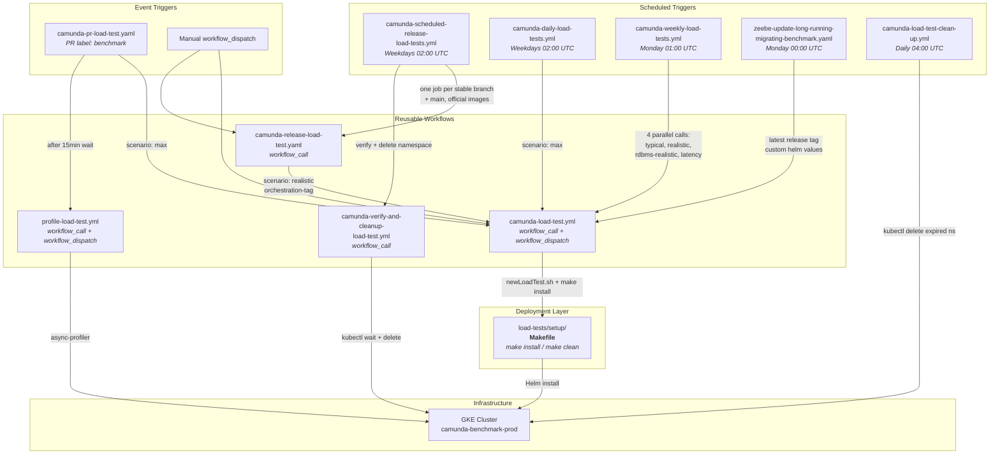

# Camunda Load Tests

Load tests validate the reliability and performance of Camunda 8 across releases and development branches. They can be created via automated GitHub Actions workflows or manually (via Makefiles) on a GKE cluster (`camunda-benchmark-prod`), deploying the [Camunda Platform Helm Chart](https://github.com/camunda/camunda-platform-helm) and a custom [load test Helm chart](https://github.com/camunda/camunda-load-tests-helm).

For background on goals, test variants, and observability, see the [reliability testing documentation](../docs/testing/reliability-testing.md).

## Directory Layout

|   Directory    |                                                                            Description                                                                            |
|----------------|-------------------------------------------------------------------------------------------------------------------------------------------------------------------|
| `setup/`       | Makefiles, shell scripts, and Helm values for deploying load tests ([README](setup/README.md))                                                                    |
| `load-tester/` | Java load test applications (starters and workers) ([README](load-tester/README.md))                                                                              |
| `docs/`        | Additional documentation: [directory structure history](docs/directory-structure.md), [scripts](docs/scripts/README.md), [past failures](docs/failures/README.md) |

## Quick Start

Prerequisites: access to the GKE benchmark cluster via [Teleport](https://camunda.teleport.sh).

### Via GitHub Actions (recommended)

Trigger the [Camunda load test workflow](https://github.com/camunda/camunda/actions/workflows/camunda-load-test.yml) via the UI. Select a branch, name your test, and choose a scenario.

### Via Makefile (manual)

```bash
cd load-tests/setup
./newLoadTest.sh <name> <storage-type> <ttl-days> <enable-optimize>
cd <name>
make install
```

See the [setup README](setup/README.md) for full details.

## Workflow Overview

All automated load tests flow through `camunda-load-test.yml`, which builds images and deploys via the same Makefiles used for manual deployments.



### Schedule

|       Time       |                       Workflow                       | Frequency |
|------------------|------------------------------------------------------|-----------|
| 00:00 UTC Monday | `zeebe-update-long-running-migrating-benchmark.yaml` | Weekly    |
| 01:00 UTC Monday | `camunda-weekly-load-tests.yml`                      | Weekly    |
| 02:00 UTC Mon-Fri| `camunda-scheduled-release-load-tests.yml`           | Weekdays  |
| 04:00 UTC        | `camunda-daily-load-tests.yml`                       | Daily     |
| 04:00 UTC        | `camunda-load-test-clean-up.yml`                     | Daily     |

For detailed inputs, triggers, and job definitions, see each workflow's header comments in [`.github/workflows/`](../.github/workflows/). For branch-specific path differences, see [directory structure history](docs/directory-structure.md).
