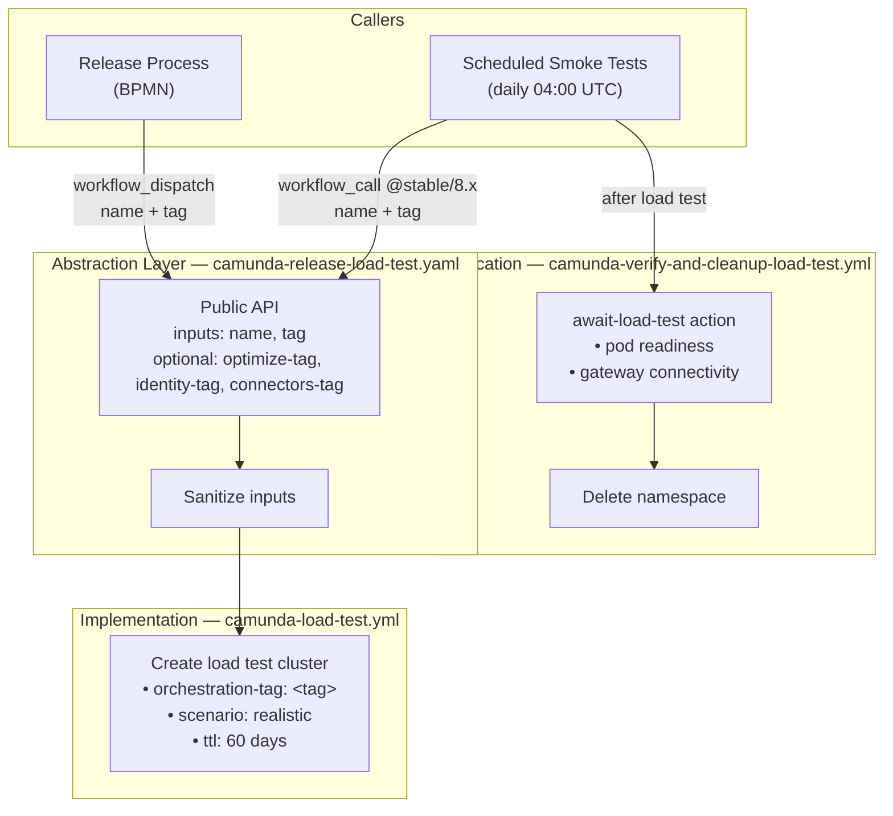
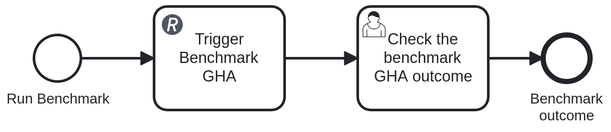
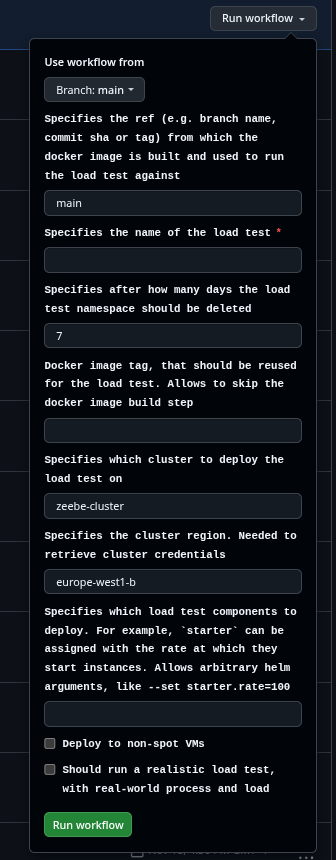
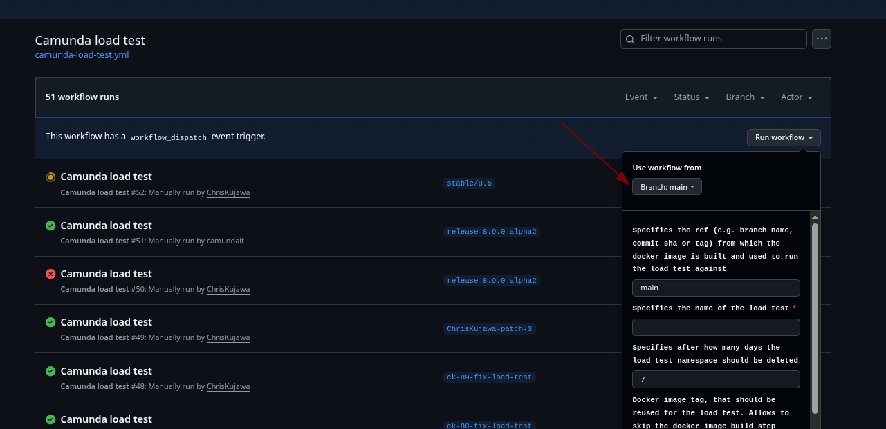
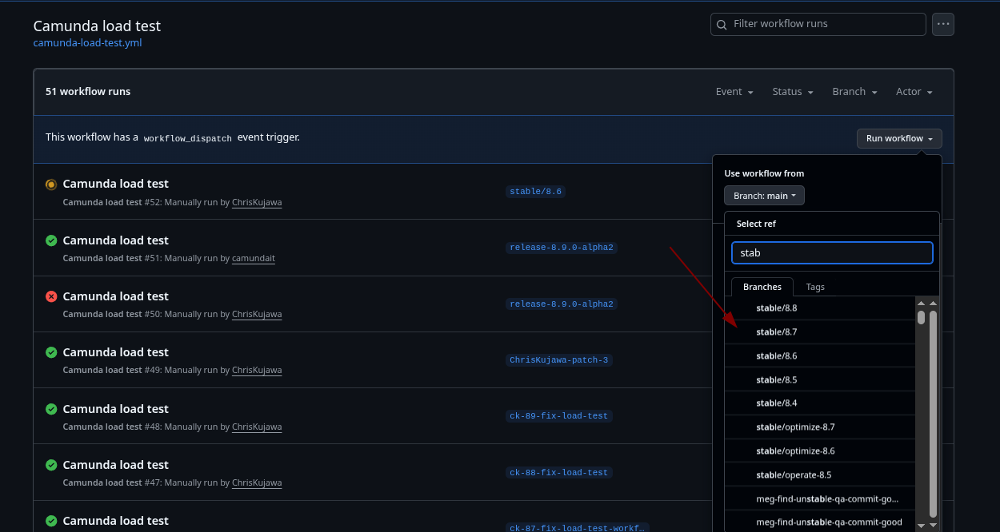
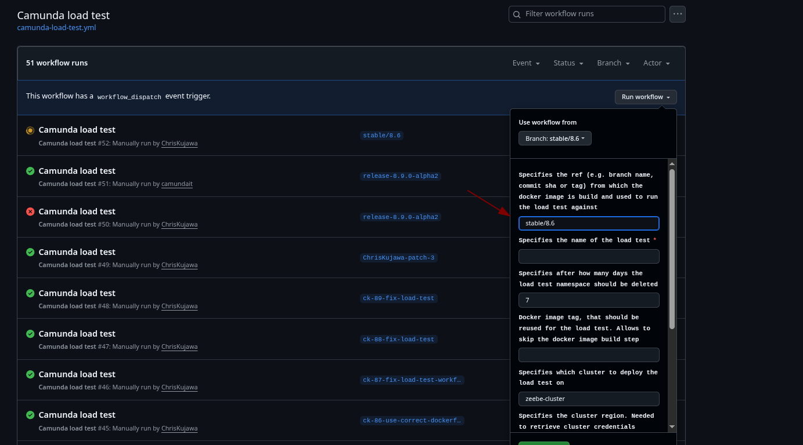
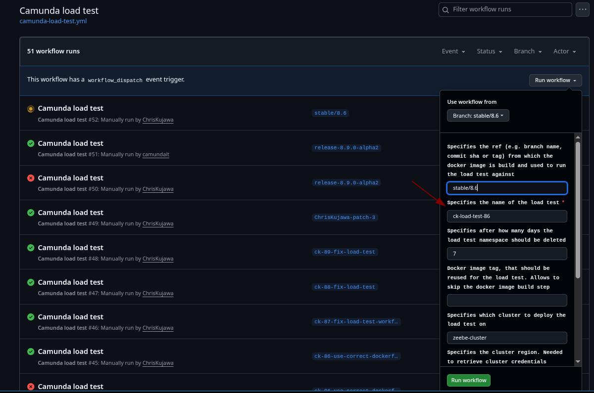
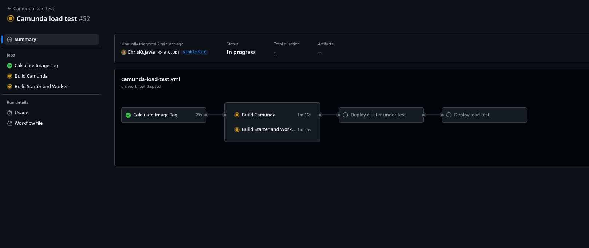

# Welcome

Welcome to the Camunda Load test :wave:

## Introduction

Make sure you have access to our Google Cloud environment. Ask the team or Infra for help, if necessary.

<<<<<<< HEAD
More details can also be found in our [reliability testing documentation](../docs/testing/reliability-testing.md).
=======
|   Directory    |                                                                            Description                                                                            |
|----------------|-------------------------------------------------------------------------------------------------------------------------------------------------------------------|
| `setup/`       | Makefiles, shell scripts, and Helm values for deploying load tests ([README](setup/README.md))                                                                    |
| `load-tester/` | Java load test applications (starters and workers) ([README](load-tester/README.md))                                                                              |
| `docs/`        | Additional documentation: [scripts](docs/scripts/README.md), [past failures](docs/failures/README.md)                                                            |
>>>>>>> d206d91a (docs: remove dead link to docs/directory-structure.md in load-tests README)

## What's next?

* [Run a load test](setup/README.md)
* [Change the Project](project/README.md)

### Via GitHub Actions (recommended)

Trigger the [Camunda load test workflow](https://github.com/camunda/camunda/actions/workflows/camunda-load-test.yml) via the UI. Select a branch, name your test, and choose a scenario.

### Via Makefile (manual)

```bash
cd load-tests/setup
./newLoadTest.sh <name> <storage-type> <ttl-days> <enable-optimize>
cd <name>
make install
```

See the [setup README](setup/README.md) for full details.

## Workflow Overview

All automated load tests flow through `camunda-load-test.yml`, which builds images and deploys via the same Makefiles used for manual deployments.


### Schedule

|       Time       |                       Workflow                       | Frequency |
|------------------|------------------------------------------------------|-----------|
| 00:00 UTC Monday | `zeebe-update-long-running-migrating-benchmark.yaml` | Weekly    |
| 01:00 UTC Monday | `camunda-weekly-load-tests.yml`                      | Weekly    |
| 04:00 UTC        | `camunda-scheduled-release-load-tests.yml`           | Daily     |
| 04:00 UTC        | `camunda-daily-load-tests.yml`                       | Daily     |
| 04:00 UTC        | `camunda-load-test-clean-up.yml`                     | Daily     |

For detailed inputs, triggers, and job definitions, see each workflow's header comments in [`.github/workflows/`](../.github/workflows/).

## Test Scenarios

We have different scenarios targeting different use cases and versions. All use the same [setup architecture](../docs/testing/reliability-testing.md#setup) and [endurance test variants](../docs/testing/reliability-testing.md#endurance-test-variants) described in the reliability testing documentation.

### Release load tests

For every [supported/maintained](https://confluence.camunda.com/pages/viewpage.action?pageId=245400921&spaceKey=HAN&title=Standard%2Band%2BExtended%2BSupport%2BPeriods) version, we run a continuous load test with a realistic workload. They are created or updated [as part of the release process](https://github.com/camunda/zeebe-engineering-processes/blob/main/src/main/resources/release/setup_benchmark.bpmn), which triggers the [Camunda release load test workflow](https://github.com/camunda/camunda/blob/main/.github/workflows/camunda-release-load-test.yaml).

**Goal:** Validating the reliability of our releases and detecting earlier issues, especially with alpha versions and updates.

**Validation:** The tailored [Zeebe Medic Dashboard](https://dashboard.benchmark.camunda.cloud/d/zeebe-medic-benchmark/zeebe-medic-benchmarks?orgId=1&refresh=1m) can be used to observe and validate the performance of the different load tests.

#### Architecture

The release load test workflow acts as an abstraction layer between the release process and the underlying load test infrastructure, with a simple public API accepting `name` and `tag` as required inputs, plus optional per-component image tag overrides (`optimize-tag`, `identity-tag`, `connectors-tag`).



This decoupling provides several benefits:

- **Clear API**: The release process only needs to provide a test name and tag — implementation details (official images, realistic scenario, TTL) are encapsulated in the release load test workflow.
- **Independent evolution**: Changes to load test infrastructure (helm values, Makefiles, scripts) don't require changes to the release process BPMN.
- **Per-branch workflows**: Each stable branch has its own copy of the release load test workflow (via backports), ensuring the correct infrastructure files are used for each version.
- **Daily smoke tests**: The [scheduled release load test workflow](https://github.com/camunda/camunda/blob/main/.github/workflows/camunda-scheduled-release-load-tests.yml) validates daily that release load tests can be created for all active stable branches.

#### Setup and integration

The release load tests are created as part of the [release process](https://github.com/camunda/zeebe-engineering-processes/blob/main/src/main/resources/release/setup_benchmark.bpmn#L7-L18) via a "Setup benchmark" sub-process.



The REST-Connector calls the GitHub API (`https://api.github.com/repos/camunda/camunda/actions/workflows/camunda-release-load-test.yaml/dispatches`) to trigger the [Camunda release load test workflow](https://github.com/camunda/camunda/blob/main/.github/workflows/camunda-release-load-test.yaml) on a specific git reference.

> [!Important]
>
> This event will only trigger a workflow run if the workflow file exists on the default branch.
> https://docs.github.com/en/actions/reference/workflows-and-actions/events-that-trigger-workflows#workflow_dispatch

An example payload:

```json
{
    "ref": workflow_ref_name,
    "inputs": {
      "name": benchmark_name,
      "tag": release_tag,
      "optimize-tag": "optional, Docker Hub tag for Optimize",
      "identity-tag": "optional, Docker Hub tag for Identity",
      "connectors-tag": "optional, Docker Hub tag for Connectors"
    }
}
```

Example values from a past release:

|      Variable       |  Example Value  |             Description             |
|---------------------|-----------------|-------------------------------------|
| `workflow_ref_name` | `stable/8.7`    | The stable branch to trigger on     |
| `release_tag`       | `8.7.17`        | The release tag to use for the test |
| `benchmark_name`    | `release-8-7-x` | The name of the load test           |

#### Scheduled smoke tests

The [scheduled release load test workflow](https://github.com/camunda/camunda/blob/main/.github/workflows/camunda-scheduled-release-load-tests.yml) runs daily at 04:00 UTC to validate that release load tests can be created for all active stable branches (8.6, 8.7, 8.8, 8.9) and main. Each branch's load test is created by calling the release load test workflow on that branch (`@stable/8.x`), ensuring the correct infrastructure files are used.

After deployment, each load test is verified by the [verify-and-cleanup workflow](https://github.com/camunda/camunda/blob/main/.github/workflows/camunda-verify-and-cleanup-load-test.yml), which:

1. Waits for all pods to be ready
2. Checks gateway connectivity via the `app.connected` gauge metric
3. Deletes the namespace (regardless of verification outcome)

Results are posted to the `#reliability-testing-alerts` Slack channel.

> [!Note]
>
> The scheduled workflow uses hardcoded release tags per stable branch. Patch releases do not require updates — only new minor versions (e.g., 8.10) or deprecated branches need the workflow to be updated.

### Weekly load tests

Weekly load tests run against the state of the **main** branch via the [Camunda load test GitHub workflow](https://github.com/camunda/camunda/actions/workflows/camunda-load-test.yml). They are automatically created every Monday and run for 4 weeks, then cleaned up by the [TTL checker](https://github.com/camunda/camunda/blob/main/.github/workflows/camunda-load-test-clean-up.yml). This results in 12 concurrent weekly tests (three variants × four weeks).

The weekly tests cover two [realistic load](../docs/testing/reliability-testing.md#realistic-load) variants (one with Elasticsearch, one with PostgreSQL) plus the [latency test](../docs/testing/reliability-testing.md#latency-load-test).

**Goal:** Validating the reliability of the current main, detecting newly introduced instabilities, memory leaks, and performance degradation.

**Validation:** The tailored [Zeebe Medic Dashboard](https://dashboard.benchmark.camunda.cloud/d/zeebe-medic-benchmark/zeebe-medic-benchmarks?orgId=1&refresh=1m) can be used to observe and validate the performance of the different load tests.

Example running tests (naming pattern: `medic-y-<year>-cw-<week>-<sha>-<variant>`):

- `medic-y-2025-cw-22-a60d64da-test-latency`
- `medic-y-2025-cw-22-a60d64da-test-realistic`
- `medic-y-2025-cw-22-a60d64da-test-rdbms-realistic`

**Expectations:** If an issue prevents a test from working properly and no workaround is available, the test can be deleted to save resources.

### Daily load tests

Daily stress tests run against the state of the **main** branch via the [Camunda load test GitHub workflow](https://github.com/camunda/camunda/actions/workflows/camunda-load-test.yml).

**Goal:** Validating the reliability of the current main under stress, and detecting newly introduced instabilities with a short feedback loop.

**Benefits:**

- Better overview of system performance trends over time
- Earlier regression detection — shorter feedback loop when something breaks
- Daily sanity check that load tests work with current Helm charts and application

**Validation:** TBD — explicit dashboard with KPIs is tracked in [#42274](https://github.com/camunda/camunda/issues/42274).

### Ad-hoc load tests

Ad-hoc load tests can be triggered in three ways:

1. **Label a PR** with the [**benchmark**](https://github.com/camunda/camunda/labels/benchmark) label — triggers the [PR load test workflow](https://github.com/camunda/camunda/blob/main/.github/workflows/camunda-pr-load-test.yaml), which builds a Docker image from the PR branch and deploys a load test. No customization is possible.
2. **Trigger the [Camunda load test workflow](https://github.com/camunda/camunda/actions/workflows/camunda-load-test.yml) manually** — the easiest way to get full customization (branch, version, TTL, scenario, existing image, Helm args).
3. **Deploy manually** — maximum flexibility; see the [setup README](setup/README.md). For SaaS clusters, see [load-testing Camunda SaaS](setup/README.md#load-testing-camunda-saas).

**Goal:** Quick validation of specific changes, reducing the feedback loop for stability, reliability, or performance concerns.

**Validation:** Use the [Zeebe Dashboard](https://dashboard.benchmark.camunda.cloud/d/zeebe-dashboard/zeebe?orgId=1) for general monitoring. For performance-focused tests, the [Camunda Performance Dashboard](https://dashboard.benchmark.camunda.cloud/d/camunda-benchmarks/camunda-performance?orgId=1) is more useful.

**Requirement:** Always prefix the namespace with your initials so we can identify ownership. The `c8-` prefix is added implicitly by the tooling. Example: `pp-stable-vms-october` → Kubernetes namespace `c8-pp-stable-vms-october`.

#### Triggering the load test workflow



To run a load test for an **older version** (until 8.6), select the respective workflow revision in the dispatch form:



Select the revision for the desired version:



This ensures the right Helm chart version and values file are used. Specify a branch, tag, or commit SHA as the ref — it doesn't need to match the stable branch exactly but should be version-compatible.



Always use an identifiable name prefix:



Monitor progress in the Actions tab:


