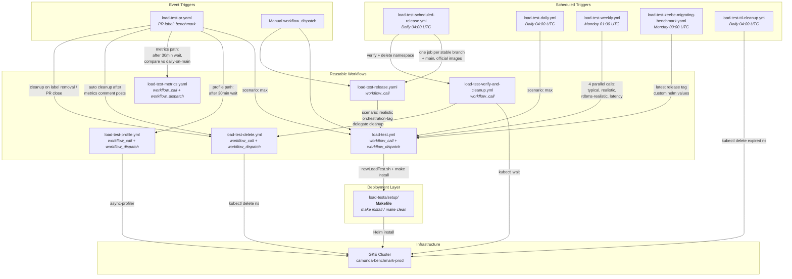

# Welcome

Welcome to the Camunda Load test :wave:

## Introduction

Make sure you have access to our Google Cloud environment. Ask the team or Infra for help, if necessary.

More details can also be found in our [reliability testing documentation](../docs/testing/reliability-testing.md).

## What's next?

* [Run a load test](setup/README.md)
* [Change the Project](project/README.md)

### Via GitHub Actions (recommended)

Trigger the [Camunda load test workflow](https://github.com/camunda/camunda/actions/workflows/load-test.yml) via the UI. Select a branch, name your test, and choose a scenario.

### Via Makefile (manual)

```bash
cd load-tests/setup
./newLoadTest.sh <name> <storage-type> <ttl-days> <enable-optimize>
cd <name>
make install
```

See the [setup README](setup/README.md) for full details.

## Workflow Overview

All automated load tests flow through `load-test.yml`, which builds images and deploys via the same Makefiles used for manual deployments.


```mermaid
graph TD
    subgraph "Scheduled Triggers"
        SCHEDULED["load-test-scheduled-release.yml<br/><i>Daily 04:00 UTC</i>"]
        DAILY["load-test-daily.yml<br/><i>Daily 04:00 UTC</i>"]
        WEEKLY["load-test-weekly.yml<br/><i>Monday 01:00 UTC</i>"]
        ROLLING["load-test-zeebe-migrating-<br/>benchmark.yaml<br/><i>Monday 00:00 UTC</i>"]
        CLEANUP["load-test-ttl-cleanup.yml<br/><i>Daily 04:00 UTC</i>"]
    end

    subgraph "Event Triggers"
        PR["load-test-pr.yaml<br/><i>PR label: benchmark</i>"]
        ADHOC["Manual workflow_dispatch"]
    end

    subgraph "Reusable Workflows"
        RELEASE["load-test-release.yaml<br/><i>workflow_call</i>"]
        CORE["load-test.yml<br/><i>workflow_call + workflow_dispatch</i>"]
        VERIFY["load-test-verify-and-cleanup.yml<br/><i>workflow_call</i>"]
        PROFILE["load-test-profile.yml<br/><i>workflow_call + workflow_dispatch</i>"]
        METRICS["load-test-metrics.yaml<br/><i>workflow_call + workflow_dispatch</i>"]
        DELETE["load-test-delete.yml<br/><i>workflow_call + workflow_dispatch</i>"]
    end

    subgraph "Deployment Layer"
        MAKEFILE["load-tests/setup/<br/><b>Makefile</b><br/><i>make install / make clean</i>"]
    end

    subgraph "Infrastructure"
        GKE["GKE Cluster<br/>camunda-benchmark-prod"]
    end

    SCHEDULED -- "one job per stable branch<br/>+ main, official images" --> RELEASE
    SCHEDULED -- "verify + delete namespace" --> VERIFY
    DAILY -- "scenario: max" --> CORE
    WEEKLY -- "4 parallel calls:<br/>typical, realistic,<br/>rdbms-realistic, latency" --> CORE
    ROLLING -- "latest release tag<br/>custom helm values" --> CORE
    RELEASE -- "scenario: realistic<br/>orchestration-tag" --> CORE
    PR -- "scenario: max" --> CORE
    PR -- "profile path:<br/>after 30min wait" --> PROFILE
    PR -- "metrics path:<br/>after 30min wait,<br/>compare vs daily-on-main" --> METRICS
    ADHOC --> CORE
    ADHOC --> RELEASE

    CORE -- "newLoadTest.sh + make install" --> MAKEFILE
    MAKEFILE -- "Helm install" --> GKE
    PROFILE -- "async-profiler" --> GKE
    VERIFY -- "kubectl wait" --> GKE
    VERIFY -- "delegate cleanup" --> DELETE
    PR -- "auto cleanup after<br/>metrics comment posts" --> DELETE
    PR -- "cleanup on label removal / PR close" --> DELETE
    DELETE -- "kubectl delete ns" --> GKE
    CLEANUP -- "kubectl delete expired ns" --> GKE
```

### Schedule

|       Time       |                  Workflow                  | Frequency |
|------------------|--------------------------------------------|-----------|
| 00:00 UTC Monday | `load-test-zeebe-migrating-benchmark.yaml` | Weekly    |
| 01:00 UTC Monday | `load-test-weekly.yml`                     | Weekly    |
| 04:00 UTC        | `load-test-scheduled-release.yml`          | Daily     |
| 04:00 UTC        | `load-test-daily.yml`                      | Daily     |
| 04:00 UTC        | `camunda-load-test-clean-up.yml`           | Daily     |

For detailed inputs, triggers, and job definitions, see each workflow's header comments in [`.github/workflows/`](../.github/workflows/). For branch-specific path differences, see [directory structure history](docs/directory-structure.md).
